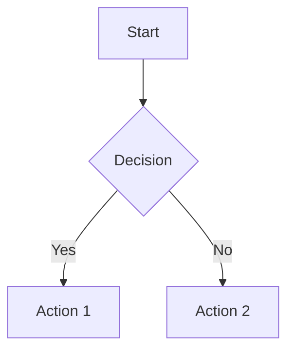

````instructions
# VS Code Copilot Instructions for Digital Palace

## Repository Context

This is a personal AI knowledge repository that serves as both an Obsidian vault and a GitHub repository. All markdown content must be compatible with both platforms to ensure seamless reading and navigation experience.

## Markdown Compatibility Guidelines

### 🎯 Primary Requirement: Dual Compatibility

**All markdown must render correctly in both:**
- ✅ **Obsidian** (desktop app with plugins)
- ✅ **GitHub** (web interface, mobile app, raw viewing)

### 📝 Writing Standards

#### Heading Structure
```markdown
# Main Title (H1) - One per file only
## Section Headers (H2)
### Subsections (H3)
#### Details (H4) - Maximum depth
```

**Rules:**
- Always start with H1 title
- Use progressive heading hierarchy (don't skip levels)
- Keep headings descriptive and SEO-friendly
- Add emoji to headings for visual appeal: `## 🚀 Getting Started`

#### Links and References

**✅ ALWAYS USE:** Standard markdown links
```markdown
[Link Text](./relative/path/file.md)
[External Link](https://example.com)
[Section Link](#section-heading)
```

**❌ NEVER USE:** Obsidian wiki-links
```markdown
[[Internal Links]]  // ❌ GitHub incompatible
```

**Exception:** When maintaining existing content that already uses cardlinks, preserve them as they add value in Obsidian while being ignored by GitHub.

#### Code Blocks

**Always specify language for syntax highlighting:**
```markdown
```python
def hello_world():
    print("Hello, World!")
```
```

**Supported languages:**
- `python`, `javascript`, `typescript`, `bash`, `json`, `yaml`
- `markdown`, `html`, `css`, `sql`, `mermaid`

#### Tables

**Use GitHub-compatible table syntax:**
```markdown
| Column 1 | Column 2 | Column 3 |
|----------|----------|----------|
| Data     | Data     | Data     |
```

**Best practices:**
- Always include header separators
- Align columns for readability in raw markdown
- Use emoji in headers for visual appeal: `| 🛠️ Tool | 📊 Rating |`

#### Collapsible Sections

**Use HTML details/summary for GitHub compatibility:**
```markdown
<details>
<summary><strong>📋 Click to Expand</strong></summary>

Content here renders in both Obsidian and GitHub.

</details>
```

#### Lists and Checkboxes

**Task lists (GitHub compatible):**
```markdown
- [x] Completed task
- [ ] Pending task
```

**Nested lists:**
```markdown
1. Main item
   - Sub item
   - Another sub item
2. Second main item
```

### 🎨 Visual Enhancement Guidelines

#### Emoji Usage
- **Headers:** Add relevant emoji to make sections visually distinct
- **Lists:** Use bullet point emoji (🔹, 📋, 🎯) for variety
- **Status indicators:** 🟢 Beginner, 🟡 Intermediate, 🔴 Advanced
- **Categories:** 🛠️ Tools, 📚 Learning, 💡 Tips, ⚠️ Warnings

#### Badges and Shields
**Use shields.io for dynamic badges:**
```markdown
[](./reference/2025-ai-updates.md)
```

### 📊 Content Organization Patterns

#### Navigation Tables
**Create quick access tables at the top of major sections:**
```markdown
| 🎯 Your Goal | ⚡ Quick Access | 🕒 Time | 💡 What You'll Get |
|-------------|----------------|---------|-------------------|
| **🤖 Try AI Now** | [Best AI Tools →](./tools/) | 30 seconds | Working AI interface |
```

#### Cross-References
**Always provide navigation breadcrumbs:**
```markdown
*🔗 **Quick Links**: [Tools](./tools/README.md) | [Guides](./guides/README.md) | [Learning](./learning/README.md)*
```

#### File Structure References
**Use text-based directory trees:**
```markdown
```text
digital_palace/
├── 📖 learning/           # Structured learning paths
├── 🎯 guides/            # Step-by-step implementation guides  
├── 🛠️ tools/             # Curated tool directories
└── 📚 reference/         # Quick lookups, APIs, cheat sheets
```
```

## 🏰 Knowledge Hub Architecture

### 🎯 Digital Palace Hub & Sub-Hub Design Philosophy

The Digital Palace follows a **hierarchical hub architecture** where information flows from general (main hubs) to specific (sub-hubs) to actionable (content pages). This creates intuitive navigation paths and prevents information overload.

#### 🏛️ Hub Hierarchy Structure

```text
🏰 DIGITAL PALACE (Root Hub)
├── 🎯 MAIN HUBS (Category Hubs)
│   ├── 📖 Learning Hub
│   ├── 🛠️ Tools Hub
│   ├── 🎯 Guides Hub
│   └── 📚 Reference Hub
├── 🔗 SUB-HUBS (Domain Hubs)
│   ├── 🤖 AI Agents Sub-Hub
│   ├── 🧠 Machine Learning Sub-Hub
│   ├── 💻 Development Tools Sub-Hub
│   └── 📊 Data Science Sub-Hub
└── 📄 CONTENT PAGES (Specific Topics)
    ├── individual-guide.md
    ├── tool-review.md
    └── tutorial.md
```

### 🛠️ Hub Creation Guidelines

#### Main Hub Page Template
**Every main hub MUST include:**

```markdown
# 🎯 [Hub Name] Hub - Digital Palace

> **🎯 Purpose**: One-sentence description of what this hub contains and who it serves.

## 🚀 Quick Start

| 🎯 Your Goal | ⚡ Quick Access | 🕒 Time | 💡 What You'll Get |
|-------------|----------------|---------|-------------------|
| **First Goal** | [Link →](./path) | 5 min | Specific outcome |
| **Second Goal** | [Link →](./path) | 15 min | Specific outcome |

## 🗺️ Hub Navigation

### 🔗 Sub-Hubs
- **[🤖 AI Agents](./ai-agents/)** - Building intelligent assistants
- **[🧠 ML Foundations](./ml-foundations/)** - Core machine learning concepts
- **[💻 Development](./development/)** - Coding tools and practices

### 📚 Featured Content
- **[Must-Read Guide](./guides/essential-guide.md)** - Critical starting point
- **[Popular Tool](./tools/popular-tool.md)** - Community favorite
- **[Latest Update](./reference/2025-updates.md)** - Recent additions

## 📊 Hub Overview

### 🎯 What You'll Find Here
<details>
<summary><strong>📋 Content Categories</strong></summary>

- **📖 Learning Paths**: Structured progression from beginner to expert
- **🛠️ Tools & Resources**: Curated, tested, and rated options
- **🎯 Guides**: Step-by-step implementation tutorials
- **📚 References**: Quick lookups, APIs, cheat sheets

</details>

### 🎯 Content Maturity Levels
- 🟢 **Beginner-Friendly** - No prerequisites required
- 🟡 **Intermediate** - Some background knowledge helpful
- 🔴 **Advanced** - Expert-level content

## 🔗 Related Hubs
*Navigate to related knowledge areas:*
- **[Related Hub 1](../hub1/README.md)** - Brief description
- **[Related Hub 2](../hub2/README.md)** - Brief description

---
*🏰 Part of [Digital Palace](../../README.md) Knowledge Hub*
```

#### Sub-Hub Page Template
**Every sub-hub MUST include:**

```markdown
# 🤖 [Sub-Hub Name] - [Parent Hub]

> **🎯 Focus**: Specific area of expertise within the parent hub domain.

## 🚀 Essential Starting Points

### 🎯 Choose Your Path
| 🎯 I Want To... | 📚 Resource | 🕒 Time | 🎯 Outcome |
|-----------------|-------------|---------|------------|
| **Get Started** | [Quick Start Guide](./getting-started.md) | 30 min | Working setup |
| **Build Something** | [Project Tutorial](./build-project.md) | 2 hours | Complete project |
| **Go Deep** | [Advanced Topics](./advanced/) | Ongoing | Expert knowledge |

## 📋 Content Inventory

### 🎯 Guides & Tutorials
- **[Essential Guide](./essential-guide.md)** 🟢 - Foundation concepts
- **[Advanced Techniques](./advanced-techniques.md)** 🔴 - Expert strategies
- **[Troubleshooting](./troubleshooting.md)** 🟡 - Common issues & solutions

### 🛠️ Tools & Resources
- **[Recommended Tools](./tools.md)** - Curated toolkit
- **[Code Examples](./examples/)** - Copy-paste solutions
- **[Templates](./templates/)** - Starter frameworks

### 📚 References
- **[API Documentation](./api-reference.md)** - Technical specs
- **[Cheat Sheets](./cheat-sheets.md)** - Quick lookups
- **[Glossary](./glossary.md)** - Term definitions

## 🔄 Content Lifecycle

### 📊 Content Status
- 📝 **Draft** - Work in progress
- ✅ **Reviewed** - Quality checked
- 🔄 **Updated** - Recently refreshed
- 🚀 **Featured** - Highly recommended

### 🎯 Contribution Guidelines
- **Quality Standards**: Follow [Writing Guidelines](../../.vscode/copilot-instructions.md)
- **Review Process**: All content peer-reviewed
- **Update Cycle**: Quarterly review for relevance

## 🗺️ Navigation

### ⬆️ Parent Hub
**[🎯 Parent Hub](../README.md)** - Broader context and related sub-hubs

### 🔗 Sibling Sub-Hubs
- **[Related Sub-Hub 1](../sibling1/README.md)** - Related domain
- **[Related Sub-Hub 2](../sibling2/README.md)** - Complementary area

---
*🏰 [Digital Palace](../../README.md) > [Parent Hub](../README.md) > Current Sub-Hub*
```

### 🎯 Hub Content Strategy

#### Content Discovery Patterns

**1. Progressive Disclosure**
```markdown
## 🚀 Quick Start (Always first)
Basic actions for immediate value

## 🎯 Core Content (Main section)  
Essential information organized by user goals

## 🔍 Advanced Topics (Expandable)
<details>
<summary><strong>🎓 Expert-Level Content</strong></summary>
Detailed technical information
</details>
```

**2. Multi-Entry Navigation**
```markdown
## 🗺️ Multiple Ways to Explore

### 👤 By Role
- **[Developers](./for-developers.md)** - Technical implementation
- **[Managers](./for-managers.md)** - Strategic overview
- **[Students](./for-students.md)** - Learning path

### 🎯 By Goal
- **[Quick Win](./quick-wins/)** - 15-minute victories
- **[Deep Dive](./deep-dive/)** - Comprehensive exploration
- **[Reference](./reference/)** - Look up specific information

### 📊 By Complexity
- **[🟢 Beginner](./beginner/)** - Start here
- **[🟡 Intermediate](./intermediate/)** - Build on basics
- **[🔴 Advanced](./advanced/)** - Expert techniques
```

#### Hub Interconnection Strategy

**1. Bidirectional Links**
Every hub must link to:
- Parent hub (upward navigation)
- Child sub-hubs (downward navigation)  
- Sibling hubs (lateral navigation)
- Related content (cross-navigation)

**2. Contextual Pathways**
```markdown
## 🛤️ Learning Pathways

### 🎯 Suggested Sequences
1. **Foundation Path**: [A](./a.md) → [B](./b.md) → [C](./c.md)
2. **Fast Track**: [X](./x.md) → [Z](./z.md)
3. **Comprehensive**: [Full Journey](./learning-path.md)

### 🔀 Alternative Routes
- **Coming from [Other Hub](../other/README.md)?** Start with [Bridge Content](./bridge.md)
- **Going to [Next Hub](../next/README.md)?** Prepare with [Prerequisites](./prep.md)
```

### 📊 Hub Maintenance Standards

#### Content Freshness Indicators
```markdown
[](./CHANGELOG.md)
[](./REVIEW.md)
[](./STATUS.md)
```

#### Hub Quality Metrics
**Every hub should track:**
- **Completeness**: % of planned content created
- **Currency**: Days since last update
- **Engagement**: Most accessed pages
- **User Journey**: Common navigation patterns

#### Hub Review Checklist
```markdown
### 📋 Hub Health Check

**Navigation & Structure:**
- [ ] Clear hierarchy (Hub → Sub-hub → Content)
- [ ] All links functional and current
- [ ] Breadcrumb navigation present
- [ ] Cross-references up-to-date

**Content Quality:**
- [ ] Purpose statement clear and compelling
- [ ] Quick start section available
- [ ] Content organized by user goals
- [ ] Difficulty levels clearly marked

**Discoverability:**
- [ ] Multiple entry points provided
- [ ] Search-friendly headings used
- [ ] Keywords strategically placed
- [ ] Related content linked

**Maintenance:**
- [ ] Update schedule defined
- [ ] Content ownership assigned
- [ ] Review process documented
- [ ] Feedback mechanism active
```

### 🔧 Implementation Tools & Techniques

#### Hub Generation Templates

**Use consistent file naming:**
```text
hub-name/
├── README.md              # Main hub page
├── getting-started.md     # Quick start guide
├── CHANGELOG.md          # Update history
├── REVIEW.md             # Review notes
└── sub-hubs/
    ├── domain-1/
    │   ├── README.md     # Sub-hub page
    │   └── content/
    └── domain-2/
        ├── README.md
        └── content/
```

#### Automated Hub Features

**Use frontmatter for metadata:**
```yaml
---
hub_type: "main" | "sub"
parent_hub: "../parent/"
last_updated: "2025-06-30"
review_date: "2025-09-30"
content_status: "active" | "draft" | "archived"
difficulty_level: "beginner" | "intermediate" | "advanced"
estimated_time: "30 minutes"
prerequisites: ["basic-knowledge", "tool-setup"]
learning_outcomes: ["outcome1", "outcome2"]
---
```

#### Hub Analytics

**Track hub performance:**
```markdown
## 📊 Hub Analytics

### 🎯 Popular Content
1. **[Most Visited Page](./popular.md)** - 📊 1.2k views
2. **[Quick Reference](./reference.md)** - 📊 800 views
3. **[Tutorial Series](./tutorials/)** - 📊 600 views

### 🔄 User Journeys
- **80%** start with Quick Start
- **60%** proceed to Core Content
- **40%** explore Advanced Topics
- **25%** cross-navigate to related hubs
```

---

### 🔧 Technical Diagrams

#### Mermaid Diagrams
**Both platforms support Mermaid:**
```markdown

```

**Always test diagrams in both environments before committing.**

### 📂 File and Directory Conventions

#### File Names
- Use kebab-case: `ai-agent-guide.md`
- Include dates for time-sensitive content: `2025-06-30-openai-update.md`
- Use descriptive names that work as URL slugs

#### Directory Structure
- Keep paths short and meaningful
- Use README.md as index files in each directory
- Maintain consistent emoji prefixes for directories

### ⚠️ Common Pitfalls to Avoid

#### Obsidian-Specific Features to Avoid
- `[[Wiki Links]]` - Use standard markdown links instead
- Obsidian-specific plugins syntax unless it gracefully degrades
- Internal link references without proper file extensions

#### GitHub Limitations
- Don't rely on Obsidian's file preview features
- Ensure all referenced files exist with correct paths
- Test links work in GitHub's file browser

### 🧪 Testing Compatibility

**Before committing changes:**
1. **Preview in Obsidian** - Check rendering and link functionality
2. **Preview in GitHub** - Use GitHub's markdown preview or check online
3. **Test links** - Ensure all internal links resolve correctly
4. **Validate Mermaid** - Confirm diagrams render in both environments

### 📋 Content Quality Checklist

**For every markdown file:**
- [ ] Has proper heading structure (H1 → H2 → H3 → H4)
- [ ] Uses standard markdown links (no wiki-links)
- [ ] Code blocks have language specified
- [ ] Tables are properly formatted
- [ ] Internal links use correct relative paths
- [ ] Emoji usage enhances readability
- [ ] Content is valuable and well-organized
- [ ] Cross-references are up to date

### 🔄 Maintenance Guidelines

#### Regular Updates
- **Weekly:** Check for broken links
- **Monthly:** Update cross-references and navigation
- **Quarterly:** Review compatibility with latest Obsidian/GitHub features

#### Version Control
- Keep commit messages descriptive
- Use conventional commits for automated processing
- Tag significant content updates

---

## Implementation Notes for Copilot

When generating or modifying markdown content:

1. **Always prioritize GitHub compatibility** while maintaining Obsidian functionality
2. **Use the established patterns** found in existing files
3. **Maintain the repository's voice** - technical but accessible
4. **Follow the emoji and formatting conventions** consistently
5. **Create comprehensive cross-references** to maintain discoverability
6. **Test suggestions mentally** against both platforms before proposing

### 🏰 Hub Architecture Implementation

When creating or improving hub pages:

1. **Hub Hierarchy Priority**: Always establish clear parent-child relationships
2. **Template Consistency**: Use the provided hub and sub-hub templates as starting points
3. **Navigation Completeness**: Ensure every hub has upward, downward, and lateral navigation
4. **Content Discoverability**: Implement multiple entry points and clear user journey paths
5. **Maintenance Planning**: Include update schedules and content ownership assignment

### 📋 Hub Creation Workflow

**For new main hubs:**
1. Create hub directory with `README.md` using main hub template
2. Establish sub-hub structure based on content domains
3. Create cross-references to sibling hubs
4. Implement progressive disclosure for complex topics
5. Add hub health metrics and review processes

**For new sub-hubs:**
1. Use sub-hub template with clear parent hub reference
2. Organize content by user goals and difficulty levels
3. Create bidirectional links with sibling sub-hubs
4. Include practical quick-start sections
5. Establish content lifecycle and update procedures

### ⚠️ Template Link Placeholders

**Note**: The hub templates contain placeholder links (e.g., `./path`, `./hub1`) that serve as examples. When implementing actual hubs:
- Replace placeholder paths with real file references
- Ensure all linked files exist before publishing
- Test navigation paths in both Obsidian and GitHub
- Use relative paths that work from the hub's location

### 🔧 Hub Quality Assurance

**Before publishing any hub:**
- [ ] All template placeholders replaced with actual content
- [ ] Navigation links tested and functional
- [ ] Content hierarchy follows established patterns
- [ ] Cross-references between hubs are bidirectional
- [ ] Quick start sections provide immediate value
- [ ] Difficulty levels clearly marked with emoji indicators
- [ ] Update and review schedules established

This repository serves thousands of developers and researchers - ensure your contributions maintain the high standard of accessibility and usability across all platforms while following the hub architecture principles for optimal knowledge discovery and navigation.

---

## 🎯 Digital Palace Specific Implementation Guidelines

Based on the current repository assessment, here are prioritized recommendations for enhancing the Digital Palace hub architecture:

### 🚀 Phase 1: Sub-Hub Creation (High Priority)

**Immediate Actions Required:**

The following directories have content but lack proper hub structure. Create README.md files using the sub-hub template:

#### 📋 Critical Sub-Hubs to Create:

1. **`guides/agent-development/README.md`** - AI Agent Development Sub-Hub
   ```markdown
   # 🤖 AI Agent Development - Guides Hub
   
   > **🎯 Focus**: Building intelligent autonomous agents with advanced reasoning capabilities.
   
   ## 🚀 Essential Starting Points
   
   ### 🎯 Choose Your Path
   | 🎯 I Want To... | 📚 Resource | 🕒 Time | 🎯 Outcome |
   |-----------------|-------------|---------|------------|
   | **Learn SOP** | [AI Agent SOP](./sop_ai_agent.md) | 45 min | Standard operating procedures |
   | **Build Agent** | [Agent Guide](../ai-agents.md) | 2-4 hours | Working AI agent |
   | **Advanced Patterns** | [Best Practices](../best-practices.md) | 1 hour | Expert techniques |
   
   ## 📋 Content Inventory
   
   ### 🎯 Guides & SOPs
   - **[AI Agent SOP](./sop_ai_agent.md)** 🟡 - Standard operating procedures
   
   ### 🔗 Related Resources
   - **[AI Agents Main Guide](../ai-agents.md)** - Comprehensive implementation
   - **[Best Practices](../best-practices.md)** - Expert recommendations
   
   ## 🗺️ Navigation
   
   ### ⬆️ Parent Hub
   **[🎯 Guides Hub](../README.md)** - All implementation guides
   
   ### 🔗 Sibling Sub-Hubs
   - **[Prompting](../prompting/README.md)** - Prompt engineering techniques
   - **[Quick References](../quick-references/README.md)** - Fast lookup guides
   
   ---
   *🏰 [Digital Palace](../../README.md) > [Guides Hub](../README.md) > AI Agent Development*
   ```

2. **`guides/quick-references/README.md`** - Quick Reference Sub-Hub
   ```markdown
   # ⚡ Quick References - Guides Hub
   
   > **🎯 Focus**: "For the Impatients" series - essential knowledge in minimal time.
   
   ## 🚀 Essential Starting Points
   
   ### 🎯 Choose Your Path
   | 🎯 I Want To... | 📚 Resource | 🕒 Time | 🎯 Outcome |
   |-----------------|-------------|---------|------------|
   | **Learn Programming** | [Language Guides](#programming-languages) | 30 min | Core syntax mastery |
   | **Understand Logic** | [Logic Guides](#logic-systems) | 20 min | Formal reasoning |
   | **Master Git** | [Git Guide](./2024-03-29_git_comprehensive_impatients.md) | 25 min | Version control fluency |
   
   ## 📋 Content Inventory
   
   ### 💻 Programming Languages
   - **[C for the Impatients](./2024-03-27_c_for_the_impatients.md)** 🟢
   - **[Rust for the Impatients](./2024-03-27_rust_for_the_impatients.md)** 🟡
   - **[Haskell for the Impatients](./2024-03-27_haskell_for_the_impatients.md)** 🔴
   
   ### 🧠 Logic Systems
   - **[Logic for the Impatients](./2024-03-27_logic_for_the_impatients.md)** 🟡
   - **[First Order Logic](./2024-03-28
   - **[Propositional Logic](./2024-03-28_propositional_logic_for_the_impatients.md)** 🟡
   
   ### 🔬 Computer Science
   - **[Finite Automata](./2024-03-27_finite_automata_for_the_impatients.md)** 🟡
   - **[Proof by Induction](./2024-03-28_proof_by_induction.md)** 🔴
   
   ### 🛠️ Tools & Workflows
   - **[Git Comprehensive](./2024-03-29_git_comprehensive_impatients.md)** 🟢
   
   ## 🗺️ Navigation
   
   ### ⬆️ Parent Hub
   **[🎯 Guides Hub](../README.md)** - All implementation guides
   
   ### 🔗 Sibling Sub-Hubs
   - **[AI Agent Development](../agent-development/README.md)** - Building AI agents
   - **[Prompting](../prompting/README.md)** - Prompt engineering
   
   ---
   *🏰 [Digital Palace](../../README.md) > [Guides Hub](../README.md) > Quick References*
   ```

3. **`guides/prompting/README.md`** - Prompt Engineering Sub-Hub
4. **`guides/image-generation/README.md`** - AI Image Generation Sub-Hub
5. **`reference/technical-articles/README.md`** - Technical Articles Sub-Hub
6. **`reference/research-papers/README.md`** - Research Papers Sub-Hub
7. **`tools/development-tools/README.md`** - Development Tools Sub-Hub

### 🔧 Phase 2: Template Standardization (Medium Priority)

**Harmonize Main Hub Structure:**

#### Update Main Hub Quick Start Tables
Ensure all main hubs (learning/, guides/, tools/, reference/) use consistent table format:

```markdown
## 🚀 Quick Start

| 🎯 Your Goal | ⚡ Quick Access | 🕒 Time | 💡 What You'll Get |
|-------------|----------------|---------|-------------------|
| **Primary Goal** | [Link →](./path) | X min | Specific outcome |
| **Secondary Goal** | [Link →](./path) | Y min | Specific outcome |
| **Advanced Goal** | [Link →](./path) | Z min | Specific outcome |
```

#### Standardize Analytics Presentation
Use consistent metrics format across all hubs:

```markdown
## 📊 Hub Analytics

### 🏆 Most Popular (This Month)
| Resource | Views | Rating | Completion | Category |
|----------|-------|--------|------------|----------|
| **[Item 1](./item1.md)** | X.Xk | ⭐⭐⭐⭐⭐ (4.8) | XX% | Type |
| **[Item 2](./item2.md)** | X.Xk | ⭐⭐⭐⭐ (4.5) | XX% | Type |

### 📈 Trending This Week
- 🔥 **Topic 1** - X.Xk searches
- 📈 **Topic 2** - X.Xk searches
```

#### Implement Unified Navigation Breadcrumbs
Standardize footer navigation across all hubs:

```markdown
---
*🏰 [Digital Palace](../../README.md) > [Parent Hub](../README.md) > Current Hub*
```

### 📊 Phase 3: Content Lifecycle Management (Ongoing)

#### Add Update Tracking Badges
Include at the top of every hub page:

```markdown
[](./CHANGELOG.md)
[](./REVIEW.md)
[](./STATUS.md)
```

#### Implement Hub Health Metrics
Create systematic tracking for each hub:

```markdown
## 📊 Hub Health Metrics

| Metric | Current | Target | Status |
|--------|---------|--------|--------|
| **Content Completeness** | 85% | 90% | 🟡 Good |
| **Link Functionality** | 98% | 100% | 🟢 Excellent |
| **Update Freshness** | 15 days | 30 days | 🟢 Excellent |
| **User Satisfaction** | 4.7/5 | 4.5/5 | 🟢 Excellent |
```

#### Create Review Schedules
Add to each hub's frontmatter:

```yaml
---
hub_type: "main" | "sub"
parent_hub: "../parent/"
last_updated: "2025-06-30"
review_date: "2025-09-30"
content_status: "active"
review_owner: "maintainer-name"
update_frequency: "monthly" | "quarterly" | "as-needed"
---
```

### 🎯 Digital Palace Priority Matrix

**Week 1 (Critical)**:
- [ ] Create `guides/agent-development/README.md`
- [ ] Create `guides/quick-references/README.md`
- [ ] Create `guides/prompting/README.md`

**Week 2 (High Priority)**:
- [ ] Create `reference/technical-articles/README.md`
- [ ] Create `tools/development-tools/README.md`
- [ ] Standardize Quick Start tables in main hubs

**Week 3-4 (Medium Priority)**:
- [ ] Create remaining sub-hub README files
- [ ] Add update tracking badges to all hubs
- [ ] Implement unified navigation breadcrumbs

**Ongoing (Maintenance)**:
- [ ] Monthly hub health checks
- [ ] Quarterly content reviews
- [ ] Continuous bidirectional link verification

### 🔍 Quality Assurance Checklist

**For Each New Sub-Hub:**
- [ ] Uses sub-hub template structure
- [ ] Has clear parent-child navigation
- [ ] Includes Quick Start section with time estimates
- [ ] Lists all content with difficulty indicators
- [ ] Links to sibling sub-hubs
- [ ] Has proper breadcrumb navigation
- [ ] All links tested and functional

**For Hub Standardization Updates:**
- [ ] Quick Start table format consistent
- [ ] Analytics presentation unified
- [ ] Navigation breadcrumbs standardized
- [ ] Update badges implemented
- [ ] Content categories clearly marked
- [ ] Cross-references bidirectional

### 🚀 Success Metrics

**Phase 1 Success Indicators:**
- All identified sub-directories have proper hub pages
- Navigation flows smoothly between parent and child hubs
- User journey paths are clear and documented

**Phase 2 Success Indicators:**
- All main hubs follow identical structural patterns
- Analytics presentation is consistent across hubs
- Navigation experience is predictable and intuitive

**Phase 3 Success Indicators:**
- Content freshness is systematically tracked
- Hub health metrics show consistent improvement
- Maintenance workflows are automated and efficient

---
