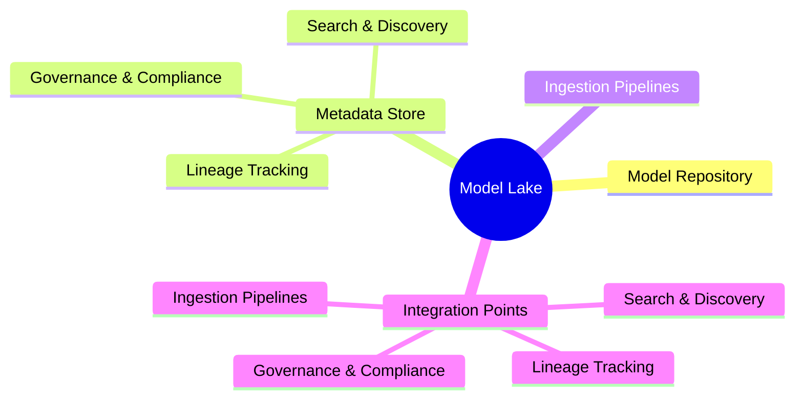
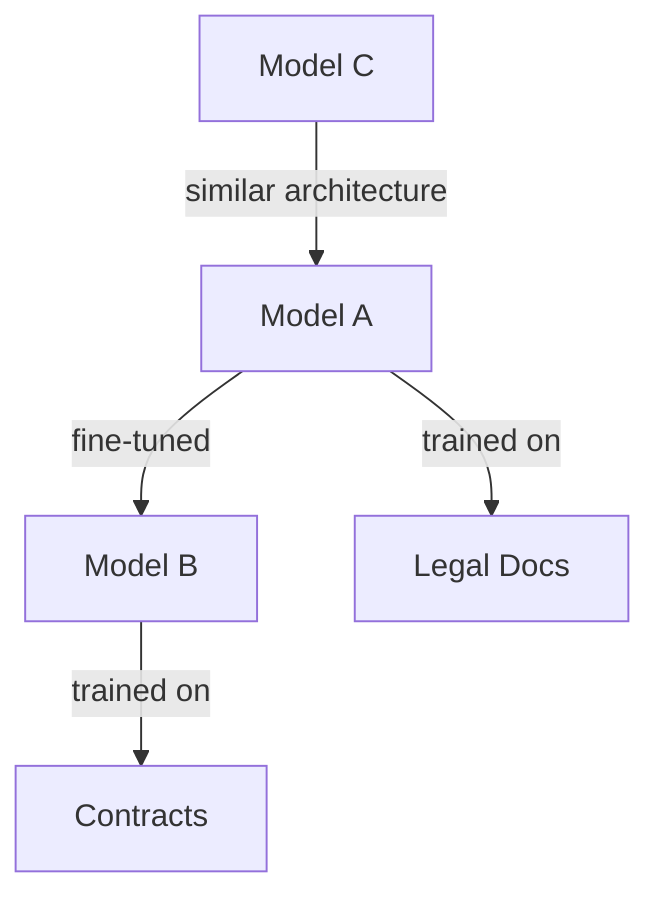
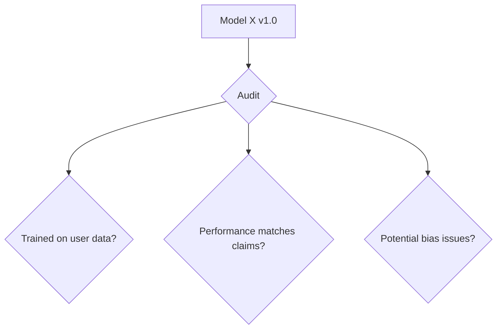
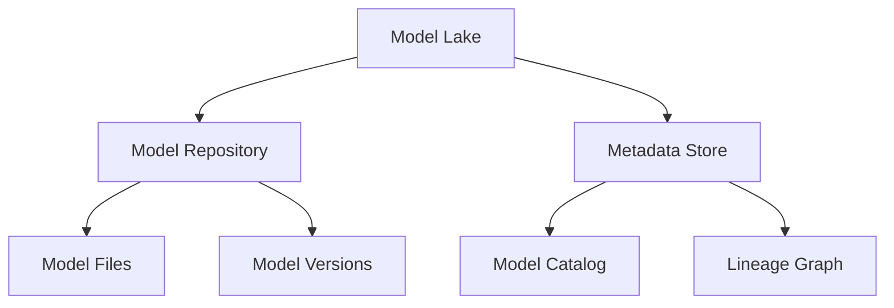
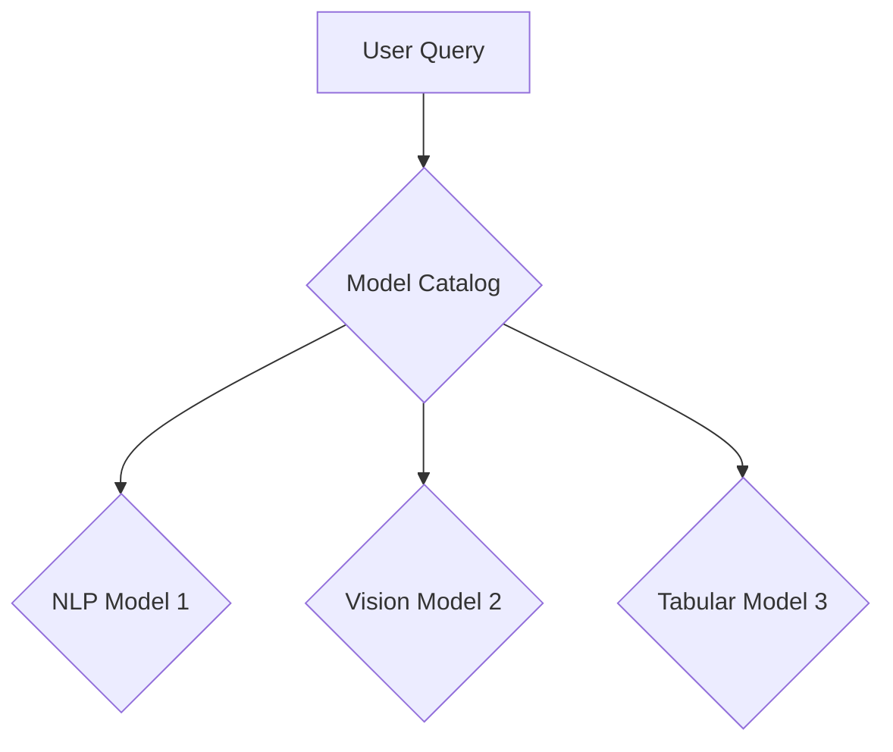
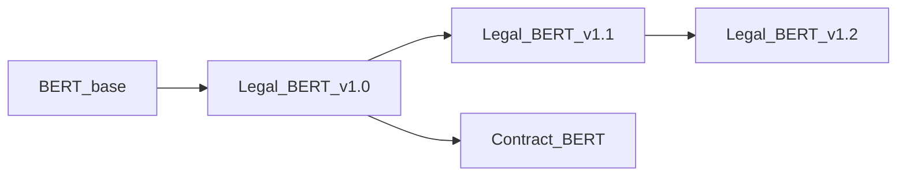
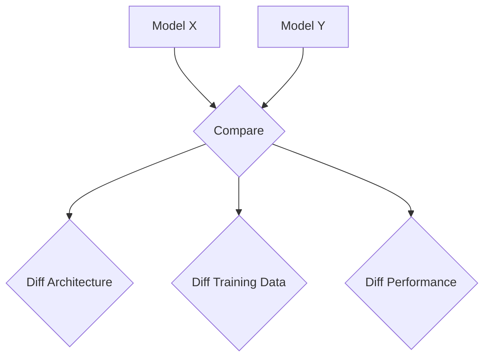
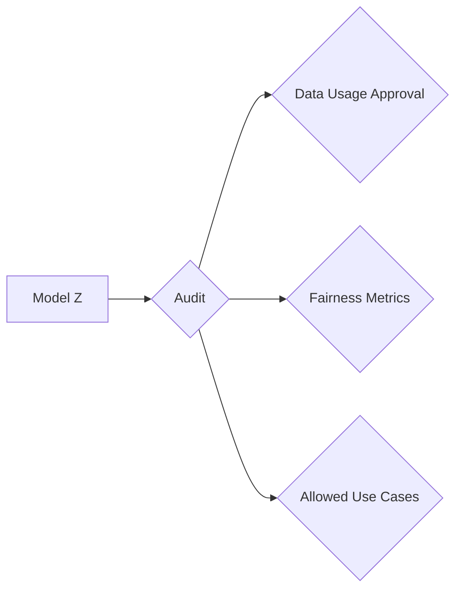
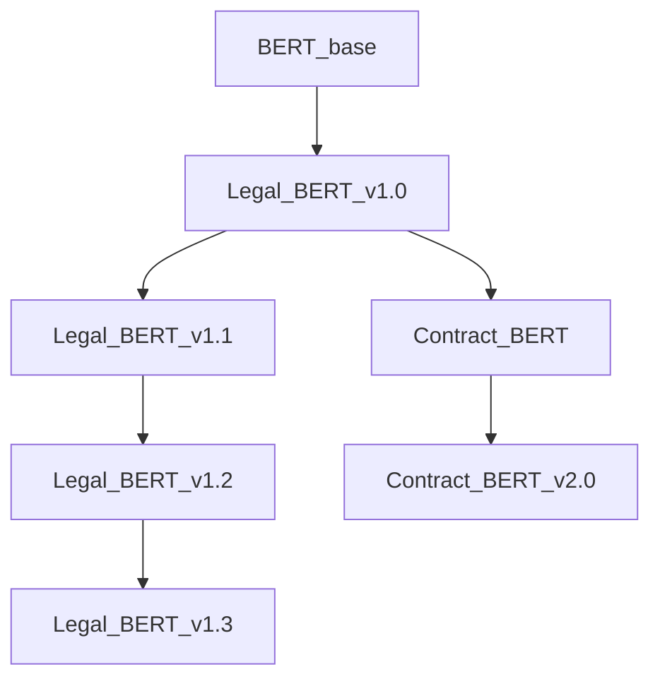
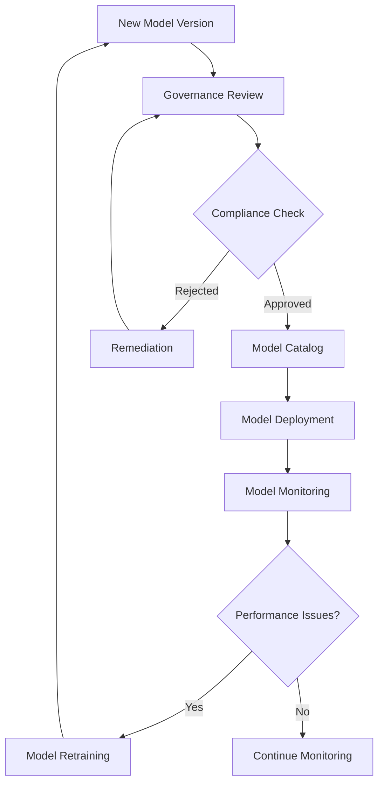

# AI : The raise of the Models DataLake ... 
## Introduction

As Artificial Intelligence (AI) continues to revolutionize industries from healthcare to finance, the number of AI models in use is skyrocketing. 

Thousands of new deep learning models are being developed and deployed every day, each with unique architectures, training data, and capabilities. While this proliferation of models is powering incredible innovations, it's also creating a new set of challenges:

- **How can we find the right model for a given task among this vast ocean of options?**
- **How do we understand what a model does, how it was trained, and how it relates to other models?**
- **How can we ensure responsible development and usage of AI when models and their lineage are opaque?**


However, as the number of models continues to grow exponentially, a new challenge emerges: how do we effectively find, understand, and manage this heterogeneous collection of AI models? This is where the concept of "Model Lakes" introduced by the research paper [arXiv:2403.02327] comes into play.

Tackling these challenges head-on, researchers have proposed a powerful new paradigm called "Model Lakes" - centralized repositories for storing, searching, and managing AI models at scale, much like data lakes do for raw data. Let's dive in and explore how model lakes can help us navigate the rising tide of AI...


      
## The Need for Model Lakes

### Discovering the Right Model

Imagine you're a developer looking for a pre-trained language model to analyze customer support tickets. You head over to your company's model lake, which contains thousands of models trained on various data for different tasks. How will you find the proverbial needle in this haystack? Searching by model name or manually skimming documentation simply won't cut it at this scale.

Model lakes offer a better way...

Instead of relying on model names or manual tags, model lakes can enable search based on the actual *content* and *behavior* of models. Techniques like model embeddings represent models in a semantic vector space, allowing you to search by asking questions like: *"Find me models that can summarize formal documents in a friendly tone"*. The model lake matches this query against the embeddings to surface the most relevant models based on their capabilities.

Have a model that works well but want to find even better options? Model lakes can identify "related models" - those with similar architectures, training data or behavior to a given model. This allows you to easily discover and compare models to find the best fit.

To really understand what's in the lake, model lakes can organize models into a knowledge graph based on their relationships (e.g. model B was fine-tuned from model A) and properties (e.g. trained on legal documents). Intuitive graph visualizations allow you to explore the model landscape at a glance.



### Tracking Model Lineage

The rise of transfer learning means new models are often created by fine-tuning or modifying existing models. This creates complex "family trees" of models that can be hard to track. Model lakes offer key capabilities to surface and represent these lineage relationships...

By analyzing and comparing model weights and architectures, model lakes can automatically identify different versions of the same base model. This allows you to track how models evolve over time as they are fine-tuned on new data or domains. Curious what actually changed between two versions of a model? Model lakes can pinpoint the specific architecture changes, updated weights, or data differences between models, making it crystal clear how they differ - like a GitHub diff but for models!

Model lakes maintain a full audit trail of a model's origins and evolution. This model provenance allows you to trace a model's lineage back through fine-tuning, data updates, and architecture changes, to the original pre-trained model it came from.

### Ensuring Responsible AI

The complexity and opacity of modern AI can make it difficult to ensure models are developed and used responsibly. Model lakes offer a lifeline by providing unprecedented transparency into models and their lineage...

With full model provenance and transparent versioning, model lakes make it possible to audit models for potential issues like bias, fairness gaps, or data leakage. Stakeholders can examine a model's full lineage to verify it was trained appropriately. Model lakes can help keep model documentation honest by cross-referencing it against actual model metadata, automatically surfacing cases where the documented training data, architecture, or performance claims don't match reality.

Just as data lakes enable data lineage and citation, model lakes can ensure every model and dataset is properly cited when used. This gives credit where it's due and maintains accountability in the model development ecosystem.



## The Model Lake Architecture

At its core, a model lake is a centralized repository that stores AI models and associated metadata. We can organize this repository into a structured hierarchy:



**Model Repository**: This is where the actual model files (weights, architectures, etc.) are stored. Models are organized into distinct directories per model, with subdirectories for each version of that model.

**Metadata Store**: This database stores all the metadata about models in the lake. The model catalog contains descriptive information, and the lineage graph captures relationships between models.

For each model in the lake, we'd collect and store rich metadata including:

- **Basic Info**: Model name, description, author, creation date, etc.
- **Architecture**: Model type (CNN, LSTM, transformer, etc.), architecture diagram, layer sizes, hyperparameters
- **Training**: Training datasets used, training algorithm, loss curves, final accuracy metrics
- **Lineage**: Source model(s) this model was adapted from, fine-tuning datasets, diff from parent models
- **Usage**: Recommended use cases, example inputs/outputs, performance benchmarks
- **Governance**: Data usage approvals, bias & fairness checks, applicable regulations

Here's an example of what the metadata for a single model might look like:

```json
{
  "name": "Legal_BERT_v1.2",
  "description": "BERT model fine-tuned on legal contracts for document classification",
  "author": "John Doe",
  "created": "2023-01-15",
  "base_model": "BERT_base_uncased",
  "training_data": "ContractNet_2022, BigLaw_Docs_2021",
  "accuracy": 0.98,
  "use_cases": ["Contract Classification", "Legal Document Tagging"],
  "example_inputs": ["This agreement is between..."],
  "data_approvals": ["DUA_2022_015", "GDPR_compliant"],
  ...
}
```

With this structure and metadata in place, the model lake can power a variety of key use cases:

### Model Search and Discovery

Users can search the model catalog using natural language queries that get matched against model metadata. Results can be ranked by relevance and filtered by facets like model type, dataset, or accuracy.



### Lineage Tracking and Visualization

The lineage graph allows users to explore the "family tree" of models - tracing the lineage of a given model back through the models it was adapted from, all the way to the original pre-trained models.



### Model Comparison and Diffing

By storing version information and diffs between models, the lake allows users to easily compare two models to understand their differences across architecture, training data, performance, etc.



### Governance and Compliance

The rich governance metadata allows compliance teams to audit models for adherence to data regulations, bias testing, appropriate use cases, and more.



By organizing models and metadata in this structured way, the model lake becomes a powerful tool for managing and leveraging AI models at scale across the organization. The lake acts as a single source of truth for model discovery, comparison, lineage, and governance. Of course, the specific structure and metadata collected may vary based on an organization's unique needs and use cases. But this example illustrates the core concepts and benefits of the model lake approach.

With a well-designed lake, organizations can turn the flood of AI models from a challenge into an opportunity - surfacing insights, ensuring responsible usage, and driving value from their AI investments.


## Diving Deeper: Key Capabilities of Model Lakes

### 1. Model Search and Discovery

#### Model Embeddings and Semantic Search

There are various techniques for generating model embeddings, such as:

1. **Architecture Embeddings**: Encoding the model's architecture (e.g., layer types, sizes, connections) into a vector representation.

2. **Weight Embeddings**: Compressing the model's weights (parameters) into a lower-dimensional embedding space.

3. **Behavior Embeddings**: Capturing the model's behavior by observing its outputs on a representative set of inputs and encoding these input-output pairs into an embedding.

Once we have these model embeddings, we can leverage techniques from natural language processing and information retrieval to enable semantic search over the model lake.

This approach is far more powerful than traditional keyword-based search, as it can understand the intent behind the query and match it to the actual behavior and capabilities of the models, rather than relying on manually assigned tags or descriptions.

#### Example: Semantic Model Search

Let's illustrate this with an example. Suppose we have a model lake containing thousands of language models trained on various datasets for different tasks. A user wants to find a model that can summarize legal contracts in plain language.

With a traditional keyword-based search, the user might try queries like "legal contract summarization model" or "plain language summarizer." However, this approach has several limitations:

1. **Vocabulary Mismatch**: The user's query terms might not match the exact keywords or descriptions used for the relevant models.
2. **Lack of Context**: Simple keyword matching cannot capture the nuanced intent behind the query (e.g., summarizing formal documents in a friendly tone).
3. **Limited Relevance**: The search results might include models that happen to contain the query terms but are not actually suitable for the desired task.

In contrast, with a model lake powered by semantic search, the user can pose a more natural query like "Find me models that can summarize legal contracts in plain language for non-experts." The system would then:

1. Encode this query into a vector representation (query embedding) using natural language processing techniques.
2. Compare the query embedding against the pre-computed embeddings of all models in the lake, identifying those with the closest match in the embedding space.
3. Rank and return the most relevant models based on this embedding similarity, along with their metadata (e.g., training data, performance metrics, usage examples).

This approach allows the user to express their intent more naturally, and the system can match that intent to the actual capabilities of the models, rather than relying on brittle keyword matching. The user can quickly find the most suitable models for their task, without having to sift through irrelevant results or struggle with vocabulary mismatches.

#### Faceted Search and Filtering

While semantic search is powerful, users may also want to narrow down their search results based on specific criteria or facets. Model lakes can support faceted search and filtering, allowing users to refine their queries based on attributes like:

- Model type (e.g., CNN, LSTM, Transformer)
- Training data domain (e.g., legal, medical, finance)
- Performance metrics (e.g., accuracy, F1 score)
- Governance attributes (e.g., data usage approvals, bias testing)

For example, a user could start with a broad semantic query like "Find me models for document classification," and then filter the results to only show transformer models trained on legal data with an accuracy above 0.9 and GDPR compliance.

This combination of semantic search and faceted filtering provides a flexible and intuitive way for users to explore the model lake and quickly find the models that best fit their needs.

### 2. Model Lineage Tracking and Visualization

The rise of transfer learning and model adaptation has led to complex "family trees" of models, where new models are created by fine-tuning or modifying existing ones. Keeping track of these lineage relationships is crucial for understanding a model's origins, capabilities, and potential biases or limitations.

Model lakes offer powerful capabilities for tracking and visualizing model lineage, allowing users to trace a model's evolution back to its roots.

#### Lineage Graph and Provenance

At the core of this capability is the lineage graph, a data structure that captures the relationships between models in the lake. This graph represents how models are derived from one another through fine-tuning, architecture changes, or data updates.

For example, consider the following lineage graph:


In this graph, we can see that the `Legal_BERT_v1.0` model was fine-tuned from the original `BERT_base` model. This model was then further adapted into two separate branches: `Legal_BERT_v1.1` (with additional fine-tuning) and `Contract_BERT` (likely fine-tuned on a different dataset). Finally, `Legal_BERT_v1.2` was derived from `Legal_BERT_v1.1`.

By traversing this lineage graph, users can trace the full provenance of a model - understanding its origins, the datasets it was trained on, and the specific modifications or fine-tuning steps that led to its current state.

This provenance information is invaluable for:

- **Auditing and Compliance**: Verifying that a model was trained and adapted using approved datasets and processes, adhering to relevant regulations and policies.
- **Reproducibility**: Recreating the exact steps and data used to train a model, enabling reproducible research and development.
- **Bias and Fairness Analysis**: Examining the lineage to identify potential sources of bias or unfairness introduced through the training data or fine-tuning process.
- **Model Evolution**: Understanding how a model has evolved over time, and comparing its performance or behavior across different versions.

#### Lineage Visualization and Exploration

While the lineage graph provides the underlying data structure, model lakes can also offer intuitive visualizations and exploration tools to make this information more accessible and actionable.



For example, a model lake could provide an interactive lineage visualization tool, allowing users to visually explore the relationships between models. Users could zoom in on specific branches of the lineage graph, view metadata and performance metrics for each model, and even compare different versions side-by-side to understand how the model has changed over time.

These visualizations could also incorporate additional metadata, such as the training datasets used for each model, the specific fine-tuning techniques applied, or the performance metrics achieved at each stage of the lineage.

By combining the power of the lineage graph with intuitive visualizations and exploration tools, model lakes can empower users to truly understand the origins, evolution, and capabilities of the models they are working with.

### 3. Model Comparison and Diffing

As models evolve through fine-tuning, architecture changes, or data updates, it becomes increasingly important to understand the differences between different versions or variants of a model. Model lakes can provide powerful capabilities for comparing and diffing models, enabling users to gain insights into how models have changed and make informed decisions about which version to use or deploy.

#### Model Versioning and Diffing

At the core of this capability is the ability to store and version models within the model lake. Each time a model is updated or adapted, a new version is created and stored alongside the previous versions. This versioning system allows users to track changes over time and easily access specific versions of a model.

With versioned models in place, model lakes can then provide tools for diffing or comparing different versions of a model. These tools can analyze and highlight the differences between two versions across various dimensions, such as:

- **Architecture Diff**: Identify changes in the model's architecture, such as added or removed layers, modified layer sizes, or changes in connections between layers.
- **Weight Diff**: Compare the model's weights (parameters) between versions, highlighting the specific weights that have changed and the magnitude of those changes.
- **Data Diff**: If models were fine-tuned on different datasets, the diff can show the differences in the training data used for each version.
- **Performance Diff**: Compare the performance metrics (e.g., accuracy, F1 score, loss curves) achieved by each version of the model, potentially on different evaluation datasets.

These diffs can be presented in various formats, such as side-by-side visualizations, tabular comparisons, or even interactive tools that allow users to explore the differences in detail.

#### Use Cases for Model Comparison

The ability to compare and diff models has numerous practical applications:

- **Model Selection**: When multiple versions or variants of a model are available, users can compare their performance, architectures, and training data to make informed decisions about which model to use or deploy for a specific task.
- **Debugging and Troubleshooting**: If a new version of a model exhibits unexpected behavior or performance issues, diffing it against the previous version can help identify the root cause, whether it's a change in the architecture, weights, or training data.
- **Incremental Development**: By understanding the specific changes between model versions, developers can more effectively iterate and improve upon existing models, rather than starting from scratch each time.
- **Reproducibility and Auditing**: Model diffs can be used to verify that a model was trained and adapted as expected, ensuring reproducibility and compliance with established processes and policies.

Overall, the ability to compare and diff models is a powerful tool for understanding, debugging, and iterating on AI models, enabling more efficient and effective model development and deployment.

### 4. Governance and Responsible AI

As AI systems become more prevalent and impactful, ensuring responsible development and deployment of these systems is of paramount importance. Model lakes can play a crucial role in enabling governance and responsible AI practices by providing transparency, auditability, and control over AI models and their lineage.




#### Model Auditing and Compliance

One of the key governance capabilities of model lakes is the ability to audit models for compliance with relevant regulations, policies, and ethical guidelines. By maintaining a comprehensive record of a model's lineage, training data, and metadata, model lakes enable thorough audits and compliance checks.

For example, compliance teams could use the model lake to verify that a particular model was trained using approved datasets, adhering to data privacy and usage regulations like GDPR or HIPAA. They could also check that the model has undergone required bias and fairness testing, and that its performance metrics meet established thresholds.

Additionally, model lakes can enforce governance policies by restricting access to certain models or functionalities based on user roles and permissions. For instance, only authorized users might be allowed to deploy models into production environments, or certain models might be restricted from use cases involving sensitive data or high-risk applications.

#### Responsible AI Practices

Beyond compliance auditing, model lakes can also support responsible AI practices by providing transparency and accountability throughout the model development lifecycle.

For example, the lineage tracking capabilities of model lakes can help identify potential sources of bias or unfairness introduced through the training data or fine-tuning process. By examining the lineage of a model, developers and auditors can trace back to the original datasets and fine-tuning steps, and potentially uncover issues like underrepresented or skewed data that could lead to biased model behavior.

Model lakes can also ensure proper attribution and citation of models and datasets, promoting accountability and giving credit where it's due. This can help prevent issues like uncredited use of proprietary models or datasets, and encourage responsible sharing and reuse of AI resources.

Furthermore, by providing a centralized repository and comprehensive metadata for models, model lakes can facilitate collaboration and knowledge sharing among teams and organizations working on AI projects. This can help promote best practices, avoid duplication of effort, and foster a culture of responsible AI development.

### 5. Integration and Interoperability

While model lakes offer powerful capabilities for managing and leveraging AI models, their true value is realized when they are seamlessly integrated into existing workflows and ecosystems. Model lakes must be designed with interoperability in mind, enabling smooth integration with a wide range of tools and platforms used throughout the AI development lifecycle.

#### Integration with Model Development Frameworks

One of the key integration points for model lakes is with popular model development frameworks and libraries, such as TensorFlow, PyTorch, scikit-learn, and others. By providing seamless integration with these frameworks, model lakes can automatically capture and store relevant model information and metadata as models are developed, trained, and fine-tuned.

For example, a model lake could integrate with TensorFlow's model serialization and checkpointing mechanisms, automatically storing model architectures, weights, and training metadata (e.g., loss curves, hyperparameters) in the lake as models are saved or checkpointed during training.

Similarly, integration with model management tools like MLflow or DVC could enable automatic versioning, tracking, and storage of models and their associated metadata in the model lake, streamlining the process of managing and organizing models as they evolve.

Here is a continuation of the detailed article on "Model Lakes":

### Integration with CI/CD and Deployment Pipelines

Another critical integration point is with continuous integration/continuous deployment (CI/CD) pipelines and model deployment tools. By integrating with these systems, model lakes can ensure that models are properly versioned, tracked, and validated before being deployed to production environments.

For example, a CI/CD pipeline could be configured to automatically register new model versions in the model lake as part of the build and testing process. This would capture the model's architecture, weights, training metadata, and performance metrics, associating them with the specific code commit or release version.

Before deploying a model to production, the pipeline could query the model lake to retrieve the model's lineage, governance metadata (e.g., data usage approvals, bias testing results), and other relevant information. This information could then be used to validate that the model meets the necessary compliance and governance requirements for deployment.

Additionally, the model lake could provide deployment tools or APIs that allow approved and validated models to be easily retrieved and deployed to various target environments (e.g., cloud platforms, edge devices, mobile apps).

#### Integration with Model Monitoring and Feedback Loops

Once models are deployed, it's crucial to monitor their performance and behavior in real-world scenarios. Model lakes can integrate with model monitoring tools and feedback loops to capture and store this runtime information, further enriching the model's metadata and enabling continuous improvement.

For example, a model monitoring system could periodically send performance metrics, error logs, and input/output samples back to the model lake, associating them with the specific model version deployed in production. This runtime data could then be used to track the model's performance over time, identify potential issues or drift, and inform decisions about when to retrain or update the model.

Furthermore, by capturing real-world input data and user feedback, model lakes can enable continuous learning and improvement of models. This data could be used to fine-tune or retrain models, with the updated versions being versioned and stored back in the model lake, creating a virtuous cycle of model development and deployment.

#### Integration with External Model Repositories and Marketplaces

While model lakes are designed to be centralized repositories within an organization, they can also integrate with external model repositories and marketplaces, enabling the sharing and reuse of models across organizations and communities.

For example, a model lake could be configured to periodically sync with public model repositories like Hugging Face or AI Model Zoo, importing relevant models and their metadata into the lake. This would allow organizations to leverage pre-trained models from the broader AI community, while still maintaining control and governance over how those models are used and adapted within their own environments.

Conversely, organizations could choose to publish their own models to external repositories or marketplaces, either for public use or for controlled sharing with partners or customers. The model lake could facilitate this process by providing tools for packaging and exporting models, along with their associated metadata and lineage information, ensuring that the necessary context and provenance is preserved when models are shared externally.

By enabling these various integration points, model lakes can become a central hub for managing and leveraging AI models throughout their entire lifecycle, from development and training to deployment, monitoring, and continuous improvement. This seamless integration with existing tools and workflows is crucial for ensuring the widespread adoption and practical impact of model lakes within organizations.

## Implementing Model Lakes: Architectural Considerations

While the concept of model lakes is powerful, realizing their full potential requires careful architectural design and implementation. In this section, we'll explore some of the key architectural considerations and technologies that can be leveraged to build robust and scalable model lake solutions.

### Distributed Storage and Metadata Management

At the core of a model lake is the need to store and manage large volumes of model files and associated metadata. This requires a scalable and distributed storage solution that can handle the unique characteristics of AI models, such as large file sizes, frequent versioning, and complex metadata structures.

#### Model File Storage

For storing the actual model files (weights, architectures, etc.), organizations can leverage various distributed file systems and object storage solutions, such as:

- **Hadoop Distributed File System (HDFS)**: A highly fault-tolerant distributed file system designed to run on commodity hardware, making it a cost-effective option for storing large volumes of model files.
- **Cloud Object Storage**: Cloud providers like AWS (S3), Google Cloud (Cloud Storage), and Microsoft Azure (Blob Storage) offer highly scalable and durable object storage services that can be used to store model files.
- **Distributed Databases**: Certain distributed databases, like Apache Cassandra or ScyllaDB, can also be used for storing and retrieving model files, leveraging their built-in replication and partitioning capabilities for scalability.

When choosing a storage solution, factors like performance (read/write throughput), durability, cost, and integration with other components of the model lake architecture should be considered.

#### Metadata Management

While model files can be stored in distributed file systems or object stores, managing the associated metadata (model catalog, lineage graph, governance information, etc.) requires a separate metadata management solution. There are several options to consider:

1. **Dedicated Metadata Stores**: Tools like Apache Atlas, Amundsen, or Marquez are designed specifically for managing metadata and lineage information for data and AI assets, making them well-suited for model lakes.

2. **Graph Databases**: Graph databases like Neo4j, Amazon Neptune, or JanusGraph excel at representing and querying complex relationships, making them a natural fit for storing and traversing model lineage graphs.

3. **Relational Databases**: Traditional relational databases like PostgreSQL or MySQL can also be used to store model metadata, particularly if the metadata schema is well-defined and doesn't require complex graph traversals.

4. **Distributed Key-Value Stores**: For simpler metadata storage requirements, distributed key-value stores like Apache Cassandra, Redis, or Amazon DynamoDB can provide a scalable and low-latency solution.

The choice of metadata management solution will depend on factors like the complexity of the metadata schema, the need for graph traversal capabilities, scalability requirements, and integration with other components of the model lake architecture.

### Model Ingestion and Versioning

As models are developed, trained, and updated, they need to be ingested into the model lake in a consistent and versioned manner. This requires robust ingestion pipelines and versioning mechanisms to ensure that model files and metadata are accurately captured and tracked over time.

#### Model Versioning

Proper versioning of models is crucial for tracking changes, enabling rollbacks, and maintaining provenance information. There are several approaches to model versioning:

1. **File-based Versioning**: Each new version of a model can be stored as a separate file or directory within the model repository, with a versioning scheme (e.g., semantic versioning) encoded in the file or directory names.

2. **Database-backed Versioning**: Dedicated model versioning tools like MLflow, DVC, or Git-LFS can be used to store and manage model versions in a centralized database or repository.

3. **Metadata-driven Versioning**: The model lake's metadata store can be used to maintain version information and relationships between different model versions, effectively creating a versioned knowledge graph of models.

Regardless of the approach, it's essential to capture not only the model files themselves but also the associated metadata (training data, hyperparameters, performance metrics, etc.) for each version, enabling comprehensive tracking and comparison of model changes over time.

### Model Search and Discovery

One of the key value propositions of model lakes is the ability to search and discover relevant models based on their content, behavior, and metadata. Implementing this capability requires leveraging techniques from natural language processing, information retrieval, and vector similarity search.

#### Model Embeddings and Semantic Search

As discussed earlier, model embeddings are vector representations of a model's architecture, weights, or behavior, enabling semantic search and similarity comparisons. There are various techniques for generating these embeddings, such as:

- **Architecture Embeddings**: Encoding the model's architecture (layer types, sizes, connections) into a vector representation using techniques like graph neural networks or recursive neural networks.
- **Weight Embeddings**: Compressing the model's weights (parameters) into a lower-dimensional embedding space using dimensionality reduction techniques like Principal Component Analysis (PCA) or autoencoders.
- **Behavior Embeddings**: Capturing the model's behavior by observing its outputs on a representative set of inputs and encoding these input-output pairs into an embedding using techniques like contrastive learning or triplet loss.

Once these embeddings are generated, they can be stored in the model lake's metadata store, enabling efficient similarity search and ranking using techniques like approximate nearest neighbor search (e.g., FAISS, Annoy, HNSW) or semantic search engines (e.g., Elasticsearch, Vespa).

#### Natural Language Processing for Query Understanding

To enable users to search for models using natural language queries, the model lake can leverage natural language processing (NLP) techniques for query understanding and intent extraction. This involves:

1. **Query Embedding**: Encoding the user's natural language query into a vector representation (query embedding) using pre-trained language models or task-specific embeddings.
2. **Intent Classification**: Classifying the user's intent behind the query (e.g., model search, model comparison, lineage exploration) using techniques like text classification or sequence labeling.
3. **Entity Extraction**: Identifying relevant entities (e.g., model names, task types, data domains) within the query using named entity recognition (NER) or entity linking techniques.

By combining the query embedding, intent classification, and entity extraction, the model lake can better understand the user's query and map it to the appropriate search or exploration functionality within the lake.

#### Faceted Search and Filtering

While semantic search is powerful, users may also want to narrow down their search results based on specific criteria or facets. Model lakes can support faceted search and filtering by indexing relevant metadata fields (e.g., model type, training data domain, performance metrics) and enabling users to filter search results based on these facets.

This can be implemented using traditional search engines like Elasticsearch or Solr, which support faceted search and filtering out-of-the-box, or by building custom filtering mechanisms on top of the model lake's metadata store.

### Model Lineage and Provenance Tracking

Tracking the lineage and provenance of models is a critical capability of model lakes, enabling auditing, reproducibility, and responsible AI practices. Implementing this capability requires robust mechanisms for capturing and representing model relationships and evolution over time.

#### Lineage Graph Representation

As discussed earlier, the lineage graph is a data structure that captures the relationships between models in the lake, representing how models are derived from one another through fine-tuning, architecture changes, or data updates.

There are several approaches to representing and storing this lineage graph:

1. **Graph Databases**: Graph databases like Neo4j, Amazon Neptune, or JanusGraph are well-suited for storing and querying complex graph structures like the model lineage graph.
2. **Relational Databases**: Relational databases can also be used to store the lineage graph, with models represented as nodes in a table and relationships represented as edges in a separate table or join table.
3. **Key-Value Stores**: For simpler lineage tracking requirements, key-value stores like Apache Cassandra or Amazon DynamoDB can be used to store model relationships as key-value pairs or nested data structures.

The choice of representation will depend on factors like the complexity of the lineage graph, the need for graph traversal and querying capabilities, and integration with other components of the model lake architecture.

#### Lineage Capture and Propagation

To populate the lineage graph, mechanisms for capturing and propagating lineage information throughout the model development and deployment lifecycle are required. This can be achieved through:

1. **Integration with Model Development Frameworks**: By integrating with popular model development frameworks like TensorFlow, PyTorch, or scikit-learn, the model lake can automatically capture lineage information (e.g., source models, fine-tuning datasets, architecture changes) as models are created, trained, or adapted.

2. **Hooks in CI/CD Pipelines**: Continuous integration and deployment (CI/CD) pipelines can be instrumented with hooks or plugins that capture and propagate lineage information to the model lake as models are built, tested, and deployed.


. **Model Monitoring and Feedback Loops**: Runtime data captured from deployed models (performance metrics, error logs, input/output samples) can be sent back to the model lake, enabling continuous monitoring and improvement of models over time.

By integrating with these various systems and workflows, model lakes can become a central hub for managing and leveraging AI models throughout their entire lifecycle.

### Scalability and Performance Considerations

As the number of models and associated metadata in the lake grows, ensuring scalability and performance becomes critical. Model lakes need to be designed with scalability in mind, leveraging techniques like:

1. **Sharding and Partitioning**: Splitting the model repository and metadata store across multiple nodes or partitions to distribute the storage and processing load.
2. **Caching and Indexing**: Implementing caching mechanisms (e.g., Redis, Memcached) to store frequently accessed models and metadata in memory, reducing latency and improving read performance. Building indexes on key metadata fields to enable fast querying and filtering.
3. **Distributed Processing**: Leveraging distributed processing frameworks like Apache Spark or Dask to parallelize model ingestion, transformation, and analysis workloads across multiple nodes.
4. **Elastic Scaling**: Designing the model lake architecture to scale horizontally by adding or removing nodes based on workload demands, ensuring consistent performance as the lake grows.

By incorporating these scalability techniques, model lakes can handle the growing volume and complexity of AI models and metadata while maintaining fast and reliable performance.

### Security and Access Control

Given the sensitive nature of AI models and their associated data, implementing robust security and access control mechanisms is crucial for model lakes. This involves:

1. **Authentication and Authorization**: Implementing secure authentication mechanisms (e.g., OAuth, JWT) to verify user identities and authorization policies to control access to models and metadata based on user roles and permissions.
2. **Data Encryption**: Encrypting sensitive model files and metadata both at rest and in transit to protect against unauthorized access or leakage.
3. **Audit Logging**: Maintaining detailed audit logs of all access and actions taken on models and metadata, enabling tracking and investigation of potential security incidents.
4. **Data Governance Policies**: Defining and enforcing data governance policies around data usage, retention, and sharing, ensuring compliance with relevant regulations (e.g., GDPR, HIPAA) and organizational standards.

By implementing these security measures, model lakes can ensure the confidentiality, integrity, and availability of AI models and metadata, while enabling secure collaboration and access control across teams and stakeholders.

## Real-world Use Cases and Challenges

While the concept of model lakes is still relatively new, several organizations have already begun implementing similar model management solutions to address the challenges of AI model proliferation and governance.

### Use Case 1: Financial Institution

A large financial institution with a rapidly growing portfolio of AI models across various business units (e.g., fraud detection, credit risk assessment, customer service) implemented a model lake solution to:

- Centralize model storage and management across the organization
- Enable model discovery and reuse across teams, reducing duplication of effort
- Ensure compliance with regulatory requirements around model validation and explainability
- Facilitate model monitoring and continuous improvement in production

By leveraging a model lake, the institution was able to improve collaboration and efficiency across data science teams, reduce time-to-market for new AI applications, and maintain a high standard of model governance and compliance.

### Use Case 2: Healthcare Provider

A major healthcare provider with a wide range of AI models for clinical decision support, patient risk stratification, and operational efficiency implemented a model lake to:

- Manage the complex relationships and dependencies between models, data sources, and clinical workflows
- Enable transparent and auditable model lineage tracking for regulatory compliance
- Facilitate secure collaboration and model sharing across different care settings and institutions
- Integrate with existing clinical systems and data pipelines for seamless model deployment and monitoring

The model lake allowed the healthcare provider to accelerate the adoption of AI in clinical practice while ensuring patient safety, data privacy, and ethical standards.

### Challenges and Limitations

Despite the benefits, implementing model lakes also comes with several challenges and limitations:

1. **Metadata Management Overhead**: Capturing and maintaining accurate and up-to-date metadata for models can be a significant overhead, requiring close collaboration between data scientists, engineers, and governance teams.
2. **Model Versioning Complexity**: As models evolve through multiple versions and adaptations, managing the complexity of the model lineage graph and ensuring consistency and traceability can be challenging.
3. **Proprietary Model Handling**: Dealing with proprietary or third-party models that may have restricted access or usage rights can complicate the model lake implementation and limit the benefits of centralized management.
4. **Organizational Culture Shift**: Adopting a centralized model management approach often requires a significant culture shift within organizations, moving away from siloed and ad-hoc practices towards more collaborative and governed ways of working.

Addressing these challenges requires a combination of technical solutions, organizational process changes, and cross-functional collaboration. However, the long-term benefits of model lakes in terms of efficiency, governance, and value creation make overcoming these challenges a worthwhile endeavor.

## Conclusion

The rapid proliferation of AI models across industries and domains is both an opportunity and a challenge. While the growing diversity and sophistication of models are driving incredible innovations, the lack of standardized management and governance practices threatens to limit the full potential of AI.

Model lakes offer a promising solution to this challenge, providing a centralized and structured approach to storing, discovering, and managing AI models at scale. By leveraging techniques from data management, information retrieval, and graph modeling, model lakes enable organizations to:

- Efficiently discover and reuse relevant models across teams and projects
- Track and understand the complex lineage and evolution of models
- Ensure responsible and compliant development and deployment of AI
- Drive continuous improvement and value creation from AI investments

However, realizing the full potential of model lakes requires more than just technology. It requires a collaborative effort across the AI ecosystem, from researchers and tool developers to data scientists and governance teams. It requires a willingness to adopt new ways of working and a commitment to responsible and transparent AI practices.

As we navigate the rising tide of AI models, model lakes offer a beacon of clarity and a path towards more effective and sustainable AI development. By working together to adopt and refine this powerful paradigm, we can unlock the full potential of AI to drive innovation, efficiency, and positive impact for organizations and society as a whole.

So let us set sail towards a future where AI models are not just created, but also carefully curated, managed, and leveraged to their fullest potential. With model lakes as our guide, we can chart a course towards more responsible, impactful, and transformative AI for all.
