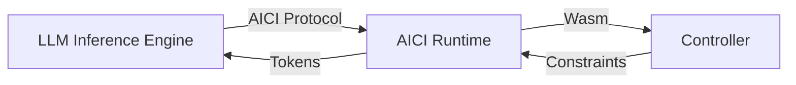

#  AICI: Empowering Developers to Shape LLM Output in Real-Time ... thanks to WebAssembly .. 

## Introduction

The Artificial Intelligence Controller Interface (AICI) is a singular technology that enables developers to create custom controllers for Large Language Models (LLMs). These controllers, written in languages that compile to WebAssembly (Wasm), can constrain and direct the output of LLMs in real-time. By providing a flexible and secure way to incorporate custom logic into the token generation process, AICI opens up a world of possibilities for tailoring LLM output to specific use cases.

In this tutorial, we'll dive deep into AICI, exploring its architecture, key features, and practical applications. We'll walk through setting up a development environment, building and deploying controllers, and using AICI to control LLM output. By the end of this tutorial, you'll have a solid understanding of how to leverage AICI to create powerful, customized LLM applications.

## AICI Architecture

Before we dive into the practical aspects of using AICI, let's take a moment to understand its architecture. AICI acts as an abstraction layer between the LLM inference engine and the controller, allowing them to communicate seamlessly while remaining independent.



The LLM inference engine, such as rLLM or vLLM, communicates with the AICI runtime using the AICI protocol. The AICI runtime, in turn, hosts the controller, which is a Wasm module. The controller can impose constraints on the token generation process, and the AICI runtime relays the generated tokens back to the LLM inference engine.

This architecture offers several key benefits:

1. **Security**: Controllers run in a sandboxed Wasm environment, preventing unauthorized access to system resources.
2. **Performance**: Controllers execute on the CPU in parallel with the GPU-based LLM inference, minimizing overhead.
3. **Flexibility**: Controllers can be written in any language that compiles to Wasm, allowing developers to leverage their existing skills.

## Setting Up the Development Environment

To get started with AICI, you'll need to set up your development environment. This involves installing the necessary tools and dependencies for building and running AICI components.

### Prerequisites

- Rust: AICI is primarily written in Rust, so you'll need to install Rust and Cargo. Follow the official installation guide [here](https://www.rust-lang.org/tools/install).
- Python 3.11+: Some of the example controllers, like `pyctrl`, use Python. Make sure you have Python 3.11 or later installed.
- Git: You'll need Git to clone the AICI repository.

### Installing Dependencies

Once you have the prerequisites in place, you can install the required dependencies. For example, on Ubuntu, you can use the following command:
**Linux**

```bash
sudo apt-get install --assume-yes --no-install-recommends \
    build-essential cmake ccache pkg-config libssl-dev libclang-dev clang llvm-dev git-lfs
    ```
    
**MacOs**

```bash
brew install git cmake ccache
```

**Install Rust:**

```bash
curl --proto '=https' --tlsv1.2 -sSf https://sh.rustup.rs | sh
```

**Install asm32-wasi Rust component**:

```bash
rustup target add wasm32-wasi
```

**Rust update**:

```bash
rutsup update
```


Finally, install the required Python packages:

```bash
pip install pytest pytest-forked ujson posix_ipc numpy requests
```

With the development environment set up, you're ready to build and run AICI components.

## Building and Running AICI Components

AICI consists of several components, including the rLLM server, the AICI runtime, and controllers. Let's walk through building and running these components.

**Clone the project:**


```bash
git clone https://github.com/microsoft/aici
```


### Building and Running the rLLM Server

The rLLM server is an LLM inference engine that supports AICI. It comes in two flavors: `rllm-cuda`, which uses libtorch and CUDA, and `rllm-llamacpp`, which uses llama.cpp. For this tutorial, we'll focus on `rllm-llamacpp`.

To build and run the `rllm-llamacpp` server, navigate to the `rllm/rllm-llamacpp` directory and run:

```bash
./server.sh phi2
```

This command will build and start the server with the `phi2` model. You can pass other model names or paths to the script.

Once the server is running, you can verify its status by opening `http://127.0.0.1:4242/v1/models` in your browser. You should see a JSON response confirming that the selected model is loaded.

### Building and Deploying Controllers

AICI controllers are Wasm modules that contain custom logic for controlling LLM output. The AICI repository includes several example controllers, such as `jsctrl` (JavaScript) and `pyctrl` (Python).

In most cases, you won't need to build the controllers yourself. The rLLM server can automatically download the latest release of `pyctrl` from GitHub. However, if you want to build a controller manually, you can do so using Cargo:

```bash
cd controllers/pyctrl
cargo build --release --target wasm32-wasi
```

This command will build the `pyctrl` controller and generate a Wasm module in the `target/wasm32-wasi/release` directory.

## Controlling LLM Output with AICI

Now that you have the rLLM server running and the controllers ready, let's explore how to use AICI to control LLM output.

### Example: Generating a List of Five Items

Suppose we want the LLM to generate a list of the five most popular types of vehicles. Traditionally, this would involve crafting a carefully worded prompt with specific instructions. However, with AICI, we can simplify the prompt and use code to enforce the desired format and constraints.

Here's an example Python script (`list-of-five.py`) that demonstrates this:

```python
import pyaici.server as aici

async def main():
    prompt = "What are the most popular types of vehicles?\n"
    await aici.FixedTokens(prompt)

    marker = aici.Label()

    for i in range(1,6):
      await aici.FixedTokens(f"{i}.")
      await aici.gen_text(stop_at = "\n")

    await aici.FixedTokens("\n")
    aici.set_var("result", marker.text_since())

aici.start(main())
```

Let's break down what this script does:

1. We define the prompt as a simple question, without specifying the number of items or formatting.
2. We use `aici.FixedTokens()` to send the prompt to the LLM.
3. We create a `marker` using `aici.Label()` to keep track of the generated tokens.
4. We start a loop that iterates five times:
   - We send the list number (e.g., "1.") using `aici.FixedTokens()`.
   - We use `aici.gen_text()` to generate the vehicle name, stopping at a newline character.
5. We send a final newline character to separate the list from any subsequent text.
6. We store the generated list in a `result` variable using `aici.set_var()` and `marker.text_since()`.

To run this script, use the following command:

```bash
./aici.sh run list-of-five.py
```

The output will look something like this:

```
[Response] What are the most popular types of vehicles?
1. Cars
2. Motorcycles
3. Bicycles
4. Trucks
5. Boats
```

As you can see, the LLM generated a well-formatted list of five vehicle types, exactly as we specified in the script.

### Example: Generating Code with a Grammar

Another powerful feature of AICI is the ability to constrain LLM output using formal grammars. This is particularly useful for generating structured text, such as code.

Here's an example script that uses a context-free grammar for the C programming language to generate a function that calculates the Fibonacci sequence:

```python
import pyaici.server as aici

async def main():
    c_grammar = open("aici_abi/grammars/c.y", "r").read()

    prompt = "Please write a C function that recursively calculates the Fibonacci sequence up to n.\n"
    await aici.FixedTokens(prompt)

    await aici.gen_text(max_tokens = 200, yacc=c_grammar, set_var="code", stop_at='\n\n')

aici.start(main())
```

In this script:

1. We load the C grammar from a file using `open()` and `read()`.
2. We define the prompt asking for a C function that calculates the Fibonacci sequence.
3. We use `aici.gen_text()` to generate the function, specifying the following parameters:
   - `max_tokens`: The maximum number of tokens to generate.
   - `yacc`: The context-free grammar to use for constraining the output.
   - `set_var`: The variable to store the generated code in.
   - `stop_at`: The string to stop generation at (in this case, two newline characters).

Running this script will generate a C function that looks something like this:

```c
int fib(int n) {
    if (n <= 1) {
        return n;
    } else {
        return fib(n-1) + fib(n-2);
    }
}
```

The generated code adheres to the structure and syntax of the C programming language, as defined by the provided grammar.

## Conclusion

AICI is a powerful tool for controlling LLM output and creating customized LLM applications. By providing a flexible, secure, and performant way to incorporate custom logic into the token generation process, AICI opens up a world of possibilities for developers.

In this tutorial, we've explored the architecture of AICI, set up a development environment, built and deployed controllers, and used AICI to control LLM output in practical examples. With this knowledge, you're well-equipped to start building your own AICI-powered applications.

Remember, AICI is still a relatively new technology, and there's a lot of room for exploration and innovation. Don't be afraid to experiment with different controllers, grammars, and constraints to see what you can create.

Happy coding!
