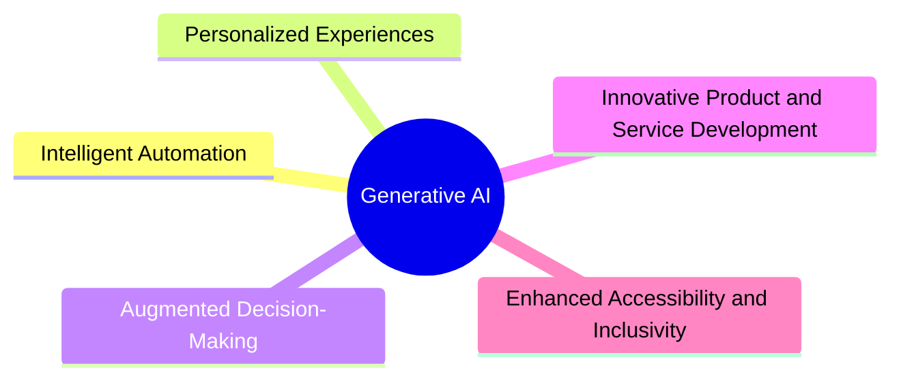

# Unleashing the Power of Generative AI: A Comprehensive Guide

## Introduction

Generative AI, a cutting-edge subset of artificial intelligence, is revolutionizing various industries and domains by leveraging advanced machine learning algorithms and vast amounts of data. This transformative technology has the remarkable ability to create new and original content, spanning text, images, audio, code, and even molecular structures. At its core, generative AI models learn from vast datasets, identifying patterns and relationships, and generating novel outputs that mimic the characteristics of the training data.

The underlying technology behind generative AI models can vary, but many modern implementations employ techniques such as deep learning, generative adversarial networks (GANs), and transformer models. These approaches enable the models to learn and generate high-quality, realistic content that can be tailored to specific applications and use cases.

This comprehensive guide aims to explore the vast potential of generative AI and its practical applications across diverse industries. By showcasing real-world examples and highlighting the benefits, challenges, and future outlook, this report empowers organizations to harness the power of generative AI and drive innovation, efficiency, and competitive advantage.

### Key Benefits of Generative AI:

1. **Intelligent Automation**: Streamline business processes, improve operational efficiency, and reduce costs through automated content generation and task automation.
2. **Personalized Experiences**: Create tailored and engaging experiences for customers, patients, students, and stakeholders by generating personalized content and recommendations.
3. **Augmented Decision-Making**: Leverage generative AI to analyze complex data, identify patterns, and generate insights that support informed and strategic decision-making.
4. **Innovative Product and Service Development**: Accelerate product and service innovation by leveraging generative AI to ideate, prototype, and create novel offerings that meet evolving customer needs.
5. **Enhanced Accessibility and Inclusivity**: Foster a more inclusive and equitable environment by generating accessible content, personalized assistive technologies, and tailored support for individuals with disabilities.

## 1. Intelligent Automation

Generative AI has the power to transform business processes by automating a wide range of tasks, from customer service and HR functions to legal and financial operations. By leveraging generative models, organizations can streamline workflows, reduce manual effort, and improve efficiency and productivity.

### Use Cases and Applications:

- **Finance**: Automate financial forecasting, regulatory reporting, loan application processing, and fraud detection, reducing operational costs and improving compliance.
- **Healthcare**: Streamline patient intake, medical coding, insurance claims processing, and drug development research, enhancing patient care and operational efficiency.
- **Retail**: Automate product recommendations, personalized offers, inventory management, and customer service inquiries, improving customer experience and operational agility.
- **Manufacturing**: Optimize production scheduling, quality control, supply chain logistics, and workforce planning, enhancing operational efficiency and reducing downtime.
- **Professional Services**: Automate report generation, document creation, research and analysis tasks, and contract review, enabling consultants and knowledge workers to focus on higher-value activities.
- **Human Resources**: Streamline employee onboarding, performance reviews, recruitment screening, and HR administration, improving talent management and compliance.
- **Legal**: Automate contract generation, document review, legal research, and case management, enhancing efficiency and reducing risks.
- **IT**: Automate software testing, infrastructure provisioning, cybersecurity monitoring, code generation, and IT service management, accelerating development and improving support.

### Industry Example: Automotive Manufacturing

Generative AI can transform automotive manufacturing by optimizing production scheduling, quality control, and supply chain logistics. For instance, a leading automotive manufacturer leveraged generative AI to analyze sensor data, maintenance logs, and historical failure patterns. By applying generative models, the company was able to predict when equipment was likely to fail, enabling proactive maintenance scheduling. Additionally, the models optimized maintenance workflows, spare parts inventory, and resource allocation, resulting in reduced maintenance costs and improved equipment uptime. The generative AI solution automated the generation of predictive maintenance schedules, work orders, and supply chain optimization strategies, streamlining asset management and improving overall operational efficiency.

## 2. Personalized Experiences

Generative AI enables organizations to create highly personalized and engaging experiences for customers, patients, students, and stakeholders. By leveraging generative models, companies can generate tailored content, recommendations, and interactions that resonate with individual preferences and needs, fostering stronger relationships and driving customer loyalty.

### Use Cases and Applications:

- **Retail**: Generate personalized product recommendations, customized website content, and tailored marketing campaigns, enhancing customer engagement and loyalty.
- **Financial Services**: Create personalized financial recommendations, investment portfolios, and digital banking interfaces, delivering a superior customer experience.
- **Healthcare**: Generate personalized treatment plans, medication schedules, and wellness recommendations, empowering patients to actively manage their health.
- **Media and Entertainment**: Produce personalized content recommendations, curated playlists, and immersive experiences, enhancing user engagement and retention.
- **Travel and Hospitality**: Generate personalized travel itineraries, accommodation recommendations, and targeted promotions, improving customer satisfaction and revenue opportunities.

### Industry Example: Digital Health

In the digital health sector, generative AI can revolutionize patient experiences by creating personalized treatment plans, medication schedules, and wellness recommendations. A leading telehealth provider leveraged generative models to analyze patient data, medical literature, and clinical trial results. The models generated tailored treatment recommendations, self-care guidance, and progress monitoring tools based on individual patient needs and preferences. By automating the generation of personalized content and services, the telehealth provider empowered patients to actively manage their health, leading to improved adherence, better outcomes, and enhanced patient satisfaction.

## 3. Augmented Decision-Making

Generative AI offers a powerful tool for augmenting decision-making processes by analyzing complex data, identifying patterns and trends, and generating insights to support informed and strategic decisions across various business functions.

### Use Cases and Applications:

- **Finance**: Analyze financial data, market trends, and regulatory changes to generate insights for strategic investment decisions, portfolio optimization, and risk management.
- **Healthcare**: Analyze patient data, medical literature, and clinical trial results to generate insights that support informed treatment decisions, resource allocation, and strategic planning.
- **Manufacturing**: Analyze production data, supply chain information, and market trends to generate insights for production planning, inventory management, and logistics optimization.
- **Retail**: Analyze customer data, sales trends, and market intelligence to generate insights for product assortment, pricing, promotions, and store layout decisions.
- **Energy**: Analyze energy consumption data, weather patterns, and grid performance metrics to generate insights for resource allocation, infrastructure investments, and demand response strategies.

### Industry Example: Financial Services

In the financial services industry, generative AI can provide a competitive edge by enhancing decision-making capabilities. A leading investment firm leveraged generative models to analyze financial data, market trends, and regulatory changes, identifying potential risks and opportunities. The models generated personalized risk assessments, regulatory compliance reports, and risk mitigation strategies, enabling the firm to stay ahead of evolving threats and regulatory requirements. Additionally, the generative AI solution automated the generation of compliance monitoring systems, internal audit protocols, and regulatory filing documentation, improving the efficiency and consistency of risk management and compliance efforts.

## 4. Innovative Product and Service Development

Integrating generative AI into the product and service development process can unlock new avenues for innovation and differentiation. By leveraging generative models, organizations can ideate, prototype, and create novel offerings that better meet evolving customer needs and market demands.

### Use Cases and Applications:

- **Technology**: Leverage generative models to ideate and prototype novel product features, functionality, and user experiences, as well as generate innovative software algorithms, data visualization tools, and application interfaces.
- **Automotive**: Utilize generative design techniques to create more efficient and optimized vehicle components, and apply generative AI to generate personalized interior and exterior designs tailored to individual customer preferences.
- **Consumer Goods**: Leverage generative AI to ideate and prototype new product concepts, packaging designs, and brand identities, as well as create personalized product recommendations and targeted marketing content.
- **Healthcare**: Design novel medical devices, prosthetics, and implants optimized for performance and comfort, and accelerate drug discovery by generating new molecular structures and formulations with improved efficacy and reduced side effects.
- **Financial Services**: Develop innovative financial products, services, and digital interfaces that provide a personalized and engaging customer experience, as well as generate personalized investment strategies, wealth management recommendations, and insurance solutions.

### Industry Example: Consumer Electronics

In the consumer electronics industry, generative AI can drive product innovation and differentiation. A leading technology company leveraged generative models to ideate and prototype novel product features and user experiences for their next-generation smart devices. The models generated innovative ideas for voice-controlled interfaces, augmented reality experiences, and personalized content recommendations. Additionally, the generative AI solution automated the generation of virtual test environments and simulation models, accelerating product development and validation. By leveraging generative AI, the company was able to bring to market a highly innovative and differentiated product line that resonated with customers and gained a competitive edge.

## 5. Enhanced Accessibility and Inclusivity

Generative AI has the potential to foster a more inclusive and equitable environment by enhancing accessibility features and providing personalized support for individuals with disabilities. By generating accessible content, personalized assistive technologies, and tailored support, organizations can create a more inclusive experience for all stakeholders.

### Use Cases and Applications:

- **Technology**: Generate personalized user interfaces, content formatting, and navigation features to improve accessibility for individuals with visual, auditory, or cognitive impairments, and automate the generation of accessibility testing scenarios, design recommendations, and compliance reports.
- **Education**: Create personalized learning materials, real-time transcriptions, language translations, and content summarization to support students with diverse learning needs and improve accessibility in educational settings.
- **Healthcare**: Generate personalized user interfaces, voice commands, and remote assistance features for medical devices and telehealth applications, as well as create customized treatment plans and self-care guidance in accessible formats.
- **Government**: Create accessible versions of government websites, forms, and public communications in multiple languages, formats, and reading levels, and generate real-time captioning, audio descriptions, and sign language interpretation for virtual and in-person events.
- **Retail**: Generate personalized product recommendations, virtual shopping assistants, and alternative navigation features to enhance the accessibility and inclusivity of e-commerce and in-store experiences, as well as create accessible marketing content and customer support materials.

### Industry Example: Education Technology

In the education technology sector, generative AI can play a pivotal role in enhancing accessibility and inclusivity. An innovative EdTech company leveraged generative models to create personalized learning content, interactive simulations, and adaptive assessment tools to support the development of academic, cognitive, and social-emotional skills for students with diverse learning needs. The models generated tailored feedback, learning recommendations, and knowledge reinforcement based on individual student progress and preferences. Additionally, the generative AI solution automated the generation of personalized learning plans, competency frameworks, and adaptive learning pathways, enabling more effective and equitable learning experiences for all students.

## 6. Predictive Maintenance and Asset Management

Leveraging generative AI for predictive maintenance and asset management can help organizations anticipate and prevent equipment failures, reducing downtime and maintenance costs, while improving asset reliability and uptime.

### Use Cases and Applications:

- **Manufacturing**: Analyze sensor data, maintenance logs, and historical failure patterns to predict when equipment is likely to fail, optimize maintenance workflows, spare parts inventory, and resource allocation, and automate the generation of predictive maintenance schedules, work orders, and supply chain optimization strategies.
- **Transportation**: Analyze vehicle telemetry, maintenance records, and demand patterns to predict when vehicles or transportation assets will require service or replacement, optimize maintenance schedules, spare parts inventory, and fuel consumption, and automate the generation of predictive maintenance plans, condition-based monitoring, and fleet optimization strategies.
- **Energy**: Analyze equipment data, weather patterns, and grid performance metrics to predict when power generation, transmission, and distribution assets are likely to fail, optimize maintenance schedules, spare parts inventory, and resource allocation, and automate the generation of predictive maintenance plans, asset performance forecasts, and grid optimization strategies.
- **Healthcare**: Analyze sensor data, maintenance logs, and equipment usage patterns to predict when medical devices, diagnostic equipment, and healthcare facilities infrastructure are likely to require service or replacement, optimize maintenance schedules, parts inventory, and resource allocation, and automate the generation of predictive maintenance plans, asset performance reports, and compliance documentation.
- **Facilities Management**: Analyze sensor data, maintenance records, and environmental conditions to predict when building systems, such as HVAC, plumbing, and electrical, are likely to fail, optimize maintenance schedules, spare parts inventory, and resource allocation, and automate the generation of predictive maintenance plans, energy optimization strategies, and compliance reporting.

### Industry Example: Renewable Energy

In the renewable energy sector, generative AI can play a crucial role in optimizing asset management and predictive maintenance. A leading wind farm operator leveraged generative models to analyze turbine sensor data, weather patterns, and grid performance metrics, enabling the prediction of when turbines were likely to fail or require maintenance. The models optimized maintenance schedules, spare parts inventory, and resource allocation, reducing unplanned outages and improving the overall reliability of the wind farm. Additionally, the generative AI solution automated the generation of predictive maintenance plans, asset performance forecasts, and grid optimization strategies, enhancing the management of the renewable energy assets and infrastructure.

## 7. Adaptive and Personalized Learning

Generative AI has the potential to transform learning and development experiences by creating personalized and adaptive training programs that cater to individual needs, skills, and preferences. By leveraging generative models, organizations can enhance employee development, upskilling, and knowledge retention, fostering a more engaged and knowledgeable workforce.

### Use Cases and Applications:

- **Information Technology**: Create personalized learning paths, interactive training content, and adaptive assessment tools to support the development of technical skills, such as coding, cybersecurity, and data analysis, and automate the generation of personalized learning roadmaps, skill gap analyses, and career development plans.
- **Healthcare**: Generate personalized case studies, virtual patient simulations, and adaptive learning modules to support the development of clinical skills, diagnostic reasoning, and patient care competencies for healthcare professionals, and automate the generation of personalized learning pathways, competency frameworks, and continuing education tracking.
- **Manufacturing**: Create personalized training content, interactive simulations, and adaptive assessments to support the development of technical, safety, and process optimization skills for manufacturing personnel, and automate the generation of personalized learning plans, skills gap analyses, and career development maps.
- **Professional Services**: Generate personalized learning modules, case-based simulations, and adaptive assessment tools to support the development of consulting, analytical, and client-facing skills, and automate the generation of personalized learning pathways, competency frameworks, and knowledge sharing platforms.
- **Education**: Create personalized learning content, interactive simulations, and adaptive assessment tools to support the development of academic, cognitive, and social-emotional skills for students and learners, and automate the generation of personalized learning plans, competency frameworks, and adaptive learning pathways.

### Industry Example: Corporate Training

In the corporate training domain, generative AI can revolutionize employee development and upskilling initiatives. A multinational technology company leveraged generative models to create personalized learning paths, interactive training content, and adaptive assessment tools for its global workforce. The models generated tailored content and simulations based on individual roles, skills, and learning preferences, enhancing employee engagement and knowledge retention. Additionally, the generative AI solution automated the generation of personalized learning roadmaps, skill gap analyses, and career development plans, enabling more effective talent management and succession planning across the organization.

## 8. Enhanced Risk Management and Compliance

Generative AI can play a critical role in enhancing risk management and compliance efforts by analyzing complex data, regulatory changes, and potential risks, and generating personalized risk assessments, compliance reports, and mitigation strategies.

### Use Cases and Applications:

- **Financial Services**: Analyze financial data, market trends, and regulatory changes to identify potential risks, such as fraud, money laundering, and compliance violations, and generate personalized risk assessments, regulatory compliance reports, and risk mitigation strategies.
- **Healthcare**: Analyze patient data, medical records, and industry regulations to identify potential risks, such as privacy breaches, medical errors, and non-compliance with healthcare laws and standards, and generate personalized risk assessments, compliance reports, and mitigation plans.
- **Manufacturing**: Analyze supplier data, production records, and industry standards to identify potential risks, such as supply chain disruptions, product quality issues, and regulatory non-compliance, and generate personalized risk assessments, corrective action plans, and compliance reports.
- **Energy**: Analyze energy infrastructure data, market conditions, and regulatory changes to identify potential risks, such as grid reliability issues, cybersecurity threats, and non-compliance with energy laws and standards, and generate personalized risk assessments, compliance reports, and mitigation strategies.
- **Transportation**: Analyze transportation data, incident reports, and regulatory changes to identify potential risks, such as vehicle safety issues, environmental violations, and non-compliance with transportation laws and standards, and generate personalized risk assessments, compliance reports, and mitigation strategies.

### Industry Example: Healthcare Compliance

In the healthcare industry, maintaining compliance with various regulations and standards is critical to ensuring patient safety and data privacy. A leading healthcare provider leveraged generative AI to analyze patient data, medical records, and industry regulations, identifying potential risks, such as privacy breaches, medical errors, and non-compliance with healthcare laws and standards. The generative models generated personalized risk assessments, compliance reports, and mitigation plans, helping the organization maintain patient safety, data privacy, and regulatory adherence. Additionally, the generative AI solution automated the generation of compliance monitoring systems, incident response protocols, and regulatory reporting, improving the efficiency and transparency of risk management and compliance efforts within

------------

## 1. Intelligent Automation

Leveraging generative AI for automating a wide range of business processes, from customer service and HR tasks to legal and financial operations, can significantly improve efficiency, productivity, and cost-savings.

| Industry | Role of the user | Use case |
| --- | --- | --- |
| Finance | Business leaders, operations managers | - Automating financial forecasting and reporting   - Streamlining compliance and regulatory reporting   - Accelerating loan application processing   - Enhancing fraud detection and prevention |
| Healthcare | Process improvement teams, clinical staff | - Automating patient intake and medical coding   - Optimizing insurance claims processing   - Accelerating drug development research   - Enhancing patient monitoring and care coordination |
| Retail | Operations managers, customer service teams | - Automating product recommendations and personalized offers   - Optimizing inventory management and supply chain logistics   - Streamlining customer service inquiries and returns processing   - Improving demand forecasting and supply chain planning |
| Manufacturing | Operations managers, supply chain teams | - Automating production scheduling and quality control   - Enhancing predictive maintenance and asset management   - Optimizing supply chain operations and logistics   - Streamlining workforce planning and scheduling |
| Professional Services | Consultants, knowledge workers | - Automating report generation and document creation   - Accelerating research and analysis tasks   - Enhancing contract review and proposal writing   - Streamlining knowledge management and collaboration |
| Human Resources | HR managers, talent acquisition teams | - Automating employee onboarding and offboarding   - Optimizing performance reviews and learning programs   - Enhancing recruitment screening and talent selection   - Streamlining HR administration and compliance |
| Legal | Attorneys, paralegals | - Automating contract generation and document review   - Accelerating legal research and e-discovery   - Enhancing case management and workflow optimization   - Streamlining compliance and risk management |
| IT | Systems administrators, developers | - Automating software testing and infrastructure provisioning   - Enhancing cybersecurity monitoring and threat detection   - Streamlining code generation and software development   - Optimizing IT service management and support |
| Marketing | Campaign managers, content creators | - Automating content creation and social media management   - Enhancing campaign optimization and personalization   - Accelerating lead generation and nurturing   - Streamlining marketing operations and analytics |

## 2. Personalized Customer Experience

Leveraging generative AI for automating a wide range of business processes, from customer service and HR tasks to legal and financial operations, can significantly improve efficiency, productivity, and cost-savings.

| Industry              | Role of the user                                   | Use case                                                                                                                                                                                                                                                                                                                                                                                                                                                                                                                                                                           |
| --------------------- | -------------------------------------------------- | ---------------------------------------------------------------------------------------------------------------------------------------------------------------------------------------------------------------------------------------------------------------------------------------------------------------------------------------------------------------------------------------------------------------------------------------------------------------------------------------------------------------------------------------------------------------------------------- |
| Retail                | Marketing managers, e-commerce teams               | - Generating personalized product recommendations based on browsing and purchase history   - Customizing website content, emails, and marketing materials for individual customers   - Automating personalized chatbot interactions and virtual assistants to provide tailored support   - Enhancing customer segmentation and targeting for more effective marketing campaigns                                                                                                                                                                                           |
| Financial Services    | Customer experience teams, wealth managers         | - Generating personalized financial recommendations and investment portfolios based on individual risk profiles and goals   - Customizing digital banking interfaces, account summaries, and financial planning tools for each customer   - Automating personalized customer service interactions and proactive outreach for cross-selling and upselling opportunities   - Improving customer segmentation and predictive analytics to identify high-value customers and anticipate their needs                                                                           |
| Healthcare            | Patient experience teams, digital health providers | - Generating personalized treatment plans, medication schedules, and wellness recommendations based on patient data and preferences   - Customizing patient portals, mobile apps, and telehealth services to provide a more tailored healthcare experience   - Automating personalized patient engagement, such as appointment reminders, treatment progress updates, and educational content   - Enhancing patient segmentation and predictive models to identify high-risk individuals and proactively manage their care                                                |
| Media & Entertainment | Content creators, audience engagement teams        | - Generating personalized content recommendations (e.g., movies, TV shows, articles, music) based on user viewing/reading/listening history and preferences   - Customizing user interfaces, curated playlists, and personalized content feeds to provide a more immersive and engaging experience   - Automating personalized marketing, promotions, and targeted notifications to drive increased user engagement and retention   - Improving audience segmentation and predictive models to identify high-value subscribers and optimize content/service offerings     |
| Travel & Hospitality  | Customer experience teams, revenue management      | - Generating personalized travel itineraries, accommodation recommendations, and activity suggestions based on user preferences and past trips   - Customizing website experiences, mobile apps, and loyalty program offerings to provide a more tailored travel experience   - Automating personalized customer service interactions, proactive notifications, and personalized upselling/cross-selling opportunities   - Enhancing customer segmentation and predictive analytics to identify high-value travelers and optimize pricing, promotions, and service levels |

## 3. Augmented Decision-Making

Generative AI can be used to analyze complex data, identify patterns and trends, and generate insights to support more informed and strategic decision-making across various business functions.

| Industry      | Role of the user                               | Use case                                                                                                                                                                                                                                                                                                                                                                                                                                                                                                                                                                                                                 |
| ------------- | ---------------------------------------------- | ------------------------------------------------------------------------------------------------------------------------------------------------------------------------------------------------------------------------------------------------------------------------------------------------------------------------------------------------------------------------------------------------------------------------------------------------------------------------------------------------------------------------------------------------------------------------------------------------------------------------ |
| Finance       | C-suite, finance leaders, risk managers        | - Analyzing financial data and market trends to generate insights for strategic investment decisions, portfolio optimization, and risk management   - Automating the generation of financial forecasts, scenario analyses, and regulatory reporting to support more informed decision-making   - Leveraging predictive models and anomaly detection to identify potential financial risks and opportunities, enabling proactive decision-making                                                                                                                                                                    |
| Healthcare    | Hospital administrators, clinical leaders      | - Analyzing patient data, medical literature, and clinical trial results to generate insights that support more informed treatment decisions, resource allocation, and strategic planning   - Automating the generation of personalized treatment recommendations, clinical decision support, and population health management strategies   - Leveraging predictive models and natural language processing to extract insights from unstructured data (e.g., electronic health records, research papers) to inform decision-making                                                                                 |
| Manufacturing | Operations managers, supply chain leaders      | - Analyzing production data, supply chain information, and market trends to generate insights that support more informed decisions about production planning, inventory management, and logistics optimization   - Automating the generation of predictive maintenance schedules, quality control models, and demand forecasts to enable data-driven decision-making   - Leveraging simulation and optimization algorithms to evaluate alternative scenarios and identify the most efficient and cost-effective manufacturing and supply chain strategies                                                          |
| Retail        | Merchandising teams, store operations managers | - Analyzing customer data, sales trends, and market intelligence to generate insights that support more informed decisions about product assortment, pricing, promotions, and store layout   - Automating the generation of personalized product recommendations, targeted marketing campaigns, and inventory optimization strategies to enhance customer experience and drive sales   - Leveraging predictive models and scenario planning to anticipate market changes, consumer behavior, and competitive moves, enabling more proactive and strategic decision-making                                          |
| Energy        | Utility executives, grid operators             | - Analyzing energy consumption data, weather patterns, and grid performance metrics to generate insights that support more informed decisions about resource allocation, infrastructure investments, and demand response strategies   - Automating the generation of load forecasts, renewable energy integration plans, and asset maintenance schedules to optimize energy production and distribution   - Leveraging predictive models and simulation to evaluate the impact of various energy policies, regulatory changes, and technological advancements on the grid, enabling more strategic decision-making |
## 4. Innovative Product and Service Development

Integrating generative AI into the product and service development process can lead to the creation of novel and differentiated offerings, helping businesses stay competitive and meet evolving customer needs.

| Industry           | Role of the user                               | Use case                                                                                                                                                                                                                                                                                                                                                                                                                                                                                                                                              |
| ------------------ | ---------------------------------------------- | ----------------------------------------------------------------------------------------------------------------------------------------------------------------------------------------------------------------------------------------------------------------------------------------------------------------------------------------------------------------------------------------------------------------------------------------------------------------------------------------------------------------------------------------------------- |
| Technology         | Product managers, R&D teams                    | - Leveraging generative models to ideate and prototype novel product features, functionality, and user experiences   - Automating the generation of personalized product recommendations and customized digital experiences based on user preferences and behaviors   - Applying generative AI to create innovative software algorithms, data visualization tools, and application interfaces that enhance product offerings and differentiate from competitors                                                                                 |
| Automotive         | Design teams, engineering managers             | - Utilizing generative design techniques to create more efficient and optimized vehicle components, improving performance, safety, and fuel efficiency   - Applying generative AI to generate personalized interior and exterior designs, customized to individual customer preferences and needs   - Automating the generation of virtual test environments and simulation models to accelerate product development and validate new features                                                                                                  |
| Consumer Goods     | Product development teams, innovation managers | - Leveraging generative AI to ideate and prototype new product concepts, packaging designs, and brand identities that better meet evolving consumer demands   - Applying generative models to create personalized product recommendations, customized shopping experiences, and targeted marketing content that enhance customer engagement and loyalty   - Automating the generation of product formulations, ingredient combinations, and production processes to develop innovative and differentiated offerings                             |
| Healthcare         | Medical device R&D, pharmaceutical researchers | - Utilizing generative AI to design novel medical devices, prosthetics, and implants that are optimized for performance, comfort, and personalization   - Applying generative models to accelerate the drug discovery process, generating new molecular structures and formulations with improved efficacy and reduced side effects   - Automating the generation of personalized treatment plans, digital health applications, and remote patient monitoring solutions that enhance the quality of care and patient outcomes                   |
| Financial Services | Product innovators, digital banking teams      | - Leveraging generative AI to develop innovative financial products, services, and digital interfaces that provide a more personalized and engaging customer experience   - Applying generative models to generate personalized investment strategies, wealth management recommendations, and insurance solutions tailored to individual risk profiles and financial goals   - Automating the generation of chatbots, virtual assistants, and process automation tools that streamline customer interactions and enhance operational efficiency |

## 5. Intelligent Content Generation

Leveraging generative AI for the creation of high-quality, human-like content can improve marketing, communications, and creative efforts, enhancing brand awareness and engagement.

| Industry                | Role of the user                         | Use case                                                                                                                                                                                                                                                                                                                                                                                                                                                                                                                                                                         |
| ----------------------- | ---------------------------------------- | -------------------------------------------------------------------------------------------------------------------------------------------------------------------------------------------------------------------------------------------------------------------------------------------------------------------------------------------------------------------------------------------------------------------------------------------------------------------------------------------------------------------------------------------------------------------------------- |
| Marketing               | Content creators, copywriters, designers | - Leveraging generative AI to produce high-quality, personalized marketing content such as social media posts, email campaigns, blog articles, and web copy that effectively engage target audiences   - Applying generative models to generate custom product descriptions, taglines, and brand messaging that align with the company's tone and voice   - Automating the creation of digital assets like images, videos, and interactive content to enhance the visual appeal and storytelling of marketing campaigns                                                    |
| Public Relations        | Communications teams, crisis managers    | - Using generative AI to generate press releases, media statements, and crisis communications that convey the right tone and messaging for different stakeholders   - Applying generative models to create personalized responses to customer inquiries, social media comments, and online reviews, improving brand reputation and customer satisfaction   - Automating the generation of thought leadership content, such as opinion pieces and industry insights, to position the organization and its leaders as subject matter experts                                 |
| Publishing              | Editors, content strategists             | - Leveraging generative AI to assist with the creation of high-quality, engaging editorial content like news articles, feature stories, and creative writing pieces   - Applying generative models to generate personalized book synopses, author bios, and promotional content to enhance the discoverability and appeal of published works   - Automating the generation of specialized content, such as financial reports, legal documents, and technical manuals, to improve efficiency and consistency                                                                |
| Entertainment           | Screenwriters, game designers, animators | - Using generative AI to ideate and prototype new storylines, character development, and dialogue for films, TV shows, video games, and other creative projects   - Applying generative models to generate personalized audio and visual content, such as music, sound effects, and 3D assets, to enhance the immersive and engaging nature of entertainment experiences   - Automating the generation of personalized recommendations, interactive narratives, and customized content to provide a more personalized and rewarding experience for audiences               |
| Internal Communications | HR teams, training managers              | - Leveraging generative AI to create engaging and personalized internal communications, such as employee newsletters, training materials, and company announcements, to improve employee engagement and knowledge sharing   - Applying generative models to generate personalized career development plans, skills assessments, and onboarding content to support the growth and retention of top talent   - Automating the generation of knowledge base articles, FAQs, and troubleshooting guides to provide employees with readily available and consistent information |

## 6.Streamlined Operations and Logistics

Applying generative AI to optimize operations, logistics, and supply chain management can result in significant cost savings, improved efficiencies, and enhanced responsiveness to market changes.

| Industry | Role of the user | Use case |
| --- | --- | --- |
| Manufacturing | Operations managers, supply chain leaders | - Leveraging generative AI to optimize production scheduling, inventory management, and supply chain logistics, reducing costs and improving operational efficiency   - Applying generative models to forecast demand, identify supply chain bottlenecks, and generate predictive maintenance schedules, enabling more responsive and resilient operations   - Automating the generation of production workflows, quality control processes, and supplier management systems to streamline manufacturing and procurement |
| Retail | Logistics managers, distribution teams | - Using generative AI to optimize transportation routes, warehouse management, and last-mile delivery, resulting in cost savings and faster order fulfillment   - Applying generative models to forecast consumer demand, predict inventory levels, and generate personalized replenishment plans, improving inventory management and reducing stockouts   - Automating the generation of shipping labels, returns processing, and customer communications to enhance the overall customer experience and operational efficiency |
| Healthcare | Hospital administrators, supply chain managers | - Leveraging generative AI to optimize the distribution of medical supplies, equipment, and pharmaceuticals, ensuring timely availability and reduced waste   - Applying generative models to forecast patient demand, predict resource utilization, and generate staffing schedules, improving hospital operations and patient outcomes   - Automating the generation of procurement workflows, inventory tracking, and supply chain visibility to enhance responsiveness and resilience in the face of disruptions |
| Transportation | Fleet managers, logistics planners | - Using generative AI to optimize route planning, vehicle scheduling, and asset utilization, reducing fuel consumption and transportation costs   - Applying generative models to forecast demand, predict maintenance needs, and generate predictive maintenance schedules, improving fleet reliability and uptime   - Automating the generation of dispatch instructions, load optimization, and real-time tracking to enhance the efficiency and responsiveness of transportation and logistics operations |
| Energy | Utility operators, asset managers | - Leveraging generative AI to optimize the scheduling and dispatch of power generation assets, improving grid stability and reducing operational costs   - Applying generative models to forecast energy demand, predict infrastructure failures, and generate maintenance schedules, enabling more proactive and efficient asset management   - Automating the generation of grid optimization strategies, demand response programs, and energy trading decisions to enhance the resilience and sustainability of the energy system |
## 7. Enhanced Employee Productivity and Collaboration

Utilizing generative AI to assist with tasks, such as coding, research, and document generation, can free up employees to focus on more strategic and high-value activities, improving overall productivity and collaboration.

| Industry | Role of the user | Use case |
| --- | --- | --- |
| Information Technology | Software developers, IT support teams | - Leveraging generative AI to assist with code generation, code optimization, and debugging, enabling developers to be more productive and focus on higher-value tasks   - Applying generative models to automate the creation of technical documentation, user manuals, and knowledge base articles, improving knowledge sharing and support efficiency   - Utilizing generative AI to streamline IT service management, such as automating the generation of incident reports, change requests, and service desk responses, freeing up IT staff to focus on strategic initiatives |
| Professional Services | Consultants, knowledge workers | - Using generative AI to assist with research, analysis, and report generation, allowing consultants and knowledge workers to be more efficient and productive   - Applying generative models to automate the creation of client-facing materials, such as presentations, proposals, and contracts, improving consistency and quality   - Leveraging generative AI to streamline collaboration and knowledge sharing, such as generating meeting notes, summarizing discussions, and automating the creation of project plans and timelines |
| Financial Services | Analysts, compliance officers | - Utilizing generative AI to assist with financial modeling, data analysis, and report generation, enabling analysts to focus on higher-level insights and strategic recommendations   - Applying generative models to automate the creation of compliance documents, regulatory filings, and risk assessments, improving efficiency and reducing the risk of errors   - Leveraging generative AI to streamline collaboration and information sharing within and across teams, such as generating meeting notes, summarizing discussions, and automating the creation of team dashboards |
| Healthcare | Clinicians, medical researchers | - Using generative AI to assist with medical research, data analysis, and literature review, allowing clinicians and researchers to be more productive and focus on patient care and innovative discoveries   - Applying generative models to automate the creation of patient notes, treatment plans, and clinical documentation, improving efficiency and reducing administrative burden   - Leveraging generative AI to streamline collaboration and knowledge sharing among healthcare professionals, such as generating summaries of case studies, synthesizing research findings, and automating the creation of presentation materials |
| Education | Educators, instructional designers | - Utilizing generative AI to assist with lesson planning, content creation, and assessment generation, enabling educators to be more efficient and focus on personalized instruction   - Applying generative models to automate the creation of educational resources, such as interactive exercises, study guides, and feedback on student work, improving the quality and consistency of the learning experience   - Leveraging generative AI to streamline collaboration and knowledge sharing among educators, such as generating teaching best practices, summarizing professional development sessions, and automating the creation of curriculum mapping |

## 8. Improved Accessibility and Inclusivity

Integrating generative AI to enhance accessibility features and provide personalized support for individuals with disabilities can foster a more inclusive and equitable environment, both within the organization and for external stakeholders.

| Industry | Role of the user | Use case |
| --- | --- | --- |
| Technology | Accessibility teams, product managers | - Leveraging generative AI to create personalized user interfaces, content formatting, and navigation features that improve accessibility for individuals with visual, auditory, or cognitive impairments   - Applying generative models to generate alternative text descriptions, subtitles, and sign language translations to enhance the inclusivity of digital content and experiences   - Automating the generation of accessibility testing scenarios, design recommendations, and compliance reports to ensure inclusive product development and delivery |
| Education | Instructional designers, disability services | - Using generative AI to create personalized learning materials, such as audio recordings, large-print documents, and simplified language versions, to support students with diverse learning needs   - Applying generative models to generate real-time transcriptions, language translations, and content summarization to improve accessibility and participation in virtual and in-person learning environments   - Automating the generation of individualized accommodation plans, adaptive technology recommendations, and accessibility compliance reports to ensure equitable access to educational resources |
| Healthcare | Patient experience teams, assistive technology specialists | - Leveraging generative AI to create personalized user interfaces, voice commands, and remote assistance features for medical devices and telehealth applications to improve accessibility for patients with disabilities   - Applying generative models to generate customized treatment plans, medication schedules, and self-care guidance in accessible formats to empower patients with diverse needs to actively manage their health   - Automating the generation of accessibility compliance checklists, patient communication materials, and staff training resources to foster an inclusive healthcare environment |
| Government | Accessibility coordinators, public services teams | - Using generative AI to create accessible versions of government websites, forms, and public communications in multiple languages, formats, and reading levels to improve citizen engagement and service delivery   - Applying generative models to generate real-time captioning, audio descriptions, and sign language interpretation for virtual and in-person government events and public meetings, ensuring equitable participation   - Automating the generation of accessibility guidelines, compliance reports, and staff training materials to ensure that government programs and services are inclusive and responsive to the needs of diverse constituents |
| Retail | Customer experience teams, accessibility experts | - Leveraging generative AI to create personalized product recommendations, virtual shopping assistants, and alternative navigation features to enhance the accessibility and inclusivity of e-commerce and in-store experiences   - Applying generative models to generate accessible marketing content, instructional videos, and customer support materials in multiple formats to improve the overall customer experience for individuals with disabilities   - Automating the generation of accessibility testing scenarios, compliance reports, and employee training resources to foster a culture of inclusive design and customer service |

## 9. Predictive Maintenance and Asset Management

Leveraging generative AI for predictive maintenance and asset management can help organizations anticipate and prevent equipment failures, reducing downtime and maintenance costs.

| Industry | Role of the user | Use case |
| --- | --- | --- |
| Manufacturing | Maintenance managers, plant engineers | - Utilizing generative AI models to analyze sensor data, maintenance logs, and historical failure patterns to predict when equipment is likely to fail, enabling proactive maintenance scheduling   - Applying generative models to optimize maintenance workflows, spare parts inventory, and resource allocation, reducing overall maintenance costs and improving equipment uptime   - Automating the generation of predictive maintenance schedules, work orders, and supply chain optimization to streamline asset management and improve operational efficiency |
| Transportation | Fleet managers, asset maintenance teams | - Leveraging generative AI to analyze sensor data, vehicle telemetry, and maintenance records to predict when vehicles or transportation assets will require service or replacement   - Applying generative models to optimize maintenance schedules, spare parts inventory, and fuel consumption, reducing overall maintenance costs and improving fleet reliability   - Automating the generation of predictive maintenance plans, condition-based monitoring, and supply chain optimization to enhance the management of transportation assets |
| Energy | Utility operators, asset managers | - Using generative AI to analyze equipment data, weather patterns, and grid performance metrics to predict when power generation, transmission, and distribution assets are likely to fail   - Applying generative models to optimize maintenance schedules, spare parts inventory, and resource allocation, reducing unplanned outages and improving the overall reliability of the energy grid   - Automating the generation of predictive maintenance plans, asset performance forecasts, and grid optimization strategies to enhance the management of energy assets and infrastructure |
| Healthcare | Biomedical engineers, facilities managers | - Leveraging generative AI to analyze sensor data, maintenance logs, and equipment usage patterns to predict when medical devices, diagnostic equipment, and healthcare facilities infrastructure are likely to require service or replacement   - Applying generative models to optimize maintenance schedules, parts inventory, and resource allocation, reducing equipment downtime and improving the availability of critical healthcare assets   - Automating the generation of predictive maintenance plans, asset performance reports, and compliance documentation to enhance the management of healthcare-related assets and facilities |
| Facilities Management | Property managers, building engineers | - Using generative AI to analyze sensor data, maintenance records, and environmental conditions to predict when building systems, such as HVAC, plumbing, and electrical, are likely to fail   - Applying generative models to optimize maintenance schedules, spare parts inventory, and resource allocation, reducing unplanned downtime and improving the overall efficiency of building operations   - Automating the generation of predictive maintenance plans, energy optimization strategies, and compliance reporting to enhance the management of commercial and residential properties |

## 10. Adaptive and Personalized Learning

Applying generative AI to create personalized learning experiences and adaptive training programs can enhance employee development, upskilling, and knowledge retention.

| Industry | Role of the user | Use case |
| --- | --- | --- |
| Information Technology | Learning and development teams, HR managers | - Leveraging generative AI to create personalized learning paths, interactive training content, and adaptive assessment tools to support the development of technical skills, such as coding, cybersecurity, and data analysis   - Applying generative models to generate personalized feedback, coaching recommendations, and knowledge checks to enhance employee engagement, retention, and knowledge retention in IT-related learning programs   - Automating the generation of personalized learning roadmaps, skill gap analyses, and career development plans to enable more effective upskilling and career progression for IT professionals |
| Healthcare | Medical education providers, clinical training teams | - Using generative AI to create personalized case studies, virtual patient simulations, and adaptive learning modules to support the development of clinical skills, diagnostic reasoning, and patient care competencies for healthcare professionals   - Applying generative models to generate personalized feedback, coaching recommendations, and knowledge assessments to enhance the effectiveness of continuing medical education, professional development, and on-the-job training for clinicians   - Automating the generation of personalized learning pathways, competency frameworks, and continuing education tracking to enable more effective and compliant professional development for healthcare workers |
| Manufacturing | Workforce development teams, operations leaders | - Leveraging generative AI to create personalized training content, interactive simulations, and adaptive assessments to support the development of technical, safety, and process optimization skills for manufacturing personnel   - Applying generative models to generate personalized feedback, performance analytics, and knowledge reinforcement to enhance employee engagement, retention, and productivity in manufacturing training programs   - Automating the generation of personalized learning plans, skills gap analyses, and career development maps to enable more effective upskilling, cross-training, and succession planning for manufacturing roles |
| Professional Services | Learning and development teams, talent managers | - Using generative AI to create personalized learning modules, case-based simulations, and adaptive assessment tools to support the development of consulting, analytical, and client-facing skills for professional services employees   - Applying generative models to generate personalized feedback, coaching recommendations, and knowledge reinforcement to enhance the effectiveness of onboarding, continuous learning, and leadership development programs   - Automating the generation of personalized learning pathways, competency frameworks, and knowledge sharing platforms to enable more effective upskilling, knowledge management, and collaborative learning within professional services organizations |
| Education | Instructional designers, learning experience teams | - Leveraging generative AI to create personalized learning content, interactive simulations, and adaptive assessment tools to support the development of academic, cognitive, and social-emotional skills for students and learners   - Applying generative models to generate personalized feedback, learning recommendations, and knowledge reinforcement to enhance student engagement, retention, and academic achievement in educational settings   - Automating the generation of personalized learning plans, competency frameworks, and adaptive learning pathways to enable more effective and equitable learning experiences for diverse student populations |

## 11. Enhanced Risk Management and Compliance

Generative AI can be used to analyze regulatory changes, identify potential risks, and generate compliance reports, helping organizations mitigate legal and financial risks more effectively.

| Industry | Role of the user | Use case |
| --- | --- | --- |
| Financial Services | Risk managers, compliance officers | - Leveraging generative AI to analyze financial data, market trends, and regulatory changes to identify potential risks, such as fraud, money laundering, and compliance violations   - Applying generative models to generate personalized risk assessments, regulatory compliance reports, and risk mitigation strategies, helping financial institutions stay ahead of evolving threats and regulatory requirements   - Automating the generation of compliance monitoring systems, internal audit protocols, and regulatory filing documentation to improve the efficiency and consistency of risk management and compliance efforts |
| Healthcare | Compliance managers, risk officers | - Using generative AI to analyze patient data, medical records, and industry regulations to identify potential risks, such as privacy breaches, medical errors, and non-compliance with healthcare laws and standards   - Applying generative models to generate personalized risk assessments, compliance reports, and mitigation plans, helping healthcare organizations maintain patient safety, data privacy, and regulatory adherence   - Automating the generation of compliance monitoring systems, incident response protocols, and regulatory reporting to improve the efficiency and transparency of risk management and compliance efforts |
| Manufacturing | Supply chain managers, quality control teams | - Leveraging generative AI to analyze supplier data, production records, and industry standards to identify potential risks, such as supply chain disruptions, product quality issues, and regulatory non-compliance   - Applying generative models to generate personalized risk assessments, corrective action plans, and compliance reports, helping manufacturing organizations maintain product quality, operational efficiency, and regulatory adherence   - Automating the generation of supplier risk profiles, quality control procedures, and regulatory reporting to improve the efficiency and responsiveness of risk management and compliance efforts |
| Energy | Regulatory compliance managers, risk analysts | - Using generative AI to analyze energy infrastructure data, market conditions, and regulatory changes to identify potential risks, such as grid reliability issues, cybersecurity threats, and non-compliance with energy laws and standards   - Applying generative models to generate personalized risk assessments, compliance reports, and mitigation strategies, helping energy organizations maintain grid stability, asset integrity, and regulatory adherence   - Automating the generation of compliance monitoring systems, incident response protocols, and regulatory reporting to improve the efficiency and transparency of risk management and compliance efforts |
| Transportation | Safety managers, regulatory compliance teams | - Leveraging generative AI to analyze transportation data, incident reports, and regulatory changes to identify potential risks, such as vehicle safety issues, environmental violations, and non-compliance with transportation laws and standards   - Applying generative models to generate personalized risk assessments, compliance reports, and mitigation strategies, helping transportation organizations maintain fleet safety, environmental sustainability, and regulatory adherence   - Automating the generation of compliance monitoring systems, incident response protocols, and regulatory reporting to improve the efficiency and consistency of risk management and compliance efforts |

## 12. Intelligent Process Mining and Optimization

Leveraging generative AI for process mining and optimization can lead to the identification of bottlenecks, inefficiencies, and opportunities for improvement, enabling organizations to streamline their core business processes.

| Industry | Role of the user | Use case |
| --- | --- | --- |
| Financial Services | Operations managers, process improvement teams | - Using generative AI to analyze historical transaction data, workflow logs, and process documentation to identify inefficiencies, bottlenecks, and opportunities for optimization in core financial processes, such as loan origination, claims processing, and customer onboarding   - Applying generative models to generate process simulation scenarios, automated task recommendations, and optimization strategies to streamline financial operations, improve customer experience, and reduce operational costs   - Automating the generation of process documentation, performance metrics, and improvement plans to enable a more data-driven and continuous process optimization approach |
| Healthcare | Clinical operations leaders, process improvement specialists | - Leveraging generative AI to analyze patient flow data, medical records, and clinical workflows to identify inefficiencies, bottlenecks, and opportunities for optimization in core healthcare processes, such as patient scheduling, care coordination, and medication management   - Applying generative models to generate process simulation scenarios, automated task recommendations, and optimization strategies to improve patient outcomes, enhance clinician productivity, and reduce operational costs   - Automating the generation of process documentation, performance metrics, and improvement plans to enable a more data-driven and continuous process optimization approach |
| Manufacturing | Process engineers, continuous improvement teams | - Using generative AI to analyze production data, equipment logs, and quality assurance records to identify inefficiencies, bottlenecks, and opportunities for optimization in core manufacturing processes, such as production scheduling, inventory management, and quality control   - Applying generative models to generate process simulation scenarios, automated task recommendations, and optimization strategies to improve production efficiency, reduce waste, and enhance product quality   - Automating the generation of process documentation, performance metrics, and improvement plans to enable a more data-driven and continuous process optimization approach |
| Retail | Supply chain managers, operations teams | - Leveraging generative AI to analyze inventory data, order fulfillment logs, and customer journey data to identify inefficiencies, bottlenecks, and opportunities for optimization in core retail processes, such as inventory management, order fulfillment, and customer service   - Applying generative models to generate process simulation scenarios, automated task recommendations, and optimization strategies to improve supply chain efficiency, enhance customer experience, and reduce operational costs   - Automating the generation of process documentation, performance metrics, and improvement plans to enable a more data-driven and continuous process optimization approach |
| Transportation | Logistics planners, operations managers | - Using generative AI to analyze transportation data, asset utilization logs, and route performance metrics to identify inefficiencies, bottlenecks, and opportunities for optimization in core transportation processes, such as route planning, asset management, and cargo handling   - Applying generative models to generate process simulation scenarios, automated task recommendations, and optimization strategies to improve transportation efficiency, enhance asset utilization, and reduce operational costs   - Automating the generation of process documentation, performance metrics, and improvement plans to enable a more data-driven and continuous process optimization approach |

## 13. Cybersecurity and Fraud Detection

Applying generative AI to analyze patterns and anomalies in data can enhance the detection and prevention of cyber threats, fraud, and other malicious activities, protecting the organization's assets and reputation.

## 14. Generative Design and Simulation

Integrating generative AI into the design and engineering processes can lead to the creation of innovative and optimized solutions, reducing development time and improving product performance.

| Industry | Role of the user | Use case |
| --- | --- | --- |
| Financial Services | Cybersecurity analysts, fraud detection teams | - Leveraging generative AI to analyze transaction data, user behavior patterns, and threat intelligence to detect and prevent financial fraud, such as credit card fraud, identity theft, and money laundering   - Applying generative models to generate synthetic data for training and testing fraud detection algorithms, improving the accuracy and responsiveness of fraud prevention systems   - Automating the generation of threat intelligence reports, security incident responses, and compliance documentation to enhance the organization's overall cybersecurity posture and regulatory compliance |
| Healthcare | Cybersecurity professionals, fraud prevention experts | - Using generative AI to analyze patient data, electronic health records, and user activity patterns to detect and prevent healthcare fraud, such as insurance fraud, prescription drug abuse, and medical identity theft   - Applying generative models to generate synthetic patient data for training and testing cybersecurity and fraud detection models, ensuring the privacy and security of sensitive healthcare information   - Automating the generation of threat intelligence reports, security incident responses, and compliance documentation to protect the organization's critical healthcare data and infrastructure |
| Government | Cybersecurity teams, fraud investigation units | - Leveraging generative AI to analyze citizen data, public records, and intelligence sources to detect and prevent fraud, waste, and abuse in government programs and services   - Applying generative models to generate synthetic data for training and testing fraud detection algorithms, improving the accuracy and fairness of fraud prevention systems while preserving individual privacy   - Automating the generation of threat intelligence reports, security incident responses, and compliance documentation to strengthen the government's cybersecurity posture and maintain public trust |
| Technology | Security operations teams, fraud analysts | - Using generative AI to analyze user activity, network traffic, and threat intelligence to detect and prevent cyber threats, such as malware, phishing, and unauthorized access attempts   - Applying generative models to generate synthetic data for training and testing cybersecurity models, enhancing the organization's ability to identify and respond to emerging threats   - Automating the generation of threat intelligence reports, incident response plans, and compliance documentation to improve the overall cybersecurity and fraud prevention capabilities of the organization |
| Retail | Cybersecurity experts, fraud prevention specialists | - Leveraging generative AI to analyze customer transactions, online behavior, and fraud intelligence to detect and prevent retail fraud, such as credit card fraud, account takeovers, and return fraud   - Applying generative models to generate synthetic customer data for training and testing fraud detection algorithms, improving the accuracy and scalability of fraud prevention systems   - Automating the generation of threat intelligence reports, security incident responses, and compliance documentation to protect the organization's assets, customer data, and brand reputation |

## 15. Intelligent Data Governance and Metadata Management

Utilizing generative AI for data governance and metadata management can improve data quality, consistency, and discoverability, enabling more informed decision-making and strategic data-driven initiatives.

Here is a detailed markdown table for the "Intelligent Data Governance and Metadata Management" use case of Generative AI:

| Industry | Role of the user | Use case |
| --- | --- | --- |
| Financial Services | Data governance leaders, metadata management teams | - Leveraging generative AI to analyze enterprise data sources, business glossaries, and data lineage to automatically generate comprehensive metadata, including data definitions, relationships, and quality metrics   - Applying generative models to create personalized data catalogs, self-service data discovery tools, and context-aware data recommendations, improving data accessibility and utilization for various stakeholders   - Automating the generation of data quality rules, data stewardship workflows, and data policy documentation to enhance the overall data governance and management capabilities of the organization |
| Healthcare | Data governance managers, health informatics specialists | - Using generative AI to analyze clinical data, medical terminology, and healthcare regulations to automatically generate robust metadata, including data provenance, data quality indicators, and data privacy classifications   - Applying generative models to create personalized data dictionaries, self-service data exploration interfaces, and context-aware data recommendations, improving data-driven decision-making for healthcare providers and researchers   - Automating the generation of data quality assurance processes, data stewardship responsibilities, and data compliance reporting to strengthen the data governance and management practices within the healthcare organization |
| Manufacturing | Data governance leaders, data analytics teams | - Leveraging generative AI to analyze production data, equipment logs, and industry standards to automatically generate comprehensive metadata, including data lineage, data quality metrics, and data security classifications   - Applying generative models to create personalized data catalogs, self-service data visualization tools, and context-aware data recommendations, improving data-driven decision-making and operational optimization for manufacturing leaders   - Automating the generation of data quality rules, data stewardship workflows, and data policy documentation to enhance the overall data governance and management capabilities of the manufacturing organization |
| Retail | Data governance managers, customer insights teams | - Using generative AI to analyze customer data, marketing campaigns, and industry regulations to automatically generate robust metadata, including data provenance, data sensitivity indicators, and data usage guidelines   - Applying generative models to create personalized data dictionaries, self-service data exploration interfaces, and context-aware data recommendations, improving data-driven decision-making and customer-centric initiatives for retail organizations   - Automating the generation of data quality assurance processes, data stewardship responsibilities, and data compliance reporting to strengthen the data governance and management practices within the retail industry |
| Technology | Data governance leaders, data platform teams | - Leveraging generative AI to analyze enterprise data sources, software documentation, and industry best practices to automatically generate comprehensive metadata, including data lineage, data quality metrics, and data security classifications   - Applying generative models to create personalized data catalogs, self-service data discovery tools, and context-aware data recommendations, improving data accessibility and utilization for various stakeholders within the technology organization   - Automating the generation of data quality rules, data stewardship workflows, and data policy documentation to enhance the overall data governance and management capabilities of the technology company |