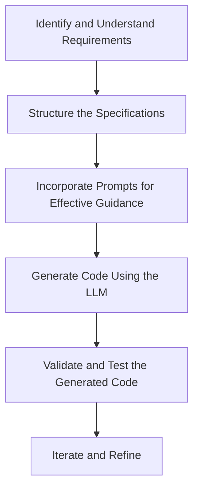

### Step-by-Step Methodology for Creating Specifications Optimized for Code Generation Using LLMs

Leveraging Large Language Models (LLMs) like GPT-4 for code generation can significantly streamline the software development process. To ensure the generated code aligns with your project requirements and maintains high quality, it's essential to create clear and detailed specifications. Below is a comprehensive methodology outlining each step involved in crafting such specifications.



`

---

#### **Step 1: Identify and Understand the Requirements**

- **Objective:** Clearly define the software project's goals and what it aims to achieve.

- **Actions:**
  - **Gather Stakeholder Input:**
    - Conduct interviews, surveys, or meetings with clients, end-users, and team members.
    - Document all the desired features and functionalities.
  - **Define Functional Requirements:**
    - List out specific tasks the software must perform.
    - Use clear and unambiguous language.
  - **Define Non-Functional Requirements:**
    - Specify performance metrics, security standards, and usability criteria.
  - **Identify Constraints and Edge Cases:**
    - Note any technical limitations or special scenarios that need handling.
  - **Prioritize Requirements:**
    - Rank features based on importance and implementation effort.

- **Example:**

  **Project:** Develop a Task Management Application.

  - **Functional Requirements:**
    - User authentication (sign-up, login, password reset).
    - Create, read, update, and delete (CRUD) tasks.
    - Assign tasks to users.
    - Set deadlines and reminders.
  - **Non-Functional Requirements:**
    - The application should support up to 1,000 concurrent users.
    - Response times should be under 500 milliseconds.
    - Data should be encrypted in transit and at rest.
  - **Constraints:**
    - Must run on both web and mobile platforms.
    - Should integrate with third-party calendar APIs.
  - **Edge Cases:**
    - Handling situations when a user tries to access a deleted task.
    - Managing simultaneous updates to the same task by different users.

---

#### **Step 2: Structure the Specifications**

- **Objective:** Create a well-organized, clear, and concise specification document that is easy for both humans and LLMs to understand.

- **Actions:**
  - **Choose a Standard Format:**
    - Use structured formats like Markdown, JSON, or YAML.
  - **Organize by Feature or Module:**
    - Break down the document into sections for each feature.
  - **Define Inputs and Outputs:**
    - Specify data types, validation rules, and expected responses.
  - **Include Diagrams and Visuals:**
    - Utilize flowcharts, UML diagrams, or wireframes where necessary.
  - **Provide Examples:**
    - Use sample data to illustrate expected functionality.

- **Example:**

  ```markdown
  ### Feature: User Authentication

  **Description:** Handles user registration, login, and password management.

  **Endpoints:**

  - **POST /api/register**
    - **Inputs:**
      - `username` (string): 6-20 characters, alphanumeric.
      - `email` (string): Must be a valid email address.
      - `password` (string): Minimum 8 characters, at least one number and one special character.
    - **Outputs:**
      - `userId` (UUID): Unique identifier for the user.
      - `message` (string): Success or error message.
    - **Validation Rules:**
      - Username and email must be unique.
      - Password must be hashed using bcrypt.
  ```

---

#### **Step 3: Incorporate Prompts for Effective Guidance**

- **Objective:** Guide the LLM to generate the desired code by crafting precise and informative prompts.

- **Actions:**
  - **Be Specific and Clear:**
    - Use precise language to eliminate ambiguity.
  - **Provide Context:**
    - Mention the programming language, frameworks, and libraries to use.
  - **Outline Desired Code Structure:**
    - Indicate if code should follow certain design patterns or architectural styles.
  - **Emphasize Best Practices:**
    - Include any coding standards or conventions to follow.
  - **Specify Output Format:**
    - Clarify whether you need a function, class, or complete script.

- **Example:**

  ```
  Using Python and the Flask framework, create a `POST /api/register` endpoint for user registration. The endpoint should:

  - Accept `username`, `email`, and `password` in JSON format.
  - Validate the inputs according to the following rules:
    - `username`: 6-20 alphanumeric characters, must be unique.
    - `email`: Valid email format, must be unique.
    - `password`: At least 8 characters, include at least one number and one special character.
  - Hash the password using bcrypt before storing it.
  - Store the user data in a PostgreSQL database.
  - Return a JSON response with the `userId` and a success message.
  - Follow PEP 8 coding standards and include error handling for possible exceptions.
  ```

---

#### **Step 4: Generate Code Using the LLM**

- **Objective:** Use the LLM to produce code that meets the specifications.

- **Actions:**
  - **Input the Prompt into the LLM:**
    - Provide the crafted prompt from Step 3.
  - **Review the Generated Code:**
    - Check for accuracy, adherence to specifications, and code quality.
  - **Iterate if Necessary:**
    - If the output isn't satisfactory, refine the prompt and try again.

- **Example:**

  *After inputting the prompt, the LLM generates the Flask route for user registration.*

  ```python
  from flask import Flask, request, jsonify
  import re
  import bcrypt
  import psycopg2

  app = Flask(__name__)

  @app.route('/api/register', methods=['POST'])
  def register():
      data = request.get_json()
      username = data.get('username')
      email = data.get('email')
      password = data.get('password')

      # Input validation
      if not re.match(r'^[A-Za-z0-9]{6,20}$', username):
          return jsonify({'message': 'Invalid username format'}), 400
      if not re.match(r'[^@]+@[^@]+\.[^@]+', email):
          return jsonify({'message': 'Invalid email format'}), 400
      if len(password) < 8 or not re.search(r'\d', password) or not re.search(r'\W', password):
          return jsonify({'message': 'Password does not meet complexity requirements'}), 400

      # Hash the password
      hashed_password = bcrypt.hashpw(password.encode('utf-8'), bcrypt.gensalt())

      # Store in database (assume connection and cursor are set up)
      try:
          # Database operations...
          user_id = 'generated-uuid'
          return jsonify({'userId': user_id, 'message': 'Registration successful'}), 201
      except Exception as e:
          return jsonify({'message': 'An error occurred'}), 500
  ```

---

#### **Step 5: Validate and Test the Generated Code**

- **Objective:** Ensure the generated code functions correctly and meets all requirements.

- **Actions:**
  - **Static Code Analysis:**
    - Use tools like Pylint to check for syntax errors and enforce coding standards.
  - **Write Unit Tests:**
    - Create tests for different scenarios, including edge cases.
  - **Perform Integration Tests:**
    - Test the code within the larger application context.
  - **Conduct Security Audits:**
    - Check for vulnerabilities like SQL injection or improper error handling.

- **Example:**

  ```python
  import unittest
  from app import app

  class TestRegisterEndpoint(unittest.TestCase):
      def setUp(self):
          self.app = app.test_client()

      def test_successful_registration(self):
          response = self.app.post('/api/register', json={
              'username': 'testuser',
              'email': 'test@example.com',
              'password': 'Password123!'
          })
          self.assertEqual(response.status_code, 201)

      def test_invalid_username(self):
          response = self.app.post('/api/register', json={
              'username': 'tu',
              'email': 'test@example.com',
              'password': 'Password123!'
          })
          self.assertEqual(response.status_code, 400)

      # Additional tests...
  ```

---

#### **Step 6: Iterate and Refine**

- **Objective:** Improve the code and specifications based on feedback and test results.

- **Actions:**
  - **Identify Issues:**
    - Review test failures and debug the code.
  - **Refine Specifications:**
    - Clarify any ambiguities or omissions in the specs.
  - **Enhance Prompts:**
    - Modify the prompts to address any shortcomings in the generated code.

- **Example:**

  *If the password validation isn't strict enough, update the prompt:*

  ```
  Update the password validation to also require at least one uppercase letter. Ensure the error messages are specific about what requirement isn't met.
  ```

---

#### **Step 7: Implement Best Practices for Deployment**

- **Objective:** Prepare the code for deployment in a production environment.

- **Actions:**
  - **Optimize Code:**
    - Refactor for efficiency and maintainability.
  - **Dockerization:**
    - Containerize the application for consistency across environments.
  - **Set Up CI/CD Pipelines:**
    - Automate testing and deployment processes.
  - **Monitor and Log:**
    - Implement logging and monitoring for ongoing maintenance.

- **Example:**

  *Create a Dockerfile for the Flask application:*

  ```Dockerfile
  FROM python:3.9-slim

  WORKDIR /app

  COPY requirements.txt requirements.txt
  RUN pip install -r requirements.txt

  COPY . .

  EXPOSE 5000

  CMD ["python", "app.py"]
  ```

---

### **Key Elements to Consider**

#### **Clarity and Precision**

- **Use Clear Language:**
  - Avoid ambiguous terms and clearly define all technical jargon.
- **Consistency:**
  - Maintain consistent naming conventions and formatting throughout the specifications.
- **Detailed Requirements:**
  - Provide as much detail as necessary to eliminate guesswork.

#### **Structuring Specifications**

- **Modularity:**
  - Break down the system into smaller, manageable pieces.
- **Standard Formats:**
  - Use widely accepted templates or formats for writing specifications.
- **Visual Aids:**
  - Incorporate diagrams to represent workflows or system architecture.

#### **Effective Prompting**

- **Contextual Information:**
  - Include relevant background information to guide the LLM.
- **Desired Output:**
  - Clearly state what you expect the LLM to produce.
- **Constraints and Guidelines:**
  - Specify any limitations or standards that must be adhered to.

#### **Validation and Testing**

- **Automated Testing:**
  - Use testing frameworks to automate unit, integration, and system tests.
- **Code Reviews:**
  - Have code reviewed by peers to catch issues the tests might miss.
- **Performance Testing:**
  - Ensure the application meets performance requirements under expected load.

---

### **Practical Examples and Scenarios**

#### **Scenario 1: Building an API Endpoint**

- **Requirement:** Create an endpoint to retrieve a list of tasks for a user.

- **Prompt:**

  ```
  Using Node.js and Express, write a GET `/api/tasks` endpoint that retrieves all tasks for an authenticated user. The endpoint should:

  - Extract the user's ID from a JWT in the Authorization header.
  - Query a MongoDB database to find all tasks associated with the user ID.
  - Return the tasks in JSON format.
  - Handle errors appropriately, including invalid tokens and database errors.
  ```

- **Generated Code:** *(The assistant would produce the code based on the prompt.)*

---

#### **Scenario 2: Implementing a Data Processing Function**

- **Requirement:** Write a function to process and validate input data.

- **Prompt:**

  ```
  In Java, create a method `processInputData` that accepts a list of strings. The method should:

  - Trim whitespace from each string.
  - Remove any strings that are empty after trimming.
  - Validate that each string matches a specific regex pattern (e.g., only alphanumeric characters).
  - Return a list of valid strings.
  - Throw an exception if the input is null.
  ```

- **Generated Code:** *(The assistant would produce the code based on the prompt.)*

---

### **Challenges and Solutions**

#### **Challenge 1: Ambiguous Specifications**

- **Problem:** Vague or incomplete specifications can lead to incorrect or suboptimal code generation.

- **Solution:**
  - **Clarify Requirements:** Ensure all aspects of the functionality are well-defined.
  - **Ask Questions:** If possible, seek clarification from stakeholders.
  - **Provide Examples:** Use sample data or scenarios to illustrate points.

#### **Challenge 2: LLM Misinterpretation**

- **Problem:** The LLM might misinterpret prompts, especially if they are complex.

- **Solution:**
  - **Simplify Prompts:** Break down prompts into simpler, smaller tasks.
  - **Use Explicit Language:** Avoid figurative language or idioms.
  - **Iterative Refinement:** Review outputs and adjust prompts accordingly.

#### **Challenge 3: Ensuring Code Quality**

- **Problem:** Generated code may not adhere to best practices or might be inefficient.

- **Solution:**
  - **Include Best Practices in Prompts:** Specify coding standards and practices to follow.
  - **Automated Tools:** Use linters and formatters to enforce code quality.
  - **Manual Review:** Always have a developer review the code.

#### **Challenge 4: Security Concerns**

- **Problem:** Code generated without security considerations can introduce vulnerabilities.

- **Solution:**
  - **Emphasize Security in Specifications:** Include security requirements explicitly.
  - **Security Testing:** Perform security audits and use tools like static code analyzers.
  - **Stay Updated:** Keep abreast of common security pitfalls in the chosen programming language.

---

### **Conclusion**

Creating optimized specifications for code generation using LLMs involves careful planning and detailed documentation. By following a structured methodology, you can guide the LLM to produce code that meets your project's needs, adheres to best practices, and maintains high quality. Remember to:

- Clearly define all requirements.
- Structure your specifications for clarity.
- Craft precise prompts that guide the LLM effectively.
- Validate and test the generated code thoroughly.
- Iterate and refine based on feedback.

With these steps, you can leverage the power of LLMs to accelerate development while ensuring that the code is robust, efficient, and secure.