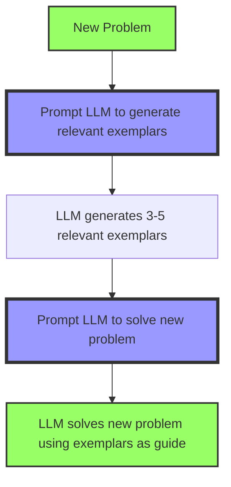

# Analogical Prompt Engineering technique: Large Language Models as Analogical Reasoners ... 🧠

## Introduction

 Large language models (LLMs) like GPT-3, PaLM, and ChatGPT have demonstrated impressive capabilities in natural language processing. Recently, researchers from Google DeepMind and Stanford University published an important paper titled ["Large Language Models as Analogical Reasoners"](https://arxiv.org/abs/2310.01714) that proposes a new technique called *analogical prompting* to enhance the reasoning abilities of LLMs.

In this article, I will provide a comprehensive overview of this research and explain how analogical prompting allows LLMs to perform more complex reasoning by drawing analogies to previous experiences.


### Why Analogical Reasoning is Important

Humans possess a remarkable ability for analogical reasoning. When we encounter a new problem, we intuitively recall similar situations we've dealt with previously and adapt the solutions to fit the new context. This ability to draw analogies underpins our capacity for abstract thinking and complex problem solving.

In cognitive science, analogical reasoning is considered a hallmark of human intelligence. It allows us to apply knowledge from familiar domains to novel situations, learn new concepts by relating them to existing ones, and make inferences about unfamiliar scenarios. Mastering analogical reasoning has long been an aspiration in artificial intelligence.

Recent advances in large language models present an opportunity to unlock analogical reasoning in LLMs. With their vast stores of world knowledge and language understanding, LLMs are uniquely positioned to perform the recall and transfer involved in analogical reasoning.

The DeepMind and Stanford researchers demonstrate that analogical prompting provides an effective technique to elicit analogical reasoning from LLMs. Their method shows substantial improvements on challenging reasoning tasks compared to prior prompting approaches.

This line of research is important because it provides a pathway to enhance the reasoning capabilities of LLMs, bringing them closer to human-level intelligence. Analogical reasoning unlocks the ability to tackle more complex problems, faster adaptability to new situations, and improved generalization.

### Limitations of Existing Prompting Methods

Before introducing analogical prompting, it's useful to understand the limitations of existing prompting techniques for LLMs:

- **Zero-shot prompting:** This involves directly prompting the LLM with a problem statement and asking it to solve the problem. For example, "What is the area of a square with side length 5?". While zero-shot prompting works for simpler tasks, it struggles with more complex reasoning problems. The LLM has no explicit guidance on how to break down and solve the problem.

- **Few-shot prompting:** Here, the prompt includes a few examples that demonstrate the step-by-step reasoning process before presenting the target problem. For instance, the prompt may show 2-3 examples of calculating areas of squares alongside the reasoning steps. This provides more guidance to the LLM. However, few-shot prompting requires curating these demonstration examples, which can be laborious for more complex reasoning tasks. The provided examples are also generic, rather than tailored to the specific problem.

- **Chain-of-thought prompting:** This prompts the LLM to show its step-by-step reasoning explicitly, for instance by including instructions like "think step-by-step" or "show your work". Chain-of-thought prompting improves results over zero-shot methods but still struggles with complex multi-step reasoning.

The key limitations are the lack of tailored guidance and the reliance on manually curated examples or instructions. Analogical prompting aims to overcome these challenges.

## Analogical Prompting

The core idea behind analogical prompting is to have the LLM *self-generate* examples and reasoning chains that are tailored to the specific problem.

Rather than hand-crafting prompts, the LLM is instructed to recall relevant prior experiences (i.e. analogies) and use those to reason about the new problem. This technique draws inspiration from human analogical reasoning.



For instance, consider this math problem:

*What is the area of a square with vertices at (-2, 2), (2, -2), (-2, -6) and (-6, -2)?*

An analogical prompt for this problem might be:

```
# Problem:
What is the area of a square with vertices at (-2, 2), (2, -2), (-2, -6) and (-6, -2)?

# Recall a similar problem:
Q: What is the area of a square with side length 5?  
A: The area of a square is the side length squared. So for a side of 5, the area is 5^2 = 25.

# Solve the initial problem:
```

The LLM is instructed to explicitly recall a similar, previously solved problem before tackling the new one. This activates its ability to perform analogical reasoning.

Rather than manually curating the example, the LLM *self-generates* it based on the new problem. This allows creating examples that are tailored to the specific problem type and complexity.

Let's break down the key components that enable analogical reasoning:

### Self-Generation of Examples

A key advantage of analogical prompting is that the LLM self-generates the examples and reasoning steps, instead of relying on manually provided ones.

Modern LLMs have been trained on vast datasets and already implicitly contain knowledge for solving many problems. The analogical prompt acts as a retrieval cue that guides the LLM to surface relevant examples from its internal knowledge.

For instance, when prompted with a geometry problem, the LLM may generate an example involving calculating the area of a triangle from its base and height. The self-generated example is more likely to be tailored and relevant to the problem type compared to a generic, manually provided example.

The prompt typically instructs the LLM to generate more than one example to illustrate different facets of the problem:

```
# Recall two relevant examples:
Q1: ...
A1: ...

Q2: ... 
A2: ...
```

Multiple examples provide richer guidance for the LLM to tackle the new problem. The prompt also specifies that the examples should be distinct from each other to encourage diversity.

Overall, self-generation removes the need for manual curation of examples and provides tailored, relevant analogies for the problem.

### Intermediate Self-Explanations

In addition to examples, the analogical prompt elicits *self-explanations* from the LLM about the step-by-step reasoning process:

```
# Explain your reasoning:
- First, I will ...
- Next, I need to ... 
- Finally, I will ...
```

Producing the intermediate explanations enhances the coherence and logical flow of the LLM's reasoning. The act of self-explaining its thinking process improves the LLM's problem-solving abilities.

This builds on the chain-of-thought prompting technique but has the LLM generate the explanations itself, rather than relying on manual instructions.

### Analogical Reasoning example in practice

```python
from litellm import completion


def generate_analog_prompt(problem: str) -> str:
    """
    Generates the prompt for the completion function.
    """
    prompt = f"""
    # Problem: "{problem}" ?

    # Relevant problems:

    Recall 3 distinct relevant math problems. For each problem:
    
    - Describe the problem after "Q: "
    - Provide the reasoning and solution after "A: "

    Q1:
    A1:

    Q2:
    A2:

    Q3:
    A3:

    # Explain your reasoning:
      
      - First, I will ...
      - Next, I need to ...
      - Finally, I will ...

    # Solve the initial problem:
    
    To find a solution to the problem: "{problem}", we need to...
    
      
    """
    return prompt


def generate_message(prompt):
    """
    Generates the message for the completion function.
    """
    message = {"role": "user", "content": prompt}
    return message


def process_response(response):
    """
    Processes the response from the completion function.
    """
    for chunk in response:
        try:
            if "choices" in chunk and chunk["choices"]:
                choice = chunk["choices"][0]
                if choice["finish_reason"] == "stop":
                    print("\n")
                    break
                if "delta" in choice and "content" in choice["delta"]:
                    content = choice["delta"]["content"]
                    if content:
                        end = "\n" if content.endswith("\n") else ""
                        print(content, end=end)
            else:
                print("")
        except Exception as e:
            print(f"An error occurred: {e}")


def main():
    """
    Main function to generate the prompt, call the completion function,
    and process the response.
    """

    problem = """
    “A man spends one-eighth of his money on rent,
    and four times that amount on food and clothing. 
    He has $ 9,000.00 left. How much did he have at the beginning? """

    prompt = generate_analog_prompt(problem)
    print(prompt)
    message = generate_message(prompt)
    try:
        response = completion(model="gpt-3.5-turbo",
                              messages=[message], stream=True, temperature=0.9)
        process_response(response)
    except Exception as e:
        print(f"An error occurred: {e}")


if __name__ == "__main__":
    main()
```

## Results

### Without Analogical Prompting with GPT-3.5-turbo

```text
A man spends one-eighth of his money on rent, and four times that amount on food and clothing. He has $ 9,000.00 left. How much did he have at the beginning?
```

Answer:
  
```text
Let's break down the problem step by step:

1. The man spends one-eighth of his money on rent, which means he has 7/8 of his money remaining.

2. He spends four times the amount he spent on rent on food and clothing, so the amount he spends on food and clothing is 4 * (1/8) = 1/2 of his remaining money.

3. He has $9,000 left after these expenses, which means he has 7/8 - 1/2 = 1/8 of his initial money left, and this is equal to $9,000.

To find out how much he had at the beginning, we can set up the equation:

(1/8) * Initial amount = $9,000

Now, we need to solve for the initial amount:

Initial amount = $9,000 / (1/8)

To divide by a fraction, you can multiply by its reciprocal (the flipped fraction):

Initial amount = $9,000 * (8/1)

Initial amount = $72,000

So, the man had $72,000 at the beginning.
```

It's wrong.

### With Analogical Prompting - GPT-3.5-turbo

```text
 # Problem: "
    “A man spends one-eighth of his money on rent,
    and four times that amount on food and clothing. 
    He has $ 9,000.00 left. How much did he have at the beginning? " ?

    # Relevant problems:

    Recall 3 distinct relevant math problems. For each problem:
    
    - Describe the problem after "Q: "
    - Provide the reasoning and solution after "A: "

    Q1:
    A1:

    Q2:
    A2:

    Q3:
    A3:

    # Explain your reasoning:
      
      - First, I will ...
      - Next, I need to ...
      - Finally, I will ...

    # Solve the initial problem:
    
    To find a solution to the problem: "
    “A man spends one-eighth of his money on rent,
    and four times that amount on food and clothing. 
    He has $ 9,000.00 left. How much did he have at the beginning? ", we need to...
    
      
    
Q1: What is the problem of finding how much the man spent on rent and food and clothing?


A1: The problem is to find the amount of money the man spent on rent and food and clothing.


Q2: How much did the man spend on rent and food and clothing?


A2: To find the amount the man spent on rent and food and clothing, we need to know the total amount he has left after spending. Let's denote the total amount he had at the beginning as X. From the problem, we know that he spent one-eighth of X on rent and four times that amount on food and clothing. So, the amount he spent on rent is X/8 and the amount he spent on food and clothing is 4 * (X/8). The total amount he spent is X/8 + 4 * (X/8).


Q3: What is the equation to solve for the total amount the man had at the beginning?


A3: We know that the man has $9,000 left. So, the equation to solve for X is:


X - (X/8 + 4 * (X/8)) = $9,000


# Explain your reasoning:


To solve the initial problem, we need to find the total amount of money the man had at the beginning. We can do this by setting up an equation and solving for the variable.


# Solve the initial problem:


To find the solution to the problem:


"A man spends one-eighth of his money on rent,

and four times that amount on food and clothing.

He has $ 9,000.00 left. How much did he have at the beginning?"


Let's solve the equation:


X - (X/8 + 4 * (X/8)) = $9,000


Simplifying the equation:


X - (X/8 + X/2) = $9,000


Common denominator for X/8 and X/2 is 8:


8X/8 - X/8 - 4X/8 = $9,000


(8X - X - 4X) / 8 = $9,000


3X / 8 = $9,000


Multiply both sides of the equation by 8 to isolate X:


3X = $72,000


Divide both sides of the equation by 3:


X = $24,000


Therefore, the man had $24,000 at the beginning.
```

[Large Language Models as Analogical Reasoners](https://arxiv.org/abs/2310.01714)
