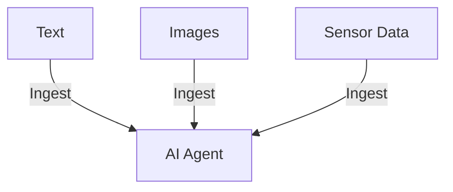
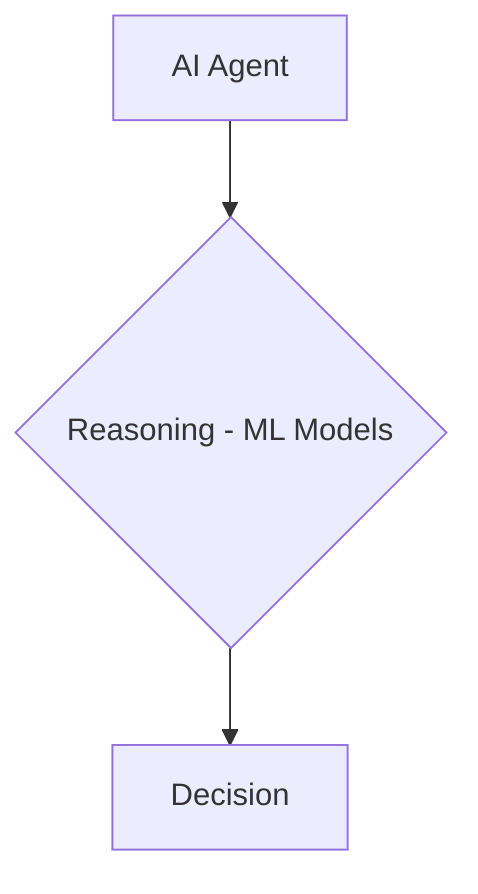
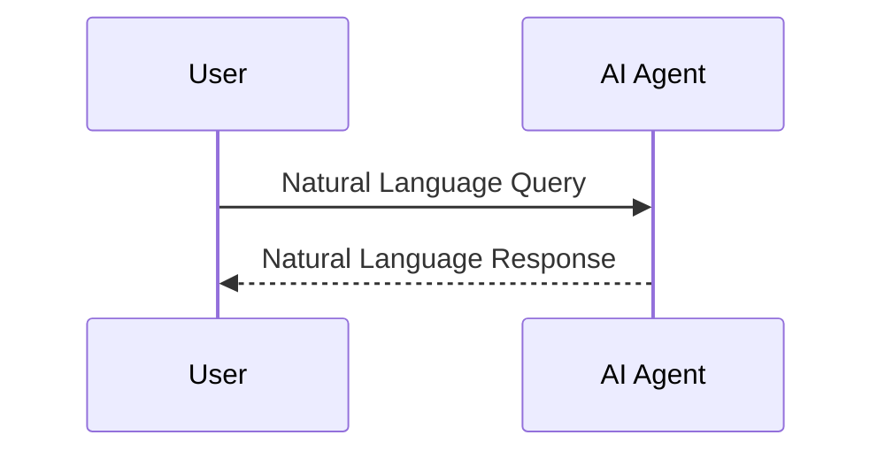
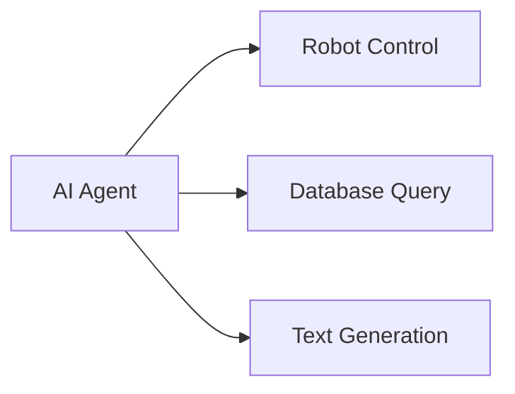

# Introduction to Microsoft AutoGen: A Framework for Building AI Agents

## What is an AI Agent?

An AI agent is a system that can perceive its environment and take actions to achieve goals. Unlike traditional software applications that follow predefined logic, agents can operate more autonomously and flexibly to handle complex tasks. 

**Some key capabilities of AI agents**:

- **Perception:** Agents can ingest different forms of data like text, images, sensor readings to understand the environment.



- **Reasoning:** Agents can make inferences and decisions based on their observations. They leverage AI techniques like machine learning for reasoning. Different types of agents have different reasoning capabilities.



- **Interaction:** Agents can communicate with users and other systems using natural language.



- **Execution:** Agents can take actions and influence the environment such as controlling a robot, querying a database, or generating text.



AI agents aim to handle tasks that are difficult to program using traditional code due to challenges like:

- **Ambiguity:** Require interpreting vague, subjective, or conflicting information.
- **Adaptability:** Require adjusting to dynamic, unpredictable environments. 
- **Complexity:** Involve vast state spaces, strategies, and knowledge requirements.
- **User Interaction:** Require natural communication and collaboration with humans.

There are different categories of AI agents with different capabilities:

- **Reactive agents** act based on current percepts, without maintaining internal state or considering long-term goals. They respond quickly to changes in the environment using simple rules, but lack planning capabilities.

- **Deliberative agents** maintain an internal symbolic world model and deliberate over future actions using reasoning to meet goals. They consider the broader context and impact of actions, but are slower than reactive agents.

- **Hybrid agents** combine reactive and deliberative capabilities for a balance of reactivity and hierarchical planning. The deliberative layer focuses on high-level goals while the reactive layer handles real-time interactions.

### Applications of AI Agents

AI agents are being applied across many industries to automate complex tasks:

- **Healthcare:** Virtual health assistants that can collect patient data, diagnose conditions, and recommend treatments.

- **Transportation:** Self-driving vehicles that can perceive surroundings and navigate safely to destinations. 

- **Finance:** Trading bots that can analyze market data and execute trades autonomously.

- **E-commerce:** Shopping bots that can understand customer intents and provide purchasing assistance.

- **Gaming:** Non-player characters (NPCs) that can behave realistically and interact with players.

### Challenges in Developing Agents

Some key challenges involved in building effective AI agents include:

- **Reward formulation:** Defining rewards and metrics of success for agents to optimize. Misspecified rewards can lead to unintended behavior.

- **Scalability:** Training and deploying agents that can handle large state spaces, datasets, and decision complexity. 

- **Safety:** Ensuring agents behave reliably and do not cause harm, even in unfamiliar scenarios. Testing and validation is critical.

- **Explainability:** Understanding the rationale behind agent decisions, especially those made by black box ML models underlying agents.

By leveraging different architectures, AI agents can be highly effective for complex real-world tasks across many industries. But designing agents to be scalable, safe, and explainable remains an active area of research.

## Introducing Microsoft AutoGen

[AutoGen](https://github.com/microsoft/autogen) is an open-source Python framework from Microsoft Research for building AI agent systems using large language models (LLMs) like GPT-4.

[AutoGen: Enabling Next-Gen LLM Applications via Multi-Agent Conversation Framework](https://arxiv.org/abs/2308.08155)

AutoGen provides tools to simplify the orchestration, optimization, and automation of workflows involving LLMs. It lets you combine the strengths of different AI techniques into capable, conversational agents.

With AutoGen, you can:

- **Customize Agents:** Configure agents with different capabilities powered by LLMs, humans, tools or a mix.

- **Automate Conversations:** Orchestrate complex conversations between agents to solve tasks.

- **Optimize Workflows:** Automate and enhance workflows by integrating LLMs.

AutoGen makes agent development modular and intuitive. You just define a set of agents and their interaction behaviors. This simplifies creating reusable, composable agents.

## Building an AI Agent with AutoGen

Let's walk through a hands-on tutorial to build a simple AI agent with AutoGen.

We will create an agent to answer natural language questions about Python code. Our agent will leverage an LLM for answering, execute code safely, and clarify ambiguous questions.

### 1. Install AutoGen

First, install the AutoGen package:

```
pip install pyautogen
```

Import the modules:

```python
import autogen
from autogen import Agent, Message
```

### 2. Define Agents

We will define 3 agents for our system:

- **User:** Simulates user interactions
- **Assistant:** Answers code questions using an LLM
- **Executor:** Safely executes Python code

```python
user = Agent("User")
assistant = Agent("Assistant")
executor = Agent("Executor")
```

We initialize the assistant agent with a language model. AutoGen supports any OpenAI API key for this.

```python
assistant.init_openai(openai_api_key="sk-...") 
```

### 3. Implement Agent Behaviors

Next, we define how each agent behaves by implementing `process` methods:

```python
def user_process(self, message: Message):
  # Simulates user questions
  return Message(f"What does this Python code do: {message.content}")

def assistant_process(self, message: Message):
  # Uses LLM to answer code questions
  prompt = f"{message.content}\n\nHere is a plain language explanation:"
  response = openai.Completion.create(prompt=prompt, model="text-davinci-003")
  return Message(response["choices"][0]["text"])  

def executor_process(self, message: Message):
  # Executes Python code safely
  try:
    exec(message.content)
  except:
    return Message("Sorry, I couldn't execute that code safely.")
  
  return Message("Code executed successfully!")
```

We override the default `process` method for each agent class:

```python
user.process = user_process
assistant.process = assistant_process 
executor.process = executor_process
```

### 4. Run the Conversation

We can now start a conversation between the user and assistant:

```python
user.send_message_to(assistant, Message("What does this Python code do: print('Hello World!')"))
```

This will call the `user_process` and `assistant_process` methods to generate responses.

We can integrate the executor agent when code execution is needed:

```python
user.send_message_to(assistant, Message("What does this code do: import math; print(math.factorial(5))"))

assistant.send_message_to(executor, Message("import math; print(math.factorial(5))"))
# Executor runs code and replies safely

assistant.send_reply_to(user, executor.latest_response) 
# Assistant relays executor output to user
```

AutoGen handles routing messages between agents and orchestrating the conversation flow.

### 5. Run Automated Conversations

We can also let AutoGen automatically mediate a complete conversation using:

```python
autogen.run_agent_conversation(agents=[user, assistant, executor],
                               initiator=user,
                               initial_message="What does this code do: print('Hello World!')")
```

This will run a full back-and-forth conversation between the agents to resolve the user's question.

AutoGen supports many patterns like group chats, loops, conditionals to orchestrate complex conversations.

## Key Takeaways

- AutoGen simplifies building AI agents by handling coordination between modular, reusable skills.

- It automates conversations between agents to solve ambiguous, complex tasks.

- AutoGen integrates the strengths of LLMs, humans, and tools into capable agents.

- The framework is highly customizable for diverse use cases and provides many optimization features.

AutoGen enables you to focus on creating agents with unique capabilities rather than workflow logic. It unlocks the potential of LLMs for next-generation applications.

The framework is open-source and under active development. You can start building cutting-edge AI systems today using AutoGen!

## References

- [AutoGen GitHub Repo](https://github.com/microsoft/autogen)
- [Documentation](https://microsoft.github.io/autogen/docs/index.html)
- [Examples](https://microsoft.github.io/autogen/docs/)

## Bibliography

 Russell, Stuart J., and Peter Norvig. "Intelligent agents." Artificial intelligence: a modern approach (1995): 34-36.

 Poole, David, and Alan Mackworth. Artificial Intelligence: foundations of computational agents. Cambridge University Press, 2010.

 Allen, James, et al. "Plow: A collaborative task learning agent." AAAI. Vol. 7. 2007.

 Kober, Jens, et al. "Reinforcement learning in robotics: A survey." The International Journal of Robotics Research 32.11 (2013): 1238-1274.

 Wooldridge, Michael. "Intelligent agents." Multiagent systems: a modern approach to distributed artificial intelligence (1999): 27-77.
