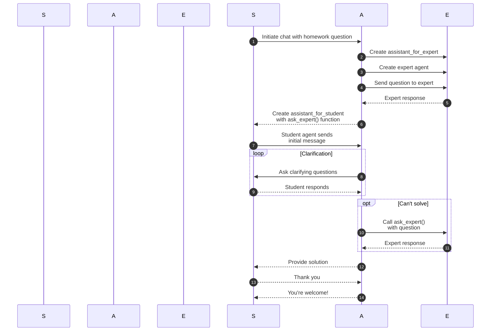

```mermaid
sequenceDiagram
autonumber

participant Student as S
participant Assistant as A
participant Expert as E

S->>A: Initiate chat with homework question
A->>E: Create assistant_for_expert 
A->>E: Create expert agent
A->>E: Send question to expert
E-->>A: Expert response
A-->>S: Create assistant_for_student<br>with ask_expert() function
S->>A: Student agent sends<br>initial message
loop Clarification
    A->>S: Ask clarifying questions
    S-->>A: Student responds 
end 
opt Can't solve
    A->>E: Call ask_expert()<br>with question
    E-->>A: Expert response
end
A-->>S: Provide solution
S-->>A: Thank you
A-->>S: You're welcome!
```