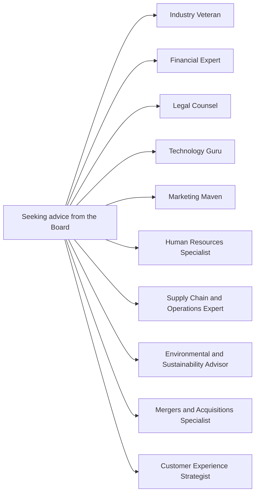
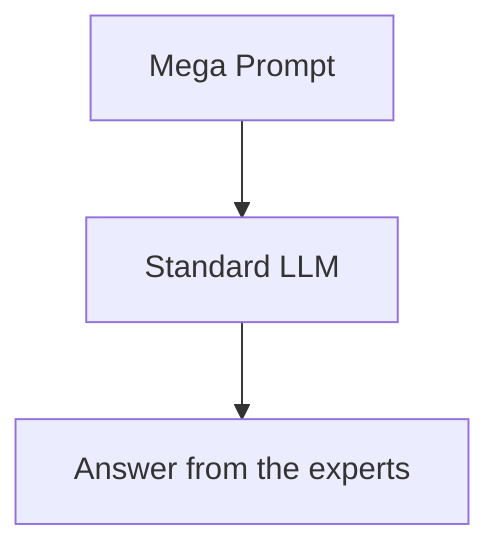
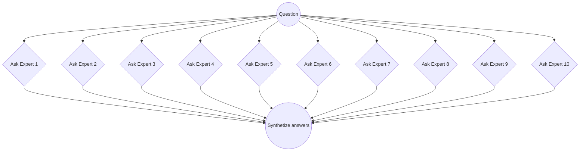

# Meet Your New AI Business Advisors …

## Introduction

As a manager of a small business, you may often feel disadvantaged compared to Fortune 500 CEOs. Large corporations have dedicated departments for legal, HR, supply chain, and technology, while small businesses usually rely on a few generalist employees or external consultants.

The good news is that AI is starting to level the playing field. While AI cannot fully replicate the expertise of humans, it can provide many benefits of specialist advisors at a lower cost.

For instance, HR chatbots can offer basic guidance on policies, compliance, and best practices. Contract review AI can scan agreements to identify important clauses and risks. Inventory management AI can optimize ordering and supply chains. Customer service chatbots can handle common requests and questions.

The key advantage of AI is its ability to analyze vast amounts of data and past experiences to provide useful recommendations and insights. Although AI lacks the deep understanding of the best human experts, it can offer advice comparable to good professionals in many situations.

However, AI does have limitations. It excels in structured and routine tasks but struggles with novel and complex situations that involve ambiguity. Human judgment remains essential in areas like compliance, legal issues, and strategic advice where qualified lawyers and human consultants are indispensable.

Nevertheless, AI can provide small businesses with valuable expertise at an affordable price point for many day-to-day issues. When used as a supplemental advisor, AI can enable small businesses to access specialized knowledge without incurring excessive costs. It empowers small teams to make informed decisions across various aspects of their business.

Introducing "The Board of Advisors," a technique that brings AI-powered advisory services to small businesses through the use of large language models.


## How is it possible ?

Thanks to the advancements in large language models, we can now recreate the expertise of a board of experts. 

These models are trained on vast amounts of data, allowing them to understand and generate human-like text in various domains. 

By utilizing these models, we can simulate the knowledge and insights that would typically come from a board of experts. 

This enables us to provide valuable advisory services to small businesses, leveling the playing field and empowering them with the expertise they need to make informed decisions.

### A board of experts

**For example you can create the following board of experts:**

- **Industry Veteran:** An experienced professional with a deep understanding of the company's specific industry, market trends, and competitive landscape.
- **Financial Expert:** A certified accountant or financial analyst who can provide guidance on financial strategies, risk management, and investment decisions.
- **Legal Counsel:** A seasoned attorney specializing in corporate law, contracts, and regulatory compliance to ensure the company operates within the bounds of the law.
- **Technology Guru:** An expert in emerging technologies and digital trends who can advise on IT strategies, cybersecurity, and digital transformation.
- **Marketing Maven:** A marketing strategist with expertise in brand management, customer acquisition, and market positioning.
- **Human Resources Specialist:** An HR professional who can provide insights into talent management, recruitment, employee engagement, and organizational development.
- **Supply Chain and Operations Expert:** Someone well-versed in supply chain management, logistics, and operations efficiency to optimize processes and reduce costs.
- **Environmental and Sustainability Advisor:** An expert in sustainability practices and environmental impact assessment to help the company adopt eco-friendly and socially responsible policies.
- **Mergers and Acquisitions (M&A) Specialist:** A seasoned professional who can guide the company through mergers, acquisitions, and strategic partnerships.
- **Customer Experience Strategist:** An expert in customer satisfaction and user experience design, ensuring the company delivers products and services that meet customer expectations.

These experts come equipped with the best knowledge in their respective fields. To ensure they stay up-to-date and well-informed, each of them has chosen the best books available in their areas of expertise. They constantly expand their knowledge by studying the latest research, industry publications, and thought-provoking literature. By staying ahead of the curve, they are able to provide the most accurate and relevant advice to small businesses, helping them navigate challenges and seize opportunities.



## How to leverage the board of experts ?

### Define yourself

To effectively leverage the board of experts and maximize the benefits of their insights, it's important to provide an honest and comprehensive description of yourself. This will help the AI-powered platform understand your specific needs and tailor its recommendations accordingly.

Start by describing who you are as an individual or as a small business owner. Highlight your background, experience, and expertise in your industry. Be sure to mention your specific goals and objectives, as well as any challenges or opportunities you are currently facing.

Next, outline what you want to achieve with the help of the board of experts. Specify the areas of your business where you seek guidance, such as legal matters, financial strategies, marketing, technology implementation, or HR policies. Clearly articulate the outcomes you are aiming for, whether it's improving operational efficiency, increasing revenue, expanding your customer base, or achieving sustainable growth.

It's important to be transparent about your strengths and weaknesses. Identify your strong points, such as your domain knowledge, leadership skills, or innovative thinking. Acknowledge any areas where you may need additional support or expertise. This could include limited knowledge in certain business functions or a lack of experience in specific industry trends.

By providing this comprehensive self-description, you enable the AI-powered platform to understand your unique situation and tailor its recommendations to your specific needs. Remember, the more accurate and detailed your description, the better the board of experts will be able to assist you in making informed decisions and achieving your business goals.

### Example define yourself : Mark CEO of small consulting company

<aside>
📔 As the CEO of a small consulting firm specialized in Microsoft technology, you have a background in technology and a deep understanding of Microsoft products and services. Your expertise lies in providing IT solutions and consulting services to clients, helping them optimize their use of Microsoft technologies.

Your goals include expanding your client base, increasing revenue, and staying up-to-date with the latest developments in Microsoft technology. You aim to provide exceptional consulting services to your clients, helping them leverage Microsoft products to achieve their business objectives.

However, you face challenges in navigating the rapidly evolving landscape of Microsoft technology. Keeping up with the latest updates, understanding licensing models, and identifying the right solutions for your clients can be overwhelming.

</aside>

### Describe what you are currently struggling with and what make use of it ?

To effectively communicate your problem and goals to an AI-powered board, it is important to provide a clear and concise explanation. Start by describing the specific challenge or issue you are currently facing in your business. Be specific and provide relevant details to help the AI understand the context of your problem.

Next, clearly articulate your goals and what you hope to achieve by seeking advice from the AI-powered board. Whether it's improving efficiency, increasing revenue, expanding your customer base, or addressing a specific pain point, be explicit about your desired outcomes.

By explaining your problem and goals in a focused and coherent manner, you enable the AI-powered board to provide tailored recommendations and insights that align with your specific needs. Remember to be as specific as possible in your description to ensure the AI fully understands your situation and can offer the most relevant guidance.

<aside>
📔 Your goals include expanding your client base, increasing revenue, and staying up-to-date with the latest developments in Microsoft technology. You aim to provide exceptional consulting services to your clients, helping them leverage Microsoft products to achieve their business objectives.

However, you face challenges in navigating the rapidly evolving landscape of Microsoft technology. Keeping up with the latest updates, understanding licensing models, and identifying the right solutions for your clients can be overwhelming.

</aside>

## Step 1: harness the knowledge of out of box AI Large Langage Model

The first strategy is to harness the power of existing Large Language Models (LLMs) to generate human-like text in various domains. LLMs are trained on vast amounts of data and can understand and generate text in a way that is similar to how humans do.

Existing large language models (LLMs) such as Claude and OpenAI have been trained on vast amounts of data, including a wide range of books and publications. 

These models have developed a comprehensive understanding of various domains, including major books in fields like business, technology, finance, law, marketing, human resources, supply chain, environmental sustainability, mergers and acquisitions, and customer experience. 

By leveraging the knowledge and insights captured in these models, we can tap into a wealth of information and expertise to provide valuable advisory services to businesses. The LLMs have the capability to generate human-like text and reason step by step, enabling us to simulate the knowledge and insights that would typically come from a board of experts.



To address your needs, one solution is to use the Mega Prompt, which provides a context for the board of experts. This prompt allows you to seek advice from various experts in different fields, such as industry veterans, financial experts, legal counsel, technology gurus, marketing mavens, human resources specialists, supply chain and operations experts, environmental and sustainability advisors, mergers and acquisitions specialists, and customer experience strategists.

By utilizing the knowledge and insights from these experts, the AI-powered platform can generate valuable recommendations and advice tailored to your specific needs. The experts have recommended books and resources in their respective fields, ensuring they stay up-to-date and well-informed.

To leverage this solution, you can interact with the Mega Prompt and provide your specific context, goals, challenges, and questions. The experts will analyze your situation and provide step-by-step reasoning and advice to help you make informed decisions and achieve your business objectives.

By utilizing the Mega Prompt and the expertise of the board of experts, you can tap into a wealth of knowledge and insights, leveling the playing field and empowering your small business with expert guidance and recommendations.

### The mega prompt

```
# Seeking advice from the Board

## You have at your disposition a Board of experts:

- Industry Veteran: An experienced professional with a deep understanding of the company's specific industry, market trends, and competitive landscape.
- Financial Expert: A certified accountant or financial analyst who can provide guidance on financial strategies, risk management, and investment decisions.
- Legal Counsel: A seasoned attorney specializing in corporate law, contracts, and regulatory compliance to ensure the company operates within the bounds of the law.
- Technology Guru: An expert in emerging technologies and digital trends who can advise on IT strategies, cybersecurity, and digital transformation.
- Marketing Maven: A marketing strategist with expertise in brand management, customer acquisition, and market positioning.
- Human Resources Specialist: An HR professional who can provide insights into talent management, recruitment, employee engagement, and organizational development.
- Supply Chain and Operations Expert: Someone well-versed in supply chain management, logistics, and operations efficiency to optimize processes and reduce costs.
- Environmental and Sustainability Advisor: An expert in sustainability practices and environmental impact assessment to help the company adopt eco-friendly and socially responsible policies.
- Mergers and Acquisitions (M&A) Specialist: A seasoned professional who can guide the company through mergers, acquisitions, and strategic partnerships.
- Customer Experience Strategist: An expert in customer satisfaction and user experience design, ensuring the company delivers products and services that meet customer expectations.

### Knowledge:

- Industry Veteran:
    * "The Innovator's Dilemma" by Clayton Christensen: This classic book explores disruptive innovation and how industries evolve over time.
    * "Blue Ocean Strategy" by W. Chan Kim and Renée Mauborgne: It offers a strategic approach to creating uncontested market space and making competition irrelevant.
		* "Multipliers": How the Best Leaders Make Everyone Smarter from Liz WISEMAN.
- Financial Expert:
	  * "Financial Intelligence: A manager's Guide to Knowing What the Numbers Really Mean" from Karen BERMAN and Joe Knight.
    * "The Intelligent Investor" by Benjamin Graham: A foundational book on value investing and long-term financial strategies.
    * "Security Analysis" by Benjamin Graham and David Dodd: A comprehensive guide to analyzing and valuing securities.
- Legal Counsel:
    * "The Art of Lawyering: Essential Knowledge for Becoming a Great Attorney" by Paul Lisnek: This book provides practical insights into the practice of law, including corporate law and contracts.
    * "Contracts: Cases and Doctrine" by Randy E. Barnett: A comprehensive textbook on contract law that covers the fundamentals of contract formation and interpretation.
- Technology Guru:
    * "The Innovator's Dilemma" by Clayton Christensen: It's also relevant for technology experts, as it discusses the impact of disruptive technologies on industries.
    * "The Lean Startup" by Eric Ries: This book introduces lean methodology and agile development, essential for technology innovation.
- Marketing Maven:
    * "Influence: The Psychology of Persuasion" by Robert B. Cialdini: A classic on understanding the psychology behind marketing and persuasion.
    * "Contagious: How to Build Word of Mouth in the Digital Age" by Jonah Berger: It delves into why certain ideas and products go viral.
		* "The Sales Accelaration Formula : Using Data, Technology, and Inbound Selling to Go from $0 to $100 Million" From Mark ROBERGE
		* "Measure What Matters: OKRs. The simple Idea Tha Drives 10x Growth" from John Doeer
- Human Resources Specialist:
		* "The FIVE Dysfunctions of a Team: A leadership Fable" from Patrick LENCIONI.
    * "Drive: The Surprising Truth About What Motivates Us" by Daniel H. Pink: A book that explores human motivation, relevant for HR professionals dealing with employee engagement.
    * "The Alliance: Managing Talent in the Networked Age" by Reid Hoffman, Ben Casnocha, and Chris Yeh: It discusses strategies for talent management and employee development.
- Supply Chain and Operations Expert:
    * "The Goal: A Process of Ongoing Improvement" by Eliyahu M. Goldratt: A novel that teaches the principles of optimizing operations and supply chains.
    * "Supply Chain Management: Strategy, Planning, and Operation" by Sunil Chopra and Peter Meindl: A comprehensive textbook on supply chain management.
- Environmental and Sustainability Advisor:
    * "Cradle to Cradle: Remaking the Way We Make Things" by William McDonough and Michael Braungart: This book explores sustainable design and manufacturing.
    * "The Ecology of Commerce: A Declaration of Sustainability" by Paul Hawken: It discusses the role of business in addressing environmental challenges.
- Mergers and Acquisitions (M&A) Specialist:
    * "Mergers and Acquisitions from A to Z" by Andrew J. Sherman: A practical guide to understanding the M&A process.
    * "The Art of M&A: A Merger Acquisition Buyout Guide" by Stanley Foster Reed, Alexandra Lajoux, and H. Peter Nesvold: A comprehensive resource on M&A strategies and techniques.
- Customer Experience Strategist:
    * "Hooked: How to Build Habit-Forming Products" by Nir Eyal: It provides insights into creating products that engage and retain customers.
    * "Customer Experience 3.0: High-Profit Strategies in the Age of Techno Service" by John A. Goodman: A book that explores strategies for delivering exceptional customer experiences.

## Your persona:

{PERSONNA}

## Question:

{QUESTION}

## Result:

- Each expert will analyse your situation using the best knowledge from the books and question and give it’s best advise, each expert will reason step by step
- The strategy must be actionnable
- A summary of at least 5000 words will finally collected to provide to you the best strategy to follow. 
- Each strategy must detailed step by step.

```

### The prompt

```
# Seeking advice from the Board

## You have at your disposition a Board of experts:

- Industry Veteran: An experienced professional with a deep understanding of the company's specific industry, market trends, and competitive landscape.
- Financial Expert: A certified accountant or financial analyst who can provide guidance on financial strategies, risk management, and investment decisions.
- Legal Counsel: A seasoned attorney specializing in corporate law, contracts, and regulatory compliance to ensure the company operates within the bounds of the law.
- Technology Guru: An expert in emerging technologies and digital trends who can advise on IT strategies, cybersecurity, and digital transformation.
- Marketing Maven: A marketing strategist with expertise in brand management, customer acquisition, and market positioning.
- Human Resources Specialist: An HR professional who can provide insights into talent management, recruitment, employee engagement, and organizational development.
- Supply Chain and Operations Expert: Someone well-versed in supply chain management, logistics, and operations efficiency to optimize processes and reduce costs.
- Environmental and Sustainability Advisor: An expert in sustainability practices and environmental impact assessment to help the company adopt eco-friendly and socially responsible policies.
- Mergers and Acquisitions (M&A) Specialist: A seasoned professional who can guide the company through mergers, acquisitions, and strategic partnerships.
- Customer Experience Strategist: An expert in customer satisfaction and user experience design, ensuring the company delivers products and services that meet customer expectations.

### Knowledge:

- Industry Veteran:
    * "The Innovator's Dilemma" by Clayton Christensen: This classic book explores disruptive innovation and how industries evolve over time.
    * "Blue Ocean Strategy" by W. Chan Kim and Renée Mauborgne: It offers a strategic approach to creating uncontested market space and making competition irrelevant.
		* "Multipliers": How the Best Leaders Make Everyone Smarter from Liz WISEMAN.
- Financial Expert:
	  * "Financial Intelligence: A manager's Guide to Knowing What the Numbers Really Mean" from Karen BERMAN and Joe Knight.
    * "The Intelligent Investor" by Benjamin Graham: A foundational book on value investing and long-term financial strategies.
    * "Security Analysis" by Benjamin Graham and David Dodd: A comprehensive guide to analyzing and valuing securities.
- Legal Counsel:
    * "The Art of Lawyering: Essential Knowledge for Becoming a Great Attorney" by Paul Lisnek: This book provides practical insights into the practice of law, including corporate law and contracts.
    * "Contracts: Cases and Doctrine" by Randy E. Barnett: A comprehensive textbook on contract law that covers the fundamentals of contract formation and interpretation.
- Technology Guru:
    * "The Innovator's Dilemma" by Clayton Christensen: It's also relevant for technology experts, as it discusses the impact of disruptive technologies on industries.
    * "The Lean Startup" by Eric Ries: This book introduces lean methodology and agile development, essential for technology innovation.
- Marketing Maven:
    * "Influence: The Psychology of Persuasion" by Robert B. Cialdini: A classic on understanding the psychology behind marketing and persuasion.
    * "Contagious: How to Build Word of Mouth in the Digital Age" by Jonah Berger: It delves into why certain ideas and products go viral.
		* "The Sales Accelaration Formula : Using Data, Technology, and Inbound Selling to Go from $0 to $100 Million" From Mark ROBERGE
		* "Measure What Matters: OKRs. The simple Idea Tha Drives 10x Growth" from John Doeer
- Human Resources Specialist:
		* "The FIVE Dysfunctions of a Team: A leadership Fable" from Patrick LENCIONI.
    * "Drive: The Surprising Truth About What Motivates Us" by Daniel H. Pink: A book that explores human motivation, relevant for HR professionals dealing with employee engagement.
    * "The Alliance: Managing Talent in the Networked Age" by Reid Hoffman, Ben Casnocha, and Chris Yeh: It discusses strategies for talent management and employee development.
- Supply Chain and Operations Expert:
    * "The Goal: A Process of Ongoing Improvement" by Eliyahu M. Goldratt: A novel that teaches the principles of optimizing operations and supply chains.
    * "Supply Chain Management: Strategy, Planning, and Operation" by Sunil Chopra and Peter Meindl: A comprehensive textbook on supply chain management.
- Environmental and Sustainability Advisor:
    * "Cradle to Cradle: Remaking the Way We Make Things" by William McDonough and Michael Braungart: This book explores sustainable design and manufacturing.
    * "The Ecology of Commerce: A Declaration of Sustainability" by Paul Hawken: It discusses the role of business in addressing environmental challenges.
- Mergers and Acquisitions (M&A) Specialist:
    * "Mergers and Acquisitions from A to Z" by Andrew J. Sherman: A practical guide to understanding the M&A process.
    * "The Art of M&A: A Merger Acquisition Buyout Guide" by Stanley Foster Reed, Alexandra Lajoux, and H. Peter Nesvold: A comprehensive resource on M&A strategies and techniques.
- Customer Experience Strategist:
    * "Hooked: How to Build Habit-Forming Products" by Nir Eyal: It provides insights into creating products that engage and retain customers.
    * "Customer Experience 3.0: High-Profit Strategies in the Age of Techno Service" by John A. Goodman: A book that explores strategies for delivering exceptional customer experiences.

## Your persona:

Mark

📔 As the CEO of a small consulting firm specialized in Microsoft technology, you have a background in technology and a deep understanding of Microsoft products and services. Your expertise lies in providing IT solutions and consulting services to clients, helping them optimize their use of Microsoft technologies.

Your goals include expanding your client base, increasing revenue, and staying up-to-date with the latest developments in Microsoft technology. You aim to provide exceptional consulting services to your clients, helping them leverage Microsoft products to achieve their business objectives.

However, you face challenges in navigating the rapidly evolving landscape of Microsoft technology. Keeping up with the latest updates, understanding licensing models, and identifying the right solutions for your clients can be overwhelming.

## Question:

📔 Your goals include expanding your client base, increasing revenue, and staying up-to-date with the latest developments in Microsoft technology. You aim to provide exceptional consulting services to your clients, helping them leverage Microsoft products to achieve their business objectives.

However, you face challenges in navigating the rapidly evolving landscape of Microsoft technology. Keeping up with the latest updates, understanding licensing models, and identifying the right solutions for your clients can be overwhelming.

## Result:

- Each expert will analyse your situation using the best knowledge from the books and question and give it’s best advise, each expert will reason step by step
- The strategy must be actionnable
- A summary of at least 5000 words will finally collected to provide to you the best strategy to follow. 
- Each strategy must detailed step by step.
```

### Result

<aside>
📔 Here are detailed recommendations from the Board of experts on strategies to expand your client base, increase revenue, and stay current with Microsoft technologies as a Microsoft consulting firm CEO:

From the Industry Veteran:

Step 1: Focus on disruptive innovations in Microsoft's product lineup to identify new opportunities

- Read "The Innovator's Dilemma" to understand how to spot disruptive innovations that upend markets. Examine Microsoft's emerging products like Azure cloud, Dynamics 365, and Power Platform for disruptive potential.
- Focus on these high-growth areas early on rather than established products to gain a competitive advantage. Ride the wave as these disruptive innovations gain mainstream adoption.

Step 2: Look for "blue ocean" spaces in Microsoft's ecosystem

- Use the "Blue Ocean Strategy" framework to identify uncontested market spaces with low competition in Microsoft's ecosystem. Expand into offering services around new capabilities like AI, IoT, mixed reality that lack specialist firms.
- Don't get caught in the "red ocean" of fighting for share in crowded markets like Office 365 consulting. Create new "blue ocean" space with differentiated offerings.

Step 3: Develop "multiplier" mindset to grow your team

- Apply lessons from "Multipliers" to develop employees into self-sufficient experts. Foster knowledge sharing, autonomy and vertical communication.
- Resist acting as the "genius" with all the answers. Let your team gain expertise through practice, mentoring and access to resources. They will multiply capacity.

From the Financial Expert:

Step 1: Analyze profitability by service line

- Use "Financial Intelligence" techniques like activity-based costing to analyze profit margins for each service offering. Identify your most and least profitable activities.
- Consider pruning low-margin services and doubling down on offerings with higher margins to improve profitability.

Step 2: Assess client lifetime value

- Calculate client lifetime value using revenues, retention rates and customer acquisition cost. Identify your most valuable customers and prioritize expanding your share of their IT spending.
- Take a long-term view of customer relationships, as per "The Intelligent Investor". Maximizing lifetime value is more important than short-term sales.

Step 3: Build scalable revenue through products

- Shift focus from pure consulting to productized services as outlined in "Security Analysis". Products like audits, plans and managed services can scale easier.
- Invest to develop resellable intellectual property like assessment frameworks, playbooks and training programs. Recurring revenue products reduce feast-or-famine cycles.

From the Legal Counsel:

Step 1: Update contracts to limit liability risks

- Review service contracts as per "The Art of Lawyering". Limit liabilities, carve out warranties and include protections like force majeure clauses.
- Shift liability for project failures disproportionately onto clients. Be aggressive in pursuing payments for changes in project scope.

Step 2: Add non-compete clauses to employment contracts

- Bind employees to non-compete agreements as advised in "Contracts: Cases and Doctrine". Prevent them from leaving and taking clients.
- Enforce non-competes to the fullest extent legally possible in your jurisdiction. Aggressively litigate violations.

Step 3: Lock in multi-year subscriptions and renewals

- Structure service deals as multi-year subscriptions with auto-renewals per client advice in "Contracts". Make it harder for clients to defect.
- Build recurring revenue streams to improve financial visibility and limit churn. Structure billing and payment terms favorably.

From the Technology Guru:

Step 1: Build expertise in Azure cloud and Power Platform

- Prioritize building capabilities in Azure and Power Platform per "The Innovator's Dilemma". Cloud and low-code are disruptive innovations gaining mainstream adoption.
- Get certified early. Develop solutions on these platforms for clients. Become the go-to Azure and Power Platform experts.

Step 2: Adopt agile software development processes

- Implement agile software project management as outlined in "The Lean Startup". Take an iterative approach to build solutions for clients faster.
- Ship minimum viable products early, gather user feedback, continuously improve. Deliver value faster, reduce project risk.

Step 3: Leverage scalable online learning platforms

- Use platforms like LinkedIn Learning, Pluralsight as recommended in "The Lean Startup" to rapidly skill up on new Microsoft capabilities.
- Encourage employees to self-learn. Curation of content matters more than creation. Lower training costs.

From the Marketing Maven:

Step 1: Develop authority marketing positioning

- Establish thought leadership in Microsoft technology per "Influence". Publish content, speak at events, engage influencers to boost authority.
- Don't compete on price. Compete on expertise and insight. Use content to attract high-value clients.

Step 2: Foster word-of-mouth and referrals

- Study viral marketing techniques from "Contagious". Delight clients to spur positive word-of-mouth referrals.
- Turn clients into brand ambassadors. Create referral programs to incentivize sharing. Aim for exponential viral growth.

Step 3: Invest in digital lead generation

- Use "Sales Acceleration Formula" to scale demand generation. Drive large volumes of leads through SEO, paid ads, email nurturing.
- Automate lead scoring and routing. Ensure sales follow-up quickly. Invest incrementally until cost per lead falls.

From the Human Resources Specialist:

Step 1: Assess team dynamics

- Diagnose dysfunctions using "The Five Dysfunctions of a Team". Build trust, confront conflicts, enhance commitment and accountability.
- Don't ignore cracks in team cohesion. Nip issues in the bud before they become endemic.

Step 2: Motivate with autonomy and purpose

- Draw lessons from "Drive" on motivation. Give employees autonomy over tasks and tools. Connect work to purpose.
- Maximize internal motivation by enabling mastery and creativity, not control. Purpose and growth matter more than incentives.

Step 3: Develop an "alliance" with employees

- Treat employees like allies, not resources, as per "The Alliance". Invest in their growth and allow flexibility.
- Guide careers, don't dictate. Customize "tours of duty". Build loyalty by enabling advancement inside or outside firm.

From the Supply Chain and Operations Expert:

Step 1: Define and optimize key business processes

- Map core business processes and identify constraints as outlined in "The Goal". Remove roadblocks slowing the pace of business.
- Optimize bottlenecks like sales processing, service delivery and billing. Streamline processes for maximum speed.

Step 2: Implement project management systems

- Introduce systems like Microsoft Project per "Supply Chain Management" to track projects, schedules and utilization. Enhance visibility.
- Minimize work delays. Ensure on-time project delivery. Make sure employees are allocated to highest priorities.

Step 3: Automate tasks for efficiency

- Automate repetitive tasks like reporting, filling, scheduling where possible as highlighted in "Supply Chain Management".
- Save employee time for higher level work. Automate to scale without proportionally growing labor costs.

From the Sustainability Advisor:

Step 1: Assess and reduce business's environmental impact

- Audit your environmental footprint - energy use, waste, emissions - using "Cradle to Cradle" as a guide. Identity areas for improvement.
- Switch to renewable energy, reduce travel, recycle electronics waste. Quantify impact reductions for clients.

Step 2: Enhance sustainability consulting services

- Add sustainability services like governance, green IT assessment using "The Ecology of Commerce" framework.
- Help clients reduce emissions, adopt renewables, track KPIs. Become Microsoft sustainability partners.

Step 3: Publish annual sustainability reports

- Communicate commitment to sustainability by publishing annual reports as advised in "Cradle to Cradle".
- Disclose ESG initiatives, progress and goals. Enhance reputation with environmentally conscious clients.

From the M&A Specialist:

Step 1: Explore potential acquisition targets

- Look for small competitors or companies offering complementary services to acquire as outlined in "Mergers and Acquisitions from A to Z".
- Prioritize deals that can expand your client base, enhance capabilities, or enter new geographic markets.

Step 2: Evaluate target firms based on synergies

- Estimate revenue and cost synergies by eliminating redundancies as advised in "The Art of M&A".
- Review past deals in your market using case studies. Acquire strategically aligned capabilities.

Step 3: Integrate cultures post-merger

- Avoid culture clashes by bringing teams together early per "The Art of M&A" integration best practices.
- Align values, institute joint training, share success stories. Blend the best of both firm cultures.

From the Customer Experience Strategist:

Step 1: Build a customer-centric culture

- Foster an obsession with customer experience across your firm as recommended in "Customer Experience 3.0". Reward CX excellence.
- Continuously gather first-hand data through surveys, interviews, and user testing. Eliminate pain points.

Step 2: Leverage data and MarTech tools

- Apply data and tools like CRM, marketing automation per "Customer Experience 3.0" to personalize engagements.
- Segment users. Deliver tailored content to prospects. Create frictionless experiences.

Step 3: Design sticky user onboarding flows

- Optimize the client onboarding process using techniques from "Hooked" to drive habit formation.
- Guide users through key actions like service activation. Form sticky engagement habits from outset.

In summary, the key strategies recommended by the Board are:

1. Identify emerging, high-growth opportunities in the Microsoft ecosystem around cloud, AI and Power Platform.
2. Build deeper relationships with your most valuable customers to maximize lifetime value.
3. Develop products and IP in addition to pure consulting services to scale revenue.
4. Motivate and develop internal teams to multiply expertise.
5. Combine thought leadership content and digital tactics to increase authority and leads.
6. Optimize processes and automate tasks to increase efficiency.
7. Make strategic acquisitions to expand capabilities and geographic reach.
8. Deliver exceptional customer experiences by understanding pain points and forming habits.

Let me know if you need any clarification or have additional questions on implementing these strategies for your consulting firm! The Board has provided comprehensive, actionable advice based on proven business frameworks and best practices.

</aside>

## Step 2: Use a chain to query a list of experts

By asking each expert individually, we can tap into their specific knowledge and worldviews, allowing us to gather more focused and valuable insights. Each expert brings their unique expertise and perspective to the table, which enhances the overall knowledge base and recommendations provided by the system.

This approach enables us to harness the depth of knowledge from each expert in their respective fields. It allows us to dive into specific topics and extract detailed strategies, step-by-step actions, and reasoning behind their recommendations. By combining these individual inputs, we create a more comprehensive and powerful system that covers a wide range of business aspects.

Furthermore, engaging experts one at a time ensures that their advice is given proper attention and consideration. It allows us to thoroughly explore each expert's ideas and recommendations before moving on to the next one. This focused approach ensures that we capture the full value of each expert's insights and avoid diluting their expertise.

Overall, by leveraging the expertise of each individual expert separately, we create a more robust and insightful system that can provide targeted and actionable recommendations across various business areas.



### Example of code

```python
"""
Example using Litellm API to query experts.
"""

from typing import List, Dict
from litellm import completion

class Expert:
    """An expert agent that can be queried."""

    def __init__(self, name: str, description: str, books: List[Dict],
                 model: str = "gpt-3.5-turbo") -> None:
        self.name = name
        self.description = description
        self.model = model
        self.messages = []
        self.books = books

    def query(self, prompt: str) -> str:
        """Query the expert."""

        # for book in self.books: create a list of books in a string

        book_list = ""
        for index, book in enumerate(self.books):
            book_list += f"{index+1}. {book['name']} by authors: {book['authors']}, book description: {book['description']}\n"

        expert_prompt = f"""
        You are {self.name}.
        
        {self.description}
        
        You are equipped with a vast knowledge of these books:
        
        {book_list}
        
        {prompt}

        Take a deep breath and Reason through the question step by step.
        Please provide a detailed, thoughtful response summarizing "
        "your expertise and directly answering the question.
        """

        if (len(self.messages) == 0):
            self.messages.append({"content": expert_prompt, "role": "user"})
        else:
            self.messages.append({"content": prompt, "role": "user"})

        response = completion(model=self.model, messages=self.messages)
        # get content from response
        response_message = response["choices"][0]["message"]
        self.messages.append(response_message)

        return response

def create_experts(expert_profiles: List[Dict]) -> List[Expert]:
    """Create Expert instances from profiles."""

    experts = []

    for profile in expert_profiles:
        expert = Expert(profile["name"], profile["description"], profile["books"])
        experts.append(expert)

    return experts

def query_experts(experts: List[Expert], user_profile: str, user_question: str) -> None:
    """Query each expert and print their responses."""

    print(f"USER PROFILE: {user_profile}\n")
    print(f"USER QUESTION: {user_question}\n")

    for expert in experts:
        print(f"Asking {expert.name}...")
        response = expert.query(f"{user_profile}\n\n{user_question}")
        print(response)

experts_definition = [
    {
        "name": "Industry Veteran",
        "description": "An experienced professional with a deep understanding of the company's specific industry, market trends, and competitive landscape.",
        "books": [
            {"name": "The Innovator's Dilemma", "authors": "Clayton Christensen",
                "description": "This classic book explores disruptive innovation and how industries evolve over time."},
            {"name": "Blue Ocean Strategy", "authors": "W. Chan Kim and Renée Mauborgne",
                "description": "It offers a strategic approach to creating uncontested market space and making competition irrelevant."},
            {"name": "Multipliers", "authors": "Liz Wiseman",
                "description": "How the Best Leaders Make Everyone Smarter."},
        ],
    },
    {
        "name": "Financial Expert",
        "description": "A certified accountant or financial analyst who can provide guidance on financial strategies, risk management, and investment decisions.",
        "books": [
            {"name": "Financial Intelligence", "authors": "Karen Berman and Joe Knight",
                "description": "A manager's Guide to Knowing What the Numbers Really Mean."},
            {"name": "The Intelligent Investor", "authors": "Benjamin Graham",
                "description": "A foundational book on value investing and long-term financial strategies."},
            {"name": "Security Analysis", "authors": "Benjamin Graham and David Dodd",
                "description": "A comprehensive guide to analyzing and valuing securities."},
        ],
    },
    {
        "name": "Legal Counsel",
        "description": "A seasoned attorney specializing in corporate law, contracts, and regulatory compliance to ensure the company operates within the bounds of the law.",
        "books": [
            {"name": "The Art of Lawyering", "authors": "Paul Lisnek",
                "description": "Essential Knowledge for Becoming a Great Attorney."},
            {"name": "Contracts: Cases and Doctrine", "authors": "Randy E. Barnett",
                "description": "A comprehensive textbook on contract law that covers the fundamentals of contract formation and interpretation."},
        ],
    },
    {
        "name": "Technology Guru",
        "description": "An expert in emerging technologies and digital trends who can advise on IT strategies, cybersecurity, and digital transformation.",
        "books": [
            {"name": "The Innovator's Dilemma", "authors": "Clayton Christensen",
                "description": "It discusses the impact of disruptive technologies on industries."},
            {"name": "The Lean Startup", "authors": "Eric Ries",
                "description": "This book introduces lean methodology and agile development, essential for technology innovation."},
        ],
    },
    {
        "name": "Marketing Maven",
        "description": "A marketing strategist with expertise in brand management, customer acquisition, and market positioning.",
        "books": [
            {"name": "Influence", "authors": "Robert B. Cialdini",
                "description": "A classic on understanding the psychology behind marketing and persuasion."},
            {"name": "Contagious", "authors": "Jonah Berger",
                "description": "It delves into why certain ideas and products go viral."},
            {"name": "The Sales Acceleration Formula", "authors": "Mark Roberge",
                "description": "Using Data, Technology, and Inbound Selling to Go from $0 to $100 Million"},
        ],
    },
    {
        "name": "Human Resources Specialist",
        "description": "An HR professional who can provide insights into talent management, recruitment, employee engagement, and organizational development.",
        "books": [
            {"name": "The Five Dysfunctions of a Team",
                "authors": "Patrick Lencioni", "description": "A leadership fable."},
            {"name": "Drive", "authors": "Daniel H. Pink",
                "description": "The Surprising Truth About What Motivates Us."},
            {"name": "The Alliance", "authors": "Reid Hoffman, Ben Casnocha, and Chris Yeh",
                "description": "Managing Talent in the Networked Age."},
        ],
    },
    {
        "name": "Supply Chain and Operations Expert",
        "description": "Someone well-versed in supply chain management, logistics, and operations efficiency to optimize processes and reduce costs.",
        "books": [
            {"name": "The Goal", "authors": "Eliyahu M. Goldratt",
                "description": "A Process of Ongoing Improvement."},
            {"name": "Supply Chain Management", "authors": "Sunil Chopra and Peter Meindl",
                "description": "Strategy, Planning, and Operation."},
        ],
    },
    {
        "name": "Environmental and Sustainability Advisor",
        "description": "An expert in sustainability practices and environmental impact assessment to help the company adopt eco-friendly and socially responsible policies.",
        "books": [
            {"name": "Cradle to Cradle", "authors": "William McDonough and Michael Braungart",
                "description": "Remaking the Way We Make Things."},
            {"name": "The Ecology of Commerce", "authors": "Paul Hawken",
                "description": "A Declaration of Sustainability."},
        ],
    },
    {
        "name": "Mergers and Acquisitions (M&A) Specialist",
        "description": "A seasoned professional who can guide the company through mergers, acquisitions, and strategic partnerships.",
        "books": [
            {"name": "Mergers and Acquisitions from A to Z", "authors": "Andrew J. Sherman",
                "description": "A practical guide to understanding the M&A process."},
            {"name": "The Art of M&A", "authors": "Stanley Foster Reed, Alexandra Lajoux, and H. Peter Nesvold",
                "description": "A Merger Acquisition Buyout Guide."},
        ],
    },
    {
        "name": "Customer Experience Strategist",
        "description": "An expert in customer satisfaction and user experience design, ensuring the company delivers products and services that meet customer expectations.",
        "books": [
            {"name": "Hooked", "authors": "Nir Eyal",
                "description": "How to Build Habit-Forming Products."},
            {"name": "Customer Experience 3.0", "authors": "John A. Goodman",
                "description": "High-Profit Strategies in the Age of Techno Service."},
        ],
    },
]

if __name__ == "__main__":
    # get subset of experts, take first 1 
    l = experts_definition[0:1]
    experts_list = create_experts(l)
    USER_PROFILE = "I am a startup founder looking to raise a seed round."
    USER_QUESTION = "What should I look for in a board of advisors?"
    query_experts(experts_list, USER_PROFILE, USER_QUESTION)
    query_experts(experts_list, USER_PROFILE, "What is the best way to raise a seed round?")
```

## Step 3: Use a chain to query a list of experts with a fined tuned model

Standard out-of-the-box large language models are generalists, capable of generating text across a wide range of topics.

However, to achieve better results and domain-specific expertise, it is recommended to create fine-tuned models for each area of specialization.

The performance of AI tools relies heavily on the quality and relevance of the training data used to build them. Unlike humans who can rely on years of diverse life experience, AI models are limited to the data they are trained on. If this training data is incomplete, biased, or does not sufficiently represent the intended domain, the AI will have limited capabilities.

For example, a contract review AI trained only on simple non-disclosure agreements may fail to properly analyze the clauses in complex partnership contracts. Similarly, a sales forecasting algorithm will make inaccurate predictions if trained on data that does not capture seasonal fluctuations or macroeconomic factors.

The best practice is to train AI on large, clean datasets that encompass the full scope of expected use cases. This requires investing substantial effort in dataset construction, cleaning, and augmentation. For many business applications, it is essential to partner with domain experts who deeply understand the nuances of the data and can ensure the AI has sufficient high-quality examples to learn from.

Proper training data is the foundation for AI tools to generate reliable insights and recommendations. As such, organizations must prioritize training data quality and use rigorous processes to evaluate if the data truly supports robust AI performance across diverse real-world conditions. With a comprehensive, relevant training dataset, AI tools can effectively distill key patterns and insights to enhance decision making. But without appropriate data, their performance will suffer dramatically.

One way to accomplish this is by using the best book in each field as a reference to fine-tune the corresponding model. This approach, as described in "Textbooks Are All You Need II: phi-1.5 technical report," allows for more accurate and context-aware text generation tailored to the specific expertise of each domain.

## Step 4: Add external source of data

To complement this approach, we can incorporate external sources of data and utilize tools to search through the vast amount of information and documents within the company. By leveraging these additional resources, we can further enhance the knowledge base and provide even more comprehensive and accurate recommendations tailored to specific business needs.

## Limitations

While AI tools can provide valuable insights and efficiency gains, it is important to recognize their limitations in handling ambiguity and complexity. Unlike human experts, AI algorithms rely on recognizing patterns in large datasets. They excel at reaching conclusions based on structured, quantitative data and well-defined problem parameters.

However, many business situations involve significant uncertainty, unknowns, and intangibles that cannot be neatly quantified. Strategic decision making requires deep experience, nuance, and the ability to make subjective judgments based on incomplete information. AI lacks the capacity for sophisticated reasoning that considers contextual factors.

While algorithms can analyze contracts or financials, they cannot replace a seasoned lawyer or financial advisor's wisdom honed over years of practice. Similarly, AI chatbots may handle routine customer queries, but high-value relationships depend on human judgment reading between the lines. Relying solely on AI conclusions without human oversight could lead to oversights, biases, or unintended consequences.

The key is determining the appropriate roles for humans versus AI tools. Algorithms should augment experts, not replace them. By combining AI's scalable data processing with human judgment and accountability, businesses can achieve the best outcomes. But for complex, high-risk decisions, ultimate responsibility should stay with experienced professionals who can apply strategic thinking and wisdom beyond the limits of current AI.

While AI tools offer many benefits, it is important to be aware of the potential downsides of becoming overly dependent on algorithmic systems. A major risk is the loss of human accountability and oversight. If businesses cede too much decision-making power to AI, they may inadvertently promote biases, errors, and unintended consequences. For example, an AI recruitment tool trained on biased data may discount qualified candidates based on gender or ethnicity. Legal contracts and compliance ultimately require human review, as automated systems lack common sense and contextual judgment. As AI advisor tools proliferate across business functions, there is a danger of managers becoming complacent and failing to scrutinize AI recommendations. If the limitations and inner workings of algorithms are not properly understood, managers may follow AI guidance blindly without considering its flaws or alternatives. Overreliance on AI can also erode workforce skills over time if human experts are not kept in the loop. Maintaining human capabilities in core areas is crucial as a safeguard against AI failures. While AI can augment expertise, the role of skilled professionals able to exercise discretion and oversight should not be discounted. With proper diligence, testing, and healthy skepticism, businesses can harness AI as a collaborator rather than a replacement for human judgment. The most prudent course is to balance algorithmic insights with human wisdom.

The key is to carefully validate AI systems, audit for biases, and continuously evaluate their performance after deployment. As long as the benefits and limitations are properly understood, AI can enhance decision-making. But an overreliance on algorithms without governance and human accountability invites risks that businesses should take care to avoid through mindful and responsible AI adoption strategies.

## Conclusion

LLM can become a valuable copilot on your journey to making informed business decisions. While it may not replace a true panel of experts, it can provide tactical and strategic insights to help shape your thinking. By leveraging its capabilities, you can tap into its vast knowledge base and receive tailored recommendations. LLM's ability to generate context-aware text and incorporate external data sources makes it a powerful tool for exploring various scenarios and weighing potential outcomes. Ultimately, LLM is here to support you in your decision-making process, offering guidance and helping you navigate the complexities of the business landscape.