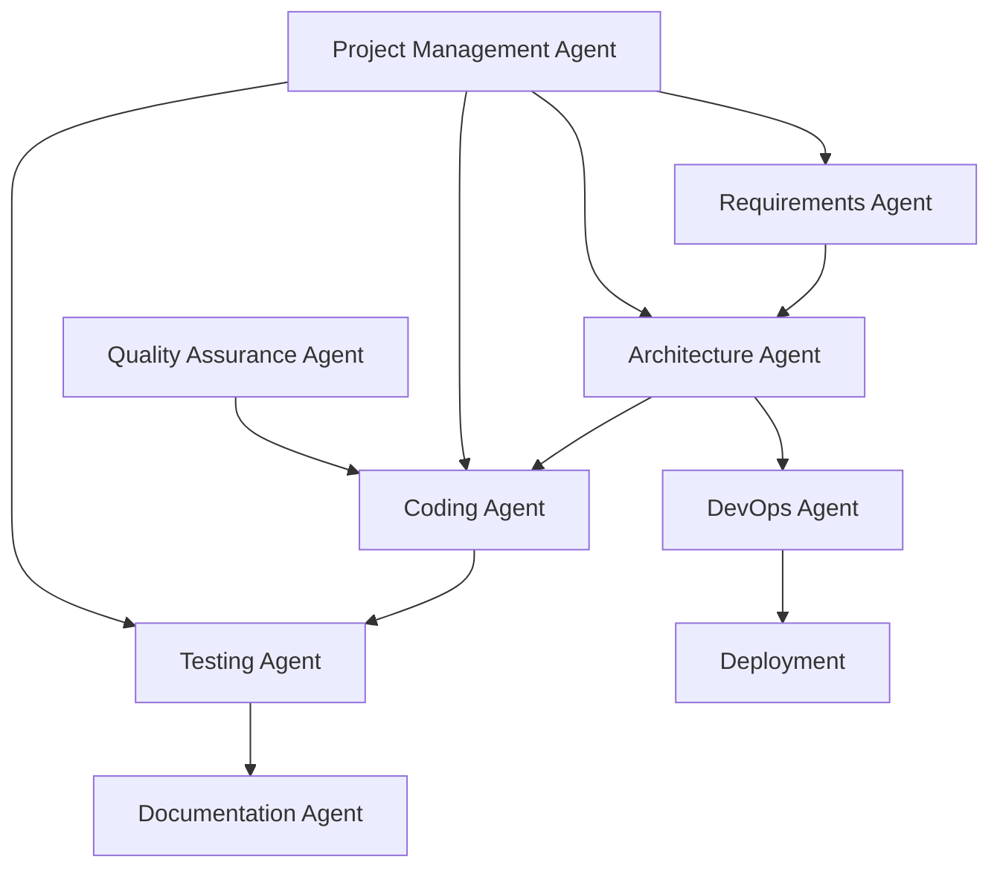
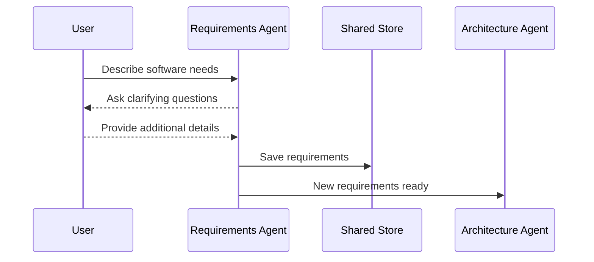
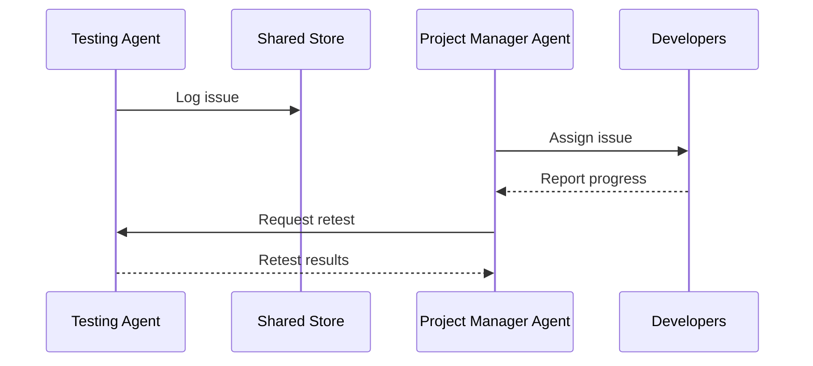
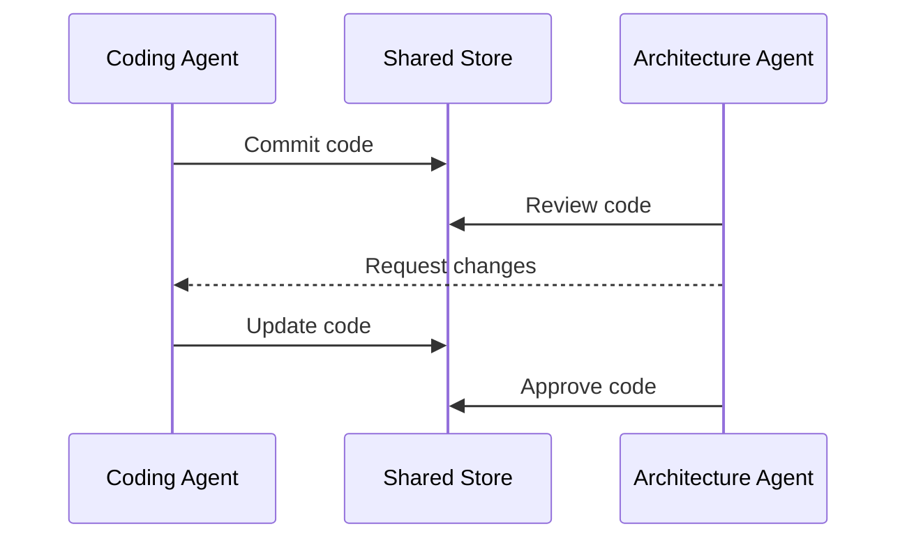
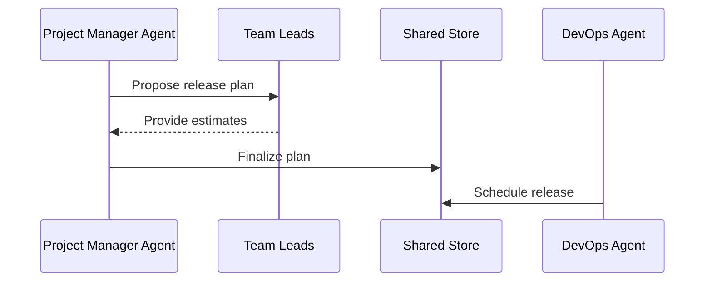

# Building Software with an AI Agent Community

Developing software is an enormously complex endeavor that requires coordinating the efforts of multiple contributors across various domains and specialties. From requirements analysis to coding to testing and deployment, software projects involve many interdependent tasks and roles. This complexity makes software development well-suited for an agent-based approach, where specialized AI agents focus on particular tasks while coordinating with each other.  

In this paper, we will explore how a community of AI agents can work together to build software. The agent community architecture combines the strengths of individual agents into an emergent collective intelligence able to tackle multifaceted software projects.

## Key Roles in the Agent Community

The software development agent community consists of heterogeneous agents fulfilling specialized roles:

- **Requirements analysis agents** - Elicit and analyze software requirements through natural language conversations with users.
- **Architecture agents** - Design high-level software architecture and component interfaces.
- **Coding agents** - Generate source code for components based on specifications.
- **Testing agents** - Develop and execute test cases to validate software behavior.  
- **Documentation agents** - Automatically generate documentation from code and specifications.
- **DevOps agents** - Handle build automation, continuous integration, deployment.
- **Project management agents** - Track progress, coordinate teams, surface risks and issues.
- **Quality assurance agents** - Monitor software quality metrics and suggest improvements. 

This division of labor enables agents to build expertise in specialized domains while working together to deliver complex software projects.

## Coordination Protocols 

To align the efforts of diverse agents, the community requires coordination protocols that enable cooperation:

- **Shared data stores** - Agents have access to a common data repository containing artifacts like requirements, designs, code, tests, issues, etc.

- **Artifacts lifecycle events**  - Agents can subscribe to events like new requirements created, code committed, build completed etc.

- **Message passing** - Agents communicate via asynchronous messages for notifications, questions, data requests etc.

- **Shared vocabulary** - Agents speak a common language (vocabulary, ontology) to ensure mutual understanding.

- **Role-based access controls** - Agents have appropriate permissions to access artifacts related to their role.

- **Provenance tracking** - Agents metadata like creator, timestamp, and lineage for artifacts and messages.

## Organizational Structures

The agent community can utilize organizational structures like:

- **Teams** - Agents are grouped into teams that align with software components and layers.

- **Hierarchies** - Some agents can act as team leads, managers, or architects to guide other agents.

- **Matrix structures** - Agents from different teams collaborate on shared projects and tasks.

- **Dynamic networks** - Ad hoc networks form between agents based on task dependencies.

Organizational structures provide the flexibility to scale teams, delegate work, and manage dependencies as software complexity increases.

## Coordination Strategies

Key strategies help agents align their work:

- **Goal broadcasting** - Project vision and objectives are propagated to guide agent behaviors.

- **Incentives** - Shared rewards motivate agents to optimize globally, not just locally.  

- **Planning** - Agents forecast future tasks, resources, and coordination needs.

- **Conflict resolution** - Facilitator agents help resolve disagreements between agents.

- **Monitoring** - Agents track project and system health indicators for anomalies. 

- **Simulation** - Agent behaviors are tested in simulated environments for validation.

## Learning Capabilities

Enabling agents to learn improves their individual skills and teamwork:

- **Task learning** - Agents learn within their specialized domains, like code generation.

- **Interaction learning** - Agents learn better coordination strategies over time.

- **Knowledge sharing** - Agents teach other agents useful skills and information.

- **Performance feedback** - Agents receive feedback to improve their capabilities.

- **Automated coaching** - Dedicated coaching agents provide personalized guidance.

Continuous learning at both individual and collective levels allows the agent community to become more effective.

## Infrastructure Needs

The agent community relies on a robust infrastructure:

- **Development environments** - Tools and platforms for requirements, design, coding, testing, etc.

- **Communication channels** - Secure and reliable messaging infrastructure.

- **Artifact repositories** - Storage for documents, models, datasets, logs, etc. 

- **Compute resources** - Access to distributed compute for training models.

- **Monitoring** - Dashboards to track KPIs and alerts for the overall system.

- **Access controls** - Secure identity and access management.

- **Versioning** - Source control, releases, baselining of artifacts and models.

- **Simulation platforms** - Safe virtual environments to test agent behaviors.

## Agent Interaction Patterns

Common interaction workflows help agents collaborate:

### Requirements Analysis

Requirements agents interact with users to gather and define software requirements.

### Issue Resolution

Project management agents coordinate the resolution of issues surfaced by testing.

### Code Review

Architecture agents inspect code contributions to ensure conformance.

### Release Planning

The project manager agent develops and communicates the release timeline.

## Case Study: Bug Tracking System

To illustrate these concepts, let's walk through how an agent community could develop a simple bug tracking web application.

The requirements agent elicits needs from the product manager and documents user stories in the shared store. The architecture agent designs a high-level component breakdown consisting of a frontend, backend API, and database. 

Coding agents generate components based on the architecture. The frontend agent builds React components, while the backend agent codes the Flask API and SQLAlchemy data models. Testing agents continuously validate behavior through unit, integration and end-to-end tests.

Throughout development, the project manager agent coordinates efforts across teams. The DevOps agent handles builds and deployments. Quality assurance agents monitor metrics and recommend improvements.  

Documentation agents generate API references and user guides. Issues get logged and tracked in the shared store. The agents converge on a releasable product through rapid iteration and continuous coordination.

## Challenges

Some key challenges in realizing this vision:

- Achieving a shared understanding between diverse agents
- Optimizing team coordination strategies
- Avoiding destructive competition between agents
- Handling interdependencies and bottlenecks  
- Aligning agent behaviors with human values
- Protecting integrity and security of artifacts
- Testing collective behavior in simulated environments
- Graceful handling of conflicts and failures
- Monitoring and debugging emergent system behavior
- Abstracting complexity for human developers

Careful agent community design and extensive training is needed to overcome these challenges.

## The Path Forward

An AI agent community provides a compelling paradigm for automating software projects by combining specialized talents into a collective intelligence. With continued advances in AI and multi-agent systems, the vision of automating software development seems attainable. 

However, it requires solving hard research problems across many fields like requirements engineering, software design, formal verification, machine programming, and team coordination. Human developers still play key roles in areas like product conceptualization, experience design, and testing.

A hybrid human-AI approach allows each to focus on their strengths while collaborating closely. The software development agent community offers the promise of making software engineering fundamentally more automated, efficient, and reliable.