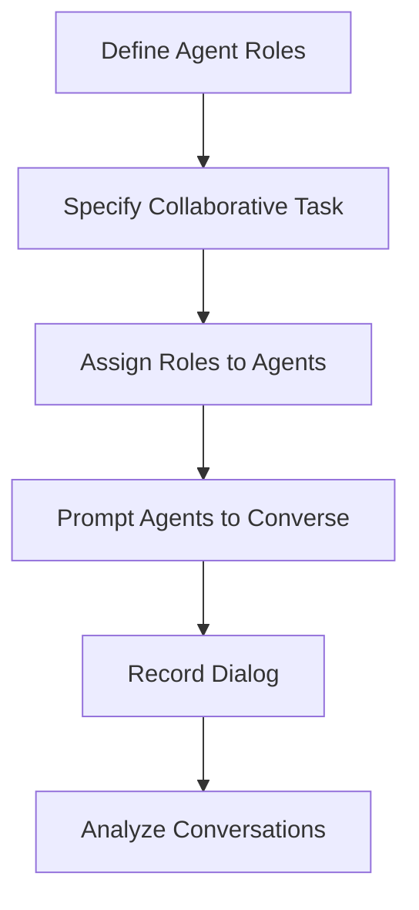
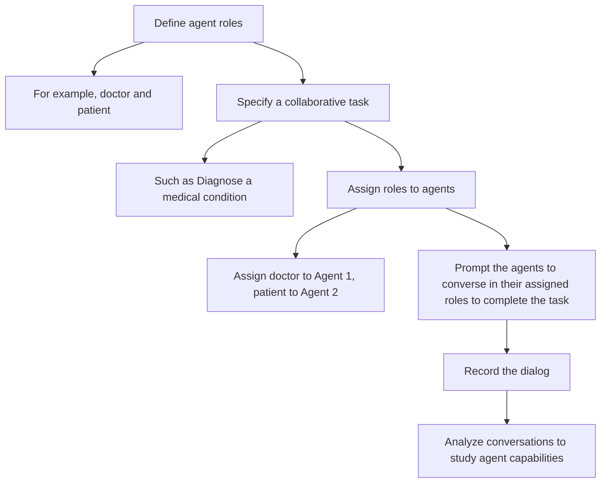

# Democratizing AI: An Open Source Framework for Exploring Communicative Agents

## The Rise of Language Models

Recent years have seen astounding advances in natural language processing, largely driven by a class of AI models called large language models (LLMs). LLMs like GPT-4 and Anthropic Claude are trained on massive text datasets and can generate remarkably human-like text.

They display strong few-shot learning capabilities - the ability to perform tasks after seeing just a few examples, without extensive training.

Chatbots powered by LLMs like Anthropic's Claude and Google's Bard can engage in free-flowing dialog and execute complex instructions. They offer a more natural user experience compared to traditional rigid chatbots. However, their impressive capabilities also raise concerns about potential misuse if deployed irresponsibly.

To develop safe and beneficial AI, we need to pursue open and transparent research. Projects like Anthropic's Constitutional AI embody this ethos. The team proactively engages the community and publishes detailed technical documentation.

**The CAMEL project shares this commitment to transparency.** It provides an open source framework for exploring and understanding communicative AI agents based on LLMs.

## Introducing CAMEL

CAMEL stands for "Communicative Agents for 'Mind' Exploration of Large Language Models." It is developed and maintained by a team of researchers at King Abdullah University of Science and Technology (KAUST).

**The project has several key goals:**

- Enable open experimentation with conversational agents
- Study multi-agent cooperation and coordination  
- Analyze agent capabilities and limitations
- Promote transparency in AI research

At its core, CAMEL facilitates autonomous dialog between AI agents to complete specified tasks. This allows us to observe the agents' behaviors and interactions.

The framework includes implementations of different conversational models, tools for analyzing generated dialog data, and configurable prompts to define agent roles and goals. It is all open source on GitHub.

Let's break down the key concepts and capabilities of CAMEL:

### Role-Playing Agents

CAMEL centers around an approach called **role-playing** to generate goal-oriented dialog between AI agents.

Here's how it works:

1. **Define agent roles** - For example, "doctor" and "patient"

2. **Specify a collaborative task** - Such as "Diagnose a medical condition"

3. **Assign roles to agents** - Assign "doctor" to Agent 1, "patient" to Agent 2

4. **Prompt the agents** to converse in their assigned roles to complete the task

5. **Record the dialog** - Analyze conversations to study agent capabilities

This role-playing setup creates a natural framework for goal-oriented dialog. The researchers can choose different combinations of roles and tasks to explore various scenarios.

### Configurable Agents

CAMEL supports different conversational AI models, allowing experimentation with various types of agents. The initial release includes two implementations:

- **GPT-3.5 Turbo agent** - Based on Anthropic's open source GPT-3.5 Turbo model
- **BlenderBot agent** - Based on Facebook's BlenderBot 2.0 model

The agents are easily configurable using conditional prompting. This allows assigning them to different roles and goals for role-playing experiments.

Additional conversational models can be added by implementing the provided agent interface.

### Automated Prompting

A key innovation of CAMEL is the use of **automated prompting** between agents, called inception prompting.

After the initial role and task prompts, the agents take over conversation without any further human input. The user agent provides an instruction, the assistant agent responds, and this cycle repeats until the task is complete.

This automation enables uninterrupted dialog spanning thousands of exchanges. It unlocks studies at a much larger scale than possible with human-in-the-loop prompting.

### Modular Design

CAMEL employs a modular design to facilitate experimentation and extension:

- **Config** - Defines parameters like agent types and prompts
- **Orchestrator** - Coordinates the overall workflow
- **Agents** - Encapsulates different conversational models
- **Analyzer** - Processes and analyzes conversation data
- **Explorer** - Visualizes insights from analysis

This separation of concerns makes it easy to swap different components like agents or prompts. You can build on the framework by implementing additional modules.

### Open Datasets

The CAMEL project has published two datasets generated using role-playing:

- **AI Society** - 25,000 dialogs between 50 diverse roles on daily life tasks
- **Code** - 50,000 dialogs where a programmer assists with coding tasks

These rich multi-turn conversational datasets support research in language understanding and commonsense reasoning. The Code dataset provides valuable data for code generation and semantic parsing studies.

All data is released under an open license, enabling free use and analysis by the community. This furthers the project's goal of transparency.

## Capabilities and Limitations

By enabling controlled experiments, CAMEL sheds light on the capabilities and limitations of conversational AI agents.

The team's analysis revealed several key insights:

- LLMs can engage in coherent multi-turn dialog when guided by prompts and roles
- Automated prompting works for thousands of exchanges without human input
- Agents sometimes deviate from assigned roles and instructions
- Conversations can get stuck in repetitive pointless loops
- Engineering prompts to keep dialog on track is non-trivial
- Role-playing setup is highly scalable for generating dialog data

These findings highlight the need for further research to improve:

- Consistency in maintaining goals and narrative  
- Ability to avoid useless repetitious exchanges
- Techniques to keep dialog on track without hand-crafting prompts
- Alignment between human intentions and model behaviors  

The CAMEL framework provides a testbed to prototype and evaluate solutions to these challenges.

While imperfect, today's LLMs still display impressive conversational capabilities. CAMEL data reveals their potential for complex dialog when properly directed.

However, uncontrolled open-domain chat remains beyond reach currently. LLMs can easily get derailed without a clear anchoring context. The simplicity of role-playing sidesteps this issue by providing situational grounding.

Going forward, scaling up modeling capacity and training data seems key to handling less structured conversations. Projects like Anthropic's Constitutional AI point the way.

## Safety and Ethics

When dealing with powerful generative models like LLMs, responsible practices are crucial. Uncontrolled generation of harmful, biased or misleading content must be avoided.

The CAMEL team takes care to constrain their experiments, but acknowledge risks if agents are misused:

> "We are aware of the potential risks and limitations of this work. For the risks, since existing LLMs are not fully tuned to be harmless, they can be easily exploited by malicious users for harmful purposes."

To mitigate dangers, they implemented several measures:

- Agents decline unethical instructions
- Conversations terminate on detecting role deviations
- Maximum length limits prevent excessive generation
- Rigorous human review before data publication

Still, bad actors could potentially misuse the framework. Openness always carries risks. However, transparency and accountability should remain guiding principles for AI development.

While not foolproof, the CAMEL project demonstrates earnest efforts to conduct safe and ethical research for the greater good.

## Roadmap and Get Involved

CAMEL is under active development as an academic research initiative. The team invites community participation to shape future directions.

Some areas for potential contribution:

- **Integrate additional conversational models** - Expand the set of available agent implementations

- **Enhance conversation quality and coherence** - Explore techniques like reinforcement learning from human feedback

- **Scale up experiments** - Run studies with more roles, tasks, and conversations

- **Multilingual support** - Enable role-playing in languages beyond English

- **UI enhancements** - Develop more interactive visualization and analysis of conversations

- **Downstream tasks** - Use generated dialogs for training tasks like semantic parsing  

- **Model diagnostics** - Surface how different prompts activate the model's capabilities

To get started, check out the CAMEL GitHub repo:

<https://github.com/lightaime/camel>

Try running the example experiments with GPT-3.5 Turbo agents. See the conversations unfold. Then dive into the code and data.

I welcome your feedback and contributions! This is an open project - shape it to explore the aspects of conversational AI you find most intriguing.

Democratizing access to powerful tech is how we ensure it helps humanity flourish. With CAMEL, my hope is to equip more people to participate in and influence the future of AI.

Together, through open and transparent research, we can gain deeper wisdom about our mind's creations.

## Papers

Li, G., Hammoud, H. A. K., Itani, H., Khizbullin, D., & Ghanem, B. (2023). CAMEL: Communicative Agents for “Mind” Exploration of Large Scale Language Model Society. King Abdullah University of Science and Technology (KAUST).

<https://www.camel-ai.org>, <https://ghli.org/camel.pdf>

## Other resource

A great presetation called "Building AI Society with Agents" by Guohao Li:

- The paper provides a historical overview of agents in AI, tracing their evolution from early symbolic agents to modern reinforcement learning agents and language model agents.

- Key developments highlighted include:

  - Using agents in reinforcement learning for games like Backgammon, Atari, and Go (AlphaGo).

  - Recent work on language models as agents, like WebGPT and Agent Models.

  - Missing capabilities like communication, learning, and embodiment.

- The paper introduces CAMEL, a role-playing conversational agent framework for guiding chat agents.

- Several other recent agent systems are discussed:

  - Generative Agents that display emergent social behaviors

  - GPT-Bargaining agents that negotiate via self-play

  - Showrunner Agents that participate in story generation

  - Communicative agents for software development

  - Multi-agent debate to reduce fallacies

  - RoCo multi-robot collaboration agents

<https://ghli.org/AI-Agent-AgentX-Guohao.pdf>
