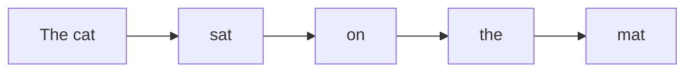
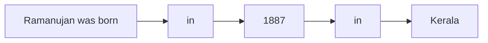
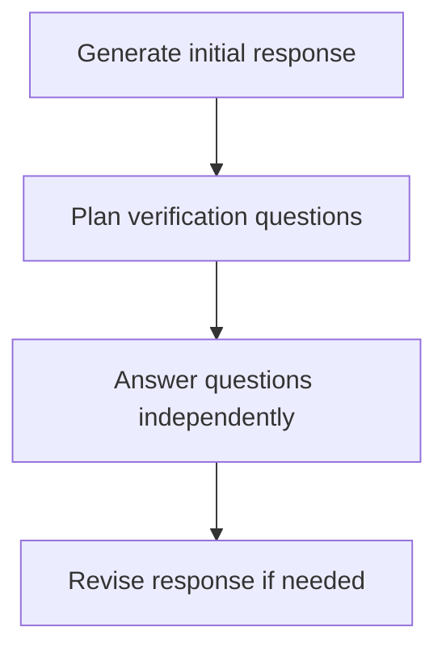
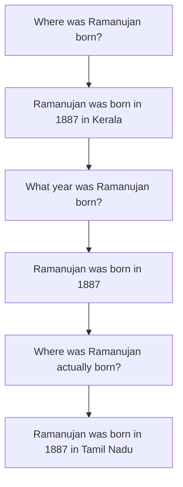

# Making AI Hallucinate Less with Chain-of-Verification

AI models like GPT-3 can generate impressively human-like text, but sometimes they “hallucinate” - produce information that sounds plausible but is actually incorrect. This remains an issue even in the largest models trained on billions of text examples, especially for rarer, long-tail facts. 

How can we make AI less prone to these harmful inaccuracies? Exciting new research from Meta AI proposes a simple but effective technique called Chain-of-Verification (CoVe) to directly reduce hallucinations when generating text. 

In this post, we’ll unpack how CoVe works and why it's an elegant approach to instilling more robustness against hallucination in AI systems.

## The Hallucination Problem

Let's first understand why hallucination happens in large language models like GPT-3, which are trained to predict the next token (word) given the previous context using a technique called autoregressive generation.



The model maximizes the probability of generating the actual next token in the training data. But it still assigns non-zero probabilities to other tokens that may seem plausible in context, even if they are incorrect.

For common topics the model has seen ample training examples for, it can reliably assign very high probability to the right tokens. 

But for rare or unfamiliar topics, the model is more likely to spit out high-confidence but incorrect tokens. This manifests as hallucination of plausible-sounding but false information.



In the example above, the model might incorrectly generate "Kerala" with high probability as Ramanujan's birthplace, even though he was born in Tamil Nadu. The rarity of the context makes the model more prone to hallucinate.

This becomes especially problematic for open-domain conversational agents like chatbots that need to handle a diverse range of possible queries. Hallucinations undermine the accuracy and trustworthiness of such systems.

## Enter Chain-of-Verification

The core idea behind CoVe is to have models verify their own outputs by breaking down fact-checking into multiple simpler steps. Let's break it down:



1. First, generate a baseline response to the query using the language model 

2. Next, have the model automatically formulate factual verification questions about its own response, to identify potential mistakes.

3. Crucially, answer each verification question independently, without attending back to the original response. This factorization avoids reinforcing any false information.

4. Finally, generate a revised response incorporating any corrections from the verification step.

By decomposing verification into atomic sub-tasks focused on specific facts, models can more accurately check their work and fix fallacies. The overall flow looks like this:



Let's go through each step to better understand why CoVe works so well.

## Generating the Initial Response

We start with a standard large language model like GPT-3 and provide it with a query to respond to, like:

```
Where was Ramanujan born?
```

The model auto-regressively generates a top candidate response based on its trained parameters. This may contain inaccuracies, which we want to catch.

```
Ramanujan was born in 1887 in Kerala.
```

So far nothing new - we've just used the base model as is. The next steps are where CoVe comes in. 

## Planning Factual Verification 

In the next step, we ask the model itself to formulate verification questions about its own response, to explicitly check for potential mistakes. 

The prompt for this could be:

```
Based on the response "Ramanujan was born in 1887 in Kerala", suggest 2-3 questions to verify key facts that could identify inaccuracies in the response if any.
```

And the model may respond with:

```
- What year was Ramanujan born?
- Where was Ramanujan actually born? 
```

By inspecting its own response, the model intelligently creates simple verification questions targeted at dubious or shaky parts of the response. This acts as an automatic debugging step.

## Answering Verification Questions

Here is where the “chain” in chain-of-verification comes in. 

We answer each verification question independently, without allowing the model to see its original response. This avoids reinforcing any incorrect details from the initial response.

The model is given just the verification question, without context, like: 

```
What year was Ramanujan born?
```

And generates the response:

``` 
Ramanujan was born in 1887.
```

By answering each question from scratch, false information from the original response does not get propagated. The model is more likely to respond accurately when given a focused factual query.

We repeat this for each verification question, with the model answering based only on the question itself.

## Revising the Response

In the final step, we show the model the initial response and the answers to each verification question. 

The model integrates this information to produce a revised, final response. Going back to our example:

```
Initial response: Ramanujan was born in 1887 in Kerala. 

Verification questions:
- What year was Ramanujan born? 1887
- Where was Ramanujan actually born? Tamil Nadu

Final response: Ramanujan was born in 1887 in Tamil Nadu.
```

By identifying and correcting any factual inconsistencies through targeted verification, we get an updated response that hallucinates less.

And that's the high-level idea behind chain-of-verification! By intelligently prompting large language models to analyze and refine their own outputs, we can reduce harmful inaccuracies.

## Why It Works

Breaking down complex verification into simpler steps that avoid propagating falsehoods is the key takeaway. Some reasons why CoVe is effective:

- **Focused factual questions** are easier for models to answer accurately than free-form generation.

- **Factorization** prevents distributing false information from the initial response across the verification steps.

- Models can more easily **maintain consistency** between the final response and verification answers when revising the response.

- The overall chain acts like a **debugging** process to identify then correct fallacies.

- Minimal changes to existing models are needed to implement CoVe, making adoption easier.

The technique bear similarities to human fact-checking workflows that also break verification into atomic checks on specific statements. CoVe essentially automates this process of iterative refinement for AI.

## Results on Reducing Hallucination

The researchers comprehensively evaluated CoVe on a diverse set of tasks where models often hallucinate incorrect information:

- **Question answering** over statements with contextual misleading facts 

- **List generation** like naming US presidents, where models often fabricate incorrect entries

- **Long-form generation** like biographies where factual accuracy is critical

They compared CoVe versions of models like GPT-3 against baseline implementations without verification. Some highlights of their results:

- CoVe reduced hallucinations in question answering by 15-38% across different base models like T0 and T5.

- It improved factuality in list generation by up to 5x over baselines.

- For longform generation, it increased factual scoring of biographies by a significant 28%.

Remarkably, these hallucination reductions came with minimal loss in fluency, coherence or other language quality metrics. The verification chain was able to filter out falsehoods while maintaining overall output quality.

The consistent benefits across very different generation tasks demonstrated CoVe's versatility as a general-purpose anti-hallucination technique.

## Limitations and Future Work

The paper discusses a few limitations and areas for improvement:

- CoVe can still hallucinate for completely open-ended queries where it's unclear what should be verified. Constraining the task more helps.

- There are sometimes tradeoffs between hallucination and relevance, which future work should aim to balance.

- More advanced methods to select the most useful verification questions could improve results further.

- CoVe increases inference costs due to its multi-step process, which may limit its use for latency-sensitive applications today.

- Evaluating hallucination itself lacks comprehensive datasets currently, especially for conversational settings.

Overall though, CoVe offers substantial gains in factual accuracy with minimal downsides. The simple prompting approach makes it easy to integrate with modern large language models.

Extensions like combining CoVe with external knowledge retrieval and recursion in the verification step could make it even more robust. There are many exciting research directions to explore here!

## Key Takeaways

Chain-of-verification is a promising technique to directly reduce harmful hallucinations in AI systems:

- It works by prompting models to verify their own outputs through targeted questioning. 

- Factoring out verification avoids propagating falsehoods.

- CoVe improved factual accuracy significantly over baselines across diverse generation tasks.

- The simple prompting-based approach integrates easily with modern large models like GPT-3.

- There are still areas for improvement, but CoVe effectively trades off relevance for reduced hallucination today.

I hope this deep dive has helped demystify how chain-of-verification induces factuality in language models! I'm excited to see CoVe incorporated into more industrial applications where correctness is critical. With techniques like this, we inch closer to AI that intelligently reasons about - and fixes - its own mistakes.

## References

[1 - Chain-of-Verification Reduces Hallucination in Large Language Models
Shehzaad Dhuliawala, Mojtaba Komeili, Jing Xu, Roberta Raileanu, Xian Li, Asli Celikyilmaz, Jason Weston](https://arxiv.org/abs/2309.11495)