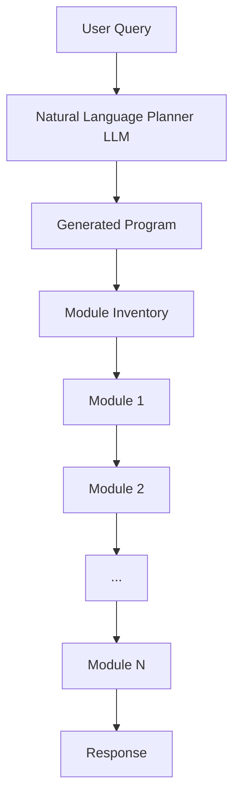
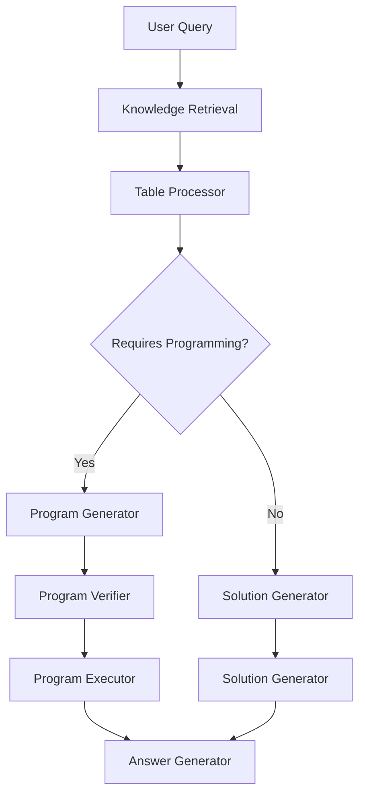
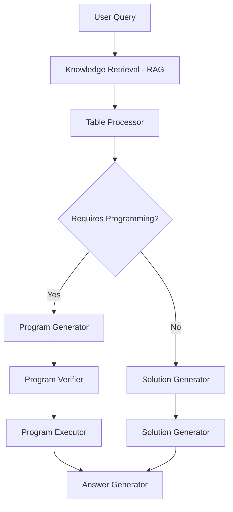

# Chameleon: Enabling Adaptive Reasoning for AI through Dynamic Tool Composition

Artificial intelligence has made remarkable strides in recent years, with large language models like GPT-3 and ChatGPT showcasing impressive natural language capabilities. However, fundamental limitations persist that constrain real world applicability. Models still struggle with reasoning that requires mathematical logic, accessing external knowledge, or coordinating diverse skills for multifaceted tasks. This article explains how the new technique Chameleon provides a more versatile reasoning framework by dynamically composing specialized tools as needed.


## The Limits of Language Models

Large language models leverage vast parameters and data to generate coherent text as if a human wrote it. For instance, ChatGPT can hold nuanced conversations, explain concepts, and synthesize logical arguments. However, glaring weaknesses exist. Without access to updated external information, ChatGPT has limited knowledge about current events and facts. It cannot perform precise mathematical computations beyond simple arithmetic. Analyzing complex visual inputs like diagrams or deriving insights from tables exceeds its reasoning capacity.

**Consider a real example**:

_"Compare the average kinetic energies of the particles in each sample. Which sample has the higher temperature?"_

Answering this requires inspecting a diagram of gas particles to deduce their kinetic energies based on movement. Then determining which sample has the higher temperature using physics knowledge. Large language models lack both the visual perception and mathematical logic needed.

Chameleon aims to overcome such limitations by coordinating specialized tools dynamically.

## Introducing Chameleon - Adaptive Tool Composition

Chameleon allows large language models to tackle multifaceted reasoning tasks by assembling situation-specific toolchains. Based on a given problem, it determines the appropriate skills needed and selects suitable models. For instance, a question involving a visual diagram may require an image captioning tool to understand the content and a physics knowledge module to interpret it. Chameleon composes these models sequentially to emulate human-like reasoning.




Unlike prior work on static model combinations or rule-based tool selection, Chameleon utilizes large language models themselves to generate textual programs that orchestrate toolchains. This provides greater flexibility to incorporate new capabilities as needed.

For example, to answer the kinetic energy question above, Chameleon may generate the following program:

```
[ImageCaptioner, PhysicsKnowledge, SolutionGenerator]
```

This compositional approach allows tapping into diverse reasoning skills while retaining language model strengths like inference and knowledge integration.



## Chameleon's Modular Inventory

To enable multifaceted reasoning, Chameleon utilizes a diverse inventory of plug-and-play modules encompassing:

- **Knowledge Access**: Information retrieval tools like search engines provide external knowledge.
- **Visual Perception**: Image captioning generates textual descriptions from visual inputs.
- **Mathematical Logic**: Programming modules perform precise symbolic reasoning.
- **Table Comprehension**: Tools simplify complex tables for easier understanding.

The current module library contains:

| Module                    | Description                                   |
| ------------------------- | --------------------------------------------- |
| Knowledge Retrieval       | Retrieves specialized background knowledge    |
| Image Captioner           | Generates captions describing image contents  |
| Text Detector             | Extracts text from images                     |
| Program Generator         | Creates Python programs for logical reasoning |
| Table Row/Column Selector | Filters tables to relevant rows/columns       |

This expandable inventory enables adapting reasoning to suit the problem context, significantly enhancing capability.

## LLM as Program Generator

A key innovation in Chameleon is utilizing a large language model itself as the program generator that composes toolchains. The LLM acts as a natural language planner - instructed using demonstrations to synthesize module sequences for new problems.

For example, with the following demo the LLM may learn:

**Problem:** Question involving kinetic theory and gas sample diagram.

**Program:** [ImageCaptioner, PhysicsKnowledge, SolutionGenerator]

Now for a new problem, the LLM can generate a suitable program:

**Problem:** Question about gravity and object mass diagram.

**Generated Program:** [ImageCaptioner, PhysicsKnowledge, SolutionGenerator]

This approach allows incorporating new modules easily through demonstration without specialized training.



## Inputs & Outputs of the Planning LLM


The LLM planner accepts the query, available modules, and optional constraints as input. It generates a textual program sequencing the selected modules to execute.

For each module, the input query and prior results are processed and updated for the next module. After full execution, the final output is returned.

## Evaluating Chameleon's Performance

Chameleon was benchmarked on two complex reasoning tasks requiring diverse skills:

**ScienceQA**: Answering science questions using knowledge, visual diagrams, and text.

**TabMWP**: Mathematical word problems with tabular data.

Using GPT-4 as the base LLM, impressive accuracy improvements resulted:

- **ScienceQA**: 86.54% accuracy, beating prior best model by 11.37%
- **TabMWP**: 98.78% accuracy, exceeding state-of-the-art by 17.0%

Chameleon also outperformed task-specific models and Chain-of-Thought prompting.

Analysis revealed rational tool selection with constraints. For instance, on ScienceQA image captioning was used for 89% of visual questions, physics knowledge for 91% of physics questions.

## Conclusion

Chameleon provides a promising approach to overcome inherent limitations of large language models in reasoning tasks. Composing specialized modules dynamically using an LLM program generator enables multifaceted inference capabilities. It achieved new state-of-the-art results on complex benchmarks, showcasing enhanced accuracy through toolchain coordination. The flexible framework allows seamless extension to new capabilities in the future. Chameleon represents a significant step towards more human-like versatile reasoning in AI systems.

To learn more about Chameleon's capabilities, check out the full paper: https://arxiv.org/abs/2304.09842


https://chameleon-llm.github.io/


## Citations


Lu, Pan, Baolin Peng, Hao Cheng, Michel Galley, Kai-Wei Chang, Ying Nian Wu, Song-Chun Zhu, and Jianfeng Gao. "Chameleon: Plug-and-Play Compositional Reasoning with Large Language Models." arXiv preprint arXiv:2304.09842 (2023).
