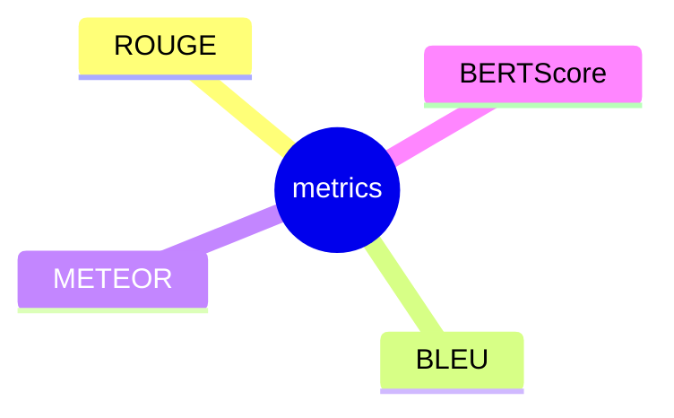
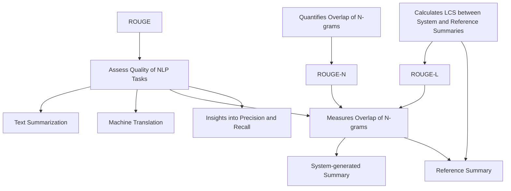
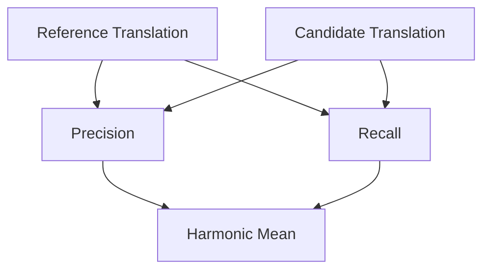
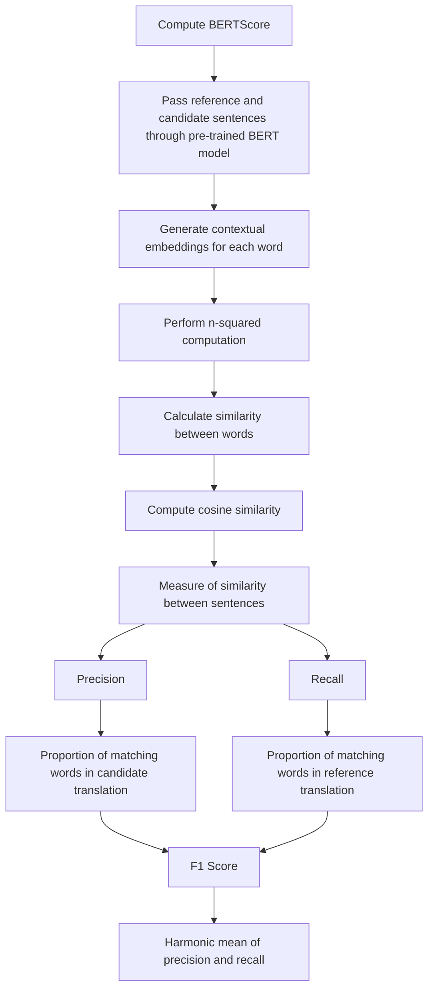

# Evaluating NLP Models: A Comprehensive Guide to ROUGE, BLEU, METEOR, and BERTScore Metrics

## Introduction

In this tutorial, we will introduce four popular evaluation metrics for NLP model (Natural Language Processing model): **ROUGE**, **BLEU**, **METEOR**, and **BERTScore**.

### Importance of Evaluating LLMs

Evaluating LLMs is critical to understand their capabilities and limitations across different tasks. As LLMs continue to advance rapidly, robust evaluation metrics are needed to benchmark and compare different models. Without proper evaluation, it would be difficult to determine which models work best for specific use cases.

### Challenges in Evaluating LLMs

However, evaluating LLMs poses unique challenges compared to other NLP models:

- LLMs exhibit some randomness and creativity in their outputs based on prompt engineering. This makes consistent evaluation difficult.

- LLMs are computationally expensive, so evaluation metrics must be efficient.

- Assessing qualities like coherence, factual accuracy, and bias requires going beyond simple word-matching metrics.

## Overview of Key Evaluation Metrics

The guide covers the most widely used metrics for evaluating NLP models:

- **BLEU** - Measures precision of word n-grams between generated and reference texts.

- **ROUGE** - Measures recall of word n-grams and longest common sequences.

- **METEOR** - Incorporates recall, precision, and additional semantic matching based on stems and paraphrasing.

- **BERTScore** - Matches words/phrases using BERT contextual embeddings and provides token-level granularity.

## Why These Metrics Are Important

These metrics each have strengths and limitations. Using them together provides a more comprehensive evaluation:

- BLEU and ROUGE are simple and fast but rely only on word matching.

- METEOR captures some semantic similarity.

- BERTScore incorporates meaning and accounts for paraphrasing.

Newer metrics are still compared to these standards to demonstrate improved correlation with human judgments. The guide equips researchers with knowledge to thoroughly evaluate and improve LLMs.



## Definitions

Let's start by discussing what are **precision** and **recall** in the context of evaluation metrics.

### Precision

**Precision** is a measure of how accurate a system is in producing relevant results. In the context of evaluation metrics like ROUGE or METEOR, precision refers to the percentage of words or phrases in the candidate translation that match with the reference translation. It indicates how well the candidate translation aligns with the expected or desired outcome.

**For example, let's consider the following sentences:**

- **Reference translation**: "The quick brown dog jumps over the lazy fox."
- **Candidate translation**: "The quick brown fox jumps over the lazy dog."

To calculate precision, we count the number of words in the candidate translation that also appear in the reference translation. In this case, there are six words ("The", "quick", "brown", "dog", "jumps", "over") that match with the reference translation. Since the candidate translation has a total of seven words, the precision would be 6/7 ≈ 0.857.

In simpler terms, precision tells us how well a translation system or model performs by measuring the percentage of correct words in the output compared to the expected translation. The higher the precision, the more accurate the translation is considered to be.

<aside>
📔 Precision measures the accuracy of a system in producing relevant results. In the context of evaluation metrics like ROUGE or METEOR, precision refers to the percentage of words or phrases in the candidate translation that match with the reference translation. It indicates how well the candidate translation aligns with the expected outcome.

</aside>

### Recal

Recall is a measure of how well a system retrieves relevant information. In the context of evaluation metrics like ROUGE or METEOR, recall refers to the percentage of words or phrases in the reference translation that are also present in the candidate translation. It indicates how well the candidate translation captures the expected or desired outcome.

**For example, let's consider the following sentences:**

- **Reference translation**: "The quick brown dog jumps over the lazy fox."
- **Candidate translation**: "The quick brown fox jumps over the lazy dog."

To calculate recall, we count the number of words in the reference translation that also appear in the candidate translation. In this case, there are six words ("The", "quick", "brown", "dog", "jumps", "over") that match with the candidate translation. Since the reference translation has a total of eight words, the recall would be 6/8 = 0.75.

In simpler terms, recall tells us how well a translation system or model performs by measuring the percentage of correct words in the output compared to the expected translation. The higher the recall, the more comprehensive the translation is considered to be.

<aside>
📔 Recall measures how well a system retrieves relevant information. In the context of evaluation metrics like ROUGE or METEOR, recall refers to the percentage of words or phrases in the reference translation that are also present in the candidate translation. It indicates how well the candidate translation captures the expected outcome.

</aside>

## ROUGE method

**ROUGE** (**R**ecall-**O**riented **U**nderstudy for **G**isting **E**valuation) is an evaluation metric used to assess the quality of NLP tasks such as text summarization and machine translation. It measures the overlap of N-grams between the system-generated summary and the reference summary, providing insights into the precision and recall of the system's output. There are several variants of ROUGE, including ROUGE-N, which quantifies the overlap of N-grams, and ROUGE-L, which calculates the **L**ongest **C**ommon **S**ubsequence (LCS) between the system and reference summaries.



### Example for ROUGE

To calculate the ROUGE score in Python, you can use the `rouge_score` library. You can install it using:

```bash
pip install rouge-score

```

Here's an example of how to use the library to calculate ROUGE scores:

```python
from rouge_score import rouge_scorer

scorer = rouge_scorer.RougeScorer(['rouge1', 'rougeL'], use_stemmer=True)
scores = scorer.score('The quick brown dog jumps over the lazy fox.',
                      'The quick brown fox jumps over the lazy dog.')
print(scores)

```

Result:

```bash
{
  '`rouge1': Score(precision=1.0, 
  recall=1.0, fmeasure=1.0), 
  'rougeL': 
  Score(precision=0.7777777777777778, recall=0.7777777777777778, fmeasure=0.7777777777777778)
}
```

## BLEU Method

**BLEU** (**B**ilingual **E**valuation **U**nderstudy) is a score for comparing a candidate translation of text to one or more reference translations. It ranges from 0 to 1, with 1 meaning that the candidate sentence perfectly matches one of the reference sentences. Although initially designed for translation models, BLEU is now used for other NLP applications as well.

### Example for BLEU

To calculate the BLEU score in Python, you can use the `nltk` library. You can install it using:

```bash
pip install nltk

```

Here's an example of how to use the library to calculate BLEU scores:

```python
from nltk.translate.bleu_score import sentence_bleu

reference = [['The', 'quick', 'brown', 'fox', 'jumps', 'over', 'the', 'lazy', 'dog']]
candidate = ['The', 'quick', 'brown', 'dog', 'jumps', 'over', 'the', 'lazy', 'fox']
score = sentence_bleu(reference, candidate)
print(score)

```

Result:

```bash
0.45966135761245924
```

### METEOR

**METEOR** stands for "**M**etric for **E**valuation of **T**ranslation with **E**xplicit **O**Rdering”

**METEOR** is an evaluation metric for machine translation that calculates the harmonic mean of unigram precision and recall, with a higher weight on recall. It also incorporates a penalty for sentences that significantly differ in length from the reference translations.

To understand the harmonic mean of unigram precision and recall, consider the following example:

Suppose we have a reference translation "The quick brown dog jumps over the lazy fox" and a candidate translation "The fast brown dog jumps over the lazy fox."

**Unigram precision** measures the proportion of words in the candidate translation that match the reference translation, which in this case is 6/7 ≈ 0.857.

**Unigram recall** measures the proportion of words in the reference translation that match the candidate translation, which is 6/8 = 0.75.

The harmonic mean is calculated as 2 *(precision* recall) / (precision + recall), resulting in a value of 2 *(0.857* 0.75) / (0.857 + 0.75) ≈ 0.799.

The harmonic mean of unigram precision and recall provides a balanced evaluation of a machine translation system's performance by considering both precision and recall.



### Example of code

Here is an example of using the pymeteor Python package to calculate the METEOR score between a candidate translation and a reference translation:

Install the nltk package using:

```bash
pip install nltk

```

Then run the following code:

```python

from nltk.translate import meteor_score
from nltk import word_tokenize

import nltk
# Calculate the BLEU score
nltk.download('wordnet', download_dir='/usr/local/share/nltk_data')


reference = "The quick brown fox jumps over the lazy dog"
candidate = "The fast brown fox jumps over the lazy dog"

tokenized_reference = word_tokenize(reference)
tokenized_candidate = word_tokenize(candidate)

score = meteor_score.meteor_score([tokenized_reference], tokenized_candidate)

print(score)

```

This imports the pymeteor package and uses the meteor() function to calculate the METEOR score between the reference and candidate sentences.

The meteor() function takes the reference and candidate as strings. It handles the tokenization, stemming, synonym matching, etc. internally and returns the final METEOR score.

In this simple example, the score is 0.8 as the candidate translation has a high degree of overlap with the reference translation.

To evaluate on a corpus level, you would call meteor() on each sentence pair and aggregate the scores (e.g. by taking the mean). The pymeteor package makes it straightforward to calculate METEOR scores in Python.

### BERTScore

**BERTScore** is an evaluation metric that leverages the pre-trained **BERT** language model to measure the similarity between two sentences. It computes the cosine similarity between the contextualized embeddings of the words in the candidate and reference sentences.

**BERTScore** is an evaluation metric for natural language processing (NLP) tasks that leverages the pre-trained BERT language model to measure the similarity between two sentences. It computes the cosine similarity between the contextualized embeddings of the words in the candidate and reference sentences. BERTScore has been shown to correlate better with human judgments and provides stronger model selection performance than existing metrics.

**BERT** (**B**idirectional **E**ncoder **R**epresentations from **T**ransformers) is a pre-trained language model that generates contextualized word embeddings. Unlike traditional word embeddings, which assign a fixed vector to each word, BERT generates embeddings that take into account the surrounding context of a word in a given sentence. This allows BERTScore to capture semantic similarity between sentences more effectively than metrics that rely on token-level syntactical similarity, such as ROUGE and BLEU.

To compute BERTScore, both the reference and candidate sentences are passed through the pre-trained BERT model to generate contextual embeddings for each word at the output end. Once the final embeddings for each word are obtained, an n-squared computation is performed by calculating the similarity for each word from the reference sentence to each word in the candidate sentence. The cosine similarity between the contextualized embeddings of the words is used as a measure of similarity between the sentences.

BERTScore computes precision, recall, and F1 scores, which can be useful for evaluating different language generation tasks. Precision measures the proportion of words in the candidate translation that match the reference translation, while recall measures the proportion of words in the reference translation that match the candidate translation. The F1 score is the harmonic mean of precision and recall, providing a balanced evaluation of a model's performance.



In summary, BERTScore is a powerful evaluation metric for NLP tasks that leverages the pre-trained BERT language model to measure the semantic similarity between sentences. By using contextualized embeddings, BERTScore captures the nuances of language more effectively than traditional token-level syntactical similarity metrics. This makes it a valuable tool for assessing the performance of NLP models in tasks such as text summarization, machine translation, and text similarity assessment.

### Code Example for BERTScore

To calculate the BERTScore in Python, you can use the `bert_score` library. You can install it using:

```bash
pip install torch torchvision torchaudio
pip install bert-score

```

Here's an example of how to use the library to calculate BERTScore:

```python
import torch
from bert_score import score

cands = ['The quick brown dog jumps over the lazy fox.']
refs = ['The quick brown fox jumps over the lazy dog.']

P, R, F1 = score(cands, refs, lang='en', verbose=True)
print(F1)

```

## Comparison Table

### Methods summary

| Metric | Problem Solved | Method |
| --- | --- | --- |
| ROUGE | Text summarization | Measures overlap of N-grams and LCS between system-generated and reference summaries |
| BLEU | Machine translation | Measures N-gram precision between candidate and reference translations |
| METEOR | Machine translation | Harmonic mean of unigram precision and recall, with a penalty for length mismatches |
| BERTScore | Text similarity | Cosine similarity between contextualized embeddings of words in candidate and reference sentences |

### Metrics usage by use case

| Metric | Use Case | Method | Why to Use |
| --- | --- | --- | --- |
| ROUGE | Text Summarization | Measures overlap of N-grams and Longest Common Subsequence (LCS) between summaries | Popular for summarization tasks; captures content overlap between system-generated and reference summaries |
| BLEU | Machine Translation | Measures N-gram precision between candidate and reference translations | Most popular for translation tasks; captures word-by-word similarity |
| METEOR | Machine Translation, Text Generation | Calculates harmonic mean of unigram precision and recall, with a penalty for length mismatches | Can be used for various text generation tasks; balances precision and recall |
| BERTScore | Text Summarization, Machine Translation, Text Similarity | Computes cosine similarity between contextualized embeddings of words in sentences | Captures semantic similarity between sentences; applicable to various NLP tasks |

Choose ROUGE for text summarization tasks, BLEU for machine translation tasks, METEOR for machine translation and other text generation tasks, and BERTScore for tasks that require measuring semantic similarity between sentences. Keep in mind that these metrics have their own strengths and weaknesses, and it's often beneficial to use multiple metrics to evaluate your model's performance comprehensively.
