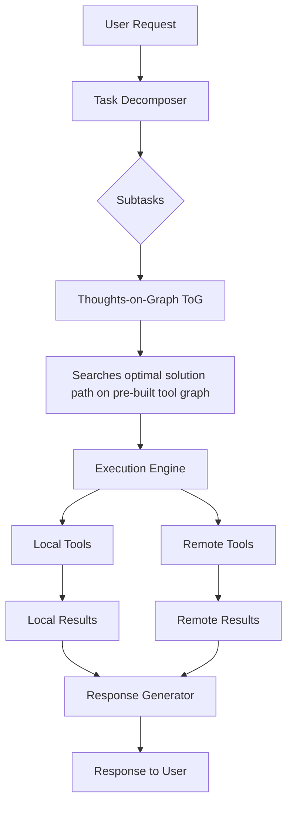
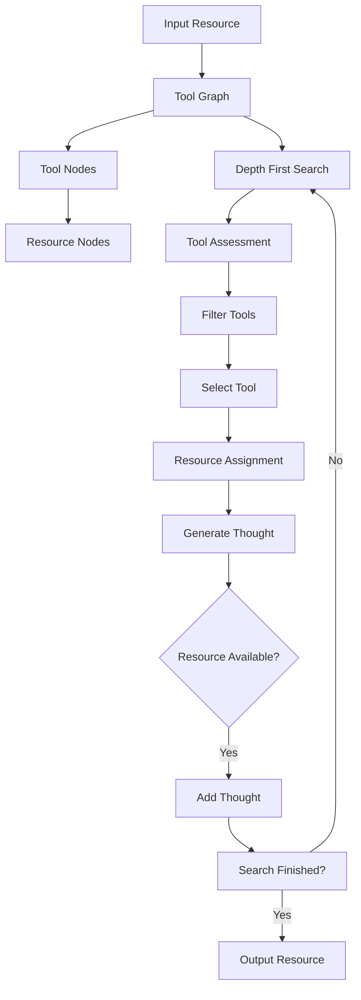
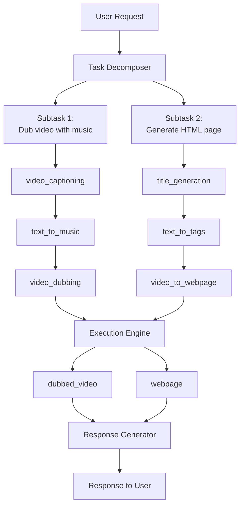

# Unlocking the Power of Tools for AI through Graph Search

## Introduction

Recent advances in large language models (LLMs) have enabled remarkable progress in language understanding and generation. However, despite their linguistic prowess, these models still struggle to effectively use tools and handle complex real-world tasks.

I had the pleasure to study a very interesting paper - [ControlLLM: Augment Language Models with Tools by Searching on Graphs](https://arxiv.org/abs/2310.17796) - which proposes a novel framework to address this limitation. In this article, I'll provide an in-depth explanation of ControlLLM and how it leverages graph search to unlock the tool-using abilities of LLMs.


## The Need for Tools

Before we dive into ControlLLM, it's worth understanding why tools are so vital for advancing AI capabilities. While modern LLMs can generate remarkably coherent text, their knowledge is still restricted to patterns discerned from textual data. This limits their effectiveness for many real-world tasks involving images, videos, and other modalities.

To expand AI's boundaries, we need the ability to invoke specialized tools like object detectors, image editors, audio generators etc. This allows tapping into vast troves of expert knowledge beyond what any single model can encapsulate. Just like humans rely on instruments and machines, AI systems need toolkits to tackle complex jobs.

However, efficiently using tools poses serious challenges for LLMs due to:

- **Ambiguous Instructions**: Vague prompts make it hard to infer the right tools.
- **Inaccurate Tool Selection**: Choosing unsuitable tools leads to failures.
- **Improper Tool Usage**: LLMs struggle to set tool parameters correctly.
- **Inefficient Scheduling**: Optimal tool ordering is non-trivial.

Without effectively overcoming these hurdles, the power of tools remains out of reach for LLMs. This is where ControlLLM comes in!

## The ControlLLM Framework

ControlLLM is an innovative framework designed to enable LLMs to accurately control diverse tools for solving complex, real-world tasks. It was developed by researchers from SJTU, HKUST and SenseTime.



As shown above, ControlLLM has three key components:

1. **Task Decomposer**: Breaks down complex prompts into well-defined subtasks.

2. **Thoughts-on-Graph (ToG)**: Searches for optimal solutions on a tool graph.

3. **Execution Engine**: Efficiently runs tools using the solution path.

I'll explain each piece and how they fit together.

### Task Decomposer

The first step is to parse vague requests into concrete subtasks using the Task Decomposer. This is handled by a language model which splits prompts into smaller, manageable chunks.

Each subtask has clear inputs, outputs, and objectives. This decomposition gives a precise specification for the subsequent planning stage. Even complex requests with multiple steps can be systematically broken down in this manner.

### Thoughts-on-Graph

The decomposed subtasks are handled by the Thoughts-on-Graph (ToG) module. ToG searches for optimal solutions by traversing a pre-built directed graph describing tool relationships.

The nodes represent tools while directed edges indicate dependencies between them. For example, an object detector node may connect to an image cropper node since cropping requires detected objects.

ToG searches this graph to find chains of tools which can solve the subtask, akin to a mind map of possible solutions. Different search strategies like beam or greedy search can be used to trade-off optimality with efficiency.

The key advantage is that ToG avoids relying solely on the LLM to hallucinate plans, instead using the graph structure to prune the space of valid solutions. This combines the comprehension skills of LLMs with the concrete tool knowledge captured by the graph.

**ToG works with the following steps**:

- **Depth First Search**: Traverses the graph to find all possible solution paths.
- **Tool Assessment**: Evaluates each path based on subtask inputs/outputs.
- **Filter Tools**: Removes paths with unsuitable tools.
- **Select Tool**: Picks the best path based on a scoring function.
- **Resource Assignment**: Assigns local or remote resources to each tool.
- **Generate Thought**: Generates a thought for the LLM to execute.
- **Add Thought**: Adds the thought to the LLM's memory.
- **Search Finished?**: Checks if all subtasks are solved.
- **Output Resource**: Returns the final output.



### Execution Engine

Finally, the selected solution path is executed by the Execution Engine. This interprets the chain of tools and runs them efficiently using local or cloud resources.

It can parallelize independent subtasks for better latency and provides progress updates during execution. The engine ultimately generates the final output in a clear, user-friendly format.

Together, these three components allow ControlLLM to robustly break down, solve, and execute complex prompts requiring diverse tools. The framework is readily extensible as updating the tool graph allows handling new tools without retraining the LLM.

Next, I'll walk through a detailed example to better understand ControlLLM in action.

## Illustrated Example

Let's see how ControlLLM handles this request:

_"Can you dub the video.mp4 with suitable background music and then generate a HTML page to introduce the video?"_

### Step 1: Task Decomposition

The first step is to decompose this complex request into two subtasks using the Task Decomposer module:

1. Dub the video with background music
2. Generate a HTML page introducing the video

Each subtask is specified with its domain, input arguments, and output in a structured format.

### Step 2: Thoughts-on-Graph

Given the subtasks, ToG searches for solutions on the tool graph:

It finds two candidate paths:

1. _video-captioning_ -> _text-to-music_ -> _video-dubbing_

2. _title-generation_ -> _text-to-tags_ -> _video-to-webpage_

ToG selected these chains by matching subtask inputs/outputs with tool dependencies captured by the graph structure.

### Step 3: Execution

The Execution Engine runs these solutions by calling the required tools:

```text
[
  Action(tool_name='video_captioning', inputs={'video':'video.mp4'}, outputs=['caption']),

  Action(tool_name='text_to_music', inputs={'text':'caption'}, outputs=['music']),

  Action(tool_name='video_dubbing', inputs={'video':'video.mp4', 'audio':'music'}, outputs['dubbed_video'])
]

[
  Action(tool_name='title_generation', inputs={'text':'caption'}, outputs=['title']),

  Action(tool_name='text_to_tags', inputs={'text':'caption'}, outputs=['tags']),

  Action(tool_name='video_to_webpage', inputs={'video': 'dubbed_video', 'title': 'title', 'tags': 'tags'}, outputs['webpage'])
]
```

It runs them in parallel when possible and returns the final _dubbed_video_ and _webpage_.



### Conclusion

Through this concrete example, we can see how ControlLLM systematically breaks down a complex request, leverages graph search to plan tool usage, and efficiently executes the solution using available tools.

The framework as a whole unlocks sophisticated tool-using abilities for LLMs in a robust and extensible manner. In the next section, I'll discuss the implications of this work and some potential limitations.

## Citations

Liu, Z., Lai, Z., Gao, Z., Cui, E., Zhu, X., Lu, L., Chen, Q., Qiao, Y., Dai, J., & Wang, W. (2023). ControlLLM: Augment language models with tools by searching on graphs. arXiv preprint arXiv:2310.17796.

[https://arxiv.org/abs/2310.17796](https://arxiv.org/abs/2310.17796))

[GitHub: https://github.com/OpenGVLab/ControlLLM](https://github.com/OpenGVLab/ControlLLM)
