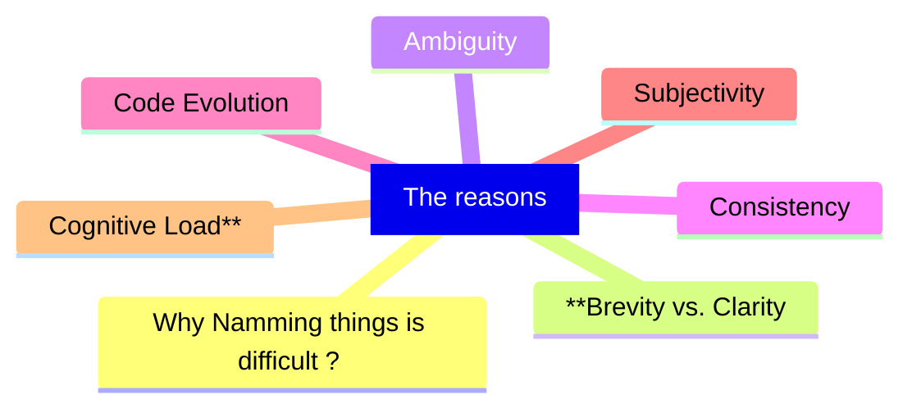
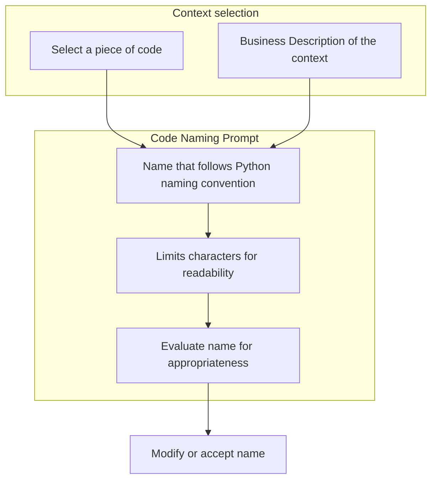
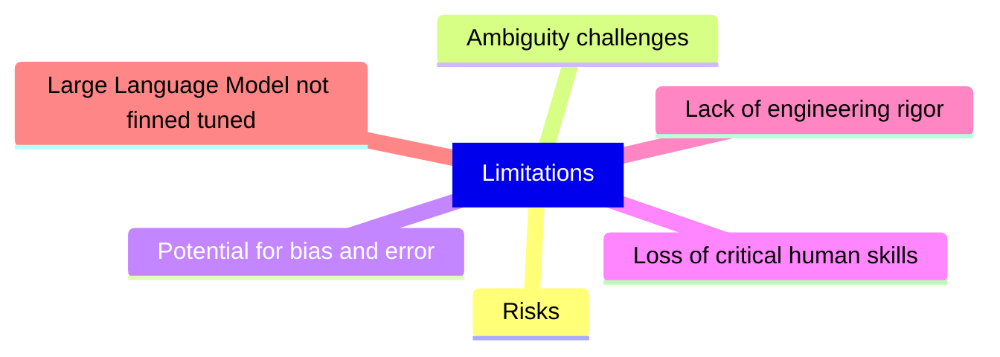

# Cracking the Code: How AI Can Solve One of Programming's Biggest Headaches - Naming  … . 🧠

## Introduction

Naming things is a critical, yet challenging task in programming. The names we give to functions, variables, classes, and other components deeply impact the understandability, maintainability, and extensibility of software systems. However, naming requires balancing many considerations including descriptiveness, conciseness, alignment with conventions, and conveyance of intent. The cognitive load of making these nuanced naming decisions repeatedly can lead to suboptimal outcomes like cryptic, generic names or misnomers that poorly reflect the underlying code.

Recent advances in AI, specifically large language models (LLMs) like OpenAI/GPT-3, offer the potential to aid developers in naming tasks by analyzing code context and generating recommendations. However, while promising, the use of AI also poses risks if not thoughtfully incorporated into engineering workflows. This essay analyzes the benefits and limitations of using LLM assistance for naming in programming. 

Best practices are provided for prompting the AI and strategically integrating suggestions to augment, not replace, human skills.


## Why Namming things is difficult ?

Naming things in programming is difficult for several reasons:

1. **Ambiguity**: Finding a name that accurately represents the purpose or function of a variable, class, or method can be challenging due to the inherent ambiguity of natural language. The same name may have different meanings to different people, leading to confusion and misinterpretation. For example, a variable named `data` could refer to different kinds of data in different contexts. [2]
2. **Brevity vs. Clarity**: Striking a balance between brevity and clarity is difficult. Short names may be easier to read and type, but they can be ambiguous or unclear. Longer names may be more descriptive but can be harder to read and may clutter the code. Short names like `i` and `j` for loop counters may be concise but unclear. Longer names like `customerInformationDictionary` are more descriptive but less readable. [11]
3. **Consistency**: Maintaining consistency in naming conventions across a codebase can be challenging, especially when multiple developers are involved. Inconsistent naming can lead to confusion and make the code harder to understand and maintain. For example, some developers may use `getUserInfo()` while others use `fetchUserName()` [5].
4. **Code Evolution**: As code evolves and grows, names that were once accurate may no longer be relevant or consistent. This requires developers to constantly update and refactor names to better reflect the current state of the code. For example, a `printReport()` function may need to be renamed to `exportReport()` after adding email functionality. [18]
5. **Subjectivity**: Naming is a subjective process, and developers may have different opinions on what constitutes a good name. This can lead to disagreements and inconsistencies in naming conventions. `Hoozit` while another prefers `Whatchamajig`. [2]
6. **Cognitive Load**: Naming things requires a deep understanding of the problem domain and the code's functionality. This adds to the cognitive load of programming, making it more challenging to come up with appropriate names. [13]

Good naming is essential, but striking the right balance is challenging. The art of naming takes practice and experience in each new coding context. [3] [5]



## The Challenges and Psychology of Naming in Programming

Naming things in code has often been described as one of the "two hardest problems" in computer science along with cache invalidation and off-by-one errors. The difficulty stems from the delicate balance required to make names informative yet succinct, unique yet consistent, and abstract yet precise enough to convey the underlying intent. This challenge grows exponentially as code bases become larger and involve more interconnected components.

Consider an example of writing a mobile app. The developer must come up with effective names for screens, functions, variables, classes, enums, constants, and more. Each name represents a design decision with implications for understanding, maintenance, and extensibility down the road. A function name like `calculateTotal()` is less clear than `calculateTotalOrderPrice()`. A screen named `Home` reveals less purpose than `UserDashboardScreen`.

### Making these naming decisions correctly involves several psychological factors

**Conveying intent:** The name must encapsulate what the code does or represents so others understand its purpose. Mapping abstract concepts to concrete names is cognitively demanding.

**Recallability:** Names must be concise enough to remember yet distinctive from other names used. Recall becomes harder as the code base grows larger.

**Consistency:** Names should align with conventions like coding style guides and established patterns in the code base so everything appears cohesive.

**Decision fatigue:** The mental effort of making judgment calls on names repeatedly leads to deteriorating quality, known as decision fatigue. Decision fatigue is a psychological phenomenon where the quality of decisions deteriorates after a long session of decision making. One example of how decision fatigue can impact our ability to make good choices can be seen in Mark Zuckerberg, the CEO of Facebook. He famously avoids decision fatigue by wearing the same gray t-shirt and jeans every day. By eliminating the need to make a decision about what to wear, he frees up his mental resources for more important decisions. Developers are prone to settle for mediocre names just to get code working. In the mobile app example, the developer likely makes hundreds of naming decisions across functions, screens, variables, and more. The cognitive load of recalling existing names, deriving new apt names, and ensuring consistency is extremely taxing. The sheer effort required means developers often resort to generic names like `handler`, `utils`, `temp` just to get code functioning. But these types of names end up reducing the readability and maintainability down the road.

## The Promise: How AI Could Help With Naming Tasks

Recent advances in AI present an intriguing opportunity to help developers make better naming choices by automating parts of the process. Specifically, large language models (LLMs) like Claude show promise in analyzing code context and generating naming recommendations:

**Analyzing intent:** LLMs can be trained on millions of code examples to discern patterns about how programmers name different types of components based on their intent. For a new piece of code, the LLM can then suggest names that would align with conventions for conveying that intent.

**Making connections:** Humans are limited in recognizing all the associations and relationships within large, complex codebases. But LLMs can synthesize signals across a codebase and make connections that would be difficult for a human to manually deduce. This knowledge can produce more precise, consistent names.

**Learning continuously:** LLMs can further improve their naming capabilities by continuously ingesting new code examples and programmer feedback on which suggestions were accepted vs rejected. This allows the models to adapt to specific developer tastes and codebase styles.

**Mitigating decision fatigue:** By outsourcing some of the naming process to AI, developers can reduce the mental strain of making these decisions repeatedly. This frees up cognition for higher reasoning on complex design problems.

Let's revisit the mobile app example. When writing a function to place a food delivery order, the developer could invoke the LLM to analyze the function's logic and suggest potential names reflecting its purpose. The model may propose `placeDeliveryOrder()`, `submitFoodOrder()`, or `sendOrderToRestaurant()` based on its training. The developer can choose the best option rather than having to conjure a name from scratch.

Over many such suggestions, the model can adapt to the developer's style, improving future recommendations. By offloading the naming grunt work, the developer can focus cognition on tougher challenges like architectural decisions. AI naming assistance used judiciously has the potential to improve code clarity and reduce fatigue.

## Example of using prompts to name things

To use prompt to name a class, first select a piece of code as a context. Then, use a prompt to help guess the intent of the class. The prompt should ask for a name that follows the naming convention for Python, and limits the number of characters to ensure readability. Once the prompt generates a recommendation, the developer should evaluate it for appropriateness and consistency with existing naming conventions before accepting or modifying it.



### **Prompt for Naming Python Classes**

```
Please provide a name for the class in the selected code context that accurately reflects its purpose. The name should follow Python naming conventions and be limited to a maximum of X characters to ensure readability. 

Consider the broader context of the application and how this function fits into the overall architecture. 

Please evaluate the prompt's recommendation for appropriateness and consistency with existing naming conventions before accepting or modifying it.

The context of the application is:

"""
{Context}
"""

The Class is:

"""
{Function}
"""
```

**Example:**

```python
class FinManager:
    def __init__(self, owner, initial_balance=0):
        self.owner = owner
        self.balance = initial_balance
        self.transactions = []

    def deposit(self, amount, description):
        """Record a deposit transaction."""
        if amount > 0:
            self.balance += amount
            self.transactions.append((description, amount))

    def withdraw(self, amount, description):
        """Record a withdrawal transaction."""
        if amount > 0 and amount <= self.balance:
            self.balance -= amount
            self.transactions.append((description, -amount))

    def get_transaction_history(self):
        """Retrieve the transaction history for this portfolio."""
        return self.transactions

    def get_balance(self):
        """Get the current balance of the portfolio."""
        return self.balance
```

**Result of the naming with the prompt:**

```
Please provide a name for the class in the selected code context that accurately reflects its purpose. The name should follow Python naming conventions and be limited to a maximum of X characters to ensure readability. Consider the broader context of the application and how this function fits into the overall architecture. 
Please evaluate the prompt's recommendation for appropriateness and consistency with existing naming conventions before accepting or modifying it.

The context of the application:

""" 
The application manage a portofolio asset for the finance industry
"""

The class is:
"""
class FinManager:
    def __init__(self, owner, initial_balance=0):
        self.owner = owner
        self.balance = initial_balance
        self.transactions = []

    def deposit(self, amount, description):
        """Record a deposit transaction."""
        if amount > 0:
            self.balance += amount
            self.transactions.append((description, amount))

    def withdraw(self, amount, description):
        """Record a withdrawal transaction."""
        if amount > 0 and amount <= self.balance:
            self.balance -= amount
            self.transactions.append((description, -amount))

    def get_transaction_history(self):
        """Retrieve the transaction history for this portfolio."""
        return self.transactions

    def get_balance(self):
        """Get the current balance of the portfolio."""
        return self.balance
"""
```

**Result of Naming the class using the prompt**

The name "PortfolioManager" is more informative and aligns better with the financial industry context, making it a suitable choice for the class name.

### **Prompt for Naming Python Function**

```
Please provide a name for this function in the selected code context that accurately reflects its purpose and aligns with the Python naming convention. The name should be limited to a maximum of X characters to ensure readability and convey the function's intended business value. Consider the broader context of the application and how this function fits into the overall architecture. Please evaluate the prompt's recommendation for appropriateness and consistency with existing naming conventions before accepting or modifying it.

The context of the application:

""" 
{Context}
"""

The Function is:

"""
{Function}
"""
```

**Example:**

```python
def calculate(item_price, discount):
    """
    Calculates discounted price for an item.

    Parameters:
    item_price (float): The original price of the item.
    discount (float): The discount rate applied to the item.

    Returns:
    float: The discounted price of the item.
    """
    discounted_price = item_price * (1 - discount)
    return discounted_price

```

In this function, we are calculating the discounted price for an item. The function takes two parameters: `item_price` and `discount`. The function returns the discounted price of the item.

**Naming the function based on the prompt:**

```
Please provide a name for this function in the selected code context that accurately reflects its purpose and aligns with the Python naming convention. The name should be limited to a maximum of X characters to ensure readability and convey the function's intended business value. Consider the broader context of the application and how this function fits into the overall architecture. Please evaluate the prompt's recommendation for appropriateness and consistency with existing naming conventions before accepting or modifying it.

The context of the appliction is:

"""
Finance applictation
"""

The function is:

"""

def calculate(item_price, discount):
    """
    Calculates discounted price for an item.

    Parameters:
    item_price (float): The original price of the item.
    discount (float): The discount rate applied to the item.

    Returns:
    float: The discounted price of the item.
    """
    discounted_price = item_price * (1 - discount)
    return discounted_price
"""
```

In the given code context, a suitable name for the function could be "**calculate_discounted_price**." This name accurately reflects the function's purpose, follows Python naming conventions, and is clear and concise. The function calculates the discounted price of an item based on its original price and the discount rate, which is precisely what the name suggests. The name is also limited in length, ensuring readability while conveying the function's intended business value.

## Limitations and Risks of Over-Reliance on AI Naming

Despite its promise, incorporating AI naming also poses risks if not done carefully. Full dependence on models like LLM for all naming could backfire due to several limitations:

**Lack of true reasoning about code:** LLMs have no intrinsic comprehension of code logic, merely pattern recognition based on training data. Without true reasoning, models cannot make naming choices informed by deep understanding of code behavior and semantics.

**Ambiguity challenges:** Natural language prompts to LLMs can be inherently ambiguous and misinterpreted. For example, a prompt like "Name this authentication function" could yield entirely different results than "Name this user login function" even if requesting names for the same code.

**Potential for bias and error:** LLMs often perpetuate biases in training data which could lead to inappropriate naming suggestions. They are also prone to hallucination errors under certain prompting conditions.

**Loss of critical human skills:** Over-reliance on AI naming risks developers losing their own creative skills for ideating descriptive, intent-revealing names. Atrophying these skills could be dangerous if AI tools are someday unavailable.

**Lack of engineering rigor:** Currently, there is a lack of rigor and oversight in how organizations prompt LLMs. Without care, this can lead to unpredictable or low-quality naming suggestions.

Concrete examples can illustrate the ramifications of improperly incorporating AI naming:

- A developer fully reliant on a biased LLM could inadvertently introduce offensive, non-inclusive names into a codebase.
- Overuse of an LLM prompted in a vague, unrigorous manner could dilute the consistency of naming conventions through random suggestions.
- Developers who never exercise their own naming skills could see those skills deteriorate over time and struggle to name complex architecture without AI aid.

**Large Language Model not finned tuned**: Large language models (LLMs) like OpenAI/GPT-3 have shown promise in assisting developers with naming tasks by analyzing code context and generating recommendations. However, these models are typically trained on a large base of code with a wide range of naming quality, including generic and poorly named components. To get the best possible naming recommendations, LLMs should be fine-tuned on high-quality examples of naming done right. This fine-tuning can enhance the precision of the models and produce more accurate and appropriate naming suggestions for developers.



These examples underscore the importance of maintaining responsible oversight of AI tools rather than handing full autonomy over naming to models.

## Best Practices for Integrating AI Naming Assistance

When used judiciously under the supervision of engineers, AI naming assistance can augment human skills and lead to more maintainable code. Here are some best practices to integrate LLMs effectively:

**Rigorous prompting:** Prompting LLMs for naming suggestions should be done with care and precision. Prompts should include detailed context like code snippets, functionality descriptions, adjacent names. Prompt engineering should also follow protocols and be monitored for quality.

**Selective application:** AI naming may be more suitable for lower-level components like functions, variables, classes than high-level architecture naming like modules, services, systems where human business knowledge is critical.

**Human judgment:** Treat LLM name suggestions as intelligent recommendations, not absolute answers. Developers should still examine, critique, and override names to exercise human judgment and maintain ownership.

**Fine-tuning:** Continue to fine-tune LLM naming models per developer feedback on which suggestions were suitable or not. Fine-tuning can enhance precision.

**Maintaining skills:** When relying on AI for common naming tasks, take opportunities to independently name complex modules or new features without assistance. This preserves creativity and critical thinking skills.

**Collaboration, not replacement:** Use AI naming as a collaborative tool for developers, not as a replacement for engineering skills. Collaboration combines the pattern recognition of models with uniquely human abilities like reasoning and abstraction.

With a thoughtful, tempered approach to incorporating AI alongside human abilities, developers can utilize automated naming assistance where beneficial while avoiding over-reliance and skill atrophy. Further research is still required to develop best practices for human-AI collaboration in code development.

## The needs to fine-tuned model for naming

## Conclusion

This essay analyzed the challenges of naming in programming and the promise of large language models to assist by analyzing intent and suggesting names. However, while AI naming aid has benefits, full over-reliance poses risks such as lack of reasoning, bias perpetuation, and loss of creative skills. With rigor and responsibility, AI and human collaboratively ideating names can reap the benefits of both, leading to more understandable, maintainable code. The principles explored can guide organizations on effectively leveraging AI to augment, not replace, developer expertise.

## References

[1] TwoHardThings - Martin Fowler https://martinfowler.com/bliki/TwoHardThings.html
[2] Naming conventions in programming – a review of scientific literature - Makimo https://makimo.com/blog/scientific-perspective-on-naming-in-programming/
[3] Effectively Naming Software Thingies | by Sagi Rabinovich - Medium https://medium.com/@rabinovichsagi/effectively-naming-software-thingies-fcea9d78a699
[4] Debunking the infamous “Only two hard problems in Computer Science” - Darren Broemmer https://darren-broemmer.medium.com/debunking-the-infamous-only-two-hard-problems-in-computer-science-b412a31c00df
[5] Naming convention (programming) - Wikipedia [https://en.wikipedia.org/wiki/Naming_convention_(programming)](https://en.wikipedia.org/wiki/Naming_convention_(programming))
[6] Code Comments vs. Clear Naming Conventions: Pros and Cons for Readability and Maintainability | by Summit Kumar | Medium https://medium.com/@summitkumar/code-comments-vs-clear-naming-conventions-pros-and-cons-for-readability-and-maintainability-f4b2accadbf
[7] Naming — one of the hardest things in Software development | by Leena | Continuous Delivery | Medium https://medium.com/continuousdelivery/naming-one-of-the-hardest-thing-in-software-development-af957d070762
[8] The importance of naming in programming | The Man in the Arena - Carl Alexander https://carlalexander.ca/importance-naming-programming/
[9] Programming Basics: Names matter - Federico Hatoum https://hatoum.com/blog/2016/9/4/programming-basics-names-matter
[10] Why do people say the hardest part about programming is naming and off by one errors and not coming up with the logic? - Reddit https://www.reddit.com/r/learnprogramming/comments/w5tpjk/why_do_people_say_the_hardest_part_about/
[11] Psychology of Code Readability. By no means should this be regarded as… | by Egon Elbre | Medium https://medium.com/@egonelbre/psychology-of-code-readability-d23b1ff1258a
[12] What impact does inconsistent formatting and naming conventions have on software maintenance and reuse? - Quora https://www.quora.com/What-impact-does-inconsistent-formatting-and-naming-conventions-have-on-software-maintenance-and-reuse
[13] The naming problem in programming | On software development https://kalkus.dev/2020/02/04/the-naming-problem-in-programming/
[14] Cognitive Perspectives on the Role of Naming in Computer Programs - [cs.wisc.edu](http://cs.wisc.edu/) https://pages.cs.wisc.edu/~liblit/ppig-2006/
[15] Best practices to write a readable and maintainable code | Choosing meaningful names https://dev.to/pacheco/how-do-you-name-things-3jae
[16] Why naming things is hard - Peter Hilton https://hilton.org.uk/blog/why-naming-things-is-hard
[17] The role of visual and semantic codes in object naming - ScienceDirect https://www.sciencedirect.com/science/article/pii/0010028574900164
[18] How do you choose meaningful and consistent names for your variables, functions, and classes? - LinkedIn https://www.linkedin.com/advice/1/how-do-you-choose-meaningful-consistent
[19] "There are 2 hard problems in computer science: cache invalidation, naming thing... | Hacker News https://news.ycombinator.com/item?id=23113314
[20] [PDF] Effects of Variable Names on Comprehension: An Empirical Study - CS - Huji https://www.cs.huji.ac.il/~feit/papers/Names17ICPC.pdf
[21] Are vague variable names more maintainable? - Software Engineering Stack Exchange https://softwareengineering.stackexchange.com/questions/369850/are-vague-variable-names-more-maintainable
[22] Naming Is Hard — Difficulties of Naming Variables - PSPDFKit https://pspdfkit.com/blog/2018/naming-is-hard/
[23] [PDF] How Developers Choose Names - arXiv https://arxiv.org/pdf/2103.07487.pdf
[24] [PDF] Towards a Naming Quality Model - CEUR-WS https://ceur-ws.org/Vol-2510/sattose2019_paper_8.pdf
[25] Eloise, Keating. “Why Mark Zuckerberg and other business leaders wear the same clothes to work each day.” https://www.smartcompany.com.au/business-advice/mark-zuckerberg-business-leaders-wear-clothes-work-day/