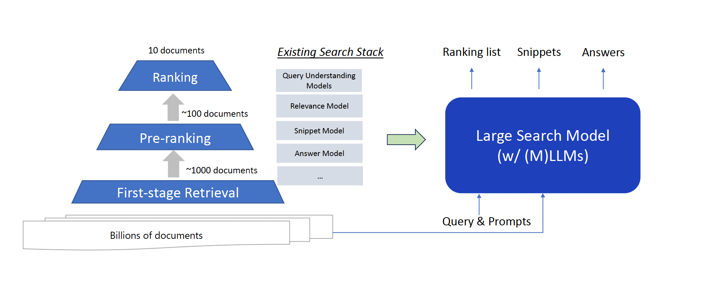

# Large Search Model: Redefining Search in the Era of Large Language Models

## Introduction

Search engines have become an indispensable part of our lives, allowing us to instantly find information on virtually any topic imaginable. The continuous evolution of search technology over the past few decades has led to great advancements, from the early days of keyword matching to the introduction of ranking algorithms like PageRank. However, while current search systems are remarkably effective in many cases, they still face significant limitations when handling complex, open-ended information needs.

In a recent paper titled "Large Search Model: Redefining Search Stack in the Era of LLMs", researchers from Microsoft propose a new conceptual framework for search called the large search model. This model aims to overcome the limitations of traditional search systems by capitalizing on the unique capabilities of large language models (LLMs).

François Chollet likened LLMs to a database of millions of "vector programs." A prompt acts as a search query into this vast program space. Even small modifications to the prompt can yield different but related outputs, allowing granular exploration of the continuous program space.

> _"If a LLM is like a database of millions of vector programs, then a prompt is like a search query in that database [...] this “program database” is continuous and interpolative — it’s not a discrete set of programs. This means that a slightly different prompt, like “Lyrically rephrase this text in the style of x” would still have pointed to a very similar location in program space, resulting in a program that would behave pretty closely but not quite identically. [...] Prompt engineering is the process of searching through program space to find the program that empirically seems to perform best on your target task"_
>
> **François Chollet**

## Foundations of Neural Information Retrieval

Before delving into the details of large search models, it is instructive to understand the foundations they build upon. Two key innovations in neural information retrieval over the past few years have been critical to enabling this new framework:

### Neural Ranking Models

Traditional search systems relied heavily on lexical matching signals, like finding documents that contain the query keywords. However, this approach fails to capture semantic relevance, leading to vocabulary mismatch issues.

Neural ranking models employ deep learning techniques like transformers to encode the contextual meaning of queries and documents. By modeling semantic similarity, they can overcome lexical gaps and better match user intent. Pre-trained language models like BERT have proven highly effective for various search tasks including document ranking, query generation, and question answering.

However, challenges remain in achieving robust performance across diverse scenarios, like out-of-domain generalization. Recent research on contrastive learning and model ensemble techniques seems promising for improving neural ranking models.

### Retrieval-Augmented Generation

A limitation of standard language models is their tendency to hallucinate incorrect or irrelevant information when generating long texts. Retrieval-augmented generation (RAG) addresses this by conditioning the model on relevant external information extracted through a retriever module.

RAG enhances factuality, informativeness, and verifiability for applications like open-domain QA and conversational search. Different techniques can integrate the retrieved information like concatenation, attention, or probability mixing. Jointly training the retriever and generator improves overall performance.

Nevertheless, optimal training strategies for RAG remain an open question. There are also concerns around the model's effectiveness in utilizing retrieved information.

These innovations have shown considerable promise in tackling key search challenges. However, most existing work focuses on using neural techniques to enhance specific components of traditional search pipelines. The large search model proposal represents a conceptual leap forward, reimagining the entire search stack from the ground up based on capabilities of LLMs.

## Introducing Large Search Models

The authors define a large search model as a customized LLM that unifies various search tasks through natural language prompting. It redefines the conventional search stack comprised of many discrete components like query understanding, retrieval, ranking, summarization, and question answering.

Instead, a single large language model can handle all these tasks in an end-to-end fashion by formulating them as text generation problems. This represents a significant departure from the current paradigm of fine-tuning specialized small models for each task.

Figure 1 source Microsoft paper arxiv:2310.14587 provides a high-level comparison between the traditional search stack and the proposed architecture. The large search model takes the user query and thousands of retrieved documents as input. It then generates all the elements that constitute the search engine result page like ranked lists, snippets, answers, and explanations.

The key advantages of this approach are:

- **Enhanced Performance:** LLM architecture and scale enables stronger language understanding and reasoning, improving result quality.

- **Simplified Stack:** Consolidates disparate components into a single model, reducing engineering complexity.

- **Flexible Interface:** Prompting allows seamless customization to new tasks without retraining.

- **Better Generalization:** Unified modeling leverages inter-task knowledge transfer and data augmentation.

Of course, this simplified stack comes at the cost of increased computational requirements during inference. Addressing this while retaining benefits presents an important area for continued research.

### Role of Prompting

Instead of adding task-specific parameters, prompting provides an interface to customize the large search model's behavior for diverse tasks:

- **In-Context Learning:** Providing input-output examples enables few-shot adaptation.

- **Instruction Tuning:** Natural language instructions can direct models without examples.

This allows zero-shot generalization at inference time. For instance, the same model can handle ranking, generation, and explanation tasks just by modifying the prompt.

See Table 2 for concrete examples of prompting templates.

| Task                    | Example                                                                                                                                                                                                                                                                                                                                                                                                                                                                                                                                                                                                                                                                                                                                                                                                                                                                                                                                                                                                                                                                                                                        |
| ----------------------- | ------------------------------------------------------------------------------------------------------------------------------------------------------------------------------------------------------------------------------------------------------------------------------------------------------------------------------------------------------------------------------------------------------------------------------------------------------------------------------------------------------------------------------------------------------------------------------------------------------------------------------------------------------------------------------------------------------------------------------------------------------------------------------------------------------------------------------------------------------------------------------------------------------------------------------------------------------------------------------------------------------------------------------------------------------------------------------------------------------------------------------ |
| Document Ranking        | Query: benefits of yoga    Document 1: Yoga provides many benefits for both physical and mental health. Some of the physical benefits include increased flexibility, improved muscle tone and strength, better balance and coordination, and reduced stress levels. Mentally, yoga can improve focus, concentration, and mood. It emphasizes living in the present moment which can help manage anxiety and depression. Overall, yoga is great for reducing stress and promoting overall health and wellbeing.    Document 2: Practicing yoga has been shown to reduce lower back pain, improve heart health, and help people manage anxiety and depression. The combination of physical postures, controlled breathing, and meditation make yoga a unique way to strengthen your body while calming your mind. Yoga helps increase flexibility as well as muscle tone and strength. It can improve balance, posture, and range of motion. Yoga benefits both the young and old.    Rank the documents by relevance to the query.    A: 2 > 1                                                          |
| Question Answering      | Q: what are the main causes of climate change?    Document: The primary cause of climate change is the burning of fossil fuels such as coal, oil and gas, which emits greenhouse gases into the atmosphere. These greenhouse gas emissions have significantly increased since the Industrial Revolution due to human activities. The greenhouse gases trap heat in the atmosphere, causing global temperatures to rise. Deforestation is another major cause of climate change as fewer trees means less carbon dioxide removal from the air. Usage of fertilizers in agriculture also leads to increased greenhouse gas emissions. Overall, human activities that release excessive amounts of greenhouse gases are the predominant causes of modern climate change.    A: The main causes of climate change are the burning of fossil fuels, deforestation, and agricultural practices that lead to increased greenhouse gas emissions. Human activities since the Industrial Revolution have released high levels of greenhouse gases, trapping heat in the atmosphere and causing global temperatures to rise. |
| Snippet Generation      | Q: benefits of regular exercise    D: Regular exercise provides many health benefits. It can help control weight, combat health conditions and diseases, improve mood, boost energy, promote better sleep, and increase life span. Some of the specific benefits include improving heart health, lowering blood pressure, controlling blood sugar, building strong bones and muscles, improving balance and coordination, easing joint pain, and reducing anxiety and depression. Staying physically active is one of the best things people can do for their overall health.    A: Regular exercise provides benefits such as weight control, improved cardiovascular health, better mood, more energy, and reduced anxiety. It also helps build strong muscles and bones, improves balance, and increases lifespan.                                                                                                                                                                                                                                                                                              |
| Query Intent Generation | Q: what is the weather forecast for los angeles this weekend    Intent: The user wants to know the predicted weather conditions in Los Angeles for the upcoming weekend. They are looking for a summary of the expected temperature, precipitation chance, etc. for the days encompassing the upcoming Saturday and Sunday in Los Angeles.                                                                                                                                                                                                                                                                                                                                                                                                                                                                                                                                                                                                                                                                                                                                                                               |
| Query Suggestion        | Q: tourist attractions in paris    Suggestions:    - What to see at the Louvre museum   - Best cafes and bistros in Paris   - How to visit the Eiffel Tower   - Day trips from Paris   - Paris museum pass and discounts                                                                                                                                                                                                                                                                                                                                                                                                                                                                                                                                                                                                                                                                                                                                                                                                                                                                               |

In essence, prompting reduces engineering effort by replacing task-specific datasets and models with natural language interfaces. This simplicity and flexibility is a key advantage of the large search model.

### Long Context Modeling

Many search tasks require reasoning over long contexts, like multi-turn conversations or multi-document summarization. But current LLM architectures are limited in their ability to process long texts due to computational constraints.

Advances in model training, inference techniques, and hardware capabilities are rapidly expanding context lengths from hundreds to tens of thousands of tokens. But there is still substantial room for improvement before models can fully leverage document-level or collection-level contexts.

Robust and efficient long context modeling will be critical for large search models to generate coherent, relevant, and comprehensive outputs. It also enables retrieval augmentation over many documents.

### Multi-Modal Capabilities

Web content consists of multimedia data like images, videos, and structured data. Multi-modal LLMs that jointly process textual and visual information could significantly improve search performance.

They allow querying via multiple modalities and generating appropriately formatted results. For instance, an image query could retrieve relevant text documents. Or a text query about a historical event could produce a short video summary.

Multi-modal foundations models like DALL-E 2 and Flamingo demonstrate this potential for search. But scaling up perception modules and ensuring tight integration with language models remains an open challenge.

## Revisiting Search Tasks through LLMs

To provide more concrete examples, let us re-examine some common search tasks through the lens of large language models:

### Document Ranking

Ranking long documents is challenging for standard models. Large search models can encode the full document content and rank by predictive likelihood. Lexical signals can also be incorporated via mixed objective training.

### Conversational Search

Access to conversation history provides useful context for intent modeling and result generation. Long context capabilities help track dialog state.

### Query Suggestion

Suggested queries that encode meaningful reformulations reveal user intent. LLMs can generate such queries by conditioning on previous queries and search context.

### Snippet Generation

Generating a short, informative snippet as context requires deep language understanding. A large search model can condense long documents into coherent snippets.

### Aggregated Search

Different modalities like text, images, and video can be bundled into a single result. Multi-modal LLMs enable aggregating coherent multimedia responses.

In essence, LLMs facilitate search systems that more closely emulate how humans find and synthesize information. All tasks involve language understanding, reasoning, and generation, which large models are uniquely adept at through self-supervised pretraining.

## Evaluating Model Viability

To investigate the feasibility of large search models, the authors present preliminary experiments on ranking and answer generation tasks using the LLaMA model.

For passage ranking on the MS MARCO dataset, LLaMA outperforms strong baselines like BM25 and dense retrievers. For answer generation on TREC DL queries, LLaMA achieved competitive quality compared to its teacher model GPT-3.5 Turbo.

Although limited in scope, these initial results demonstrate the potential for LLMs to handle end-to-end search tasks with minimal tuning. More comprehensive evaluations on additional datasets are needed to further validate the performance of large search models.

Some key research questions include:

- Ranking accuracy compared to state-of-the-art models.
- Performance on various NLP tasks formulated as text generation.
- Generalization to diverse domains and unseen queries.
- Quality and coherence of generated outputs.
- Effectiveness of retrieval augmentation.

Furthermore, human evaluations and online testing in real-world scenarios will be essential to assess user satisfaction. Developing appropriate evaluation protocols is an important area of future work.

## Challenges and Limitations

Despite the promise of large search models, there are notable limitations and challenges that must be addressed:

### Inference Efficiency

The autoregressive nature of LLMs leads to slow inference. Improving efficiency via distillation, pruning, caching, and parallelization is critical for real-time applications. Specialized hardware like TPUs can also help.

### Hallucination Risks

LLMs can generate false information. Techniques like retrieval augmentation, content filtering, and human-in-the-loop verification are needed to enhance factuality.

### Alignment

Potential model biases and toxicity necessitates alignment techniques like data filtering and red team testing to ensure responsible behavior.

### Training Data

Web-scale corpora required for pretraining LLMs have problematic content. Careful data curation is important.

### Long Context Limitations

Despite advances, modeling long documents or conversations remains difficult due to quadratic complexity. Better methods for attention and retrieval are needed.

### Explainability

It is not well understood how LLMs compose outputs, which reduces trust and interpretability. Improving model introspection capabilities is an open problem.

In summary, while large search models offer a promising new paradigm, making them production-ready for web-scale deployment requires substantial additional research and engineering efforts.

## The Road Ahead

The large search model proposal represents an exciting first step toward reimagining search in the era of large language models. But fully delivering on this vision will require sustained progress across multiple dimensions:

- **Model Architecture:** Developing efficient architectures specialized for search tasks.

- **Training Methods:** New pretraining objectives and datasets to customize for search.

- **Inference Techniques:** Optimized decoding, caching, and retrieval algorithms.

- **Infrastructure:** Distributed training frameworks, specialized hardware, and optimized serving systems.

- **Evaluation:** Rigorous benchmarks and user studies to quantify improvements.

- **Applications:** Innovative search experiences like conversational interfaces, blended search, etc.

- **Ethics:** Techniques and practices to ensure model safety, transparency, and alignment with human values.

This broad research agenda necessitates collaboration between academia and industry given the massive computational requirements and engineering challenges. If successful, these efforts could profoundly enhance information access and knowledge sharing on the internet.

As LLM capabilities continue rapidly improving, now is the time to rethink foundational technologies like search by fully leveraging their strengths. Large search models offer a compelling vision for the future, but getting there will require navigating complex challenges and tradeoffs. Nevertheless, the potential benefits make it a goal worth striving for.

## Conclusion

In this article, I have provided a comprehensive analysis of the large search model, a new paradigm for search systems proposed by Microsoft researchers. The key conclusions are:

- Foundational innovations like neural ranking and retrieval augmentation enable this framework.

- Large search models consolidate the search stack into a single LLM customized via prompting.

- Benefits include improved performance, simplicity, and generalization capability.

- Long context modeling and multi-modality are critical for search.

- Initial experiments demonstrate feasibility, but further evaluation is needed.

- Efficiency, hallucination risks, and alignment pose challenges.

To fully deliver on its promise, the large search model requires extensive research advancing LLMs customized for search. If these efforts succeed, it could profoundly enhance information finding and accessibility online.

I encourage readers to engage with the original paper, which expands on many points in greater technical depth. This article provides an accessible overview for a general audience. The future of search is an exciting frontier, and large language models open up intriguing new possibilities on the horizon. But navigating the research roadmap will require sustained collaboration between stakeholders across academia and industry.

## Citations

**Paper**: Large Search Model: Redefining Search Stack in the Era of LLMs
**Authors**: Liang Wang, Nan Yang, Xiaolong Huang, Linjun Yang, Rangan Majumder, Furu Wei

<https://arxiv.org/abs/2310.14587>
