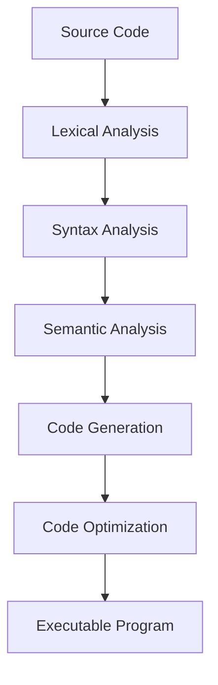
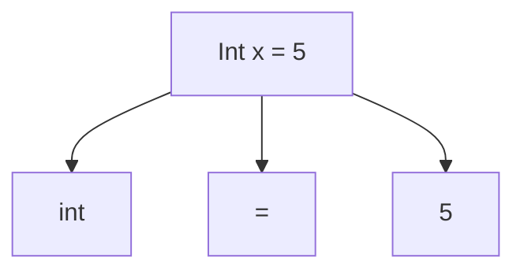
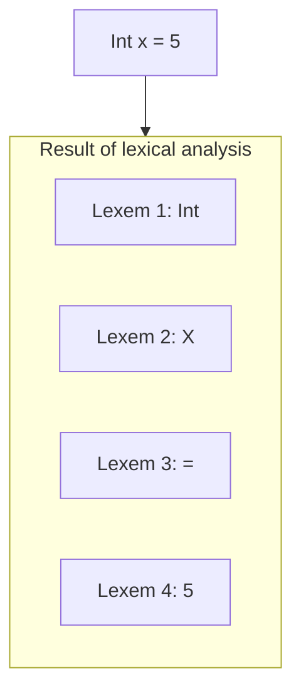
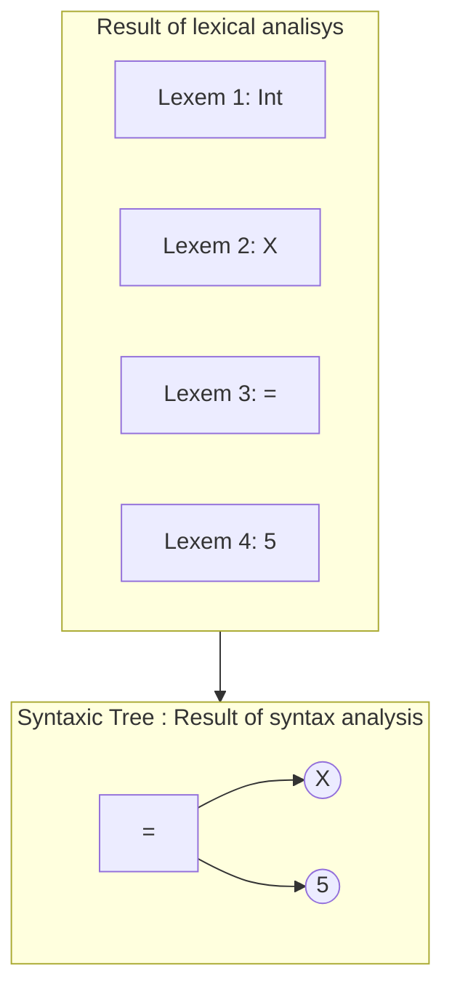
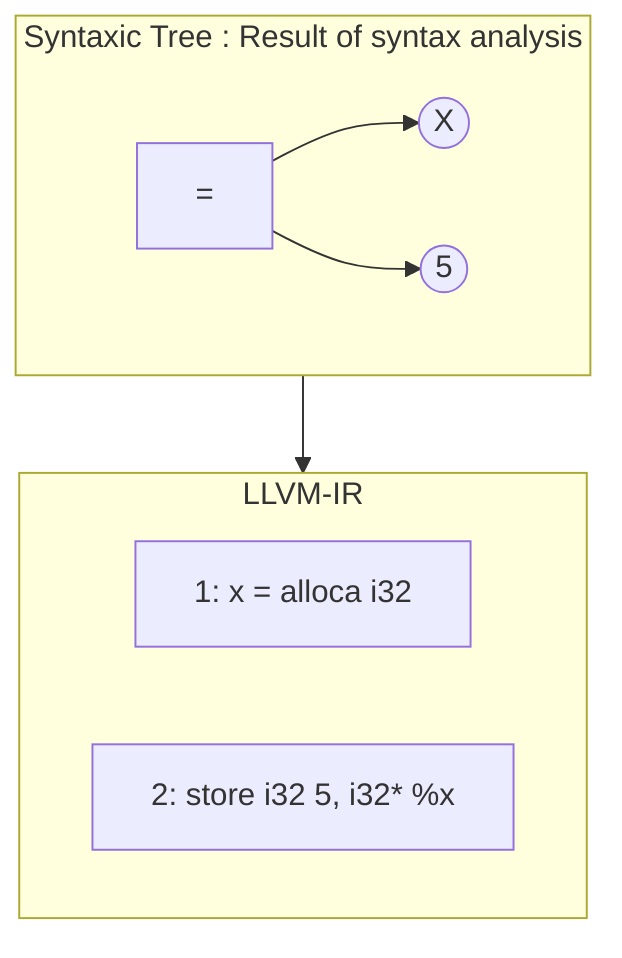
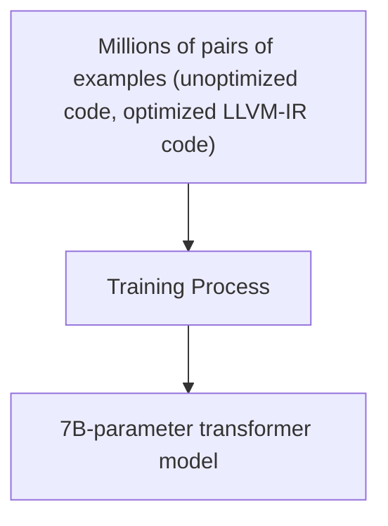
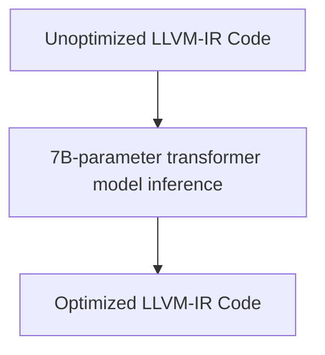
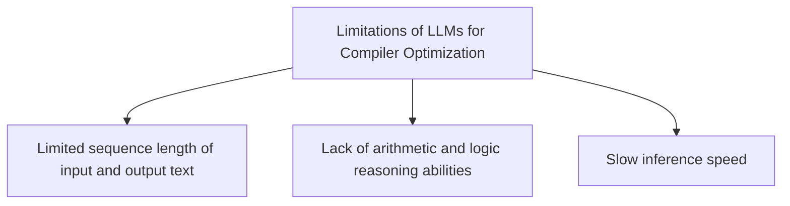

# LLMS as a Compiler Optimizer

## Introduction

Compilers and code optimization have always fascinated me. As a computer science student, I vividly remember studying compiler design and poring over the classic "Dragon Book". Little did I know then how artificial intelligence would one day revolutionize this field.

A recent paper [Large Language Models for Compiler Optimization](https://arxiv.org/pdf/2309.07062.pdf) shows how the hottest AI technique - large language models (LLMs) like GPT-3 - can learn to optimize code by just looking at examples, with no hand-engineered features or domain knowledge. This is akin to a student learning compilers just by reading code examples, without taking classes!


Illustration inspired from the cover of the book “Compilers: Principles, Techniques, and Tools" by Aho, Sethi, and Ullman”, also known as the Dragon Book

## What is a and why optimize code?

A compiler like GCC or LLVM translates high-level languages like C/C++ into efficient machine code. This involves multiple steps: lexical analysis, syntax analysis, code generation and crucially - code optimization. Optimization improves performance by reducing instruction count, memory usage, runtime - yielding faster, smaller and more efficient programs.

Code optimization is challenging as it requires reasoning about control and data flow, performing arithmetic simplification and applying complex algorithms. Compiler developers spend years building heuristics and rules to optimize code. Even then the fixed built-in optimization order is often suboptimal.

### The compilation process



### The different phase during a compilation process

| Phase | Description | Input Example | Output Example |
| --- | --- | --- | --- |
| Lexical Analysis | Reads the source code and breaks it down into individual tokens, such as keywords, identifiers, and operators. | int x = 5; | int, x, =, 5, ; |
| Syntax Analysis | Uses the tokens generated from the lexical analysis phase to create a parse tree that represents the structure of the source code. | int x = 5; | Parse tree representing the int declaration and the assignment of 5 to x.
  |
| Semantic Analysis | Analyzes the parse tree to ensure that the code follows the rules of the programming language, such as type checking and scope rules. | int x = 5; | Checks that x is declared and that it is of type int. |
| Code Generation | Translates the optimized code into machine code that can be executed by the target machine. | int x = 5; | Machine code that performs the int declaration and the assignment of 5 to x. |
| Code Optimization | Optimizes the code to improve its performance, such as removing redundant instructions or simplifying expressions. | int x = 5 * 2; | int x = 10; |



### The lexical analysis phase



### The syntaxic analysis



### **Code Generation**



## Using Large Language Models for Compiler Optimization

In this article, the authors explore the use of Large Language Models (LLMs) for code optimization, a challenging task that involves finding the best sequence of compiler passes to apply to a given LLVM assembly code.

They train a 7B-parameter transformer model from scratch on millions of examples of unoptimized and optimized LLVM-IR, along with the best compiler options found by a search-based autotuner.



They show that their model can generate pass lists that outperform the compiler’s built-in pass ordering (-Oz) and two state-of-the-art machine learning baselines (AutoPhase and Coreset-NVP) on a large test set of unseen IR functions from various domains and sources.

Moreover, their model can also generate optimized IR code as an auxiliary task, demonstrating remarkable code reasoning abilities and achieving high accuracy and similarity with the compiler output.



The authors demonstrate that LLMs can optimize code with minimal computational overhead and without requiring any specialized program representation or feature engineering.

### Example

**a)** **Input code LLVM-IR**

39 instructions

```llvm
define i32 @f1(i8 %0) {
%2 = alloca i32, align 4
%3 = alloca i8, align 1
store i8 %0, i8* %3, align 1
%4 = load i8, i8* %3, align 1
%5 = zext i8 %4 to i32
%6 = icmp sge i32 %5, 65
br i1 %6, label %7, label %15
7:
%8 = load i8, i8* %3, align 1
%9 = zext i8 %8 to i32
%10 = icmp sle i32 %9, 90
br i1 %10, label %11, label %15
11:
%12 = load i8, i8* %3, align 1
%13 = zext i8 %12 to i32
<snip 21 lines...>
33:
%34 = load i32, i32* %2, align 4
ret i32 %34
}
```

**b)** **Input code LLVM-IR**

Autotuned code (14 instructions) using passes:
-reg2mem -instcombine -Os -O1

```llvm
define i32 @f1(i8 %0) {
%2 = zext i8 %0 to i32
%.off = add i8 %0, 191
%3 = icmp ult i8 %.off, 26
br i1 %3, label %4, label %6
4:
%5 = add nsw i32 %2, 191
br label %10
6:
%.reload16.off = add nsw i32 %2, 159
%7 = icmp ult i32 %.reload16.off, 26
br i1 %7, label %10, label %8
8:
%9 = icmp eq i8 %0, 32
%. = select i1 %9, i32 26, i32 1
br label %10
10:
%.0.reg2mem.0 = phi i32 [%5, %4],
[%., %8], [%.reload16.off, %6]
ret i32 %.0.reg2mem.0
}
```

**c) Input code LLVM-IR**

Model-optimized code (13 instructions) and
pass list: -reg2mem -simplifycfg -mem2reg
-jump-threading -Os.

```llvm
define i32 @f1(i8 %0) {
%2 = zext i8 %0 to i32
%.off = add i8 %0, 191
%3 = icmp ult i8 %.off, 26
br i1 %3, label %6, label %._crit_edge
._crit_edge:
%.off24 = add i8 %0, 159
%4 = icmp ult i8 %.off24, 26
br i1 %4, label %6, label %._crit_edge9
._crit_edge9:
%5 = icmp eq i8 %0, 32
%spec.select = select i1 %5,
i32 26, i32 1
ret i32 %spec.select
6:
%.sink = phi i32 [191, %1],
[159, %._crit_edge]
%7 = add nsw i32 %.sink, %2
ret i32 %7
}
```

## What are the limitations of the approach ?

While the use of Large Language Models (LLMs) for code optimization as presented in this article is promising, it is important to note that there are still some limitations that need to be addressed before this approach can be considered for production cases. Specifically, there are several locks that need to be unlocked, including the limited sequence length of the input and output text, the lack of arithmetic and logic reasoning abilities, and the slow inference speed. Addressing these limitations will be critical in unlocking the full potential of LLMs for compiler optimization.

**Lock to be solved**

- The limited sequence length of the input and output text, which restricts the amount of code that can be optimized and the context available for optimization decisions.
- The lack of arithmetic and logic reasoning abilities, which leads to errors in constant folding, data-flow analysis, and other optimizations that require mathematical computation and complex data structure manipulation.
- The slow inference speed, which makes the model impractical for real-world use as it takes much longer to generate a pass list than to execute it by the compiler.



## Conclusion

I found this article about the use of Large Language Models (LLMs) for code optimization to be fascinating. I believe in the promise of LLMs for unexpected tasks and the potential they hold for the future of software engineering and artificial intelligence.

If you are interested in compilers, I recommend the book "Compilers: Principles, Techniques, and Tools" by Aho, Sethi, and Ullman, also known as the Dragon Book.

[Compilers: Principles, Techniques, and Tools](https://en.wikipedia.org/wiki/Compilers:_Principles,_Techniques,_and_Tools)

## References

[1] [Large Language Models for Compiler Optimization](https://arxiv.org/pdf/2309.07062.pdf)

---

### What is LLVM

LLVM is a set of compiler and toolchain technologies that can be used to develop a frontend for any programming language and a backend for any instruction set architecture. LLVM is designed around a language-independent intermediate representation (IR) that serves as a portable, high-level assembly language that can be optimized with a variety of transformations over multiple passes

LLVM was originally developed as a research project at the University of Illinois, with the goal of providing a modern, SSA-based compilation strategy capable of supporting both static and dynamic compilation of arbitrary programming languages. [Since then, LLVM has grown to be an umbrella project consisting of a number of subprojects, many of which are being used in production by a wide variety of commercial and open source projects as well as being widely used in academic research](https://llvm.org/)

Some of the subprojects of LLVM are:

- [Clang: an LLVM native C/C++/Objective-C compiler, which aims to deliver amazingly fast compiles, extremely useful error and warning messages and to provide a platform for building great source level tools](https://llvm.org/)
- **LLDB**: a debugger that uses the Clang ASTs and expression parser, LLVM JIT, LLVM disassembler, etc to provide an experience that “just works”. It is also blazing fast and much more memory efficient than GDB at loading symbols
- **libc++** and [libc++ ABI: a standard conformant and high-performance implementation of the C++ Standard Library, including full support for C++11 and C++14](https://llvm.org/)
- **compiler-rt**: a project that provides highly tuned implementations of the low-level code generator support routines and run-time libraries for dynamic testing tools such as AddressSanitizer, ThreadSanitizer, MemorySanitizer, and DataFlowSanitizer[1](https://llvm.org/)
- **MLIR**: a novel approach to building reusable and extensible compiler infrastructure. [MLIR aims to address software fragmentation, improve compilation for heterogeneous hardware, significantly reduce the cost of building domain specific compilers, and aid in connecting existing compilers together](https://llvm.org/)
