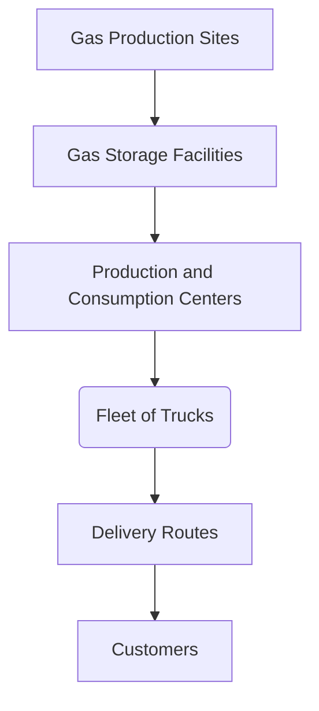
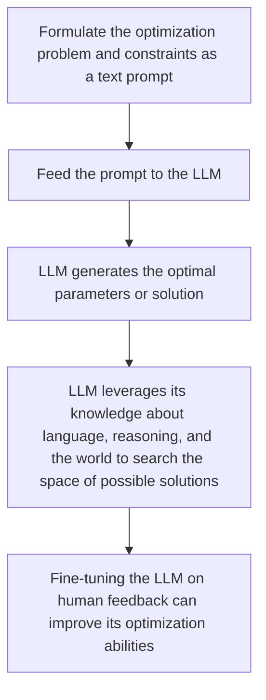
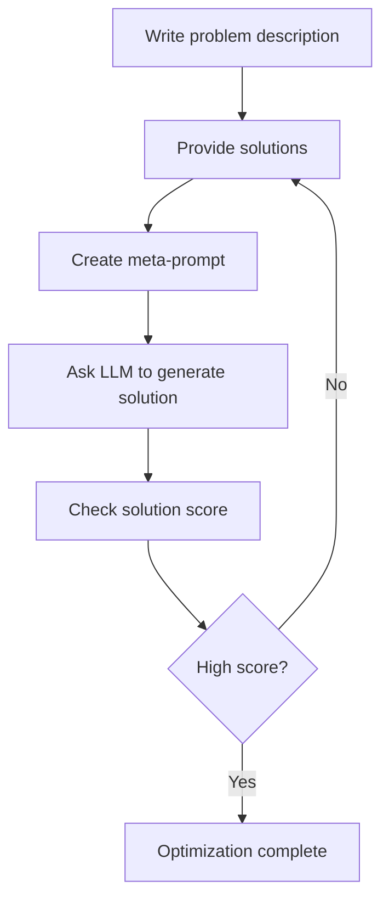

# The promise of LLMs as Optimizer …

## Introduction

Throughout my career in the industrial gas industry, I have been dedicated to solving optimization problems.

Optimization problems aim to find the best solution from all feasible solutions. These problems are ubiquitous across industries, including transportation, manufacturing, finance, and more. Even in daily life, we regularly face optimization problems like finding the shortest route to work or getting the most value when shopping with a limited budget.

At an enterprise level, optimization helps drive efficiency, productivity, and profits. For instance, supply chain optimization minimizes costs by optimizing production, inventory, and logistics. Workforce scheduling optimization improves productivity by assigning the right employees to shifts based on skills and availability. Portfolio optimization in finance maximizes returns by selecting the optimal asset allocation.

Optimization leverages data, algorithms, and computational power to evaluate millions of potential solutions. The optimal balance between multiple competing objectives is identified based on the problem formulation. Real-world optimization problems are often complex, constrained, nonlinear, and dynamic.

**Here are a few examples of optimization problems**:

- **Daily life**: Finding the shortest route to work or school, maximizing the amount of groceries you can buy with a limited budget, or minimizing the time it takes to complete household chores.
- **Business**: Maximizing profits by optimizing supply chain and logistics, minimizing waste in manufacturing processes, or optimizing employee schedules to improve productivity.
- **Finance**: Finding the best portfolio of investments to maximize returns and minimize risk, optimizing asset allocation, or minimizing transaction costs.
- **Healthcare**: Optimizing medical treatments to maximize patient outcomes and minimize costs, or optimizing hospital resource allocation to improve efficiency.
- **Transportation**: Minimizing fuel consumption in vehicles, optimizing airline schedules to minimize delays and maximize profits, or optimizing traffic flow to reduce congestion.

These are just a few examples of optimization problems that can be found in various fields and industries.


## Example in a Real-World Optimization Problems

One particular problem that caught my attention early on is Inventory Routing Optimization. This problem involves optimizing delivery routes and quantities for a fleet of trucks that transport industrial gases to various customers. The goal is to minimize the total distance traveled while ensuring that each customer receives the required amount of gas in a timely manner. Solving this problem requires a deep understanding of the logistics of the gas industry and the ability to develop efficient algorithms that can handle large amounts of data. It's a challenging but rewarding problem that has the potential to improve the efficiency and profitability of companies in the industry. Up to 10% of fuel consumption can be saved and CO2 emissions can be avoided.

The inventory routing optimization problem in the gas industry is an intricate process that involves numerous steps and factors to consider. One of the critical components of the process is the delivery of gas from production sites to storage facilities and ultimately to customers equipped with tanks. These tanks are fitted with IoT sensors that monitor and provide real-time data on customer consumption at the site level. With this information, it becomes possible to forecast demand and create an efficient delivery planning that minimizes both delivery and inventory costs.

To achieve this objective, it is often essential to deliver the gas just in time, which means that the timing of the delivery must be precise. This requires a high level of coordination and accuracy in forecasting the customer's consumption patterns, which can vary significantly depending on various factors such as weather conditions, economic activities, and seasonal variations. The delivery planning must also factor in the distance between the production sites, storage facilities, and customers, as well as the size and capacity of the delivery trucks.

One of the ways to optimize the inventory routing process is to make use of sophisticated algorithms that can analyze vast amounts of data and provide insights on the best delivery planning strategies. These algorithms can take into account various factors such as the cost of delivery, the cost of inventory, the delivery time, and the customer's consumption patterns. By analyzing this data, the algorithms can create an optimized delivery planning that minimizes costs while ensuring that the customers receive their gas on time.

The inventory routing optimization problem in the gas industry is a complex and challenging process that requires a high level of expertise and knowledge.



## Classical method to solve optimisation problem

There are various techniques that can be used to solve optimization problems, depending on the nature of the problem and the available resources.

Some common techniques include:

- **Brute Force**: This involves trying every possible solution until the best one is found. While this method is guaranteed to find the optimal solution, it can be very time-consuming and impractical for large problems.
- **Greedy Algorithms**: These algorithms make locally optimal choices at each step with the hope of finding a global optimum. While they are often fast and easy to implement, they may not always find the best solution.
- **Dynamic Programming**: This technique breaks down a problem into smaller sub-problems and solves each sub-problem individually. This can be an effective way to solve complex problems, but it requires a lot of memory and can be computationally expensive.
- **Linear Programming**: This involves optimizing a linear objective function subject to linear constraints. This technique is often used for problems with multiple variables and constraints, and can be solved using techniques such as the simplex method.
- **Nonlinear Programming**: This involves optimizing a nonlinear objective function subject to nonlinear constraints. This can be a more complex problem than linear programming, but it can handle a wider range of problems.
- **Metaheuristics**: These are general-purpose optimization algorithms that can be used to solve a variety of problems. They are often inspired by natural processes such as evolution or swarm behavior, and can be very effective for complex problems.

Overall, the choice of optimization technique will depend on the specific problem being solved, as well as the available resources and constraints.

**Challenges in Optimization: Searching for the Best Solutions:**

- Searching through an extensive space of possible solutions can be time-consuming and computationally expensive.
- Multiple locally optimal solutions that are not globally optimal can make it difficult to determine the best possible solution.
- Nonlinear constraints or nonlinear problems can make them more challenging to solve using traditional optimization techniques.
- Balancing multiple objectives or constraints can lead to trade-offs and complex decision-making processes.

**The Challenges of Gradient-Free Optimization in Real-World Applications**

The absence of gradient is often a limit for optimization problems because many real-world applications cannot be modeled using a differentiable function. While derivative-based algorithms are powerful tools for various problems, they rely on the existence of a gradient and may not work well or at all for gradient-free problems. These types of problems are often very complicated or noisy, or their formulas are unknown. The absence of gradient imposes challenges on many real-world applications, which require alternative methods such as metaheuristics or gradient-free optimization algorithms.

**Image segmentation** is a key problem in computer vision that often lacks a clear mathematical objective function to optimize. As a result, gradient-based optimization techniques cannot be applied directly. Instead, gradient-free optimization methods are commonly used.

For example, in semantic segmentation where the goal is to classify each pixel, there is no obvious differentiable loss function to optimize. Methods like evolutionary algorithms and swarm intelligence have proven effective for this task. They iteratively refine segmentations based on heuristics rather than gradients.

Similarly, in **reinforcement learning** an agent must learn the optimal policy through trial-and-error interactions with its environment. Since the value function is not known a priori, its gradient is unavailable. Gradient-free policy search techniques like Monte Carlo Tree Search can work well in these cases.

The key advantage of gradient-free optimization is the ability to solve complex problems even when analytical gradients do not exist. While gradient-based methods are more efficient when applicable, gradient-free techniques provide a valuable alternative that expands the range of solvable problems. Both categories of methods have important roles in fields like computer vision and reinforcement learning.

## Leveraging Large Language Models as Optimizers: The Potential of OPRO

I recently read a paper titled **"Large Language Models as Optimizers"**, and as someone who has been working on optiizations problems for decades, I was immediately intrigued. The paper proposes a new approach, called **Optimization by PROmpting (OPRO)**, that leverages LLMs as optimizers to solve gradient-free problems. The authors demonstrate that OPRO can outperform human-designed prompts on various tasks, and the potential applications of this approach are vast. It's exciting to see how LLMs are continuing to push the boundaries of what is possible in the field of optimization.

The basic idea of **OPRO** is to use large language models (LLMs) as optimizers to solve gradient-free problems. The LLM is given a problem description in natural language and generates new solutions based on previously generated solutions with their values. The new solutions are evaluated and added to the prompt for the next optimization step. This process is repeated until the LLM finds a solution with a high score or until it runs out of time or space.

For example, in the context of linear regression, the LLM can be given a prompt that contains previously generated solutions with their scores and values (e.g. coefficients and intercepts in a linear equation). The LLM generates new solutions by manipulating the prompt and solving the regression problem. The new solutions are evaluated and added to the prompt for the next optimization step. The LLM keeps generating new solutions and adding them to the prompt until it finds a solution with a high score (e.g. low error) or until it runs out of time or space.

Overall, **OPRO** provides a new way of using LLMs to solve optimization problems by leveraging their knowledge and creativity in natural language processing.

### **General idea**



- Formulate the optimization problem and constraints as a text prompt
- Feed the prompt to the LLM and have it generate the optimal parameters or solution
- The LLM leverages its knowledge about language, reasoning, and the world to search the space of possible solutions
- Fine-tuning the LLM on human feedback can improve its optimization abilities

## Using LLMs as Optimizers: Solving the Traveling Salesman Problem with OPRO

First, you need to describe the problem in natural language. For example, you can say “Find the shortest path that visits all the cities in this list” and give the names and coordinates of the cities.

Then, you need to give some examples of how to solve the problem. For example, you can say “One possible path is A-B-C-D-E-A, and its length is 100 km” or “Another possible path is A-E-D-C-B-A, and its length is 120 km”. This is called the solution.

You also need to tell the LLM how to measure how good the solution is. For example, you can say “The shorter the path, the better” or “The length of the path is the score”. This is called the score.

You put all these things together in a special format that the LLM can understand. This is called the meta-prompt. It looks something like this:

```text
Problem: Find the shortest path that visits all the cities in this list
Cities: A (0, 0), B (10, 0), C (10, 10), D (0, 10), E (5, 5)
Solution: A-B-C-D-E-A
Score: 44.1
Solution: A-E-D-C-B-A
Score: 46.8
Solution: ?
Score: ?

```

 The question marks mean that the LLM has to fill in the blanks with its own solution and score. The LLM will try to generate a better solution than the previous ones by using its knowledge and creativity. For example, it might say:

```text
Problem: Find the shortest path that visits all the cities in this list
Cities: A (0, 0), B (10, 0), C (10, 10), D (0, 10), E (5, 5)
Solution: A-B-C-D-E-A
Score: 44.1
Solution: A-E-D-C-B-A
Score: 46.8
Solution: A-B-E-D-C-A
Score: 41.4

```

The LLM will keep doing this until it finds a solution that has a low score or until it runs out of time or space. This way, the LLM can optimize the problem by finding the best solution possible. This is how OPRO works for the salesman problem.

### **Large Language Models as Optimizers: The Potential of OPRO in Generating Better Prompts than Humans**

The paper "LARGE LANGUAGE MODELS AS OPTIMIZERS" argues that OPRO, a new approach that utilizes large language models (LLMs) as optimizers, can generate better prompts than humans for various tasks. The authors tested OPRO on two datasets: GSM8K, which contains 8,000 general knowledge questions, and Big-Bench Hard, a collection of 15 challenging tasks that assess different aspects of intelligence such as logic, reasoning, common sense, and creativity. The results demonstrated that OPRO outperformed human-generated prompts by up to 8% on GSM8K and by up to 50% on Big-Bench Hard tasks, illustrating the potential of using LLMs to solve optimization problems.

### **Designing the best prompt to query a large language model (LLM) is an optimization problem because the goal is to find the prompt that produces the best output from the LLM.**

The prompt is like a set of instructions for the LLM, and the output is like the result of following those instructions. Just like in any optimization problem, the goal is to find the best solution to a given problem, which in this case is finding the best prompt to query the LLM. The LLM is like a function that takes the prompt as input and produces the output, and the quality of the output depends on the quality of the input prompt. Therefore, finding the best prompt is a key step in optimizing the performance of the LLM. OPRO is an approach that leverages LLMs as optimizers by using natural language prompts to find the best solution to a given problem.

Suppose you want to use an LLM to answer questions about geography, such as “What is the capital of France?” or “Which continent is Australia in?”. You need to find a way to tell the LLM what to do and how to format the answer. This is called a prompt.

A prompt usually consists of three parts: a task description, an input, and an output. The task description tells the LLM what kind of task it is and what it needs to do. The input is the question or data that you want the LLM to process. The output is the answer or result that you want the LLM to generate.

For example, a simple prompt for geography questions might look like this:

```text
Task: Answer questions about geography
Input: What is the capital of France?
Output: Paris

```

However, this prompt might not be very good for several reasons. For example, it might not be clear enough for the LLM what kind of answer it should give. Should it give a full sentence or just a word? Should it give any additional information or just the answer? Should it use any punctuation or capitalization? These are some of the things that you might want to specify in your prompt.

Another reason why this prompt might not be very good is that it might not be very accurate or consistent for different questions. For example, if you ask “Which continent is Australia in?”, the LLM might give an incorrect or incomplete answer, such as “Oceania” or “Australia”. This is because the LLM might not have enough knowledge or context about geography to answer correctly. Or, if you ask “What is the largest country in the world by area?”, the LLM might give different answers depending on how it interprets the question. For example, it might say “Russia” or “China” or “Antarctica”. This is because the LLM might not have a consistent definition of what counts as a country or how to measure its area.

Therefore, you might want to improve your prompt by making it more specific, informative, and consistent. This is where OPRO can help you. OPRO is a way of using the LLM itself to optimize your prompt by generating new prompts that are better than your original one.

**To use OPRO, you need to follow these steps**:

- **First**, you need to write your initial prompt in natural language. This is called the problem description. For example, you can say “Find a prompt that can answer questions about geography accurately and consistently”.

- **Second**, you need to give some examples of how to solve the problem. These are called solutions. For each solution, you need to give an input (a question), an output (an answer), and a score (a number that tells how good the solution is). The score can be based on different criteria, such as correctness, completeness, clarity, or style. For example, you can say:

```text
Solution: Task: Answer questions about geography
Input: What is the capital of France?
Output: The capital of France is Paris.
Score: 7/10

```

- **Third**, you need to put all these things together in a special format that the LLM can understand. This is called the **meta-prompt**. It looks something like this:

```text
Problem: Find a prompt that can answer questions about geography accurately and consistently
Solution: Task: Answer questions about geography
Input: What is the capital of France?
Output: The capital of France is Paris.
Score: 7/10
Solution: Task: Answer questions about geography
Input: Which continent is Australia in?
Output: Australia is both a country and a continent.
Score: 8/10
Solution: ?
Score: ?

```

- **Fourth**, you need to ask the LLM to fill in the blanks with its own solution and score. The LLM will try to generate a better solution than the previous ones by using its knowledge and creativity. For example, it might say:

```text
Problem: Find a prompt that can answer questions about geography accurately and consistently
Solution: Task: Answer questions about geography
Input: What is the capital of France?
Output: The capital of France is Paris.
Score: 7/10
Solution: Task: Answer questions about geography
Input: Which continent is Australia in?
Output: Australia is both a country and a continent.
Score: 8/10
Solution: Task: Answer questions about geography in one sentence with proper punctuation and capitalization
Input: What is the largest country in the world by area?
Output: The largest country in the world by area is Russia, which covers about 17 million square kilometers.
Score: 9/10

```

- **Fifth**, you need to repeat this process until you find a solution that has a high score or until you run out of time or space. This way, the LLM can optimize your prompt by finding the best solution possible. This is how OPRO works for prompt optimization.



## Limitations

The approach also has some limitations that may affect its performance and applicability. Some of the limitations are:

- The length limit of the LLM context window restricts the size and complexity of the optimization problems that can be described in natural language and fit in the meta-prompt. For example, linear regression with high-dimensional data or traveling salesman problem with a large set of nodes may not be feasible for OPRO.
- The optimization landscape of some objective functions may be too bumpy or noisy for the LLM to propose a correct descending direction, causing the optimization to get stuck at local optima or suboptimal solutions. For example, on larger-scale traveling salesman problems, OPRO performs worse than heuristic algorithms that are designed for this problem.
- The exploration-exploitation trade-off is a fundamental challenge in optimization, and it is not clear how to balance it effectively for OPRO. The LLM sampling temperature is one parameter that can affect this trade-off, but it may not be sufficient or robust for different problems and LLMs. For example, a lower temperature may lead to premature convergence, while a higher temperature may lead to erratic behavior.

### **Conclusion**

Optimization is critical across industries and applications, from supply chains to financial portfolios. Both classical and AI techniques help solve these problems by searching large spaces to find optimal or near-optimal solutions. Gradient-free methods and leveraging large language models are promising new approaches applicable to a wide range of complex optimization problems. Advances in AI will continue to expand our ability to optimize systems and drive efficiency.

# References

[1] LLMs as Optimizer <https://arxiv.org/pdf/2309.03409.pdf>

[2] MIP Model for Inventory Routing in Industrial Gases Supply Chain <https://pubs.acs.org/doi/10.1021/ie500460c>

[3] Optimal Distribution-Inventory Planning of Industrial Gases. I. Fast Computational Strategies for Large-Scale Problems <https://www.researchgate.net/publication/228447046_Optimal_Distribution-Inventory_Planning_of_Industrial_Gases_I_Fast_Computational_Strategies_for_Large-Scale_Problems>

[4] Integrated production and inventory routing planning of oxygen supply chains <https://www.sciencedirect.com/science/article/pii/S0263876222003768>
