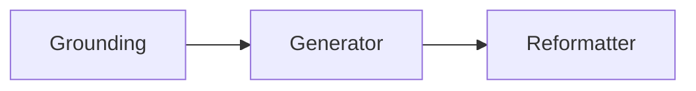
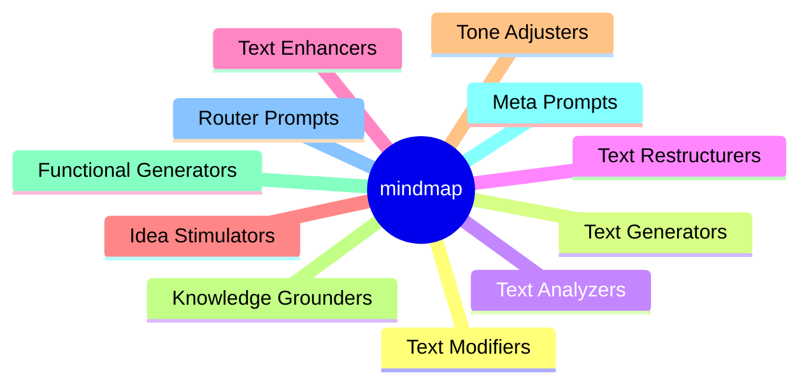
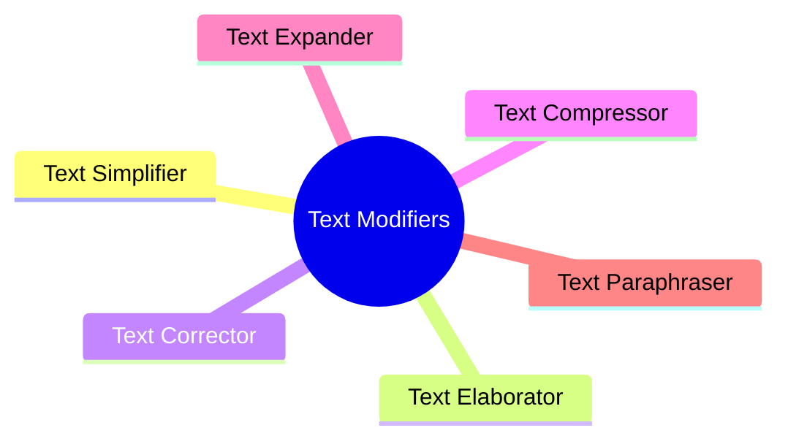
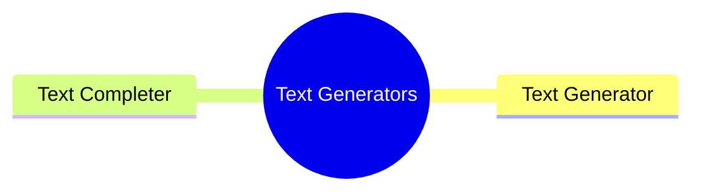
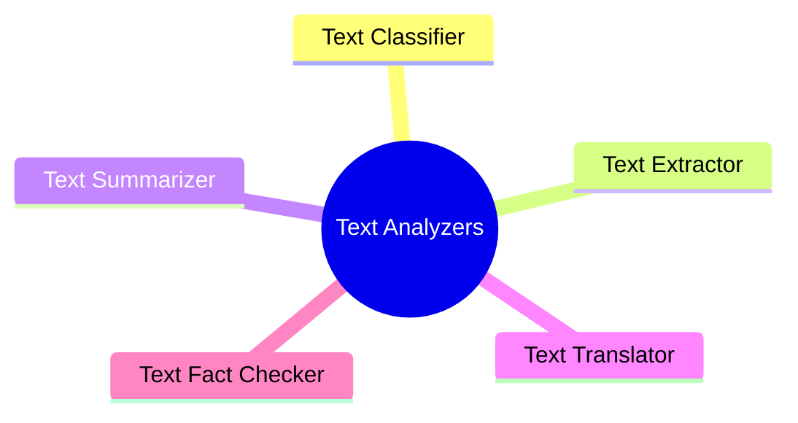
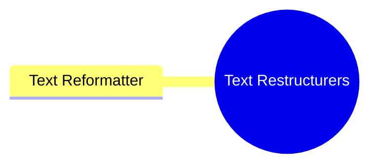
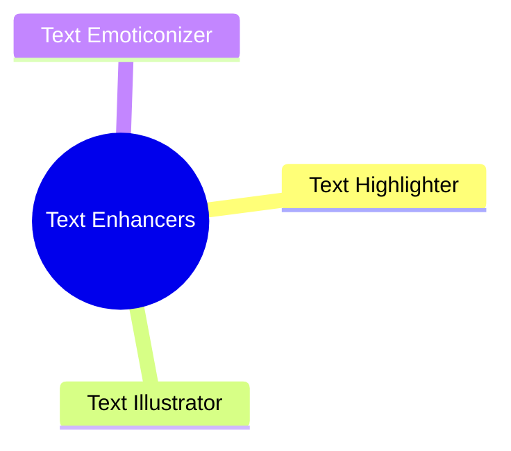
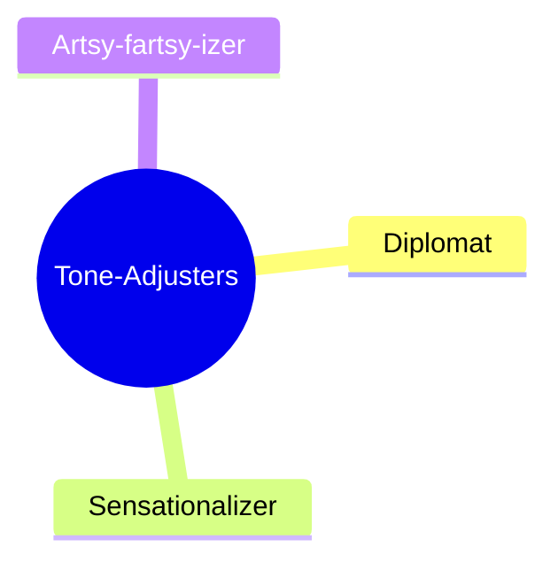
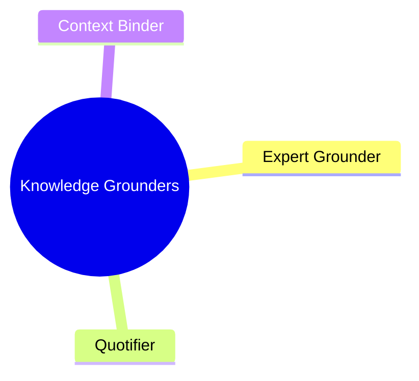
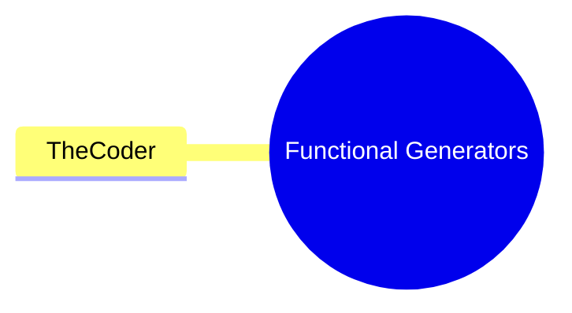

# Summoning the Magic of Prompts: A Deep Dive into Prompt Engineering Patterns

## Information

| Author         | Created    | Updated    | Version |
| -------------- | ---------- | ---------- | ------- |
| Raphaël MANSUY | 04/09/2023 | 04/09/2023 | 1.0.1   |

## Introduction

Chatbots and AI assistants are only as smart as their prompts. Like a genie in a bottle, they need the right rub to unleash their powers. Crafting the perfect prompt is an art - with the right incantation, you can summon everything from poetry to product descriptions.

Prompt engineering is the key that unlocks an AI's potential. It's the difference between getting a useless response versus something intelligent and specific to your needs. Prompts conjure capabilities; they focus the machine's magical abilities.

There are tried and true formulas for prompting AI systems. Prompt engineering patterns act as guides for creating prompts that elicit certain behaviors from bots. Classifiers to categorize information; extractors to pull out key details; summarizers to distill texts - these common patterns enable more useful responses. With the proper abracadabra, you can get AI to understand your intent and provide the right spell for the job. Prompt engineering is wizardry, and with the right prompts, your AI assistant can dazzle and delight.


## The Power of Naming: Establishing Standardized Patterns in Prompt Engineering

Design patterns in software design and patterns of prompting share a common challenge: naming things. In programming, one of the most difficult tasks is finding the right names for variables, functions, and classes. Similarly, in prompt engineering, naming patterns is crucial for effective communication and understanding.

Design patterns in software design provide a standardized way to solve common problems in software development. They allow developers to communicate and collaborate using a shared language. By using well-known design patterns like Singleton, Observer, or Factory, developers can convey the intent and purpose of their code more efficiently.

Similarly, in prompt engineering, creating a standard for naming patterns is essential. It enables prompt engineers to communicate their intentions and expectations to AI systems effectively. By using consistent and descriptive names for prompt engineering patterns, such as Simplifier, Elaborator, or Generator, prompt engineers can convey the desired behavior and outcome to AI assistants.

The goal of this article is to establish a standard for naming patterns in prompt engineering. By defining clear and descriptive names for prompt engineering patterns, it becomes easier for prompt engineers to understand and apply these patterns effectively. Just as design patterns in software design enable developers to communicate using a shared language, standardized naming conventions in prompt engineering facilitate effective communication and collaboration in the field.

## Prompt Engineering Patterns: Unleashing the Magic of AI Assistants

This document provides an extensive list of prompt engineering patterns that can be used to enhance the capabilities of AI systems. These patterns are categorized into different families, including text modification, text generation, text analysis, text restructuring, text enhancement, idea stimulation, tone adjustment, knowledge grounding, and functional generation.

Each prompt engineering pattern is explained with examples to illustrate its usage and purpose. For instance, the Extractor pattern is used to extract key information from a given text, while the Classifier pattern categorizes text into predefined classes. The Summarizer pattern distills important information from longer texts, and the Translator pattern translates text from one language to another.

Other patterns include the Reformatter, which restructures text into a different format, the Completer, which fills in missing sections of incomplete text, and the Generator, which produces new text on a given topic. The Context Binder connects separate pieces of information to create a coherent text, while the Expert Grounder leverages knowledge from a specific domain to shape the response.

Additionally, there are patterns like the Elaborator, Corrector, Compressor, Expander, Paraphraser, Anonymizer, Highlighter, Fact Checker, and Forgetter, which perform tasks such as adding detail, fixing grammar errors, shortening or lengthening text, rephrasing, anonymizing, highlighting key points, fact-checking, and removing sensitive information.

The file also introduces imagined prompt patterns like the Cross-Pollinator, which draws connections between different domains, and TheCoder, which generates code to solve problems described in plain language.

## Exploring Atomic Patterns and Composable Prompts: Unlocking the Power of Prompt Engineering

In this guide, we explore the identification of atomic patterns in prompts. We understand that prompts are composable, meaning they can be combined to create more complex and powerful prompts. For example, we can compose the Grounding pattern to provide context, the Generator pattern to generate ideas, and the Reformatter pattern to format the prompt. This composition allows us to create prompts that are tailored to specific needs. In the future, we will delve into the topic of how prompts can be further composed to unlock even more possibilities and enhance the capabilities of AI systems. Stay tuned for the extended version of this guide, where we will explore the art of prompt composition in depth.

**Examples of composable prompts**:



---



**Mindmap illustrating different categories of prompt engineering patterns.**

---

## Text Modifiers

- Simplifier
- Elaborator
- Corrector
- Compressor
- Expander
- Paraphraser

These prompts modify existing text in some way while keeping the core meaning intact.



### The Simplifier

A simplifier prompt rewrites text using simpler vocabulary and grammar for improved readability. For example:

Input text: The elucidation of the genome sequence of the ursine mammal Ursus maritimus has provided illuminating insights into the phylogenetics of bears.

Simplifier prompt: Please rewrite this complex sentence in simpler language: [Input text]

Output: Decoding the DNA of the polar bear has given useful information about the evolution of bears.

### The Elaborator

An elaborator adds relevant detail and description to sparse text. For example:

Input: Yesterday was fun. We saw animals.

Elaborator prompt: Please add more detail to this text: [Input]

Output: Yesterday my family and I had fun at the zoo. We saw many fascinating animals like elephants, giraffes, and zebras.

### The Corrector

A corrector fixes grammatical errors in text. For example:

Input: She no went to the store.

Corrector prompt: Please correct the grammar in this sentence: [Input]

Output: She did not go to the store.

### The Compressor

A compressor shortens text by removing unnecessary words. For example:

Input: This recipe for chocolate chip cookies requires the baker to combine butter, white granulated sugar, brown sugar, eggs, vanilla extract, flour, baking soda, and chocolate chips in a large bowl.

Compressor prompt: Compress this text by removing unnecessary words: [Input]

Output: This cookie recipe requires combining butter, sugars, eggs, vanilla, flour, baking soda, chocolate chips.

### The Expander

An expander makes text longer by adding relevant details. For example:

Input: Yesterday I baked cookies.

Expander prompt: Please expand this sentence by adding more relevant detail: [Input]

Output: Yesterday I baked two dozen chewy chocolate chip cookies using my grandmother's secret recipe. I added extra chocolate chips for extra flavor and enjoyment.

### The Paraphraser

A paraphraser rephrases text using different vocabulary and syntax. For example:

Input: The massive ursine mammal ambled towards the stream to drink.

Paraphraser prompt: Please rephrase this sentence using different wording: [Input]

Output: The huge bear walked over to the creek to get some water.

## Text Generators

- Generator
- Completer

These prompts generate or complete new text from scratch.



### The Generator

A generator prompt produces new text from scratch on a given topic. For example:

Input topic: "Dogs"

Generator prompt: "Write a short children's story about the topic: [Topic]"

Output: "The little puppy Waggles was so excited to go to the park..."

Generators create novel content centered around specified concepts.

### The Completer

A completer prompt fills in missing sections of incomplete text. For example:

Input: "Yesterday I went to the **_ with my family. We had a _**"

Completer prompt: "Complete this text by filling in the blanks: Yesterday I went to the [Blank 1] with my family. We had a [Blank 2]"

Output: "Yesterday I went to the park with my family. We had a picnic."

Completers enable inference of missing information based on context.

## Text Analyzers

- Classifier
- Extractor
- Summarizer
- Translator
- Fact Checker

These prompts analyze and process key information in the input text.



### The Classifier

A classifier prompt categorizes an input into predefined classes. For example:

Input: "That movie was absolutely hilarious!"

Classifier prompt: "Classify this text as positive, negative or neutral: [Text]"

Output: Positive

Classifiers enable AI systems to analyze sentiment, genre, topic and other attributes of texts.

### The Extractor

An extractor prompt extracts key pieces of information from an input text. For example:

Input: "My name is John and I am 25 years old."

Extractor prompt: "Extract the name and age from this text: My name is [Name] and I am [Age] years old."

Output: Name: John, Age: 25

Extractors are useful for pulling out details from longer texts.

### The Summarizer

A summarizer prompt distills key information from a longer text. For example:

Input: "Artificial intelligence has seen rapid advances in recent years. New techniques like deep learning have enabled AI systems to achieve human-level performance on tasks like image recognition, speech processing and language translation..."

Summarizer prompt: "Summarize this text in one sentence: [Text]"

Output: Recent advances in deep learning have improved AI systems' abilities in areas like computer vision and natural language processing.

Summarizers allow concise overviews of longer content.

### The Translator

A translator prompt converts text from one language to another. For example:

Input: "I am 25 years old."

Translator prompt: "Translate this text from English to French: [Text]"

Output: "J'ai 25 ans."

Translators enable multilingual capabilities.

A fact checker validates accuracy of facts in text. For example:

Input: The first president of the United States was Thomas Jefferson in 1776.

Fact Checker prompt: Check this text for factual accuracy: [Input]

Output: The first president was George Washington in 1789, not Thomas Jefferson in 1776.

## Text Restructurers

- Reformatter

These prompts restructure or reorder the text and ideas.



### The Reformatter

A reformatter prompt restructures the input text into a different format. For example:

Input: "John, 25, New York"

Reformatter prompt: "Reformat this text into a sentence: [Text]"

Output: "John is a 25-year-old who lives in New York."

Reformatters transform text styles and structures.

## Text Enhancers

- Highlighter
- Illustrator
- Emoticonizer



### The Highlighter

A highlighter emphasizes key points with formatting like bolding. For example:

Input: Bananas contain potassium which helps control blood pressure.

Highlighter prompt: Highlight key health information in this text: [Input]

Output: Bananas contain **potassium** which helps control **blood pressure**.

These prompts add formatting or other elements that enhance the text.

### The Illustrator

Adds examples to illustrate points.

Example: "Exercise improves health."

Illustrated: "Exercise improves health. For example, regular cardio activity boosts heart health."

### The Emoticonizer

Adds emojis and emoticons for sentiment.

Example: "That movie was hilarious!"

Emoticonized: "That movie was hilarious! 😂"

## Idea Stimulators

- Cross-Pollinator
- Analogy-zer

These prompts connect ideas across domains or surface insightful comparisons.

### The Cross-Pollinator

Draws conceptual connections and identifies shared principles between disparate domains.

Example topics: Physics and AI

Cross-Pollinator prompt:

"Extract the key concepts and principles from these two topics:

Topic 1: [Physics]

Topic 2: [AI]

Identify any common patterns, overlaps or parallels between them:"

Possible output:

Key concepts in Physics: laws of motion, gravity, electromagnetism, thermodynamics, quantum mechanics

Key concepts in AI: machine learning, neural networks, reinforcement learning, computer vision, natural language processing

Common patterns:

- Both involve mathematical modeling of systems
- Basic rules give rise to complex emergent behaviors
- Probabilistic techniques are used to handle uncertainty
- Significant progress was driven by identifying simpler underlying patterns
- Insights from one area inspired developments in the other (quantum physics > neural nets)

The Cross-Pollinator prompt could help surface useful connections and transfers between different fields that someone could miss if they only specialized in one domain. Looking at problems through different lenses is a key innovation strategy.

### The Analogy-zer

Draws comparisons to familiar concepts.

Example: "Electrons orbit the atom's nucleus."

Analogy: "Electrons orbit the nucleus like planets around a star."

## Tone Adjusters

- Diplomat
- Sensationalizer
- Artsy-fartsy-izer

These prompts modify the tone, style or emotional sentiment of the text.



### The Diplomat

Restates strong claims more diplomatically.

Example: "That idea is completely idiotic."

Diplomatic: "That idea may need further development and refinement."

### The Sensationalizer

Adds outrageous, clickbait-style language.

Example: "Scientists discover new planet."

Sensationalized: "Mindblowing! Scientists discover Earth-like planet - you won't believe what happens next!"

### The Artsy-fartsy-izer

Adds artistic, avant-garde language.

Example: "The singer has a nice voice."

Artsy-fartsy-ized: "The chanteuse's velvety vocals are sublimely transcendent."

## Knowledge Grounders

- Expert Grounder
- Quotifier
- Context Binder

These prompts ground the text in a specific body of knowledge. Combined with outside knowledge.



### The Expert Grounder

Leverages knowledge from a specified domain to shape the response.

Example domains: medicine, law, engineering

Expert Grounder prompt:

"Ground the response in expertise from the [domain] field to address this text:

[Input text]

Response grounded in [domain] expertise:"

Example:

Input: "My back hurts when I wake up in the morning."

Expert Grounder (medicine):

"Ground the response in medical expertise to address this text:

My back hurts when I wake up in the morning.

Response grounded in medical expertise:"

Possible grounded response:

"The morning back pain you describe could potentially be caused by issues like arthritis, a bulging disc, muscle strain, or spinal stenosis. I would recommend consulting your doctor or a back specialist for an exam and possible imaging tests to properly diagnose the cause."

The Expert Grounder ensures the response leverages real in-depth knowledge, avoiding shallow or inaccurate information. Grounding the context focuses the lens and shapes the generation.

### The Quotifier

Matches appropriate famous literary quotes to an input text based on its meaning and intent.

Example input text:

"I failed the test today. I studied hard but still did not understand the material well enough."

Quotifier prompt:

"Suggest a famous literary quote that matches the intent and meaning of this text:

[Input text]

Quote:"

Possible output:

"Our greatest glory is not in never falling, but in rising every time we fall." - Confucius

This quote from Confucius relates to the experience of failure and the importance of persistence and getting back up after setbacks. The Quotifier prompt could find quotes that eloquently summarize key themes and ideas from literature and connect them to new contexts. It suggests quotations to illustrate, validate or give weight to the expressed sentiment in the input text.

### The Context Binder

A context binder connects separate pieces of information together into a coherent text. For example:

Fact 1: Barack Obama was the 44th president.
Fact 2: He took office in 2009.
Fact 3: He is married to Michelle Obama.

Context binder prompt: "Create a cohesive paragraph from these facts: [Facts]"

Output: Barack Obama, who took office in 2009, was the 44th president of the United States. He is married to Michelle Obama.

Context binders produce unified narratives from disparate facts and details.

## Functional Generators

- TheCoder

These generate executable code or other functional outputs.



### TheCoder

Generates code in a specified language to solve a problem stated in plain language.

Example languages: Python, JavaScript, C++

TheCoder prompt:

"Generate [language] code to solve this problem:

[Problem statement]

[Language] code:"

Example:

Problem statement: Convert a temperature from Fahrenheit to Celsius.

TheCoder (Python):

"Generate Python code to solve this problem:

Convert a temperature from Fahrenheit to Celsius.

Python code:"

Possible output:

```python
fahrenheit = 100

celsius = (fahrenheit - 32) * 5/9

print(celsius)
```

This prints the temperature in celsius.

TheCoder allows plain language specifications of problems to be translated directly into runnable code snippets that implement the solution, acting as an AI coder. It could help automate simple programming tasks and provide examples for learning purposes.

## Meta Prompts

The meta prompt is a powerful prompt engineering pattern that involves constructing prompts about prompts.

The key idea is to provide an initial prompt that gives the AI assistant context about the desired prompt structure and behavior. This "outer" prompt frames the task for the AI system before providing the actual "inner" prompt requesting information or action.

For example, a meta prompt could first describe that the next prompt will ask for a 5 sentence summary of a passage:

"The following prompt will ask you to summarize the passage in 5 concise sentences that capture the key points:"

The AI will then be primed to expect a summarization task when given the input text prompt.

Similarly, a meta prompt can specify the desired tone or point of view:

"The following prompt will ask for a simple, straightforward explanation of the key ideas in the passage:"

This frames the prompt type as an explanatory, simplified summary.

The meta prompt acts as an instruction manual for the AI to understand exactly how to interpret and respond to the subsequent input prompt. It provides crucial context to elicit the intended behavior.

Meta prompts are extremely versatile - you can specify length, style, perspective, purpose and more. By explicitly stating how the AI should approach the inner prompt, you can unlock more control over its response.

## Router Prompts

The route prompt is a pattern that provides AI systems with multiple options to choose from when responding to an input. It allows guiding the model towards a preferred response out of several alternatives.

For example, when asking an AI to represent a text as a diagram, a route prompt could provide different diagram choices:

"Please represent the following text as a diagram. Select the best option from the choices below:

Text: I first read a CSV file, than I transform it into Parquet and then I store into an AWS S3 Bucket.

Diagram choices:

A) Flowchart

B) Bar graph

C) Pie chart

D) Mermaid sequence diagram

E) Entity relationship diagram"

By specifying valid options like flowchart, mermaid, etc., the route prompt guides the model to pick the optimal choice, which in this case would likely be a sequence diagram.


**Other examples include**:

Summarizing a passage in tweet length vs paragraph length
Responding in a more positive tone vs neutral tone
Explaining a concept simply vs comprehensively
The key is laying out alternative actions and letting the model discern the most suitable response based on the input and context. This provides more control than a simple open-ended prompt.

Route prompts are useful when there are a few different possible good solutions, and the model should choose among the options accordingly. It acts like a multiple choice prompt, steering the AI's response.