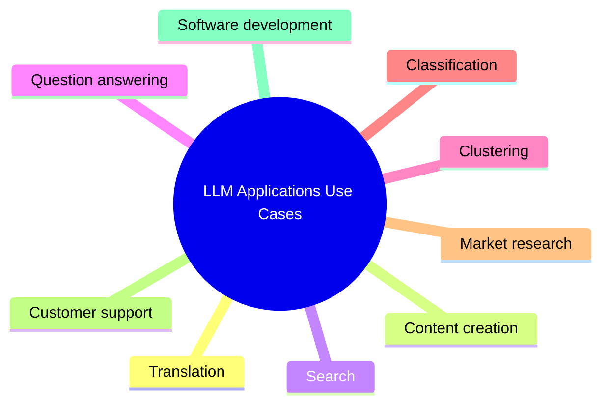

# What are the common uses of LLM Applications ?

## Information

| Author         | Created    | Updated    | Version |
| -------------- | ---------- | ---------- | ------- |
| Raphaël MANSUY | 05/09/2023 | 05/09/2023 | 1.0.0   |

## Some common use cases for LLM applications

- **Translation**: LLMs have the capability to perform translation tasks by converting written texts from one language to another. Users can provide prompts to LLMs, such as a sentence in English, and request the LLM to translate it into French. The LLM will then generate the translated sentence. Additionally, LLMs can also handle translations between different domains or styles of language, such as formal to informal or technical to non-technical.
- **Content creation**: LLMs can generate various types of written content based on prompts from the user. For example, a user can provide a topic, a genre, a tone, or some keywords, and the LLM will generate a blog post, a story, a script, a summary, or a social media post accordingly. LLMs can also generate images based on written prompts, such as DALL-E, StableDiffusion XL.
- **Search**: LLMs can help users find information from large datasets or the web, using natural language queries. For example, a user can ask a question or describe what they are looking for, and the LLM will return relevant results or answers. LLMs can also rank the results based on their relevance or quality.
- **Question answering**: LLMs can answer questions from users, using natural language or structured data sources. For example, a user can ask a factual question, such as “Who is the president of France?”, and the LLM will return the answer, such as “Emmanuel Macron”. LLMs can also answer more complex or open-ended questions, such as "What are the pros and cons of nuclear energy?".
- **Clustering**: LLMs can help users organize their data into meaningful groups or categories, using natural language labels. For example, a user can provide a set of documents, images, or emails, and the LLM will cluster them based on their similarity or topic. The user can also provide custom labels for the clusters, such as “urgent”, “spam”, or "work".
- **Classification**: LLMs can help users assign labels or tags to their data, using natural language rules or examples. For example, a user can provide a set of tweets, reviews, or comments, and the LLM will classify them based on their sentiment (positive, negative, neutral) or emotion (happy, sad, angry). The user can also provide custom labels for the classes, such as “funny”, “offensive”, or "informative".
- **Market research**: LLMs can help users conduct market research and analysis, using natural language insights. For example, a user can provide a product name, a brand name, or a market segment to the LLM, and the LLM will generate relevant information and statistics about it. The user can also ask follow-up questions to the LLM about the product, brand, or market.
- **Customer support**: LLMs can help users provide customer support and service, using natural language conversations. For example, a user can chat with an LLM-powered chatbot that can answer their queries, resolve their issues, or provide recommendations. The chatbot can also escalate the conversation to a human agent if needed.
- **Software development**: LLMs can help users develop software applications faster and easier by generating code snippets based on natural language descriptions. For example:
  Some possible additional sentences are:
- A user can describe what they want their app to do in plain English and the LLM will generate the corresponding code in Python.
- A user can provide an existing code snippet in Java and ask the LLM to convert it into C#.
- A user can ask the LLM to debug their code by explaining what errors they are getting and what they expect to happen.
