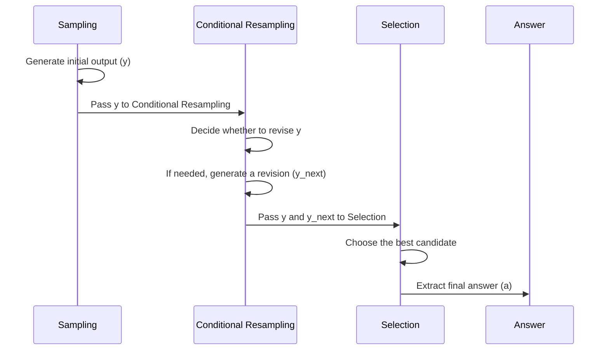

# SCREWS: A Modular Framework for Reasoning with Revisions

 I'm always on the lookout for new research that can help improve the quality of AI models. Recently, Microsoft Research and researchers from ETH Zurich published a paper on a new framework called SCREWS (Sampling, Conditional REsampling With Selection) that aims to enhance the reasoning capabilities of large language models (LLMs) without fine-tuning.

## The Problem with Reasoning and Hallucination

LLMs have shown great promise in various tasks, but they often struggle with reasoning and can produce hallucinated or incorrect outputs. Iteratively refining and revising their output based on feedback can improve their accuracy. However, these revisions can sometimes introduce errors, making it necessary to roll back to a previous result. Moreover, revisions are typically homogeneous, using the same reasoning method that produced the initial answer, which may not correct errors.

## Introducing SCREWS

SCREWS is a modular framework for reasoning with revisions, consisting of three main modules: Sampling, Conditional Resampling, and Selection. Each module has sub-modules that can be hand-selected per task, allowing for a flexible and customizable approach to improving LLM reasoning.

### Sampling

Sampling generates initial outputs for a given task. There are three main sampling methods:

1. Answer Only: The model directly generates the answer without any intermediate steps.
2. Chain of Thought (CoT): The model generates step-by-step reasoning to arrive at the answer.
3. Sub-question Decomposition: The main problem is decomposed into simpler sub-questions, which are solved iteratively.

### Conditional Resampling

Conditional Resampling decides whether to generate a revision based on the initial sample and, if needed, generates a revised output. This module can use various strategies, such as self-ask, tool-based LLM, or external verifiers.

### Selection

The Selection module chooses the best output among the original and revised candidates. This can be done using LLM-based selection, rule-based selection, or majority voting.

### SCREWS Workflow

**Example of a SCREWS workflow for a given task:**

1. **Sampling**: The initial output (y) is generated using one of the following methods:
    - Answer Only
    - Chain of Thought (CoT)
    - Sub-question decomposition

2. **Conditional Resampling**: The initial output (y) is passed to the Conditional Resampling module, which decides whether to generate a revision (y_next) based on the initial sample. Some methods for Conditional Resampling include:
    - Self-Ask
    - Tool-Based LLM

3. **Selection**: All samples and revisions (y and y_next) are given to the Selection module, which selects the best candidate. Some methods for Selection include:
    - LLM-Based Selection
    - Rule-Based Selection

The final answer (a) is extracted from the best candidate chosen by the Selection module.

## Using SCREWS: A Step-by-Step Example

## Real Use Case: Improving AI-generated Answers with SCREWS

In this example, we will use the SCREWS framework to improve the accuracy of AI-generated answers for a given question. SCREWS is a modular framework for reasoning with revisions, which consists of three main modules: Sampling, Conditional Resampling, and Selection. The framework is designed to iteratively refine and revise AI-generated outputs based on feedback, allowing for the exploration of different reasoning strategies.

### Problem

Suppose you have a question that you want an AI model to answer:

> "Raymond and Samantha are cousins. Raymond was born 6 years before Samantha. Raymond had a son at the age of 23. If Samantha is now 31, how many years ago was Raymond's son born?"

### Step 1: Sampling

First, we need to generate an initial answer using one of the sampling methods. In this example, we will use the Chain of Thought (CoT) method, which encourages the AI model to explain its reasoning step-by-step.

The AI model generates the following output:

> "If Samantha is 31 now, and Raymond was born 6 years before her, then Raymond is 31+6 = 37 years old. If Raymond was 23 years old when his son was born, then the number of years that have passed since his son was born is 37-23 = 14 years."

### Step 2: Conditional Resampling

Next, we will use the Self-Ask method for Conditional Resampling. This method involves asking the AI model whether its current answer is correct and, if not, generating a revised answer.

The AI model generates the following output:

> "Yes, the answer is correct. Raymond's son was born 14 years ago."

Since the AI model confirms that its current answer is correct, there is no need to generate a revised answer.

### Step 3: Selection

Finally, we will use the LLM-Based Selection method to choose the best answer from the initial and revised answers (if any). In this case, since there is only one answer, the selection process is straightforward.

The final answer is:

> "Raymond's son was born 14 years ago."

By using the SCREWS framework, we have generated an accurate answer to the given question with a step-by-step explanation of the reasoning process. This approach can be applied to various reasoning tasks, such as arithmetic word problems, multi-hop question answering, and code debugging, to improve the accuracy and reliability of AI-generated outputs.

## Code Example

You can find an example of SCREWS implemented in Python on GitHub: [https://github.com/kumar-shridhar/Screws/blob/main/README.md](https://github.com/kumar-shridhar/Screws/blob/main/README.md)

## Results and Limitations

SCREWS has been evaluated on state-of-the-art LLMs (ChatGPT and GPT-4) on various reasoning tasks, such as arithmetic word problems, multi-hop question answering, and code debugging. The framework has shown significant improvements in reasoning capabilities and reduced hallucination. However, there are still limitations, such as the need for a more effective selection module and the potential for increased computational cost.

## Call to Action

I encourage you to experiment with SCREWS and share your results in the comments. By exploring this modular framework, we can continue to improve the reasoning capabilities of LLMs and create more accurate and reliable AI models.

Citations:
[1] SCREWS: A Modular Framework for Reasoning with Revisions,  https://arxiv.org/pdf/2309.13075.pdf