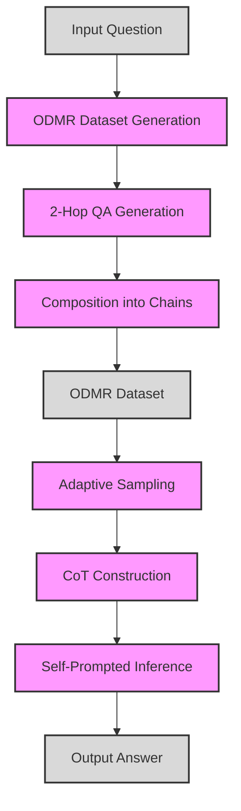

# Introducing an Innovative Self-Prompted Chain-of-Thought Framework for Empowering Large Language Models in Multi-Hop Reasoning

## Introduction

Open-domain question answering (ODQA) tasks require systems to answer factoid questions without relying on any specific context, by reasoning over their general world knowledge. Most existing ODQA datasets and models focus on single-hop reasoning, where the answer can be derived from a single inference step.

However, real-world questions often demand more complex multi-hop reasoning, where multiple reasoning steps are required to arrive at the final answer. To advance ODQA capabilities, the paper "Self-prompted Chain-of-Thought on Large Language Models for Open-domain Multi-hop Reasoning" introduces a more challenging task - open-domain multi-hop reasoning (ODMR).

ODMR requires answering multi-hop questions through explicit reasoning steps, without relying on any provided context. This is significantly more difficult than multi-hop QA with context, as the model cannot rely on retrieving relevant passages.

Recently, large language models (LLMs)  have shown promising reasoning and knowledge capabilities, even in open-domain settings without context. Chain-of-thought (CoT) prompting further improves LLM reasoning by providing step-by-step reasoning demonstrations. However, existing CoT methods have limitations in quality or diversity.

To address these issues, this paper proposes **Self-prompted Chain-of-Thought (SP-CoT)**, an automated framework to generate high-quality diverse CoTs for ODMR, by LLMs themselves. The key ideas are:

- Automated pipeline to generate ODMR dataset with multi-hop questions and reasoning chains

- Adaptive sampling to select diverse high-quality CoTs as demonstrations

- Self-prompted inference by learning from the generated CoTs through in-context learning

Extensive experiments on multiple ODMR datasets show SP-CoT significantly outperforms prior CoT methods and state-of-the-art ODQA techniques on large 175B LLMs. More importantly, it nearly doubles the performance of small 13B LLMs, demonstrating its general effectiveness.

## Background

Let's first understand the key concepts:

### Open-Domain Question Answering

ODQA aims to answer factoid questions without relying on any specific context passage. For example:

- Q: What is the capital of Australia?
- A: Canberra

The model is not provided any context, and must answer solely based on its world knowledge.

### Multi-Hop Question Answering

MHQA requires answering questions by reasoning over multiple steps. For example:

- Q: What is the capital of the country where the Great Barrier Reef is located?
- A: Canberra

This question cannot be answered in one step - the model must first deduce the Great Barrier Reef is in Australia, then that Canberra is the Australian capital.

### Open-Domain Multi-Hop Reasoning

ODMR introduces multi-hop reasoning to open-domain QA, without relying on any provided context. The model must answer via explicit reasoning steps only using its internal knowledge.

### Chain-of-Thought Prompting

Chain-of-thought (CoT) prompting improves LLM reasoning by providing step-by-step reasoning demonstrations as prompt context. For example:

- Q: What is the capital of the country where the Great Barrier Reef is located?
- Step 1) The Great Barrier Reef is located in Australia.
- Step 2) The capital of Australia is Canberra.
- A: Canberra

By learning from these reasoning steps, LLMs can better decompose and solve complex multi-hop questions.

## Challenges of Existing Methods

Prior CoT prompting methods have some key limitations:

- **Manual CoTs** require expensive human annotation, have limited diversity, and are not adaptive per question.

- **Automated CoTs** often have unreliable quality, as early errors propagate through the reasoning chain.

The core challenge is producing high-quality, diverse CoT demonstrations automatically, while ensuring robustness against reasoning errors.

## Self-Prompted Chain-of-Thought

To address these challenges, this paper proposes Self-prompted Chain-of-Thought (SP-CoT). It introduces an automated framework to generate high-quality CoTs for ODMR by LLMs themselves.

SP-CoT has three key stages:

### 1. Automated ODMR Dataset Generation

SP-CoT first automatically creates a novel ODMR dataset containing multi-hop questions with reasoning chains.

It uses an iterative self-generation pipeline, where LLMs are prompted to produce QA pairs, explanations and multi-hop compositions. This results in diverse multi-hop questions with decomposed reasoning steps annotated.

### 2. Adaptive CoT Selection

For each test question, SP-CoT then adaptively selects the most relevant examples from the ODMR dataset as CoT demonstrations.

It encodes all questions into embeddings, and uses clustering to retrieve the most similar questions from each cluster. This provides diverse, high-quality demonstrations tailored to the test question.

### 3. Self-Prompted Inference

Finally, SP-CoT performs self-prompted inference by providing the selected CoTs as context for in-context learning.

By learning from its own generated demonstrations, the LLM can infer the reasoning chain for new questions in a robust, self-prompted manner.

SP-CoT Framework

*Overview of the SP-CoT framework*

## Experiments & Results

The paper evaluates SP-CoT on four ODMR datasets:

- ComplexWebQuestions
- HotpotQA
- MuSiQue-Ans
- 2WikiMultiHopQA

It compares against prior state-of-the-art methods like GENREAD, Manual-CoT, Zero-shot-CoT and Auto-CoT.

The key findings are:

- On 175B LLMs, SP-CoT significantly outperforms all existing methods, improving state-of-the-art by 2-6%.

- More importantly, it nearly doubles the performance of small 13B LLMs, demonstrating its general effectiveness.

- Analysis shows SP-CoT produces more clear, concise and comprehensive CoTs, recalling ~50% intermediate answers.

This highlights the benefits of self-prompted CoT generation - improving both large and small LLM reasoning in open-domain multi-hop QA.

## Conclusion

In summary, this paper makes the following key contributions:

- Introduces the challenging task of open-domain multi-hop reasoning (ODMR)

- Proposes Self-prompted Chain-of-Thought (SP-CoT), an automated framework to generate high-quality CoTs for ODMR

- Achieves new state-of-the-art results on multiple ODMR datasets, especially for small 13B LLMs

- Provides an innovative demonstration of the promise of self-prompting in LLMs - generating data by, for and of LLMs themselves

The proposed techniques to automatically construct diverse, high-quality CoTs could have broader applicability beyond ODMR as well. Overall, this work highlights the potential for LLMs to iteratively build on their own knowledge through self-prompting, paving the way for more advanced self-supervised learning.

The paper provides an exciting direction towards more human-like open-domain reasoning capabilities in LLMs. The full paper can be found at <https://arxiv.org/abs/2310.13552> for an in-depth discussion of this work.
