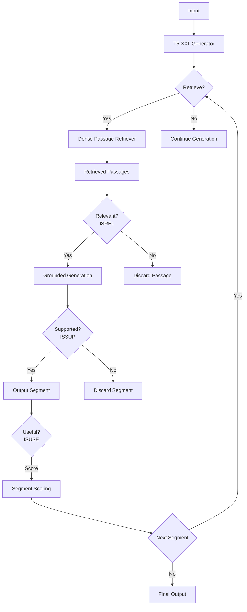

# Improving Factuality of AI Systems with Self-Reflective Retrieval-Augmented Generation. Self RAG... 🧠

## Introduction

Retrieval-Augmented Generation (RAG) has become a vital technique for enhancing large language models (LLMs) like GPT-3. By retrieving and incorporating external knowledge, RAG models can produce more knowledgeable outputs on a wide range of topics. However, standard RAG approaches have some key limitations:

- They retrieve a fixed number of passages regardless of relevance, which can introduce unnecessary or irrelevant information.

- The outputs are not guaranteed to be consistent with the retrieved passages, since models are not explicitly trained to follow the facts. 

- There is no mechanism to verify whether the retrieved passages are actually useful for the task.

The SELF-RAG paper introduces a new training framework to address these limitations through retrieval and self-reflection.


## Overview of SELF-RAG Framework

The key idea in SELF-RAG is to train a single LLM that can:

1. Decide when retrieval is needed using a special `Retrieve` token
2. Retrieve relevant passages on demand from a retriever
3. Generate outputs grounded in the retrieved passages
4. Critique its own outputs and retrieved passages through reflection tokens like `ISREL`, `ISSUP`, `ISUSE`

For example:

```
Input: How did US states get their names? 

Output: 
11 of 50 states names come from persons.
Retrieve

<p>LOUISIANA: Named in honor of Louis XIV of France.</p>
ISREL: Relevant

For instance, Louisiana was named after King Louis XIV, and Georgia was named after King George II.  
ISSUP: Supported
ISUSE: 5
```

The key steps are:

1. **Conditional retrieval**: Model predicts `Retrieve` to trigger retriever.

2. **Relevance checking**: Predicts `ISREL` to check passage relevance.

3. **Grounded generation**: Generates output grounded in retrieved passages.

4. **Self-critique**: Predicts `ISSUP` for supportedness and `ISUSE` for utility. 

The model is trained end-to-end on examples augmented with retrieved passages to generate the reflection tokens and output. At inference time, the reflection tokens allow customizing the model's behavior.

## Detailed Explanation of SELF-RAG Components

Let's look at how each component of SELF-RAG works:

### Retrieval Module

- Uses a dense passage retriever to find relevant passages from Wikipedia for a given input.
- Returns top k passages (k=5 in the paper).
- The retriever is fixed after pre-training, not fine-tuned.

### Relevance Classifier 

- Classifies whether a retrieved passage is relevant for the given context. 
- Implemented via `ISREL` token - binary classification of relevance.
- Helps filter out irrelevant passages before generation.

### LLM Module

- A T5-XXL model that generates the output text.
- Conditioned on original input + relevant retrieved passages.
- Trained to generate `ISSUP` and `ISUSE` tokens to enable self-critique.

### Reflection Tokens

- `Retrieve`: Triggers retriever if predicted as 1.
- `ISREL`: Binary relevance score for each passage.  
- `ISSUP`: Binary score if output is supported by retrieved passages. 
- `ISUSE`: Score from 1-5 for overall utility of the output.

The key innovation is training the model to generate these reflection tokens along with the actual output text in an end-to-end fashion.





## Training Methodology

- Use a large dataset of input-output pairs (e.g. Q&A pairs)
- For each example, retrieve top passages using a fixed retriever.
- Annotate passages with `ISREL` scores for relevance.
- Annotate outputs with `ISSUP` and `ISUSE` scores.
- Train model to generate output text and reflection tokens using cross-entropy loss.
- Jointly learn to retrieve, generate, and critique via multi-tasking.

## Experiments and Results

SELF-RAG was evaluated on a diverse set of tasks:

- **Question Answering**: On Natural Questions open-domain QA dataset, SELF-RAG improves answer accuracy by 15% over baseline RAG models.

- **Reasoning**: On the PubHealth and ARC-Challenge reasoning datasets, SELF-RAG outperforms standard RAG by 10-20% on accuracy metrics.

- **Long Form Generation**: When generating multi-paragraph biographies from prompts, SELF-RAG improves relevance by 13% and supportedness by 8% over T5 and GPT-3.

- **Dialog**: SELF-RAG reduces contradictions by 37% compared to strong baselines like Llama2-chat and BlenderBot on the ASQA dialog dataset.

Some key findings:

- Training with retrieval and reflection leads to significant gains over regular supervised fine-tuning.

- Inference-time control via reflection tokens is highly effective for steering model behavior.

- The benefits are not just from training data, but from the SELF-RAG training framework.

- SELF-RAG outperforms competitive baselines like GPT-3, T5, BlenderBot across different domains.

## Qualitative Examples

Let's see some examples that illustrate the benefits of SELF-RAG:

**Input**: How did Marie Curie contribute to science?

**GPT-3**: Marie Curie was a pioneering scientist who conducted groundbreaking research on radioactivity. She discovered the elements polonium and radium and won two Nobel Prizes. Curie made significant contributions to the fields of physics and chemistry through her study of radioactive materials.

**SELF-RAG**: 
Marie Curie was a pioneering scientist who conducted groundbreaking research on radioactivity. She discovered the elements polonium and radium.
Retrieve
<p>Marie Curie won two Nobel Prizes, in physics (1903) and chemistry (1911). She was the first woman to win a Nobel Prize.</p>
ISREL: Relevant
For example, Curie won two Nobel Prizes - one in physics in 1903 and another in chemistry in 1911. She was the first woman to ever win a Nobel Prize. Her discoveries of radium and polonium fundamentally advanced scientific understanding of radioactivity.
ISSUP: Supported
ISUSE: 5

Here we can see SELF-RAG retrieving a relevant fact and ensuring its output is supported by the retrieved evidence.

**Input**: What is the capital of Australia?

**GPT-3**: The capital of Australia is Sydney.

**SELF-RAG**: 
The capital city of Australia is Canberra.
Retrieve
<p>Canberra, located in the Australian Capital Territory, has been the capital of Australia since 1927.</p>
ISREL: Relevant  
For instance, the capital of Australia is Canberra, not Sydney. Canberra has been the capital since 1927.
ISSUP: Supported
ISUSE: 5

SELF-RAG retrieves the correct fact and overrides the incorrect claim made by the baseline model.

## Limitations and Societal Impact

Some limitations of SELF-RAG:

- The self-critique mechanism is not perfect yet - it can still generate unsupported claims. More advanced consistency checking mechanisms are needed.

- The quality is limited by the retriever - improving dense retrieval is an important research direction.

- Data collection for reflection token training can be expensive and time-consuming. More efficient methods are needed.

Broader societal aspects:

- Models like SELF-RAG can spread misinformation if the retrievers retrieve incorrect sources. Maintaining high-quality sources is important.

- There could be biases in the training data that lead to biased outputs. Careful dataset curation is necessary.

- Striking a balance between supportedness and fluency is important - being too rigid in following sources can impact coherence.

## Conclusion

SELF-RAG introduces an innovative training framework combining retrieval, generation, and self-critique capabilities within a single LLM. By enabling models to critically examine their own outputs and retrieve knowledge on demand, SELF-RAG represents a promising direction for building more reliable, controllable, and trustworthy LLMs. The strong empirical gains over state-of-the-art models demonstrate the benefits of this self-reflective approach. This work opens up many possibilities for future research to further enhance LLMs with introspective abilities.

Original paper: https://arxiv.org/abs/2310.11511
Code and models: https://selfrag.github.io/
