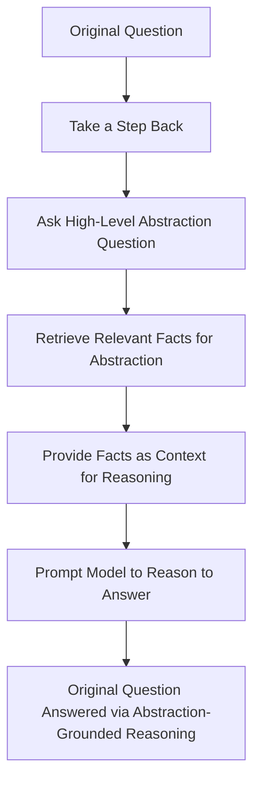
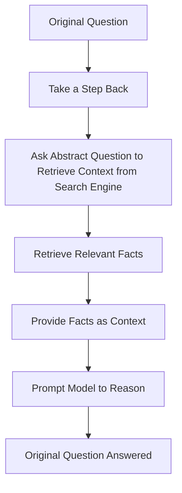

# Taking a Step Back to Move Forward: How Abstraction Enables Complex Reasoning in Large Language Models

## Introduction

The field of natural language processing has seen remarkable progress in recent years, largely driven by advances in large language models (LLMs).

These models can generate impressively human-like text and engage in simple conversations.

However, complex reasoning involving multiple steps still proves challenging for even the most advanced LLMs.

In a new paper from Google DeepMind titled "TAKE A STEP BACK: EVOKING REASONING VIA ABSTRACTION IN LARGE LANGUAGE MODELS", researchers explore how introducing abstraction into the reasoning process can significantly improve an LLM's ability to tackle complex, multi-step problems.


[Figure from the paper illustrating the "Take a Step Back" technique](https://arxiv.org/pdf/2310.06117.pdf)

## The Limitations of LLMs in Complex Reasoning

Although LLMs have shown impressive capabilities, they still struggle with complex reasoning tasks like answering science questions or having multi-turn conversations that require understanding the context and maintaining a consistent train of thought.

For instance, when presented with a physics problem involving multiple steps of reasoning based on core principles, an LLM might fail to apply the relevant formulas correctly at each step. Or when asked a series of interrelated questions, the LLM loses track of the context and provides inconsistent or contradictory answers.

These failures highlight the limitations of current LLMs in complex reasoning - they have trouble breaking down problems into logical steps and lack the ability to form and leverage abstract representations.

## Introducing Abstraction into the Reasoning Process

To address these limitations, the DeepMind researchers explored adding a simple prompting technique they call "Take a Step Back", which introduces abstraction into the reasoning process.

The key insight is that humans often take a step back from the specifics of a problem to think about it at a more abstract level before reasoning to a solution. For example, when solving a physics problem, we first abstract it into the relevant principles and formulas that apply. Or when answering a series of questions about a person, we summarize what we know about them.

This abstraction provides a broad, high-level representation that guides the subsequent reasoning steps. The researchers hypothesized this technique could work equally well for LLMs.

## The "Take a Step Back" Technique

The "Take a Step Back" technique involves two simple phases:

1. **Abstraction**: Prompt the LLM to summarize the problem or situation at a more abstract level by identifying the key principles, concepts, or entities involved.

2. **Reasoning**: Given this high-level abstraction, prompt the LLM to reason through the problem step-by-step to generate the final answer.



**The steps are**:

- Start with the original question (A)
- Prompt the model to "take a step back" (B)
- Ask a high-level, abstract version of the question (C)
- (e.g. ask about general principles or concepts involved)
- Use the abstraction question to retrieve relevant facts (D)
(e.g. via search or knowledge base)
- Provide the retrieved facts as context (E) to ground the reasoning
- Prompt the model to reason step-by-step to the answer (F),
- leveraging the high-level abstraction
- Arrive at the answer to the original question (G) via reasoning guided by the abstraction

**For example, consider this physics question**:

*What happens to the pressure of an ideal gas if the temperature is increased by a factor of 2 and the volume is increased by a factor of 8?*

The LLM is first prompted to "take a step back" and provide the key principle needed to solve the problem:

*The physics principles behind this question are the ideal gas law, PV = nRT, where P is pressure, V is volume, n is the amount of gas, R is a constant, and T is temperature.*

Given this abstraction, the LLM can then methodically apply the ideal gas law at each step to reason to the final answer:

*Using the ideal gas law PV = nRT, if T increases by a factor of 2 and V increases by a factor of 8, then P will decrease by a factor of 4.*

By grounding the reasoning on the high-level abstraction, the LLM is much less likely to make mistakes in the intermediate steps.

## Evaluating the Impact of "Take a Step Back"

To evaluate the impact of this technique, the researchers tested LLMs with and without "Take a Step Back" prompting on a diverse set of complex reasoning tasks:

- **STEM questions** from domains like physics, chemistry, and biology
- **Knowledge-intensive QA** requiring reasoning about facts
- **Multi-hop reasoning** with chains of interrelated logic

In all cases, introducing abstraction via "Take a Step Back" significantly boosted the performance of LLMs like PaLM and GPT-3. For instance, on multi-hop reasoning datasets, the technique improved accuracy by over 25% in some cases.

The researchers also analyzed the errors with and without abstraction. They found the key benefit is reducing reasoning mistakes - by taking a step back, the LLM is much less likely to get off track. This highlights the power of abstraction in strengthening complex reasoning.

## Example in Python with litellm library

```python
from litellm import completion


def generate_step_back_prompt(problem):
    """Generates a prompt to take a step back from the original problem."""

    prompt = f"""
# Original Problem:
"{problem}"

# Step Back: 
What are the key steps and concepts needed to solve this math word problem? 

# Explain the key steps:

# Solve the original problem:
To solve the original problem, I will...
"""
    return prompt


def process_response(response):
    """
    Processes the response from the completion function.
    """
    for chunk in response:
        try:
            if "choices" in chunk and chunk["choices"]:
                choice = chunk["choices"][0]
                if choice["finish_reason"] == "stop":
                    print("\n")
                    break
                if "delta" in choice and "content" in choice["delta"]:
                    content = choice["delta"]["content"]
                    if content:
                        end = "\n" if content.endswith("\n") else ""
                        print(content, end=end)
            else:
                print("")
        except Exception as e:
            print(f"An error occurred: {e}")


def generate_message(prompt):
    """
    Generates the message for the completion function.
    """
    message = {"role": "user", "content": prompt}
    return message


def main():
    """
    Main function to generate the prompt, call the completion function,
    and process the response.
    """

    problem = """
    “A man spends one-eighth of his money on rent,
    and four times that amount on food and clothing. 
    He has $ 9,000.00 left. How much did he have at the beginning? """

    prompt = generate_step_back_prompt(problem)
    print(prompt)
    message = generate_message(prompt)
    try:
        response = completion(model="gpt-3.5-turbo",
                              messages=[message], stream=True, temperature=0.5)
        process_response(response)
    except Exception as e:
        print(f"An error occurred: {e}")


if __name__ == "__main__":
    main()
```

Running the code above generates the following output:

```text
# Original Problem:
"
    “A man spends one-eighth of his money on rent,
    and four times that amount on food and clothing. 
    He has $ 9,000.00 left. How much did he have at the beginning? "

# Step Back: 
What are the key steps and concepts needed to solve this math word problem? 

# Explain the key steps:

# Solve the original problem:
To solve the original problem, I will...

1. Start by setting up an equation to represent the problem. Let's call the man's initial amount of money "x".

2. According to the problem, the man spends one-eighth of his money on rent, so he has (7/8)x left.

3. The man also spends four times the amount he spent on rent on food and clothing, so he spends 4 * (1/8)x = (1/2)x on food and clothing.

4. After spending money on rent and food and clothing, the man has $9,000 left, so we can set up the equation (7/8)x - (1/2)x = 9,000.

5. Simplify the equation by multiplying both sides by 8 to get rid of the fractions: 7x - 4x = 72,000.

6. Combine like terms to get 3x = 72,000.

7. Divide both sides of the equation by 3 to solve for x: x = 24,000.

8. Therefore, the man had $24,000 at the beginning.
```

Out of the box, gpt-3.5 cannot solve this problem. However, with the "Take a Step Back" technique, it can solve it with 100% accuracy.

## Key Takeaways

The DeepMind paper provides compelling evidence that introducing abstraction into the reasoning process can substantially improve the performance of LLMs on complex, multi-step problems. Here are the key takeaways:

- LLMs still struggle with complex reasoning requiring multiple steps of logic.
- Adding a simple "Take a Step Back" technique enables abstraction.
- Abstraction provides a high-level representation to guide reasoning.
- This technique significantly boosted LLM performance on challenging reasoning tasks.
- The key benefit is reducing reasoning errors by grounding logic in abstraction.

## Step Back in Action with LangChain combined with RAG (Retrieval-Augmented Generation)

The "step back" technique involves first prompting the model to ask a high-level, abstract version of the question.

This abstract question can then be used to retrieve relevant context, such as through a search engine like DuckDuckGo.

The retrieved context provides useful background facts and concepts that can ground the reasoning process. For example, on a question about a person's education history, "step back" may retrieve a short biography summarizing their schooling.

RAG models are designed to leverage retrieved context to improve reasoning and answering. By combining "step back" with RAG, the model can first retrieve contextual information on the high-level abstraction, which aids in formulating a more focused search query for the original specific question.

This two-step retrieval process allows the model to build up useful context to reason accurately.



**The steps are**:

- Start with the original specific question (A)
- Prompt the model to "take a step back" and ask an abstract version of the question (B, C)
(e.g. ask about general concepts or context instead of specifics)
- Use the abstract question to retrieve relevant facts (D)
(e.g. via search engine)
- Provide the retrieved facts as context (E) to ground the reasoning
- Prompt the model to reason through the specifics to answer the original question (F),
leveraging the high-level context
- Arrive at the answer to the original specific question (G) via reasoning guided by the abstraction

LangChain example implementation combined with RAG: [https://github.com/langchain-ai/langchain/blob/master/cookbook/stepback-qa.ipynb](https://github.com/langchain-ai/langchain/blob/master/cookbook/stepback-qa.ipynb)

## Looking Ahead

This research provides a promising method for overcoming a major weakness of current LLMs. The results suggest that integrating human-inspired techniques like abstraction can enable more robust reasoning capabilities in large language models.

Looking ahead, an exciting direction is exploring how to automate abstraction, so LLMs can learn to take a step back on their own rather than requiring explicit prompting. More advanced techniques that allow models to flexibly move between abstract and concrete representations could greatly expand their reasoning capacities.

By continuing to draw inspiration from human cognition, researchers can pave the way for LLMs that are not just skilled mimics but genuine reasoning engines. The DeepMind team's "Take a Step Back" technique offers an important step forward on this journey.

## Call to Action

To learn more about how abstraction can enable complex reasoning in large language models, I highly recommend reading the full paper at [https://arxiv.org/abs/2310.06117](https://arxiv.org/abs/2310.06117).

The techniques explored in this research could open exciting new capabilities in LLMs.

## References

Zheng, Huaixiu Steven, et al. "TAKE A STEP BACK: EVOKING REASONING VIA ABSTRACTION IN LARGE LANGUAGE MODELS." arXiv preprint arXiv:2310.06117 (2023).
