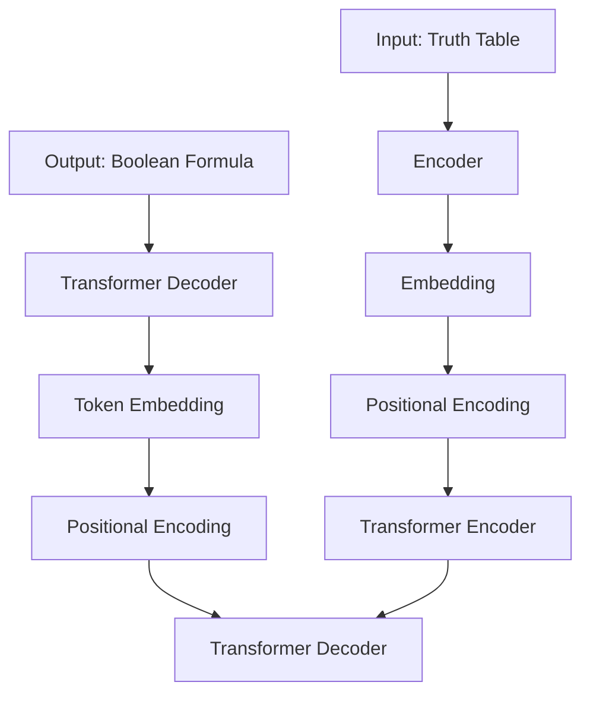
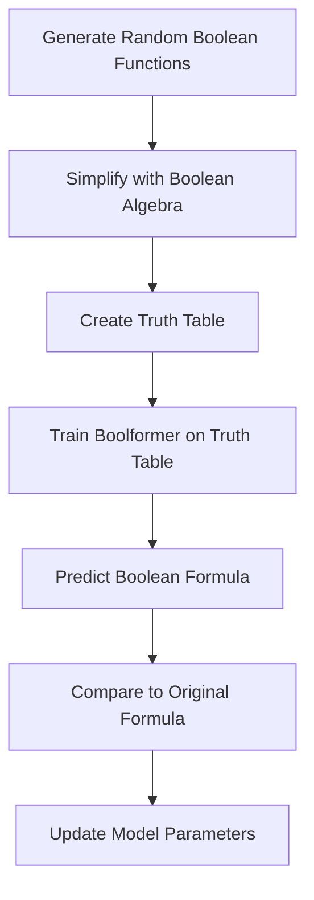

### **Discovering the Logic of the World with Transformers**

I am always on the lookout for innovative ways to leverage AI to solve real-world problems.

One area that has recently caught my attention is the use of transformers for symbolic regression - finding mathematical and logical expressions that fit a dataset. In particular, a new paper titled **"Boolformer: Symbolic Regression of Logic Functions with Transformers"** demonstrates how transformers can be trained to perform symbolic regression of Boolean logic functions.

As someone passionate about interpretable and trustworthy AI, I believe this technique holds great promise for advancing AI's understanding of logical reasoning.


### **Why Symbolic Regression Matters for Interpretability**

Many modern AI systems rely on complex neural networks that learn implicit statistical relationships from data.

While powerful, these black-box models lack interpretability - we cannot understand the reasoning behind their predictions.In contrast, symbolic regression aims to find human-readable mathematical expressions that capture the underlying logic.

The discovered expressions provide insight into the mechanisms at play, allowing us to verify, critique, and build trust in the model.

For example, in medical applications, symbolic regression could identify logical rules that determine disease diagnosis based on symptoms and test results.

This allows doctors to validate the model's reasoning rather than blindly follow its predictions.In physics, symbolic regression may discover governing equations from experimental data that reveal new scientific insights.

Historically, many fundamental laws of nature have been formulated through symbolic regression on observed measurements.

More broadly, logical expressions are the lingua franca for human reasoning across disciplines like math, science, law, and philosophy.

Symbolic regression allows AI systems to communicate their inner workings in this canonical language of logic, making them more transparent and aligned with human reasoning.

### **Introducing Boolformer**

The paper presents Boolformer, the first transformer architecture for end-to-end symbolic regression of Boolean logic functions.



Given a dataset of input-output examples, Boolformer learns to predict a Boolean formula that fits the data.

For instance, given examples like:

```
(0, 0) -> 0

(0, 1) -> 1

(1, 0) -> 1

(1, 1) -> 0
```

Boolformer may discover the XOR function:

```
y = x1 XOR x2
```

The key innovations enabling this achievement are:

1. **Sequence-to-sequence learning**: Boolformer is trained as a **seq2seq** model that ingests input-output examples and predicts the target formula as a sequence of logic tokens.
2. **Synthetic training data**: The model is trained on randomly generated Boolean functions and their truth tables. This exposes it to a diverse space of logical expressions.
3. **Canonical simplification**: The training data is simplified using Boolean algebra principles to encourage discovery of minimal canonical expressions.

By combining these ideas with the powerful pattern recognition capabilities of transformers, Boolformer demonstrates an unprecedented ability to learn and reason with pure Boolean logic using modern deep learning.

<aside>
📔 A seq2seq (sequence-to-sequence) model is a type of model used in machine learning that takes a sequence of input data and produces a sequence of output data. It is commonly used in tasks such as machine translation, text summarization, and question answering.

The model consists of two main components: an **encoder** and a **decoder**. The encoder takes the input sequence and processes it, encoding the information into a fixed-size vector called the "context vector." The context vector contains a condensed representation of the input sequence.

The decoder then takes the context vector and generates the output sequence, one element at a time. At each step, it uses the previously generated elements as input to predict the next element in the sequence. This process continues until the entire output sequence is generated.

The goal of the seq2seq model is to learn the mapping between the input sequence and the output sequence, capturing the underlying patterns and dependencies in the data.

By training the model on a large dataset with known input-output pairs, it learns to generate the correct output sequence given an input sequence.

</aside>

### **How Boolformer Works**

Under the hood, Boolformer has a standard transformer encoder-decoder architecture. But a few customizations make it specially suited for symbolic regression:

- The encoder takes as input the truth table of a Boolean function. Each input-output pair is embedded into a vector.
- The decoder autoregressively generates a sequence of logic tokens representing the target formula.
- Training uses cross-entropy loss between predicted and ground-truth tokens.

How toolformer is trained ?



Additionally, two key components improve the model's performance:

**Canonical Simplification**

The training data generator heavily simplifies the generated Boolean formulas using algebraic rewriting rules.

This shrinks the formulas, removes redundancies, and brings them closer to canonical minimal forms.

As a result, Boolformer learns to prefer compact expressions.

**Robust Embedding**

To handle variable-sized inputs, an embedding module maps each input-output row into a fixed-size vector.

This allows the model to ingest truth tables of any dimension.

The embeddings also help cope with missing or noisy data.With these innovations, Boolformer demonstrates an unprecedented ability to learn pure logical reasoning given a truth table, while generalizing to unseen functions.

### **Results on Clean Data**

The paper first evaluates Boolformer on clean datasets where the full truth table is provided for Boolean functions unseen during training:

**Boolean Circuits**

It predicts compact formulas for complex functions like multiplexers, comparators, adders, multipliers, majority, and parity circuits.

The results are optimal or near-optimal expressions in many cases.

**Real-world Classification**

On a suite of binary classification datasets from medicine, games, finance, etc., Boolformer matches the predictive accuracy of random forests and logistic regression while producing highly interpretable Boolean rules.

These results show Boolformer's ability to recover the underlying logic from clean observations.

Next, we'll see how it holds up to more challenging noisy and incomplete data.

### **Inferring Approximate Expressions from Noisy Data**

Real-world data is often noisy and incomplete.

So the paper tests Boolformer's robustness by training and evaluating it on partially observed truth tables with flipped output bits.

Remarkably, it learns to ignore irrelevant variables and filter noise to produce approximate Boolean formulas matching the core logic.

Some key findings:

- **Performance gracefully degrades** as noise, missing data, and irrelevant variables increase. But overall accuracy remains high.
- On a suite of 120-dimensional binary classification datasets, Boolformer achieves **similar F1 scores as logistic regression and random forests**.
- The learned formulas qualitatively reflect meaningful logic for predicting outcomes. For example, a formula for mushroom toxicity identifies key traits like gill size, stalk shape, cap texture, etc.

These results demonstrate Boolformer's **potential as an interpretable yet accurate classifier when real-world data is scarce and noisy**. The discovered logical relationships can provide insight into the prediction process.

### **Application to Modeling Gene Regulatory Networks**

Finally, the paper shows how Boolformer can be applied to the real-world task of modeling gene regulatory networks.

Gene regulation involves complex logic where genes activate or inhibit each other's expression. Reverse engineering these relationships from measurement data is an active research problem.Boolformer presents a new approach - learn a Boolean formula for each gene's regulation based on the expression of other genes over time.

The paper tests this on a recent benchmark of 30 gene networks.Remarkably, Boolformer matches or exceeds state-of-the-art methods on predicting network dynamics and structure. But it offers two major advantages:

1. It directly provides simple and interpretable Boolean rules for each gene's regulation. Other methods only output the most influential genes.
2. Inference is orders of magnitude faster - seconds versus hours. Other techniques rely on slow simulation-based optimization.

This demonstrates Boolformer's usefulness as an efficient and transparent method for modeling complex biological systems.

## How to use toolformer

Install the model

```python
pip install boolformer
```

Import the model in a few lines of code:

```python
from boolformer import load_boolformer
boolformer_noiseless = load_boolformer('noiseless')
boolformer_noisy     = load_boolformer('noisy')
```

Using the model:

```python
import numpy as np
inputs = np.array([  
    [False, False],
    [False, True ],
    [True , False],
    [True , True ],
])
outputs1 = np.array([False, False, False, True])
outputs2 = np.array([True, False, False, True])
inputs = [inputs, inputs]
outputs = [outputs1, outputs2]
pred_trees, error_arr, complexity_arr = boolformer_noiseless.fit(inputs, outputs, verbose=False, beam_size=10, beam_type="search")

for pred_tree in pred_trees:
    pred_tree.treelib().show()
```

Result

```python
and
├── x_0
└── x_1
or
├── and
│   ├── x_0
│   └── x_1
└── not
    └── or
        ├── x_0
        └── x_1
```

### **Limitations and Future Work**

The Boolformer paper provides an **exciting proof-of-concept for end-to-end symbolic regression with transformers**. But there are still challenges and room for improvement:

- It has only been tested on small Boolean circuits with up to 10 inputs. Scaling up to handle more complex functions is an open research problem. Hybrid architectures combining Boolean reasoning with neural representation learning may help.
- The XOR operation is notably absent from the function set. Adding it could allow more compact expressions, especially for parity functions. More broadly, expanding the function set with non-Boolean operations like arithmetic could increase applicability.
- Currently, formulas are predicted one output at a time. Enabling vector-valued functions with shared subexpressions could improve efficiency and compactness.
- Training directly on real-world data rather than synthetic functions may improve robustness and avoid overfitting to a particular distribution.
- Theoretical analysis of the model's generalization, simplicity bias, and sample complexity could provide better understanding.

In summary, this paper introduces an innovative application of transformers for interpretable logical reasoning. While work remains to scale up the technique and improve robustness, it shows promising results on both abstract and real-world Boolean reasoning tasks. The ability to produce human-readable logic from data could make AI systems more trustworthy and aligned with human thinking. I believe Boolformer represents an important step towards transparent and verifiable artificial intelligence.

### **Try Boolformer Yourself**

If you found this intriguing, I encourage you to read the

[full paper](https://arxiv.org/abs/2309.12207)

and try out Boolformer yourself! The code is available on Github at

[this link](https://github.com/sdascoli/boolformer)

Some ways you could experiment with Boolformer:

- **Apply it to your own binary classification dataset and inspect the logical formulas** it discovers. Do they provide insight into the prediction process?
- **Generate synthetic Boolean functions and see if Boolformer can recover the underlying logic from the truth table**. How complex can the functions get before it fails?
- Try improving Boolformer's architecture and training - can you get it to handle larger circuits or more complex operations?
- Build an interactive web demo that allows exploring how Boolformer's inferences change as the truth table is edited. This could make the reasoning process highly transparent.

I'm excited to see how the AI community builds on this work to create more interpretable and trustworthy systems.

Symbolic regression has great potential to unravel the logical fabric of the world! Let me know if you come up with any cool extensions or applications of Boolformer.

## References

[1] d'Ascoli, S., Bengio, S., Susskind, J., & Abbé, E. (2023). Boolformer: Symbolic Regression of Logic Functions with Transformers. *[arXiv preprint arXiv:2309.12207](https://export.arxiv.org/pdf/2309.12207)*.

[2] Boolformer: Symbolic Regression of Logic Functions with Transformers. (2023). *Hugging Face*. <https://huggingface.co/papers/2309.12207>

[olformer-pytorch](https://github.com/lucidrains/toolformer-pytorch)

[3] Kamienny, P., d’Ascoli, S., Lample, G., & Charton, F. (2022). End-to-end symbolic regression with transformers. *[arXiv preprint arXiv:2204.10532](https://arxiv.org/abs/2204.10532)*.

[4] [Symbolic Regression with Transformers]. (2023, April 8). YouTube. <https://youtube.com/watch?v=_gdmCbUvb2w>

[5] Kamienny, P., d’Ascoli, S., Lample, G., & Charton, F. (2022). End-to-end symbolic regression with transformers. *OpenReview*. <https://openreview.net/pdf?id=GoOuIrDHG_Y>
