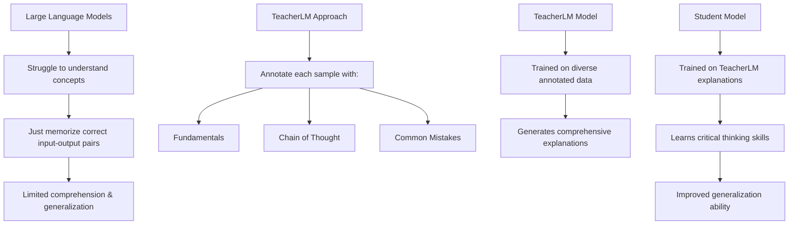

# TeacherLM: A Revolutionary Approach to Training AI Models ... "Teaching to Fish Rather Than Giving the Fish, Language Modeling Likewise"

The paper "TeacherLM: Teaching to Fish Rather Than Giving the Fish, Language Modeling Likewise" caught my attention as it tackles a fundamental problem in training AI models - how to get them to truly understand concepts rather than just memorize correct answers. As a seasoned data and AI strategist passionate about advancing the field, I was intrigued by the potential of TeacherLM. In this article, I'll explain the key ideas behind TeacherLM, why it represents an important breakthrough, and the implications for the future of AI.


## The Problem: AI Models Struggle to Understand Concepts

In recent years, we've seen astounding progress in AI capabilities driven by ever-larger neural network models like GPT-3, PaLM, and ChatGPT. However, most AI training simply shows these models many examples of inputs and correct outputs. As a result, the models get very good at pattern recognition and memorization but lack true understanding of the concepts and reasoning behind the training data.

This limited comprehension hinders performance on complex reasoning tasks and generalization to new situations. It's like students cramming answers without grasping the underlying principles - they may ace the test but fail to apply the knowledge later. For AI to reach its full potential, models need to learn the "why" not just the "what."

## TeacherLM: Training Models to Think Critically

The authors of TeacherLM address this problem with a brilliant insight - we need to train AI like human students, explaining concepts and reasoning, not just showing correct answers. TeacherLM is a 7.1 billion parameter model designed to annotate training samples with relevant:

- **Fundamentals**: Background concepts needed to understand the problem
- **Chain of Thought**: Step-by-step reasoning to arrive at the solution
- **Common Mistakes**: Incorrect assumptions to avoid

For example, consider this question:

> Boyle's law correlates the pressure and volume of a gas. True or False?

We can use the following prompt to train a model to answer this question:

```text
Question: [Question text]
Answer: [Answer text]
Fundamentals:
[Relevant background concepts and facts needed to understand the question and answer]
Chain of Thought:
[Logical reasoning steps to arrive at the answer]
Common Mistakes:
[Incorrect assumptions or answers to avoid]

For example, for a question on Boyle's law in physics, the prompt could be:
Question: Does Boyle's law correlate pressure and volume for a gas?
Answer: Yes, Boyle's law states that pressure and volume are inversely proportional for a gas at constant temperature.
```

## TeacherLM Explanation

### Fundamentals

- Boyle's law describes the relationship between the pressure and volume of a gas at constant temperature.
- It states that the product of pressure (P) and volume (V) is a constant. So for a fixed mass of gas at constant temperature:
  - P × V = k
  - Where k is a constant.
- As volume increases, pressure decreases proportionally. As volume decreases, pressure increases proportionally.
- Boyle's law is a gas law that applies to ideal gases and real gases at conditions not too close to liquefaction.
- It arises from the kinetic theory of gases, which models gas molecules as colliding billiard balls.

### Chain of Thought

- The question states: "Boyle's law correlates the pressure and volume of a gas."
- Boyle's law mathematically relates pressure and volume as:
  - P × V = k
  - P ∝ 1/V
- So there is a correlation between P and V. As one changes, the other changes proportionally.
- Therefore, the statement accurately describes Boyle's law, which does correlate pressure and volume for a gas.
- Since the statement correctly describes Boyle's law, the answer is True.

### Common Mistakes

- Don't think Boyle's law relates temperature and volume - that is Charles' law.
- Boyle's law applies only to gases, not liquids or solids.
- The law assumes constant temperature. Don't apply it to processes with temperature changes.
- Boyle's law only holds for ideal gases. Real gases deviate at high pressures or low temperatures near liquefaction.
- The correlation between P and V is inverse, not direct. P does not increase with V.

So in summary, the key points are that Boyle's law correlates pressure and volume inversely for gases at constant temperature. The statement is true, as it accurately summarizes this relationship.

## Remarkable Results with a "Small" 7.1B Model

The researchers demonstrated TeacherLM's capabilities by training a 7.1 billion parameter version called TeacherLM-7B. This is considered a smaller model by today's standards, dwarfed by models like PaLM (540B parameters) and GPT-3 (175B parameters).

Yet on the challenging MMLU benchmark for reasoning across academic subjects, TeacherLM-7B achieved a zero-shot score of 52.3 - surpassing GPT-3 and nearly matching PaLM's fine-tuned score of 60! TeacherLM-7B also improved student model performance by 1-5% across multiple datasets when used for data augmentation.

These results show TeacherLM's annotations teach critical thinking skills far more effectively than exposure to millions of additional training examples. The 7.1B model strikes an excellent balance between performance and practicality for real-world use.



## The Future: Smarter AI with Greater Understanding

TeacherLM provides a blueprint for training AI systems that truly comprehend concepts rather than just recognize patterns. This paradigm shift could enable breakthroughs like:

- **Personalized Education:** Tutor AIs that explain material at a student's level
- **Explainable AI:** Models that give reasons for their predictions
- **General Problem Solving:** Systems that apply concepts to new tasks and domains

Of course, there is still much work to be done. TeacherLM focuses narrowly on academic topics, and its generated explanations are not always perfect. But the underlying approach feels exactly right - rather than endlessly scaling up models, TeacherLM points the way to smarter AI through education.

The authors plan to open source TeacherLM and its augmented datasets, providing a valuable resource for researchers. I'm excited to experiment with TeacherLM and see what future innovations build on this work! Please check out the original paper and share your thoughts in the comments.

## Citations

Wang, S., Tang, Y., Duan, N., Wei, F., Huang, X., Ji, H., Chen, J., Zhou, M., & Huang, T. (2023). TeacherLM: Teaching to Fish Rather Than Giving the Fish, Language Modeling Likewise. arXiv preprint arXiv:2301.11686.

[https://arxiv.org/abs/2310.19019](https://arxiv.org/abs/2310.19019)