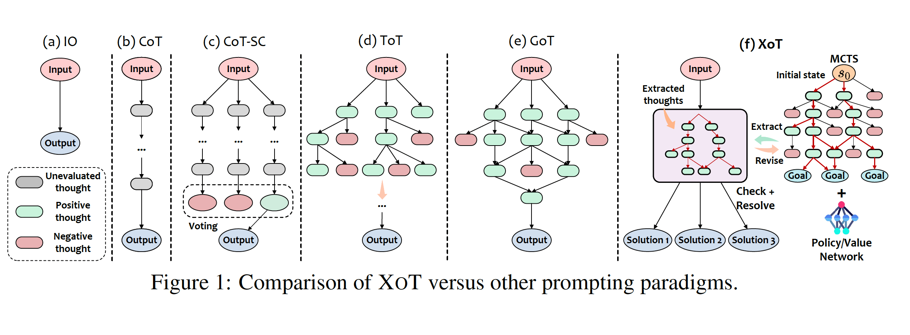
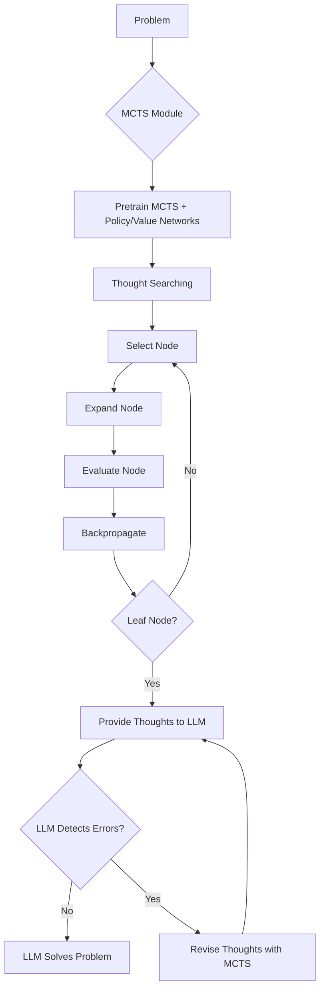

# XoT : a new prompting technique for AI  - The Secret Sauce to Level Up Your LLM's Reasoning Prowess …

## Introduction

In this article, I will be discussing an exciting new research paper titled ["Everything of Thoughts: Defying the Law of Penrose Triangle for Thought Generation"](https://arxiv.org/abs/2311.04254) by researchers at Microsoft and other institutions. This paper introduces a novel prompting technique called XOT that unlocks the potential of large language models (LLMs) like GPT-3 and GPT-4 for complex problem-solving. 

## The Limitations of Current Prompting Techniques

Recent advancements in LLMs have enabled new approaches to problem-solving by breaking down complex problems into more manageable "thoughts" expressed through natural language prompts. However, most existing prompting techniques have limitations:

- **Input-Output (IO) prompting** is only suitable for simple problems with single-step solutions. It lacks flexibility.

- **Chain-of-Thought (CoT)** enables step-by-step problem-solving but is confined to linear thought structures, limiting flexibility.

- **Tree-of-Thought (ToT)** and **Graph-of-Thought (GoT)** allow more flexible thought structures like trees or graphs. However, they require the LLM itself to evaluate intermediate thoughts, incurring significant computational cost through multiple LLM calls.

In essence, current prompting techniques face a "Penrose Triangle" constraint - they can achieve a maximum of two attributes (performance, efficiency, flexibility) but not all three simultaneously.

## Introducing XOT 

To address these limitations, the paper introduces a new prompting technique called **XOT (Everything of Thoughts)**. XOT integrates reinforcement learning and Monte Carlo Tree Search (MCTS) to inject external knowledge into the prompting process. This enhances the capabilities of LLMs and enables superior performance, efficiency, and flexibility concurrently.

The key components of XOT are:

- **MCTS module** - Uses lightweight policy and value networks to efficiently explore potential thought structures for a task through simulation.

- **LLM solver** - Refines and revises the thoughts from MCTS using the LLM's internal knowledge. This collaborative process improves thought quality.

## How XOT Works

The XOT framework involves the following key steps:

1. **Pretraining phase**: The MCTS module is pretrained on specific tasks to learn domain knowledge about effective thought searching. Lightweight policy and value networks guide the search.

2. **Thought searching**: During inference, the pretrained MCTS module uses the policy/value networks to efficiently explore and generate thought trajectories for the LLM.

3. **Thought revision**: The LLM reviews the thoughts from MCTS and identifies any errors. Revised thoughts are generated through additional MCTS simulations. 

4. **LLM inference**: The final prompt with revised thoughts is provided to the LLM for problem-solving.

The following diagram illustrates the XOT framework:

The key steps are:

1. The **MCTS module** is pretrained on specific tasks using policy and value networks to guide the search and learn domain knowledge.

2. During **thought searching**, the pretrained MCTS uses the policy and value networks to efficiently explore the search space and generate thought trajectories. This involves iteratively selecting, expanding, evaluating, and backpropagating nodes. 

3. The **thought trajectories** are provided to the LLM as a prompt.

4. The LLM **detects any errors** in the thoughts using its internal knowledge. 

5. If errors are found, the MCTS module is used to **revise** the thoughts through additional simulations.

6. The process repeats until the LLM **solves** the problem using the revised high-quality thoughts.

## An example of XOT in action

The paper "Everything of Thoughts: Defying the Law of Penrose Triangle for Thought Generation" introduces a novel thought prompting approach called "Everything of Thoughts" (XOT) that aims to enhance the capabilities of Large Language Models (LLMs) in problem-solving. 

Let's consider a step-by-step example of how XOT works using the Pocket Cube problem, a 2x2x2 Rubik's Cube, as described in the paper.

1. **Selection**: The algorithm starts at the root node and chooses an action from the available set for single-step thought generation in the current state. This process continues until a leaf node within the current tree is reached. The selection is guided by the PUCT algorithm, aiming to maximize the Upper Confidence Bound (UCB).

2. **Evaluation and Expansion**: Upon reaching a previously unselected leaf node, we expand to the state for the next step for new thought exploration. This expansion involves the evaluation of its value and action probability on the state, which are modeled by neural networks parameterized by θ, i.e., (Pθ(s), vθ(s)) = fθ(s). Here Pθ(s) is the prior probabilities for all actions on s, and vθ(s) denotes its predicted state value. These two values are retained and stored for backup purposes, and state s is marked as “visited”.

3. **Backpropagation**: Following the expansion of a leaf node in the above phases, which could be either an unexplored or terminal state, the algorithm proceeds to update all the Q(s, a) values via backpropagation. For unexplored nodes, this update involves computing the mean of its estimated value vθ, while for terminated nodes, it’s based on the true reward r. These updates occur as information is backpropagated along the trajectory to subsequent nodes. Additionally, the visit count for each state-action pair is also incremented.

4. **Thought Inference**: After the MCTS has completed its search, the thoughts are extracted and provided to the LLM. The LLM then reviews and refines these thoughts, continuing the MCTS search process if needed, and eventually formulates the final answers by integrating these external thoughts with their internal knowledge.

This process is repeated until the problem is solved or a predefined number of iterations is reached[1].

## Key Benefits of XOT

XOT provides the following advantages compared to prior prompting techniques:

- **Performance**: MCTS exploration injects domain knowledge into thoughts, enhancing LLM capabilities. The collaborative revision process further improves thought quality.

- **Efficiency**: Lightweight policy/value networks guide MCTS, minimizing expensive LLM calls. Only 1-2 calls are needed during inference.

- **Flexibility**: MCTS can explore diverse thought structures like chains, trees, and graphs, enabling creative thinking.

By achieving these three attributes concurrently, XOT defies the "Penrose Triangle" limitations of other prompting paradigms. 

## Experimental Results

The researchers evaluated XOT on complex tasks like Game of 24, 8-Puzzle, and Pocket Cube which require long-term planning. Some key findings:

- XOT significantly outperformed baselines like IO, CoT, ToT, and GoT in accuracy across all tasks.

- With thought revision, XOT achieved up to 90% accuracy on Game of 24 using just 1-2 LLM calls, demonstrating high efficiency.

- XOT generated multiple diverse solutions for problems efficiently, showcasing flexibility.

- For spatial reasoning tasks like 8-Puzzle and Pocket Cube, XOT empowered LLMs to solve problems they previously struggled with.

These results highlight how XOT unlocks the potential of LLMs for complex problem-solving through efficient and flexible prompting.

## Conclusion

The novel XOT prompting technique introduced in this paper represents a major advance in eliciting the capabilities of large language models. By synergistically combining MCTS and LLM knowledge, XOT achieves superior performance, efficiency, and flexibility compared to prior prompting paradigms. 

The flexible thought structures generated by XOT enable creative problem-solving, while the collaborative revision process results in high-quality solutions with minimal LLM interactions. I believe XOT opens up exciting new frontiers in developing AI systems that can reason and plan effectively.

I highly recommend reading the full paper [https://arxiv.org/abs/2311.04254](https://arxiv.org/abs/2311.04254) and encourage fellow researchers to build upon these ideas. Please share your thoughts and feedback!

## Citations

Ding, Ruomeng, Chaoyun Zhang, Lu Wang, Yong Xu, Minghua Ma, Wei Zhang, Si Qin, Saravan Rajmohan, Qingwei Lin, and Dongmei Zhang. 2023. "Everything of Thoughts: Defying the Law of Penrose Triangle for Thought Generation." arXiv preprint arXiv:2311.04254