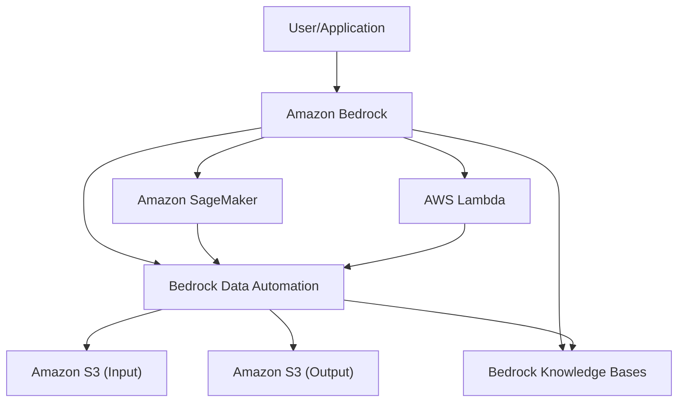
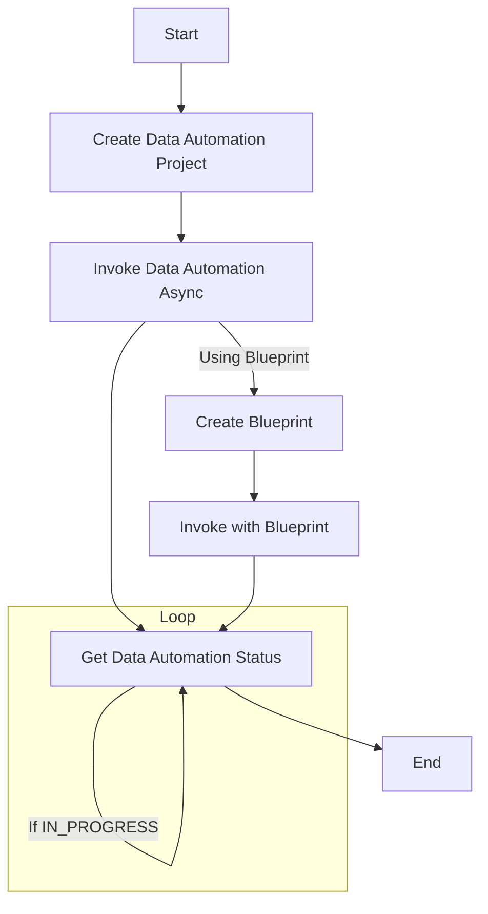
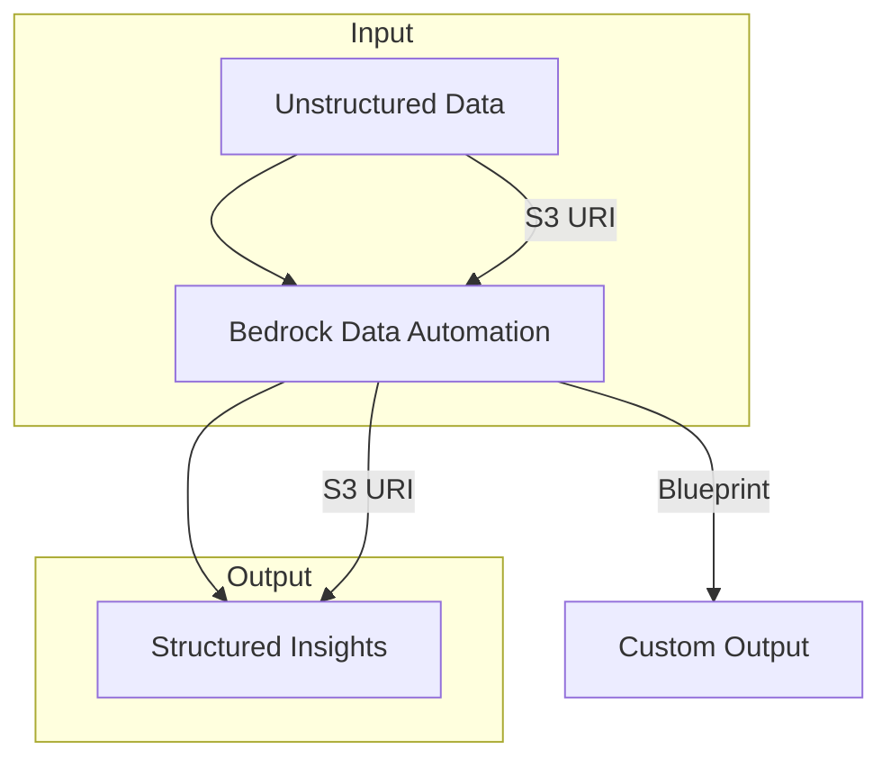
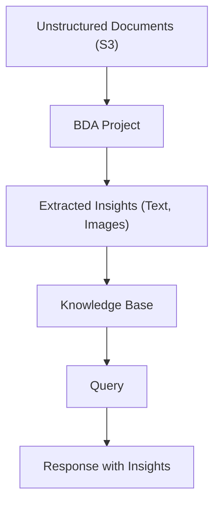

# Comprehensive Tutorial on AWS Bedrock Data Automation with Mermaid Diagrams

## Introduction

AWS Bedrock Data Automation (BDA) is a feature within Amazon Bedrock, a fully managed service designed to support the development of generative AI applications using foundation models (FMs). BDA simplifies extracting insights from unstructured multimodal content, such as documents, images, audio, and video, transforming them into structured formats ready for applications. As of May 2025, BDA offers advanced capabilities, including integration with Bedrock Knowledge Bases for Retrieval-Augmented Generation (RAG), modality enablement and routing by file type, extraction of embedded hyperlinks, and support for up to 3,000 document pages. Since its general availability in March 2025, BDA has been a reliable solution for developers.

This tutorial provides a detailed guide to using BDA via the AWS Command Line Interface (CLI) and the AWS SDK for Python (Boto3). It includes extensive examples for document processing, media analysis (covering images, audio, and video), and integration with Knowledge Bases, enhanced by Mermaid diagrams to visualize architecture, API workflows, data flows, and use cases. These diagrams make complex processes accessible, enabling developers to build intelligent applications efficiently.

## Architecture Diagram



**Explanation:** This diagram illustrates BDA’s integration within the AWS ecosystem:

- **User/Application:** Initiates workflows via Amazon Bedrock.
- **Amazon Bedrock:** Hosts BDA and Knowledge Bases.
- **Bedrock Data Automation:** Processes unstructured data from S3, feeding insights to Knowledge Bases for RAG.
- **Amazon S3:** Stores input and output data.
- **Amazon SageMaker:** Fine-tunes models for custom use cases.
- **AWS Lambda:** Handles event-driven tasks.

## Why Use AWS Bedrock Data Automation?

BDA offers compelling benefits:

- **Unified API:** Processes documents, images, audio, and video through a single interface, reducing complexity.
- **Built-in Safeguards:** Features like visual grounding and confidence scores ensure accuracy and trust, vital for enterprise use.
- **Versatile Use Cases:**
    - **Intelligent Document Processing (IDP):** Automates classification, extraction, normalization, and validation for documents.
    - **Media Analysis:** Summarizes video scenes, detects unsafe content, extracts text, and classifies content for applications like video search or advertising.
    - **Generative AI Assistants:** Enhances RAG workflows with modality-specific data.
- **Cost and Time Efficiency:** Reduces development effort and costs compared to traditional methods, with high accuracy.

## Prerequisites

Before starting, ensure the following:

- **AWS Account:**
    
    - Create an account at [AWS Account Creation](https://aws.amazon.com/account/).
    - Enable Amazon Bedrock in your account via the AWS Management Console.
- **IAM Permissions:**
    
    - Your IAM user/role needs permissions for Bedrock and S3:
        
        ```json
        {
            "Version": "2012-10-17",
            "Statement": [
                {
                    "Effect": "Allow",
                    "Action": [
                        "bedrock:*",
                        "s3:*"
                    ],
                    "Resource": "*"
                }
            ]
        }
        ```
        
- **AWS CLI:**
    
    - Install at [AWS CLI Installation](https://aws.amazon.com/cli/).
    - Configure credentials:
        
        ```bash
        aws configure
        ```
        
        Provide access key, secret key, region (us-east-1 or us-west-2), and output format.
- **Boto3:**
    
    - Install:
        
        ```bash
        pip install boto3
        ```
        
    - Configure credentials using `aws configure`.
- **Region Availability:**
    
    - BDA is available in US East (N. Virginia) - us-east-1 and US West (Oregon) - us-west-2.
- **S3 Buckets:**
    
    - Create input/output buckets in the same region as Bedrock operations.

## Tutorial: Using AWS Bedrock Data Automation

This tutorial covers creating BDA projects, invoking asynchronous processing, checking job status, and integrating with Knowledge Bases for RAG workflows. It includes CLI and Boto3 examples, with Mermaid diagrams for clarity.

### API Workflow

The BDA API workflow involves three steps:

1. **Create a Data Automation Project:** Define file processing configuration.
2. **Invoke Data Automation Async:** Start processing S3 files.
3. **Get Data Automation Status:** Monitor job status and retrieve results.

#### Workflow Diagram



**Explanation:**

- **Create Data Automation Project:** Configures project for specific data types.
- **Invoke Data Automation Async:** Initiates processing.
- **Get Data Automation Status:** Tracks progress until completion.
- **Blueprint (Optional):** Customizes output formats.

### Data Processing

BDA transforms unstructured data into structured insights, stored in S3.

#### Data Flow Diagram



**Explanation:**

- **Unstructured Data:** Documents, images, etc., in S3.
- **Bedrock Data Automation:** Processes data using AI.
- **Structured Insights:** Outputs to S3.
- **Blueprint:** Customizes output.
- **Note:** Supports 3,000 document pages, hyperlink extraction, and modality routing.

### Examples with AWS CLI and Boto3

#### Document Processing

- **Example 1: Creating a Document Processing Project (CLI)**
    
    ```bash
    aws bedrock-data-automation create-data-automation-project \
        --project-name "my-document-project" \
        --project-description "Process mortgage documents" \
        --project-stage DEVELOPMENT \
        --standard-output-configuration '{"document": {"state": "ENABLED", "extraction": {"category": {"state": "ENABLED", "types": ["TABLE", "IMAGE"]}}}}' \
        --region us-east-1
    ```
    
    **Output:**
    
    ```json
    {
        "projectArn": "arn:aws:bedrock:us-east-1:123456789012:data-automation-project/my-document-project",
        "projectStage": "DEVELOPMENT",
        "status": "CREATED"
    }
    ```
    
- **Example 2: Creating a Document Processing Project (Boto3)**
    
    ```python
    import boto3
    
    bedrock = boto3.client('bedrock-data-automation', region_name='us-east-1')
    
    response = bedrock.create_data_automation_project(
        projectName='my-document-project',
        projectDescription='Process mortgage documents',
        projectStage='DEVELOPMENT',
        standardOutputConfiguration={
            'document': {
                'state': 'ENABLED',
                'extraction': {
                    'category': {
                        'state': 'ENABLED',
                        'types': ['TABLE', 'IMAGE']
                    }
                }
            }
        }
    )
    
    project_arn = response['dataAutomationProjectArn']
    print(f"Project ARN: {project_arn}")
    ```
    

#### Media Analysis

- **Example 3: Creating an Image Processing Project (CLI)**
    
    ```bash
    aws bedrock-data-automation create-data-automation-project \
        --project-name "my-image-project" \
        --project-description "Image summarization and moderation" \
        --project-stage DEVELOPMENT \
        --standard-output-configuration '{"image": {"state": "ENABLED", "extraction": {"category": {"state": "ENABLED", "types": ["CONTENT_MODERATION", "TEXT_DETECTION"]}, "boundingBox": {"state": "ENABLED"}}, "generativeField": {"state": "ENABLED", "types": ["IMAGE_SUMMARY", "IAB"]}}}' \
        --region us-east-1
    ```
    
- **Example 4: Creating a Video Processing Project (CLI)**
    
    ```bash
    aws bedrock-data-automation create-data-automation-project \
        --project-name "my-video-project" \
        --project-description "Video summarization and transcription" \
        --project-stage DEVELOPMENT \
        --standard-output-configuration '{"video": {"state": "ENABLED", "extraction": {"category": {"state": "ENABLED", "types": ["VIDEO_SUMMARY", "TRANSCRIPT"]}, "boundingBox": {"state": "ENABLED"}}, "generativeField": {"state": "ENABLED", "types": ["VIDEO_SUMMARY", "IAB"]}}}' \
        --region us-east-1
    ```
    
- **Example 5: Creating an Audio Processing Project (CLI)**
    
    ```bash
    aws bedrock-data-automation create-data-automation-project \
        --project-name "my-audio-project" \
        --project-description "Audio summarization and transcription" \
        --project-stage DEVELOPMENT \
        --standard-output-configuration '{"audio": {"state": "ENABLED", "extraction": {"category": {"state": "ENABLED", "types": ["AUDIO_SUMMARY", "TRANSCRIPT"]}}, "generativeField": {"state": "ENABLED", "types": ["AUDIO_SUMMARY", "IAB"]}}}' \
        --region us-east-1
    ```
    

#### Invoking Processing Asynchronously

- **Example 6: Invoking Document Processing Asynchronously (CLI)**
    
    ```bash
    aws bedrock-data-automation-runtime invoke-data-automation-async \
        --data-automation-configuration '{"dataAutomationProjectArn": "arn:aws:bedrock:us-east-1:123456789012:data-automation-project/my-document-project", "stage": "DEVELOPMENT"}' \
        --input-configuration '{"s3Uri": "s3://my-input-bucket/documents/mortgage/"}' \
        --output-configuration '{"s3Uri": "s3://my-output-bucket/results/mortgage/"}' \
        --client-token "unique-token-123" \
        --region us-east-1
    ```
    
    **Output:**
    
    ```json
    {
        "invocationArn": "arn:aws:bedrock:us-east-1:123456789012:invocation/my-document-project/123456789012"
    }
    ```
    

#### Checking Job Status

- **Example 7: Checking Job Status (CLI)**
    
    ```bash
    aws bedrock-data-automation-runtime get-data-automation-status \
        --invocation-arn "arn:aws:bedrock:us-east-1:123456789012:invocation/my-document-project/123456789012" \
        --region us-east-1
    ```
    
    **Output:**
    
    ```json
    {
        "status": "SUCCESS",
        "outputConfiguration": {
            "s3Uri": "s3://my-output-bucket/results/mortgage/"
        }
    }
    ```
    

#### Creating Blueprints for Custom Output

- **Example 8: Creating a Blueprint for Custom Output (CLI)**
    
    ```bash
    aws bedrock-data-automation create-blueprint \
        --name "pay-stub-blueprint" \
        --description "Extract gross and net pay from pay stubs" \
        --definition '{"fields": [{"name": "gross_pay_this_period", "type": "string"}, {"name": "net_pay", "type": "string"}]}' \
        --region us-east-1
    ```
    
    **Output:**
    
    ```json
    {
        "blueprintArn": "arn:aws:bedrock:us-east-1:123456789012:blueprint/pay-stub-blueprint"
    }
    ```
    

#### Invoking with a Blueprint

- **Example 9: Invoking with a Blueprint (CLI)**
    
    ```bash
    aws bedrock-data-automation-runtime invoke-data-automation-async \
        --data-automation-configuration '{"dataAutomationProjectArn": "arn:aws:bedrock:us-east-1:123456789012:data-automation-project/my-document-project", "stage": "DEVELOPMENT"}' \
        --blueprints '[{"blueprintArn": "arn:aws:bedrock:us-east-1:123456789012:blueprint/pay-stub-blueprint", "stage": "DEVELOPMENT"}]' \
        --input-configuration '{"s3Uri": "s3://my-input-bucket/documents/paystubs/"}' \
        --output-configuration '{"s3Uri": "s3://my-output-bucket/results/paystubs-custom/"}' \
        --client-token "unique-token-789" \
        --region us-east-1
    ```
    

### Integrating BDA with Knowledge Bases for RAG Workflows

BDA can serve as a parser in Amazon Bedrock Knowledge Bases to extract insights from multimodal data for RAG workflows, improving AI response accuracy.

#### Example Use Case: Mortgage Document Processing with RAG

- **Step 1: Prepare Data**
    
    - Store mortgage documents (PDFs with images) in `s3://my-s3-bucket/mortgage-documents/`.
- **Step 2: Create BDA Project**
    
    ```bash
    aws bedrock-data-automation create-data-automation-project \
        --project-name "mortgage-doc-project" \
        --project-description "Process mortgage documents with images" \
        --project-stage DEVELOPMENT \
        --standard-output-configuration '{"document": {"state": "ENABLED", "extraction": {"category": {"state": "ENABLED", "types": ["TABLE", "IMAGE"]}}}}' \
        --region us-east-1
    ```
    
- **Step 3: Create Knowledge Base**
    
    ```bash
    aws bedrock-agent create-knowledge-base \
        --name "mortgage-kb" \
        --description "Knowledge base for mortgage documents" \
        --role-arn "arn:aws:iam::123456789012:role/bedrock-agent-role" \
        --knowledge-base-configuration '{
            "embeddingModelArn": "arn:aws:bedrock:us-east-1::foundation-model/amazon.titan-embed-text-v1",
            "storageConfiguration": {
                "opensearchServerlessConfiguration": {
                    "collectionArn": "arn:aws:opensearchserverless:us-east-1:123456789012:collection/my-collection"
                }
            },
            "dataSourceConfiguration": {
                "s3DataSourceConfiguration": {
                    "bucket": "my-s3-bucket",
                    "prefix": "mortgage-documents/"
                },
                "parserConfiguration": {
                    "bedrockDataAutomationConfiguration": {
                        "projectArn": "arn:aws:bedrock:us-east-1:123456789012:data-automation-project/mortgage-doc-project"
                    }
                }
            }
        }' \
        --region us-east-1
    ```
    
- **Step 4: Sync Data Source**
    
    ```bash
    aws bedrock-agent start-ingestion-job \
        --knowledge-base-id "arn:aws:bedrock:us-east-1:123456789012:knowledge-base/mortgage-kb" \
        --data-source-id "s3-datasource-id" \
        --region us-east-1
    ```
    
- **Step 5: Query the Knowledge Base**
    
    - Query the Knowledge Base to retrieve or generate responses. See [Knowledge Bases Documentation](https://docs.aws.amazon.com/bedrock/latest/userguide/knowledge-base.html).

#### Workflow Diagram for BDA with Knowledge Bases



**Explanation:**

- **Unstructured Documents:** PDFs with text/images in S3.
- **BDA Project:** Extracts text, tables, images.
- **Knowledge Base:** Stores insights for RAG.
- **Query:** Retrieves or generates responses.
- **Response:** Includes text and visual insights.

### Best Practices and Troubleshooting

- **Large Datasets:** Use multipart uploads for files >100 MB.
- **Cost Optimization:** Monitor usage, use DEVELOPMENT stage for testing.
- **Error Handling:** Check `get-data-automation-status` for error messages.
- **File Formats:**
    - Documents: PDF, DOCX, DOC, PPTX, PPT, XLSX, XLS, TXT, HTML, etc.
    - Images: JPEG, PNG.
    - Audio: FLAC, M4A, MP3, Ogg, WebM, WAV (max 4 hours, 2 GB).
    - Video: MP4, MOV (H.264, H.265, VP8, VP9 codecs).

### API Workflow Summary

| Step                  | AWS CLI Command                  | Boto3 Method                     | Description                                           |
| --------------------- | -------------------------------- | -------------------------------- | ----------------------------------------------------- |
| Create a Project      | `create-data-automation-project` | `create_data_automation_project` | Configures file type processing. Returns project ARN. |
| Invoke Analysis Async | `invoke-data-automation-async`   | `invoke_data_automation_async`   | Starts S3 file processing. Returns job ID.            |
| Retrieve Results      | `get-data-automation-status`     | `get_data_automation_status`     | Monitors status, provides output S3 location.         |
| Create Knowledge Base | `create-knowledge-base`          | `create_knowledge_base`          | Sets up Knowledge Base with BDA parser for RAG.       |