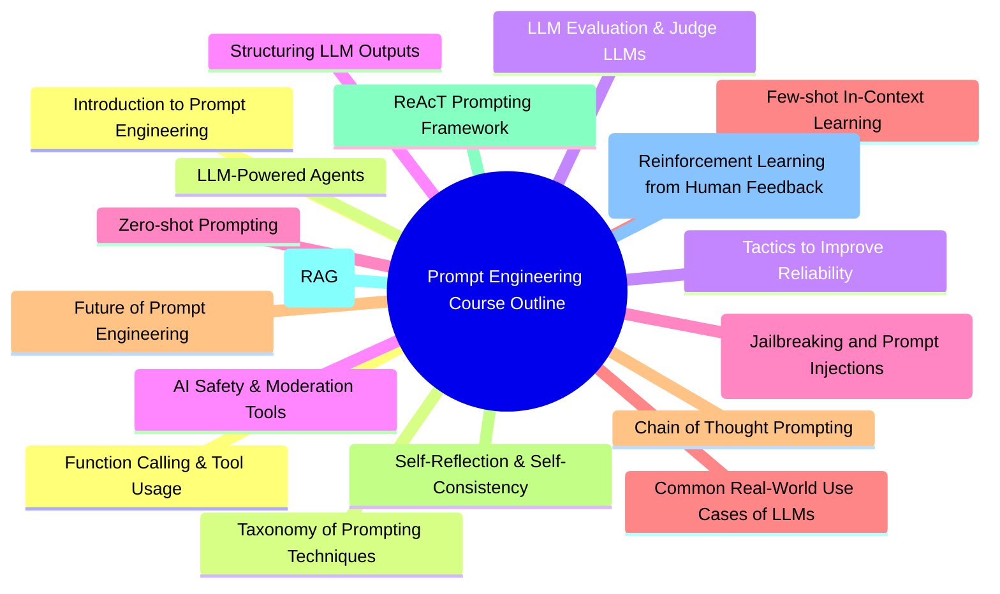

# Prompt engineering outline

1. **Introduction to Prompt Engineering**
   - Understanding Prompt Engineering and its importance
   - Overview of Language Models (LLMs)

2. **Taxonomy of Prompting Techniques**
   - Different types of prompting techniques
   - When and how to use each technique

3. **Tactics to Improve Reliability**
   - Strategies for enhancing the reliability of LLM responses
   - Case studies on reliability improvement

4. **Structuring LLM Outputs**
   - Techniques for structuring and formatting LLM outputs
   - Practical exercises on output structuring

5. **Zero-shot Prompting**
   - Understanding zero-shot prompting
   - Applications and limitations of zero-shot prompting

6. **Few-shot In-Context Learning**
   - Concept of few-shot learning
   - How to effectively use few-shot learning in LLMs

7. **Chain of Thought Prompting**
   - Introduction to Chain of Thought Prompting
   - Techniques for improving reasoning in LLMs

8. **Self-Reflection & Self-Consistency**
   - Importance of self-reflection and self-consistency in LLMs
   - Methods to enhance self-reflection and self-consistency

9. **ReAcT Prompting Framework**
   - Understanding the ReAcT framework
   - Applications of the ReAcT framework in LLMs

10. **Retrieval Augmented Generation (RAG)**
	- Introduction to Retrieval Augmented Generation
    - How to implement RAG in LLMs

11. **Fine-Tuning & RLHF (Reinforcement Learning from Human Feedback)**
    - Understanding fine-tuning and RLHF
    - Practical exercises on fine-tuning and RLHF

12. **Function Calling & Tool Usage**
    - How LLMs can use functions and tools
    - Applications and limitations of function calling and tool usage

13. **LLM-Powered Agents**
    - Understanding LLM-powered agents
    - Building and deploying LLM-powered agents

14. **LLM Evaluation & Judge LLMs**
    - Techniques for evaluating LLMs
    - How to judge the performance of LLMs

15. **AI Safety & Moderation Tools**
    - Importance of AI safety and moderation
    - Overview of AI safety and moderation tools

16. **Adversarial Prompting (Jailbreaking and Prompt Injections)**
    - Understanding adversarial prompting
    - How to detect and prevent jailbreaking and prompt injections

17. **Common Real-World Use Cases of LLMs**
    - Overview of common use cases of LLMs
    - Case studies on real-world applications of LLMs

18. **Future of Prompt Engineering**
    - Emerging trends in prompt engineering
    - How to stay updated with the latest developments in prompt engineering

