# Mastering Finite Automata: A Comprehensive, Example-Driven Tutorial for the Impatient

## 1. Introduction to Finite Automata

### 1.1 Historical context and significance in computer science

Finite Automata (FA) have played a crucial role in the development of computer science since the mid-20th century. The concept of FA was introduced by mathematicians and computer scientists such as Stephen Kleene, Warren McCulloch, and Walter Pitts as a way to model and analyze the behavior of simple computational devices. FA have since become a fundamental tool in the study of formal languages, compiler design, and artificial intelligence.

The significance of FA in computer science lies in their ability to recognize and generate regular languages, which form an important class of formal languages. Regular languages are used to describe patterns in strings and are essential in various applications, such as lexical analysis in compilers, pattern matching in text processing, and regular expressions in programming languages.

Moreover, FA serve as a foundation for more complex computational models, such as Pushdown Automata and Turing Machines. Understanding FA is crucial for students and researchers in computer science, as it provides a solid groundwork for exploring advanced topics in theoretical computer science and its applications.

### 1.2 Applications in formal language theory, compiler design, and artificial intelligence

FA have numerous applications across different areas of computer science:

1. Formal Language Theory: FA are used to define and recognize regular languages, which are the simplest class of languages in the Chomsky hierarchy. They help in understanding the properties and limitations of regular languages and serve as a starting point for studying more powerful language classes, such as context-free and context-sensitive languages.

2. Compiler Design: In the lexical analysis phase of a compiler, FA are used to recognize tokens (e.g., keywords, identifiers, and literals) in the source code. The lexical analyzer, also known as a scanner or tokenizer, uses a deterministic finite automaton (DFA) to efficiently identify and classify tokens based on regular expressions that define the token patterns.

3. Artificial Intelligence: FA are used in various aspects of artificial intelligence, such as natural language processing (NLP) and speech recognition. In NLP, FA can be used to model and recognize simple patterns in text, such as identifying word boundaries or extracting specific information from structured documents. In speech recognition, FA are used to model phonemes and their transitions, helping to identify spoken words and phrases.

4. Bioinformatics: FA are applied in bioinformatics for tasks such as DNA sequence analysis and pattern matching. They can be used to search for specific patterns or motifs in DNA or protein sequences, helping researchers understand the structure and function of biological molecules.

5. Text Processing and Pattern Matching: Regular expressions, which are closely related to FA, are widely used in text processing and pattern matching tasks. Many programming languages and text editors support regular expressions for searching, filtering, and manipulating text data.

### 1.3 Course prerequisites and learning objectives

Prerequisites for this course include a basic understanding of:
- Discrete mathematics, including sets, functions, and relations
- Fundamental concepts in computer science, such as algorithms and data structures
- Familiarity with mathematical notation and proof techniques

Learning objectives for this course are:
- Understand the formal definitions and components of Deterministic Finite Automata (DFA) and Non-deterministic Finite Automata (NFA)
- Design and analyze FA for given languages and regular expressions
- Convert between different representations of FA (DFA, NFA, and ε-NFA)
- Prove properties of regular languages using techniques such as the Pumping Lemma and closure properties
- Apply FA in real-world scenarios, such as compiler design, text processing, and bioinformatics
- Develop problem-solving skills and prepare for FA-related questions in exams at top universities like Cambridge, Oxford, and UCL

By the end of this course, learners will have a solid grasp of FA theory and its applications, enabling them to tackle complex problems and pursue further studies in theoretical computer science.

## 2. Mathematical Foundations

### 2.1 Set theory, functions, and relations

To understand Finite Automata, it is essential to have a strong foundation in set theory, functions, and relations. These mathematical concepts form the basis for defining and analyzing FA.

1. Set Theory:
   - A set is a collection of distinct objects, called elements or members.
   - Sets can be represented using the roster notation (e.g., A = {1, 2, 3}) or the set-builder notation (e.g., B = {x | x is a positive even integer}).
   - Important set operations include union (∪), intersection (∩), difference  and complement (A').
   - The power set of a set A, denoted by P(A), is the set of all subsets of A.
   - The Cartesian product of two sets A and B, denoted by A × B, is the set of all ordered pairs (a, b) where a ∈ A and b ∈ B.

2. Functions:
   - A function f from a set A to a set B, denoted by f: A → B, is a relation that assigns each element in A to exactly one element in B.
   - The set A is called the domain of the function, and the set B is called the codomain.
   - The range of a function is the set of all elements in the codomain that are mapped to by at least one element in the domain.
   - Functions can be injective (one-to-one), surjective (onto), or bijective (both injective and surjective).
   - The composition of two functions f: A → B and g: B → C, denoted by g ∘ f, is a function from A to C defined as (g ∘ f)(x) = g(f(x)).

3. Relations:
   - A relation R between two sets A and B is a subset of the Cartesian product A × B.
   - If (a, b) ∈ R, we say that a is related to b under the relation R.
   - Relations can be represented using a matrix, a directed graph, or a set of ordered pairs.
   - Properties of relations include reflexivity, symmetry, transitivity, and antisymmetry.
   - An equivalence relation is a relation that is reflexive, symmetric, and transitive. It partitions a set into disjoint equivalence classes.

Understanding these concepts is crucial for defining and working with Finite Automata, as they heavily rely on sets (e.g., states, input symbols), functions (e.g., transition functions), and relations (e.g., equivalence relations on states).

### 2.2 Alphabets, strings, and languages

In the context of Finite Automata and formal language theory, alphabets, strings, and languages are fundamental concepts that help define the input and output of automata.

1. Alphabets:
   - An alphabet, usually denoted by Σ (sigma), is a finite, non-empty set of symbols.
   - Examples of alphabets include:
     - The binary alphabet: Σ = {0, 1}
     - The English alphabet: Σ = {a, b, c, ..., z}
     - The DNA alphabet: Σ = {A, C, G, T}
   - Alphabets can contain any type of symbol, such as letters, digits, or special characters.

2. Strings:
   - A string, also called a word, is a finite sequence of symbols from an alphabet.
   - The length of a string w, denoted by |w|, is the number of symbols in the string.
   - The empty string, denoted by ε (epsilon), is the string of length zero.
   - The set of all strings over an alphabet Σ is denoted by Σ*.
   - The set of all non-empty strings over an alphabet Σ is denoted by Σ+.
   - The concatenation of two strings u and v, denoted by uv, is the string obtained by appending v to the end of u.

3. Languages:
   - A language L over an alphabet Σ is a subset of Σ*.
   - In other words, a language is a set of strings chosen from the set of all possible strings over an alphabet.
   - Examples of languages include:
     - The language of all binary strings: L = {0, 1}*
     - The language of all strings of even length: L = {w ∈ Σ* | |w| is even}
     - The language of all strings that start with 'a' and end with 'b': L = {aw | w ∈ Σ* and a, b ∈ Σ}
   - Languages can be finite or infinite.
   - The empty language, denoted by ∅, is the language that contains no strings.

Finite Automata recognize and accept languages by processing input strings symbol by symbol. The language accepted by a Finite Automaton is the set of all strings that the automaton accepts. Understanding the concepts of alphabets, strings, and languages is essential for designing and analyzing Finite Automata and their associated languages.

### 2.3 Formal grammars and the Chomsky hierarchy

Formal grammars are a set of rules that describe how to generate strings in a language. They provide a way to define the structure and syntax of languages, and they are closely related to the study of Finite Automata and other computational models. The Chomsky hierarchy, introduced by Noam Chomsky in the 1950s, categorizes formal grammars and their corresponding languages into four classes based on their generative power and complexity.

1. Formal Grammars:
   - A formal grammar G is a quadruple (V, Σ, R, S), where:
     - V is a finite set of variables (non-terminal symbols)
     - Σ is a finite set of terminal symbols (the alphabet)
     - R is a finite set of production rules of the form α → β, where α ∈ (V ∪ Σ)* V (V ∪ Σ)* and β ∈ (V ∪ Σ)*
     - S ∈ V is the start symbol
   - A string w is generated by a grammar G if it can be derived from the start symbol S by applying a sequence of production rules.
   - The language generated by a grammar G, denoted by L(G), is the set of all strings that can be generated by G.

2. The Chomsky Hierarchy:
   - Type-0 (Unrestricted) Grammars:
     - No restrictions on the production rules.
     - Generate recursively enumerable languages.
     - Recognized by Turing Machines.
   - Type-1 (Context-Sensitive) Grammars:
     - Production rules are of the form αAβ → αγβ, where A ∈ V, α, β ∈ (V ∪ Σ)*, and γ ∈ (V ∪ Σ)+.
     - Generate context-sensitive languages.
     - Recognized by Linear Bounded Automata.
   - Type-2 (Context-Free) Grammars:
     - Production rules are of the form A → γ, where A ∈ V and γ ∈ (V ∪ Σ)*.
     - Generate context-free languages.
     - Recognized by Pushdown Automata.
   - Type-3 (Regular) Grammars:
     - Production rules are of the form A → aB or A → a, where A, B ∈ V and a ∈ Σ.
     - Generate regular languages.
     - Recognized by Finite Automata.

The Chomsky hierarchy establishes a containment relationship among the four classes of languages: Recursively Enumerable ⊃ Context-Sensitive ⊃ Context-Free ⊃ Regular. This means that every regular language is context-free, every context-free language is context-sensitive, and every context-sensitive language is recursively enumerable.

In the context of Finite Automata, we focus on Type-3 (Regular) Grammars and the regular languages they generate. Regular languages are the simplest and most well-understood class of languages in the Chomsky hierarchy, and they form the basis for many applications in computer science, such as lexical analysis in compilers and pattern matching in text processing.

Understanding formal grammars and the Chomsky hierarchy provides a broader perspective on the relationship between Finite Automata and other computational models, and it helps in identifying the limitations and capabilities of Finite Automata in terms of the languages they can recognize.

## 3. Deterministic Finite Automata (DFA)

### 3.1 Formal definition and components

A Deterministic Finite Automaton (DFA) is a quintuple (Q, Σ, δ, q0, F), where:
- Q is a finite set of states
- Σ is a finite set of input symbols (the alphabet)
- δ: Q × Σ → Q is the transition function
- q0 ∈ Q is the initial state
- F ⊆ Q is the set of final (accepting) states

The transition function δ determines the next state of the automaton based on the current state and the input symbol. In a DFA, for each state and input symbol, there is exactly one next state, making the automaton deterministic.

### 3.2 State diagram representation and examples

A DFA can be represented using a state diagram, which is a directed graph where:
- Nodes represent states
- Edges labeled with input symbols represent transitions
- The initial state is denoted by an arrow pointing to it
- Final states are denoted by double circles

Example 1: A DFA that accepts binary strings ending with '01'

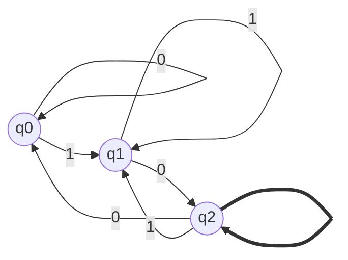

Example 2: A DFA that accepts strings with an even number of '1's

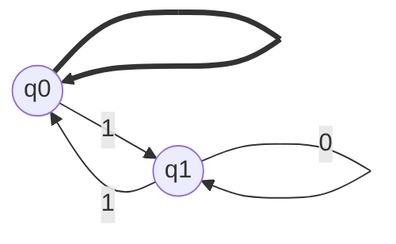

### 3.3 Language acceptance by DFA

#### 3.3.1 Formal definition of acceptance

A string w is accepted by a DFA if, starting from the initial state and following the transitions corresponding to the symbols in w, the automaton reaches a final state after processing the entire string.

#### 3.3.2 Trace and extended transition function

The trace of a string w = a1a2...an on a DFA A is the sequence of states r0, r1, ..., rn visited by A while processing w.

The extended transition function δ^* : Q × Σ* → Q is a generalization of the transition function δ that takes a state and a string as input and returns the state reached by the DFA after processing the string.

#### 3.3.3 Examples and exercises

Example 3: Determine if the string "1011" is accepted by the DFA from Example 1.

Trace: q0 -1-> q1 -0-> q2 -1-> q1 -1-> q1
The string is not accepted, as the final state q1 is not an accepting state.

Exercise 1: Design a DFA that accepts strings containing the substring "110".

### 3.4 Designing DFAs for given languages

#### 3.4.1 Systematic approach to DFA construction

1. Identify the states needed to represent the relevant information about the input processed so far.
2. Determine the initial state and the accepting states based on the language description.
3. Define the transition function by considering the effect of each input symbol on the current state.
4. Verify that the designed DFA accepts the desired language.

#### 3.4.2 Examples and exercises

Example 4: Design a DFA that accepts strings containing an odd number of '0's and an even number of '1's.

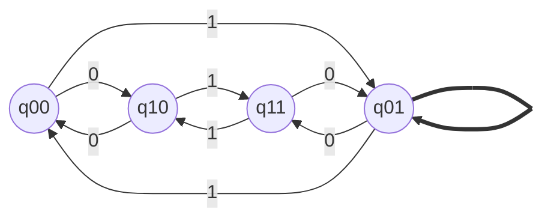

Exercise 2: Design a DFA that accepts strings containing the substring "01" or "10".

## 4. Non-deterministic Finite Automata (NFA)

### 4.1 Formal definition and components

A Non-deterministic Finite Automaton (NFA) is a quintuple (Q, Σ, δ, q0, F), where:
- Q is a finite set of states
- Σ is a finite set of input symbols (the alphabet)
- δ: Q × (Σ ∪ {ε}) → P(Q) is the transition function, where P(Q) is the power set of Q
- q0 ∈ Q is the initial state
- F ⊆ Q is the set of final (accepting) states

The transition function δ in an NFA maps a state and an input symbol (or the empty string ε) to a set of states, allowing multiple possible next states for a given state and input symbol.

### 4.2 State diagram representation and examples

NFA state diagrams are similar to DFA state diagrams, with the addition of ε-transitions and multiple edges between states for the same input symbol.

Example 5: An NFA that accepts strings ending with "ab"

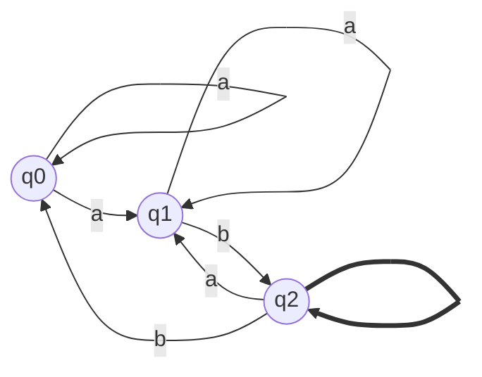

### 4.3 Language acceptance by NFA

#### 4.3.1 Formal definition of acceptance

A string w is accepted by an NFA if there exists a path from the initial state to a final state, following the transitions corresponding to the symbols in w and possibly ε-transitions.

#### 4.3.2 Trace and extended transition function

The trace of a string w on an NFA is the set of all possible sequences of states visited while processing w, considering ε-transitions.

The extended transition function δ^* : Q × Σ* → P(Q) returns the set of states reachable from a given state after processing a string, considering ε-transitions.

#### 4.3.3 Examples and exercises

Example 6: Determine if the string "aab" is accepted by the NFA from Example 5.

Trace: {q0} -a-> {q0, q1} -a-> {q0, q1} -b-> {q0, q2}
The string is accepted, as the final state q2 is reached.

Exercise 3: Design an NFA that accepts strings containing the substring "101" or "11".

### 4.4 Epsilon transitions (ε-NFA)

#### 4.4.1 Definition and purpose

ε-transitions allow an NFA to change states without consuming an input symbol. They provide a way to model optional or conditional transitions and can simplify the design of NFAs for certain languages.

#### 4.4.2 Examples and exercises

Example 7: An ε-NFA that accepts strings containing the substring "aa" or "bb"

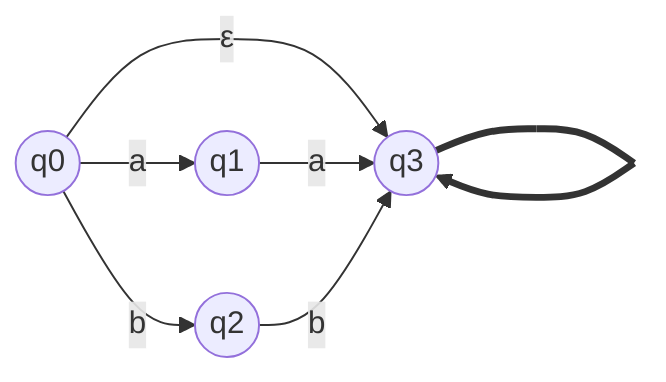

Exercise 4: Design an ε-NFA that accepts strings ending with "aba" or "bab".

## 5. Equivalence and Conversion Algorithms

### 5.1 Equivalence between DFA and NFA

#### 5.1.1 Proof of equivalence

To prove that DFAs and NFAs are equivalent in terms of the languages they can recognize, we need to show that:
1. For every DFA, there exists an equivalent NFA that accepts the same language.
2. For every NFA, there exists an equivalent DFA that accepts the same language.

The first statement is trivial, as every DFA is already an NFA by definition (with a transition function that returns singleton sets).

The second statement can be proved using the subset construction algorithm, which converts an NFA to an equivalent DFA.

#### 5.1.2 Examples demonstrating equivalence

Example 8: Convert the NFA from Example 5 to an equivalent DFA.

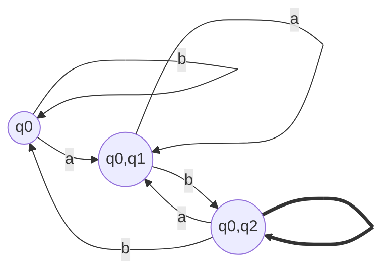

The resulting DFA accepts the same language as the original NFA.

### 5.2 Converting NFA to DFA

#### 5.2.1 Subset construction algorithm

The subset construction algorithm converts an NFA to an equivalent DFA by creating DFA states that correspond to sets of NFA states. The algorithm works as follows:

1. Create a new DFA state corresponding to the ε-closure of the NFA's initial state.
2. For each new DFA state and input symbol, compute the set of NFA states reachable from the current set of NFA states via the input symbol and ε-transitions. Create a new DFA state for this set if it doesn't already exist.
3. Mark a DFA state as accepting if it contains any of the NFA's accepting states.
4. Repeat steps 2-3 until no new DFA states are created.

#### 5.2.2 Step-by-step conversion process with examples

Example 9: Convert the NFA from Example 7 to an equivalent DFA using the subset construction algorithm.

Step 1: Create the initial DFA state {q0, q3} (ε-closure of q0).
Step 2: Process input symbols for {q0, q3}:
- a: {q1, q3}
- b: {q2, q3}

Step 3: Process input symbols for {q1, q3}:
- a: {q3}
- b: ∅

Step 4: Process input symbols for {q2, q3}:
- a: ∅
- b: {q3}

Step 5: Process input symbols for {q3}:
- a: ∅
- b: ∅

The resulting DFA:

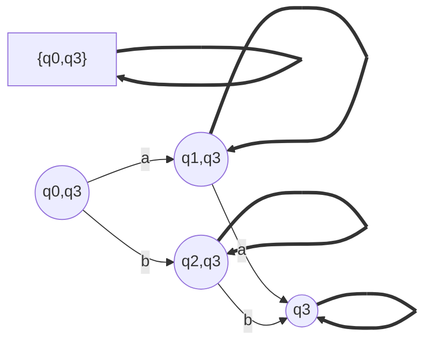

#### 5.2.3 Complexity analysis

The subset construction algorithm can lead to an exponential increase in the number of states, as the DFA may have up to 2^n states, where n is the number of states in the NFA. However, in practice, the number of DFA states is often much smaller than this upper bound.

### 5.3 Converting ε-NFA to NFA

#### 5.3.1 ε-closure and its computation

The ε-closure of a state q in an ε-NFA is the set of all states reachable from q via ε-transitions. It can be computed using a depth-first search or breadth-first search algorithm starting from q and following only ε-transitions.

#### 5.3.2 Step-by-step conversion process with examples

To convert an ε-NFA to an equivalent NFA without ε-transitions:

1. For each state q and input symbol a, compute the set of states reachable from q via a, including states reachable via ε-transitions before and after the a-transition.
2. Replace ε-transitions with direct transitions between states based on the computed sets.
3. Remove ε-transitions from the NFA.

Example 10: Convert the ε-NFA from Example 7 to an equivalent NFA without ε-transitions.

Step 1: Compute ε-closures for each state:
- ε-closure(q0) = {q0, q3}
- ε-closure(q1) = {q1}
- ε-closure(q2) = {q2}
- ε-closure(q3) = {q3}

Step 2: Compute the new transition function:
- δ(q0, a) = {q1, q3}
- δ(q0, b) = {q2, q3}
- δ(q1, a) = {q3}
- δ(q2, b) = {q3}

Step 3: Remove ε-transitions:

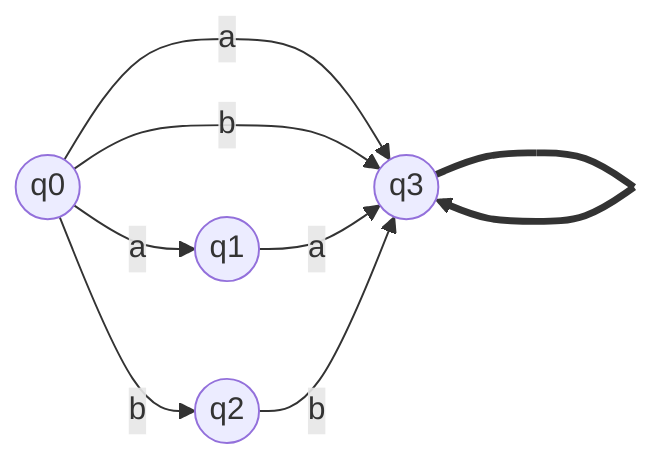

#### 5.3.3 Complexity analysis

The conversion from an ε-NFA to an NFA has a time complexity of O(n^2), where n is the number of states in the ε-NFA. This is because computing the ε-closure for each state takes O(n) time, and there are O(n) states to process.

## 6. Regular Expressions and Finite Automata

### 6.1 Formal definition of regular expressions

Regular expressions are a concise way to represent regular languages. They are defined inductively as follows:

1. ∅ (empty set) and ε (empty string) are regular expressions.
2. For each a ∈ Σ, a is a regular expression.
3. If r and s are regular expressions, then so are:
   - (r + s) (union)
   - (rs) (concatenation)
   - (r*) (Kleene star)

The language described by a regular expression r is denoted by L(r).

### 6.2 Constructing Finite Automata from regular expressions

#### 6.2.1 Thompson's construction algorithm

Thompson's construction is an algorithm that converts a regular expression to an equivalent ε-NFA. The algorithm works by recursively building ε-NFAs for subexpressions and combining them based on the regular expression operators.

#### 6.2.2 Step-by-step construction process with examples

Example 11: Construct an ε-NFA for the regular expression (a+b)*abb using Thompson's construction.

Step 1: Construct ε-NFAs for the base cases:
- a: q0 -a-> q1
- b: q0 -b-> q1

Step 2: Construct ε-NFAs for the subexpressions:
- (a+b): q0 -ε-> (a-NFA) -ε-> q1, q0 -ε-> (b-NFA) -ε-> q1
- (a+b)*: q0 -ε-> ((a+b)-NFA) -ε-> q1, q0 -ε-> q1, q1 -ε-> q0
- abb: (a-NFA) -ε-> (b-NFA) -ε-> (b-NFA)

Step 3: Combine the subexpressions:
- (a+b)*abb: ((a+b)*-NFA) -ε-> (abb-NFA)

The resulting ε-NFA:

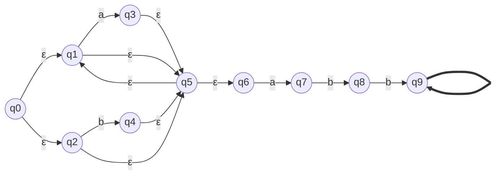

#### 6.2.3 Complexity analysis

Thompson's construction produces an ε-NFA with O(n) states and O(n) transitions, where n is the length of the regular expression. The time complexity of the algorithm is O(n).

### 6.3 Converting Finite Automata to regular expressions

#### 6.3.1 State elimination method

The state elimination method converts an NFA to an equivalent regular expression by repeatedly eliminating states until only the initial and final states remain. The transitions between the remaining states are labeled with regular expressions that describe the languages accepted by the eliminated paths.

#### 6.3.2 Step-by-step conversion process with examples

Example 12: Convert the NFA from Example 5 to a regular expression using the state elimination method.

Step 1: Eliminate state q1:
- q0 -a-> q1 becomes q0 -a-> q2
- q1 -b-> q2 becomes q0 -ab-> q2
- q1 -a-> q1 becomes q0 -aa*-> q0

Step 2: Eliminate state q2:
- q0 -ab-> q2 becomes q0 -ab-> q0
- q2 -a-> q1 becomes q0 -aba*-> q0
- q2 -b-> q0 becomes q0 -abb-> q0

The resulting regular expression: (a + ab + aa*a + aa*ab + aba*a + aba*ab + abb)*

#### 6.3.3 Complexity analysis

The state elimination method has a worst-case time complexity of O(n^3), where n is the number of states in the NFA. This is because eliminating each state may introduce O(n^2) new transitions, and there are O(n) states to eliminate.

## 7. Properties of Regular Languages

### 7.1 The Pumping Lemma for Regular Languages

#### 7.1.1 Statement and proof of the lemma

The Pumping Lemma for Regular Languages states that for every regular language L, there exists a constant p (the pumping length) such that for every string s ∈ L with |s| ≥ p, s can be divided into three parts s = xyz, satisfying the following conditions:
1. |y| > 0
2. |xy| ≤ p
3. For all i ≥ 0, xy^i^z ∈ L

The lemma can be proved using the pigeonhole principle and the fact that every DFA has a finite number of states.

#### 7.1.2 Examples of its application in proving languages to be non-regular

Example 13: Prove that the language L = {a^n^b^n^ | n ≥ 0} is not regular using the Pumping Lemma.

Proof by contradiction:
1. Assume L is regular. Then, there exists a pumping length p for L.
2. Choose s = a^p^b^p^. Clearly, s ∈ L and |s| ≥ p.
3. By the Pumping Lemma, s can be divided into three parts s = xyz, satisfying the conditions.
4. Consider the cases for y:
   - If y consists of only a's, then xy^2^z will have more a's than b's, and thus xy^2^z ∉ L.
   - If y consists of only b's, then xy^0^z will have more a's than b's, and thus xy^0^z ∉ L.
   - If y consists of both a's and b's, then y cannot be pumped while maintaining an equal number of a's and b's.
5. In all cases, we find a contradiction with the Pumping Lemma. Therefore, our initial assumption that L is regular must be false, and L is non-regular.

### 7.2 Closure properties of Regular Languages

#### 7.2.1 Proofs of closure under union, intersection, concatenation, and star operation

Regular languages are closed under various operations, meaning that applying these operations to regular languages results in regular languages. The closure properties can be proved using the equivalence between regular languages, DFAs, and NFAs.

1. Union: Let L1 and L2 be regular languages. To prove that L1 ∪ L2 is regular, construct an NFA that accepts L1 ∪ L2 by creating a new initial state with ε-transitions to the initial states of the NFAs for L1 and L2.

2. Intersection: Let L1 and L2 be regular languages. To prove that L1 ∩ L2 is regular, use the product construction to create a DFA that accepts L1 ∩ L2 by simulating the DFAs for L1 and L2 simultaneously.

3. Concatenation: Let L1 and L2 be regular languages. To prove that L1L2 is regular, construct an NFA that accepts L1L2 by adding ε-transitions from the final states of the NFA for L1 to the initial state of the NFA for L2.

4. Star operation: Let L be a regular language. To prove that L* is regular, construct an NFA that accepts L* by adding a new initial and final state with ε-transitions to the initial and from the final states of the NFA for L, and ε-transitions from the final states to the initial state.

#### 7.2.2 Examples demonstrating these closure properties

Example 14: Let L1 = {a^n^b^m^ | n, m ≥ 0} and L2 = {b^m^c^k^ | m, k ≥ 0}. Demonstrate that L1 ∪ L2, L1 ∩ L2, L1L2, and L1* are regular.

1. L1 ∪ L2: Construct an NFA with a new initial state and ε-transitions to the initial states of the NFAs for L1 and L2.

2. L1 ∩ L2: The only string common to both L1 and L2 is b^m^ for m ≥ 0. Construct a DFA that accepts b*.

3. L1L2: Construct an NFA by adding ε-transitions from the final states of the NFA for L1 to the initial state of the NFA for L2.

4. L1*: Construct an NFA with a new initial and final state, ε-transitions to the initial and from the final states of the NFA for L1, and ε-transitions from the final states to the initial state.

### 7.3 Decision algorithms for Regular Languages

#### 7.3.1 Membership, emptiness, and equivalence problems

1. Membership problem: Given a string w and a regular language L, determine whether w ∈ L.
   - Solution: Construct a DFA for L and simulate the DFA on the input string w. If the DFA ends in an accepting state, then w ∈ L; otherwise, w ∉ L.

2. Emptiness problem: Given a regular language L, determine whether L = ∅.
   - Solution: Construct a DFA for L and perform a reachability analysis to check if any accepting state is reachable from the initial state. If no accepting state is reachable, then L = ∅; otherwise, L ≠ ∅.

3. Equivalence problem: Given two regular languages L1 and L2, determine whether L1 = L2.
   - Solution: Construct DFAs for L1 and L2, and then use the product construction to create a DFA that accepts the symmetric difference of L1 and L2 (i.e., (L1 - L2) ∪ (L2 - L1)). If the resulting DFA accepts no strings (i.e., the emptiness problem for the symmetric difference is true), then L1 = L2; otherwise, L1 ≠ L2.

#### 7.3.2 Algorithms and their complexity analysis

1. Membership problem:
   - Simulating a DFA on an input string takes O(|w|) time, where |w| is the length of the input string.

2. Emptiness problem:
   - Performing a reachability analysis on a DFA using depth-first search or breadth-first search takes O(|Q| + |Σ|) time, where |Q| is the number of states and |Σ| is the size of the alphabet.

3. Equivalence problem:
   - Constructing the symmetric difference DFA takes O(|Q1| × |Q2|) time, where |Q1| and |Q2| are the number of states in the DFAs for L1 and L2, respectively.
   - Checking emptiness of the symmetric difference DFA takes O(|Q1| × |Q2| + |Σ|) time.

## 8. Minimization of Finite Automata

### 8.1 Myhill-Nerode theorem and its implications

The Myhill-Nerode theorem establishes a necessary and sufficient condition for a language to be regular based on the notion of distinguishability of strings.

Two strings x and y are said to be distinguishable with respect to a language L if there exists a string z such that xz ∈ L and yz ∉ L, or vice versa.

The Myhill-Nerode theorem states that a language L is regular if and only if the number of equivalence classes of the indistinguishability relation with respect to L is finite.

The theorem has important implications for the minimization of DFAs:
1. Every regular language has a unique (up to isomorphism) minimal DFA that accepts it.
2. Two states in a DFA are distinguishable if and only if they are not equivalent under the Myhill-Nerode indistinguishability relation.
3. The minimal DFA for a regular language can be obtained by merging indistinguishable states.

### 8.2 Minimization of DFA

#### 8.2.1 Distinguishable and indistinguishable states

Two states p and q in a DFA are distinguishable if there exists a string w such that exactly one of δ^*(p, w) and δ^*(q, w) is an accepting state.

Conversely, two states p and q are indistinguishable if, for every string w, either both δ^*(p, w) and δ^*(q, w) are accepting states, or both are non-accepting states.

#### 8.2.2 Minimization algorithm (Hopcroft's algorithm)

Hopcroft's algorithm is an efficient method for minimizing a DFA. The algorithm maintains a partition of the states and refines the partition by splitting groups of states based on their distinguishability.

1. Initialize the partition with two groups: accepting states and non-accepting states.
2. For each group G in the partition and each input symbol a, split G into two subgroups: states that transition to a state in the same group on input a, and states that transition to a state in a different group on input a.
3. Repeat step 2 until no further refinement is possible.
4. Merge the states in each group of the final partition to obtain the minimal DFA.

#### 8.2.3 Step-by-step minimization process with examples

Example 15: Minimize the following DFA using Hopcroft's algorithm.

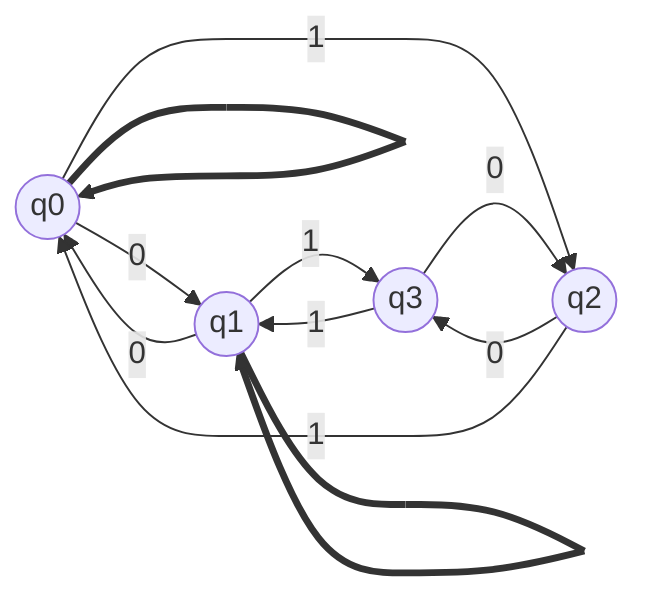

Step 1: Initialize the partition: {q0, q1}, {q2, q3}

Step 2: Refine the partition:
- Split {q0, q1} based on transitions on 0: {q0}, {q1}
- Split {q2, q3} based on transitions on 0: {q2}, {q3}

Step 3: No further refinement possible. The final partition is: {q0}, {q1}, {q2}, {q3}

The minimal DFA is isomorphic to the original DFA.

#### 8.2.4 Complexity analysis

Hopcroft's algorithm has a time complexity of O(|Q| log |Q|), where |Q| is the number of states in the DFA. This makes it one of the most efficient DFA minimization algorithms.

## 9. Advanced Topics in Finite Automata

### 9.1 Two-way Finite Automata

#### 9.1.1 Definition and state diagram representation

A two-way finite automaton (2DFA) is a variant of the deterministic finite automaton that can move its head both left and right on the input tape. In addition to the standard components of a DFA, a 2DFA has a special "end-marker" symbol (usually denoted by $) that marks the left and right ends of the input string.

The transition function of a 2DFA is defined as δ: Q × (Σ ∪ {$}) → Q × {L, R}, where L and R denote the left and right head movements, respectively.

The state diagram of a 2DFA is similar to that of a DFA, with the addition of arrows labeled with head movements (L or R) alongside the input symbols.

#### 9.1.2 Examples and applications

Example 16: Design a 2DFA that accepts the language L = {w ∈ {a, b}* | w is a palindrome}.

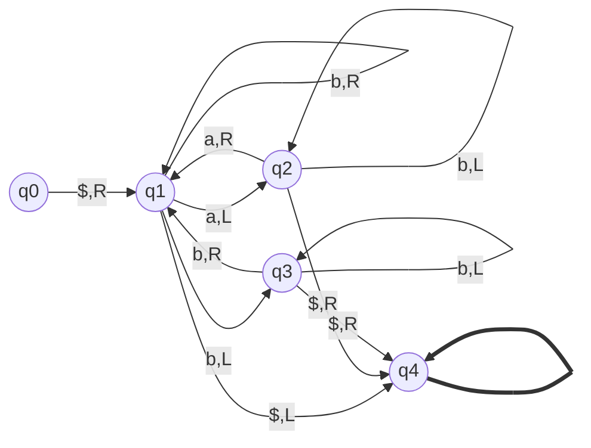

2DFAs have applications in pattern matching, as they can recognize more complex patterns than traditional DFAs. For example, 2DFAs can be used to recognize palindromes, which cannot be done using a standard DFA.

#### 9.1.3 Equivalence to one-way Finite Automata

Although 2DFAs can recognize some languages that cannot be recognized by standard DFAs, they are not more powerful than DFAs in terms of the class of languages they can recognize. For every 2DFA, there exists an equivalent standard DFA that recognizes the same language.

The proof of equivalence involves constructing a DFA that simulates the behavior of the 2DFA by keeping track of the current state, head position, and the contents of the tape to the left of the head in its state.

### 9.2 Finite Automata with output (Mealy and Moore machines)

#### 9.2.1 Definitions and differences

Mealy and Moore machines are finite state machines that produce output. They differ in the way they associate output with transitions or states.

1. Mealy machine: A Mealy machine is a 6-tuple (Q, Σ, Δ, δ, λ, q0), where:
   - Q, Σ, δ, and q0 are the same as in a DFA
   - Δ is the output alphabet
   - λ: Q × Σ → Δ is the output function that maps a state and an input symbol to an output symbol

2. Moore machine: A Moore machine is a 6-tuple (Q, Σ, Δ, δ, λ, q0), where:
   - Q, Σ, δ, and q0 are the same as in a DFA
   - Δ is the output alphabet
   - λ: Q → Δ is the output function that maps a state to an output symbol

The main difference between Mealy and Moore machines is that in a Mealy machine, the output depends on the current state and the input symbol, while in a Moore machine, the output depends only on the current state.

#### 9.2.2 Examples and applications

Example 17: Design a Mealy machine that takes a binary number as input and outputs the parity (0 for even, 1 for odd) of the number.

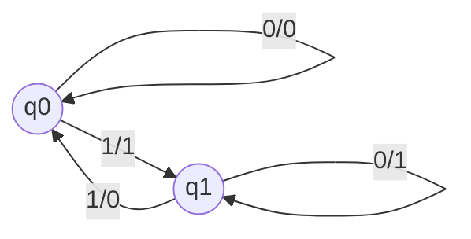

Example 18: Design a Moore machine that takes a binary number as input and outputs 1 if the number of 1s is divisible by 3, and 0 otherwise.

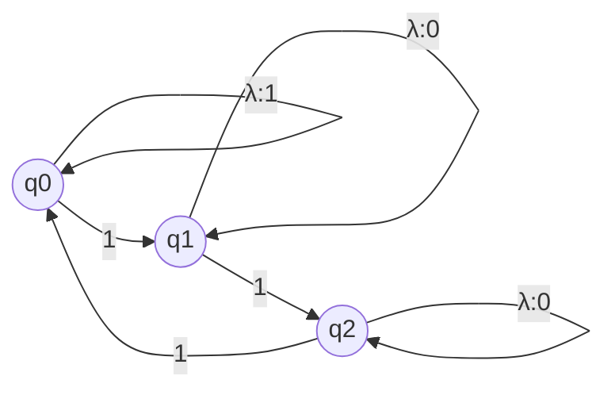

Mealy and Moore machines have applications in digital design, as they can model sequential circuits that produce output based on input and state. They are also used in control systems and communication protocols.

### 9.3 Finite Automata and Pushdown Automata

#### 9.3.1 Comparison of their computational power

Pushdown automata (PDA) are a more powerful computational model than finite automata. While finite automata can only recognize regular languages, pushdown automata can recognize context-free languages, which include regular languages as a proper subset.

The key difference between finite automata and pushdown automata is that PDAs have an additional memory component called a stack, which allows them to store and manipulate data in a last-in-first-out (LIFO) manner. This extra memory enables PDAs to recognize languages with nested structures, such as palindromes and properly balanced parentheses, which cannot be recognized by finite automata.

#### 9.3.2 Examples of languages accepted by Pushdown Automata but not by Finite Automata

Example 19: The language of properly balanced parentheses L = {(^n^)^n^ | n ≥ 0} can be recognized by a PDA but not by a finite automaton.

A PDA can recognize this language by pushing '(' onto the stack when it encounters an opening parenthesis and popping '(' from the stack when it encounters a closing parenthesis. The PDA accepts the string if the stack is empty at the end of the input.

However, a finite automaton cannot recognize this language because it would need to keep track of the number of opening parentheses encountered, which can be arbitrarily large and cannot be stored in the finite memory of a finite automaton.

Other examples of languages that can be recognized by PDAs but not by finite automata include:
- The language of palindromes: L = {w ∈ Σ* | w = w^R^}
- The language of strings with an equal number of 'a's and 'b's: L = {w ∈ {a, b}* | |w|_a = |w|_b}

### 9.4 Finite Automata and Turing Machines

#### 9.4.1 Relationship between Finite Automata and Turing Machines

Finite automata and Turing machines are both computational models, but they differ in their computational power. Turing machines are the most powerful computational model and can recognize all recursively enumerable languages, which include regular languages as a proper subset.

Every finite automaton can be simulated by a Turing machine. A Turing machine can simulate a finite automaton by using its tape to store the input string and its state to keep track of the current state of the finite automaton. The Turing machine can then transition between states based on the input symbol and the transition function of the finite automaton.

However, the converse is not true. There are languages that can be recognized by Turing machines but not by finite automata, such as the language of palindromes and the language of strings with an equal number of 'a's and 'b's.

#### 9.4.2 Examples of problems solvable by Turing Machines but not by Finite Automata

Example 20: The language of strings that are multiples of 3 when interpreted as binary numbers, L = {w ∈ {0, 1}* | (w)_2 ≡ 0 (mod 3)}, can be recognized by a Turing machine but not by a finite automaton.

A Turing machine can recognize this language by reading the input string from left to right and keeping track of the remainder when the binary number represented by the string is divided by 3. The Turing machine can update the remainder as it reads each bit, and accept the string if the final remainder is 0.

A finite automaton, on the other hand, cannot recognize this language because the binary number represented by the string can be arbitrarily large, and a finite automaton has no memory to store and update the remainder.

Other examples of problems solvable by Turing machines but not by finite automata include:
- Deciding whether a given string is a prime number when interpreted as a binary number
- Recognizing the language of strings that represent valid C++ programs
- Solving the halting problem for a given Turing machine and input

### 9.5 Finite Automata in Formal Verification

#### 9.5.1 Model checking using Finite Automata

Model checking is a formal verification technique that checks whether a given system satisfies a specified property. Finite automata can be used in model checking to represent both the system and the property to be verified.

The system can be modeled as a finite automaton, where the states represent the possible configurations of the system, and the transitions represent the actions that can change the system's configuration. The property to be verified can also be represented as a finite automaton, often in the form of a Büchi automaton, which accepts infinite strings that satisfy the property.

The model checking process involves taking the product of the system automaton and the property automaton, and checking whether the language of the resulting automaton is empty. If the language is empty, it means that the system satisfies the property; otherwise, the system violates the property, and a counterexample can be generated from the accepting path in the product automaton.

#### 9.5.2 Examples of verifying system properties using Finite Automata

Example 21: Verifying a simple traffic light system using finite automata.

Consider a traffic light system with three states: Green, Yellow, and Red. The system should satisfy the following properties:
1. The light should never change directly from Green to Red or from Red to Green.
2. The light should stay Yellow for at least 2 seconds before changing to Red.

The system can be modeled as a finite automaton:

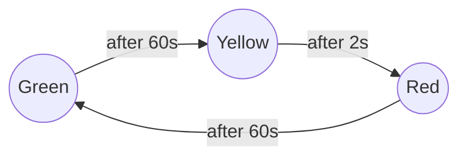

The properties can be represented as Büchi automata:

Property 1:
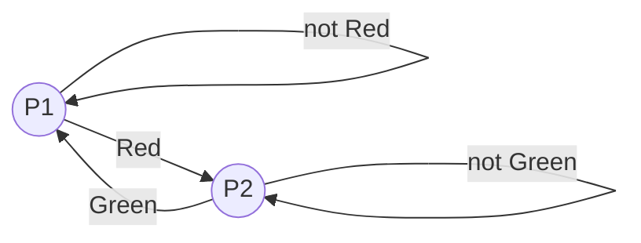

Property 2:
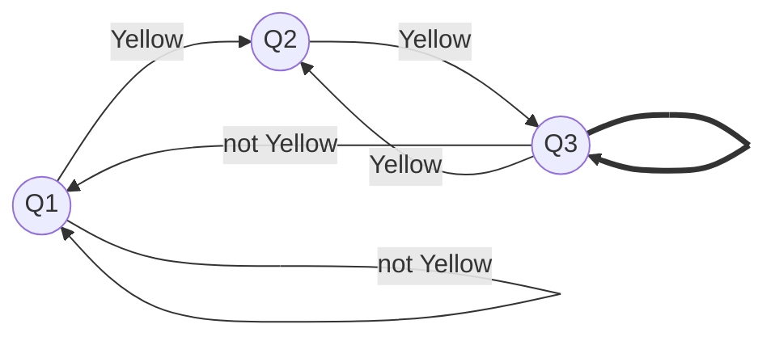

By taking the product of the system automaton and each property automaton, and checking for emptiness, we can verify that the traffic light system satisfies both properties.

Finite automata can be used to verify various system properties, such as:
- Safety properties: ensuring that the system never enters an unsafe state
- Liveness properties: ensuring that the system eventually reaches a desired state
- Fairness properties: ensuring that certain actions are executed infinitely often

Model checking using finite automata has applications in hardware verification, software verification, and protocol verification.

## 10. Practice Problems and Exam Preparation

### 10.1 Diverse set of problems sourced from past Cambridge, Oxford, and UCL exams

This section provides a collection of problems from past exams at top universities, covering various aspects of Finite Automata theory. These problems will help you assess your understanding of the concepts and prepare for exams.

Problem 1 (Cambridge): Design a DFA that accepts the language L = {w ∈ {a, b}* | w contains an even number of a's and an odd number of b's}.

Problem 2 (Oxford): Prove that the language L = {a^n^b^m^c^n^d^m^ | n, m ≥ 0} is not regular using the Pumping Lemma.

Problem 3 (UCL): Convert the following NFA to an equivalent DFA using the subset construction algorithm.

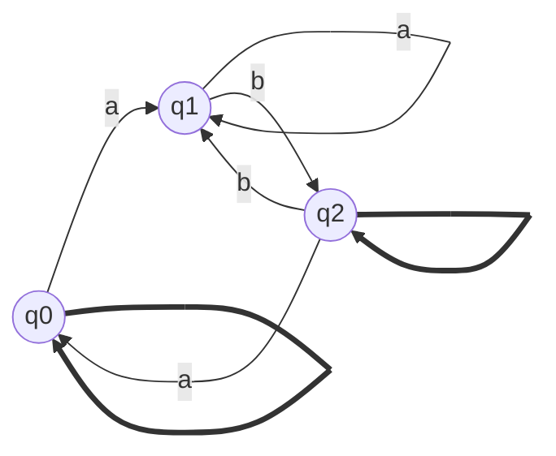

### 10.2 Additional challenging problems from research papers and international competitions

This section includes advanced problems from research papers and international competitions to challenge your problem-solving skills and deepen your understanding of Finite Automata theory.

Problem 4 (Research Paper): Design a Mealy machine that takes a binary number as input and outputs the number of consecutive 1's in the input.

Problem 5 (International Competition): Prove that the language L = {w ∈ {a, b, c}* | w has an equal number of occurrences of the substrings "ab" and "ba"} is not regular.

### 10.3 Proof Techniques

#### 10.3.1 Common strategies for proving statements related to Finite Automata

This section discusses common strategies for proving statements related to Finite Automata, such as:
- Constructive proofs: Designing a DFA, NFA, or regular expression that recognizes a given language
- Proofs by contradiction: Assuming the opposite of the statement and deriving a contradiction
- Proofs by induction: Proving a statement for a base case and then showing that if it holds for a certain case, it also holds for the next case

#### 10.3.2 Examples of proofs by contradiction, induction, and construction

Example 22 (Contradiction): Prove that the language L = {a^n^b^n^ | n ≥ 0} is not regular.

Proof: Assume L is regular. Then, by the Pumping Lemma, there exists a pumping length p. Choose s = a^p^b^p^. By the Pumping Lemma, s can be divided into three parts, s = xyz, satisfying the conditions. However, pumping y will result in a string with an unequal number of a's and b's, contradicting the definition of L. Therefore, L is not regular.

Example 23 (Induction): Prove that for every non-negative integer n, the language L_n = {a^i^ | 0 ≤ i ≤ n} is regular.

Proof: Base case (n = 0): L_0 = {ε}, which is regular.
Inductive step: Assume L_k is regular for some k ≥ 0. Then, L_{k+1} = L_k ∪ {a^{k+1}^}. Since L_k is regular (by the inductive hypothesis) and {a^{k+1}^} is regular, L_{k+1} is also regular (by the closure property of regular languages under union). Therefore, by induction, L_n is regular for all n ≥ 0.

Example 24 (Construction): Design a DFA that accepts the language L = {w ∈ {a, b}* | w ends with "aba"}.

Solution:
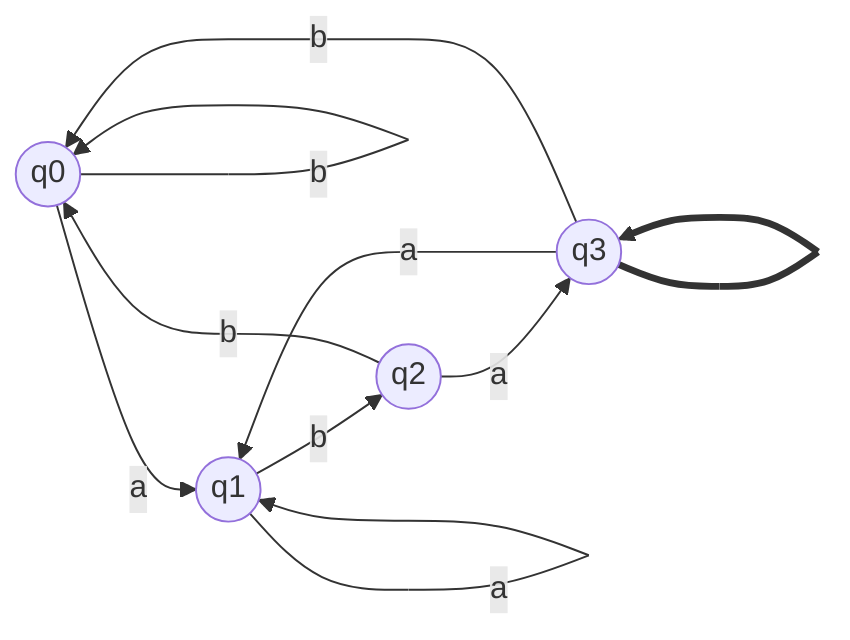

### 10.4 Strategies for tackling Finite Automata questions in exams

This section provides tips and strategies for approaching Finite Automata questions in exams, such as:
- Read the question carefully and identify the key components (e.g., language, automaton type, proof technique)
- Break down complex problems into smaller, manageable parts
- Start with simple examples and gradually move to more complex ones
- Use the appropriate notation and terminology
- Double-check your work for consistency and completeness

### 10.5 Common mistakes to avoid and tips for time management during exams

This section discusses common mistakes students make when solving Finite Automata problems in exams and provides tips for effective time management:

Common mistakes:
- Misinterpreting the language definition or automaton type
- Forgetting to handle edge cases or empty strings
- Incorrectly applying proof techniques or closure properties
- Rushing through the problem without checking for errors

Time management tips:
- Skim through the entire exam and prioritize problems based on their difficulty and point value
- Allocate time for each problem based on its complexity and point value
- If stuck on a problem, move on to the next one and come back later if time permits
- Reserve some time at the end to review your answers and make necessary corrections

By practicing a diverse set of problems, mastering proof techniques, and following exam strategies, you will be well-prepared to tackle Finite Automata questions in exams at top universities like Cambridge, Oxford, and UCL.

Certainly! Let's go through an example for each of the three proof techniques: constructive proofs, proofs by contradiction, and proofs by induction.

## Examples of proof

1. **Constructive Proof:**
   
Example: Prove that the language L = {w ∈ {a, b}* | w contains an even number of a's and an odd number of b's} is regular.

Proof: To prove that L is regular, we will construct a DFA that recognizes L.

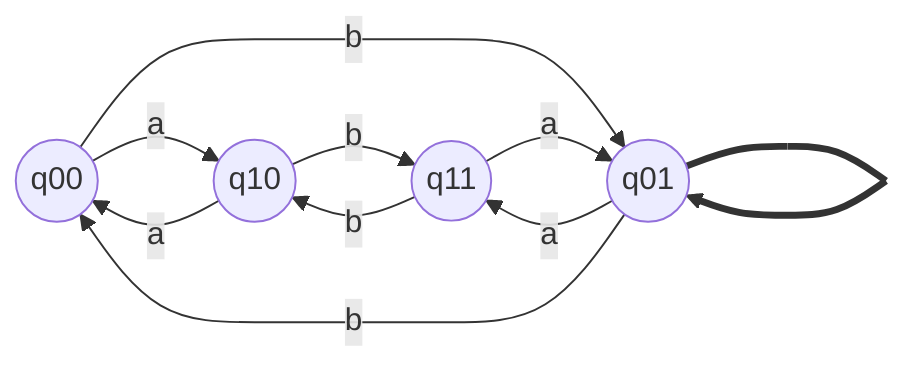

In this DFA, the states represent the parity of a's and b's encountered so far. The accepting state is q01, which represents an even number of a's and an odd number of b's. Since we have constructed a DFA that recognizes L, we have proved that L is regular.

2. **Proof by Contradiction:**
   
Example: Prove that the language L = {a^n^b^n^c^n^ | n ≥ 0} is not regular.

Proof: Assume, for the sake of contradiction, that L is regular. Then, by the Pumping Lemma, there exists a pumping length p such that for any string s ∈ L with |s| ≥ p, we can write s = xyz, satisfying:
1. |y| > 0
2. |xy| ≤ p
3. For all i ≥ 0, xy^i^z ∈ L

Now, consider the string s = a^p^b^p^c^p^. Clearly, s ∈ L and |s| ≥ p. By the Pumping Lemma, we can write s = xyz, satisfying the above conditions. There are three cases for the substring y:

Case 1: y consists of only a's.
Case 2: y consists of only b's.
Case 3: y consists of only c's.

In all three cases, pumping y (i.e., choosing i ≠ 1) will result in a string that violates the condition of having an equal number of a's, b's, and c's. This contradicts the assumption that xy^i^z ∈ L for all i ≥ 0. Therefore, our initial assumption that L is regular must be false, and we can conclude that L is not regular.

3. **Proof by Induction:**

Example: Prove that for every non-negative integer n, the language L_n = {a^i^ | 0 ≤ i ≤ n} is regular.

Proof: We will prove this by induction on n.

Base case (n = 0): L_0 = {ε}, which is regular (it can be recognized by a simple DFA with a single accepting state and no transitions).

Inductive hypothesis: Assume that L_k is regular for some non-negative integer k.

Inductive step: We want to prove that L_{k+1} is regular. Note that L_{k+1} = L_k ∪ {a^{k+1}^}. By the inductive hypothesis, L_k is regular. The language {a^{k+1}^} is also regular (it can be recognized by a DFA with k+2 states, where the last state is accepting). Since regular languages are closed under union, L_{k+1}, being the union of two regular languages, is also regular.

Conclusion: By the principle of mathematical induction, we have proved that L_n is regular for all non-negative integers n.

These examples demonstrate how to use constructive proofs, proofs by contradiction, and proofs by induction to prove statements related to Finite Automata and regular languages.

## 11. Real-world Applications and Research Frontiers

### 11.1 Finite Automata in compiler design and lexical analysis

Finite Automata play a crucial role in the lexical analysis phase of compiler design. Lexical analysis is the process of breaking down the source code into a sequence of tokens, such as keywords, identifiers, and literals. This process is performed by a lexical analyzer, also known as a scanner or tokenizer.

The lexical analyzer uses regular expressions to specify the patterns for different token types. These regular expressions are then converted into Finite Automata, typically Deterministic Finite Automata (DFAs), which efficiently recognize the tokens in the source code.

Example 25: Consider the following regular expressions for a simple programming language:
- Keyword: `if|else|while|for`
- Identifier: `[a-zA-Z_][a-zA-Z0-9_]*`
- Number: `+`

The lexical analyzer would convert these regular expressions into DFAs and use them to tokenize the source code, producing a sequence of tokens like `<Keyword, if>`, `<Identifier, x>`, `<Number, 42>`, etc.

By using Finite Automata, the lexical analyzer can efficiently and accurately identify tokens in the source code, which is essential for the subsequent stages of the compilation process, such as parsing and code generation.

### 11.2 Regular expressions in text processing and pattern matching

Regular expressions, which are closely related to Finite Automata, are widely used in text processing and pattern matching tasks. Many programming languages and text editors support regular expressions for searching, filtering, and manipulating text data.

Example 26: Consider the following regular expression: `\b[A-Z0-9._%+-]+@[A-Z0-9.-]+\.[A-Z]{2,}\b`

This regular expression can be used to match email addresses in a text document. It specifies the pattern for a valid email address, which consists of a username (containing alphanumeric characters, dots, underscores, percent signs, plus signs, and hyphens), followed by an at sign, a domain name (containing alphanumeric characters, dots, and hyphens), and a top-level domain (containing two or more uppercase letters).

By converting this regular expression into a Finite Automaton, a text processing tool can efficiently search for and extract email addresses from large text documents.

### 11.3 Finite Automata in natural language processing and speech recognition

Finite Automata are used in various aspects of natural language processing (NLP) and speech recognition. In NLP, Finite Automata can be used to model and recognize simple patterns in text, such as identifying word boundaries or extracting specific information from structured documents.

Example 27: Consider the following regular expression: `(Mr\.|Mrs\.|Ms\.|Dr\.) [A-Z][a-z]+ [A-Z][a-z]+`

This regular expression can be used to match and extract names with titles from a text document. It specifies the pattern for a title (Mr., Mrs., Ms., or Dr.), followed by a first name (starting with an uppercase letter and followed by lowercase letters) and a last name (also starting with an uppercase letter and followed by lowercase letters).

In speech recognition, Finite Automata are used to model phonemes and their transitions, helping to identify spoken words and phrases. By representing the possible sequences of phonemes as a Finite Automaton, a speech recognition system can efficiently decode the acoustic signal and transcribe spoken language into text.

### 11.4 Finite Automata in bioinformatics and DNA sequence analysis

Finite Automata have found applications in bioinformatics, particularly in the analysis of DNA sequences. DNA sequences can be represented as strings over the alphabet {A, C, G, T}, which correspond to the four nucleotide bases: adenine, cytosine, guanine, and thymine.

Finite Automata can be used to search for specific patterns or motifs in DNA sequences, helping researchers understand the structure and function of genes and regulatory elements.

Example 28: Consider the following regular expression: `GC[ACGT]{4,8}AT`

This regular expression represents a DNA sequence motif that starts with "GC", followed by 4 to 8 occurrences of any nucleotide base (A, C, G, or T), and ends with "AT". By converting this regular expression into a Finite Automaton, a bioinformatics tool can efficiently search for occurrences of this motif in large DNA datasets, such as genomes or transcriptomes.

Finite Automata can also be used to model and analyze more complex patterns in DNA sequences, such as palindromic sequences, repeats, or secondary structures, aiding in the discovery of functional elements and evolutionary relationships between organisms.

### 11.5 Current research trends and open problems in Finite Automata theory

Finite Automata theory continues to be an active area of research, with ongoing efforts to extend its capabilities, improve its efficiency, and explore new applications. Some current research trends and open problems include:

1. Quantum Finite Automata: Researchers are investigating the potential of quantum computing to enhance the power of Finite Automata. Quantum Finite Automata can take advantage of quantum phenomena, such as superposition and entanglement, to recognize languages that are not recognizable by classical Finite Automata.

2. Probabilistic Finite Automata: Probabilistic Finite Automata extend the classical Finite Automata model by associating probabilities with transitions. This allows for the recognition of languages with a certain level of uncertainty and has applications in areas such as natural language processing and machine learning.

3. Infinite-State Automata: While classical Finite Automata have a finite number of states, researchers are exploring automata models with an infinite number of states, such as Pushdown Automata and Turing Machines. These models have greater computational power and can recognize more complex languages.

4. Automata Learning: Automata learning is the process of inferring a Finite Automaton from a set of positive and negative examples. This has applications in areas such as grammar induction, software verification, and reverse engineering. Researchers are working on developing efficient algorithms for automata learning and extending the techniques to more expressive automata models.

5. Automata-based Formal Verification: Finite Automata are used in formal verification techniques, such as model checking, to verify the correctness of hardware and software systems. Researchers are exploring ways to scale these techniques to handle larger and more complex systems, as well as extending them to handle real-time, probabilistic, and hybrid systems.

These research trends and open problems highlight the ongoing relevance and potential of Finite Automata theory in various domains of computer science and related fields. As researchers continue to push the boundaries of Finite Automata theory, we can expect to see new insights, algorithms, and applications that will shape the future of this fundamental area of study.

## 12. Conclusion and Further Exploration

### 12.1 Recap of key concepts and techniques

Throughout this tutorial, we have explored the fundamental concepts and techniques related to Finite Automata, including:

1. Deterministic Finite Automata (DFAs): We learned about the formal definition, state diagram representation, and language acceptance of DFAs. We also explored techniques for designing DFAs for given languages and minimizing DFAs using Hopcroft's algorithm.

2. Non-deterministic Finite Automata (NFAs): We studied the formal definition, state diagram representation, and language acceptance of NFAs, as well as the concept of ε-transitions. We learned how to convert NFAs to DFAs using the subset construction algorithm and how to convert ε-NFAs to NFAs.

3. Regular Expressions: We explored the relationship between regular expressions and Finite Automata, learning how to construct Finite Automata from regular expressions using Thompson's construction algorithm and how to convert Finite Automata to regular expressions using the state elimination method.

4. Properties of Regular Languages: We studied the Pumping Lemma for Regular Languages, closure properties of regular languages, and decision algorithms for regular languages, such as the membership, emptiness, and equivalence problems.

5. Advanced Topics: We delved into advanced topics such as two-way Finite Automata, Finite Automata with output (Mealy and Moore machines), the relationship between Finite Automata and Pushdown Automata, the relationship between Finite Automata and Turing Machines, and the use of Finite Automata in formal verification.

6. Real-world Applications: We explored various real-world applications of Finite Automata, including compiler design and lexical analysis, text processing and pattern matching, natural language processing and speech recognition, bioinformatics and DNA sequence analysis, and current research trends and open problems in Finite Automata theory.

### 12.2 Importance of Finite Automata in the broader context of theoretical computer science

Finite Automata are a fundamental concept in theoretical computer science, serving as a foundation for more advanced topics in formal language theory, computability theory, and complexity theory. Understanding Finite Automata is crucial for students and researchers in computer science, as it provides a solid groundwork for exploring the limits of computation and the design of efficient algorithms.

Finite Automata are also closely related to other important computational models, such as Pushdown Automata and Turing Machines. By studying the relationships between these models, researchers can gain insights into the hierarchy of formal languages and the boundaries between decidable and undecidable problems.

Moreover, the techniques and algorithms developed in Finite Automata theory have found applications in various domains of computer science, such as compiler design, natural language processing, bioinformatics, and formal verification. As new challenges emerge in these fields, the principles and tools of Finite Automata theory continue to provide a solid foundation for developing innovative solutions.

### 12.3 Recommendations for further study and exploration

For students and researchers interested in deepening their understanding of Finite Automata and related topics, we recommend the following resources:

#### 12.3.1 Advanced textbooks and research papers
- "Introduction to Automata Theory, Languages, and Computation" by John E. Hopcroft, Rajeev Motwani, and Jeffrey D. Ullman
- "Elements of the Theory of Computation" by Harry R. Lewis and Christos H. Papadimitriou
- "Automata and Computability" by Dexter C. Kozen
- "Handbook of Formal Languages" edited by Grzegorz Rozenberg and Arto Salomaa

#### 12.3.2 Online courses and tutorials
- "Automata Theory" on Coursera by Jeff Ullman (Stanford University)
- "Theory of Computation" on edX by Michael Sipser (Massachusetts Institute of Technology)
- "Introduction to Formal Language Theory" on YouTube by Rajeev Motwani (Stanford University)

#### 12.3.3 Conferences and workshops in the field
- International Colloquium on Automata, Languages, and Programming (ICALP)
- Annual ACM/IEEE Symposium on Logic in Computer Science (LICS)
- International Conference on Developments in Language Theory (DLT)
- International Conference on Implementation and Application of Automata (CIAA)

### 12.4 Encouragement for learners to pursue research and projects involving Finite Automata

We encourage learners to actively engage with the concepts and techniques presented in this tutorial by pursuing research projects and applications involving Finite Automata. Some potential ideas for projects include:

1. Implementing Finite Automata algorithms: Develop software tools for constructing, manipulating, and visualizing Finite Automata, as well as for converting between different representations (DFAs, NFAs, regular expressions).

2. Applying Finite Automata to real-world problems: Explore the use of Finite Automata in various domains, such as text processing, compiler design, bioinformatics, or natural language processing. Develop prototypes or case studies that demonstrate the practical applications of Finite Automata.

3. Investigating advanced topics: Delve deeper into advanced topics such as quantum Finite Automata, probabilistic Finite Automata, or infinite-state automata. Conduct literature reviews, implement simulations, or propose new algorithms and techniques in these areas.

4. Participating in research and open-source projects: Join ongoing research projects or contribute to open-source initiatives related to Finite Automata and formal language theory. Collaborate with researchers and developers to address open problems, improve existing tools, or develop new applications.

By actively engaging with Finite Automata through research and projects, learners can deepen their understanding of the subject, develop practical skills, and contribute to the advancement of this important field of study.

In conclusion, this tutorial has provided a comprehensive introduction to Finite Automata, covering fundamental concepts, advanced topics, and real-world applications. We hope that this tutorial has sparked your interest in Finite Automata and encouraged you to further explore this fascinating area of theoretical computer science. With dedication and curiosity, you can master the principles and techniques of Finite Automata and apply them to solve complex problems and push the boundaries of computation.