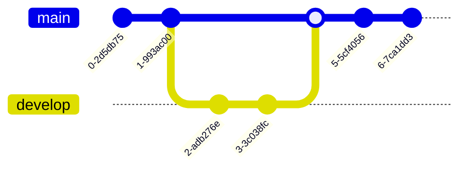

## Mastering Git: A Comprehensive, Example-Driven Step by Step Tutorial for the Impatient

### Introduction to Git and Version Control

Git is a distributed version control system that allows you to track changes in your code, collaborate with others, and manage different versions of your project. Version control is essential in software development as it enables developers to:

- Track and revert changes to their codebase.
- Collaborate with others on the same codebase without overwriting each other's work.
- Maintain different versions of a project (e.g., development, testing, production).
- Isolate and fix bugs by reverting to a previous working version.

**Examples:**

1. Initialize a new Git repository:

```
git init
```

2. Check the status of your repository:

```
git status
```

3. Add a file to the staging area:

```
git add file.txt
```

4. Commit changes with a message:

```
git commit -m "Initial commit"
```

**Challenges:**

1. Create a new directory and initialize a Git repository inside it.
2. Create a new file, add some content to it, and commit the changes.
3. What is the difference between the working directory, staging area, and repository in Git?
4. How can you check the commit history of a repository?
5. What is the purpose of the `.gitignore` file?

### Branching and Merging

Branching is a powerful feature in Git that allows you to create separate lines of development, experiment with new features, or fix bugs without affecting the main codebase. It is a core part of the Git workflow, where developers create feature branches to work on new functionality or bug fixes, and then merge those changes back into the main branch (often called "main" or "master") when ready.

Merging is the process of combining changes from different branches. When merging, Git will attempt to automatically combine the changes from the different branches. However, if there are conflicts (e.g., two branches modified the same line of code), Git will require manual intervention to resolve the conflicts.

**Examples:**

1. Create a new branch:

```
git branch new-feature
```

2. Switch to the new branch:

```
git checkout new-feature
```

3. Make changes and commit them on the new branch.
4. Switch back to the main branch:

```
git checkout main
```

5. Merge the changes from the `new-feature` branch into the `main` branch:

```
git merge new-feature
```

6. Resolve merge conflicts (if any) and commit the resolved changes.

**Challenges:**

1. Create a new branch called `experimental` and switch to it.
2. Make some changes to a file and commit them on the `experimental` branch.
3. Switch back to the `main` branch and create a new file.
4. Merge the `experimental` branch into the `main` branch and resolve any conflicts.
5. What is the difference between `git merge` and `git rebase`?
6. How can you delete a branch in Git?

### Remote Repositories and Collaboration

Git allows you to work with remote repositories, which are hosted on services like GitHub, GitLab, or Bitbucket. This enables collaboration with other developers and makes it easier to share and contribute to projects.

When working with remote repositories, you typically have a local repository on your machine and a remote repository hosted on a server. You can push your local commits to the remote repository, pull changes from the remote repository, and collaborate with others by creating pull requests.

**Examples:**

1. Add a remote repository:

```
git remote add origin https://github.com/username/repo.git
```

2. Push your local commits to the remote repository:

```
git push -u origin main
```

3. Pull changes from the remote repository:

```
git pull
```

4. Create a new branch and push it to the remote repository:

```
git checkout -b new-feature
# Make changes and commit them
git push origin new-feature
```

5. Open a pull request on the remote repository to merge the `new-feature` branch into the `main` branch.

**Challenges:**

1. Create a new repository on GitHub and add it as a remote to your local repository.
2. Push your local commits to the remote repository.
3. Create a new branch, make some changes, and push the branch to the remote repository.
4. Open a pull request on GitHub to merge the new branch into the `main` branch.
5. What is the difference between `git fetch` and `git pull`?
6. How can you rename a remote repository?

### Advanced Git Concepts

As you become more proficient with Git, you'll encounter more advanced concepts and techniques that can further enhance your workflow and productivity.

**Git Hooks:**

Git hooks are scripts that run automatically at specific points in the Git workflow. They can be used to automate tasks, enforce coding standards, or integrate with other tools.

**Example:**

```
# Create a pre-commit hook to run linting
touch .git/hooks/pre-commit
chmod +x .git/hooks/pre-commit
# Add linting commands to the pre-commit hook
```

**Git Bisect:**

Git bisect is a powerful tool for debugging and finding regressions. It allows you to perform a binary search through your commit history to identify the commit that introduced a particular bug or issue.

**Example:**

```
# Start a bisect session
git bisect start

# Mark the current commit as "bad"
git bisect bad

# Mark a known good commit
git bisect good commit-hash

# Git will checkout a commit in the middle and prompt you to test
# Mark the commit as "good" or "bad" until the culprit is found
```

**Git Submodules:**

Git submodules allow you to include external repositories as dependencies within your main repository. This can be useful for managing third-party libraries or shared code across multiple projects.

**Example:**

```
# Add a submodule
git submodule add https://github.com/external/repo.git path/to/submodule

# Update submodules
git submodule update --init --recursive
```

**Git Rebase:**

Git rebase is a powerful tool for rewriting commit history. It allows you to apply commits from one branch onto another, effectively "replaying" the commits on top of a different base commit.

**Example:**

```
git checkout feature-branch
git rebase main
```

**Challenges:**

1. Stash your current changes, make some other changes, and then apply the stashed changes.
2. Rebase a feature branch onto the `main` branch and resolve any conflicts.
3. Squash the last three commits into a single commit using interactive rebase.
4. Cherry-pick a specific commit from another branch into your current branch.
5. Create a Git hook that runs a linting tool before committing changes.
6. What is the difference between `git reset` and `git revert`?

### Visualizing Git Concepts

To better understand Git concepts, it's helpful to visualize them. Here, we'll use mermaid diagrams to illustrate some key Git concepts.

#### Git Repository Components


This diagram shows the different components of a Git repository:

- **Working Directory:** The directory where you make changes to your files.
- **Staging Area:** A staging area where you can selectively add changes before committing them.
- **Local Repository:** The local repository on your machine, which stores all committed changes.
- **Remote Repository:** A remote repository hosted on a server, which allows collaboration and sharing of code.

The arrows represent the flow of data between these components, and the corresponding Git commands are shown.

#### Branching and Merging



This diagram illustrates the process of creating a new branch (`develop`), making commits on that branch, and then merging the `develop` branch back into the `main` branch.

1. The initial commits are made on the `main` branch.
2. A new branch `develop` is created from the `main` branch.
3. Additional commits are made on the `develop` branch.
4. The `develop` branch is merged back into the `main` branch, combining the changes from both branches.
5. After the merge, additional commits can be made on the `main` branch.

**Challenges:**

1. Explain the different components shown in the Git repository components diagram.
2. What is the purpose of the staging area in Git?
3. Describe the process of branching and merging as depicted in the second diagram.
4. How can you visualize the commit history in Git?
5. What are some other Git concepts that can be effectively visualized using diagrams?

By mastering Git, you'll be able to efficiently manage your codebase, collaborate with others, and streamline your development workflow. This comprehensive tutorial has covered the essential concepts, practical examples, challenges, and visualizations to help you become proficient in Git. Keep practicing, exploring advanced techniques, and stay up-to-date with the latest Git features to further enhance your skills.


### Git Workflows

Git supports various workflows, and understanding them can help you collaborate more effectively with your team. Here are some common Git workflows:

**Centralized Workflow:**

In this workflow, there is a single central repository that serves as the "truth" for the project. Developers create local clones of the central repository, make changes, and push their commits back to the central repository. This workflow is suitable for small teams or projects with a single maintainer.


**Feature Branch Workflow:**

This workflow involves creating a new branch for each new feature or bug fix. Once the work is completed and tested, the feature branch is merged back into the main branch. This workflow is widely used in larger projects and teams, as it allows for isolated development and easy collaboration.


In this diagram:

1. The initial commits are made on the `main` branch.
2. A new branch `feature1` is created from the `main` branch.
3. Additional commits are made on the `feature1` branch, representing the work done for that feature.
4. Once the work on `feature1` is completed and tested, the `feature1` branch is merged back into the `main` branch.
5. After the merge, additional commits can be made on the `main` branch.
6. A new branch `feature2` is created from the `main` branch.
7. Additional commits are made on the `feature2` branch, representing the work done for that feature.
8. Once the work on `feature2` is completed and tested, the `feature2` branch is merged back into the `main` branch.
9. After the merge, additional commits can be made on the `main` branch.

This diagram illustrates the creation of separate feature branches for each new feature or bug fix, allowing for isolated development and easy collaboration. Once the work on a feature branch is completed and tested, it is merged back into the main branch, integrating the changes into the main codebase.

**Gitflow Workflow:**

Gitflow is a more structured workflow that introduces additional branches for managing releases and hotfixes. It involves the use of a `main` branch for production releases, a `develop` branch for integrating features, and separate branches for features, releases, and hotfixes. This workflow is suitable for projects with a scheduled release cycle.


In this diagram:

1. The initial commits are made on the `main` branch, representing the production releases.
2. A `develop` branch is created from the `main` branch, serving as the integration branch for features.
3. A new feature branch `feature1` is created from the `develop` branch.
4. Additional commits are made on the `feature1` branch, representing the work done for that feature.
5. Once the work on `feature1` is completed, it is merged back into the `develop` branch.
6. When it's time for a new release, a `release/1.0` branch is created from the `develop` branch.
7. Additional commits are made on the `release/1.0` branch, representing any final changes or preparations for the release.
8. The `release/1.0` branch is merged into the `main` branch and tagged with the release version `1.0`.
9. The `release/1.0` branch is also merged back into the `develop` branch to incorporate any changes made during the release process.
10. If a hotfix is needed for the `1.0` release, a `hotfix/1.0.1` branch is created from the `main` branch.
11. Commits are made on the `hotfix/1.0.1` branch to address the hotfix.
12. The `hotfix/1.0.1` branch is merged into both the `main` branch and the `develop` branch, and tagged with the hotfix version `1.0.1`.

This diagram illustrates the structured nature of the Gitflow Workflow, with separate branches for features, releases, and hotfixes, and a dedicated `develop` branch for integrating features before they are merged into the `main` branch for production releases.

**Forking Workflow:**

This workflow is commonly used in open-source projects. Developers create a personal fork (copy) of the main repository, make changes in their fork, and then submit a pull request to the main repository. The maintainers review and merge the changes if they are approved.

Sure, here's a mermaid diagram that illustrates the Forking Workflow:


In this diagram:

1. The `Main Repo` node represents the main repository for the open-source project.
2. The `Maintainer` node represents the maintainer(s) of the main repository.
3. `Dev1` and `Dev2` subgraphs represent individual developers contributing to the project.
4. Each developer creates a fork (`D1F` and `D2F`) of the main repository (`MR`).
5. The developers clone their respective forks to create local repositories (`D1L` and `D2L`).
6. The developers make changes and commit them to their local repositories.
7. The developers push their changes to their respective forks (`D1F` and `D2F`).
8. The developers submit pull requests from their forks (`D1F` and `D2F`) to the main repository (`MR`).
9. The maintainer (`M`) reviews the pull requests and merges the approved changes into the main repository (`MR`).

This diagram illustrates the forking workflow commonly used in open-source projects, where developers create personal forks of the main repository, make changes in their forks, and submit pull requests to the main repository for review and merging by the maintainers.

**Examples:**

1. Create a new feature branch:

```
git checkout -b feature/new-feature
```

2. Commit changes to the feature branch.
3. Push the feature branch to the remote repository:

```
git push origin feature/new-feature
```

4. Open a pull request to merge the feature branch into the `main` branch.
5. After the pull request is reviewed and approved, merge the changes into the `main` branch.

**Challenges:**

1. Describe the differences between the centralized, feature branch, Gitflow, and forking workflows.
2. When would you choose one workflow over another?
3. How can you ensure that your team follows a consistent Git workflow?
4. What are some best practices for managing branches and pull requests in a team environment?

### Git Best Practices

Following best practices can help you maintain a clean and organized Git repository, making it easier to collaborate and manage your codebase.

**Commit Messages:**

- Write clear and concise commit messages that describe the changes made.
- Use the imperative mood (e.g., "Add feature X" instead of "Added feature X").
- Separate the subject line from the body with a blank line.
- Limit the subject line to 50 characters or less.
- Provide additional details in the body if necessary.

**Branching Strategy:**

- Use descriptive branch names that reflect the purpose of the branch (e.g., `feature/new-login`, `bugfix/login-issue`).
- Delete branches after they have been merged to keep the repository clean.
- Avoid working directly on the `main` branch.

**Code Reviews:**

- Encourage code reviews for all pull requests.
- Provide constructive feedback and suggestions for improvement.
- Ensure that code adheres to coding standards and best practices.

**Testing:**

- Write automated tests for new features and bug fixes.
- Run tests locally before committing changes.
- Consider setting up continuous integration (CI) to automatically run tests on each commit or pull request.

**Examples:**

1. Write a clear and concise commit message:

```
git commit -m "Add login functionality"
```

2. Create a new branch for a feature:

```
git checkout -b feature/new-login
```

3. Open a pull request and request a code review from team members.
4. Set up a CI pipeline to run tests automatically on each pull request.

**Challenges:**

1. Write a commit message that follows best practices for a change that fixes a bug in the user registration process.
2. Describe a branching strategy for a project with multiple features and bug fixes in progress.
3. How can you ensure that code reviews are consistently performed in your team?
4. What are some tools or services that can be used for continuous integration and testing in Git?

### Git Hooks and Integration

Git hooks allow you to automate tasks and integrate Git with other tools and services. By leveraging hooks, you can enforce coding standards, run tests, and streamline your development workflow.

**Client-Side Hooks:**

Client-side hooks are scripts that run on your local machine before or after certain Git operations. Some common client-side hooks include:

- `pre-commit`: Run before a commit is created, allowing you to perform tasks like linting, formatting, or running tests.
- `commit-msg`: Run after a commit message is entered, enabling you to enforce commit message conventions.
- `pre-push`: Run before pushing commits to a remote repository, allowing you to perform additional checks or validations.

**Server-Side Hooks:**

Server-side hooks are scripts that run on the remote repository after certain Git operations. These hooks are typically used in centralized workflows or when working with a hosted Git service like GitHub or GitLab. Some common server-side hooks include:

- `pre-receive`: Run before receiving any pushed commits, allowing you to enforce repository policies or perform additional checks.
- `update`: Run after a successful `pre-receive` hook and before updating the remote repository, enabling you to perform additional actions or notifications.

**Examples:**

1. Create a `pre-commit` hook to run linting and formatting:

```bash
#!/bin/sh

# Run linting
npm run lint

# Run code formatting
npm run format

# If any of the above commands fail, abort the commit
if [ $? -ne 0 ]; then
    echo "Linting or formatting failed. Please fix the issues and try again."
    exit 1
fi
```

2. Set up a `pre-push` hook to run tests:

```bash
#!/bin/sh

# Run tests
npm test

# If tests fail, abort the push
if [ $? -ne 0 ]; then
    echo "Tests failed. Please fix the issues and try again."
    exit 1
fi
```

3. Integrate Git with a continuous integration (CI) service like Travis CI or CircleCI to automatically run tests and checks on each push or pull request.

**Challenges:**

1. Create a `commit-msg` hook to enforce a specific commit message format (e.g., start with a verb in the imperative mood).
2. Set up a server-side `pre-receive` hook to prevent pushing commits that contain certain keywords or patterns.
3. Integrate Git with a code coverage tool to generate and report code coverage metrics on each commit or pull request.
4. Explore different CI services and choose one that best fits your project's needs. Set up a basic CI pipeline to run tests and checks on each pull request.

By following best practices, leveraging Git workflows, and integrating Git with other tools and services, you can streamline your development process, improve code quality, and collaborate more effectively with your team.

Sure, let's continue with some more advanced Git topics and techniques.

### Git Reflog and Data Recovery

Git's reflog is a powerful tool that can help you recover lost commits or undo unwanted changes. The reflog is a log of all the updates made to the tips of branches in your local repository.

**Examples:**

1. View the reflog:

```
git reflog
```

This command will display a list of all the recent updates to branch tips, including commits, checkouts, resets, and more.

2. Recover a lost commit using the reflog:

```
git checkout HEAD@{5}
```

This command will check out the commit that was the HEAD 5 entries ago in the reflog. You can replace `5` with the appropriate number from the reflog output.

3. Reset a branch to a specific commit in the reflog:

```
git reset --hard HEAD@{10}
```

This command will reset the current branch to the commit that was the HEAD 10 entries ago in the reflog, discarding any changes made after that point.

**Challenges:**

1. Experiment with making some commits, resetting your branch, and then using the reflog to recover the lost commits.
2. What are some scenarios where the reflog can be particularly useful?
3. How long does Git keep entries in the reflog?
4. Can you use the reflog to recover commits that have been pushed to a remote repository?

### Git Submodules

Git submodules allow you to include external repositories as dependencies within your main repository. This can be useful for managing third-party libraries, shared code across multiple projects, or even nested repositories.

**Examples:**

1. Add a submodule:

```
git submodule add https://github.com/external/repo.git path/to/submodule
```

This command will add the external repository as a submodule in the specified `path/to/submodule` directory.

2. Update submodules:

```
git submodule update --init --recursive
```

This command will initialize and update all submodules in your repository, including any nested submodules.

3. Commit changes to a submodule:

```
cd path/to/submodule
# Make changes and commit them
git commit -am "Update submodule"
cd ../..
git commit -am "Update main repo with submodule changes"
```

To commit changes made to a submodule, you need to commit the changes within the submodule first, and then commit the updated submodule reference in the main repository.

**Challenges:**

1. Add a submodule to your project and experiment with making changes to the submodule and updating it in the main repository.
2. What are some potential drawbacks or challenges of using submodules?
3. How can you remove a submodule from your repository?
4. Explore alternative approaches to managing dependencies, such as Git subtrees or package managers like npm or Composer.

### Git Stashing

Git stashing is a way to temporarily save changes without committing them. This can be useful when you need to switch branches or work on something else without losing your current changes.

**Examples:**

1. Stash your current changes:

```
git stash
```

This command will save your current changes and revert your working directory to the last committed state.

2. List stashed changes:

```
git stash list
```

This command will show a list of all stashed changes in your repository.

3. Apply a stashed change:

```
git stash apply
```

This command will apply the most recent stashed change to your working directory.

4. Apply a specific stashed change:

```
git stash apply stash@{2}
```

This command will apply the stashed change at position 2 in the stash list.

5. Drop a stashed change:

```
git stash drop stash@{1}
```

This command will remove the stashed change at position 1 from the stash list.

**Challenges:**

1. Experiment with stashing and applying changes in your repository.
2. What happens if you have multiple stashed changes and you apply one of them without specifying the stash entry?
3. How can you create a new branch from a stashed change?
4. Can you stash untracked files? If so, how?

### Git Worktrees

Git worktrees allow you to have multiple working directories for a single repository. This can be useful when you need to work on different branches or features simultaneously, without constantly switching between branches.

**Examples:**

1. Create a new worktree:

```
git worktree add ../path/to/new-worktree branch-name
```

This command will create a new working directory at `../path/to/new-worktree` and check out the specified `branch-name` in that directory.

2. List all worktrees:

```
git worktree list
```

This command will show a list of all worktrees associated with the current repository.

3. Remove a worktree:

```
git worktree remove ../path/to/new-worktree
```

This command will remove the worktree located at `../path/to/new-worktree`.

**Challenges:**

1. Create a new worktree for a different branch in your repository and experiment with making changes in both worktrees.
2. How can you share changes between worktrees?
3. What are some potential use cases for Git worktrees?
4. Are there any limitations or drawbacks to using worktrees?

### Git Internals

While you don't need to understand Git's internals to use it effectively, having a basic understanding of how Git works under the hood can be beneficial. Here's a brief overview of some key Git internals:

**Git Objects:**

Git stores data as objects, which are identified by their SHA-1 hash. There are four main types of objects:

- **Blob:** Represents file contents.
- **Tree:** Represents a directory and its contents (blobs and other trees).
- **Commit:** Represents a snapshot of the repository at a particular point in time, including the tree and parent commits.
- **Tag:** Represents a reference to a specific commit, often used for releases or milestones.

**Git References:**

Git uses references (refs) to point to specific commits. Some common references include:

- `HEAD`: A symbolic reference that points to the currently checked-out commit.
- `branch-name`: A reference that points to the latest commit in a branch.
- `remotes/origin/branch-name`: A reference that points to the latest commit of a branch on a remote repository.

**Git Packfiles:**

Git stores objects in packfiles to optimize storage and transfer. Packfiles are created by compressing and deduplicating objects, resulting in a more efficient repository size.

**Challenges:**

1. Explore the `.git` directory in your repository and try to identify the different types of objects and references.
2. Use the `git cat-file` command to inspect the contents of different Git objects.
3. Learn about Git's transfer protocols (e.g., smart HTTP, Git protocol) and how they work.
4. Investigate Git's garbage collection process and how it manages packfiles and loose objects.

Understanding Git's internals can help you gain a deeper appreciation for how Git works and potentially troubleshoot more advanced issues or optimize your Git workflow.

By mastering these advanced Git concepts and techniques, you'll be well-equipped to handle complex scenarios, collaborate more effectively, and streamline your development workflow. Remember to keep practicing and exploring new Git features and tools to continuously improve your skills.

Sure, let's continue exploring more advanced Git concepts and techniques.

### Git Bisect

Git bisect is a powerful debugging tool that can help you identify the commit that introduced a specific bug or regression. It works by performing a binary search through your commit history, allowing you to quickly narrow down the culprit commit.

**Examples:**

1. Start a bisect session:

```
git bisect start
```

2. Mark the current commit as "bad" (containing the bug):

```
git bisect bad
```

3. Mark a known good commit (before the bug was introduced):

```
git bisect good commit-hash
```

Git will then check out a commit in the middle of the range and prompt you to test it.

4. If the bug is present, mark the commit as "bad":

```
git bisect bad
```

If the bug is not present, mark the commit as "good":

```
git bisect good
```

Git will continue to narrow down the range until it finds the commit that introduced the bug.

5. Once the culprit commit is found, you can inspect it:

```
git show
```

6. After you've identified the problematic commit, you can reset your repository and exit the bisect session:

```
git bisect reset
```

**Challenges:**

1. Use Git bisect to find the commit that introduced a bug in a project you're working on.
2. What are some strategies for efficiently testing commits during a bisect session?
3. Can you use Git bisect to find the commit that introduced a performance regression?
4. How can you automate the testing process during a bisect session?

### Git Rerere

Git rerere (reuse recorded resolution) is a feature that helps you resolve conflicts more efficiently by reusing previously recorded conflict resolutions. When you encounter a conflict that you've resolved before, Git can automatically apply the previous resolution, saving you time and effort.

**Examples:**

1. Enable the rerere feature:

```
git config --global rerere.enabled true
```

2. Resolve a conflict and commit the resolution:

```
# Resolve the conflict
git add resolved_file.txt
git commit -m "Resolve conflict"
```

Git will record the conflict resolution in the `.git/rr-cache` directory.

3. If you encounter the same conflict again, Git will automatically apply the recorded resolution:

```
git merge other-branch
# Git will apply the recorded resolution
```

4. If the automatic resolution is not correct, you can resolve the conflict manually and update the recorded resolution:

```
# Resolve the conflict manually
git add resolved_file.txt
git commit --no-edit
```

**Challenges:**

1. Experiment with enabling the rerere feature and resolving conflicts in your repository.
2. How can you view the recorded conflict resolutions in the `.git/rr-cache` directory?
3. Are there any potential drawbacks or limitations to using the rerere feature?
4. Can you think of scenarios where the rerere feature might not be desirable or appropriate?

### Git Filters

Git filters allow you to modify the content of files as they are checked in or checked out of your repository. This can be useful for tasks like automatically compressing or encrypting files, or applying transformations to specific file types.

**Examples:**

1. Configure a filter for a specific file pattern:

```
git config filter.myfilter.clean "command-to-process-file"
git config filter.myfilter.smudge "command-to-reverse-process-file"
```

The `clean` filter is applied when files are checked in, and the `smudge` filter is applied when files are checked out.

2. Associate the filter with a file pattern:

```
git config filter.myfilter.required true
echo '*.txt filter=myfilter' >> .gitattributes
```

This will apply the `myfilter` to all `.txt` files in your repository.

3. Use a built-in Git filter:

```
echo '*.jpg filter=lfs' >> .gitattributes
```

This will enable Git LFS (Large File Storage) for all `.jpg` files, allowing you to store large binary files more efficiently.

**Challenges:**

1. Create a custom filter that compresses text files when they are checked in and decompresses them when they are checked out.
2. Explore the built-in Git filters and find a use case for one of them in your project.
3. Can you think of any potential security concerns or risks associated with using Git filters?
4. How can you ensure that Git filters are applied consistently across different development environments?

### Git Submodule Alternatives

While Git submodules provide a way to include external repositories as dependencies, they can be challenging to work with and may not be the best solution for all projects. Here are some alternatives to consider:

**Git Subtree:**

Git subtree is a way to include another repository as a subdirectory of your main repository. Unlike submodules, subtrees are fully integrated into your repository, making them easier to work with and manage.

**Examples:**

1. Add a subtree:

```
git subtree add --prefix=path/to/subtree https://github.com/external/repo.git master --squash
```

2. Update a subtree:

```
git subtree pull --prefix=path/to/subtree https://github.com/external/repo.git master --squash
```

**Package Managers:**

For many projects, it may be more appropriate to use a package manager like npm (for JavaScript), Composer (for PHP), or Cargo (for Rust) to manage dependencies. These package managers provide a more structured and standardized way to include and update external libraries and dependencies.

**Examples:**

1. Install a dependency using npm:

```
npm install package-name
```

2. Update dependencies using Composer:

```
composer update
```

**Challenges:**

1. Experiment with using Git subtrees or a package manager to manage dependencies in your project.
2. Compare and contrast the advantages and disadvantages of using Git submodules, subtrees, or package managers for dependency management.
3. How can you ensure that your team follows consistent practices for managing dependencies?
4. Are there any potential issues or challenges that can arise when using package managers or subtrees in a Git-based project?

### Git Worktree Workflows

Git worktrees can be a powerful tool for managing multiple branches or features simultaneously, but they also introduce some complexity and potential pitfalls. Here are some best practices and workflows for using Git worktrees effectively:

**Isolated Feature Development:**

Worktrees can be useful for developing new features or bug fixes in isolation, without affecting your main codebase. You can create a new worktree for a feature branch, make changes, and test them independently before merging them back into the main branch.

**Parallel Testing:**

With worktrees, you can have multiple working directories for different branches or versions of your codebase. This can be helpful for testing changes or new features across different environments or configurations simultaneously.

**Continuous Integration (CI) Workflows:**

Worktrees can be integrated into your CI pipeline to enable parallel testing or building of different branches or configurations. This can help speed up your CI process and catch issues more quickly.

**Examples:**

1. Create a new worktree for a feature branch:

```
git worktree add ../path/to/feature-worktree feature-branch
```

2. Make changes and commit them in the feature worktree.
3. Push the feature branch to a remote repository for collaboration or code review.
4. Once the feature is complete, merge the feature branch into the main branch.
5. Remove the feature worktree:

```
git worktree remove ../path/to/feature-worktree
```

**Challenges:**

1. Develop a workflow for using worktrees in your team's development process.
2. Explore ways to integrate worktrees into your CI pipeline for parallel testing or building.
3. How can you ensure that worktrees are properly cleaned up and managed to avoid cluttering your repository?
4. Are there any potential conflicts or issues that can arise when working with multiple worktrees simultaneously?

### Git Hooks for Continuous Integration

Git hooks can be a powerful tool for integrating Git with your continuous integration (CI) pipeline. By leveraging hooks, you can automate tasks like running tests, linting code, or deploying your application after successful commits or pushes.

**Client-Side Hooks:**

Client-side hooks can be used to enforce code quality standards or run local tests before committing or pushing changes. Some common client-side hooks for CI include:

- `pre-commit`: Run linters, formatters, or unit tests before committing changes.
- `pre-push`: Run more comprehensive tests or checks before pushing changes to a remote repository.

**Server-Side Hooks:**

Server-side hooks can be used to trigger CI builds or deployments when changes are pushed to a remote repository. Some common server-side hooks for CI include:

- `pre-receive`: Run checks or validations before accepting pushed commits.
- `post-receive`: Trigger a CI build or deployment after successfully receiving pushed commits.

**Examples:**

1. Create a `pre-commit` hook to run linters and unit tests:

```bash
#!/bin/sh

# Run linters
npm run lint

# Run unit tests
npm test

# If any of the above commands fail, abort the commit
if [ $? -ne 0 ]; then
    echo "Linting or tests failed. Please fix the issues and try again."
    exit 1
fi
```

2. Set up a `post-receive` hook to trigger a CI build:

```bash
#!/bin/sh

# Path to your CI script or command
CI_SCRIPT="/path/to/ci-script.sh"

# Run the CI script
$CI_SCRIPT
```

**Challenges:**

1. Integrate Git hooks into your existing CI pipeline to automate tasks like linting, testing, or deployment.
2. Explore different CI tools or services (e.g., Jenkins, Travis CI, CircleCI) and how they can be integrated with Git hooks.
3. How can you ensure that Git hooks are consistently applied across different development environments or team members?
4. Are there any potential security concerns or risks associated with using Git hooks in a CI pipeline?

### Git Monorepo Management

A monorepo (monolithic repository) is a single Git repository that contains multiple projects, libraries, or applications. While monorepos can provide benefits like easier code sharing and atomic commits across multiple components, they also introduce challenges in terms of repository management and organization.

**Examples:**

1. Use Git submodules or subtrees to include external dependencies or shared libraries within your monorepo.
2. Leverage Git worktrees to work on different components or projects simultaneously within the monorepo.
3. Implement a consistent directory structure and naming conventions to organize your monorepo.
4. Use Git filters or Git LFS (Large File Storage) to manage large binary files or assets within your monorepo.

**Challenges:**

1. Develop a strategy for organizing and structuring your monorepo to ensure maintainability and scalability.
2. Explore tools or workflows for managing dependencies, builds, and deployments within a monorepo environment.
3. How can you ensure that changes to shared libraries or components are properly tested and validated across all affected projects within the monorepo?
4. Are there any potential performance or scalability issues that can arise when working with large monorepos?

### Git Scripting and Automation

While Git provides a powerful command-line interface, you can also leverage scripting and automation to streamline your Git workflows and processes.

**Git Aliases:**

Git aliases allow you to create custom commands or shortcuts for frequently used Git operations.

**Example:**

```
git config --global alias.st 'status'
git config --global alias.co 'checkout'
git config --global alias.br 'branch'
```

Now, you can use `git st` instead of `git status`, `git co` instead of `git checkout`, and `git br` instead of `git branch`.

**Git Scripting:**

You can write scripts or shell scripts to automate Git tasks or integrate Git with other tools or processes.

**Example:**

```bash
#!/bin/sh

# Fetch changes from the remote repository
git fetch

# Check if there are any new commits
if [ "$(git rev-list --count @{u}..@{0})" -gt 0 ]; then
    # Pull the latest changes
    git pull

    # Run tests
    npm test

    # If tests pass, deploy the application
    if [ $? -eq 0 ]; then
        deploy_application
    fi
fi
```

This script fetches changes from the remote repository, pulls the latest changes if there are any, runs tests, and deploys the application if the tests pass.

**Challenges:**

1. Create Git aliases for common operations or workflows in your project.
2. Write a script to automate a Git-related task or process in your development workflow.
3. Explore Git's built-in scripting capabilitiesSure, let's continue exploring more advanced Git concepts and techniques.

### Git Refspecs

Git refspecs (reference specifications) are a way to specify which remote branches or references should be fetched, pushed, or mapped during Git operations. Understanding refspecs can be useful when working with complex remote repository configurations or when you need to customize the behavior of Git's remote operations.

**Examples:**

1. Fetch a specific branch from a remote repository:

```
git fetch origin refs/heads/feature-branch:refs/remotes/origin/feature-branch
```

This command fetches the `feature-branch` from the `origin` remote repository and stores it in the local `refs/remotes/origin/feature-branch` reference.

2. Push a local branch to a different remote branch:

```
git push origin HEAD:refs/heads/remote-branch
```

This command pushes the current branch (`HEAD`) to the `remote-branch` on the `origin` remote repository.

3. Configure a refspec in your Git configuration:

```
git config remote.origin.fetch "+refs/heads/*:refs/remotes/origin/*"
```

This configuration sets the default refspec for fetching from the `origin` remote repository, which fetches all remote branches and stores them in the `refs/remotes/origin/*` namespace.

**Challenges:**

1. Experiment with using refspecs to fetch or push specific branches or references to remote repositories.
2. Explore advanced refspec patterns and syntax for more complex scenarios.
3. How can you use refspecs to manage or organize remote branches in a large or complex project?
4. Are there any potential drawbacks or limitations to using refspecs?

### Git Revisions and Range Syntax

Git's revision and range syntax allows you to specify commits, branches, or ranges of commits in a flexible and powerful way. Understanding this syntax can be useful for various Git operations, such as checking out specific commits, creating branches, or performing diffs and comparisons.

**Examples:**

1. Checkout a specific commit:

```
git checkout commit-hash
```

2. Create a new branch from a specific commit:

```
git checkout -b new-branch commit-hash
```

3. Compare the differences between two commits:

```
git diff commit-hash1 commit-hash2
```

4. Show the commit log for a range of commits:

```
git log commit-hash1..commit-hash2
```

5. Use range syntax to specify a range of commits:

```
git rebase --interactive HEAD~5
```

This command opens an interactive rebase session for the last 5 commits.

**Challenges:**

1. Experiment with using different revision and range syntax to perform various Git operations.
2. How can you use revision syntax to specify commits relative to a branch or tag?
3. Explore advanced range syntax, such as triple-dot syntax (`commit1...commit2`) and other range operators.
4. Can you think of scenarios where using revision or range syntax can be particularly useful or powerful?

### Git Stash Workflows

Git stash is a powerful feature that allows you to temporarily save changes without committing them. While stashing can be useful in various situations, it's important to understand how to effectively incorporate stash workflows into your development process.

**Examples:**

1. Stash your current changes:

```
git stash
```

2. List all stashed changes:

```
git stash list
```

3. Apply the latest stashed changes:

```
git stash apply
```

4. Apply a specific stashed change:

```
git stash apply stash@{2}
```

5. Create a new branch from a stashed change:

```
git stash branch new-branch stash@{1}
```

6. Drop a stashed change:

```
git stash drop stash@{3}
```

**Challenges:**

1. Develop a workflow for using Git stash in your development process.
2. How can you ensure that stashed changes are properly tracked and managed, especially in a team environment?
3. Explore advanced stash workflows, such as stashing untracked files or creating patches from stashed changes.
4. Are there any potential drawbacks or limitations to using Git stash that you should be aware of?

### Git Rebase Workflows

Git rebase is a powerful tool that allows you to rewrite commit history by applying commits from one branch onto another. While rebasing can be useful for maintaining a clean and linear commit history, it's important to understand the potential risks and best practices when incorporating rebase workflows into your development process.

**Examples:**

1. Rebase a feature branch onto the main branch:

```
git checkout feature-branch
git rebase main
```

2. Perform an interactive rebase to squash or reorder commits:

```
git rebase -i HEAD~5
```

3. Resolve conflicts during a rebase:

```
# Resolve conflicts
git add resolved_file.txt
git rebase --continue
```

4. Abort a rebase if you encounter issues:

```
git rebase --abort
```

**Challenges:**

1. Develop a workflow for using Git rebase in your development process.
2. How can you ensure that rebasing is done safely and consistently across your team?
3. Explore advanced rebase workflows, such as rebasing a subset of commits or rebasing merged branches.
4. Are there any potential drawbacks or limitations to using Git rebase that you should be aware of?

### Git Submodule Workflows

Git submodules allow you to include external repositories as dependencies within your main repository. While submodules can be useful for managing shared code or third-party libraries, they can also introduce complexity and potential issues if not managed properly.

**Examples:**

1. Add a new submodule:

```
git submodule add https://github.com/external/repo.git path/to/submodule
```

2. Update submodules:

```
git submodule update --init --recursive
```

3. Commit changes to a submodule:

```
cd path/to/submodule
# Make changes and commit them
git commit -am "Update submodule"
cd ../..
git commit -am "Update main repo with submodule changes"
```

4. Remove a submodule:

```
git submodule deinit path/to/submodule
git rm path/to/submodule
git commit -m "Remove submodule"
```

**Challenges:**

1. Develop a workflow for managing submodules in your project.
2. How can you ensure that submodule updates are properly tracked and managed across your team?
3. Explore alternative approaches to managing dependencies, such as Git subtrees or package managers.
4. Are there any potential drawbacks or limitations to using Git submodules that you should be aware of?

### Git Bisect Automation

Git bisect is a powerful tool for identifying the commit that introduced a specific bug or regression. While bisecting can be done manually, you can also automate the process by writing scripts or integrating with testing frameworks.

**Examples:**

1. Automate bisect with a script:

```bash
#!/bin/sh

# Run tests and exit with a non-zero status if the bug is present
run_tests

# Check the exit status of the tests
if [ $? -ne 0 ]; then
    # Mark the current commit as bad
    git bisect bad
else
    # Mark the current commit as good
    git bisect good
fi

# Exit with the same status as the tests
exit $?
```

2. Integrate bisect with a testing framework:

```python
import subprocess

def run_tests():
    # Run your tests here
    # ...
    return test_passed

def bisect_helper(commit):
    subprocess.run(["git", "checkout", commit])
    test_passed = run_tests()
    if test_passed:
        subprocess.run(["git", "bisect", "good"])
    else:
        subprocess.run(["git", "bisect", "bad"])

if __name__ == "__main__":
    subprocess.run(["git", "bisect", "start"])
    subprocess.run(["git", "bisect", "bad"])
    subprocess.run(["git", "bisect", "good", "HEAD~10"])
    subprocess.run(["git", "bisect", "run", "python", "bisect_helper.py"])
```

**Challenges:**

1. Write a script or integrate Git bisect with your testing framework to automate the bisect process.
2. How can you handle scenarios where the bug or regression is not reproducible or intermittent?
3. Explore advanced bisect techniques, such as bisecting based on performance regressions or using custom bisect scripts.
4. Are there any potential limitations or drawbacks to automating Git bisect that you should be aware of?

### Git Submodule Alternatives Revisited

While Git submodules provide a way to include external repositories as dependencies, they can be challenging to work with and may not be the best solution for all projects. In a previous section, we discussed some alternatives to submodules, such as Git subtrees and package managers. Let's revisit these alternatives and explore them in more depth.

**Git Subtrees:**

Git subtrees allow you to include another repository as a subdirectory of your main repository, making it easier to manage and update than submodules.

**Examples:**

1. Add a subtree:

```
git subtree add --prefix=path/to/subtree https://github.com/external/repo.git master --squash
```

2. Update a subtree:

```
git subtree pull --prefix=path/to/subtree https://github.com/external/repo.git master --squash
```

3. Push changes to a subtree:

```
git subtree push --prefix=path/to/subtree https://github.com/external/repo.git master
```

**Package Managers:**

Package managers like npm (for JavaScript), Composer (for PHP), or Cargo (for Rust) provide a structured and standardized way to include and update external libraries and dependencies.

**Examples:**

1. Install a dependency using npm:

```
npm install package-name
```

2. Update dependencies using Composer:

```
composer update
```

3. Manage dependencies in a Rust project using Cargo:

```
cargo add dependency-name
cargo update
```

**Challenges:**

1. Experiment with using Git subtrees or package managers to manage dependencies in your project.
2. Compare and contrast the advantages and disadvantages of using Git submodules, subtrees, or package managers for dependency management.
3. Develop a strategy for managing dependencies in your project, considering factors such as project size, language, and team preferences.
4. Explore tools or workflows that can help streamline the management of dependencies, such as dependency locking or vendoring.

### Git Worktree Workflows Revisited

In a previous section, we discussed Git worktrees and how they can be used to manage multiple branches or features simultaneously. Let's revisit worktree workflows and explore some advanced use cases and best practices.

**Isolated Feature Development:**

Worktrees can be particularly useful for developing complex features or experimental changes in isolation, without affecting your main codebase.

**Example:**

1. Create a new worktree for a feature branch:

```
git worktree add ../path/to/feature-worktree feature-branch
```

2. Make changes and commit them in the feature worktree.
3. Once the feature is complete, merge the feature branch into the main branch.
4. Remove the feature worktree:

```
git worktree remove ../path/to/feature-worktree
```

**Continuous Integration (CI) Workflows:**

Worktrees can be integrated into your CI pipeline to enable parallel testing or building of different branches or configurations, potentially speeding up your CI process.

**Example:**

1. In your CI script, create a worktree for the branch being tested:

```
git worktree add ../path/to/ci-worktree $BRANCH_NAME
```

2. Run tests or build processes in the CI worktree.
3. Remove the CI worktree after the tests or builds are complete.

**Challenges:**

1. Develop a workflow for using worktrees in your team's development process, considering factors such as code reviews, merging, and cleanup.
2. Explore ways to integrate worktrees into your CI pipeline for parallel testing or building.
3. How can you ensure that worktrees are properly cleaned up and managed to avoid cluttering your repository?
4. Are there any potential conflicts or issues that can arise when working with multiple worktrees simultaneously?

### Git Hooks for Code Quality and Automation

Git hooks can be a powerful tool for enforcing code quality standards, automating tasks, and integrating Git with other tools or processes. In a previous section, we discussed using Git hooks for continuous integration. Let's explore some additional use cases for Git hooks.

**CodeSure, let's continue exploring more advanced Git concepts and techniques.

### Git Hooks for Code Quality and Automation

Git hooks can be a powerful tool for enforcing code quality standards, automating tasks, and integrating Git with other tools or processes. In a previous section, we discussed using Git hooks for continuous integration. Let's explore some additional use cases for Git hooks.

**Code Linting and Formatting:**

You can use Git hooks to automatically lint and format your code before committing or pushing changes, ensuring that your codebase adheres to consistent coding standards.

**Example:**

```bash
#!/bin/sh

# Run linters
npm run lint

# Run code formatters
npm run format

# If any of the above commands fail, abort the commit
if [ $? -ne 0 ]; then
    echo "Linting or formatting failed. Please fix the issues and try again."
    exit 1
fi
```

**Commit Message Validation:**

Git hooks can be used to enforce commit message conventions, ensuring that commit messages are clear, concise, and follow a consistent format.

**Example:**

```bash
#!/bin/sh

# Check if the commit message follows the convention
if ! head -1 "$1" | grep -qE "^(feat|fix|chore|docs|test|refactor|style|perf|build|ci|revert)(\([a-z]+\))?: "; then
    echo "Commit message does not follow the convention. Please use the format: <type>(<scope>): <subject>"
    exit 1
fi
```

**Database Migrations:**

Git hooks can be used to automatically run database migrations or schema updates when changes are pushed to a specific branch or environment.

**Example:**

```bash
#!/bin/sh

# Check if the push is to the production branch
if [ "$BRANCH_NAME" = "production" ]; then
    # Run database migrations
    npm run migrate
fi
```

**Challenges:**

1. Implement Git hooks to enforce code quality standards and coding conventions in your project.
2. Explore tools or frameworks that can help you manage and share Git hooks across your team or organization.
3. How can you ensure that Git hooks are consistently applied across different development environments or team members?
4. Are there any potential security concerns or risks associated with using Git hooks that you should be aware of?

### Git Submodule Alternatives: Monorepos

In addition to Git subtrees and package managers, another alternative to Git submodules is the use of monorepos (monolithic repositories). A monorepo is a single Git repository that contains multiple projects, libraries, or applications.

**Advantages of Monorepos:**

- Atomic commits across multiple components
- Easier code sharing and reuse
- Simplified dependency management
- Consistent tooling and configurations

**Examples:**

1. Organize your monorepo with a consistent directory structure:

```
monorepo/
 packages/
    package-a/
    package-b/
    shared-utils/
 tools/
 docs/
```

2. Use tools like Yarn Workspaces or Lerna to manage dependencies and build processes within the monorepo.
3. Leverage Git worktrees to work on different components or projects simultaneously within the monorepo.
4. Implement CI/CD pipelines that can build and test individual components or the entire monorepo.

**Challenges:**

1. Develop a strategy for organizing and structuring your monorepo to ensure maintainability and scalability.
2. Explore tools or workflows for managing dependencies, builds, and deployments within a monorepo environment.
3. How can you ensure that changes to shared libraries or components are properly tested and validated across all affected projects within the monorepo?
4. Are there any potential performance or scalability issues that can arise when working with large monorepos?

### Git Worktree Workflows: Advanced Use Cases

While Git worktrees can be useful for isolated feature development and CI workflows, they can also be leveraged for more advanced use cases.

**Parallel Development and Testing:**

Worktrees can be used to work on multiple features or branches simultaneously, allowing you to switch between different contexts quickly and test changes in parallel.

**Example:**

1. Create worktrees for different feature branches:

```
git worktree add ../path/to/feature1-worktree feature1
git worktree add ../path/to/feature2-worktree feature2
```

2. Work on each feature in its respective worktree, making changes and committing as needed.
3. Switch between worktrees to test changes or work on different features.

**Exploratory Development and Experimentation:**

Worktrees can be used for exploratory development or experimentation, allowing you to try out new ideas or approaches without affecting your main codebase.

**Example:**

1. Create a worktree for experimentation:

```
git worktree add ../path/to/experiment-worktree main
```

2. Make experimental changes in the worktree, committing as needed.
3. If the experiment is successful, merge the changes back into the main branch.
4. If the experiment is unsuccessful, simply discard the worktree.

**Challenges:**

1. Develop workflows for using worktrees in advanced scenarios, such as parallel development, testing, or experimentation.
2. How can you ensure that worktrees are properly managed and cleaned up, especially in a team environment?
3. Explore tools or scripts that can help automate the creation, management, and cleanup of worktrees.
4. Are there any potential conflicts or issues that can arise when working with multiple worktrees simultaneously?

### Git Submodule Alternatives: Git Subtree Extensions

While Git subtrees provide a more integrated alternative to Git submodules, there are also extensions and tools that can enhance the subtree workflow.

**Git Subtree Alternatives and Extensions:**

- **git-subrepo**: A command-line tool that provides additional functionality for managing Git subtrees, including support for nested subtrees and improved merge strategies.
- **git-subtree-split**: A tool that allows you to split a repository into multiple subtrees, making it easier to manage and extract individual components or libraries.
- **git-subtree-merge**: A tool that simplifies the process of merging changes from a subtree back into the main repository.

**Examples:**

1. Using `git-subrepo` to manage a nested subtree:

```
git subrepo clone https://github.com/external/repo.git path/to/subtree
git subrepo pull path/to/subtree
```

2. Splitting a repository into multiple subtrees using `git-subtree-split`:

```
git subtree split -P path/to/component -b component-branch
```

3. Merging changes from a subtree using `git-subtree-merge`:

```
git subtree merge --prefix=path/to/subtree component-branch
```

**Challenges:**

1. Explore alternative tools and extensions for managing Git subtrees, such as `git-subrepo`, `git-subtree-split`, or `git-subtree-merge`.
2. Develop workflows and best practices for using these tools in your project.
3. How can you ensure that your team is consistently using the same tools and workflows for managing subtrees?
4. Are there any potential drawbacks or limitations to using these tools that you should be aware of?

### Git Submodule Alternatives: Vendoring and Dependency Managers

In addition to Git subtrees and monorepos, another alternative to Git submodules is vendoring, which involves including external dependencies directly within your repository. This approach is often used in conjunction with dependency managers like Go modules, Cargo (for Rust), or Composer (for PHP).

**Advantages of Vendoring:**

- Dependencies are included directly in your repository, ensuring consistency across different environments.
- No need to manage external repositories or submodules.
- Dependency managers handle versioning and updates.

**Examples:**

1. Using Go modules to vendor dependencies:

```
go mod tidy
go mod vendor
```

2. Vendoring dependencies in a Rust project using Cargo:

```
cargo vendor
```

3. Vendoring dependencies in a PHP project using Composer:

```
composer install --prefer-dist
```

**Challenges:**

1. Develop a strategy for managing vendored dependencies in your project, considering factors such as repository size, build times, and deployment processes.
2. Explore tools or workflows that can help streamline the management of vendored dependencies, such as dependency locking or caching.
3. How can you ensure that vendored dependencies are properly updated and maintained across your team or organization?
4. Are there any potential drawbacks or limitations to using vendoring and dependency managers that you should be aware of?

### Git Submodule Alternatives: Monorepo Tools and Workflows

While monorepos can provide benefits such as atomic commits and easier code sharing, managing a large monorepo can be challenging without the right tools and workflows in place.

**Monorepo Tools and Workflows:**

- **Yarn Workspaces**: A feature in Yarn that allows you to manage multiple packages within a single repository, including dependency management and parallel build processes.
- **Lerna**: A tool for managing multi-package repositories, providing features like versioning, publishing, and running commands across multiple packages.
- **Nx**: A suite of tools for monorepo management, including build caching, code generation, and dependency graph visualization.
- **Bazel**: A build tool that can be used for monorepo management, providing features like incremental builds and sandboxed execution.

**Examples:**

1. Using Yarn Workspaces to manage a monorepo:

```
yarn workspaces foreach --parallel run build
```

2. Managing a monorepo with Lerna:

```
lerna bootstrap
lerna run test
lerna publish
```

3. Using Nx for monorepo management and code generation:

```
nx run-many --target=build --projects=project1,project2
nx generate @nrwl/react:app my-app
```

**Challenges:**

1. Explore different tools and workflows for managing monorepos, such as Yarn Workspaces, Lerna, Nx, or Bazel.
2. Develop strategies for organizing and structuring your monorepo to ensure maintainability and scalability.
3. How can you ensure that your team is consistently using the same tools and workflows for managing the monorepo?
4. Are there any potential performance or scalability issues that can arise when working with large monorepos, and how can these tools help mitigate those issues?

### Git Submodule Alternatives: Recap and Best Practices

Throughout this tutorial, we've explored various alternatives to Git submodules, including Git subtrees, package managers, monorepos, vendoring, and dependency managers. Each approach has its own advantages and drawbacks, and the choice of which one to use will depend on your project's specific requirements and constraints.

Here's a recap of the alternatives we've covered:

- **Git Subtrees**: Allows you to include external repositories as subdirectories within your main repository, providing a more integrated alternative to submodules.
- **Package Managers**: Tools like npm, Composer, or Cargo that provide a structured and standardized way to include and update external libraries and dependencies.
- **Monorepos**: A single Git repository that contains multiple projects, libraries, or applications, enabling atomic commits and easier code sharing.
- **Vendoring and Dependency Managers**: Including external dependencies directly within your repository, often in conjunction with dependency managers like Go modules, Cargo, or Composer.

When choosing an alternative to Git submodules, consider the following best practices:

1. **Evaluate Project Requirements**: Assess your project's specific needs, such as the programming language, team size, and complexity of dependencies.
2. **Consistency and Standardization**: Ensure that your team follows consistent practices for managing dependencies, whether it's through subtrees, package managers, or monorepos.
3. **Tooling and Automation**: Leverage tools and workflows that can help streamline the management of dependencies, such as monorepo tools, dependency locking, or caching.
4. **Testing and Validation**: Implement processes to ensure that changes to dependencies are properly tested and validated across all affected components or projects.
5. **Documentation and Knowledge Sharing**: Document your chosen approach and share knowledge within your team or organization to ensure a smooth onboarding process and consistent practices.

By following these best practices and carefully evaluating the alternatives to Git submodules, you can choose the approach that best fits your project's needs and streamline your dependency management workflow.Sure, let's continue exploring more advanced Git concepts and techniques.

### Git Reflog and Data Recovery Workflows

Git's reflog is a powerful tool that can help you recover lost commits or undo unwanted changes. While we've covered the basics of the reflog in a previous section, let's dive deeper into how you can incorporate reflog workflows into your development process.

**Recovering Lost Commits:**

The reflog can be particularly useful when you accidentally delete a branch or discard commits that you later realize you need.

**Example:**

1. Accidentally delete a branch:

```
git branch -D feature-branch
```

2. Realize you need to recover the deleted branch.
3. Find the commit hash of the last commit on the deleted branch in the reflog:

```
git reflog
```

4. Recreate the deleted branch from the commit hash:

```
git branch recovered-branch commit-hash
```

**Undoing Unwanted Changes:**

The reflog can also be used to undo changes or reset your repository to a previous state, even if you've already made new commits or pushed changes to a remote repository.

**Example:**

1. Make some unwanted changes and commit them:

```
git commit -m "Unwanted changes"
```

2. Realize you need to undo these changes.
3. Find the commit hash of the last good commit in the reflog:

```
git reflog
```

4. Reset your repository to the last good commit:

```
git reset --hard commit-hash
```

**Challenges:**

1. Develop a workflow for using the reflog to recover lost commits or undo unwanted changes in your project.
2. How can you ensure that your team members are aware of the reflog and its capabilities for data recovery?
3. Explore advanced reflog workflows, such as using the reflog to recover commits that have been pushed to a remote repository.
4. Are there any potential drawbacks or limitations to using the reflog that you should be aware of?

### Git Bisect Workflows for Debugging and Regression Testing

Git bisect is a powerful tool for identifying the commit that introduced a specific bug or regression. While we've covered the basics of Git bisect in a previous section, let's explore how you can incorporate bisect workflows into your debugging and regression testing processes.

**Debugging Workflows:**

Git bisect can be particularly useful for debugging issues that are difficult to reproduce or that only occur under specific conditions.

**Example:**

1. Identify a commit where the bug is present and a commit where the bug is not present.
2. Start a bisect session:

```
git bisect start
```

3. Mark the commit where the bug is present as "bad":

```
git bisect bad commit-hash
```

4. Mark the commit where the bug is not present as "good":

```
git bisect good commit-hash
```

5. Git will checkout a commit in the middle of the range and prompt you to test it.
6. Mark the commit as "good" or "bad" based on whether the bug is present or not.
7. Repeat step 6 until Git identifies the commit that introduced the bug.

**Regression Testing Workflows:**

Git bisect can also be used for regression testing, allowing you to identify the commit that introduced a performance regression or other non-functional issue.

**Example:**

1. Identify a commit where the performance regression is present and a commit where it is not present.
2. Start a bisect session:

```
git bisect start
```

3. Mark the commit where the regression is present as "bad":

```
git bisect bad commit-hash
```

4. Mark the commit where the regression is not present as "good":

```
git bisect good commit-hash
```

5. Git will checkout a commit in the middle of the range.
6. Run your performance tests or benchmarks on the checked-out commit.
7. Mark the commit as "good" or "bad" based on whether the regression is present or not.
8. Repeat steps 6 and 7 until Git identifies the commit that introduced the regression.

**Challenges:**

1. Develop workflows for using Git bisect in your debugging and regression testing processes.
2. How can you automate the testing or verification process during a bisect session?
3. Explore advanced bisect techniques, such as bisecting based on custom scripts or integrating bisect with your continuous integration (CI) pipeline.
4. Are there any potential limitations or drawbacks to using Git bisect that you should be aware of?

### Git Rerere Workflows for Conflict Resolution

Git rerere (reuse recorded resolution) is a feature that can help you resolve conflicts more efficiently by reusing previously recorded conflict resolutions. While we've covered the basics of Git rerere in a previous section, let's explore how you can incorporate rerere workflows into your development process.

**Conflict Resolution Workflows:**

Git rerere can be particularly useful when working on long-lived branches or when merging changes from multiple sources, as it can help you avoid resolving the same conflicts repeatedly.

**Example:**

1. Enable the rerere feature:

```
git config --global rerere.enabled true
```

2. Encounter a merge conflict and resolve it manually.
3. Commit the resolved changes:

```
git add resolved_file.txt
git commit
```

Git will record the conflict resolution in the `.git/rr-cache` directory.

4. Later, when you encounter the same conflict again, Git will automatically apply the recorded resolution.
5. If the automatic resolution is not correct, you can resolve the conflict manually and update the recorded resolution:

```
# Resolve the conflict manually
git add resolved_file.txt
git commit --no-edit
```

**Challenges:**

1. Develop a workflow for using Git rerere in your project, considering factors such as team collaboration and long-lived branches.
2. How can you ensure that your team members are aware of the rerere feature and its capabilities for efficient conflict resolution?
3. Explore advanced rerere workflows, such as managing the rerere cache or integrating rerere with your continuous integration (CI) pipeline.
4. Are there any potential drawbacks or limitations to using Git rerere that you should be aware of?

### Git Filters and Content Transformation

Git filters allow you to modify the content of files as they are checked in or checked out of your repository. This can be useful for tasks such as automatically compressing or encrypting files, or applying transformations to specific file types.

**Content Transformation Workflows:**

Git filters can be particularly useful when working with large binary files or when you need to apply specific transformations to your codebase.

**Example:**

1. Configure a filter for a specific file pattern:

```
git config filter.myfilter.clean "command-to-process-file"
git config filter.myfilter.smudge "command-to-reverse-process-file"
```

2. Associate the filter with a file pattern:

```
git config filter.myfilter.required true
echo '*.txt filter=myfilter' >> .gitattributes
```

3. When you add or commit files matching the pattern, Git will apply the `clean` filter to transform the content.
4. When you checkout or merge files matching the pattern, Git will apply the `smudge` filter to reverse the transformation.

**Challenges:**

1. Develop workflows for using Git filters in your project, considering use cases such as compressing large files or applying code transformations.
2. How can you ensure that Git filters are consistently applied across different development environments or team members?
3. Explore advanced Git filter techniques, such as using custom scripts or integrating filters with other tools or processes.
4. Are there any potential security concerns or risks associated with using Git filters that you should be aware of?

### Git Submodule Workflows Revisited

While Git submodules can be challenging to work with, they can still be a useful tool in certain scenarios. Let's revisit Git submodule workflows and explore some best practices and advanced techniques.

**Submodule Workflows:**

Submodules can be particularly useful when working with shared libraries or components that need to be versioned and updated independently.

**Example:**

1. Add a new submodule:

```
git submodule add https://github.com/external/repo.git path/to/submodule
```

2. Update submodules:

```
git submodule update --init --recursive
```

3. Commit changes to a submodule:

```
cd path/to/submodule
# Make changes and commit them
git commit -am "Update submodule"
cd ../..
git commit -am "Update main repo with submodule changes"
```

4. Update a submodule to a specific commit or branch:

```
cd path/to/submodule
git checkout commit-hash
cd ../..
git add path/to/submodule
git commit -m "Update submodule to specific commit"
```

**Challenges:**

1. Develop workflows for managing submodules in your project, considering factors such as team collaboration and dependency updates.
2. How can you ensure that submodule updates are properly tracked and managed across your team?
3. Explore advanced submodule techniques, such as using submodule aliases or managing nested submodules.
4. Are there any potential drawbacks or limitations to using Git submodules that you should be aware of, even with best practices in place?

### Git Scripting and Automation Workflows

While Git provides a powerful command-line interface, you can also leverage scripting and automation to streamline your Git workflows and processes. In a previous section, we covered the basics of Git scripting and automation, but let's explore some more advanced workflows and techniques.

**Scripting and Automation Workflows:**

Git scripting and automation can be particularly useful for tasks such as automating Git operations, integrating Git with other tools or processes, or implementing custom Git workflows.

**Example:**

1. Create a script to automate a Git workflow:

```bash
#!/bin/sh

# Fetch changes from the remote repository
git fetch

# Check if there are any new commits
if [ "$(git rev-list --count @{u}..@{0})" -gt 0 ]; then
    # Pull the latest changes
    git pull

    # Run tests
    npm test

    # If tests pass, deploy the application
    if [ $? -eq 0 ]; then
        deploy_application
    fi
fi
```

2. Integrate Git with a continuous integration (CI) or continuous deployment (CD) pipeline:

```yaml
# .github/workflows/ci.yml
name: CI

on:
  push:
    branches: [ main ]
  pull_request:
    branches: [ main ]

jobs:

  build:
    runs-on: ubuntu-latest
    
    steps:
    - uses: actions/checkout@v3
    - name: Install dependencies
      run: npm ci
    - name: Run tests
      run: npm test
    - name: Build
      run: npm run build
```

**Challenges:**

1. Develop scripts or automation workflows to streamline your Git processes, such as automating deployments or integrating Git with other tools or services.
2. How can you ensure that your scripts and automation workflows are maintainable and easily shareable across your team or organization?
3. Explore advanced Git scripting techniques, such as using Git's built-in scripting capabilities or integrating with external scripting languages like Python or Ruby.
4. Are there any potential security concerns or risks associated with Git scripting and automation that you should be aware of?

### Git Monorepo Management Revisited

In a previous section, we discussed monorepos (monolithic repositories) and how they can provide benefits such as atomic commits and easier code sharing. Let's revisit monorepo management and explore some advanced techniques and best practices.

**Monorepo Management Workflows:**

Effective monorepo management requires the right tools and workflows to ensure maintainability and scalability.

**Example:**

1. Organize your monorepo with a consistent directory structure:

```
monorepo/
 packages/
    package-a/
    package-b/
    shared-utils/
 tools/
 docs/
```

2. Use tools like Yarn Workspaces or Lerna to manage dependencies and build processes within the monorepo:

```
# Using Yarn Workspaces
yarn workspaces foreach --parallel run build

# Using Lerna
lerna bootstrap
lerna run test
```

3. Leverage Git worktrees to work on different components or projects simultaneously within the monorepo:

```
git worktree add ../path/to/worktree package-a
```

4. Implement CI/CD pipelines that can build and test individual components or the entire monorepo:

```yaml
# .github/workflows/ci.yml
name: CI

on:
  push:
    branches: [ main ]
  pull_request:
    branches: [ main ]

jobs:

```


### Git Monorepo Management Revisited (Continued)

**Monorepo Management Workflows (Continued):**

4. Implement CI/CD pipelines that can build and test individual components or the entire monorepo:

```yaml
# .github/workflows/ci.yml
name: CI

on:
  push:
    branches: [ main ]
  pull_request:
    branches: [ main ]

jobs:

  build:
    runs-on: ubuntu-latest
    
    steps:
    - uses: actions/checkout@v3
    - name: Install dependencies
      run: yarn install
    - name: Build packages
      run: yarn workspaces foreach --parallel run build
    - name: Test packages
      run: yarn workspaces foreach --parallel run test
```

5. Implement code ownership and code review processes to ensure that changes to shared libraries or components are properly reviewed and validated across all affected projects within the monorepo.

**Challenges:**

1. Develop workflows and best practices for managing a monorepo in your project, considering factors such as team collaboration, code ownership, and dependency management.
2. How can you ensure that changes to shared libraries or components are properly tested and validated across all affected projects within the monorepo?
3. Explore advanced monorepo management techniques, such as implementing code generation or dependency visualization tools.
4. Are there any potential performance or scalability issues that can arise when working with large monorepos, and how can you mitigate these issues?

### Git Monorepo Management: Code Ownership and Code Reviews

One of the challenges of managing a monorepo is ensuring that changes to shared libraries or components are properly reviewed and validated across all affected projects. Implementing code ownership and code review processes can help mitigate this challenge.

**Code Ownership:**

Code ownership involves assigning specific individuals or teams as responsible for maintaining and reviewing changes to certain parts of the codebase.

**Example:**

1. Define code ownership rules in a configuration file (e.g., `CODEOWNERS`):

```
# CODEOWNERS
packages/shared-utils/ @team-shared-utils
packages/package-a/ @team-package-a
```

2. Configure your Git hosting service (e.g., GitHub, GitLab) to automatically request reviews from the specified code owners when changes are made to the corresponding files or directories.

**Code Reviews:**

Code reviews are an essential practice for ensuring code quality and catching potential issues or regressions, especially in a monorepo where changes can affect multiple projects.

**Example:**

1. Implement a code review process that requires all changes to be reviewed and approved before merging.
2. Use tools like GitHub Pull Requests or GitLab Merge Requests to facilitate code reviews and discussions.
3. Encourage thorough code reviews, especially for changes to shared libraries or components that may affect multiple projects.
4. Consider implementing automated code review tools or linters to enforce coding standards and best practices.

**Challenges:**

1. Develop a code ownership and code review strategy for your monorepo, considering factors such as team structure, project dependencies, and code complexity.
2. How can you ensure that code ownership and review processes are consistently followed across your team or organization?
3. Explore tools or workflows that can help streamline code reviews and automate the process of requesting reviews from code owners.
4. Are there any potential drawbacks or limitations to implementing code ownership and code reviews that you should be aware of?

### Git Monorepo Management: Dependency Management and Visualization

Effective dependency management is crucial in a monorepo environment, where multiple projects may depend on shared libraries or components. Additionally, visualizing dependencies can help you understand the relationships between different parts of the codebase and identify potential issues or areas for refactoring.

**Dependency Management:**

Proper dependency management can help ensure that changes to shared libraries or components are properly propagated to all dependent projects.

**Example:**

1. Use tools like Yarn Workspaces or Lerna to manage dependencies within the monorepo:

```
# Using Yarn Workspaces
yarn workspaces foreach --parallel run build

# Using Lerna
lerna bootstrap
lerna run test
```

2. Implement dependency locking or vendoring to ensure consistent dependency versions across different development environments or builds.
3. Consider using a centralized package registry or artifact repository to manage and distribute shared libraries or components within the monorepo.

**Dependency Visualization:**

Visualizing dependencies can provide valuable insights into the structure and relationships within your monorepo, helping you identify potential issues or areas for refactoring.

**Example:**

1. Use tools like Nx or Bazel to generate dependency graphs or visualizations for your monorepo:

```
nx dep-graph
```

2. Explore the generated dependency graphs to understand the relationships between different projects, libraries, and components.
3. Identify potential issues, such as circular dependencies or overly complex dependency chains, and refactor as needed.

**Challenges:**

1. Develop a dependency management strategy for your monorepo, considering factors such as project complexity, team collaboration, and deployment processes.
2. How can you ensure that dependency updates are properly propagated and tested across all affected projects within the monorepo?
3. Explore tools or workflows that can help streamline dependency management and visualization in a monorepo environment.
4. Are there any potential drawbacks or limitations to using dependency management tools or visualization techniques that you should be aware of?

### Git Monorepo Management: Scaling and Performance Considerations

As monorepos grow in size and complexity, scaling and performance can become significant challenges. Implementing the right tools, workflows, and best practices can help mitigate these challenges and ensure that your monorepo remains maintainable and performant.

**Scaling Considerations:**

Large monorepos can pose challenges in terms of repository size, build times, and collaboration overhead.

**Example:**

1. Use Git's built-in features or third-party tools to optimize repository size and performance:
   - Git sparse checkout: Check out only the necessary parts of the repository.
   - Git filter-repo: Rewrite repository history to remove unnecessary files or directories.
   - Git LFS (Large File Storage): Store large binary files more efficiently.

2. Implement build caching and incremental builds to improve build times and reduce redundant work.
3. Consider breaking up the monorepo into smaller, more manageable repositories or using a modular monorepo approach if the codebase becomes too large or complex.

**Performance Considerations:**

Monorepos can also introduce performance challenges, such as slow Git operations, long build times, or resource-intensive processes.

**Example:**

1. Use Git worktrees or sparse checkouts to work on specific parts of the monorepo without checking out the entire codebase.
2. Implement parallelization and distributed build systems to take advantage of multiple cores or machines for faster builds.
3. Optimize dependency management and build processes to minimize redundant work and improve incremental build times.
4. Consider using build systems or tools specifically designed for monorepo environments, such as Bazel or Pants.

**Challenges:**

1. Develop strategies and best practices for scaling and optimizing performance in your monorepo, considering factors such as codebase size, team collaboration, and build processes.
2. How can you ensure that scaling and performance optimizations are consistently applied across your team or organization?
3. Explore tools or workflows that can help streamline scaling and performance optimizations in a monorepo environment.
4. Are there any potential drawbacks or limitations to the scaling and performance optimization techniques that you should be aware of?

By implementing effective monorepo management practices, including code ownership, code reviews, dependency management, visualization, and scaling and performance optimizations, you can ensure that your monorepo remains maintainable, scalable, and performant, even as it grows in size and complexity.
