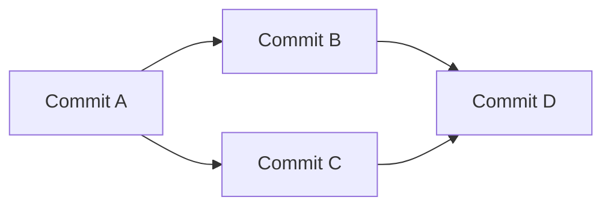
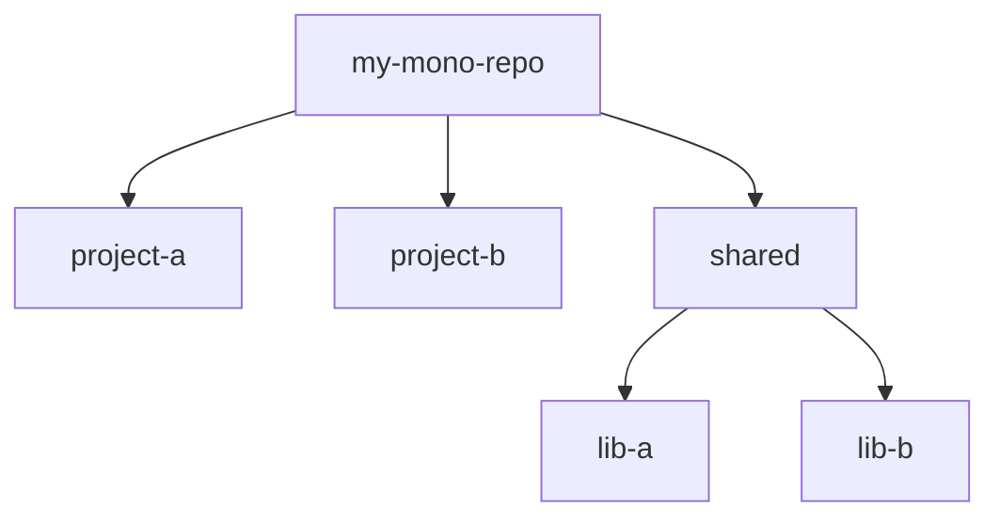
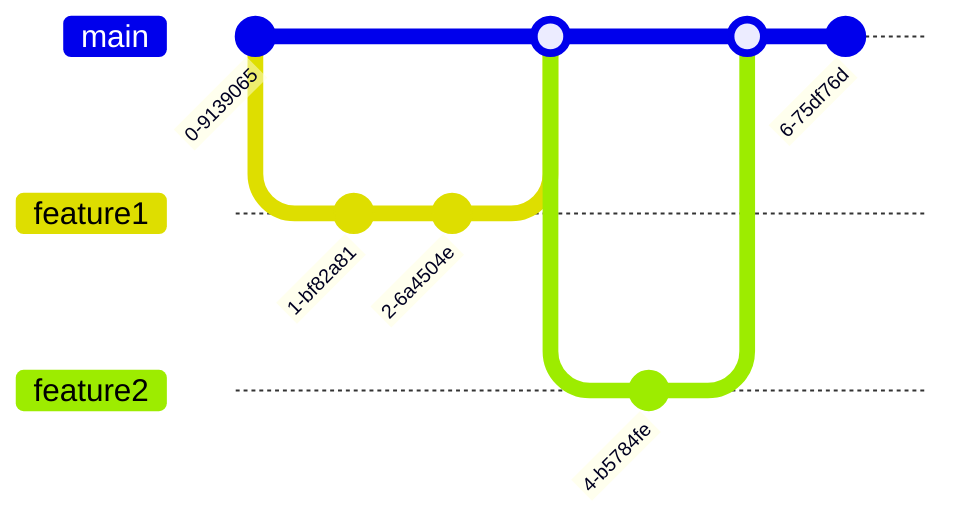

# Mastering Git Mono Repositories: A Practical, Example-Rich Tutorial 

## Introduction to Mono Repositories

Welcome to the world of mono repositories! In this tutorial, you'll learn how to use Git to manage large codebases efficiently using the mono repo approach.

> 📘 **What is a Mono Repo?**
> A mono repo is a single repository that contains all the code for multiple projects or components of an application. This is in contrast to having separate repositories for each project.

Mono repos offer several benefits:
- Simplified code sharing and reuse across projects
- Easier dependency management and atomic changes 
- Streamlined collaboration among teams

> 💡 **Real-World Examples**
> Many large tech companies like Google and Facebook use mono repos to manage their massive codebases. For example:
> - Google's mono repo contains over 2 billion lines of code!
> - Microsoft's Windows codebase is a mono repo with over 3.5 million files.

In this tutorial, you'll learn both the fundamental concepts and advanced techniques for mastering Git mono repos. Let's get started!

## Git Architecture Basics
Before diving into mono repos, let's review some key concepts of Git's architecture. 

> 🌿 **Git's Graph Structure**
> At its core, Git uses a directed acyclic graph (DAG) to represent the history of a codebase:
> - Each node in the graph is a commit
> - Edges represent the parent-child relationships between commits



Git also uses a content-addressable file system. This means files are stored based on their contents, not their names. 

> 🗃️ **Content-Addressable Storage**
> Imagine a library where books are shelved based on their content rather than titles. Books with the same content can be referenced using a single "content address". 
> 
> This allows Git to efficiently store multiple versions of files without duplicating content.

Quiz:
Q: How does Git efficiently store multiple versions of files?
A: By using a content-addressable file system to deduplicate storage of identical content.

## Setting Up a Mono Repo
Now let's see how to set up a Git mono repo. We'll start with an example:

```bash
# Create a new directory for the mono repo
mkdir my-mono-repo
cd my-mono-repo

# Initialize a new Git repository 
git init

# Create subdirectories for each project
mkdir project-a
mkdir project-b

# Add some files 
echo "This is Project A" > project-a/README.md
echo "This is Project B" > project-b/README.md
```

> 🌳 **Mono Repo Structure**
> A typical mono repo structure has:
> - A top-level directory for the entire repo
> - Subdirectories for each project or component
> - Shared directories for common libraries or assets



Challenge: Add a third project called `project-c` to the mono repo with its own README file.

## Managing Dependencies
A key aspect of working with mono repos is managing dependencies between projects. There are a few ways to do this with Git.

> 🧩 **Git Submodules**
> A submodule allows you to include one Git repo inside another as a subdirectory, while keeping their histories separate. 
>
> This is useful for pulling in external dependencies that are actively developed in their own repos.

For example, let's say `project-a` depends on a library stored in a separate repo. We can add it as a submodule:

```bash
cd project-a
git submodule add https://github.com/my-org/my-library.git lib/my-library
```

> 🌿 **Git Subtrees**
> An alternative to submodules is Git subtrees, which allow you to merge the content of one repo into a subdirectory of another. 
>
> Unlike submodules, subtrees do not maintain separate histories. This makes them easier to manage, but less flexible for pulling in updates.

Challenge: Add the `my-library` repo as a subtree in `project-b`.

## Collaboration Workflows 
Collaborating on a mono repo often involves creating feature branches, submitting pull requests, and performing code reviews before merging changes.

> 🌊 **The GitHub Flow**
> A popular workflow for mono repos is the "GitHub Flow":
> 1. Create a new branch for each feature or fix
> 2. Make changes and commit them to the branch
> 3. Open a pull request to propose merging the changes
> 4. Discuss and review the changes
> 5. Merge the pull request into the main branch


Here's an example of this flow:

1. Create a new feature branch:
   ```bash 
   git checkout -b feature/add-search
   ```

2. Make changes and commit them:
   ```bash
   # Make changes to files
   git add .
   git commit -m "Implement search feature"
   ```

3. Push the feature branch to the remote repo:
   ```bash
   git push -u origin feature/add-search 
   ```

4. Open a pull request to merge the changes into the main branch.

5. After the PR is reviewed and approved, merge the changes:
   ```bash
   git checkout main
   git merge feature/add-search
   ```

> 🔒 **Access Control**
> To manage permissions in a mono repo, you can use branch protection rules to restrict who can push to specific branches. 
>
> Many Git hosting services like GitHub, GitLab, and Bitbucket provide this feature.

Quiz:
Q: What is the purpose of a pull request?
A: To propose and discuss changes before merging them into the main branch.

## Advanced Techniques
As your mono repo grows, you may encounter performance issues with common Git operations like cloning and fetching. 

> 🏎️ **Scaling Mono Repos**
> Here are some techniques to optimize Git performance in large mono repos:
> - Use shallow cloning to fetch only recent history 
> - Use `git-filter-repo` to rewrite history and remove cruft
> - Break up large files using Git LFS (Large File Storage) 
> - Use sparse checkouts to only retrieve needed files

For example, to perform a shallow clone of the last 10 commits:

```bash
git clone --depth 10 https://github.com/my-org/my-mono-repo.git
```

> 🗑️ **Cleaning Up History**
> Over time, a mono repo can accumulate a lot of unused files and directories in its history. This bloats the repo size and slows down Git operations.
>
> Tools like `git filter-repo` allow you to rewrite Git history to remove unwanted files, while preserving the changes to other files.

Challenge: Use `git filter-repo` to remove a large unused asset directory from the entire history of a mono repo.

## Mono Repo Workflows
There are several common workflows used with mono repos, such as:

> 🌿 **Trunk-Based Development**
> In this model, all changes are committed to a single "trunk" branch (e.g. `main`). Feature branches are used for short-lived development work and merged back frequently.
>
> This keeps the main branch in a releasable state and avoids long-running divergent branches.



> 🚂 **Release Trains**
> Some organizations use a "release train" approach, where changes are batched into scheduled releases. 
>
> Each release is cut from the `main` branch at a predetermined time, and any changes that miss the cutoff wait for the next release.

Regardless of the specific workflow, it's important to establish clear conventions for things like:

- Branch naming (e.g. `feature/`, `bugfix/`, `hotfix/`)
- Commit message format 
- Pull request templates
- Release tagging (e.g. `v1.2.3`)

> 📏 **Conventions are Key**
> With many developers working in the same codebase, consistency is critical. Agreed-upon conventions help keep the mono repo tidy and navigable as it grows.
>
> Some teams even use tools like linters and Git hooks to automatically enforce conventions.

## Conclusion
Congratulations! You now have a solid foundation in using Git with mono repos. 

To recap, we covered:
- Benefits and use cases of mono repos
- Setting up and structuring a mono repo
- Managing dependencies with submodules and subtrees
- Collaboration workflows and access control
- Advanced techniques for scaling mono repos
- Common mono repo workflows and best practices

> 🌱 **Keep Growing**
> Mastering Git is an ongoing journey. As you work with mono repos, you'll continue to learn new techniques and best practices. 
>
> Stay curious, keep experimenting, and don't hesitate to ask for help from the community!

For further learning, check out these resource:

- [Atlassian's guide to Monorepos](https://www.atlassian.com/git/tutorials/monorepos) in Git

Now you're ready to apply these skills to your own projects. Happy coding!

