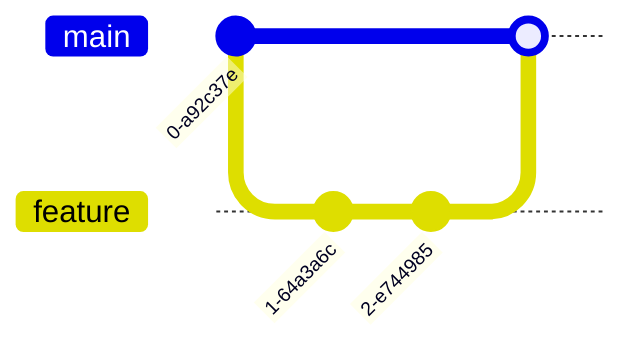
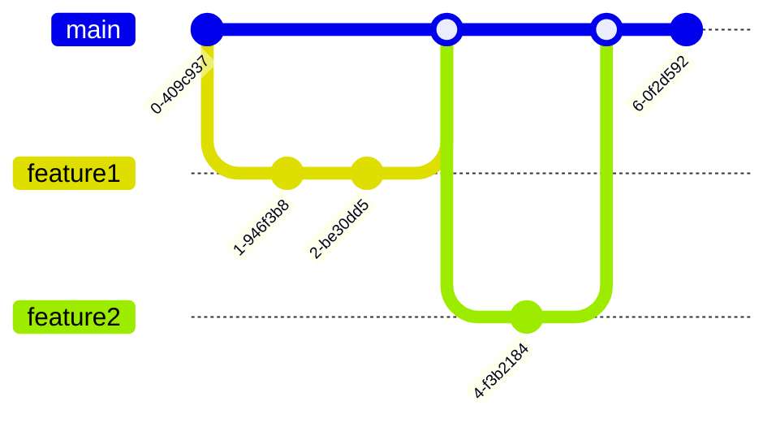

# Mastering Git Mono Repositories: A Practical, Example-Rich Tutorial

## Introduction to Mono Repositories

In the world of software development, the management of large codebases can be a daunting task. Enter the concept of mono repositories, a powerful approach that can revolutionize the way you organize and maintain your projects.

A mono repository, or mono repo, is a single Git repository that houses the code for multiple projects or components of an application. This is in contrast to the traditional approach of having separate repositories for each individual project.

> 📘 **What is a Mono Repo?**
> A mono repo is a single Git repository that contains all the code for multiple projects or components of an application. This centralized approach offers several key benefits:
>
> - **Simplified Code Sharing and Reuse**: With all the code in a single repository, it becomes easier to share and reuse code across different projects.
> - **Easier Dependency Management**: Managing dependencies between projects is streamlined when they are all part of the same mono repo.
> - **Streamlined Collaboration**: Teams can work more efficiently when they have a unified codebase to collaborate on.

> 💡 **Real-World Examples**
> Many of the world's largest tech companies have embraced the power of mono repos to manage their massive codebases. For example:
>
> - Google's mono repo contains over 2 billion lines of code!
> - Microsoft's Windows codebase is a mono repo with over 3.5 million files.

In this comprehensive tutorial, you'll learn the fundamental concepts and advanced techniques for mastering Git mono repos. Whether you're a seasoned developer or just starting your journey, this guide will equip you with the knowledge and skills to effectively manage large-scale projects using the mono repo approach.

## Git Architecture Basics

Before diving into the specifics of mono repos, let's review some key concepts of Git's underlying architecture. Understanding these foundational principles will provide a solid foundation for your journey into the world of mono repos.

> 🌿 **Git's Graph Structure**
> At its core, Git uses a directed acyclic graph (DAG) to represent the history of a codebase. In this graph:
>
> - Each node represents a commit
> - The edges between nodes represent the parent-child relationships between commits


Git also employs a content-addressable file system, which means that files are stored based on their contents, not their names. This unique approach allows Git to efficiently store multiple versions of files without duplicating content.

> 🗃️ **Content-Addressable Storage**
> Imagine a library where books are shelved based on their content rather than their titles. Books with the same content can be referenced using a single "content address".
>
> This content-addressable storage system enables Git to store multiple versions of files without duplicating the underlying data, making it a highly efficient and space-saving solution.

Quiz:
Q: How does Git efficiently store multiple versions of files?
A: By using a content-addressable file system to deduplicate storage of identical content.

## Setting Up a Mono Repo

Now that you have a solid understanding of Git's architecture, let's dive into the practical aspects of setting up a mono repo. We'll start with a step-by-step example:

```bash
# Create a new directory for the mono repo
mkdir my-mono-repo
cd my-mono-repo

# Initialize a new Git repository
git init

# Create subdirectories for each project
mkdir project-a
mkdir project-b

# Add some files
echo "This is Project A" > project-a/README.md
echo "This is Project B" > project-b/README.md
```

> 🌳 **Mono Repo Structure**
> A typical mono repo structure has the following key components:
>
> - A top-level directory for the entire repository
> - Subdirectories for each individual project or component
> - Shared directories for common libraries, assets, or other resources


Challenge: Add a third project called `project-c` to the mono repo with its own README file.

## Managing Dependencies

One of the key aspects of working with mono repos is managing dependencies between the various projects and components within the repository. Git provides two primary mechanisms for handling dependencies: submodules and subtrees.

> 🧩 **Git Submodules**
> Git submodules allow you to include one Git repository inside another as a subdirectory, while maintaining separate histories for each repository.
>
> This approach is particularly useful when you need to pull in external dependencies that are actively developed in their own repositories.

For example, let's say `project-a` depends on a library stored in a separate repository. We can add it as a submodule:

```bash
cd project-a
git submodule add https://github.com/my-org/my-library.git lib/my-library
```

> 🌿 **Git Subtrees**
> An alternative to submodules is Git subtrees, which allow you to merge the content of one repository into a subdirectory of another.
>
> Unlike submodules, subtrees do not maintain separate histories. This makes them easier to manage, but less flexible for pulling in updates from the original repository.

Challenge: Add the `my-library` repository as a subtree in `project-b`.

## Collaboration Workflows

Collaborating on a mono repo often involves creating feature branches, submitting pull requests, and performing code reviews before merging changes. One popular workflow for this process is the "GitHub Flow".

> 🌊 **The GitHub Flow**
> The GitHub Flow is a widely adopted collaboration workflow for mono repos:
>
> 1. Create a new branch for each feature or bug fix
> 2. Make changes and commit them to the feature branch
> 3. Open a pull request to propose merging the changes
> 4. Discuss and review the changes with the team
> 5. Merge the pull request into the main branch



Here's an example of how this workflow might look in practice:

1. Create a new feature branch:
   ```bash
   git checkout -b feature/add-search
   ```

2. Make changes and commit them:
   ```bash
   # Make changes to files
   git add .
   git commit -m "Implement search feature"
   ```

3. Push the feature branch to the remote repository:
   ```bash
   git push -u origin feature/add-search
   ```

4. Open a pull request to merge the changes into the main branch.

5. After the pull request is reviewed and approved, merge the changes:
   ```bash
   git checkout main
   git merge feature/add-search
   ```

> 🔒 **Access Control**
> To manage permissions in a mono repo, you can use branch protection rules to restrict who can push to specific branches.
>
> Many Git hosting services, such as GitHub, GitLab, and Bitbucket, provide built-in support for setting up these access control measures.

Quiz:
Q: What is the purpose of a pull request?
A: The purpose of a pull request is to propose and discuss changes before merging them into the main branch.

## Advanced Techniques

As your mono repo grows in size and complexity, you may encounter performance issues with common Git operations like cloning and fetching. Fortunately, there are several advanced techniques you can use to optimize the performance of your mono repo.

> 🏎️ **Scaling Mono Repos**
> Here are some techniques to help scale and optimize the performance of large mono repos:
>
> - **Shallow Cloning**: Use the `--depth` option when cloning to fetch only the recent commit history, reducing the time and storage required.
> - **Git Filter-Repo**: Rewrite the Git history to remove unwanted files and directories, reducing the overall repository size.
> - **Git LFS (Large File Storage)**: Use Git LFS to store large binary files, such as media assets, separately from the main repository.
> - **Sparse Checkouts**: Retrieve only the files and directories you need, rather than the entire repository, to speed up operations.

For example, to perform a shallow clone of the last 10 commits:

```bash
git clone --depth 10 https://github.com/my-org/my-mono-repo.git
```

> 🗑️ **Cleaning Up History**
> Over time, a mono repo can accumulate a significant amount of unused files and directories in its history. This can lead to a bloated repository size and slower Git operations.
>
> Tools like `git-filter-repo` allow you to rewrite the Git history to remove these unwanted elements, while preserving the changes to other files.

Challenge: Use `git-filter-repo` to remove a large unused asset directory from the entire history of a mono repo.

## Mono Repo Workflows

When working with mono repos, there are several common workflows that teams can adopt to manage their codebase effectively. Two popular approaches are "trunk-based development" and the "release train" model.

> 🌿 **Trunk-Based Development**
> In the trunk-based development model, all changes are committed directly to the main branch (e.g., `main`). Feature branches are used for short-lived development work and are frequently merged back into the main branch.
>
> This approach keeps the main branch in a releasable state and avoids the challenges of managing long-running, divergent feature branches.



> 🚂 **Release Trains**
> Another common workflow for mono repos is the "release train" approach. In this model, changes are batched into scheduled releases, with each release cut from the main branch at a predetermined time.
>
> Any changes that miss the cutoff for a particular release will have to wait for the next scheduled release.

Regardless of the specific workflow you choose, it's essential to establish clear conventions and guidelines for your mono repo, such as:

- Branch naming (e.g., `feature/`, `bugfix/`, `hotfix/`)
- Commit message formatting
- Pull request templates
- Release tagging (e.g., `v1.2.3`)

> 📏 **Conventions are Key**
> With multiple developers working on a shared codebase, consistency is critical. Agreed-upon conventions help keep the mono repo tidy and navigable as it grows.
>
> Some teams even use tools like linters and Git hooks to automatically enforce these conventions.

## Conclusion

Congratulations! You've now gained a solid foundation in the world of Git mono repositories. Let's recap the key takeaways from this tutorial:

- Mono repos offer several benefits, including simplified code sharing, easier dependency management, and streamlined collaboration.
- Git's underlying architecture, including the directed acyclic graph (DAG) and content-addressable storage, enables efficient management of large codebases.
- Setting up a mono repo involves creating a top-level directory and subdirectories for individual projects, with shared directories for common resources.
- Dependency management in mono repos can be handled using Git submodules or subtrees, each with their own advantages and trade-offs.
- Collaboration workflows, such as the GitHub Flow, involve creating feature branches, submitting pull requests, and merging changes after review.
- Advanced techniques, like shallow cloning, `git-filter-repo`, Git LFS, and sparse checkouts, can help scale and optimize the performance of large mono repos.
- Common mono repo workflows, such as trunk-based development and release trains, provide different approaches to managing the codebase.

> 🌱 **Keep Growing**
> Mastering Git and mono repos is an ongoing journey. As you work with these tools, you'll continue to learn new techniques and best practices.
>
> Stay curious, keep experimenting, and don't hesitate to reach out to the community for help and guidance. The more you explore, the more you'll grow as a Git expert.

For further learning, be sure to check out the [Atlassian guide to Monorepos](https://www.atlassian.com/git/tutorials/monorepos) in Git. Happy coding!