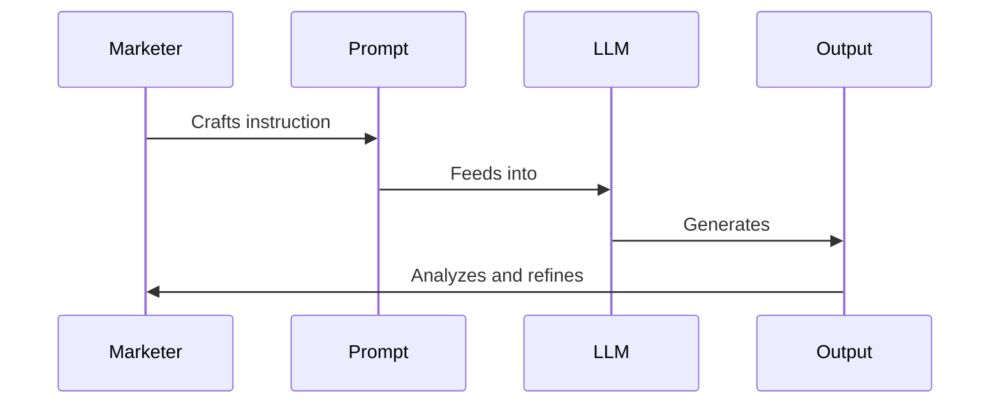

# Zero to Hero: Prompt Engineering for Marketers

### 1. Introduction

#### Why LLM Prompt Engineering Matters for Marketers

Imagine you're a chef in a Michelin-starred restaurant. Your ingredients are top-notch, your kitchen is state-of-the-art, but your ability to combine these elements into a masterpiece? That's where the magic happens. In the world of modern marketing, Large Language Models (LLMs) are your high-end kitchen, and prompt engineering is your culinary expertise.

But why should you, as a marketer, care about LLM prompt engineering? 

Picture this: You're tasked with creating a viral social media campaign for a new product launch. Traditionally, you'd spend days brainstorming, researching trends, and crafting messages. Now, imagine having an AI assistant that can generate hundreds of creative ideas, tailor messages to specific audience segments, and even predict potential engagement rates – all within minutes. That's the power of mastering LLM prompt engineering.

> 🧠 Pause and Reflect: Think about a recent marketing campaign you worked on. How much time did you spend on ideation and content creation? How might LLM prompt engineering have impacted that process?

LLM prompt engineering is not just a fancy tech term; it's a game-changer that can:
- Supercharge your creativity
- Dramatically reduce time-to-market for campaigns
- Enable hyper-personalization at scale
- Provide data-driven insights for strategy refinement

In essence, it's like having a marketing team of hundreds at your fingertips, ready to brainstorm, create, and analyze 24/7.

#### The What: Understanding LLM Prompt Engineering

So, what exactly is LLM prompt engineering? Let's break it down:

1. **LLMs (Large Language Models)**: Think of these as incredibly smart, well-read assistants. They've "read" vast amounts of text from the internet and can generate human-like text based on the input they receive.

2. **Prompts**: These are the instructions or questions you give to the LLM. It's like the brief you'd give to your marketing team.

3. **Prompt Engineering**: This is the art and science of crafting these instructions in a way that gets you the best possible output from the LLM.

Here's a simple diagram to visualize the process:



> 💡 Pro Tip: Think of prompt engineering as having a conversation with a brilliant but literal-minded colleague. The clearer and more specific you are, the better results you'll get.

Now that we understand the 'why' and 'what' of LLM prompt engineering for marketers, let's dive into how you can start applying this powerful tool to revolutionize your marketing efforts.

### 2. Getting Started

#### The Basics of Prompt Construction

Let's start with a simple analogy. Crafting a prompt is like giving directions to a tourist in your city. The more precise and contextual your instructions, the more likely they are to reach their destination successfully.

Every effective prompt consists of three key elements:

1. **Context**: The background information or setting for your request.
2. **Instruction**: The specific task or question you want the LLM to address.
3. **Input**: Any additional information or parameters for the task.

Let's look at a basic example:

```
Context: You are a marketing specialist for a sustainable fashion brand.
Instruction: Write a product description for our new eco-friendly jeans.
Input: The jeans are made from recycled ocean plastic and organic cotton. They come in three colors: Ocean Blue, Sandy Beige, and Coral Red. The target audience is environmentally conscious millennials.
```

This prompt provides clear context (sustainable fashion brand), a specific instruction (write a product description), and relevant input (material, colors, target audience).

> 🏋️ Quick Exercise: Try crafting a similar prompt for a product or service you're familiar with. Remember to include context, instruction, and input.

#### Understanding LLM "Thinking"

To master prompt engineering, it's crucial to understand how LLMs "think". Imagine you're teaching a highly intelligent alien about Earth culture. This alien has read every book, article, and website about Earth but has never actually experienced it firsthand. That's similar to how an LLM operates.

Key points to remember:
- LLMs don't have real-world experience or up-to-the-minute knowledge.
- They excel at pattern recognition and language generation based on their training data.
- They can be creative but need guidance to align with specific goals or brand voices.

Let's look at an example of refining a vague marketing prompt:

Vague prompt:
```
Write something catchy for our new product.
```

Refined prompt:
```
Context: You are a copywriter for a tech company launching a new smartwatch.
Instruction: Create five catchy taglines for our new smartwatch that emphasize its health monitoring features and sleek design.
Input: The smartwatch can monitor heart rate, sleep patterns, and stress levels. It has a slim profile and comes in brushed metal finishes. Our brand voice is innovative yet approachable.
```

The refined prompt provides the LLM with much more context and specific instructions, leading to more relevant and usable outputs.

> 💡 Pro Tip: Always start with a more detailed prompt than you think you need. It's easier to simplify later than to add specificity to vague results.

As we move forward, we'll explore more advanced techniques and marketing-specific applications. Remember, the key to becoming a prompt engineering expert is practice and iteration. Each interaction with an LLM is an opportunity to refine your skills.

### 3. Advanced Techniques

#### Leveraging Context for Better Results

Now that we've covered the basics, let's dive deeper into the power of context in prompt engineering. Think of context as the stage setting for a play. The richer and more detailed the set, the more immersive and believable the performance.

In marketing, context is crucial for generating content that resonates with your target audience and aligns with your brand voice. Here's how you can leverage context effectively:

1. **Brand Guidelines**: Include key elements of your brand voice, values, and style guide in your prompts.
2. **Audience Insights**: Incorporate demographic and psychographic information about your target audience.
3. **Campaign Goals**: Clearly state the objectives of your marketing campaign.
4. **Competitive Landscape**: Provide information about your market position and key competitors.

Let's look at an example of a context-rich prompt for creating a targeted ad campaign:

```
Context: You are the lead copywriter for GreenLeaf, an eco-friendly home cleaning products company. Our brand voice is friendly, informative, and empowering. We're launching a new line of biodegradable cleaning wipes.

Target Audience: Environmentally conscious millennials and Gen Z consumers, aged 25-40, living in urban areas. They value sustainability but also convenience in their busy lives.

Campaign Goal: Increase awareness of our new product line and drive online sales through social media advertising.

Competitive Landscape: Our main competitors are BigClean and EcoShine. BigClean is known for strong cleaning power but uses harsh chemicals. EcoShine is eco-friendly but perceived as less effective.

Instruction: Create a series of three short, compelling ad copies (max 50 words each) for Instagram that highlight the convenience and eco-friendliness of our new biodegradable cleaning wipes. Each ad should include a clear call-to-action.

Input: Product USPs: 100% biodegradable, plastic-free packaging, effective against 99.9% of bacteria, pleasant lavender scent.
```

This prompt provides rich context that allows the LLM to generate highly targeted and effective ad copies.

> 🧠 Pause and Reflect: Think about a marketing campaign you're currently working on. What additional context could you provide to make your prompts more effective?

#### Mastering Instruction Crafting

Crafting clear and effective instructions is like being a great project manager. You need to be specific about what you want, but also leave room for creativity and problem-solving.

There are three main types of instructions you can use in your prompts:

1. **Open-ended**: Encourage creative exploration.
   Example: "Generate innovative ideas for a viral social media challenge to promote our new product."

2. **Specific**: Provide clear guidelines for a particular task.
   Example: "Write a 280-character tweet announcing our summer sale, including the hashtag #SummerSavings."

3. **Multi-step**: Break down complex tasks into manageable steps.
   Example: "First, analyze our top 5 performing blog posts. Then, identify common themes. Finally, propose 3 new blog post ideas based on these insights."

Let's look at an example of a well-crafted instruction for creating a social media content strategy:

```
Context: You are a social media strategist for FitLife, a fitness app targeting busy professionals aged 30-50. Our brand voice is motivational, practical, and science-based.

Instruction: Develop a 4-week social media content strategy for Instagram to promote our new "15-minute Workouts" feature. Follow these steps:

1. Create a content theme for each week, aligned with the benefits of short, effective workouts.
2. For each theme, propose 3 post ideas: one educational, one motivational, and one user-generated content prompt.
3. Suggest relevant hashtags for each post (5-7 hashtags per post).
4. Outline a brief caption structure for each post type (educational, motivational, UGC prompt).

Input: Key features of "15-minute Workouts": scientifically designed for maximum efficiency, adaptable to home or office environments, requires minimal equipment.
```

This multi-step instruction provides clear guidance while allowing room for creativity in content ideation.

> 💡 Pro Tip: When crafting instructions, use action verbs (create, analyze, develop) and be specific about the format or structure you want in the output.

As you practice these advanced techniques, you'll find that your prompts become more sophisticated and your outputs more aligned with your marketing objectives. In the next section, we'll explore how to apply these skills to specific marketing tasks.

### 4. Marketing-Specific Applications

Now that we've honed our prompt engineering skills, let's apply them to some common marketing tasks. This is where the rubber meets the road, and you'll start seeing the transformative power of LLM prompt engineering in your day-to-day work.

#### Content Creation and Curation

Content is king in the digital marketing world, but creating high-quality, engaging content consistently can be challenging. LLMs can be your secret weapon in this arena.

Here's an example of how you might use prompt engineering for generating a series of tweets for a product launch:

```
Context: You are the social media manager for TechNovaX, a cutting-edge tech company known for innovative smartphones. We're launching our new model, the TechNovaX Quantum, which features breakthrough quantum computing technology for unparalleled mobile performance.

Instruction: Create a series of 5 tweets to build excitement for our TechNovaX Quantum launch. Follow these guidelines:
1. Each tweet should be under 280 characters.
2. Incorporate our brand voice: futuristic, confident, and slightly mysterious.
3. Focus on different aspects: innovation, performance, user experience, design, and a teaser.
4. Include relevant hashtags and a call-to-action in each tweet.
5. Ensure a cohesive narrative across all tweets that builds anticipation.

Input: 
- Launch date: September 15th
- Key features: Quantum core processor, 1TB storage, 2-day battery life, holographic display
- Tagline: "The Future, Quantified"
- Website: technova-x.com/quantum
```

This prompt provides clear instructions for creating a cohesive series of tweets that align with the brand voice and marketing objectives.

> 🏋️ Quick Exercise: Try crafting a similar prompt for a content series (blog posts, social media updates, email newsletter) for a product or service you're familiar with.

#### Customer Segmentation and Personalization

Personalization is no longer a luxury in marketing; it's an expectation. LLMs can help you create detailed buyer personas and craft personalized marketing messages at scale.

Let's look at an example of using an LLM to develop buyer personas:

```
Context: You are a market research analyst for GreenCommute, an eco-friendly ride-sharing app. We want to create detailed buyer personas to inform our marketing strategy.

Instruction: Develop 3 distinct buyer personas for GreenCommute users. For each persona, provide:
1. Demographic information (age, gender, occupation, incomeCertainly! I'll continue with the article from where we left off.

```
1. Demographic information (age, gender, occupation, income level, location)
2. Psychographic details (values, interests, lifestyle, pain points)
3. Technology usage habits
4. Preferred communication channels
5. Key motivations for using an eco-friendly ride-sharing service
6. Potential objections or concerns

Input: 
- Our app is available in major urban areas
- Key features: carbon offset for each ride, option to share rides with like-minded individuals, integration with public transport for mixed-mode journeys
- User survey data shows high interest among young professionals and environmentally conscious individuals
```

This prompt guides the LLM to create comprehensive buyer personas that can inform targeted marketing strategies.

> 💡 Pro Tip: Use the output from this persona-generation prompt as input for creating personalized marketing messages for each segment.

Here's an example of how you might use these personas to create personalized email subject lines:

```
Context: You are the email marketing specialist for GreenCommute. We're launching a new feature that allows users to track their personal carbon savings.

Instruction: Using the three buyer personas we developed (refer to them as Persona A, B, and C), create 3 different email subject lines announcing our new carbon tracking feature. Each subject line should appeal to the specific motivations and interests of the persona.

Input: 
- Feature name: EcoImpact Tracker
- Key benefit: Users can see their cumulative carbon savings and compare with friends
- Launch date: Next Monday

This approach allows you to craft personalized messages that resonate with different segments of your audience, potentially increasing open rates and engagement.

### 5. Overcoming Common Challenges

As you become more proficient in LLM prompt engineering, you'll inevitably encounter some challenges. Let's address two of the most common ones: dealing with biases and inaccuracies, and ensuring brand consistency.

#### Dealing with Biases and Inaccuracies

LLMs, despite their power, are not infallible. They can produce biased or inaccurate information based on their training data. As a marketer, it's crucial to be aware of these limitations and implement strategies to mitigate them.

Consider this scenario: You're using an LLM to analyze market trends for a new product launch. Here's how you might craft a prompt to address potential biases:

```
Context: You are a market analyst providing insights for the launch of a new smartwatch designed for seniors. Be aware that tech product analysis often skews towards younger demographics.

Instruction: Analyze the market potential for our senior-focused smartwatch. In your analysis:
1. Explicitly consider the needs and preferences of users aged 65 and above.
2. Highlight any data or assumptions that might be biased towards younger users.
3. Suggest methods to gather more accurate data on our target demographic.
4. Provide a balanced view of both opportunities and challenges in this market.

Input: 
- Key features: large, easy-to-read display, emergency alert function, simplified interface
- Competitor products are mostly targeted at users under 50
- Recent studies show increasing technology adoption among seniors
```

This prompt acknowledges potential biases upfront and asks the LLM to actively consider and address them in its analysis.

> 🧠 Pause and Reflect: Think about a recent marketing analysis you conducted. Were there any potential biases in your approach? How could you use prompt engineering to address these in the future?

#### Ensuring Brand Consistency

Maintaining a consistent brand voice across all AI-generated content is crucial. One effective strategy is to create a "brand voice" prompt that you can use as a prefix for other marketing-related prompts.

Here's an example:

```
Context: You are the AI writing assistant for EcoTech Solutions, a company that develops sustainable technology products. Our brand voice is:
- Innovative yet accessible: We explain complex tech concepts in simple terms
- Optimistic: We focus on positive solutions to environmental challenges
- Empowering: We encourage our customers to take action for a sustainable future
- Credible: We back our claims with scientific data and research

When generating any content for EcoTech Solutions, ensure it aligns with these brand voice guidelines. If you're unsure if the content matches our voice, err on the side of caution and ask for clarification.

Instruction: Keep this brand voice in mind for all future prompts related to EcoTech Solutions. Respond with "Understood, I will maintain the EcoTech Solutions brand voice in all relevant content generation tasks." if you comprehend these guidelines.
```

Once you've established this brand voice prompt, you can refer back to it in subsequent prompts:

```
Referring to the EcoTech Solutions brand voice guidelines, write a 100-word product description for our new solar-powered smartphone charger.
```

This approach helps maintain consistency across all your AI-generated marketing content.

### 6. Measuring and Optimizing Performance

As with any marketing effort, it's crucial to measure the performance of your LLM-generated content and continuously optimize your prompts for better results.

#### Key Metrics for Prompt Success

When evaluating the success of your prompts, consider these metrics:

1. **Relevance**: How well does the output align with your marketing objectives?
2. **Coherence**: Is the generated content logical and well-structured?
3. **Engagement**: How does the audience respond to the AI-generated content compared to human-written content?
4. **Efficiency**: How much time are you saving by using LLM prompt engineering?

Here's an example of how you might use prompt engineering to optimize an email subject line:

```
Context: You are the email marketing specialist for FitLife, the fitness app we discussed earlier. We're running an A/B test on email subject lines for our monthly newsletter.

Instruction: Generate 5 variations of an email subject line for our monthly newsletter. The subject line should encourage opens and align with our brand voice (motivational, practical, science-based). After generating the subject lines, provide a brief explanation of why each might be effective.

Input:
- Newsletter content: New HIIT workout plan, success story from a user who lost 30 pounds, tips for healthy meal prep
- Target audience: Busy professionals aged 30-50
- Previous best-performing subject line: "3 Science-Backed Ways to Boost Your Fitness This Week"
```

You can then use these AI-generated subject lines in your A/B tests to determine which performs best with your audience.

> 💡 Pro Tip: Keep a log of your prompts and their corresponding performance metrics. This will help you identify patterns in what works best for your specific use cases.

#### Iterative Improvement Strategies

Improving your prompt engineering skills is an iterative process. Here's a simple framework you can follow:

1. Start with a basic prompt
2. Analyze the output
3. Identify areas for improvement
4. Refine the prompt
5. Repeat steps 2-4 until satisfied

Let's look at an example of this process for refining a prompt for a customer survey:

Initial Prompt:
```
Write 5 questions for a customer satisfaction survey for our eco-friendly cleaning products.
```

Output Analysis: The questions generated are too generic and don't capture specific aspects of our products or brand values.

Refined Prompt:
```
Context: You are the customer research lead for GreenLeaf, the eco-friendly home cleaning products company. We want to gauge customer satisfaction with our new line of biodegradable cleaning wipes.

Instruction: Create 5 survey questions that will help us understand:
1. Customer satisfaction with the product's cleaning effectiveness
2. Perception of the product's eco-friendliness
3. Likelihood to recommend the product to others
4. Any suggestions for improvement
5. How the product compares to competitors

Ensure the questions align with our brand voice (friendly, informative, empowering) and use a mix of multiple-choice and open-ended formats.

Input:
- Product features: 100% biodegradable, plastic-free packaging, effective against 99.9% of bacteria, pleasant lavender scent
- Target audience: Environmentally conscious consumers aged 25-40
```

This refined prompt is much more likely to generate relevant, specific survey questions that will provide valuable insights for your business.

As we conclude this comprehensive guide to LLM prompt engineering for marketers, remember that becoming proficient in this skill is a journey. Each prompt you craft is an opportunity to learn and improve.

### 7. Ethical Considerations and Best Practices

As we harness the power of AI in marketing, it's crucial to consider the ethical implications and adhere to best practices. This ensures that we're not only effective but also responsible in our use of this technology.

#### Responsible Use of AI in Marketing

When using LLMs for marketing purposes, consider the following ethical guidelines:

1. **Transparency**: Be open about your use of AI in content creation. This builds trust with your audience.
2. **Accuracy**: Always fact-check AI-generated content, especially for claims or statistics.
3. **Privacy**: Ensure that you're not using personal data in prompts without proper consent.
4. **Fairness**: Regularly audit your prompts and outputs for potential biases.

Here's an example of how you might create an AI usage policy for your marketing team:

```
Context: You are the Chief Ethics Officer at a digital marketing agency that uses AI tools, including LLMs, in its work.

Instruction: Draft a concise AI usage policy for our marketing team. The policy should cover:
1. Transparency in AI use
2. Guidelines for fact-checking AI-generated content
3. Data privacy considerations
4. Processes for auditing AI outputs for bias
5. Ethical considerations in AI-driven personalization

The policy should be clear, actionable, and align with industry best practices.

Input:
- We primarily use AI for content generation, market analysis, and personalization
- Our client base includes companies in various industries, including healthcare and finance
- We are committed to maintaining the highest ethical standards in our work
```

This prompt will help you create a foundational AI ethics policy that you can refine and expand as needed.

#### Future-Proofing Your Skills

The field of AI and LLMs is rapidly evolving. To stay ahead of the curve:

1. **Continuous Learning**: Regularly update your knowledge about new LLM capabilities and prompt engineering techniques.
2. **Experimentation**: Don't be afraid to try new approaches and push the boundaries of what's possible with LLMs.
3. **Community Engagement**: Participate in forums, webinars, and conferences focused on AI in marketing.
4. **Balancing AI and Human Creativity**: Remember that AI is a tool to enhance, not replace, human creativity. The most effective marketing strategies will likely combine both.

Here's a prompt to help you develop a learning roadmap:

```
Context: You are a professional development coach specializing in AI and marketing.

Instruction: Create a 6-month learning roadmap for a marketing professional looking to master LLM prompt engineering and stay updated with AI advancements in marketing. The roadmap should include:
1. Key topics to study (with a brief explanation of why each is important)
2. Suggested resources (online courses, books, podcasts, etc.)
3. Practical exercises or projects to reinforce learning
4. Milestones to track progress

Input:
- The learner has basic familiarity with AI concepts
- They are particularly interested in applications for content creation and market analysis
- They have approximately 5 hours per week to dedicate to this learning

This roadmap will provide a structured approach to continuously improving your LLM prompt engineering skills and staying abreast of AI developments in marketing.
```

### 8. Conclusion

Congratulations! You've just completed a crash course in LLM prompt engineering for marketers. Let's recap the key points:

1. LLM prompt engineering is a powerful tool that can revolutionize your marketing efforts, from content creation to customer segmentation.
2. Effective prompts consist of clear context, specific instructions, and relevant input.
3. Advanced techniques like leveraging rich context and mastering instruction crafting can significantly improve your results.
4. Always be aware of potential biases and strive for brand consistency in your AI-generated content.
5. Measure and optimize your prompts iteratively for the best performance.
6. Consider ethical implications and stay updated with the latest developments in AI and marketing.

Now, it's time to put your new skills into action. Here's your 24-hour challenge:

> 🚀 Action Item: Within the next 24 hours, use LLM prompt engineering to tackle a real marketing task you're currently facing. It could be drafting social media posts, creating a buyer persona, or analyzing a market trend. Write down the prompt you use, analyze the output, and reflect on how you could improve the prompt for better results next time.

Remember, becoming a master at LLM prompt engineering is a journey. Each prompt you craft is an opportunity to learn and improve. As you continue to hone your skills, you'll find that this powerful tool can dramatically enhance your marketing effectiveness and efficiency.

The future of marketing is here, and it's powered by AI. By mastering LLM prompt engineering, you're not just keeping up with the trend – you're positioning yourself at the forefront of marketing innovation. So go forth, experiment, and revolutionize your marketing efforts one prompt at a time!