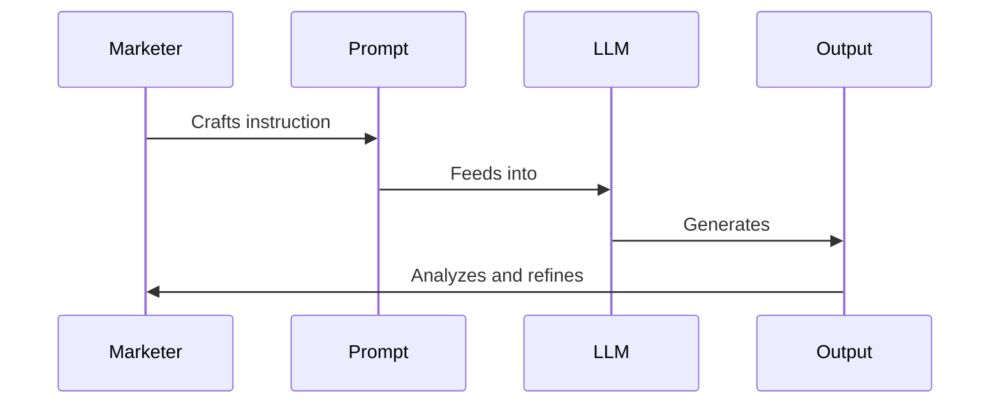

## LLM Prompt Engineering for Marketers for the Impatient: From Novice to Practitioner in Record Time

### 1. Introduction

#### Why LLM Prompt Engineering Matters for Marketers

Imagine you're a chef in a Michelin-starred restaurant. Your ingredients are top-notch, your kitchen is state-of-the-art, but your ability to combine these elements into a masterpiece? That's where the magic happens. In the world of modern marketing, Large Language Models (LLMs) are your high-end kitchen, and prompt engineering is your culinary expertise.

But why should you, as a marketer, care about LLM prompt engineering? 

Picture this: You're tasked with creating a viral social media campaign for a new product launch. Traditionally, you'd spend days brainstorming, researching trends, and crafting messages. Now, imagine having an AI assistant that can generate hundreds of creative ideas, tailor messages to specific audience segments, and even predict potential engagement rates – all within minutes. That's the power of mastering LLM prompt engineering.

> 🧠 Pause and Reflect: Think about a recent marketing campaign you worked on. How much time did you spend on ideation and content creation? How might LLM prompt engineering have impacted that process?

LLM prompt engineering is not just a fancy tech term; it's a game-changer that can:
- Supercharge your creativity
- Dramatically reduce time-to-market for campaigns
- Enable hyper-personalization at scale
- Provide data-driven insights for strategy refinement

In essence, it's like having a marketing team of hundreds at your fingertips, ready to brainstorm, create, and analyze 24/7.

#### The What: Understanding LLM Prompt Engineering

So, what exactly is LLM prompt engineering? Let's break it down:

1. **LLMs (Large Language Models)**: Think of these as incredibly smart, well-read assistants. They've "read" vast amounts of text from the internet and can generate human-like text based on the input they receive.

2. **Prompts**: These are the instructions or questions you give to the LLM. It's like the brief you'd give to your marketing team.

3. **Prompt Engineering**: This is the art and science of crafting these instructions in a way that gets you the best possible output from the LLM.

Here's a simple diagram to visualize the process:



> 💡 Pro Tip: Think of prompt engineering as having a conversation with a brilliant but literal-minded colleague. The clearer and more specific you are, the better results you'll get.

Now that we understand the 'why' and 'what' of LLM prompt engineering for marketers, let's dive into how you can start applying this powerful tool to revolutionize your marketing efforts.

### 2. Getting Started

#### The Basics of Prompt Construction

Let's start with a simple analogy. Crafting a prompt is like giving directions to a tourist in your city. The more precise and contextual your instructions, the more likely they are to reach their destination successfully.

Every effective prompt consists of three key elements:

1. **Context**: The background information or setting for your request.
2. **Instruction**: The specific task or question you want the LLM to address.
3. **Input**: Any additional information or parameters for the task.

Let's look at a basic example:

```
Context: You are a marketing specialist for a sustainable fashion brand.
Instruction: Write a product description for our new eco-friendly jeans.
Input: The jeans are made from recycled ocean plastic and organic cotton. They come in three colors: Ocean Blue, Sandy Beige, and Coral Red. The target audience is environmentally conscious millennials.
```

This prompt provides clear context (sustainable fashion brand), a specific instruction (write a product description), and relevant input (material, colors, target audience).

> 🏋️ Quick Exercise: Try crafting a similar prompt for a product or service you're familiar with. Remember to include context, instruction, and input.

#### Understanding LLM "Thinking"

To master prompt engineering, it's crucial to understand how LLMs "think". Imagine you're teaching a highly intelligent alien about Earth culture. This alien has read every book, article, and website about Earth but has never actually experienced it firsthand. That's similar to how an LLM operates.

Key points to remember:
- LLMs don't have real-world experience or up-to-the-minute knowledge.
- They excel at pattern recognition and language generation based on their training data.
- They can be creative but need guidance to align with specific goals or brand voices.

Let's look at an example of refining a vague marketing prompt:

Vague prompt:
```
Write something catchy for our new product.
```

Refined prompt:
```
Context: You are a copywriter for a tech company launching a new smartwatch.
Instruction: Create five catchy taglines for our new smartwatch that emphasize its health monitoring features and sleek design.
Input: The smartwatch can monitor heart rate, sleep patterns, and stress levels. It has a slim profile and comes in brushed metal finishes. Our brand voice is innovative yet approachable.
```

The refined prompt provides the LLM with much more context and specific instructions, leading to more relevant and usable outputs.

> 💡 Pro Tip: Always start with a more detailed prompt than you think you need. It's easier to simplify later than to add specificity to vague results.

As we move forward, we'll explore more advanced techniques and marketing-specific applications. Remember, the key to becoming a prompt engineering expert is practice and iteration. Each interaction with an LLM is an opportunity to refine your skills.

### 3. Advanced Techniques

#### Leveraging Context for Better Results

Now that we've covered the basics, let's dive deeper into the power of context in prompt engineering. Think of context as the stage setting for a play. The richer and more detailed the set, the more immersive and believable the performance.

In marketing, context is crucial for generating content that resonates with your target audience and aligns with your brand voice. Here's how you can leverage context effectively:

1. **Brand Guidelines**: Include key elements of your brand voice, values, and style guide in your prompts.
2. **Audience Insights**: Incorporate demographic and psychographic information about your target audience.
3. **Campaign Goals**: Clearly state the objectives of your marketing campaign.
4. **Competitive Landscape**: Provide information about your market position and key competitors.

Let's look at an example of a context-rich prompt for creating a targeted ad campaign:

```
Context: You are the lead copywriter for GreenLeaf, an eco-friendly home cleaning products company. Our brand voice is friendly, informative, and empowering. We're launching a new line of biodegradable cleaning wipes.

Target Audience: Environmentally conscious millennials and Gen Z consumers, aged 25-40, living in urban areas. They value sustainability but also convenience in their busy lives.

Campaign Goal: Increase awareness of our new product line and drive online sales through social media advertising.

Competitive Landscape: Our main competitors are BigClean and EcoShine. BigClean is known for strong cleaning power but uses harsh chemicals. EcoShine is eco-friendly but perceived as less effective.

Instruction: Create a series of three short, compelling ad copies (max 50 words each) for Instagram that highlight the convenience and eco-friendliness of our new biodegradable cleaning wipes. Each ad should include a clear call-to-action.

Input: Product USPs: 100% biodegradable, plastic-free packaging, effective against 99.9% of bacteria, pleasant lavender scent.
```

This prompt provides rich context that allows the LLM to generate highly targeted and effective ad copies.

> 🧠 Pause and Reflect: Think about a marketing campaign you're currently working on. What additional context could you provide to make your prompts more effective?

#### Mastering Instruction Crafting

Crafting clear and effective instructions is like being a great project manager. You need to be specific about what you want, but also leave room for creativity and problem-solving.

There are three main types of instructions you can use in your prompts:

1. **Open-ended**: Encourage creative exploration.
   Example: "Generate innovative ideas for a viral social media challenge to promote our new product."

2. **Specific**: Provide clear guidelines for a particular task.
   Example: "Write a 280-character tweet announcing our summer sale, including the hashtag #SummerSavings."

3. **Multi-step**: Break down complex tasks into manageable steps.
   Example: "First, analyze our top 5 performing blog posts. Then, identify common themes. Finally, propose 3 new blog post ideas based on these insights."

Let's look at an example of a well-crafted instruction for creating a social media content strategy:

```
Context: You are a social media strategist for FitLife, a fitness app targeting busy professionals aged 30-50. Our brand voice is motivational, practical, and science-based.

Instruction: Develop a 4-week social media content strategy for Instagram to promote our new "15-minute Workouts" feature. Follow these steps:

1. Create a content theme for each week, aligned with the benefits of short, effective workouts.
2. For each theme, propose 3 post ideas: one educational, one motivational, and one user-generated content prompt.
3. Suggest relevant hashtags for each post (5-7 hashtags per post).
4. Outline a brief caption structure for each post type (educational, motivational, UGC prompt).

Input: Key features of "15-minute Workouts": scientifically designed for maximum efficiency, adaptable to home or office environments, requires minimal equipment.
```

This multi-step instruction provides clear guidance while allowing room for creativity in content ideation.

> 💡 Pro Tip: When crafting instructions, use action verbs (create, analyze, develop) and be specific about the format or structure you want in the output.

As you practice these advanced techniques, you'll find that your prompts become more sophisticated and your outputs more aligned with your marketing objectives. In the next section, we'll explore how to apply these skills to specific marketing tasks.

### 4. Marketing-Specific Applications

Now that we've honed our prompt engineering skills, let's apply them to some common marketing tasks. This is where the rubber meets the road, and you'll start seeing the transformative power of LLM prompt engineering in your day-to-day work.

#### Content Creation and Curation

Content is king in the digital marketing world, but creating high-quality, engaging content consistently can be challenging. LLMs can be your secret weapon in this arena.

Here's an example of how you might use prompt engineering for generating a series of tweets for a product launch:

```
Context: You are the social media manager for TechNovaX, a cutting-edge tech company known for innovative smartphones. We're launching our new model, the TechNovaX Quantum, which features breakthrough quantum computing technology for unparalleled mobile performance.

Instruction: Create a series of 5 tweets to build excitement for our TechNovaX Quantum launch. Follow these guidelines:
1. Each tweet should be under 280 characters.
2. Incorporate our brand voice: futuristic, confident, and slightly mysterious.
3. Focus on different aspects: innovation, performance, user experience, design, and a teaser.
4. Include relevant hashtags and a call-to-action in each tweet.
5. Ensure a cohesive narrative across all tweets that builds anticipation.

Input: 
- Launch date: September 15th
- Key features: Quantum core processor, 1TB storage, 2-day battery life, holographic display
- Tagline: "The Future, Quantified"
- Website: technova-x.com/quantum
```

This prompt provides clear instructions for creating a cohesive series of tweets that align with the brand voice and marketing objectives.

> 🏋️ Quick Exercise: Try crafting a similar prompt for a content series (blog posts, social media updates, email newsletter) for a product or service you're familiar with.

#### Customer Segmentation and Personalization

Personalization is no longer a luxury in marketing; it's an expectation. LLMs can help you create detailed buyer personas and craft personalized marketing messages at scale.

Let's look at an example of using an LLM to develop buyer personas:

```
Context: You are a market research analyst for GreenCommute, an eco-friendly ride-sharing app. We want to create detailed buyer personas to inform our marketing strategy.

Instruction: Develop 3 distinct buyer personas for GreenCommute users. For each persona, provide:
1. Demographic information (age, gender, occupation, income