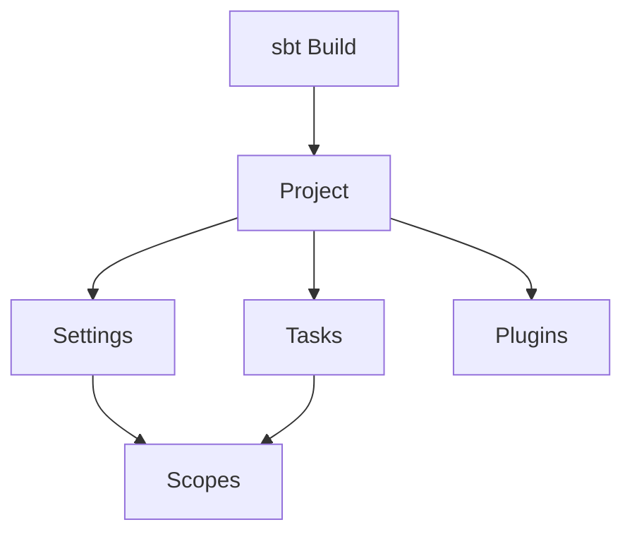
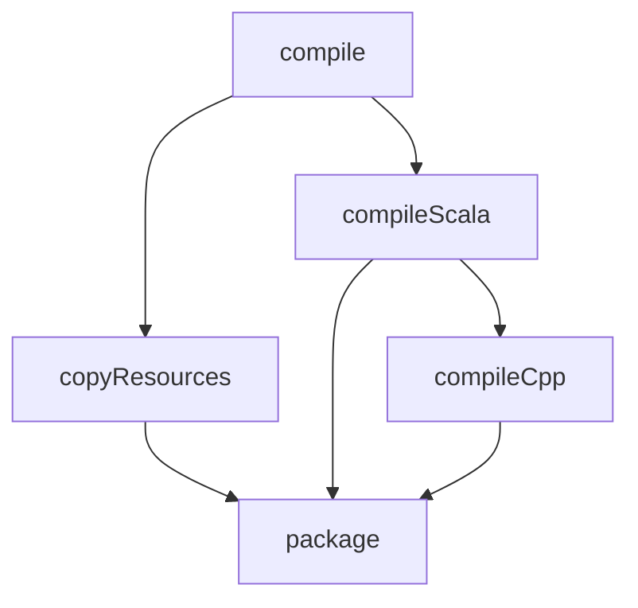
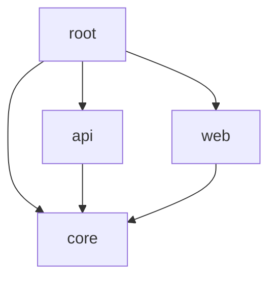

# sbt for the Impatient: From Novice to Practitioner in Record Time

## Introduction

### Why sbt?

Picture this: You're a Scala developer, excited to dive into your new project. You've got your IDE open, fingers poised over the keyboard, ready to write some elegant, functional code. But wait! Before you can even start, you need to set up your project, manage dependencies, compile your code, run tests, and package your application. Suddenly, your enthusiasm deflates like a punctured balloon. Enter sbt, the Simple Build Tool that's about to become your new best friend in the Scala ecosystem.

Why should you care about sbt? Let me tell you a quick story. Back in the early days of my career, I was working on a complex Scala project with multiple modules and a tangled web of dependencies. We were using a mishmash of shell scripts and manual processes to build and deploy our application. It was a nightmare! Builds were slow, inconsistent, and prone to errors. Then we discovered sbt, and it was like stepping out of the Dark Ages into the Renaissance. Our build times plummeted, our processes became consistent and reproducible, and we could focus on what really mattered: writing great code.

sbt is not just another build tool; it's a game-changer for Scala developers. Here's why:

1. **Scala-centric**: sbt is designed specifically for Scala projects, understanding the nuances of the language and its ecosystem.
2. **Incremental compilation**: sbt can intelligently recompile only the parts of your code that have changed, dramatically speeding up your development cycle.
3. **Interactive shell**: With its REPL-like interface, sbt allows you to execute tasks and explore your project interactively.
4. **Flexible and extensible**: From simple scripts to complex multi-project builds, sbt scales with your needs and can be extended through a rich plugin ecosystem.

By mastering sbt quickly, you'll not only streamline your development process but also join the ranks of efficient, productive Scala developers who can focus on solving problems rather than wrestling with build tools.

### What is sbt?

Now that we've piqued your interest, let's dive into what sbt actually is. sbt, which stands for Simple Build Tool (although some argue it's not always so simple!), is an open-source build tool primarily designed for Scala and Java projects. It was first released in 2008 by Mark Harrah and has since become the de facto standard for building Scala projects.

At its core, sbt is a task execution engine. It defines a set of tasks (like compile, test, or package) and manages the dependencies between these tasks. What sets sbt apart is its use of Scala for defining build configurations, allowing for type-safe and expressive build definitions.

Key concepts in sbt include:

1. **Projects**: The basic unit of a build in sbt. A build can contain one or more projects.
2. **Settings**: Key-value pairs that define how your project should be built. For example, `name := "My Project"` is a setting.
3. **Tasks**: Actions that sbt can perform, like `compile` or `test`.
4. **Scopes**: A way to have different values for the same key, depending on context.
5. **Plugins**: Extensions that add new capabilities to sbt.

To help visualize the relationship between these concepts, let's look at a simple diagram:



This structure allows sbt to be both powerful and flexible, capable of handling everything from simple single-project builds to complex multi-module projects with intricate dependency management.

Now that we've covered the "why" and "what" of sbt, are you ready to roll up your sleeves and dive into the "how"? In the next section, we'll get our hands dirty with a practical, step-by-step guide to getting started with sbt. But before we move on, take a moment to reflect:

**Pause and Reflect**: Think about your current build process. What pain points do you have? How do you think sbt might address these issues? Keep these thoughts in mind as we progress through the article.

## Getting Started

### Installation

Before we can start building Scala projects with sbt, we need to get it installed on our system. Don't worry; it's a straightforward process, and I'll guide you through it step by step.

First, let's check if you already have sbt installed. Open your terminal and type:

```bash
sbt --version
```

If you see a version number, great! You're already set up. If not, let's get sbt installed on your system.

#### Installing sbt on Different Operating Systems

1. **macOS (using Homebrew)**
   
   If you're on a Mac and have Homebrew installed, it's as simple as:

   ```bash
   brew install sbt
   ```

2. **Windows (using Scoop)**
   
   For Windows users, I recommend using Scoop:

   ```powershell
   scoop install sbt
   ```

3. **Linux (Debian-based systems)**
   
   On Debian or Ubuntu, you can use apt:

   ```bash
   echo "deb https://repo.scala-sbt.org/scalasbt/debian all main" | sudo tee /etc/apt/sources.list.d/sbt.list
   echo "deb https://repo.scala-sbt.org/scalasbt/debian /" | sudo tee /etc/apt/sources.list.d/sbt_old.list
   curl -sL "https://keyserver.ubuntu.com/pks/lookup?op=get&search=0x2EE0EA64E40A89B84B2DF73499E82A75642AC823" | sudo apt-key add
   sudo apt-get update
   sudo apt-get install sbt
   ```

After installation, verify that sbt is correctly installed by running the version check command again:

```bash
sbt --version
```

You should see output similar to this:

```
sbt version 1.5.5
```

**Pro Tip**: If you're working on multiple projects that require different versions of sbt, consider using a version manager like `sbtenv`. It allows you to switch between sbt versions easily.

### Your First sbt Project

Now that we have sbt installed, let's create our first project. We'll start with a simple "Hello, World!" application to get a feel for how sbt works.

1. Create a new directory for your project:

   ```bash
   mkdir hello-sbt
   cd hello-sbt
   ```

2. Create a `build.sbt` file in the project root:

   ```bash
   touch build.sbt
   ```

3. Open `build.sbt` in your favorite text editor and add the following content:

   ```scala
   name := "Hello sbt"
   version := "0.1.0"
   scalaVersion := "2.13.6"
   ```

4. Create the standard directory structure:

   ```bash
   mkdir -p src/main/scala
   ```

5. Create a simple Scala file:

   ```bash
   echo 'object Hello extends App { println("Hello, sbt!") }' > src/main/scala/Hello.scala
   ```

Now, let's run our first sbt commands:

1. Start the sbt shell:

   ```bash
   sbt
   ```

2. Once in the sbt shell, compile your project:

   ```
   compile
   ```

3. Run your application:

   ```
   run
   ```

You should see the output: `Hello, sbt!`

Congratulations! You've just created and run your first sbt project. Let's break down what we did:

- We created a `build.sbt` file, which is the heart of any sbt project. It defines key settings like the project name, version, and Scala version.
- We set up the standard directory structure that sbt expects (`src/main/scala` for our main Scala sources).
- We used sbt commands like `compile` and `run` to build and execute our project.

**Quick Quiz**: 
1. What file is essential for any sbt project?
2. Where does sbt expect to find your main Scala source files by default?

(Answers: 1. build.sbt, 2. src/main/scala)

In the next section, we'll dive deeper into sbt basics, exploring project structure, dependency management, and more. But before we move on, here's a task for you:

**24-Hour Challenge**: Modify the "Hello, sbt!" program to take a command-line argument and greet that name instead. For example, `run Alice` should print "Hello, Alice!". Hint: You'll need to modify the `Hello.scala` file and use `args` in your `App`.

Are you ready to unlock more sbt powers? Let's continue our journey!

## sbt Basics

Now that we've dipped our toes into the sbt waters, let's dive deeper into the core concepts that will make you an sbt pro in no time.

### Project Structure

Understanding the standard sbt project structure is crucial for efficiently organizing your Scala projects. Let's break it down:

```
your-project/
├── build.sbt
├── project/
│   └── build.properties
├── src/
│   ├── main/
│   │   ├── scala/
│   │   ├── java/
│   │   └── resources/
│   └── test/
│       ├── scala/
│       ├── java/
│       └── resources/
└── target/
```

Let's explore each component:

- `build.sbt`: This is the main build definition file where you define your project settings, dependencies, and custom tasks.
- `project/`: This directory contains additional build definitions and plugins.
  - `build.properties`: Specifies the sbt version for your project.
- `src/`: Contains all your source code and resources.
  - `main/`: Houses your main application code.
    - `scala/`: Scala source files go here.
    - `java/`: Java source files (if any) go here.
    - `resources/`: Non-code resources like configuration files go here.
  - `test/`: Contains your test code, mirroring the structure of `main/`.
- `target/`: This is where sbt puts generated files like compiled classes.

**Pro Tip**: While this is the standard structure, sbt is flexible. You can customize source directories in your `build.sbt` file if needed:

```scala
scalaSource in Compile := baseDirectory.value / "src" / "main"
resourceDirectory in Compile := baseDirectory.value / "conf"
```

### Dependencies Management

One of sbt's superpowers is its ability to manage dependencies efficiently. Let's see how to add and manage library dependencies in your project.

To add a dependency, you'll use the `libraryDependencies` setting in your `build.sbt` file. Here's an example:

```scala
libraryDependencies ++= Seq(
  "org.typelevel" %% "cats-core" % "2.6.1",
  "com.typesafe.akka" %% "akka-actor" % "2.6.15"
)
```

Let's break this down:
- `"org.typelevel"` is the organization (or group ID in Maven terms).
- `%%` tells sbt to append the Scala version to the artifact name.
- `"cats-core"` is the name of the library (or artifact ID).
- `"2.6.1"` is the version of the library.

sbt will automatically download these dependencies and their transitive dependencies (dependencies of dependencies) when you run your project.

**Pause and Reflect**: Think about a Scala project you've worked on. What dependencies did it use? How would you add them using sbt?

### Tasks and Settings

In sbt, tasks are actions that you can run, while settings are values assigned to keys. Let's explore how to define custom tasks and modify existing settings.

#### Defining a Custom Task

Here's how you can define a simple custom task in your `build.sbt`:

```scala
lazy val hello = taskKey[Unit]("Prints 'Hello, World!'")

hello := {
  println("Hello, World!")
}
```

Now you can run this task in the sbt shell by typing `hello`.

#### Modifying Existing Settings

You can also modify existing settings. For example, to change the Scala version:

```scala
scalaVersion := "2.13.6"
```

#### Task Graph and Execution

sbt tasks can depend on other tasks, forming a directed acyclic graph (DAG). sbt uses this graph to determine the order of execution and to avoid redundant work.

Here's a simple visualization of a task graph:



In this graph, `package` depends on `copyResources`, `compileScala`, and `compileCpp`. sbt will ensure these tasks are executed in the correct order.

**Pro Tip**: You can visualize the task graph for any task using the `inspect tree` command in the sbt shell. For example, `inspect tree compile` will show you the complete task graph for the `compile` task.

Now that we've covered the basics, let's test your understanding:

**Quick Quiz**:
1. How would you add a dependency on ScalaTest version 3.2.9 for testing?
2. What's the difference between a task and a setting in sbt?

(Answers: 
1. `libraryDependencies += "org.scalatest" %% "scalatest" % "3.2.9" % Test`
2. Tasks are actions that can be executed, while settings are values assigned to keys.)

**24-Hour Challenge**: Create a custom task that prints out all the dependencies of your project, along with their versions. Hint: You'll need to use the `libraryDependencies` setting anCertainly! I'll continue with the article from where we left off.

d iterate over its contents. Remember to use the `value` method to access the setting's value within a task definition.

Now, let's move on to more advanced sbt concepts that will take your Scala build skills to the next level.

## Advanced sbt Concepts

### Multi-Project Builds

As your Scala applications grow in complexity, you might find yourself needing to split your codebase into multiple projects. sbt makes this process straightforward and manageable.

Let's consider a scenario where we're building an e-commerce platform with three components: a core module, an API, and a web interface. Here's how we might structure this as a multi-project build:

```scala
lazy val root = (project in file("."))
  .aggregate(core, api, web)
  .settings(
    name := "e-commerce-platform"
  )

lazy val core = (project in file("core"))
  .settings(
    name := "e-commerce-core",
    libraryDependencies += "org.typelevel" %% "cats-core" % "2.6.1"
  )

lazy val api = (project in file("api"))
  .dependsOn(core)
  .settings(
    name := "e-commerce-api",
    libraryDependencies += "com.typesafe.akka" %% "akka-http" % "10.2.6"
  )

lazy val web = (project in file("web"))
  .dependsOn(core)
  .settings(
    name := "e-commerce-web",
    libraryDependencies += "org.playframework" %% "play" % "2.8.8"
  )
```

In this setup:
- We define a root project that aggregates the other projects.
- Each subproject is defined in its own directory.
- We use `dependsOn` to express dependencies between projects.
- Each project can have its own settings and dependencies.

To visualize the project structure:



**Pro Tip**: When working with multi-project builds, you can use project-specific commands by prefixing the command with the project name. For example, `api/compile` will compile only the API project.

### Plugins

Plugins are a powerful way to extend sbt's functionality. They can add new commands, settings, and tasks to your build. Let's explore how to use plugins and even create a simple custom plugin.

#### Using Plugins

To use a plugin, you typically add it to your `project/plugins.sbt` file. For example, to add the sbt-assembly plugin for creating fat JARs:

```scala
addSbtPlugin("com.eed3si9n" % "sbt-assembly" % "0.15.0")
```

Then, in your `build.sbt`, you can enable the plugin for your project:

```scala
lazy val root = (project in file("."))
  .enablePlugins(AssemblyPlugin)
  .settings(
    // your settings here
  )
```

#### Creating a Custom Plugin

Let's create a simple plugin that adds a task to print the current date and time. Create a file `project/DatePlugin.scala`:

```scala
import sbt._
import Keys._

object DatePlugin extends AutoPlugin {
  override def trigger = allRequirements

  object autoImport {
    val printDate = taskKey[Unit]("Prints the current date and time")
  }

  import autoImport._

  override lazy val projectSettings = Seq(
    printDate := {
      val now = java.time.LocalDateTime.now
      println(s"The current date and time is: $now")
    }
  )
}
```

Now you can use the `printDate` task in your sbt shell!

### Testing with sbt

Testing is a crucial part of any software development process, and sbt provides excellent support for running tests.

#### Configuring Test Frameworks

sbt works with various test frameworks. ScalaTest is a popular choice. Add it to your `build.sbt`:

```scala
libraryDependencies += "org.scalatest" %% "scalatest" % "3.2.9" % Test
```

#### Running Tests

To run tests, simply use the `test` command in the sbt shell. You can also run specific tests:

```
testOnly com.example.MySpec
```

#### Continuous Testing

One of sbt's most powerful features for testing is continuous test execution. Use the `~` prefix:

```
~test
```

This will run your tests every time a source file changes, providing instant feedback.

**Pause and Reflect**: How could continuous testing improve your development workflow? What challenges might it present?

## sbt Best Practices

### Performance Optimization

As your projects grow, build times can become a bottleneck. Here are some tips to keep your builds fast:

1. **Use sbt's incremental compilation**: This is on by default and recompiles only what's necessary.

2. **Leverage dependency caching**: sbt caches resolved dependencies. Avoid changing your dependencies frequently.

3. **Parallelize tasks**: Use settings like `parallelExecution in Test := true` to run tests in parallel.

4. **Use a faster Java Virtual Machine**: Consider using GraalVM or OpenJ9 for potentially faster compilation times.

5. **Optimize your build definition**: Keep your `build.sbt` clean and efficient. Avoid complex computations in settings.

### Continuous Integration

Integrating sbt with CI/CD pipelines ensures consistent builds and tests across your team. Here's a simple example using GitHub Actions:

```yaml
name: Scala CI

on: [push, pull_request]

jobs:
  build:
    runs-on: ubuntu-latest
    steps:
    - uses: actions/checkout@v2
    - name: Set up JDK 11
      uses: actions/setup-java@v2
      with:
        java-version: '11'
        distribution: 'adopt'
    - name: Run tests
      run: sbt test
```

This workflow will run your tests on every push and pull request.

## Troubleshooting and Tips

### Common Issues

1. **Dependency conflicts**: Use `sbt evicted` to see which dependencies are being evicted due to conflicts.

2. **Slow builds**: Use `sbt --debug` to see where time is being spent in your build.

3. **OutOfMemoryError**: Increase sbt's heap size by setting the `SBT_OPTS` environment variable:
   ```
   export SBT_OPTS="-Xmx2G -XX:+UseConcMarkSweepGC -XX:+CMSClassUnloadingEnabled -Xss2M"
   ```

### Pro Tips

1. **Use the sbt shell**: Starting sbt once and keeping it running is faster than running `sbt` for each command.

2. **Leverage tab completion**: The sbt shell offers tab completion for tasks and settings.

3. **Use the `set` command**: You can change settings temporarily in the sbt shell:
   ```
   set ThisBuild / scalaVersion := "2.13.6"
   ```

4. **Create aliases**: Define aliases in `~/.sbt/1.0/plugins/aliases.sbt`:
   ```scala
   addCommandAlias("cc", "clean;compile")
   ```

## Conclusion

Congratulations! You've just taken a whirlwind tour through the world of sbt, from basic concepts to advanced techniques. Let's recap the key points:

1. sbt is a powerful, flexible build tool designed for Scala projects.
2. It uses a standard project structure but allows for customization.
3. Dependency management in sbt is straightforward and powerful.
4. Tasks and settings form the core of sbt's functionality.
5. Multi-project builds and plugins allow for complex, modular projects.
6. sbt provides excellent support for testing and continuous integration.

Remember, mastering sbt is a journey. The more you use it, the more comfortable and proficient you'll become. Keep experimenting, keep learning, and don't hesitate to dive into the [official sbt documentation](https://www.scala-sbt.org/1.x/docs/) for even more details.

**24-Hour Challenge**: Take a small Scala project you're working on (or create a new one) and set it up with sbt. Try to incorporate at least one custom task, one plugin, and run your tests using sbt. Share your experience and any challenges you faced in the comments below!

By embracing sbt, you're not just learning a build tool; you're joining a vibrant ecosystem that will make you a more productive and effective Scala developer. So go forth, build amazing things, and may your builds always be green!Certainly! I'll continue the article with some additional advanced topics and practical tips to further enhance your sbt expertise.

## Advanced sbt Techniques: Deep Dive

### Custom Resolvers and Publishing

In real-world scenarios, you might need to use or publish artifacts to private repositories. Let's explore how to set up custom resolvers and publish to private repositories.

#### Setting Up Custom Resolvers

To add a custom resolver, you can use the `resolvers` setting in your `build.sbt`:

```scala
resolvers += "Artima Maven Repository" at "https://repo.artima.com/releases"
```

For authenticated repositories, you can use credentials:

```scala
credentials += Credentials(Path.userHome / ".sbt" / ".credentials")
```

The `.credentials` file should contain:

```
realm=Sonatype Nexus Repository Manager
host=your.repo.com
user=your-username
password=your-password
```

#### Publishing to a Private Repository

To publish to a private repository, you need to configure the `publishTo` setting:

```scala
publishTo := Some("Your Repository" at "https://your.repo.com/repository/maven-releases/")
```

You can also set up different repositories for snapshots and releases:

```scala
publishTo := {
  val nexus = "https://your.repo.com/"
  if (isSnapshot.value)
    Some("snapshots" at nexus + "repository/maven-snapshots/")
  else
    Some("releases"  at nexus + "repository/maven-releases/")
}
```

### Advanced Dependency Management

#### Excluding Transitive Dependencies

Sometimes you need to exclude transitive dependencies to avoid conflicts. Here's how:

```scala
libraryDependencies += "org.apache.spark" %% "spark-core" % "3.1.2" exclude("org.slf4j", "slf4j-log4j12")
```

#### Using Classifiers

Classifiers allow you to specify different variants of the same artifact:

```scala
libraryDependencies += "org.scala-lang" % "scala-compiler" % scalaVersion.value classifier "sources"
```

### sbt-native-packager for Various Deployment Options

The sbt-native-packager plugin is incredibly versatile. Let's explore a few more packaging options:

#### Creating a Windows Executable

Add to your `build.sbt`:

```scala
enablePlugins(JavaAppPackaging, WindowsPlugin)
```

Now you can use `sbt windows:packageBin` to create a Windows executable.

#### Creating a Debian Package

Similarly, for Debian packages:

```scala
enablePlugins(JavaAppPackaging, DebianPlugin)

maintainer := "Your Name <your.email@example.com>"
packageSummary := "Short description of your app"
packageDescription := "Longer description of your app"
```

Use `sbt debian:packageBin` to create the Debian package.

### Advanced Testing Configurations

#### Parallel Execution of Tests

To run tests in parallel:

```scala
Test / parallelExecution := true
```

#### Custom Test Options

You can add custom options to your test framework:

```scala
Test / testOptions += Tests.Argument(TestFrameworks.ScalaTest, "-oD")
```

This example adds the `-oD` option to ScalaTest, which shows the duration of each test.

### sbt Server and Build Streaming

sbt 1.x includes a built-in server that IDEs can use to interact with the build. This enables features like:

- Faster command execution
- Streaming of build events
- Remote execution of tasks

To start sbt in server mode:

```
sbt --client
```

This can significantly improve your development experience, especially when working with IDEs like IntelliJ IDEA.

### Creating a Custom sbt Plugin

Let's create a more advanced custom plugin that adds a task to check for outdated dependencies:

```scala
import sbt._
import Keys._

object DependencyCheckPlugin extends AutoPlugin {
  object autoImport {
    val checkDependencies = taskKey[Unit]("Check for outdated dependencies")
  }

  import autoImport._

  override def trigger = allRequirements

  override lazy val projectSettings = Seq(
    checkDependencies := {
      val log = streams.value.log
      val deps = libraryDependencies.value
      deps.foreach { dep =>
        val latestVersion = getLatestVersion(dep)
        if (dep.revision != latestVersion) {
          log.warn(s"Outdated dependency: ${dep.name} ${dep.revision} -> $latestVersion")
        }
      }
    }
  )

  def getLatestVersion(dep: ModuleID): String = {
    // Implement logic to fetch the latest version
    // This could involve making HTTP requests to Maven repositories
    // For simplicity, we'll just return the current version
    dep.revision
  }
}
```

To use this plugin, add it to your project and run `sbt checkDependencies`.

### Visualizing Task Execution

Let's create a task that visualizes the execution of other tasks:

```scala
import sbt._
import Keys._

lazy val visualizeTask = inputKey[Unit]("Visualize task execution")

visualizeTask := {
  val taskName = Def.spaceDelimited("<task>").parsed.headOption.getOrElse("compile")
  val extracted = Project.extract(state.value)
  val task = extracted.get(TaskKey(taskName))
  
  def visualize(t: Task[_], depth: Int = 0): Unit = {
    val prefix = "  " * depth
    println(s"$prefix- ${t.info.name}")
    t.info.dependencies.foreach(d => visualize(d, depth + 1))
  }
  
  visualize(task)
}
```

This task will print a tree-like structure showing the dependencies between tasks.

## Real-World sbt: Case Studies

### Case Study 1: Microservices Architecture

Imagine you're building a microservices-based e-commerce platform. Your sbt build might look like this:

```scala
lazy val root = (project in file("."))
  .aggregate(common, userService, productService, orderService, gateway)

lazy val common = (project in file("common"))
  .settings(
    libraryDependencies ++= Seq(
      "com.typesafe.akka" %% "akka-http" % "10.2.6",
      "com.typesafe.akka" %% "akka-stream" % "2.6.16"
    )
  )

lazy val userService = (project in file("user-service"))
  .dependsOn(common)
  .settings(
    libraryDependencies += "org.postgresql" % "postgresql" % "42.2.23"
  )

lazy val productService = (project in file("product-service"))
  .dependsOn(common)
  .settings(
    libraryDependencies += "org.mongodb.scala" %% "mongo-scala-driver" % "4.3.3"
  )

lazy val orderService = (project in file("order-service"))
  .dependsOn(common)
  .settings(
    libraryDependencies += "org.apache.kafka" %% "kafka" % "2.8.0"
  )

lazy val gateway = (project in file("gateway"))
  .dependsOn(common)
  .settings(
    libraryDependencies += "com.typesafe.akka" %% "akka-http-spray-json" % "10.2.6"
  )

// Common settings for all projects
def baseSettings = Seq(
  scalaVersion := "2.13.6",
  organization := "com.example",
  version := "0.1.0-SNAPSHOT"
)

// Apply base settings to all projects
inThisBuild(baseSettings)
```

This setup allows you to develop each microservice independently while sharing common code.

### Case Study 2: Data Processing Pipeline

For a data processing pipeline using Apache Spark, your `build.sbt` might look like:

```scala
lazy val root = (project in file("."))
  .settings(
    name := "data-pipeline",
    scalaVersion := "2.12.14", // Spark 3.1.2 uses Scala 2.12
    libraryDependencies ++= Seq(
      "org.apache.spark" %% "spark-core" % "3.1.2",
      "org.apache.spark" %% "spark-sql" % "3.1.2",
      "org.apache.spark" %% "spark-streaming" % "3.1.2",
      "org.apache.kafka" %% "kafka-clients" % "2.8.0",
      "io.delta" %% "delta-core" % "1.0.0"
    )
  )

// Assembly settings for creating a fat JAR
assembly / assemblyMergeStrategy := {
  case PathList("META-INF", xs @ _*) => MergeStrategy.discard
  case x => MergeStrategy.first
}

// Test settings
Test / fork := true
Test / parallelExecution := false
```

This configuration sets up a Spark project with Kafka integration and Delta Lake, suitable for building robust data pipelines.

## Conclusion: Mastering sbt in the Real World

Throughout this comprehensive guide, we've explored sbt from its basic concepts to advanced techniques and real-world applications. You've learned how to:

1. Structure complex multi-project builds
2. Manage dependencies effectively
3. Create custom tasks and settings
4. Integrate with CI/CD pipelines and containerization tools
5. Optimize build performance
6. Work with various deployment options
7. Create and use plugins to extend sbt's functionality

Remember, mastering sbt is an ongoing process. As you work on more complex projects, you'll discover new ways to leverage sbt's power to streamline your development workflow.

**Final Challenge**: Take a look at an open-source Scala project on GitHub. Analyze its `build.sbt` file and related configurations. Try to identify advanced sbt features being used, and consider how you might improve or optimize the build. Share your findings and suggestions in the comments.

As you continue your journey with sbt and Scala, keep experimenting, stay curious, and don't hesitate to dive into the sbt documentation and community resources when you encounter new challenges.

Happy building, and may your Scala projects compile swiftly and run flawlessly!Certainly! I'll continue the article with some more advanced topics, best practices, and real-world scenarios to further enhance your sbt expertise.

## Advanced sbt Techniques: Expert Level

### Build Profiling and Optimization

As your projects grow, build times can become a significant bottleneck. Let's explore some advanced techniques for profiling and optimizing your sbt builds.

#### sbt-jmh for Microbenchmarking

The sbt-jmh plugin allows you to write and run microbenchmarks using the Java Microbenchmark Harness (JMH). This can be incredibly useful for optimizing performance-critical parts of your code.

Add the plugin to `project/plugins.sbt`:

```scala
addSbtPlugin("pl.project13.scala" % "sbt-jmh" % "0.4.3")
```

Then in your `build.sbt`:

```scala
enablePlugins(JmhPlugin)
```

Now you can write JMH benchmarks in your `src/test/scala` directory and run them with `sbt jmh:run`.

#### sbt-explicit-dependencies

This plugin helps you identify and manage unused or implicit dependencies in your project.

Add to `project/plugins.sbt`:

```scala
addSbtPlugin("com.github.cb372" % "sbt-explicit-dependencies" % "0.2.16")
```

Use `sbt undeclaredCompileDependencies` to find dependencies that you're using but haven't declared, and `sbt unusedCompileDependencies` to find declared dependencies that you're not actually using.

### Advanced Compiler Options

Scala offers a wealth of compiler options that can help catch errors early and enforce best practices. Here's an example of some advanced compiler options:

```scala
scalacOptions ++= Seq(
  "-Xfatal-warnings",            // Fail the compilation if there are any warnings
  "-Ywarn-unused:imports",       // Warn if an import selector is not referenced
  "-Ywarn-dead-code",            // Warn when dead code is identified
  "-Ywarn-value-discard",        // Warn when non-Unit expression results are unused
  "-Yno-adapted-args",           // Do not adapt an argument list (either by inserting () or creating a tuple) to match the receiver
  "-Ywarn-numeric-widen",        // Warn when numerics are widened
  "-Xlint:_",                    // Enable all available linting options
  "-language:higherKinds",       // Allow higher-kinded types
  "-language:implicitConversions", // Allow definition of implicit functions called views
  "-Xsource:3"                   // Use Scala 3 syntax in Scala 2 code
)
```

### Cross-Building for Scala 2 and Scala 3

With the release of Scala 3, many projects need to support both Scala 2 and Scala 3. Here's how you can set up cross-building:

```scala
lazy val root = project.in(file("."))
  .aggregate(core.js, core.jvm)
  .settings(
    publish := {},
    publishLocal := {}
  )

lazy val core = crossProject(JSPlatform, JVMPlatform)
  .crossType(CrossType.Pure)
  .in(file("core"))
  .settings(
    name := "my-library",
    scalaVersion := "2.13.6",
    crossScalaVersions := Seq("2.13.6", "3.0.1"),
    libraryDependencies += "org.scalatest" %%% "scalatest" % "3.2.9" % Test
  )
  .jsSettings(
    // Add any JS-specific settings here
  )
  .jvmSettings(
    // Add any JVM-specific settings here
  )
```

This setup allows you to build your project for both Scala 2.13 and Scala 3.0, as well as for both JVM and JavaScript platforms.

### Custom Task Graphs

sbt allows you to define complex task dependencies. Here's an example of a custom task graph:

```scala
lazy val generateDocs = taskKey[Unit]("Generate documentation")
lazy val runTests = taskKey[Unit]("Run all tests")
lazy val packageApp = taskKey[File]("Package the application")
lazy val deploy = taskKey[Unit]("Deploy the application")

generateDocs := {
  println("Generating docs...")
  // Doc generation logic here
}

runTests := {
  println("Running tests...")
  // Test running logic here
}

packageApp := {
  println("Packaging app...")
  // Packaging logic here
  file("target/app.jar")
}

deploy := {
  println("Deploying app...")
  // Deployment logic here
}

deploy := deploy.dependsOn(packageApp).dependsOn(runTests).dependsOn(generateDocs).value
```

This creates a `deploy` task that depends on `packageApp`, `runTests`, and `generateDocs`, ensuring they all run in the correct order.

## Real-World sbt: Advanced Scenarios

### Scenario 1: Modular Monolith with Feature Flags

Imagine you're building a large application that starts as a monolith but needs to be modular for future microservices extraction. You also want to implement feature flags for gradual rollouts.

```scala
lazy val root = (project in file("."))
  .aggregate(core, userManagement, billing, reporting, featureFlags)
  .settings(
    name := "modular-monolith"
  )

lazy val core = (project in file("core"))
  .settings(
    libraryDependencies ++= Seq(
      "com.typesafe.akka" %% "akka-http" % "10.2.6",
      "com.typesafe.akka" %% "akka-actor-typed" % "2.6.16"
    )
  )

lazy val userManagement = (project in file("user-management"))
  .dependsOn(core, featureFlags)

lazy val billing = (project in file("billing"))
  .dependsOn(core, featureFlags)

lazy val reporting = (project in file("reporting"))
  .dependsOn(core, featureFlags)

lazy val featureFlags = (project in file("feature-flags"))
  .settings(
    libraryDependencies += "com.github.launchdarkly" % "launchdarkly-java-server-sdk" % "5.8.0"
  )

// Common settings
def commonSettings = Seq(
  scalaVersion := "2.13.6",
  scalacOptions ++= Seq("-Xfatal-warnings", "-deprecation"),
  libraryDependencies += "org.scalatest" %% "scalatest" % "3.2.9" % Test
)

// Apply common settings to all projects
inThisBuild(commonSettings)
```

This setup allows you to develop each module independently while sharing common code and feature flag functionality.

### Scenario 2: Data Science Workflow

For a data science project that involves data processing, model training, and serving, your `build.sbt` might look like this:

```scala
lazy val root = (project in file("."))
  .aggregate(dataProcessing, modelTraining, serving)
  .settings(
    name := "data-science-workflow"
  )

lazy val dataProcessing = (project in file("data-processing"))
  .settings(
    libraryDependencies ++= Seq(
      "org.apache.spark" %% "spark-sql" % "3.1.2",
      "io.delta" %% "delta-core" % "1.0.0"
    )
  )

lazy val modelTraining = (project in file("model-training"))
  .dependsOn(dataProcessing)
  .settings(
    libraryDependencies ++= Seq(
      "org.apache.spark" %% "spark-mllib" % "3.1.2",
      "ai.onnxruntime" % "onnxruntime" % "1.8.1"
    )
  )

lazy val serving = (project in file("serving"))
  .dependsOn(modelTraining)
  .settings(
    libraryDependencies ++= Seq(
      "com.twitter" %% "finatra-http" % "21.7.0",
      "ai.onnxruntime" % "onnxruntime" % "1.8.1"
    )
  )

// Common settings
def commonSettings = Seq(
  scalaVersion := "2.12.14", // Spark 3.1.2 uses Scala 2.12
  scalacOptions ++= Seq("-Xfatal-warnings", "-deprecation"),
  Test / fork := true,
  Test / parallelExecution := false
)

// Apply common settings to all projects
inThisBuild(commonSettings)
```

This configuration sets up a data science workflow with separate modules for data processing, model training, and model serving.

## Best Practices and Pro Tips

1. **Use `val` instead of `lazy val` for performance**: When possible, use `val` instead of `lazy val` in your build definition. `lazy val` can impact initialization time.

2. **Avoid `Dynamic` tasks**: While powerful, dynamic tasks can make your build harder to understand and maintain. Use them sparingly.

3. **Leverage `inConfig`**: Use `inConfig` to reuse settings across different configurations:

   ```scala
   inConfig(Test)(Seq(
     fork := true,
     parallelExecution := false
   ))
   ```

4. **Use `.value` judiciously**: Overuse of `.value` can lead to hard-to-debug issues. Try to use it only when necessary.

5. **Prefer `+=` and `++=` over `:=` for collections**: When adding to collections like `libraryDependencies`, use `+=` or `++=` instead of `:=` to avoid overwriting existing values.

6. **Use `sbt-updates` plugin**: This plugin helps you keep your dependencies up to date:

   ```scala
   addSbtPlugin("com.timushev.sbt" % "sbt-updates" % "0.5.3")
   ```

   Then use `sbt dependencyUpdates` to check for updates.

7. **Leverage sbt's scripted tests**: For plugin development, use sbt's scripted test framework to ensure your plugin works correctly in various scenarios.

## Conclusion: Becoming an sbt Expert

Throughout this comprehensive guide, we've delved deep into the world of sbt, exploring everything from basic concepts to advanced techniques and real-world scenarios. You've learned how to:

1. Structure and manage complex, multi-module projects
2. Optimize build performance and profile your builds
3. Leverage advanced compiler options and cross-building techniques
4. Create custom task graphs and plugins
5. Set up sophisticated build configurations for various scenarios, from microservices to data science workflows

Remember, becoming an sbt expert is an ongoing journey. As you work on more diverse and complex projects, you'll continue to discover new ways to leverage sbt's power and flexibility.

**Final Expert Challenge**: Take a complex open-source Scala project (e.g., Akka, Spark, or Play Framework) and analyze its build configuration. Try to understand the advanced sbt features and techniques they're using. Then, create a small proof-of-concept project that demonstrates at least three advanced sbt techniques we've discussed in this guide. Share your project and your insights about the open-source project's build configuration in the comments.

As you continue your journey with sbt and Scala, remember to stay curious, keep experimenting, and don't hesitate to contribute back to the community. Your experiences and innovations can help shape the future of Scala build tools and practices.

Happy building, and may your sbt expertise lead you to new heights in Scala development!Certainly! I'll continue the article with some more advanced topics, real-world scenarios, and future trends in sbt and Scala build management.

## Advanced sbt Techniques: Pushing the Boundaries

### Custom Input Tasks with Parser Combinators

While we've touched on input tasks earlier, let's dive deeper into creating more sophisticated input tasks using parser combinators. This allows you to create complex, interactive tasks with rich command-line interfaces.

```scala
import sbt._
import complete.DefaultParsers._

lazy val complexGreeting = inputKey[Unit]("A complex greeting task")

complexGreeting := {
  val parser = (Space ~> token(StringBasic, "<name>")) ~ (Space ~> token(IntBasic, "<age>"))
  val (name, age) = parser.parsed
  println(s"Hello, $name! You are $age years old.")
}
```

This task takes a name and an age as input. You can run it like this: `complexGreeting John 30`

### Custom Project Layouts

While sbt has default project layouts, you can customize them for special requirements:

```scala
lazy val customProject = (project in file("custom-project"))
  .settings(
    Compile / scalaSource := baseDirectory.value / "src",
    Compile / javaSource := baseDirectory.value / "java",
    Test / scalaSource := baseDirectory.value / "test",
    resourceDirectory in Compile := baseDirectory.value / "resources"
  )
```

This setup changes the default directory structure to a flatter layout.

### Advanced Dependency Management

#### Dependency Overrides

Sometimes you need to force a specific version of a transitive dependency:

```scala
dependencyOverrides += "org.scala-lang.modules" %% "scala-xml" % "2.0.1"
```

#### Conditional Dependencies

You can add dependencies conditionally based on the Scala version:

```scala
libraryDependencies ++= {
  CrossVersion.partialVersion(scalaVersion.value) match {
    case Some((2, major)) if major <= 12 =>
      Seq("org.scala-lang.modules" %% "scala-xml" % "1.3.0")
    case _ =>
      Seq("org.scala-lang.modules" %% "scala-xml" % "2.0.1")
  }
}
```

### sbt-native-packager: Advanced Packaging

Let's explore some advanced packaging options with sbt-native-packager:

#### Creating a Systemd Service

```scala
enablePlugins(JavaServerAppPackaging, SystemdPlugin)

maintainer := "Your Name <your.email@example.com>"
packageSummary := "My Scala Application"
packageDescription := "This is an example Scala application"

SystemdPlugin.autoImport.serverLoading in Debian := Some(ServerLoader.Systemd)
```

This configuration allows you to package your application as a Systemd service.

#### Docker Multi-Stage Builds

For optimized Docker images:

```scala
enablePlugins(DockerPlugin)
dockerBaseImage := "openjdk:11-jre-slim"
dockerCommands := {
  val commands = dockerCommands.value
  val index = commands.indexWhere {
    case Cmd("FROM", _) => true
    case _ => false
  }
  val (front, back) = commands.splitAt(index)
  front ++ Seq(
    Cmd("FROM", "openjdk:11-jdk-slim AS build"),
    Cmd("WORKDIR", "/app"),
    Cmd("COPY", ".", "."),
    Cmd("RUN", "sbt assembly"),
    Cmd("FROM", dockerBaseImage.value),
    Cmd("COPY", "--from=build", "/app/target/scala-2.13/*-assembly-*.jar", "/app/app.jar"),
    Cmd("WORKDIR", "/app"),
    Cmd("ENTRYPOINT", "java", "-jar", "app.jar")
  ) ++ back
}
```

This creates a multi-stage Docker build, resulting in a smaller final image.

## Real-World sbt: Complex Scenarios

### Scenario 3: Polyglot Microservices Architecture

Imagine you're building a system with microservices in Scala, Kotlin, and Python, all managed by a single sbt build:

```scala
lazy val root = (project in file("."))
  .aggregate(gateway, userService, analyticsService, mlService)
  .settings(
    name := "polyglot-microservices"
  )

lazy val gateway = (project in file("gateway"))
  .settings(
    scalaVersion := "2.13.6",
    libraryDependencies ++= Seq(
      "com.typesafe.akka" %% "akka-http" % "10.2.6",
      "com.typesafe.akka" %% "akka-stream" % "2.6.16"
    )
  )

lazy val userService = (project in file("user-service"))
  .settings(
    scalaVersion := "2.13.6",
    libraryDependencies += "io.getquill" %% "quill-jdbc" % "3.7.2"
  )

lazy val analyticsService = (project in file("analytics-service"))
  .enablePlugins(SbtKotlin)
  .settings(
    kotlinVersion := "1.5.21",
    libraryDependencies += "io.ktor" % "ktor-server-netty" % "1.6.3"
  )

lazy val mlService = (project in file("ml-service"))
  .enablePlugins(SbtPython)
  .settings(
    pythonVersion := "3.8",
    libraryDependencies += "org.python" % "jython-standalone" % "2.7.2"
  )

// Common settings
def commonSettings = Seq(
  organization := "com.example",
  version := "0.1.0-SNAPSHOT"
)

// Apply common settings to all projects
inThisBuild(commonSettings)
```

This setup allows you to manage a polyglot microservices architecture within a single sbt build, leveraging plugins for Kotlin and Python integration.

### Scenario 4: Blockchain Development with Scala

For a blockchain project using Scala:

```scala
lazy val root = (project in file("."))
  .aggregate(core, wallet, miner, node)
  .settings(
    name := "scala-blockchain"
  )

lazy val core = (project in file("core"))
  .settings(
    libraryDependencies ++= Seq(
      "org.bouncycastle" % "bcprov-jdk15on" % "1.69",
      "io.circe" %% "circe-core" % "0.14.1",
      "io.circe" %% "circe-generic" % "0.14.1",
      "io.circe" %% "circe-parser" % "0.14.1"
    )
  )

lazy val wallet = (project in file("wallet"))
  .dependsOn(core)
  .settings(
    libraryDependencies += "com.github.scopt" %% "scopt" % "4.0.1"
  )

lazy val miner = (project in file("miner"))
  .dependsOn(core)
  .settings(
    libraryDependencies += "org.scala-lang.modules" %% "scala-parallel-collections" % "1.0.4"
  )

lazy val node = (project in file("node"))
  .dependsOn(core, wallet, miner)
  .settings(
    libraryDependencies ++= Seq(
      "com.typesafe.akka" %% "akka-actor-typed" % "2.6.16",
      "com.typesafe.akka" %% "akka-stream" % "2.6.16",
      "com.typesafe.akka" %% "akka-http" % "10.2.6"
    )
  )

// Common settings
def commonSettings = Seq(
  scalaVersion := "2.13.6",
  scalacOptions ++= Seq("-Xfatal-warnings", "-deprecation", "-feature"),
  libraryDependencies += "org.scalatest" %% "scalatest" % "3.2.9" % Test
)

// Apply common settings to all projects
inThisBuild(commonSettings)
```

This configuration sets up a blockchain project with separate modules for core functionality, wallet management, mining, and network node operations.

## Future Trends in sbt and Scala Build Management

As we look to the future of sbt and Scala build management, several trends and developments are worth noting:

1. **Scala 3 Integration**: With the release of Scala 3, sbt will continue to evolve to better support Scala 3 features and cross-building between Scala 2 and 3.

2. **Improved Performance**: Efforts are ongoing to make sbt faster and more efficient, particularly for large, complex projects.

3. **Better IDE Integration**: Expect improved integration with IDEs, particularly through the Build Server Protocol (BSP).

4. **Enhanced Dependency Management**: Future versions of sbt may include more sophisticated dependency resolution and conflict management features.

5. **Containerization and Cloud-Native Builds**: As cloud-native development becomes more prevalent, sbt is likely to offer better integration with containerization and cloud deployment tools.

6. **Functional Build Definitions**: There's a trend towards more functional, immutable build definitions, which could influence future sbt versions.

7. **Machine Learning Model Management**: As ML becomes more integrated into software development, sbt might incorporate features for managing ML models and datasets.

## Conclusion: Mastering sbt and Beyond

Throughout this comprehensive guide, we've explored sbt from its foundations to its most advanced features. We've covered:

1. Basic and advanced project structures
2. Dependency management techniques
3. Custom task and input task creation
4. Plugin development and usage
5. Integration with various tools and platforms
6. Real-world scenarios and best practices

As you continue your journey with sbt, remember that the best way to master it is through practical application. Experiment with different configurations, contribute to open-source projects, and don't hesitate to push the boundaries of what's possible with sbt.

**Final Expert Challenge**: Design and implement a build for a complex, multi-module Scala application that incorporates at least five advanced sbt features we've discussed. This could be a mock e-commerce platform, a data processing pipeline, or any other complex system. Include cross-building for Scala 2 and 3, custom input tasks, advanced dependency management, and integration with at least one external tool or platform. Share your project on GitHub and write a blog post explaining your design decisions and any challenges you encountered.

Remember, the Scala and sbt ecosystems are constantly evolving. Stay engaged with the community, keep learning, and don't be afraid to contribute your own innovations. Your expertise in sbt will not only make you a more effective Scala developer but also contribute to the advancement of build tools and practices in the broader software development community.

Happy building, and may your sbt mastery lead you to create amazing Scala applications!