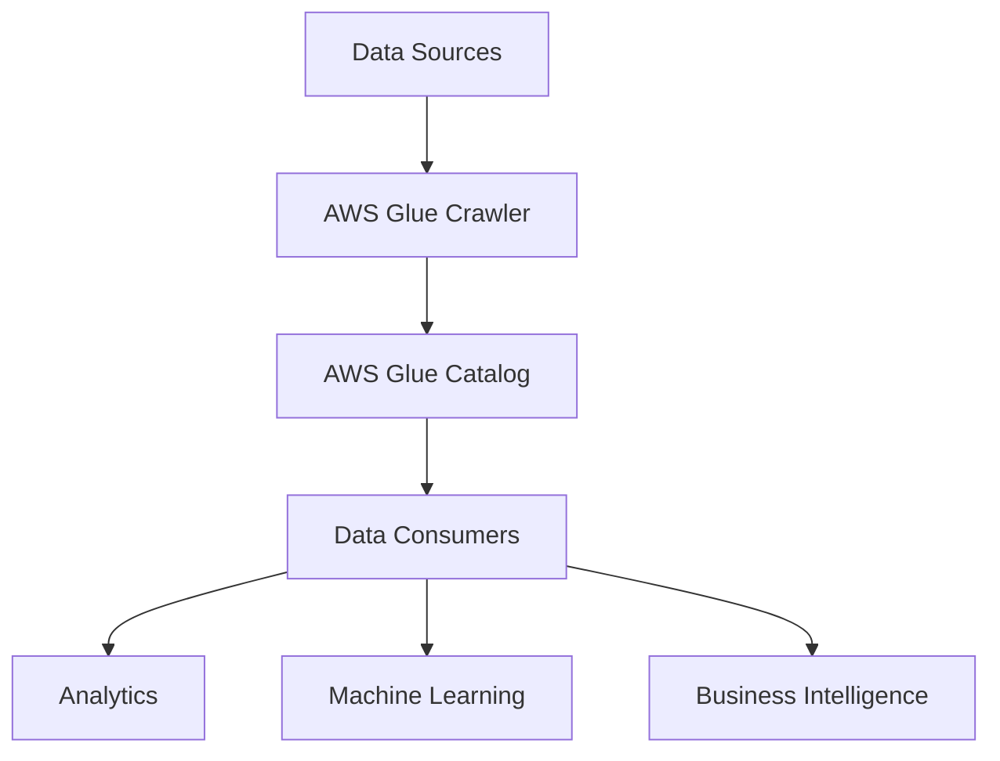
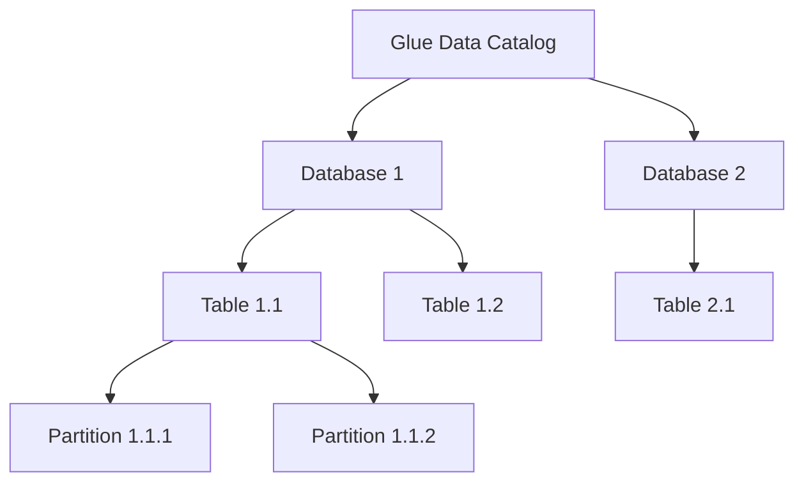

# AWS Glue Catalog API in Scala for the Impatient: From Novice to Practitioner in Record Time

## 1. Introduction

### Why AWS Glue Catalog API?

Imagine you're an explorer in a vast, uncharted library. Books are scattered everywhere, and you have no idea where to find the information you need. Frustrating, right? This is exactly how working with big data can feel without proper cataloging. Enter AWS Glue Catalog API – your ultimate guide in the world of data.

In today's data-driven world, organizations are drowning in information. The challenge isn't just storing this data; it's about making sense of it, finding it when you need it, and using it effectively. This is where AWS Glue Catalog API shines, acting as a central metadata repository that brings order to the chaos of big data.

### What is AWS Glue Catalog API?

AWS Glue Catalog API is like a librarian for your data lake. It keeps track of all your data assets, their schemas, and locations. But unlike a traditional librarian, it's available 24/7, can handle petabytes of data, and speaks the language of modern data architectures.



This API allows you to programmatically create, read, update, and delete metadata in the AWS Glue Data Catalog. It's the backbone of AWS Glue, enabling seamless data discovery and ETL (Extract, Transform, Load) operations.

### Why Scala?

Now, you might be wondering, "Why Scala?" Well, imagine you're building a high-performance race car. You could use regular tools, but wouldn't you want the best, most efficient tools at your disposal? That's Scala for AWS Glue Catalog API.

Scala combines the best of both worlds – the robustness of Java and the expressiveness of functional programming. It's concise, which means less code and fewer bugs. It's also highly scalable (pun intended!), making it perfect for big data processing.

```scala
// A simple Scala example to illustrate its conciseness
val numbers = List(1, 2, 3, 4, 5)
val doubledEvenNumbers = numbers.filter(_ % 2 == 0).map(_ * 2)
// Result: List(4, 8)
```

Pro Tip: Scala's interoperability with Java means you can leverage existing Java libraries while enjoying Scala's powerful features.

Now that we understand the 'why', let's dive into the 'how'. Buckle up, because we're about to turbocharge your data cataloging skills!

## 2. Getting Started

### Setting up your environment

Before we embark on our AWS Glue Catalog API journey, we need to ensure our ship is ready to sail. Let's set up our development environment.

First, you'll need:
1. Scala (version 2.12 or later)
2. sbt (Scala Build Tool)
3. AWS SDK for Scala
4. An AWS account with appropriate permissions

Here's a quick setup guide:

```bash
# Install Scala and sbt (on macOS, adjust for your OS)
brew install scala
brew install sbt

# Create a new Scala project
mkdir glue-catalog-project
cd glue-catalog-project
sbt new scala/hello-world.g8

# Add AWS SDK dependency to build.sbt
libraryDependencies += "com.amazonaws" % "aws-java-sdk-glue" % "1.12.261"
```

Pro Tip: Use an IDE like IntelliJ IDEA with the Scala plugin for a smoother development experience.

### Your first AWS Glue Catalog API call

Now that we're all set up, let's make our first API call. We'll start with something simple – retrieving information about a database in the Glue Catalog.

```scala
import com.amazonaws.services.glue.AWSGlueClientBuilder
import com.amazonaws.services.glue.model.GetDatabaseRequest

object GlueCatalogExample extends App {
  val glueClient = AWSGlueClientBuilder.defaultClient()

  val getDatabaseRequest = new GetDatabaseRequest()
    .withName("my_first_database")

  try {
    val result = glueClient.getDatabase(getDatabaseRequest)
    println(s"Database Name: ${result.getDatabase.getName}")
    println(s"Description: ${result.getDatabase.getDescription}")
  } catch {
    case e: Exception => println(s"Error: ${e.getMessage}")
  }
}
```

When you run this code, it will attempt to retrieve information about a database named "my_first_database" from your Glue Catalog.

Pause and reflect: What do you think will happen if the database doesn't exist? How would you modify the code to handle this scenario?

## 3. Core Concepts

### Understanding the Glue Data Catalog

Think of the Glue Data Catalog as a massive, intelligent filing cabinet for your data lake. It's organized into three main levels:

1. Databases: The top-level containers, like drawers in the filing cabinet.
2. Tables: Within each database, you have tables, similar to folders in a drawer.
3. Partitions: These are subsets of table data, like dividers within a folder.



### API structure and common patterns

The AWS Glue Catalog API follows a request/response model. You send a request object, and it returns a response object. Most operations in the API follow this pattern:

1. Create a request object
2. Call the appropriate method on the Glue client
3. Process the response

Here's an example of listing all databases:

```scala
import com.amazonaws.services.glue.model.GetDatabasesRequest

val request = new GetDatabasesRequest()
val result = glueClient.getDatabases(request)

result.getDatabaseList.forEach { database =>
  println(s"Database: ${database.getName}")
}
```

Pro Tip: Many Glue API calls return paginated results. Always check if there's a `nextToken` in the response and use it to fetch the next page if necessary.

Quick Quiz:
1. What are the three main levels of organization in the Glue Data Catalog?
2. What's the typical pattern for making an API call to the Glue Catalog?

(Answers at the end of the article)

In the next section, we'll dive deeper into CRUD operations and start manipulating our Glue Catalog. Get ready to take control of your data lake's metadata!

## 4. CRUD Operations

### Creating and updating databases

Let's start with the basics: creating a new database in our Glue Catalog. Think of this as adding a new drawer to our filing cabinet.

```scala
import com.amazonaws.services.glue.model.{CreateDatabaseRequest, DatabaseInput}

val databaseName = "my_new_database"
val databaseInput = new DatabaseInput()
  .withName(databaseName)
  .withDescription("This is my first Glue database")

val createDbRequest = new CreateDatabaseRequest()
  .withDatabaseInput(databaseInput)

try {
  glueClient.createDatabase(createDbRequest)
  println(s"Successfully created database: $databaseName")
} catch {
  case e: Exception => println(s"Error creating database: ${e.getMessage}")
}
```

Updating a database is similar, but we use the `UpdateDatabaseRequest` instead:

```scala
import com.amazonaws.services.glue.model.UpdateDatabaseRequest

val updateDbRequest = new UpdateDatabaseRequest()
  .withName(databaseName)
  .withDatabaseInput(new DatabaseInput().withDescription("Updated description"))

glueClient.updateDatabase(updateDbRequest)
```

### Managing tables

Tables are where things get interesting. They represent the structure of your data. Let's create a table for storing customer information:

```scala
import com.amazonaws.services.glue.model._

val tableName = "customers"
val columns = List(
  new Column().withName("id").withType("int"),
  new Column().withName("name").withType("string"),
  new Column().withName("email").withType("string")
)

val tableInput = new TableInput()
  .withName(tableName)
  .withDescription("Customer information")
  .withTableType("EXTERNAL_TABLE")
  .withParameters(Map("classification" -> "parquet").asJava)
  .withStorageDescriptor(
    new StorageDescriptor()
      .withColumns(columns.asJava)
      .withLocation("s3://my-bucket/customers/")
  )

val createTableRequest = new CreateTableRequest()
  .withDatabaseName(databaseName)
  .withTableInput(tableInput)

glueClient.createTable(createTableRequest)
```

Pro Tip: Always set the `TableType` to "EXTERNAL_TABLE" when working with data in S3. This allows other services to access the data without going through Glue.

### Working with partitions

Partitions are a way to divide your table data for more efficient querying. Let's add a partition to our customers table based on the registration year:

```scala
val partition = new PartitionInput()
  .withValues(List("2023").asJava)
  .withStorageDescriptor(
    new StorageDescriptor()
      .withLocation("s3://my-bucket/customers/year=2023/")
  )

val createPartitionRequest = new CreatePartitionRequest()
  .withDatabaseName(databaseName)
  .withTableName(tableName)
  .withPartitionInput(partition)

glueClient.createPartition(createPartitionRequest)
```

Pause and reflect: How might partitioning improve query performance on large datasets? Can you think of a real-world scenario where this would be beneficial?

In the next section, we'll explore more advanced querying techniques to help you navigate your growing data catalog with ease. Stay tuned!

## 5. Advanced Querying

### Searching and filtering

As your Glue Catalog grows, you'll need efficient ways to search and filter your metadata. The `searchTables` API is your Swiss Army knife for this task.

```scala
import com.amazonaws.services.glue.model.SearchTablesRequest

val searchRequest = new SearchTablesRequest()
  .withSearchText("customer")  // Search for tables containing "customer"
  .withMaxResults(10)

val searchResult = glueClient.searchTables(searchRequest)

searchResult.getTableList.forEach { table =>
  println(s"Found table: ${table.getName} in database ${table.getDatabaseName}")
}
```

This search is case-insensitive and looks through table names, descriptions, and column names.

Pro Tip: Use the `Filters` parameter in `SearchTablesRequest` for more precise filtering based on specific attributes.

### Batch operations

When dealing with large-scale changes, batch operations can save you time and resources. Let's look at how to update multiple partition properties at once:

```scala
import com.amazonaws.services.glue.model.{BatchUpdatePartitionRequest, PartitionValueList, PartitionInput}

val partitionsToUpdate = List(
  new PartitionValueList().withValues("2023"),
  new PartitionValueList().withValues("2022")
)

val updates = partitionsToUpdate.map { partition =>
  new PartitionInput()
    .withValues(partition.getValues)
    .withParameters(Map("last_modified" -> System.currentTimeMillis().toString).asJava)
}

val batchUpdateRequest = new BatchUpdatePartitionRequest()
  .withDatabaseName(databaseName)
  .withTableName(tableName)
  .withEntries(
    partitionsToUpdate.zip(updates).map { case (partition, update) =>
      new BatchUpdatePartitionRequestEntry()
        .withPartitionValueList(partition)
        .withPartitionInput(update)
    }.asJava
  )

val result = glueClient.batchUpdatePartition(batchUpdateRequest)

println(s"Successfully updated ${result.getErrors.size()} partitions")
```

This batch operation updates the "last_modified" parameter for partitions from 2022 and 2023 in a single API call.

Quick Quiz:
1. What does the `searchTables` API search through?
2. Why might you use batch operations instead of individual API calls?

(Answers at the end of the article)

As we venture into more complex operations, error handling becomes crucial. In the next section, we'll explore common errors and best practices to make your Glue Catalog interactions robust and efficient.

## 6. Error Handling and Best Practices

### Common errors and how to handle them

When working with AWS Glue Catalog API, you might encounter various errors. Let's look at some common ones and how to handle them:

1. `EntityNotFoundException`: This occurs when you try to access a database, table, or partition that doesn't exist.
Certainly! I'll continue from where we left off in the Error Handling and Best Practices section.

```scala
import com.amazonaws.services.glue.model.EntityNotFoundException

try {
  val result = glueClient.getTable(new GetTableRequest()
    .withDatabaseName("non_existent_db")
    .withName("non_existent_table"))
} catch {
  case e: EntityNotFoundException =>
    println(s"The requested entity does not exist: ${e.getMessage}")
    // Handle the error, perhaps by creating the entity or using a default
}
```

2. `AccessDeniedException`: This happens when your IAM role doesn't have the necessary permissions.

```scala
import com.amazonaws.services.glue.model.AccessDeniedException

try {
  val result = glueClient.getDatabases(new GetDatabasesRequest())
} catch {
  case e: AccessDeniedException =>
    println(s"Access denied: ${e.getMessage}")
    // Log the error and notify the admin to adjust IAM permissions
}
```

3. `ValidationException`: This occurs when the input doesn't meet the API's requirements.

```scala
import com.amazonaws.services.glue.model.ValidationException

try {
  val result = glueClient.createTable(new CreateTableRequest()
    .withDatabaseName("my_database")
    .withTableInput(new TableInput().withName("invalid name with spaces")))
} catch {
  case e: ValidationException =>
    println(s"Invalid input: ${e.getMessage}")
    // Handle the error, perhaps by cleaning the input or using a default value
}
```

Pro Tip: Always wrap your API calls in try-catch blocks and handle specific exceptions. This makes your code more robust and easier to debug.

### Retry strategies

When dealing with network issues or transient errors, implementing a retry strategy can improve the reliability of your application. Here's a simple exponential backoff strategy:

```scala
import scala.annotation.tailrec

def retryWithBackoff[T](op: => T, maxRetries: Int = 3, initialDelay: Long = 1000): T = {
  @tailrec
  def retry(remainingRetries: Int, delay: Long): T = {
    try {
      op
    } catch {
      case e: Exception if remainingRetries > 0 =>
        println(s"Operation failed, retrying in $delay ms. Error: ${e.getMessage}")
        Thread.sleep(delay)
        retry(remainingRetries - 1, delay * 2)
      case e: Exception =>
        throw e
    }
  }
  
  retry(maxRetries, initialDelay)
}

// Usage
val result = retryWithBackoff {
  glueClient.getDatabase(new GetDatabaseRequest().withName("my_database"))
}
```

This function will retry the operation up to 3 times, doubling the delay between each attempt.

### Performance optimization

To optimize your Glue Catalog API usage:

1. Use caching: Store frequently accessed metadata locally to reduce API calls.

```scala
import scala.collection.mutable

object GlueCatalogCache {
  private val databaseCache = mutable.Map[String, Database]()
  
  def getDatabase(name: String): Option[Database] = {
    databaseCache.get(name).orElse {
      try {
        val db = glueClient.getDatabase(new GetDatabaseRequest().withName(name)).getDatabase
        databaseCache.put(name, db)
        Some(db)
      } catch {
        case _: EntityNotFoundException => None
      }
    }
  }
}
```

2. Use batch operations: As we saw earlier, batch operations can significantly reduce the number of API calls for bulk updates.

3. Implement parallel processing: For operations on multiple entities, use Scala's parallel collections to speed up processing.

```scala
import scala.collection.parallel.CollectionConverters._

val tableNames = List("table1", "table2", "table3", "table4", "table5")
val tables = tableNames.par.map { name =>
  glueClient.getTable(new GetTableRequest().withDatabaseName("my_database").withName(name)).getTable
}
```

Pause and reflect: How might you combine caching, batch operations, and parallel processing in a real-world scenario to optimize your Glue Catalog interactions?

## 7. Integration with Spark

One of the most powerful features of AWS Glue Catalog is its seamless integration with Apache Spark. Let's explore how to use Glue Catalog with Spark jobs.

### Reading data using Glue Catalog

To read data from a table defined in Glue Catalog:

```scala
import org.apache.spark.sql.SparkSession

val spark = SparkSession.builder()
  .appName("GlueCatalogExample")
  .config("hive.metastore.client.factory.class", "com.amazonaws.glue.catalog.metastore.AWSGlueDataCatalogHiveClientFactory")
  .enableHiveSupport()
  .getOrCreate()

val df = spark.table("my_database.customers")
df.show()
```

### Writing data to a Glue Catalog table

To write data to a table and update the Glue Catalog:

```scala
import org.apache.spark.sql.SaveMode

df.write
  .mode(SaveMode.Append)
  .format("parquet")
  .saveAsTable("my_database.customers")
```

Pro Tip: When writing data, Spark will automatically update the table schema in Glue Catalog if new columns are added.

## 8. Security and Access Control

### IAM roles and policies

Proper security is crucial when working with data catalogs. AWS Glue uses IAM roles and policies to control access. Here's an example policy that grants read-only access to Glue Catalog:

```json
{
    "Version": "2012-10-17",
    "Statement": [
        {
            "Effect": "Allow",
            "Action": [
                "glue:GetDatabase",
                "glue:GetDatabases",
                "glue:GetTable",
                "glue:GetTables",
                "glue:GetPartition",
                "glue:GetPartitions",
                "glue:BatchGetPartition"
            ],
            "Resource": "*"
        }
    ]
}
```

### Encryption and data protection

To protect sensitive metadata, you can enable encryption for your Glue Data Catalog:

```scala
import com.amazonaws.services.glue.model.DataCatalogEncryptionSettings
import com.amazonaws.services.glue.model.EncryptionAtRest
import com.amazonaws.services.glue.model.PutDataCatalogEncryptionSettingsRequest

val encryptionSettings = new DataCatalogEncryptionSettings()
  .withEncryptionAtRest(new EncryptionAtRest().withCatalogEncryptionMode("SSE-KMS"))

val request = new PutDataCatalogEncryptionSettingsRequest()
  .withDataCatalogEncryptionSettings(encryptionSettings)

glueClient.putDataCatalogEncryptionSettings(request)
```

This enables server-side encryption using AWS KMS for your Glue Data Catalog.

Quick Quiz:
1. How does Spark integrate with Glue Catalog?
2. What are two key aspects of security in Glue Catalog?

(Answers at the end of the article)

In the next section, we'll explore how to monitor and troubleshoot your Glue Catalog operations, ensuring smooth sailing in your data lake journey.

## 9. Monitoring and Troubleshooting

### CloudWatch integration

AWS Glue integrates seamlessly with CloudWatch, allowing you to monitor your Glue Catalog operations. Here's how to set up a CloudWatch alarm for failed Glue API calls:

```scala
import com.amazonaws.services.cloudwatch.AmazonCloudWatchClientBuilder
import com.amazonaws.services.cloudwatch.model._

val cloudWatchClient = AmazonCloudWatchClientBuilder.defaultClient()

val request = new PutMetricAlarmRequest()
  .withAlarmName("GlueAPIFailures")
  .withComparisonOperator(ComparisonOperator.GreaterThanThreshold)
  .withEvaluationPeriods(1)
  .withMetricName("Errors")
  .withNamespace("AWS/Glue")
  .withPeriod(300)
  .withStatistic(Statistic.Sum)
  .withThreshold(5.0)
  .withActionsEnabled(true)
  .withAlarmDescription("Alarm when Glue API calls fail")
  .withAlarmActions(List("arn:aws:sns:region:account-id:topic-name").asJava)

cloudWatchClient.putMetricAlarm(request)
```

This sets up an alarm that triggers when there are more than 5 Glue API errors in a 5-minute period.

### Logging and debugging

Effective logging is crucial for troubleshooting. Here's a simple logging wrapper for Glue API calls:

```scala
import org.slf4j.LoggerFactory

object GlueLogger {
  private val logger = LoggerFactory.getLogger(this.getClass)

  def logApiCall[T](apiName: String)(operation: => T): T = {
    logger.info(s"Starting Glue API call: $apiName")
    try {
      val result = operation
      logger.info(s"Completed Glue API call: $apiName")
      result
    } catch {
      case e: Exception =>
        logger.error(s"Error in Glue API call: $apiName", e)
        throw e
    }
  }
}

// Usage
val database = GlueLogger.logApiCall("GetDatabase") {
  glueClient.getDatabase(new GetDatabaseRequest().withName("my_database")).getDatabase
}
```

This wrapper logs the start and end of each API call, as well as any errors that occur.

Pro Tip: Use structured logging to make it easier to search and analyze your logs. Consider using a library like Logback with JSON formatting.

## 10. Real-world Use Cases

### Data lake management

One common use case for AWS Glue Catalog is managing a data lake. Let's create a simple data lake catalog:

```scala
def createDataLakeTable(database: String, table: String, location: String, columns: List[(String, String)]): Unit = {
  val tableInput = new TableInput()
    .withName(table)
    .withTableType("EXTERNAL_TABLE")
    .withParameters(Map("classification" -> "parquet").asJava)
    .withStorageDescriptor(
      new StorageDescriptor()
        .withColumns(columns.map { case (name, type) => new Column().withName(name).withType(type) }.asJava)
        .withLocation(location)
    )

  val createTableRequest = new CreateTableRequest()
    .withDatabaseName(database)
    .withTableInput(tableInput)

  GlueLogger.logApiCall(s"CreateTable-$database.$table") {
    glueClient.createTable(createTableRequest)
  }
}

// Create tables for different data domains
createDataLakeTable("data_lake", "sales", "s3://my-data-lake/sales/", 
  List(("id", "string"), ("date", "date"), ("amount", "double")))
createDataLakeTable("data_lake", "customers", "s3://my-data-lake/customers/", 
  List(("id", "string"), ("name", "string"), ("email", "string")))
createDataLakeTable("data_lake", "products", "s3://my-data-lake/products/", 
  List(("id", "string"), ("name", "string"), ("category", "string"), ("price", "double")))
```

This creates a structured catalog for your data lake, making it easy to discover and query your data.

### ETL workflow optimization

AWS Glue Catalog can also be used to optimize ETL workflows. Here's an example of how to use the catalog to dynamically generate Spark jobs:

```scala
def generateSparkJob(database: String, table: String): String = {
  val tableMetadata = GlueLogger.logApiCall(s"GetTable-$database.$table") {
    glueClient.getTable(new GetTableRequest().withDatabaseName(database).withName(table)).getTable
  }
  
  val columns = tableMetadata.getStorageDescriptor.getColumns.asScala.map(_.getName)
  val location = tableMetadata.getStorageDescriptor.getLocation
  
  s"""
    |import org.apache.spark.sql.SparkSession
    |
    |val spark = SparkSession.builder().appName("DynamicETL").getOrCreate()
    |
    |val df = spark.read.parquet("$location")
    |val transformedDf = df.select(${columns.map(c => s"col(\"$c\")").mkString(", ")})
    |
    |transformedDf.write.mode("overwrite").parquet("s3://my-data-lake/transformed/$table/")
    |
    |spark.stop()
  """.stripMargin
}

val sparkJob = generateSparkJob("data_lake", "sales")
println(sparkJob)
```

This function generates a Spark job based on the table metadata in Glue Catalog, allowing for dynamic and flexible ETL processes.

Pause and reflect: How might you extend this concept to create a fully automated ETL pipeline using Glue Catalog and Spark?

## 11. Conclusion

### Recap of key learnings

Throughout this journey, we've covered:
1. The fundamentals of AWS Glue Catalog API and its importance in modern data architectures
2. How to perform CRUD operations on databases, tables, and partitions
3. Advanced querying techniques and batch operations
4. Error handling and performance optimization strategies
5. Integration with Spark for powerful data processing
6. Security best practices and monitoring techniques
7. Real-world use cases for data lake management and ETL optimization

### Next steps and resources

To continue your AWS Glue Catalog API in Scala journey:
1. Explore the [AWS Glue Developer Guide](https://docs.aws.amazon.com/glue/latest/dg/what-is-glue.html) for in-depth documentation
2. Join the [AWS Big Data Community](https://aws.amazon.com/big-data/community/) to connect with other data engineers
3. Practice by building a small project, such as a data lake catalog for your personal or work projects
4. Explore advanced features like Glue ETL jobs and Glue DataBrew for more complex data processing tasks

Remember, mastering AWS Glue Catalog API is a journey. Keep experimenting, learning, and building!

Quick Quiz Answers:
1. Core Concepts: Databases, Tables, Partitions
2. Core Concepts: Create request object, call method on Glue client, process response
3. Advanced Querying: Table names, descriptions, and column names
4. Advanced Querying: To reduce the number of API calls and improve efficiency
5. Integration with Spark: By using Glue Catalog as a metastore for Spark SQL
6. Security: IAM roles/policies and encryption

Your 24-hour challenge: Create a simple Scala application that connects to your AWS Glue Catalog, creates a new database and table, and writes some sample data to it using Spark. This will reinforce the concepts we've covered and give you hands-on experience with the API.

Happy coding, and may your data lakes always be well-cataloged!

## 11. AWS Glue and Delta Lake Integration

Delta Lake, an open-source storage layer that brings ACID transactions to Apache Spark and big data workloads, is becoming increasingly popular in modern data architectures. Let's explore how to integrate Delta Lake with AWS Glue and the Glue Catalog API.

### Why Delta Lake?

Before we dive into the integration, let's understand why Delta Lake is gaining traction:

1. ACID Transactions: Ensures data consistency and reliability.
2. Scalable Metadata Handling: Efficiently handles large-scale metadata.
3. Time Travel: Query and roll back to previous versions of your data.
4. Schema Evolution: Easily make changes to your data's schema.
5. Audit History: Track all changes to your data.

These features make Delta Lake an excellent choice for data lakes and large-scale data processing.

### Setting up Delta Lake with AWS Glue

To use Delta Lake with AWS Glue, we need to add the Delta Lake dependencies to our Glue job. Here's how you can do this:

1. First, create a new Glue job and select Spark as the type.
2. In the job parameters, add the following:

```
--conf spark.serializer=org.apache.spark.serializer.KryoSerializer
--conf spark.sql.extensions=io.delta.sql.DeltaSparkSessionExtension
--conf spark.sql.catalog.spark_catalog=org.apache.spark.sql.delta.catalog.DeltaCatalog
--packages io.delta:delta-core_2.12:1.0.0
```

This sets up the necessary configurations and adds the Delta Lake package to your Glue job.

### Reading and Writing Delta Tables

Now, let's look at how to read from and write to Delta tables using AWS Glue:

```scala
import com.amazonaws.services.glue.GlueContext
import com.amazonaws.services.glue.util.Job
import org.apache.spark.sql.SparkSession

object DeltaLakeExample {
  def main(sysArgs: Array[String]): Unit = {
    val spark: SparkSession = SparkSession.builder().getOrCreate()
    val glueContext: GlueContext = new GlueContext(spark.sparkContext)
    
    // Reading from a Delta table
    val df = spark.read.format("delta").load("s3://my-bucket/path/to/delta-table")
    
    // Perform transformations
    val transformedDf = df.filter($"column" > 100)
    
    // Writing to a Delta table
    transformedDf.write.format("delta").mode("overwrite").save("s3://my-bucket/path/to/new-delta-table")
    
    Job.commit()
  }
}
```

### Registering Delta Tables in Glue Catalog

To make Delta tables discoverable and queryable through the Glue Catalog, we need to register them. Here's how:

```scala
import com.amazonaws.services.glue.util.JsonOptions
import com.amazonaws.services.glue.DynamicFrame

val deltaTable = spark.read.format("delta").load("s3://my-bucket/path/to/delta-table")
val dynamicFrame = DynamicFrame(deltaTable, glueContext)

glueContext.getCatalogSink(
  database = "my_database",
  tableName = "my_delta_table",
  additionalOptions = JsonOptions(Map("enableUpdateCatalog" -> true, "updateBehavior" -> "UPDATE_IN_DATABASE"))
).writeDynamicFrame(dynamicFrame)
```

This code reads a Delta table, converts it to a DynamicFrame (Glue's data structure), and then registers it in the Glue Catalog.

### Using Glue Catalog API with Delta Tables

Once registered, you can use the Glue Catalog API to manage and query Delta tables just like any other table. Here's an example of how to get the schema of a registered Delta table:

```scala
import com.amazonaws.services.glue.model.GetTableRequest

val tableRequest = new GetTableRequest()
  .withDatabaseName("my_database")
  .withName("my_delta_table")

val tableResponse = glueClient.getTable(tableRequest)
val columns = tableResponse.getTable.getStorageDescriptor.getColumns

columns.forEach { column =>
  println(s"Column Name: ${column.getName}, Type: ${column.getType}")
}
```

### Time Travel with Delta Lake and Glue

One of Delta Lake's powerful features is time travel. Here's how you can query an earlier version of your data:

```scala
val olderVersion = spark.read.format("delta").option("versionAsOf", 5).load("s3://my-bucket/path/to/delta-table")
```

You can also use a timestamp:

```scala
val olderVersion = spark.read.format("delta").option("timestampAsOf", "2023-05-01").load("s3://my-bucket/path/to/delta-table")
```

### Pro Tips for Delta Lake and Glue

1. Use Delta Lake's MERGE operation for efficient upserts:

```scala
import io.delta.tables._

val deltaTable = DeltaTable.forPath(spark, "s3://my-bucket/path/to/delta-table")
val updates = spark.read.parquet("s3://my-bucket/path/to/updates")

deltaTable.as("oldData")
  .merge(
    updates.as("updates"),
    "oldData.id = updates.id")
  .whenMatched
  .updateAll()
  .whenNotMatched
  .insertAll()
  .execute()
```

2. Optimize your Delta tables regularly:

```scala
deltaTable.optimize().executeCompaction()
```

3. Use Z-ORDER to colocate related data:

```scala
deltaTable.optimize().executeZOrderBy("date", "product_id")
```

Pause and reflect: How might Delta Lake's features like ACID transactions and time travel enhance your current data lake architecture? What challenges in your current setup could be addressed by adopting Delta Lake?

Quick Quiz:
1. What are three key features of Delta Lake?
2. How do you register a Delta table in the Glue Catalog?
3. How can you query an earlier version of a Delta table?

(Answers at the end of the article)

By integrating Delta Lake with AWS Glue and the Glue Catalog, you can build more robust, efficient, and feature-rich data lakes. This combination provides the scalability of cloud storage, the performance of Delta Lake, and the manageability of the Glue Catalog.

In our final chapter, we'll recap our journey and provide next steps for your AWS Glue and Delta Lake learning path.

## 12. Conclusion

### Recap of Key Learnings

Throughout this comprehensive journey into AWS Glue Catalog API in Scala, we've covered a wide range of topics, from basic concepts to advanced techniques and real-world applications. Let's recap the key points:

1. **Fundamentals of AWS Glue Catalog API**: We learned about the importance of data cataloging and how AWS Glue Catalog serves as a central metadata repository.

2. **CRUD Operations**: We explored how to create, read, update, and delete databases, tables, and partitions using the Glue Catalog API in Scala.

3. **Advanced Querying**: We delved into searching and filtering techniques, as well as batch operations for efficient metadata management.

4. **Error Handling and Best Practices**: We covered common errors, retry strategies, and performance optimization techniques to make our Glue Catalog interactions more robust and efficient.

5. **Integration with Spark**: We saw how seamlessly Glue Catalog integrates with Apache Spark, enabling powerful data processing capabilities.

6. **Security and Access Control**: We discussed IAM roles and policies, as well as encryption methods to ensure the security of our data catalog.

7. **Monitoring and Troubleshooting**: We explored CloudWatch integration and logging techniques to keep our Glue operations running smoothly.

8. **Real-world Use Cases**: We applied our knowledge to practical scenarios like data lake management and ETL workflow optimization.

9. **Delta Lake Integration**: In our final chapter, we discovered how to leverage Delta Lake with AWS Glue for enhanced data lake capabilities, including ACID transactions and time travel.

### The Power of AWS Glue Catalog and Delta Lake

By combining AWS Glue Catalog with Delta Lake, we've unlocked a powerful toolset for modern data architectures. This integration allows us to:

- Maintain a consistent and up-to-date catalog of our data assets
- Perform complex data transformations with Spark
- Ensure data consistency and reliability with ACID transactions
- Query historical versions of our data with time travel
- Efficiently manage and evolve our data schemas

These capabilities position us to build scalable, reliable, and flexible data platforms that can adapt to changing business needs.

### Next Steps in Your AWS Glue and Delta Lake Journey

To continue growing your expertise in AWS Glue Catalog and Delta Lake:

1. **Hands-on Practice**: Build a small project that incorporates AWS Glue Catalog, Spark, and Delta Lake. For example, create a data pipeline that ingests data into a Delta Lake table, registers it in the Glue Catalog, and performs some transformations.

2. **Explore Advanced Features**: Dive deeper into Delta Lake features like schema evolution and change data capture (CDC). Experiment with how these can be integrated into your Glue ETL jobs.

3. **Performance Tuning**: Learn about optimizing Spark jobs in the context of AWS Glue and Delta Lake. This includes proper partitioning strategies, caching, and broadcast joins.

4. **Stay Updated**: Follow the AWS Big Data Blog and Delta Lake documentation for the latest features and best practices.

5. **Community Engagement**: Join AWS and Delta Lake community forums. Share your experiences and learn from others who are working on similar challenges.

6. **Certification**: Consider pursuing relevant AWS certifications, such as the AWS Certified Big Data - Specialty or AWS Certified Data Analytics - Specialty.

### Final Thoughts

The world of big data is constantly evolving, and tools like AWS Glue Catalog and Delta Lake are at the forefront of this evolution. By mastering these technologies, you're equipping yourself with the skills to build and manage modern, scalable data architectures.

Remember, the key to success in this field is continuous learning and practical application. Don't be afraid to experiment, make mistakes, and learn from them. Each challenge you overcome will make you a better data engineer.

### Your 24-Hour Challenge

To solidify your learning, here's a challenge to complete within the next 24 hours:

Create a Scala application that does the following:
1. Sets up a connection to AWS Glue Catalog
2. Creates a new database and table in the Glue Catalog
3. Writes some sample data to an S3 location in Delta format
4. Registers this Delta table in the Glue Catalog
5. Performs a simple transformation on the data using Spark
6. Writes the transformed data back to a new Delta table
7. Uses time travel to compare the original and transformed data

This challenge will tie together many of the concepts we've covered and give you hands-on experience with both AWS Glue Catalog and Delta Lake.

Good luck, and may your data lakes always be well-cataloged and your transactions always ACID!

Quick Quiz Answers:
1. Three key features of Delta Lake: ACID transactions, Time Travel, and Schema Evolution
2. To register a Delta table in Glue Catalog: Use `glueContext.getCatalogSink()` with appropriate options
3. To query an earlier version of a Delta table: Use the `versionAsOf` or `timestampAsOf` options when reading the Delta table

