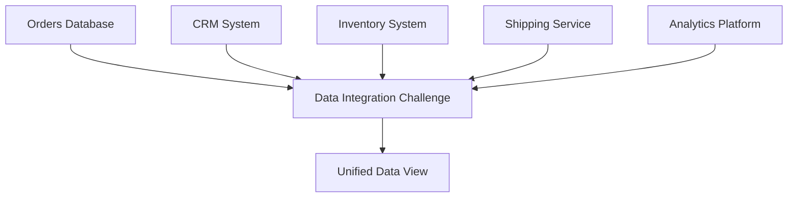
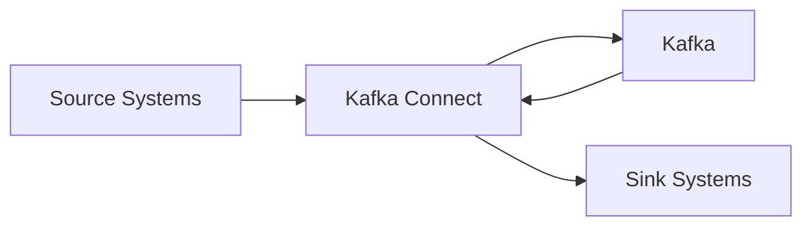
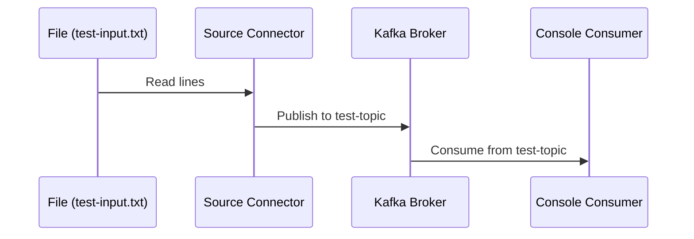
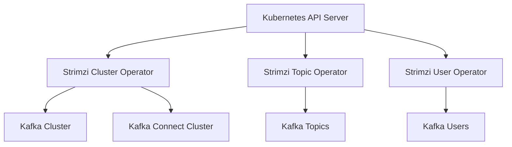
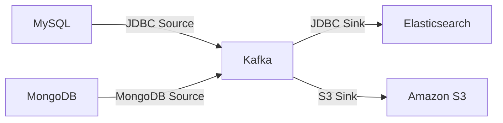

## Chapter 1: Introduction: The Power of Data Integration

### Why Kafka Connect/Strimzi?

Imagine you're a data engineer at a bustling e-commerce company. Every day, millions of transactions flow through your systems - orders, shipments, customer interactions, inventory updates. Now, picture trying to make sense of all this data when it's scattered across dozens of databases, applications, and third-party services. Sounds like a nightmare, right? This is the data integration challenge that countless organizations face today.



But why should you care? Because in today's fast-paced business environment, the ability to harness your data in real-time can be the difference between leading the market and lagging behind. This is where Kafka Connect and Strimzi enter the picture, promising to transform the way we approach data integration.

Let's pause for a moment and reflect:

> 🤔 Think about a time when you needed data from multiple systems to make a decision. How long did it take to gather and reconcile that data? How fresh was the information by the time you could use it?

The promise of real-time data integration isn't just about speed - it's about unlocking new possibilities. Imagine being able to:

- Detect and respond to fraud as it happens, not hours or days later.
- Personalize customer experiences based on up-to-the-second behavior.
- Optimize supply chains by reacting to demand fluctuations in real-time.

These aren't just hypothetical scenarios. Companies like Netflix use Kafka to process trillions of events per day, enabling them to recommend content in real-time and detect issues before they impact users. Uber uses Kafka to handle millions of trips and deliveries, ensuring smooth operations across their global platform.

### What are Kafka Connect and Strimzi?

Now that we've set the stage, let's demystify Kafka Connect and Strimzi.

Kafka Connect is like a universal adapter for your data ecosystem. It's a framework that standardizes the integration of Kafka with other data systems, whether as sources (where data originates) or sinks (where data lands). Think of it as a team of highly efficient data movers, capable of streaming data in and out of Kafka with minimal fuss.



Key features of Kafka Connect include:
- A common framework for building and running connectors
- Scalable and reliable data streaming
- Support for distributed mode operation
- A RESTful API for managing connectors

Strimzi, on the other hand, is your trusty sidekick when you're working in a Kubernetes environment. It's an operator that makes deploying and managing Kafka on Kubernetes a breeze. If Kafka Connect is your data mover, Strimzi is the skilled orchestrator ensuring everything runs smoothly in the complex world of container orchestration.

Strimzi provides:
- Custom Resource Definitions (CRDs) for Kafka, Kafka Connect, and more
- Automated configuration and management of Kafka clusters
- Simplified scaling and updates of Kafka deployments
- Integration with Kubernetes ecosystem tools

Together, they form a powerful duo that can transform your data integration efforts. Kafka Connect provides the connectivity, while Strimzi ensures scalability and ease of management in cloud-native environments.

💡 Pro Tip: While Kafka Connect can be used without Strimzi, combining them gives you a robust, scalable, and easily manageable data integration platform, especially in Kubernetes environments.

How will this guide help you?

By the end of this guide, you'll be able to:

1. Set up and configure Kafka Connect for various data sources and sinks.
2. Deploy and manage Kafka Connect on Kubernetes using Strimzi.
3. Implement real-world data integration scenarios with confidence.
4. Troubleshoot common issues and optimize your Kafka Connect deployments.

We'll take a hands-on approach, starting with simple examples and progressively tackling more complex scenarios. Each chapter builds on the previous one, with plenty of practical exercises to reinforce your learning.

Here's a quick preview of our journey:

1. We'll start by getting our hands dirty with a simple Kafka Connect pipeline.
2. Then, we'll dive deeper into advanced connector configurations and data transformations.
3. We'll explore how Strimzi simplifies Kafka operations in Kubernetes environments.
4. We'll tackle real-world scenarios and best practices to level up your skills.
5. Finally, we'll cover troubleshooting and advanced topics to round out your expertise.

Throughout the guide, you'll find:

- 🧠 "Pause and Reflect" moments to deepen your understanding.
- 💡 Pro Tips offering insider knowledge and shortcuts.
- ⚠️ Common Pitfalls to help you avoid typical mistakes.
- 🏋️ Hands-on Exercises to apply what you've learned.

Are you ready to embark on this journey from Kafka Connect novice to practitioner? Let's dive in!

🏋️ Quick Exercise: Before we move on, take a moment to jot down three data integration challenges you've faced or anticipate facing in your work. We'll revisit these throughout the guide to see how Kafka Connect and Strimzi can address them.

⚠️ Common Misconception: Some people think Kafka Connect is only useful for large-scale, complex data pipelines. In reality, it's incredibly versatile and can be just as valuable for smaller, simpler use cases. Don't hesitate to start small and scale up as needed!

In the next chapter, we'll roll up our sleeves and set up our first Kafka Connect pipeline. Get ready to see the power of Kafka Connect in action!


## Chapter 2: Getting Started: Your First Kafka Connect Pipeline

Why start with a simple pipeline?

Before we dive into the technical details, let's consider why we're starting with a simple pipeline. In the world of data engineering, it's easy to get overwhelmed by the complexity of large-scale systems. But even the most intricate data pipelines are built on fundamental principles. By starting small, we can grasp these core concepts without the distraction of advanced features.

Think of it like learning to drive. You don't start by racing in Formula 1; you begin in an empty parking lot, mastering the basics of steering, accelerating, and braking. Similarly, our simple Kafka Connect pipeline will teach you the essentials, preparing you for more complex scenarios later.

Setting up the environment

Before we can create our first pipeline, we need to set up our environment. Don't worry – we'll keep it as simple as possible to get you up and running quickly.

Prerequisites:

1. Java 8 or higher
2. Apache Kafka (we'll use version 2.8.0 for this guide)
3. A text editor of your choice

Quick setup guide:

1. Download Apache Kafka from the official website.
2. Extract the downloaded file to a directory of your choice.
3. Open a terminal and navigate to the Kafka directory.

```bash
cd path/to/kafka
```

4. Start the Zookeeper server:

```bash
bin/zookeeper-server-start.sh config/zookeeper.properties
```

5. In a new terminal window, start the Kafka broker:

```bash
bin/kafka-server-start.sh config/server.properties
```

💡 Pro Tip: In a production environment, you'd typically have multiple brokers and would use tools like Strimzi for deployment. For learning purposes, this single-broker setup is perfect.

Creating a simple source connector

Now that our environment is ready, let's create our first source connector. We'll use the built-in FileStreamSource connector, which reads data from a text file and publishes it to a Kafka topic.

Step 1: Create a configuration file for the connector

Create a file named `file-source.properties` with the following content:

```properties
name=local-file-source
connector.class=org.apache.kafka.connect.file.FileStreamSource
tasks.max=1
file=test-input.txt
topic=test-topic
```

Let's break down this configuration:

- `name`: A unique name for our connector
- `connector.class`: The Java class for the connector we're using
- `tasks.max`: The maximum number of tasks that should be created for this connector
- `file`: The input file to read from
- `topic`: The Kafka topic to publish the data to

Step 2: Create the input file

Create a file named `test-input.txt` with some sample content:

```
Hello, Kafka Connect!
This is our first pipeline.
Isn't it exciting?
```

Step 3: Start the connector

Run the following command to start the connector:

```bash
bin/connect-standalone.sh config/connect-standalone.properties file-source.properties
```

🧠 Pause and Reflect: What do you think will happen when we run this command? How might the data flow from the file to Kafka?

Step 4: Verify the data flow

To confirm that our pipeline is working, let's consume messages from the `test-topic`:

```bash
bin/kafka-console-consumer.sh --bootstrap-server localhost:9092 --topic test-topic --from-beginning
```

You should see the contents of your `test-input.txt` file printed to the console.

Congratulations! You've just created your first Kafka Connect pipeline. Let's visualize what we've accomplished:



Creating a simple sink connector

Now that we've seen how to get data into Kafka, let's create a sink connector to get data out. We'll use the FileStreamSink connector to write data from a Kafka topic to a file.

Step 1: Create a configuration file for the sink connector

Create a file named `file-sink.properties` with the following content:

```properties
name=local-file-sink
connector.class=org.apache.kafka.connect.file.FileStreamSink
tasks.max=1
file=test-output.txt
topics=test-topic
```

Step 2: Start the sink connector

Run the following command to start the sink connector:

```bash
bin/connect-standalone.sh config/connect-standalone.properties file-sink.properties
```

Step 3: Verify the data flow

Check the contents of `test-output.txt`:

```bash
cat test-output.txt
```

You should see the same messages that were in your input file.

🏋️ Hands-on Exercise: Try adding more lines to your `test-input.txt` file while the connectors are running. What happens? How quickly do you see the new lines appear in the output file?

⚠️ Common Pitfall: Remember that Kafka Connect reads files from the beginning each time it starts. In a real-world scenario, you'd want to track the position in the file to avoid re-processing data.

Wrapping up

In this chapter, we've accomplished quite a bit:

1. We set up a basic Kafka environment.
2. We created a source connector to read data from a file and publish it to Kafka.
3. We created a sink connector to read data from Kafka and write it to a file.

This simple pipeline demonstrates the core concept of Kafka Connect: moving data between external systems and Kafka with minimal coding.

💡 Pro Tip: While we used file-based connectors for simplicity, Kafka Connect shines when working with databases, cloud storage, and other complex systems. The principles remain the same, but the impact scales dramatically.

In the next chapter, we'll dive deeper into connector configurations and explore how to transform data as it flows through our pipelines. Get ready to take your Kafka Connect skills to the next level!


## Chapter 3: Diving Deeper: Advanced Connector Configurations

Why explore advanced configurations?

As you begin to work with Kafka Connect in real-world scenarios, you'll quickly realize that the basic setup we explored in Chapter 2 is just the tip of the iceberg. Advanced configurations allow you to fine-tune your connectors, handle complex data structures, and implement robust error handling. Mastering these concepts will elevate you from a Kafka Connect novice to a skilled practitioner.

Exploring connector properties

Let's start by diving deeper into connector properties. These properties control how connectors behave and interact with both the source/sink systems and Kafka itself.

Common properties:

1. `tasks.max`: Determines the maximum number of tasks that should be created for this connector. More tasks can lead to better parallelism.

2. `key.converter` and `value.converter`: Specify the converter classes for keys and values. These control how data is serialized and deserialized.

3. `transforms`: Defines a list of transformations to apply to each record.

4. `errors.tolerance`: Specifies how the connector should handle errors (e.g., continue, fail).

Let's look at a more advanced configuration for our file source connector:

```properties
name=advanced-file-source
connector.class=org.apache.kafka.connect.file.FileStreamSource
tasks.max=2
file=/path/to/large/log/file.log
topic=log-events
batch.size=100
errors.tolerance=all
errors.log.enable=true
errors.log.include.messages=true
key.converter=org.apache.kafka.connect.json.JsonConverter
value.converter=org.apache.kafka.connect.json.JsonConverter
transforms=addTimestamp
transforms.addTimestamp.type=org.apache.kafka.connect.transforms.TimestampConverter$Value
transforms.addTimestamp.target.type=Timestamp
transforms.addTimestamp.field=event_time
transforms.addTimestamp.format=yyyy-MM-dd'T'HH:mm:ss
```

This configuration:
- Uses 2 tasks for parallel processing
- Reads from a large log file
- Publishes to a 'log-events' topic
- Processes records in batches of 100
- Tolerates all errors, logging them for review
- Uses JSON converters for both keys and values
- Adds a timestamp to each record

🧠 Pause and Reflect: How might this configuration improve performance and reliability compared to our simple example in Chapter 2?

Connector-specific properties:

Each connector type (e.g., JDBC, S3, Elasticsearch) has its own set of properties. Always refer to the specific connector's documentation for a complete list.

💡 Pro Tip: When working with a new connector, start with the minimal required properties and gradually add more as you understand their impact.

Data transformation with SMTs

Single Message Transforms (SMTs) are a powerful feature of Kafka Connect that allow you to modify records as they flow through your pipeline. Let's explore some common transformations.

Example 1: Field renaming

Suppose we want to rename a field in our records. We can use the `ReplaceField` SMT:

```properties
transforms=renameField
transforms.renameField.type=org.apache.kafka.connect.transforms.ReplaceField$Value
transforms.renameField.renames=old_name:new_name
```

Example 2: Filtering records

We can use the `Filter` SMT to only process records that meet certain criteria:

```properties
transforms=filterLargeValues
transforms.filterLargeValues.type=org.apache.kafka.connect.transforms.Filter$Value
transforms.filterLargeValues.predicate=isLarge
transforms.filterLargeValues.isLarge.type=org.apache.kafka.connect.transforms.predicates.RecordIsTooLarge$Value
transforms.filterLargeValues.isLarge.max.value.bytes=1048576
```

This configuration filters out records larger than 1MB.

🏋️ Hands-on Exercise: Try adding these transformations to your file source connector. How does it change the data that ends up in your Kafka topic?

Error handling and dead letter queues

In production environments, it's crucial to handle errors gracefully. Kafka Connect provides several mechanisms for this.

Configuring error tolerance:

```properties
errors.tolerance=all
errors.log.enable=true
errors.log.include.messages=true
```

This configuration tells the connector to continue processing even if it encounters errors, and to log those errors (including the problematic messages) for later review.

Implementing Dead Letter Queues (DLQs):

For more advanced error handling, you can implement a Dead Letter Queue. This involves sending problematic records to a separate Kafka topic for later processing.

```properties
errors.deadletterqueue.topic.name=my-dlq-topic
errors.deadletterqueue.context.headers.enable=true
```

With this configuration, any records that cause errors will be sent to the `my-dlq-topic`, along with headers that provide context about the error.

⚠️ Common Pitfall: While it's tempting to set `errors.tolerance=all` for all connectors, be cautious. In some cases, it's better to fail fast and fix the root cause rather than silently dropping or mishandling data.

Wrapping up

In this chapter, we've explored:
1. Advanced connector properties for fine-tuning performance and behavior
2. Using Single Message Transforms (SMTs) to modify data in-flight
3. Implementing robust error handling with logging and Dead Letter Queues

These concepts form the backbone of production-ready Kafka Connect deployments. By mastering them, you'll be well-equipped to handle complex data integration scenarios.

💡 Pro Tip: Always test your configurations thoroughly in a staging environment before deploying to production. Small changes in connector properties can have significant impacts on performance and data integrity.

In the next chapter, we'll shift our focus to Strimzi and explore how it simplifies deploying and managing Kafka Connect in Kubernetes environments. Get ready to take your Kafka Connect skills to the cloud!

## Chapter 4: Strimzi: Kafka on Kubernetes

Why Strimzi?

As organizations move towards cloud-native architectures, running Kafka and Kafka Connect on Kubernetes has become increasingly common. However, managing Kafka in a Kubernetes environment can be complex. This is where Strimzi comes in, simplifying the deployment and management of Kafka on Kubernetes.

Understanding Strimzi architecture

Strimzi extends Kubernetes with Custom Resource Definitions (CRDs) that allow you to deploy and manage Kafka clusters, topics, users, and connectors using native Kubernetes tools.

Key Strimzi components:

1. Cluster Operator: Manages Kafka and Kafka Connect clusters
2. Topic Operator: Manages Kafka topics
3. User Operator: Manages Kafka users



Key Strimzi CRDs:

1. `Kafka`: Defines a Kafka cluster
2. `KafkaConnect`: Defines a Kafka Connect cluster
3. `KafkaConnector`: Defines a Kafka connector
4. `KafkaTopic`: Defines a Kafka topic
5. `KafkaUser`: Defines a Kafka user

Deploying Kafka Connect with Strimzi

Let's walk through the process of deploying a Kafka Connect cluster using Strimzi.

Step 1: Install Strimzi

First, we need to install Strimzi in our Kubernetes cluster. We'll use Helm for this:

```bash
helm repo add strimzi https://strimzi.io/charts/
helm install strimzi-operator strimzi/strimzi-kafka-operator
```

Step 2: Create a KafkaConnect resource

Create a file named `kafka-connect-cluster.yaml`:

```yaml
apiVersion: kafka.strimzi.io/v1beta2
kind: KafkaConnect
metadata:
  name: my-connect-cluster
spec:
  version: 2.8.0
  replicas: 3
  bootstrapServers: my-kafka-bootstrap:9092
  config:
    group.id: my-connect-cluster
    offset.storage.topic: my-connect-cluster-offsets
    config.storage.topic: my-connect-cluster-configs
    status.storage.topic: my-connect-cluster-status
```

Apply this resource:

```bash
kubectl apply -f kafka-connect-cluster.yaml
```

This will create a Kafka Connect cluster with 3 replicas.

Step 3: Deploy a connector using KafkaConnector

Now, let's deploy our file source connector using a KafkaConnector resource. Create a file named `file-source-connector.yaml`:

```yaml
apiVersion: kafka.strimzi.io/v1beta2
kind: KafkaConnector
metadata:
  name: file-source-connector
  labels:
    strimzi.io/cluster: my-connect-cluster
spec:
  class: org.apache.kafka.connect.file.FileStreamSource
  tasksMax: 1
  config:
    file: "/tmp/input.txt"
    topic: "my-topic"
```

Apply this resource:

```bash
kubectl apply -f file-source-connector.yaml
```

💡 Pro Tip: You can use `kubectl` to manage your connectors just like any other Kubernetes resource. For example, `kubectl get kafkaconnectors` will list all your connectors.

Scaling and monitoring

One of the benefits of running Kafka Connect on Kubernetes is easy scaling. You can scale your Kafka Connect cluster by updating the `replicas` field in your KafkaConnect resource.

To scale to 5 replicas:

```bash
kubectl patch kafkaconnect my-connect-cluster --type merge -p '{"spec":{"replicas":5}}'
```

For monitoring, Strimzi integrates well with Prometheus. You can deploy Prometheus and Grafana in your Kubernetes cluster to monitor your Kafka and Kafka Connect clusters.

🏋️ Hands-on Exercise: Try scaling your Kafka Connect cluster up and down. How does this affect the distribution of connector tasks?

⚠️ Common Pitfall: Remember that scaling Kafka Connect doesn't automatically scale your connectors. You may need to adjust `tasksMax` in your connector configurations to take advantage of additional capacity.

Wrapping up

In this chapter, we've explored:
1. The architecture of Strimzi and how it extends Kubernetes
2. Deploying Kafka Connect clusters using Strimzi
3. Managing connectors with KafkaConnector resources
4. Scaling and monitoring Kafka Connect in Kubernetes

By leveraging Strimzi, we've simplified the deployment and management of Kafka Connect in a Kubernetes environment. This approach provides scalability, resilience, and ease of management that are crucial for production deployments.

In the next chapter, we'll dive into real-world scenarios and best practices, applying what we've learned to solve common data integration challenges. Get ready to put your Kafka Connect skills to the test!

## Chapter 5: Real-World Scenarios and Best Practices

Why focus on real-world scenarios?

Theory is important, but the real value of Kafka Connect shines through when applied to actual business problems. In this chapter, we'll tackle a realistic scenario that demonstrates how Kafka Connect can solve complex data integration challenges. We'll also cover best practices that will help you design robust, scalable, and maintainable data pipelines.

Case study: Building a data pipeline for an e-commerce platform

Let's imagine we're working for a growing e-commerce company. The company wants to build a real-time data pipeline that will:

1. Capture order data from a MySQL database
2. Enrich this data with customer information from MongoDB
3. Send the enriched data to Elasticsearch for real-time analytics
4. Archive all raw data to S3 for long-term storage

Here's a visual representation of our pipeline:



Let's break this down step by step:

Step 1: Capturing order data from MySQL

We'll use the Debezium MySQL connector for this. Create a file named `mysql-source.yaml`:

```yaml
apiVersion: kafka.strimzi.io/v1beta2
kind: KafkaConnector
metadata:
  name: mysql-source
  labels:
    strimzi.io/cluster: my-connect-cluster
spec:
  class: io.debezium.connector.mysql.MySqlConnector
  tasksMax: 1
  config:
    database.hostname: mysql
    database.port: 3306
    database.user: debezium
    database.password: dbz
    database.server.id: 184054
    database.server.name: dbserver1
    table.whitelist: inventory.orders
    database.history.kafka.bootstrap.servers: my-kafka:9092
    database.history.kafka.topic: schema-changes.inventory
```

Step 2: Enriching data with customer information from MongoDB

We'll use the MongoDB source connector for this. Create a file named `mongodb-source.yaml`:

```yaml
apiVersion: kafka.strimzi.io/v1beta2
kind: KafkaConnector
metadata:
  name: mongodb-source
  labels:
    strimzi.io/cluster: my-connect-cluster
spec:
  class: com.mongodb.kafka.connect.MongoSourceConnector
  tasksMax: 1
  config:
    connection.uri: mongodb://mongo:27017
    database: customers
    collection: customer_info
```

Step 3: Sending enriched data to Elasticsearch

We'll use the Elasticsearch sink connector. Create a file named `elasticsearch-sink.yaml`:

```yaml
apiVersion: kafka.strimzi.io/v1beta2
kind: KafkaConnector
metadata:
  name: elasticsearch-sink
  labels:
    strimzi.io/cluster: my-connect-cluster
spec:
  class: io.confluent.connect.elasticsearch.ElasticsearchSinkConnector
  tasksMax: 1
  config:
    connection.url: http://elasticsearch:9200
    topics: enriched-orders
    key.ignore: true
    schema.ignore: true
    behavior.on.null.values: ignore
```

Step 4: Archiving raw data to S3

Finally, we'll use the S3 sink connector. Create a file named `s3-sink.yaml`:

```yaml
apiVersion: kafka.strimzi.io/v1beta2
kind: KafkaConnector
metadata:
  name: s3-sink
  labels:
    strimzi.io/cluster: my-connect-cluster
spec:
  class: io.confluent.connect.s3.S3SinkConnector
  tasksMax: 1
  config:
    s3.bucket.name: my-bucket
    s3.region: us-west-2
    topics: dbserver1.inventory.orders,customers.customer_info
    flush.size: 1000
    storage.class: io.confluent.connect.s3.storage.S3Storage
    format.class: io.confluent.connect.s3.format.json.JsonFormat
    partitioner.class: io.confluent.connect.storage.partitioner.DefaultPartitioner
```

🧠 Pause and Reflect: How does this pipeline solve the company's data integration challenges? What benefits does it provide over traditional batch-oriented ETL processes?

Performance tuning

As you deploy your Kafka Connect pipelines in production, you'll need to tune them for optimal performance. Here are some key areas to focus on:

1. Connector tuning:
   - Adjust `tasks.max` based on your data volume and available resources
   - Use appropriate batch sizes (`batch.size` for sources, `flush.size` for sinks)
   - Configure appropriate poll intervals for source connectors

2. Kafka tuning:
   - Ensure sufficient partitions for high throughput topics
   - Adjust retention periods based on your use case
   - Configure appropriate replication factors for data durability

💡 Pro Tip: Always monitor your Kafka Connect clusters and individual connectors. Tools like Prometheus and Grafana can help you identify bottlenecks and optimize performance.

Security considerations

Security is crucial when dealing with sensitive business data. Here are some key security measures to implement:

1. Authentication: Use strong authentication for all components (Kafka, Kafka Connect, source systems, sink systems)
2. Authorization: Implement fine-grained access controls using Kafka ACLs
3. Encryption: Use TLS for in-transit encryption and consider encryption at rest for sensitive data
4. Secrets management: Use Kubernetes secrets or external secret management systems to handle sensitive configuration data

Here's an example of how to configure SSL for a Kafka Connect cluster in Strimzi:

```yaml
apiVersion: kafka.strimzi.io/v1beta2
kind: KafkaConnect
metadata:
  name: my-connect-cluster
spec:
  # ... other configurations ...
  tls:
    trustedCertificates:
      - secretName: my-cluster-ca-cert
        certificate: ca.crt
  authentication:
    type: tls
    certificateAndKey:
      secretName: my-connect-secret
      certificate: connect.crt
      key: connect.key
```

⚠️ Common Pitfall: Don't overlook security in development environments. It's best to develop with security measures in place to avoid issues when transitioning to production.

## Chapter 6: Troubleshooting and Advanced Topics

As you work more with Kafka Connect, you'll inevitably encounter issues. Let's cover some common problems and their solutions.

Common issues and solutions:

1. Connector failures
   - Issue: Connector tasks are failing repeatedly
   - Solution: Check the connector logs using `kubectl logs`. Common causes include misconfiguration, network issues, or problems with source/sink systems.

2. Data inconsistencies
   - Issue: Data in the sink doesn't match the source
   - Solution: Verify your SMTs and data converters. Ensure that your connectors are configured to handle all data types correctly.

3. Performance issues
   - Issue: Connectors are running slowly or falling behind
   - Solution: Check resource allocation, increase `tasks.max`, and optimize batch sizes. Also, ensure that your Kafka cluster can handle the load.

Advanced Kafka Connect features:

1. Exactly-once semantics (EOS)
   Kafka Connect supports exactly-once semantics for some connectors. To enable EOS:

```
properties
   producer.override.enable.idempotence=true
   producer.override.transactional.id=${filename}-${kafka.topic}-${kafka.partition}
```

1. Developing custom connectors
   When existing connectors don't meet your needs, you can develop custom ones. Here's a basic structure for a custom source connector:

   ```java
   public class MySourceConnector extends SourceConnector {
       @Override
       public void start(Map<String, String> props) {
           // Initialize your connector
       }

       @Override
       public Class<? extends Task> taskClass() {
           return MySourceTask.class;
       }

       @Override
       public List<Map<String, String>> taskConfigs(int maxTasks) {
           // Define task configurations
       }

       // Other required methods...
   }
   ```

🏋️ Hands-on Exercise: Try developing a simple custom connector that reads data from a specific API and writes it to Kafka.

## Chapter 7: Conclusion and Next Steps

Congratulations! You've come a long way in your Kafka Connect journey. Let's recap the key points we've covered:

1. The basics of Kafka Connect and its role in data integration
2. Setting up and configuring Kafka Connect connectors
3. Advanced connector configurations and data transformations
4. Deploying Kafka Connect on Kubernetes with Strimzi
5. Real-world scenarios and best practices
6. Troubleshooting and advanced features

Key takeaways:
- Kafka Connect provides a scalable and reliable way to integrate Kafka with external systems
- Proper configuration and monitoring are crucial for optimal performance
- Security should be a primary concern in all deployments
- Strimzi simplifies Kafka and Kafka Connect management in Kubernetes environments

Best practices checklist:
- [ ] Always version control your connector configurations
- [ ] Implement proper error handling and monitoring
- [ ] Regularly review and optimize your connector configurations
- [ ] Keep your Kafka Connect clusters and connectors updated
- [ ] Implement security best practices from the start

Future learning path:
1. Dive deeper into specific connectors relevant to your use cases
2. Explore Kafka Streams and ksqlDB for stream processing
3. Learn about Kafka security features in depth
4. Explore advanced Kubernetes features for managing Strimzi deployments

Community resources:
- Confluent Community: https://community.confluent.io/
- Strimzi GitHub: https://github.com/strimzi/strimzi-kafka-operator
- Apache Kafka mailing lists: https://kafka.apache.org/contact

💡 Pro Tip: The Kafka ecosystem is constantly evolving. Stay updated by following key community members on social media and regularly checking the official documentation.

Call to Action:
Now that you've completed this guide, it's time to apply your knowledge. Here's a task to complete within the next 24 hours:

Design and implement a Kafka Connect pipeline that solves a specific data integration challenge in your organization. Start small – perhaps moving data from a database to a data warehouse. Document your process, challenges faced, and solutions implemented. Share your experience with a colleague or in a community forum.

Remember, the key to mastering Kafka Connect is practical application. Each pipeline you build will deepen your understanding and sharpen your skills.

Thank you for joining me on this journey from Kafka Connect novice to practitioner. Happy data streaming!