# The Impatient Investor's Roadmap to Risk Factor Management

| Section | Subsection | Key Points |
|---------|------------|------------|
| 1. Introduction | 1.1 Why Risk Factors Matter | - The importance of understanding risk in investment <br> - Real-world examples of risk factor impact <br> - Setting the stage for rapid learning |
| | 1.2 What Are Risk Factors? | - Definition and basic concepts <br> - Types of risk factors <br> - How risk factors affect portfolio performance |
| 2. Market Risk Factors | 2.1 Equity Risk | - Understanding stock market volatility <br> - Beta and its implications <br> - Example: Tech stock volatility during market crashes |
| | 2.2 Interest Rate Risk | - How interest rates affect different asset classes <br> - Duration and convexity concepts <br> - Example: Bond portfolio performance in rising rate environments |
| | 2.3 Currency Risk | - Impact of exchange rate fluctuations <br> - Hedging strategies <br> - Example: International investment returns during currency crises |
| 3. Credit Risk Factors | 3.1 Default Risk | - Understanding credit ratings <br> - Yield spreads and their significance <br> - Example: Corporate bond defaults and portfolio impact |
| | 3.2 Credit Spread Risk | - Factors affecting credit spreads <br> - Credit derivatives and their use <br> - Example: High-yield bond performance during economic downturns |
| 4. Liquidity Risk Factors | 4.1 Asset Liquidity Risk | - Bid-ask spreads and trading volume <br> - Illiquid asset valuation challenges <br> - Example: Real estate investments during market freezes |
| | 4.2 Funding Liquidity Risk | - Margin calls and forced selling <br> - Cash flow management in portfolios <br> - Example: Hedge fund collapses due to liquidity crunches |
| 5. Operational Risk Factors | 5.1 Model Risk | - Limitations of financial models <br> - Backtesting and stress testing <br> - Example: Long-Term Capital Management collapse |
| | 5.2 Counterparty Risk | - Assessing counterparty creditworthiness <br> - Netting agreements and collateral management <br> - Example: Lehman Brothers bankruptcy impact |
| 6. Macroeconomic Risk Factors | 6.1 Economic Growth Risk | - GDP growth and its impact on investments <br> - Leading economic indicators <br> - Example: Portfolio performance during recessions |
| | 6.2 Inflation Risk | - Effects of inflation on different asset classes <br> - Real vs. nominal returns <br> - Example: 1970s stagflation and investment strategies |
| 7. Behavioral Risk Factors | 7.1 Investor Sentiment | - Market bubbles and crashes <br> - Contrarian investing strategies <br> - Example: Dot-com bubble and its aftermath |
| | 7.2 Herd Behavior | - Momentum and trend-following <br> - Risks of crowded trades <br> - Example: GameStop short squeeze |
| 8. Integrating Risk Factors | 8.1 Risk Factor Models | - Single-factor vs. multi-factor models <br> - Factor exposure analysis <br> - Example: Fama-French three-factor model application |
| | 8.2 Risk Budgeting | - Allocating risk across factors <br> - Risk parity strategies <br> - Example: All-weather portfolio construction |
| 9. Practical Application | 9.1 Building a Risk-Aware Portfolio | - Step-by-step guide to factor-based portfolio construction <br> - Tools and resources for risk factor analysis <br> - Example: Creating a diversified multi-factor portfolio |
| | 9.2 Monitoring and Rebalancing | - Key risk metrics to track <br> - When and how to adjust factor exposures <br> - Example: Portfolio rebalancing during market turmoil |
| 10. Conclusion | 10.1 The Road Ahead | - Emerging trends in risk factor analysis <br> - Continuous learning and adaptation <br> - Call to action: Implementing risk factor management |


## 1. Introduction

### 1.1 Why Risk Factors Matter

Picture this: You're standing at the edge of a vast, turbulent ocean. This ocean represents the world of investments, with its ever-changing currents, hidden depths, and occasional storms. As an investor, you're about to set sail on this ocean, hoping to reach the distant shores of financial success. But here's the million-dollar question: How do you navigate these treacherous waters without capsizing?

The answer lies in understanding and mastering risk factors in investment portfolio management. But why should you, an impatient learner eager to dive into the world of investing, care about these risk factors?

Let's start with a real-world example that shook the financial world:

> In 2008, Lehman Brothers, once a titan of Wall Street, collapsed almost overnight. Many investors who had their life savings tied up in Lehman's stocks or bonds saw their wealth evaporate. But here's the kicker: some savvy investors who understood risk factors had already reduced their exposure to Lehman and similar financial institutions, preserving their capital and even profiting from the crisis.

This stark contrast illustrates why risk factors matter. They're not just academic concepts or fancy jargon; they're the difference between sailing smoothly through financial storms and being capsized by them.

Consider another example:

> In early 2020, as the COVID-19 pandemic swept across the globe, stock markets plummeted. However, investors who had diversified their portfolios based on risk factors, including exposure to defensive sectors and government bonds, weathered the storm much better than those who hadn't.

These examples underscore a crucial point: Understanding risk factors isn't just about avoiding losses; it's about positioning yourself to capitalize on opportunities that arise from market dislocations.

Now, I know what you're thinking: "This all sounds important, but I don't have years to study finance textbooks!" Fear not, impatient learner. This article is designed to take you from novice to practitioner in record time. We'll cut through the jargon, focus on practical applications, and use engaging examples to make these concepts stick.

By the end of this journey, you'll be equipped with the knowledge to:
- Identify and assess various risk factors affecting your investments
- Construct a portfolio that aligns with your risk tolerance and financial goals
- Navigate market turbulence with confidence and agility

So, are you ready to transform from a novice sailor into a skilled navigator of the investment seas? Let's set sail into the world of risk factors!

### 1.2 What Are Risk Factors?

Before we dive deeper, let's demystify what we mean by "risk factors" in investment portfolio management. Imagine you're a chef preparing a complex dish. Each ingredient you add affects the final taste, texture, and nutritional value of your creation. Similarly, risk factors are the "ingredients" that influence the performance and volatility of your investment portfolio.

But what exactly are these ingredients? Let's break it down:

Risk factors are the underlying forces that drive asset returns and contribute to the overall risk of an investment portfolio. They can be thought of as the DNA of your investments – the fundamental building blocks that determine how your portfolio will behave in different market conditions.

Types of Risk Factors:

1. Market Risk Factors: These are the broad, systemic risks that affect entire markets or asset classes. Examples include equity risk, interest rate risk, and currency risk.

2. Credit Risk Factors: These relate to the potential for loss due to a borrower's failure to repay a loan or meet contractual obligations. This includes default risk and credit spread risk.

3. Liquidity Risk Factors: These involve the ease (or difficulty) of buying or selling an asset without causing a significant movement in its price.

4. Operational Risk Factors: These are risks resulting from inadequate or failed internal processes, people, and systems, or from external events.

5. Macroeconomic Risk Factors: These are risks associated with the overall economy, such as economic growth risk and inflation risk.

6. Behavioral Risk Factors: These relate to the psychological aspects of investing, including investor sentiment and herd behavior.

To illustrate how these risk factors affect portfolio performance, let's use an analogy:

> Imagine your investment portfolio as a ship, and the various risk factors as different weather conditions at sea. Equity risk might be like strong winds that can propel your ship forward quickly but also risk capsizing it. Interest rate risk could be likened to ocean currents that subtly but persistently influence your course. Liquidity risk might be compared to navigating through icebergs – easy in clear waters but treacherous in foggy conditions.

Understanding these risk factors allows you to:

1. Anticipate potential threats to your portfolio
2. Diversify more effectively
3. Adjust your investment strategy based on changing market conditions
4. Maximize returns for a given level of risk

Pro Tip: Remember, no single risk factor operates in isolation. They interact with each other, sometimes amplifying effects, other times offsetting them. Mastering risk factor analysis means understanding not just individual factors, but how they work together.

Now that we've laid the groundwork, are you ready to explore each of these risk factors in depth? Let's start with the heavy hitters: Market Risk Factors.

Pause and Reflect: Before we move on, take a moment to think about your own investment experience. Can you recall a time when one of these risk factors significantly impacted your portfolio? How might understanding these factors have changed your approach?

As we conclude this introduction, remember that understanding risk factors is not about eliminating risk entirely – that's impossible in investing. Instead, it's about making informed decisions, balancing different types of risk, and positioning your portfolio to weather various market conditions while still pursuing your financial goals.

In the next chapter, we'll dive deep into Market Risk Factors, starting with equity risk. Get ready to learn how to ride the waves of stock market volatility like a pro!


## 2. Market Risk Factors

### 2.1 Equity Risk

Imagine you're at an amusement park, and equity risk is the roller coaster of the investment world. It's thrilling, offers the potential for high rewards, but comes with stomach-churning drops. Let's strap in and explore this exhilarating risk factor!

Why Equity Risk Matters:
Equity risk is the potential for loss due to movements in stock prices. It's a fundamental concept because stocks often form a significant portion of investment portfolios, especially for those seeking long-term growth.

What Drives Equity Risk:
1. Company-specific factors (e.g., earnings reports, management changes)
2. Industry trends
3. Overall market sentiment
4. Macroeconomic conditions

Key Concept: Beta
Beta is a measure of a stock's volatility in relation to the overall market. 

- A beta of 1 means the stock moves in line with the market.
- A beta greater than 1 indicates higher volatility than the market.
- A beta less than 1 suggests lower volatility than the market.

Example: Tech Stock Volatility During Market Crashes

Let's look at a real-world scenario to illustrate equity risk and beta:

> During the dot-com bubble burst of 2000-2002, many tech stocks exhibited betas well above 1. For instance, Cisco Systems had a beta of around 1.7. When the NASDAQ composite index fell by about 78% from its peak, Cisco's stock plummeted by over 86%.

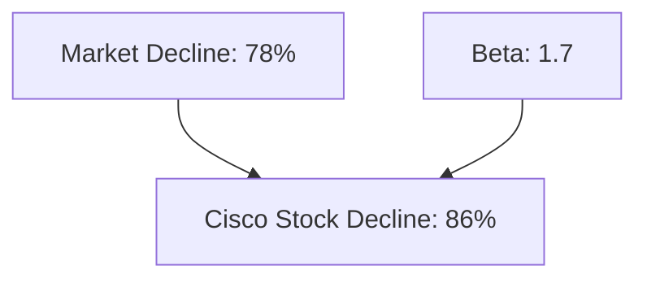

This example demonstrates how high-beta stocks can amplify market movements, leading to more significant gains in bull markets but steeper losses in bear markets.

How to Manage Equity Risk:
1. Diversification: Don't put all your eggs in one basket. Spread investments across different sectors and geographies.
2. Beta management: Balance high-beta stocks with low-beta stocks or other assets.
3. Use of derivatives: Options and futures can be used to hedge equity risk.

Pro Tip: While it's tempting to chase high-flying, high-beta stocks, remember that they can fall just as quickly as they rise. A balanced approach often leads to more consistent long-term returns.

Interactive Element: Quick Quiz
1. If a stock has a beta of 1.5 and the market falls 10%, approximately how much would you expect the stock to fall?
   a) 5%
   b) 10%
   c) 15%
   d) 20%

2. True or False: A stock with a negative beta tends to move in the opposite direction of the overall market.

(Answers: 1. c) 15%, 2. True)

As we've seen, equity risk can be a wild ride. But remember, with great risk often comes the potential for great reward. The key is to understand and manage this risk effectively within your portfolio.

### 2.2 Interest Rate Risk

Imagine you're playing a game of financial seesaw. On one end sits the interest rate, and on the other, the value of various assets. As interest rates rise, the value of many assets falls, and vice versa. This delicate balance is at the heart of interest rate risk.

Why Interest Rate Risk Matters:
Interest rate risk is the potential for investment losses due to changes in interest rates. It affects nearly all asset classes, but particularly bonds and other fixed-income securities.

How Interest Rates Affect Different Asset Classes:
1. Bonds: As interest rates rise, bond prices fall (and vice versa).
2. Stocks: Higher rates can lead to lower stock prices, especially for dividend-paying stocks.
3. Real Estate: Rising rates can decrease property values and increase mortgage costs.
4. Currencies: Interest rate differentials between countries can drive exchange rate movements.

Key Concepts: Duration and Convexity

1. Duration: A measure of a bond's price sensitivity to interest rate changes.
   - Higher duration = greater sensitivity to rate changes
   - Rule of thumb: For every 1% change in interest rates, a bond's price will change by approximately its duration in the opposite direction.

2. Convexity: Measures the rate of change of duration.
   - Positive convexity (most bonds): Price increases more when rates fall than it decreases when rates rise by the same amount.
   - Negative convexity (e.g., mortgage-backed securities): Price is more sensitive to rate increases than decreases.

Example: Bond Portfolio Performance in Rising Rate Environments

Let's examine how different types of bonds might perform when interest rates rise:

> Scenario: Interest rates increase by 1%

1. Short-term Treasury bond (2-year duration):
   Price change ≈ -2%

2. Long-term Corporate bond (10-year duration):
   Price change ≈ -10%

3. High-yield bond (5-year duration, but higher starting yield):
   Price change ≈ -5%, but partially offset by higher coupon payments

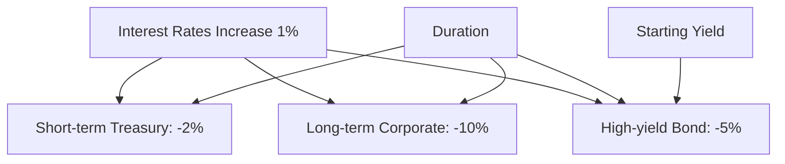

This example illustrates how bonds with longer durations are more sensitive to interest rate changes, but also how higher yields can provide a cushion against price declines.

How to Manage Interest Rate Risk:
1. Ladder your bond portfolio: Spread investments across different maturities.
2. Use floating-rate securities: These adjust their yields as rates change.
3. Employ interest rate derivatives: Futures or swaps can hedge interest rate exposure.
4. Diversify across asset classes: Include assets that may benefit from rising rates.

Pro Tip: Don't assume all bonds will perform poorly when rates rise. Some, like floating-rate bonds or Treasury Inflation-Protected Securities (TIPS), can actually benefit from rising rates.

Interactive Element: Pause and Reflect
Think about your own portfolio. How exposed are you to interest rate risk? If rates were to rise by 1% tomorrow, which of your investments would be most affected?

Now, let's tackle a common misconception:

Misconception: "Rising interest rates are always bad for investors."
Reality: While rising rates can negatively impact bond prices and some stocks, they can benefit savers, floating-rate securities, and certain sectors of the economy. The key is to position your portfolio to be resilient to rate changes.

### 2.3 Currency Risk

Picture yourself as a global traveler, hopping from country to country. In each new destination, you need to exchange your money, sometimes getting more local currency for your dollars, other times less. This is the essence of currency risk in investing – the potential for gains or losses due to changes in exchange rates.

Why Currency Risk Matters:
In our increasingly globalized world, many investors hold assets denominated in foreign currencies. Currency fluctuations can significantly impact the returns of these investments when converted back to the investor's home currency.

Impact of Exchange Rate Fluctuations:
1. Direct impact on foreign investments
2. Indirect impact on domestic companies with international operations
3. Affects the competitiveness of exporters and importers

Example: International Investment Returns During Currency Crises

Let's examine a real-world scenario to illustrate currency risk:

> The 1997 Asian Financial Crisis

Imagine you're a U.S. investor who bought $10,000 worth of Thai stocks on January 1, 1997. By the end of the year, your Thai stocks had actually gained 10% in local currency terms. Great news, right? Not so fast.

1. Initial investment: $10,000
2. Value in Thai Baht on Jan 1, 1997: 253,000 THB (exchange rate: 25.3 THB/USD)
3. Value in Thai Baht on Dec 31, 1997: 278,300 THB (10% gain)
4. But... new exchange rate on Dec 31, 1997: 47.25 THB/USD
5. Value in USD: $5,890

Despite the 10% gain in local currency, you've lost over 40% in USD terms due to the Thai Baht's depreciation!

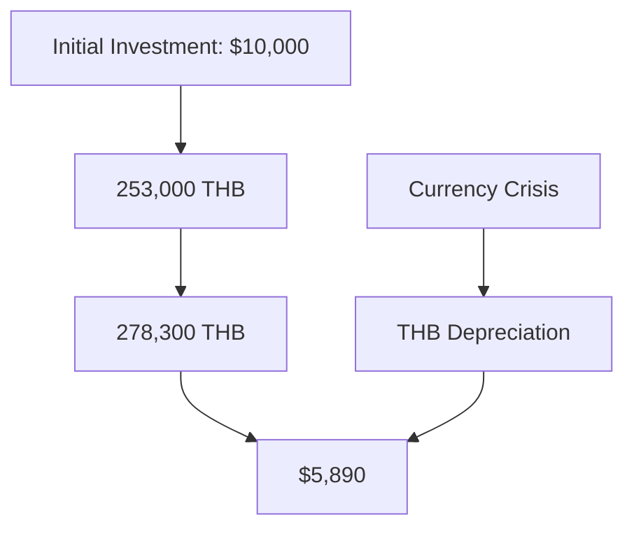

This example demonstrates how currency movements can overwhelm local market returns, turning gains into losses for foreign investors.

Hedging Strategies:
1. Currency Forwards: Contracts to exchange currency at a future date at a predetermined rate.
2. Currency Futures: Standardized, exchange-traded contracts similar to forwards.
3. Currency Options: Provide the right, but not the obligation, to exchange currency at a set rate.
4. Currency ETFs: Exchange-traded funds that track currency movements.

Pro Tip: Remember, hedging isn't free. The costs of hedging should be weighed against the potential benefits and your risk tolerance.

How to Manage Currency Risk:
1. Diversification across currencies: Don't put all your eggs in one foreign currency basket.
2. Use of hedged foreign investments: Some international funds offer currency-hedged versions.
3. Active currency management: Adjust currency exposure based on economic outlook.
4. Natural hedging: For businesses, match revenues and costs in the same currency where possible.

Interactive Element: Quick Quiz
1. If the Euro depreciates 10% against the USD, what happens to the USD value of your unhedged Euro-denominated investments?
   a) Increases by 10%
   b) Decreases by 10%
   c) Stays the same
   d) Not enough information

2. True or False: Currency hedging always improves investment returns.

(Answers: 1. b) Decreases by 10%, 2. False - hedging reduces risk but also potentially limits gains and incurs costs)

Misconception: "I only invest domestically, so I don't need to worry about currency risk."
Reality: Even if you only invest in domestic companies, many of these likely have international operations or compete with foreign firms. Currency movements can still indirectly affect your investments.

As we've seen, market risk factors – equity risk, interest rate risk, and currency risk – form the foundation of investment risk. Understanding these factors is crucial for navigating the complex world of investing. Remember, the goal isn't to eliminate these risks entirely (that's impossible!), but to manage them effectively to align with your investment objectives.

In our next chapter, we'll dive into Credit Risk Factors, exploring how the creditworthiness of borrowers can impact your investments. Get ready to become a savvy credit risk analyst!


## 3. Credit Risk Factors

### 3.1 Default Risk

Imagine lending money to a friend. You're confident they'll pay you back, but there's always that nagging worry: what if they don't? This is the essence of default risk in investing – the possibility that a borrower will fail to make required debt payments.

Why Default Risk Matters:
Default risk is a crucial consideration for fixed-income investors. It affects the yield (and thus the price) of bonds and other debt instruments. Understanding and managing default risk is key to preserving capital and generating consistent returns in fixed-income investing.

Understanding Credit Ratings:
Credit ratings are assessments of a borrower's creditworthiness, typically assigned by rating agencies like Standard & Poor's, Moody's, and Fitch.

- Investment Grade: BBB- and above (S&P), Baa3 and above (Moody's)
- High Yield (or "Junk"): Below BBB- (S&P), Below Baa3 (Moody's)

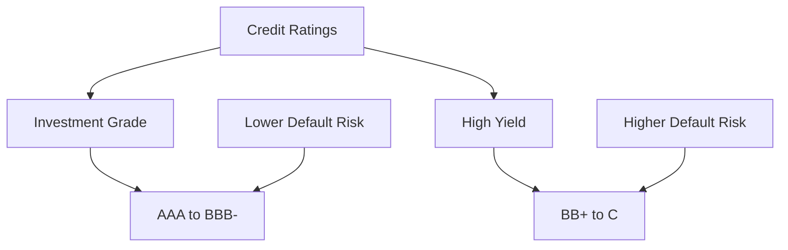

Yield Spreads and Their Significance:
The yield spread is the difference between the yield of a bond and the yield of a risk-free benchmark (usually a government bond) of the same maturity.

- Wider spread = Higher perceived risk
- Narrower spread = Lower perceived risk

Example: Corporate Bond Defaults and Portfolio Impact

Let's examine a scenario to illustrate default risk:

> The 2008 Financial Crisis and Lehman Brothers

Imagine you're an investor who bought $100,000 worth of Lehman Brothers bonds in early 2008, attracted by their A-rated status and slightly higher yield compared to Treasury bonds.

1. Initial investment: $100,000 in Lehman Brothers bonds
2. Credit rating: A (considered investment grade)
3. Yield spread: 2% over Treasuries (indicating some, but not extreme, risk)

Then, on September 15, 2008, Lehman Brothers filed for bankruptcy.

4. Value of bonds post-bankruptcy: Approximately $0.10 on the dollar
5. Final value of your investment: $10,000

You've lost 90% of your investment due to this default event!

This example demonstrates how even investment-grade bonds can default, leading to severe losses for investors.

How to Manage Default Risk:
1. Diversification: Don't concentrate too much in any single issuer or sector.
2. Credit analysis: Conduct thorough research on the financial health of bond issuers.
3. Use of credit default swaps (CDS): These derivatives can provide insurance against default.
4. Ladder your portfolio: Spread investments across different maturities and credit qualities.

Pro Tip: Higher yields often come with higher default risk. Always question why a bond is offering an unusually high yield compared to its peers.

Interactive Element: Pause and Reflect
Think about your own bond holdings or those in funds you own. Do you know their credit ratings? How would a major default affect your overall portfolio?

Misconception: "Government bonds are risk-free."
Reality: While generally considered the safest investments, even government bonds carry some risk. Countries can and have defaulted on their debt obligations.

### 3.2 Credit Spread Risk

Picture a tightrope walker balancing between two platforms. The distance between the platforms represents the credit spread – the difference in yield between a corporate bond and a risk-free government bond of the same maturity. Credit spread risk is the danger of this gap widening, causing the value of corporate bonds to fall relative to government bonds.

Why Credit Spread Risk Matters:
Even if a company doesn't default, changes in perceived creditworthiness can cause significant price movements in bonds. Understanding and managing credit spread risk is crucial for maximizing returns and minimizing volatility in fixed-income portfolios.

Factors Affecting Credit Spreads:
1. Company-specific factors (e.g., earnings, debt levels)
2. Industry trends
3. Overall economic conditions
4. Market sentiment and risk appetite

Credit Derivatives and Their Use:
Credit derivatives are financial instruments whose value is derived from the creditworthiness of an underlying entity.

1. Credit Default Swaps (CDS): Act like insurance against default
2. Total Return Swaps: Exchange the total return of a bond for a different cash flow
3. Credit Linked Notes: Combine a bond with a CDS

Example: High-Yield Bond Performance During Economic Downturns

Let's examine how credit spread risk can impact high-yield (also known as "junk") bonds during economic stress:

> The COVID-19 Pandemic Market Shock (February-March 2020)

Imagine you invested $100,000 in a high-yield bond ETF at the start of 2020, attracted by its 5% yield advantage over Treasury bonds.

1. Initial investment: $100,000 in high-yield bond ETF
2. Initial credit spread: 5% over Treasuries

As the pandemic hit and economic uncertainty spiked:

3. Credit spread widening: From 5% to 10% over Treasuries
4. Value of your investment after spread widening: Approximately $90,000

You've lost about 10% of your investment due to credit spread widening, even though no defaults occurred!

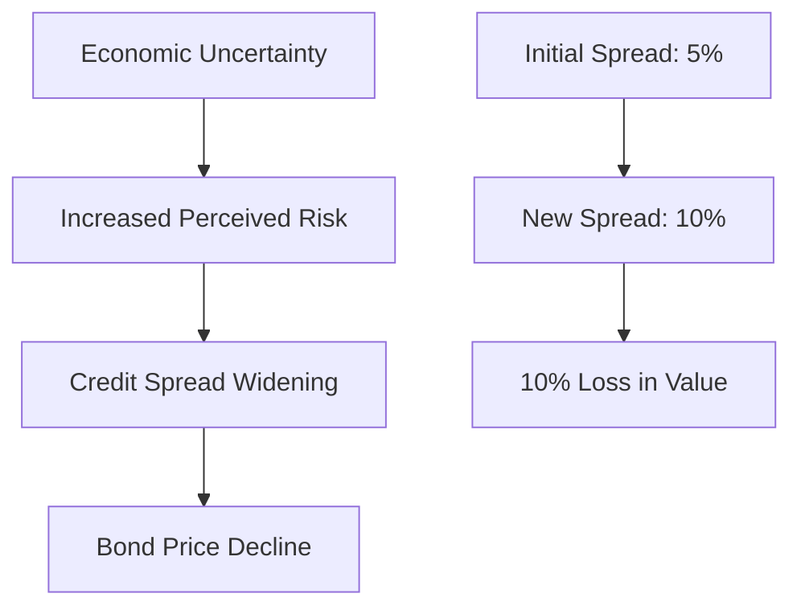

This example illustrates how credit spread risk can lead to significant losses, even in the absence of defaults.

How to Manage Credit Spread Risk:
1. Diversification across credit qualities: Mix investment-grade and high-yield bonds
2. Use of credit derivatives: CDS can hedge against spread widening
3. Active management: Adjust credit exposure based on economic outlook
4. Floating rate notes: These may be less sensitive to spread changes

Pro Tip: Pay attention to credit spreads as a forward-looking indicator. Widening spreads often signal economic trouble ahead, while narrowing spreads suggest improving conditions.

Interactive Element: Quick Quiz
1. If credit spreads widen by 1%, what typically happens to the price of corporate bonds?
   a) Increases
   b) Decreases
   c) Stays the same
   d) Not enough information

2. True or False: Credit spread risk only affects high-yield bonds.

(Answers: 1. b) Decreases, 2. False - it affects all corporate bonds, though high-yield bonds are often more sensitive)

Misconception: "As long as a company doesn't default, I don't need to worry about credit risk."
Reality: Credit spread risk can significantly impact bond prices and total returns, even without any defaults occurring.

Understanding Credit Risk Factors: The Big Picture

As we've explored in this chapter, credit risk is a multifaceted concept that goes beyond the simple question of whether a borrower will default. It encompasses the ongoing changes in perceived creditworthiness and how these perceptions impact bond prices and yields.

Key Takeaways:
1. Default risk is the most obvious form of credit risk, but it's not the only one.
2. Credit ratings provide a useful starting point for assessing creditworthiness, but they're not infallible.
3. Credit spreads reflect the market's real-time assessment of credit risk.
4. Even without defaults, changes in credit spreads can significantly impact bond prices.
5. Diversification and active management are key strategies for managing credit risk.

Remember, in the world of fixed-income investing, higher yields almost always come with higher credit risk. The art of successful bond investing lies in finding the right balance between risk and reward that aligns with your investment goals and risk tolerance.

In our next chapter, we'll dive into Liquidity Risk Factors, exploring how the ease (or difficulty) of buying and selling assets can impact your investment strategy. Get ready to understand why sometimes, cash really is king!

## 4. Liquidity Risk Factors

### 4.1 Asset Liquidity Risk

Imagine you're at a bustling farmer's market. Some stalls have long lines of customers eagerly buying produce, while others sit quiet with barely a visitor. This scene is analogous to asset liquidity in financial markets – some assets trade frequently and easily, while others may sit for long periods without changing hands.

Why Asset Liquidity Risk Matters:
Liquidity risk is the potential for loss when you can't easily sell an asset at its fair market value. Understanding and managing liquidity risk is crucial for maintaining portfolio flexibility and avoiding forced sales at unfavorable prices.

Bid-Ask Spreads and Trading Volume:
1. Bid-Ask Spread: The difference between the highest price a buyer is willing to pay (bid) and the lowest price a seller is willing to accept (ask).
   - Narrower spread = More liquid asset
   - Wider spread = Less liquid asset

2. Trading Volume: The number of shares or contracts traded in a given period.
   - Higher volume = More liquid asset
   - Lower volume = Less liquid asset

Illiquid Asset Valuation Challenges:
Valuing illiquid assets can be tricky because:
1. Lack of recent transaction data
2. Potential for stale prices
3. Subjective valuation methods

Example: Real Estate Investments During Market Freezes

Let's examine a scenario to illustrate liquidity risk:

> The 2008 Global Financial Crisis and Real Estate

Imagine you're an investor who bought a commercial property for $1 million in 2007, planning to sell it in 2008 for a quick profit.

1. Purchase price (2007): $1 million
2. Estimated value (early 2008): $1.2 million

Then, the financial crisis hits:

3. Credit markets freeze
4. Potential buyers disappear
5. You need to sell due to personal financial pressures

Despite your property still being valued at $1.2 million on paper, you're forced to sell for $800,000 – a 20% loss on your initial investment – because there are so few buyers in the market.

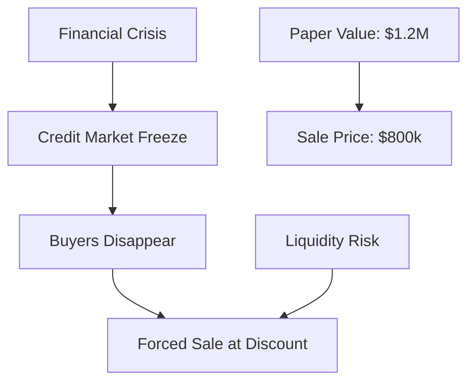

This example demonstrates how lack of liquidity can force investors to accept prices well below an asset's perceived value.

How to Manage Asset Liquidity Risk:
1. Diversification across asset classes with different liquidity profiles
2. Maintaining a cash buffer for unexpected needs
3. Using liquid alternatives or ETFs for exposure to less liquid asset classes
4. Implementing liquidity management tools (e.g., gating provisions in fund structures)

Pro Tip: In times of market stress, correlations between assets often increase, and liquidity can dry up across multiple asset classes simultaneously. Don't assume historical liquidity patterns will hold in extreme market conditions.

Interactive Element: Pause and Reflect
Think about your own portfolio. Which of your investments could you sell quickly if needed? Which might take longer to liquidate? How might this affect your financial plans in an emergency?

Misconception: "Liquidity risk only matters if I need to sell my investments soon."
Reality: Liquidity risk can affect your portfolio's value even if you don't plan to sell. Less liquid assets may be marked down in value during market stress, potentially triggering margin calls or affecting your overall financial position.

### 4.2 Funding Liquidity Risk

Picture yourself as a tightrope walker, but instead of a safety net below, there's a pool of water. The water level represents your available funding. Funding liquidity risk is the danger of this water level dropping too low, leaving you without a safety cushion if you slip.

Why Funding Liquidity Risk Matters:
Funding liquidity risk is the potential inability to meet short-term financial obligations or fund new opportunities. It can force investors to sell assets at unfavorable prices or miss out on profitable investments. Understanding and managing this risk is crucial for maintaining financial flexibility and avoiding forced actions.

Margin Calls and Forced Selling:
1. Margin Call: A demand from a broker to deposit additional funds or securities when the value of securities bought on margin falls below a certain level.
2. Forced Selling: The need to sell assets, often at unfavorable prices, to meet margin calls or other financial obligations.

Cash Flow Management in Portfolios:
Effective cash flow management involves:
1. Forecasting future cash needs
2. Maintaining a buffer of liquid assets
3. Matching asset and liability durations
4. Diversifying funding sources

Example: Hedge Fund Collapses Due to Liquidity Crunches

Let's examine a real-world scenario to illustrate funding liquidity risk:

> The Collapse of Long-Term Capital Management (LTCM) in 1998

Imagine you're an investor in LTCM, a highly leveraged hedge fund known for its sophisticated arbitrage strategies.

1. Initial investment: $10 million in LTCM
2. LTCM's leverage: 25-to-1 (meaning for every $1 of equity, they borrowed $25)
3. Strategy: Exploit small price discrepancies in bond markets

Then, the 1998 Russian financial crisis hits:

4. Bond markets become volatile
5. LTCM's positions start losing value
6. Lenders issue margin calls
7. LTCM can't meet the calls and can't sell assets fast enough

Result:
8. LTCM collapses, losing 90% of its value
9. Your $10 million investment is now worth just $1 million

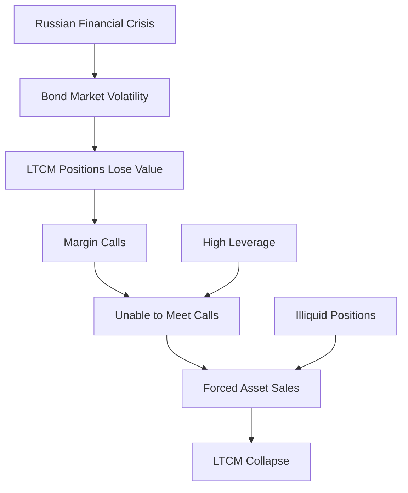

This example demonstrates how funding liquidity risk, exacerbated by high leverage and illiquid positions, can lead to catastrophic losses.

How to Manage Funding Liquidity Risk:
1. Maintain adequate cash reserves
2. Diversify funding sources
3. Implement stress testing and scenario analysis
4. Use derivatives to hedge against sudden market moves
5. Establish contingency funding plans

Pro Tip: Always consider the worst-case scenario when it comes to funding liquidity. Ask yourself: "If my funding sources dried up tomorrow, could my strategy survive?"

Interactive Element: Quick Quiz
1. Which of the following increases funding liquidity risk?
   a) Higher cash reserves
   b) Greater leverage
   c) More diverse funding sources
   d) Longer-term debt

2. True or False: Funding liquidity risk only affects hedge funds and other highly leveraged investors.

(Answers: 1. b) Greater leverage, 2. False - it can affect any investor or institution that relies on external funding or has short-term obligations)

Misconception: "As long as my investments are performing well, I don't need to worry about funding liquidity."
Reality: Market conditions can change rapidly. Even well-performing investments can face liquidity crunches if funding markets seize up or if there's a sudden need for cash.

Understanding Liquidity Risk Factors: The Big Picture

As we've explored in this chapter, liquidity risk is a multifaceted concept that goes beyond just the ease of buying or selling assets. It encompasses both the liquidity of the assets themselves and the availability of funding to maintain those assets.

Key Takeaways:
1. Asset liquidity risk can force investors to sell at unfavorable prices, especially during market stress.
2. Funding liquidity risk can lead to forced selling and missed opportunities.
3. High leverage amplifies liquidity risk.
4. Liquidity can evaporate quickly in times of market stress, often when it's needed most.
5. Effective liquidity management requires both proactive planning and reactive strategies.

Remember, liquidity is like oxygen – you don't notice it until it's gone. But when it disappears, nothing else matters. Successful investors always keep one eye on their liquidity position, ensuring they have the flexibility to weather storms and seize opportunities.

In our next chapter, we'll dive into Operational Risk Factors, exploring how the nuts and bolts of investment operations can sometimes lead to unexpected losses. Get ready to understand why sometimes, the biggest risks come from within!


## 5. Operational Risk Factors

### 5.1 Model Risk

Imagine you're an architect designing a skyscraper. You use complex computer models to ensure the building will stand tall and strong. But what if there's a flaw in your model? This is analogous to model risk in finance – the potential for loss due to errors in the mathematical models used to value assets and manage risks.

Why Model Risk Matters:
In today's complex financial markets, sophisticated mathematical models are used for everything from pricing derivatives to assessing portfolio risk. Understanding and managing model risk is crucial for avoiding unexpected losses and making informed investment decisions.

Limitations of Financial Models:
1. Simplifying assumptions that may not hold in reality
2. Reliance on historical data that may not predict future events
3. Difficulty in modeling extreme events or "black swans"
4. Potential for errors in implementation or interpretation

Backtesting and Stress Testing:
1. Backtesting: Testing a model's performance using historical data
2. Stress Testing: Evaluating a model's performance under extreme scenarios

Example: Long-Term Capital Management (LTCM) Collapse

Let's revisit LTCM, this time focusing on their model risk:

> LTCM's Model Failure in 1998

LTCM used highly sophisticated models to identify and exploit small price discrepancies in bond markets.

1. LTCM's model assumption: Price discrepancies would converge over time
2. Model's track record: Highly successful for several years

Then, the unexpected happened:

3. 1998 Russian financial crisis
4. Bond price discrepancies widened instead of converging
5. LTCM's models failed to account for this scenario

Result:
6. LTCM's positions lost billions
7. The fund collapsed, requiring a $3.6 billion bailout

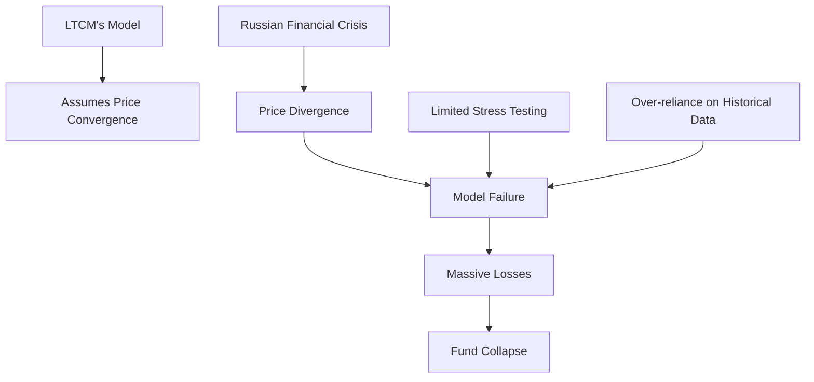

This example illustrates how even highly sophisticated models can fail when faced with unprecedented market conditions.

How to Manage Model Risk:
1. Regular model validation and review
2. Comprehensive stress testing and scenario analysis
3. Use of multiple models for cross-validation
4. Maintaining human oversight and judgment
5. Implementing robust model governance frameworks

Pro Tip: Remember, models are tools, not crystal balls. Always maintain a healthy skepticism and be prepared for scenarios your models haven't anticipated.

Interactive Element: Pause and Reflect
Think about investment decisions you've made. Have you ever relied on a financial model or tool? How confident were you in its predictions? How might you approach model-based decisions differently now?

Misconception: "More complex models are always better."
Reality: While sophisticated models can provide valuable insights, they can also introduce additional sources of error and may be harder to understand and validate. Sometimes, simpler models can be more robust and easier to interpret.

### 5.2 Counterparty Risk

Imagine you're playing a game of catch with a friend. The ball represents your investment, and your friend represents your counterparty. Counterparty risk is the chance that your friend might drop the ball or, worse, not throw it back at all.

Why Counterparty Risk Matters:
In financial markets, many transactions involve two parties agreeing to exchange payments or assets in the future. Counterparty risk is the danger that one party might fail to fulfill its obligations. Understanding and managing this risk is crucial for protecting your investments and maintaining the stability of financial systems.

Assessing Counterparty Creditworthiness:
1. Credit ratings from agencies like Moody's, S&P, and Fitch
2. Financial statement analysis
3. Market-based indicators (e.g., stock price, CDS spreads)
4. Internal risk assessment models

Netting Agreements and Collateral Management:
1. Netting Agreements: Allow offsetting of mutual obligations to reduce exposure
2. Collateral Management: Requiring assets to be pledged as security against potential default

Example: Lehman Brothers Bankruptcy Impact

Let's examine a real-world scenario to illustrate counterparty risk:

> The 2008 Lehman Brothers Bankruptcy

Imagine you're a hedge fund manager who has entered into several derivative contracts with Lehman Brothers.

1. Your position: $100 million notional value in interest rate swaps with Lehman
2. Your assumption: Lehman, as a major bank, is a safe counterparty

Then, on September 15, 2008:

3. Lehman Brothers files for bankruptcy
4. Your derivative contracts are now at risk

Result:
5. Immediate market value loss on your positions
6. Lengthy legal process to recover any value
7. Potential knock-on effects on your fund's performance and liquidity

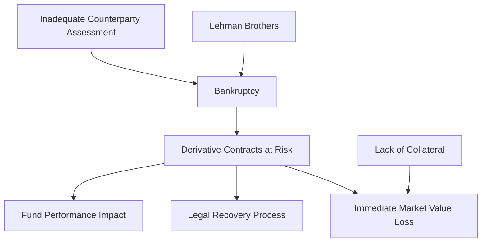

This example demonstrates how the failure of a major counterparty can lead to significant losses and operational challenges.

How to Manage Counterparty Risk:
1. Diversify counterparty exposures
2. Implement robust credit assessment processes
3. Use central clearing for standardized derivatives
4. Employ collateral management and margining practices
5. Establish and monitor counterparty exposure limits

Pro Tip: Don't assume that size or reputation alone make a counterparty safe. Always do your own due diligence and have contingency plans in place.

Interactive Element: Quick Quiz
1. Which of the following is NOT a way to mitigate counterparty risk?
   a) Using netting agreements
   b) Requiring collateral
   c) Increasing leverage
   d) Diversifying counterparties

2. True or False: Counterparty risk only affects derivative transactions.

(Answers: 1. c) Increasing leverage, 2. False - it can affect various types of transactions, including securities lending, repo agreements, and even simple trades)

Misconception: "If I'm dealing with a large, well-known financial institution, I don't need to worry about counterparty risk."
Reality: As the Lehman Brothers example shows, even large, established institutions can fail. Always assess and monitor counterparty risk, regardless of the counterparty's size or reputation.

### 5.3 Operational Process Risk

Imagine you're a chef in a busy restaurant kitchen. Your success depends not just on your culinary skills, but on the smooth operation of the entire kitchen – from inventory management to order processing. In the world of investing, operational process risk is like the risk of a kitchen mishap spoiling your perfect dish.

Why Operational Process Risk Matters:
Operational process risk refers to the potential for loss due to inadequate or failed internal processes, people, and systems. While less glamorous than market or credit risk, operational risk can lead to significant losses and reputational damage if not properly managed.

Key Areas of Operational Process Risk:
1. Trade execution and settlement
2. Reconciliation and accounting
3. IT systems and cybersecurity
4. Regulatory compliance
5. Human error

Example: Knight Capital's $440 Million Trading Loss

Let's examine a real-world scenario that illustrates the potential impact of operational process risk:

> Knight Capital's Algorithm Malfunction in 2012

Knight Capital was a major market maker in U.S. equities. On August 1, 2012:

1. Knight deployed new trading software
2. A technician forgot to copy the new code to one of eight computer servers
3. When the markets opened, the faulty server began sending erroneous orders
4. In just 45 minutes, Knight's algorithm bought and sold millions of shares in 154 stocks

Result:
5. $440 million in losses
6. Knight's stock price plummeted
7. The firm was forced to seek emergency funding and was eventually acquired

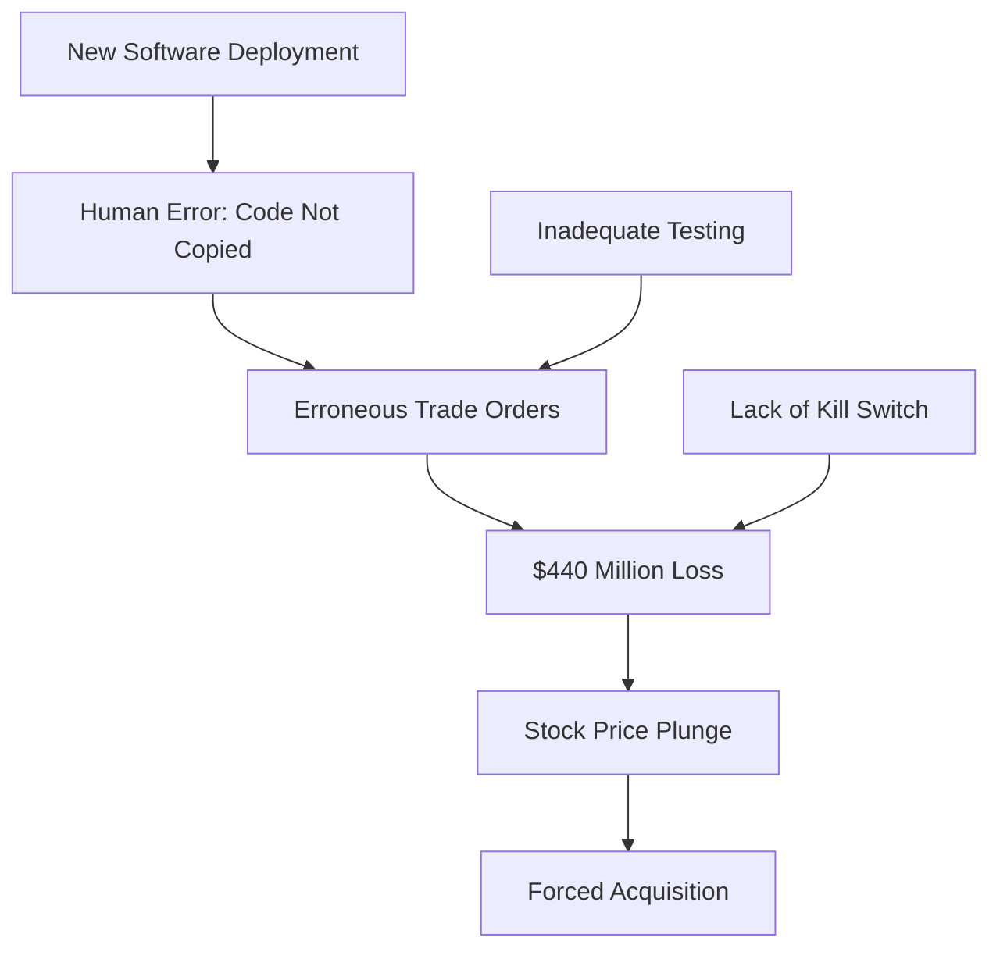

This example demonstrates how a simple operational error, combined with inadequate safeguards, can lead to catastrophic losses in a short time.

How to Manage Operational Process Risk:
1. Implement robust internal controls and checks
2. Conduct regular audits and risk assessments
3. Invest in reliable IT systems and cybersecurity measures
4. Provide ongoing training for staff
5. Develop and test business continuity plans
6. Use automation to reduce human error, but with proper oversight

Pro Tip: Always have a "kill switch" or circuit breaker in place for automated systems. The ability to quickly halt operations when something goes wrong can be the difference between a minor hiccup and a major disaster.

Interactive Element: Quick Quiz
1. Which of the following is NOT typically considered an operational risk?
   a) A trading algorithm malfunction
   b) A cybersecurity breach
   c) A change in interest rates
   d) An accounting error

2. True or False: Operational risks are generally easier to quantify than market risks.

(Answers: 1. c) A change in interest rates (this is a market risk), 2. False - operational risks are often harder to quantify due to their diverse nature and the difficulty in predicting human errors or system failures)

Misconception: "Operational risk is just a cost of doing business and can't be significantly reduced."
Reality: While some level of operational risk is inevitable, implementing robust processes, controls, and technologies can significantly mitigate this risk. Continuous improvement in operational efficiency can also lead to competitive advantages.

Understanding Operational Risk Factors: The Big Picture

As we've explored in this chapter, operational risk is a multifaceted concept that encompasses various aspects of an investment firm's day-to-day operations. It's often less visible than market or credit risk, but can be just as damaging if not properly managed.

Key Takeaways:
1. Model risk reminds us that even sophisticated quantitative strategies are only as good as their underlying assumptions and implementation.
2. Counterparty risk highlights the interconnected nature of financial markets and the importance of thorough due diligence.
3. Operational process risk underscores the need for robust systems, controls, and human oversight in all aspects of investment operations.
4. Managing operational risk requires a combination of technology, processes, and people, with a culture of risk awareness throughout the organization.
5. While operational risks can be challenging to quantify, they should not be overlooked in comprehensive risk management frameworks.

Remember, in the world of investing, it's not just about making the right investment decisions – it's also about ensuring that those decisions are executed correctly and efficiently. A strong operational foundation is essential for long-term success in investment management.

In our next chapter, we'll explore Macroeconomic Risk Factors, diving into how broader economic trends and policies can impact investments across asset classes. Get ready to see how the big picture affects your portfolio!


## 6. Macroeconomic Risk Factors

### 6.1 Economic Growth Risk

Imagine you're sailing a boat on a vast ocean. The ocean's currents represent economic growth, capable of either propelling your boat forward or pushing it backward. Economic growth risk is the uncertainty surrounding these currents and their impact on your investment journey.

Why Economic Growth Risk Matters:
Economic growth significantly influences corporate profits, consumer spending, and overall market sentiment. Understanding and managing economic growth risk is crucial for making informed investment decisions and positioning portfolios for various economic scenarios.

GDP Growth and Its Impact on Investments:
1. Equities: Generally benefit from strong economic growth
2. Bonds: May underperform during high growth periods due to inflation concerns
3. Commodities: Often see increased demand during periods of strong growth
4. Real Estate: Can benefit from economic expansion, but is sensitive to interest rates

Leading Economic Indicators:
These are economic data points that tend to move before the overall economy, providing insights into future economic trends:
1. Purchasing Managers' Index (PMI)
2. Consumer Confidence Index
3. Building Permits
4. Initial Jobless Claims
5. Stock Market Performance

Example: Portfolio Performance During Recessions

Let's examine how different assets might perform during an economic downturn:

> The 2008-2009 Global Financial Crisis

Imagine you're an investor with a diversified portfolio at the start of 2008:

1. 60% in S&P 500 index fund
2. 30% in U.S. Treasury bonds
3. 10% in Gold

As the recession unfolds:

4. S&P 500 drops by 37% in 2008
5. U.S. Treasury bonds gain 20% as investors flee to safety
6. Gold prices rise by 5% amid economic uncertainty

Result (approximate):
- S&P 500 portion: $60,000 becomes $37,800
- Treasury bond portion: $30,000 becomes $36,000
- Gold portion: $10,000 becomes $10,500

Overall portfolio value: $84,300 (15.7% loss)

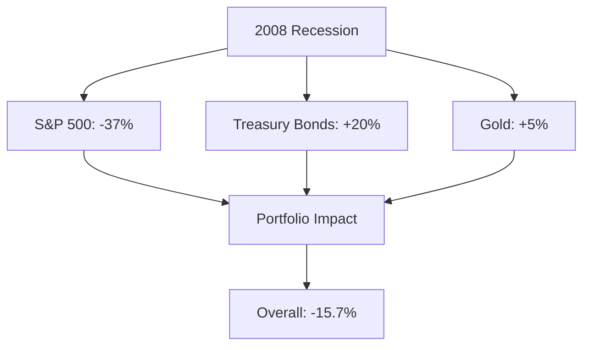

This example illustrates how different assets react to economic downturns and the importance of diversification in managing economic growth risk.

How to Manage Economic Growth Risk:
1. Diversify across asset classes and geographies
2. Use defensive stocks or sectors for equity exposure during downturns
3. Employ tactical asset allocation based on economic outlook
4. Consider alternative investments with low correlation to economic growth
5. Use derivatives to hedge against economic downturns

Pro Tip: Pay attention to the yield curve. An inverted yield curve (where short-term rates are higher than long-term rates) has historically been a reliable predictor of recessions.

Interactive Element: Pause and Reflect
Think about your current investment portfolio. How would it perform in a recession? In an economic boom? Are there changes you might consider to better balance your exposure to economic growth risk?

Misconception: "Economic growth is always good for all investments."
Reality: While economic growth generally supports asset prices, different assets react differently to growth. High growth can lead to inflation concerns, potentially hurting bond prices, while some defensive stocks might underperform during economic booms.

### 6.2 Inflation Risk

Picture yourself on a treadmill. You're running at a steady pace, but the treadmill keeps speeding up. This is analogous to inflation risk – the risk that the purchasing power of your money will decrease over time as the general price level in the economy rises.

Why Inflation Risk Matters:
Inflation can erode the real value of investment returns, potentially turning positive nominal returns into negative real returns. Understanding and managing inflation risk is crucial for preserving wealth and achieving long-term financial goals.

Effects of Inflation on Different Asset Classes:
1. Cash: Loses purchasing power over time
2. Bonds: Fixed coupon payments become less valuable in real terms
3. Stocks: Can potentially hedge against inflation if companies can pass on higher costs
4. Real Estate: Often seen as an inflation hedge due to rising property values and rents
5. Commodities: Prices often rise with inflation, providing a potential hedge

Real vs. Nominal Returns:
- Nominal Return: The return on an investment before adjusting for inflation
- Real Return: The return on an investment after adjusting for inflation
- Real Return = Nominal Return - Inflation Rate

Example: 1970s Stagflation and Investment Strategies

Let's examine how different assets performed during a period of high inflation:

> The Stagflation of the 1970s

Imagine you're an investor in 1970 with $10,000 to invest for the decade. You're considering three options:

1. 10-year Treasury bonds
2. S&P 500 index
3. Gold

Here's how they performed over the decade (approximate nominal returns):
- 10-year Treasury bonds: 7% annual return
- S&P 500: 5.8% annual return
- Gold: 35% annual return

But here's the catch: inflation averaged about 7.4% annually during this period.

Result (after adjusting for inflation):
- Treasury bonds: -0.4% annual real return
- S&P 500: -1.6% annual real return
- Gold: +27.6% annual real return

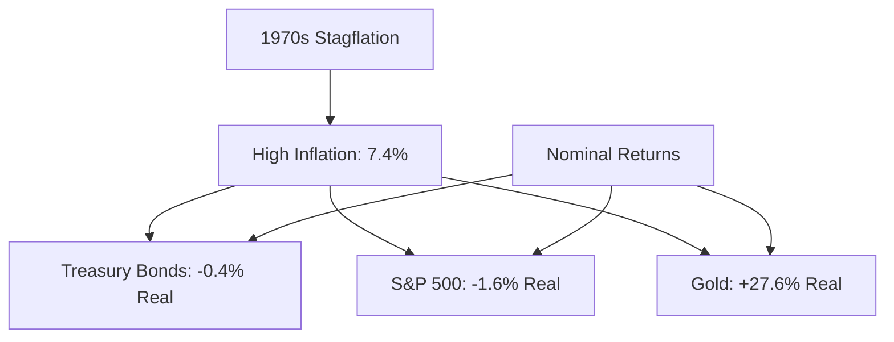

This example demonstrates how high inflation can erode returns on traditional investments while boosting the value of inflation hedges like gold.

How to Manage Inflation Risk:
1. Invest in inflation-protected securities (e.g., TIPS)
2. Consider real assets like real estate and commodities
3. Look for stocks of companies with pricing power
4. Use floating-rate bonds or loans
5. Employ inflation derivatives or swaps

Pro Tip: Don't rely solely on official inflation figures. Consider your personal inflation rate based on your specific spending patterns and investment goals.

Interactive Element: Quick Quiz
1. If your investment returns 5% in a year with 3% inflation, what is your real return?
   a) 2%
   b) 3%
   c) 5%
   d) 8%

2. True or False: Bonds are generally considered a good hedge against inflation.

(Answers: 1. a) 2%, 2. False - traditional bonds often perform poorly during inflationary periods due to their fixed coupon payments)

Misconception: "Inflation is always bad for stocks."
Reality: While high inflation can be challenging for many companies, some businesses can thrive in inflationary environments, especially those with strong pricing power or those dealing in real assets.

### 6.3 Policy Risk

Imagine you're playing a board game, and suddenly, the rule-maker decides to change a fundamental rule mid-game. This is analogous to policy risk in investing – the risk that changes in government policies or regulations will impact investment returns.

Why Policy Risk Matters:
Government policies and central bank actions can significantly influence economic conditions and financial markets. Understanding and managing policy risk is crucial for anticipating market shifts and positioning portfolios accordingly.

Key Areas of Policy Risk:
1. Monetary Policy: Central bank decisions on interest rates and money supply
2. Fiscal Policy: Government spending and taxation decisions
3. Regulatory Policy: Changes in laws and regulations affecting businesses
4. Trade Policy: Tariffs, trade agreements, and international economic relations

Example: The Impact of Quantitative Easing

Let's examine how a major policy shift affected various asset classes:

> The Federal Reserve's Quantitative Easing (QE) Program

Imagine you're an investor in 2008, just as the Fed announces its first round of QE:

1. Initial conditions: Low interest rates, weak economic growth
2. Fed action: Large-scale asset purchases to inject liquidity into the market

As QE unfolds over the next several years:

3. Bond yields fall further, boosting bond prices
4. Stock markets rally as investors seek higher returns
5. U.S. dollar weakens against other major currencies

Result (approximate returns from 2009 to 2014):
- U.S. Treasury bonds: +15% total return
- S&P 500: +105% total return
- U.S. Dollar Index: -3% total return

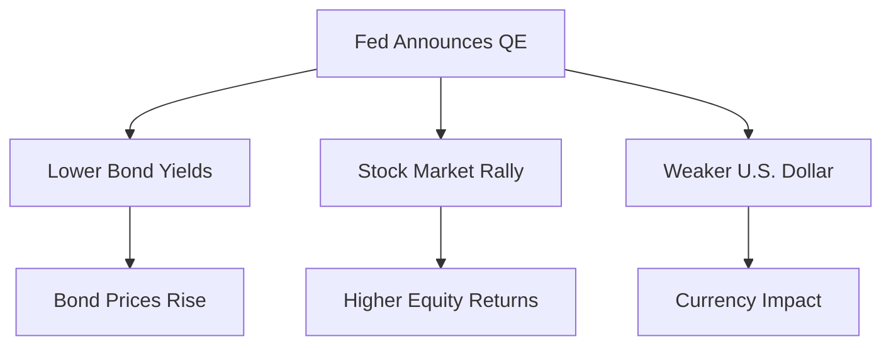

This example illustrates how a significant policy shift can have wide-ranging effects across asset classes.

How to Manage Policy Risk:
1. Stay informed about potential policy changes and their implications
2. Diversify across asset classes and geographies to reduce exposure to any single policy regime
3. Use scenario analysis to assess potential impacts of different policy outcomes
4. Consider hedging strategies for specific policy risks (e.g., currency hedging for trade policy risk)
5. Maintain flexibility in your portfolio to adapt to policy shifts

Pro Tip: Pay attention to not just the policies themselves, but also to market expectations. Often, the market's reaction to policy changes depends on how those changes compare to what was already anticipated.

Interactive Element: Pause and Reflect
Think about a recent major policy change (e.g., tax reform, trade agreements, interest rate decisions). How did it affect different parts of your portfolio? How might you position your investments for potential future policy shifts?

Misconception: "Policy risk only affects investments in government bonds or highly regulated industries."
Reality: Policy decisions can have far-reaching effects across all asset classes and sectors. Even companies that seem far removed from government influence can be significantly impacted by changes in monetary, fiscal, or regulatory policy.

Understanding Macroeconomic Risk Factors: The Big Picture

As we've explored in this chapter, macroeconomic risk factors play a crucial role in shaping the overall investment landscape. They represent the broader economic forces that can lift all boats or sink entire markets.

Key Takeaways:
1. Economic growth risk underscores the importance of understanding where we are in the economic cycle and how different assets might perform.
2. Inflation risk highlights the need to consider not just nominal returns, but real returns that preserve purchasing power.
3. Policy risk reminds us that the rules of the game can change, sometimes dramatically and unexpectedly.
4. Managing macroeconomic risks often requires a combination of diversification, hedging, and active portfolio management.
5. While macroeconomic factors are largely outside of an individual investor's control, understanding and anticipating their effects can provide a significant edge in portfolio construction and management.

Remember, in the world of investing, it's not just about picking good stocks or bonds – it's about understanding the economic environment in which those investments operate. A solid grasp of macroeconomic risk factors is essential for navigating the complex and ever-changing investment landscape.

In our next chapter, we'll explore Behavioral Risk Factors, diving into how human psychology and cognitive biases can impact investment decisions and market dynamics. Get ready to understand why sometimes, we are our own worst enemy when it comes to investing!


## 7. Behavioral Risk Factors

### 7.1 Investor Sentiment

Imagine you're at a crowded stadium watching a sports game. The crowd's mood can swing rapidly from euphoria to despair based on the game's progress. This collective mood is analogous to investor sentiment in financial markets – the overall attitude of investors toward a particular security or financial market.

Why Investor Sentiment Matters:
Investor sentiment can drive market prices away from their fundamental values, creating both risks and opportunities. Understanding and managing the impact of sentiment is crucial for making rational investment decisions and avoiding the pitfalls of market extremes.

Key Aspects of Investor Sentiment:
1. Market Bubbles: Periods of excessive optimism leading to unsustainable price increases
2. Market Crashes: Periods of extreme pessimism leading to sharp price declines
3. Fear and Greed Cycle: The alternating emotions that often drive market behavior
4. Contrarian Investing: Strategy of going against prevailing market sentiment

Example: The Dot-Com Bubble and its Aftermath

Let's examine how investor sentiment drove one of the most famous market bubbles in recent history:

> The Rise and Fall of the Dot-Com Bubble (1995-2002)

Imagine you're an investor in the late 1990s, caught up in the excitement of the internet revolution:

1. Initial phase (1995-1999): 
   - Investors become increasingly optimistic about internet-based companies
   - Many tech stocks see their valuations skyrocket, often with little to no earnings

2. Peak of the bubble (early 2000):
   - NASDAQ Composite Index reaches an all-time high of 5,048.62 on March 10, 2000
   - Price-to-earnings ratios of many tech companies exceed 100

3. Bursting of the bubble (2000-2002):
   - Reality sets in as many dot-com companies fail to generate profits
   - Investor sentiment shifts from extreme optimism to pessimism
   - NASDAQ falls nearly 80% from its peak by October 2002

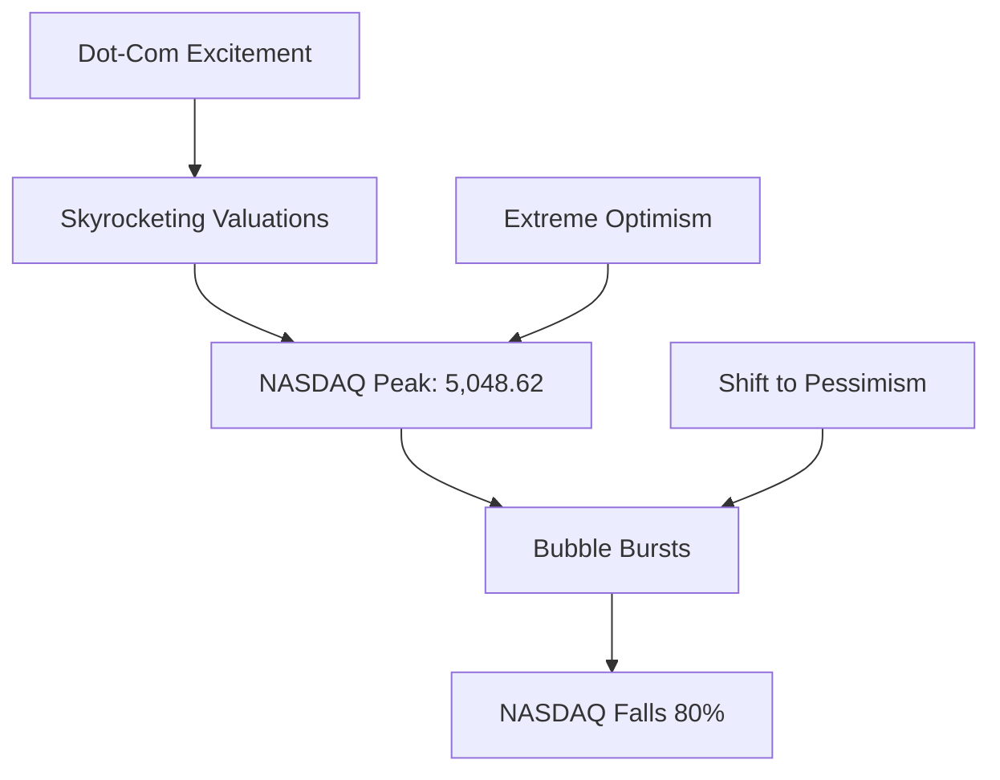

This example illustrates how investor sentiment can drive markets to extremes, both on the upside and downside.

How to Manage Investor Sentiment Risk:
1. Maintain a disciplined, value-based investment approach
2. Use sentiment indicators (e.g., VIX, put/call ratio) to gauge market mood
3. Consider contrarian strategies when sentiment reaches extremes
4. Diversify across assets with different sentiment drivers
5. Implement systematic rebalancing to "sell high and buy low"

Pro Tip: Warren Buffett famously advised to "be fearful when others are greedy and greedy when others are fearful." This contrarian approach can help you capitalize on sentiment-driven market inefficiencies.

Interactive Element: Quick Quiz
1. Which of the following is NOT typically considered a sign of extreme positive sentiment?
   a) High trading volumes
   b) Increased IPO activity
   c) Rising put/call ratios
   d) Media hype around certain investments

2. True or False: Contrarian investing always leads to superior returns.

(Answers: 1. c) Rising put/call ratios (this often indicates increasing pessimism), 2. False - while contrarian strategies can be effective, they don't guarantee success and timing is crucial)

Misconception: "As a rational investor, I'm not influenced by market sentiment."
Reality: Even the most rational investors can be subtly influenced by prevailing market moods. Being aware of sentiment and its potential impact on your decision-making is crucial for all investors.

### 7.2 Herd Behavior

Picture a herd of wildebeest crossing a river. Once a few start crossing, the rest quickly follow, even if there are crocodiles in the water. This is analogous to herd behavior in financial markets – the tendency of investors to follow and copy what other investors are doing.

Why Herd Behavior Matters:
Herd behavior can lead to significant market inefficiencies, including bubbles and crashes. Understanding and managing the impact of herd behavior is crucial for maintaining a disciplined investment approach and potentially profiting from market overreactions.

Key Aspects of Herd Behavior:
1. Information Cascades: When individuals observe others' actions and imitate them, assuming others have more information
2. Momentum Trading: Buying assets that have been rising in price and selling those that have been falling
3. FOMO (Fear of Missing Out): The anxiety of being left behind in a rising market
4. Panic Selling: Mass exodus from an asset or market during downturns

Example: The GameStop Short Squeeze

Let's examine a recent case of extreme herd behavior in action:

> The GameStop Short Squeeze of 2021

Imagine you're observing the stock market in January 2021:

1. Initial situation:
   - GameStop (GME) is a struggling video game retailer
   - The stock is heavily shorted by hedge funds

2. Reddit-driven rally:
   - Users on r/WallStreetBets forum start buying GME shares and call options
   - As the stock price rises, more investors join in, driving the price higher

3. Short squeeze:
   - Rising prices force short sellers to buy shares to cover their positions
   - This buying further propels the stock price upward

4. Peak and aftermath:
   - GME reaches a high of $483 on January 28, 2021 (up from $17.25 on January 4)
   - Trading restrictions are imposed, and the stock price eventually crashes

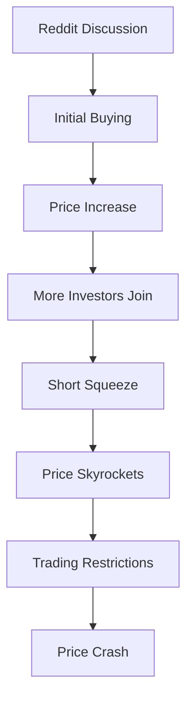

This example illustrates how herd behavior can lead to extreme price movements disconnected from fundamental value.

How to Manage Herd Behavior Risk:
1. Develop and stick to a well-defined investment strategy
2. Use fundamental analysis to assess true value, regardless of market trends
3. Be cautious of investments driven primarily by social media hype
4. Consider implementing contrarian strategies when herd behavior seems extreme
5. Use stop-loss orders or other risk management tools to protect against sudden reversals

Pro Tip: Remember the famous quote by Warren Buffett: "Be fearful when others are greedy and greedy when others are fearful." This mindset can help you resist the pull of the herd and potentially profit from market extremes.

Interactive Element: Pause and Reflect
Think about a time when you felt the urge to invest in something because "everyone else was doing it." What was the outcome? How might you approach a similar situation differently in the future?

Misconception: "Herd behavior only affects unsophisticated retail investors."
Reality: Even professional investors can fall prey to herd behavior, often due to career risk (the fear of underperforming peers) or institutional pressures.

### 7.3 Cognitive Biases

Imagine you're solving a complex puzzle, but some of the pieces you're using are from a different puzzle altogether. This is analogous to how cognitive biases can affect our investment decisions – they're mental shortcuts or tendencies that can lead to judgment errors.

Why Cognitive Biases Matter:
Cognitive biases can lead investors to make irrational decisions, potentially resulting in suboptimal investment outcomes. Understanding and managing these biases is crucial for maintaining a disciplined and rational approach to investing.

Key Cognitive Biases in Investing:
1. Confirmation Bias: The tendency to search for or interpret information in a way that confirms pre-existing beliefs
2. Anchoring: Relying too heavily on one piece of information when making decisions
3. Loss Aversion: The tendency to prefer avoiding losses over acquiring equivalent gains
4. Recency Bias: Giving more importance to recent events or observations
5. Overconfidence: Overestimating one's own abilities in investment decision-making

Example: The Impact of Recency Bias

Let's examine how recency bias can affect investment decisions:

> The Tech Stock Rebound After the 2008 Financial Crisis

Imagine you're an investor in 2010, two years after the 2008 financial crisis:

1. Recent market performance:
   - Stocks have performed poorly from 2007 to 2009
   - Many investors are wary of equities, especially tech stocks

2. Your decision:
   - Influenced by recent poor performance, you decide to significantly reduce your stock allocation
   - You shift a large portion of your portfolio to "safer" assets like bonds

3. Subsequent market performance (2010-2020):
   - Tech stocks stage a remarkable comeback
   - NASDAQ Composite Index rises over 400% in the decade following your decision

4. Impact on your portfolio:
   - Your reduced equity allocation causes you to miss out on significant gains
   - The opportunity cost of your decision becomes apparent over time

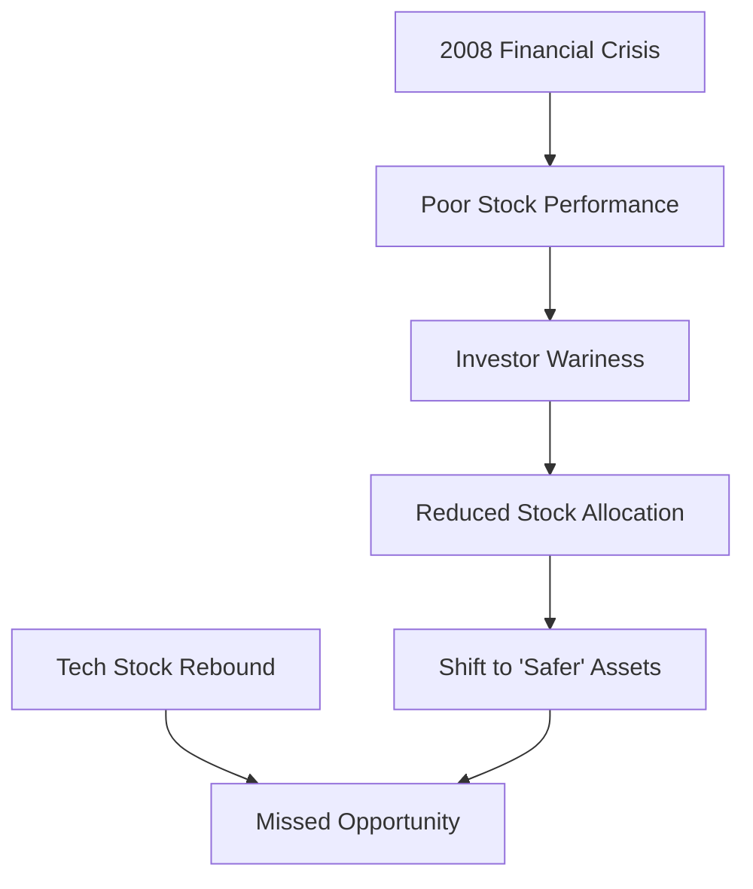

This example illustrates how recency bias can lead to decisions that may seem prudent in the short term but can result in missed opportunities over the long term.

How to Manage Cognitive Bias Risk:
1. Awareness: Recognize that everyone, including experienced investors, is susceptible to biases
2. Education: Learn about different cognitive biases and how they can affect decision-making
3. Systematic approach: Use quantitative models and predefined criteria to guide investment decisions
4. Seek diverse perspectives: Consult with others and consider viewpoints that challenge your own
5. Keep a decision journal: Record the rationale for your investment decisions to review later

Pro Tip: Regularly review your investment decisions, both good and bad. Try to identify which biases might have influenced each decision. This practice can help you become more aware of your own tendencies and improve your decision-making over time.

Interactive Element: Quick Quiz
1. Which of the following is an example of confirmation bias?
   a) Selling a stock because it has recently underperformed
   b) Only reading news articles that support your positive view of a company
   c) Assuming a stock that has gone up will continue to rise
   d) Preferring to hold onto losing investments rather than realize a loss

2. True or False: Cognitive biases can be completely eliminated with enough training and experience.

(Answers: 1. b) Only reading news articles that support your positive view of a company, 2. False - while awareness and training can help mitigate biases, they are inherent to human cognition and can never be completely eliminated)

Misconception: "I make decisions based on facts and logic, so I'm not affected by cognitive biases."
Reality: Cognitive biases are inherent to human thinking and affect everyone, even those who pride themselves on their rationality. The key is to be aware of these biases and implement strategies to mitigate their impact.

Understanding Behavioral Risk Factors: The Big Picture

As we've explored in this chapter, behavioral risk factors play a crucial role in shaping market dynamics and individual investment decisions. They represent the human element in finance, often leading to deviations from rational, efficient market theory.

Key Takeaways:
1. Investor sentiment can drive markets to extremes, creating both risks and opportunities for astute investors.
2. Herd behavior can lead to significant market inefficiencies, highlighting the importance of independent thinking in investing.
3. Cognitive biases are inherent to human decision-making and can lead to suboptimal investment choices if not properly managed.
4. Successful investing often involves not just analyzing markets and securities, but also understanding and managing our own psychological tendencies.
5. While we can't eliminate behavioral risks entirely, awareness and systematic approaches can help mitigate their impact on our investment decisions.

Remember, in the world of investing, sometimes our own minds can be our greatest assets or our worst enemies. A solid understanding of behavioral risk factors is essential for navigating the complex interplay between human psychology and financial markets.

In our next chapter, we'll explore how to integrate all these risk factors into a comprehensive risk management framework. Get ready to learn how to bring together market, credit, liquidity, operational, macroeconomic, and behavioral risks into a cohesive investment strategy!


## 8. Integrating Risk Factors

### 8.1 Risk Factor Models

Imagine you're a master chef creating a complex dish. Each ingredient (risk factor) contributes to the overall flavor (portfolio risk and return), and the way these ingredients interact is crucial to the final result. This is analogous to risk factor models in investment management – they help us understand how different risk factors combine to influence portfolio performance.

Why Risk Factor Models Matter:
Risk factor models provide a structured approach to understanding and managing portfolio risk. They allow investors to decompose complex portfolios into more manageable components, enabling more precise risk management and portfolio construction.

Key Concepts in Risk Factor Models:
1. Single-Factor Models: Focus on one primary risk factor (e.g., market beta in the Capital Asset Pricing Model)
2. Multi-Factor Models: Incorporate multiple risk factors to explain asset returns
3. Factor Exposure: The sensitivity of an asset or portfolio to a particular risk factor
4. Factor Premium: The additional return associated with exposure to a specific risk factor

Example: Applying the Fama-French Three-Factor Model

Let's examine how a popular multi-factor model can be used to analyze portfolio performance:

> Using the Fama-French Model to Evaluate a Stock Portfolio

Imagine you're a portfolio manager evaluating the performance of your U.S. equity portfolio:

1. The Fama-French Three-Factor Model includes:
   - Market factor (overall market return minus risk-free rate)
   - Size factor (small-cap minus large-cap returns)
   - Value factor (value stocks minus growth stocks returns)

2. Your portfolio analysis:
   - Market beta: 1.2 (higher exposure to market movements than the index)
   - Size exposure: 0.3 (slight tilt towards small-cap stocks)
   - Value exposure: -0.1 (slight tilt towards growth stocks)

3. Factor returns over the past year:
   - Market factor: 10%
   - Size factor: 2%
   - Value factor: -1%

4. Calculating factor contributions to portfolio return:
   - Market contribution: 1.2 * 10% = 12%
   - Size contribution: 0.3 * 2% = 0.6%
   - Value contribution: -0.1 * -1% = 0.1%
   - Total factor-explained return: 12.7%

5. If your actual portfolio return was 13.5%, the difference (0.8%) might be attributed to stock-specific factors or other unexplained variables.

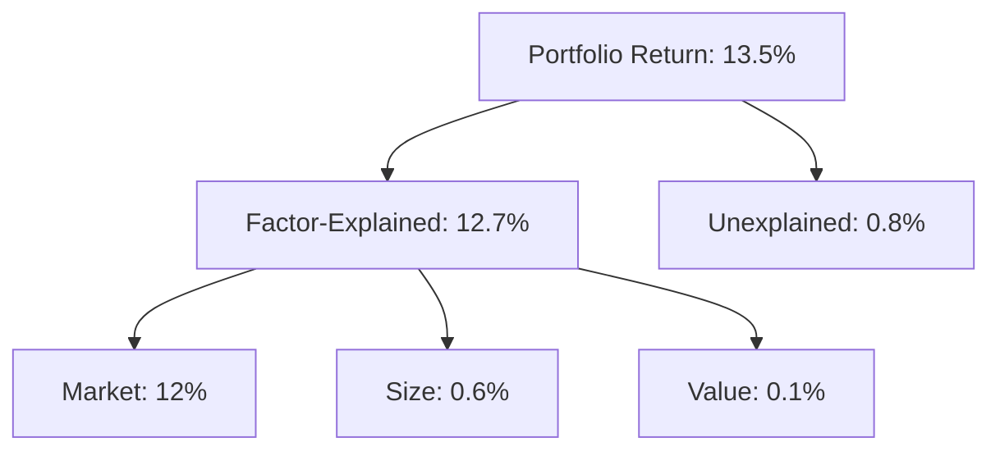

This example illustrates how factor models can help decompose portfolio performance and understand the sources of returns.

How to Use Risk Factor Models:
1. Portfolio Construction: Design portfolios with desired factor exposures
2. Performance Attribution: Understand the drivers of portfolio returns
3. Risk Management: Identify and manage factor concentrations
4. Scenario Analysis: Assess potential portfolio performance under different factor return scenarios

Pro Tip: While factor models are powerful tools, remember that they are simplifications of complex market dynamics. Always complement factor analysis with fundamental research and qualitative insights.

Interactive Element: Quick Quiz
1. In the Fama-French Three-Factor Model, which of the following is NOT one of the factors?
   a) Market
   b) Size
   c) Value
   d) Momentum

2. True or False: A negative factor exposure always leads to a negative contribution to returns.

(Answers: 1. d) Momentum (this is part of the Carhart Four-Factor Model, an extension of Fama-French), 2. False - if the factor return is negative, a negative exposure would contribute positively to returns)

Misconception: "Factor models can perfectly explain all portfolio returns."
Reality: While factor models are useful tools, they typically explain only a portion of returns. There will always be some unexplained variation due to stock-specific events, model limitations, or other factors not captured by the model.

### 8.2 Risk Budgeting

Picture yourself as the manager of a sports team with a salary cap. You need to allocate your limited budget across different positions to create the strongest team possible. This is analogous to risk budgeting in portfolio management – allocating a portfolio's risk across various factors or strategies to optimize the risk-return tradeoff.

Why Risk Budgeting Matters:
Risk budgeting provides a systematic approach to portfolio construction that focuses on risk allocation rather than capital allocation. It helps ensure that the portfolio's risk profile aligns with the investor's objectives and risk tolerance.

Key Concepts in Risk Budgeting:
1. Total Portfolio Risk: The aggregate risk of the entire portfolio
2. Risk Contribution: How much each position or factor contributes to total portfolio risk
3. Risk Parity: A strategy that equalizes risk contribution across different assets or factors
4. Marginal Risk Contribution: The change in portfolio risk from a small increase in a position

Example: Constructing a Risk Parity Portfolio

Let's examine how risk budgeting can be used to construct a balanced portfolio:

> Creating an All-Weather Portfolio Using Risk Parity

Imagine you're designing a portfolio that can perform well in various economic environments:

1. Identify key economic scenarios:
   - Economic Growth
   - Economic Contraction
   - Rising Inflation
   - Falling Inflation (Deflation)

2. Select assets for each scenario:
   - Growth: Stocks
   - Contraction: Long-Term Bonds
   - Rising Inflation: Commodities
   - Deflation: Short-Term Bonds

3. Traditional 60/40 portfolio risk allocation:
   - Stocks typically contribute about 90% of the portfolio's risk
   - Bonds contribute only about 10% of the risk

4. Risk Parity approach:
   - Adjust allocations so each asset contributes equally to portfolio risk
   - This might result in a portfolio like:
     30% Stocks, 40% Long-Term Bonds, 15% Commodities, 15% Short-Term Bonds

5. Use leverage or derivatives to adjust overall portfolio risk to desired level

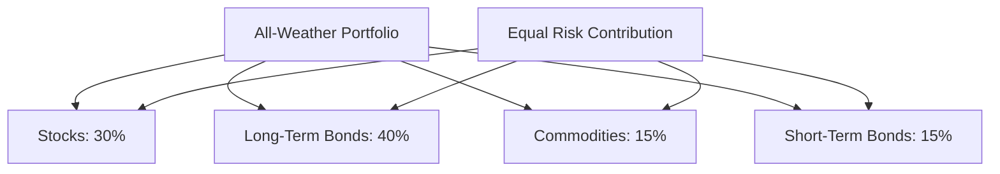

This example illustrates how risk budgeting can create a more balanced portfolio from a risk perspective.

How to Implement Risk Budgeting:
1. Define risk measure (e.g., volatility, Value at Risk)
2. Calculate risk contributions of current portfolio positions
3. Set target risk allocations based on views and objectives
4. Adjust portfolio weights to align with target risk budget
5. Regularly monitor and rebalance to maintain desired risk allocations

Pro Tip: Risk budgeting doesn't mean all assets or strategies should have equal risk allocations. The key is to intentionally decide how much risk to allocate to each component based on your investment thesis and objectives.

Interactive Element: Pause and Reflect
Think about your own portfolio. Do you know which positions or factors are the largest contributors to your portfolio's risk? How might a risk budgeting approach change your asset allocation?

Misconception: "Risk parity always leads to better performance than traditional asset allocation."
Reality: While risk parity can provide better diversification from a risk perspective, it doesn't guarantee superior performance. Market conditions, costs of implementation (e.g., leverage), and accurate risk estimation all play crucial roles in the strategy's success.

### 8.3 Holistic Risk Management

Imagine you're the conductor of an orchestra. Each instrument (risk factor) contributes to the overall symphony (portfolio performance), and your job is to ensure they all work together harmoniously. This is the essence of holistic risk management – considering all risk factors together and understanding their interactions.

Why Holistic Risk Management Matters:
Individual risk factors don't exist in isolation. They interact with each other, sometimes amplifying effects, other times offsetting them. A holistic approach to risk management helps investors understand these complex interactions and manage their portfolios more effectively.

Key Aspects of Holistic Risk Management:
1. Risk Aggregation: Combining risks from different sources to understand total portfolio risk
2. Risk Interactions: Understanding how different risk factors influence each other
3. Scenario Analysis: Assessing portfolio performance under various combinations of risk factor movements
4. Stress Testing: Evaluating portfolio resilience under extreme but plausible scenarios

Example: Navigating the COVID-19 Market Shock

Let's examine how a holistic risk management approach could have helped during the COVID-19 pandemic:

> Managing a Multi-Asset Portfolio During the 2020 Market Turmoil

Imagine you're overseeing a diversified portfolio in early 2020:

1. Initial portfolio composition:
   - 50% Global Equities
   - 30% Government Bonds
   - 10% Corporate Bonds
   - 5% Real Estate
   - 5% Commodities

2. Risk factor considerations:
   - Market risk: Potential for sharp equity market declines
   - Credit risk: Possibility of corporate bond downgrades and defaults
   - Liquidity risk: Potential challenges in selling real estate or certain bonds
   - Macroeconomic risk: Likelihood of economic contraction and policy responses
   - Behavioral risk: Probability of panic selling and market overreactions

3. Holistic risk management actions:
   - Increase allocation to government bonds for safety and liquidity
   - Reduce exposure to sectors most vulnerable to lockdowns (e.g., travel, retail)
   - Implement option strategies to protect against extreme market downside
   - Ensure sufficient cash reserves to meet potential margin calls or redemptions
   - Prepare communication strategy to help clients avoid panic selling

4. Outcome:
   - Portfolio experiences lower drawdown than broad market indices
   - Maintained liquidity allows for opportunistic purchases at market lows
   - Client communication helps prevent emotional decision-making

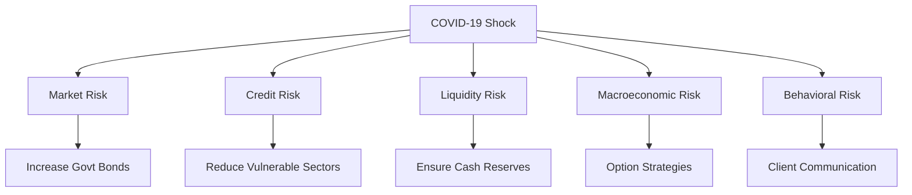

This example illustrates how considering multiple risk factors holistically can lead to more robust portfolio management during crisis periods.

How to Implement Holistic Risk Management:
1. Develop a comprehensive risk taxonomy covering all relevant risk factors
2. Use advanced risk models that capture risk interactions and correlations
3. Conduct regular scenario analysis and stress testing
4. Implement a risk governance structure that encourages cross-functional collaboration
5. Maintain a dynamic risk management approach that adapts to changing market conditions

Pro Tip: Remember that the goal of holistic risk management isn't to eliminate all risk, but to ensure that the risks taken are intentional and aligned with investment objectives.

Interactive Element: Quick Quiz
1. Which of the following is NOT typically a component of holistic risk management?
   a) Scenario analysis
   b) Risk aggregation
   c) Avoiding all risky investments
   d) Stress testing

2. True or False: In holistic risk management, different risk factors are always considered to be independent of each other.

(Answers: 1. c) Avoiding all risky investments (holistic risk management is about managing, not eliminating, risk), 2. False - a key aspect of holistic risk management is understanding the interactions between different risk factors)

Misconception: "Holistic risk management requires extremely complex models and is only feasible for large institutions."
Reality: While sophisticated models can be helpful, the core principles of holistic risk management – considering multiple risk factors and their interactions – can be applied by investors at any scale. Even simple scenario analysis can provide valuable insights.

Integrating Risk Factors: The Big Picture

As we've explored in this chapter, integrating various risk factors into a cohesive framework is crucial for effective portfolio management. It allows investors to move beyond siloed thinking and understand the complex interplay of different risks affecting their investments.

Key Takeaways:
1. Risk factor models provide a structured approach to decomposing and understanding portfolio risk and return.
2. Risk budgeting offers a systematic method for allocating risk across different factors or strategies.
3. Holistic risk management considers the interactions between different risk factors and their combined impact on the portfolio.
4. Effective risk integration requires both quantitative tools and qualitative judgment.
5. The goal is not to eliminate all risk, but to ensure that the risks taken are intentional, understood, and aligned with investment objectives.

Remember, in the complex world of investing, risk factors are like the ingredients in a recipe. Understanding each ingredient is important, but mastering how they interact and combine is the key to creating a truly exceptional dish – or in this case, a robust and resilient investment portfolio.

In our final chapter, we'll explore how to put all of this knowledge into practice, providing a step-by-step guide for implementing a comprehensive risk factor management approach in your investment process. Get ready to transform your theoretical understanding into practical action!


## 9. Practical Application

### 9.1 Building a Risk-Aware Portfolio

Imagine you're an architect designing a skyscraper. You need to consider not just the aesthetics, but also the structural integrity, wind resistance, and earthquake protection. Similarly, building a risk-aware portfolio requires considering multiple risk factors to create a robust investment structure.

Why Building a Risk-Aware Portfolio Matters:
A risk-aware portfolio is designed to weather various market conditions and align with an investor's risk tolerance and financial goals. It goes beyond simple diversification to consider how different risk factors interact and affect overall portfolio performance.

Step-by-Step Guide to Factor-Based Portfolio Construction:

1. Define Investment Objectives and Constraints
   - Determine return objectives
   - Assess risk tolerance
   - Identify any specific constraints (e.g., liquidity needs, tax considerations)

2. Identify Relevant Risk Factors
   - Market risk factors (e.g., equity, interest rate, currency)
   - Credit risk factors
   - Macroeconomic factors (e.g., growth, inflation)
   - Style factors (e.g., value, momentum, quality)

3. Determine Desired Factor Exposures
   - Align factor exposures with investment beliefs and market views
   - Consider how factors have performed in different economic regimes

4. Select Assets and Strategies
   - Choose investments that provide the desired factor exposures
   - Consider both long-only and long-short strategies to target specific factors

5. Construct the Portfolio
   - Use optimization techniques to balance factor exposures and other constraints
   - Consider transaction costs and practical implementation issues

6. Implement Risk Management Overlay
   - Add hedging strategies if needed
   - Incorporate tail risk protection mechanisms

Example: Creating a Diversified Multi-Factor Portfolio

Let's walk through an example of constructing a risk-aware, multi-factor portfolio:

> Building a Global Multi-Asset Portfolio

Imagine you're tasked with creating a portfolio for a client with the following profile:
- Moderate risk tolerance
- 10-year investment horizon
- Desire for global diversification

1. Define Objectives:
   - Target return: Inflation + 4%
   - Risk tolerance: Maximum drawdown of 15% in any given year

2. Identify Relevant Factors:
   - Equity risk premium
   - Term premium (bonds)
   - Credit premium
   - Value factor
   - Momentum factor
   - Low volatility factor

3. Determine Factor Exposures:
   - Overweight equity risk premium for long-term growth
   - Moderate exposure to term and credit premiums for income and diversification
   - Tilt towards value and momentum factors in equity allocation
   - Include low volatility factor for downside protection

4. Select Assets and Strategies:
   - Global developed market equities (40%)
   - Emerging market equities (10%)
   - Government bonds (20%)
   - Corporate bonds (10%)
   - Factor ETFs or smart beta funds (15%)
   - Alternative strategies (e.g., trend-following) (5%)

5. Construct Portfolio:
   - Use mean-variance optimization to fine-tune allocations
   - Ensure no single factor dominates risk contribution

6. Implement Risk Management:
   - Add put option strategy for tail risk protection
   - Implement systematic rebalancing to maintain target exposures

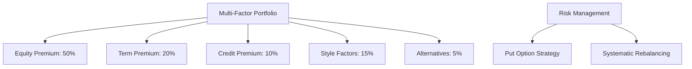

This example illustrates how various risk factors can be combined to create a diversified, risk-aware portfolio.

Tools and Resources for Risk Factor Analysis:
1. Factor analysis software (e.g., Barra, Axioma)
2. Risk management platforms (e.g., BlackRock's Aladdin, MSCI RiskMetrics)
3. Bloomberg's PORT function for portfolio analysis
4. Open-source libraries like Python's PyPortfolioOpt for portfolio optimization

Pro Tip: Start simple and add complexity gradually. Begin with a few core factors and expand your model as you become more comfortable with factor-based portfolio construction.

Interactive Element: Pause and Reflect
Consider your own investment portfolio. Which risk factors do you think are driving your returns? Are there any factors you might be overexposed or underexposed to based on your investment goals?

Misconception: "A factor-based portfolio eliminates the need for active management."
Reality: While factor-based investing can provide a systematic approach to portfolio construction, active management is still valuable for factor timing, security selection within factors, and overall risk management.

### 9.2 Monitoring and Rebalancing

Imagine you're a ship's captain on a long voyage. Even with the best initial course plotting, you need to constantly monitor your position and make adjustments to stay on track. Similarly, once you've built your risk-aware portfolio, ongoing monitoring and rebalancing are crucial to maintaining its effectiveness.

Why Monitoring and Rebalancing Matter:
Market movements can cause your portfolio to drift from its target allocations, potentially altering its risk profile. Regular monitoring and rebalancing help ensure that your portfolio maintains its intended factor exposures and risk characteristics.

Key Risk Metrics to Track:
1. Factor Exposures: How sensitive is your portfolio to various risk factors?
2. Tracking Error: How much does your portfolio deviate from its benchmark?
3. Value at Risk (VaR): What is the potential loss in a given time frame at a certain confidence level?
4. Drawdown: What is the decline from a historical peak?
5. Risk Contribution: How much risk is each position or factor contributing to the overall portfolio?

When and How to Adjust Factor Exposures:
1. Systematic Rebalancing: 
   - Set regular intervals (e.g., quarterly) to rebalance back to target allocations
   - Implement tolerance bands to trigger rebalancing when allocations drift beyond certain thresholds

2. Dynamic Factor Timing:
   - Adjust factor exposures based on changing market conditions or valuation metrics
   - Use momentum or trend-following signals to increase or decrease factor tilts

3. Risk-Responsive Rebalancing:
   - Increase defensive factor exposures when market volatility spikes
   - Reduce exposure to factors showing signs of crowding or bubble-like behavior

Example: Portfolio Rebalancing During Market Turmoil

Let's examine how a risk-aware investor might adjust their portfolio during a market crisis:

> Navigating the COVID-19 Market Crash in 2020

Imagine you're managing the multi-factor portfolio we constructed in the previous section, and it's now February 2020:

1. Initial Portfolio State (End of January 2020):
   - Equity allocation: 50% (slightly above target due to strong performance)
   - Bond allocation: 30% (slightly below target)
   - Factor ETFs and alternatives: 20%

2. Market Events (February-March 2020):
   - Global equities enter bear market
   - Volatility (VIX) spikes to record levels
   - Bond yields plummet as investors seek safety

3. Portfolio Monitoring Alerts:
   - Equity allocation drops to 40% due to market decline
   - Portfolio volatility exceeds target levels
   - Value factor underperforms significantly

4. Rebalancing Actions:
   - Increase equity allocation back to 50% target, buying at lower prices
   - Trim bond allocation, which has increased due to price appreciation
   - Increase allocation to low-volatility factor for defensive positioning
   - Implement put option strategy for additional downside protection

5. Outcome:
   - Portfolio recovers more quickly than broad market indices
   - Downside protection helps maintain client confidence
   - Rebalancing allows for participation in market rebound

```mermaid
graph TD
    A[Market Crash] --> B[Equity Allocation Drops]
    A --> C[Volatility Spikes]
    A --> D[Bond Prices Rise]
    B --> E[Buy Equities]
    C --> F[Increase Low-Vol Factor]
    D --> G[Trim Bonds]
    H[Rebalancing] --> E
    H --> F
    H --> G
    I[Put Option Strategy] --> J[Downside Protection]
```

This example illustrates how monitoring key risk metrics and taking responsive action can help navigate market turbulence.

Pro Tip: While it's important to be responsive to market changes, avoid over-trading. Set clear thresholds for when to make adjustments and stick to your long-term strategy unless there are fundamental changes to your investment thesis.

Interactive Element: Quick Quiz
1. Which of the following is NOT typically a reason to rebalance a portfolio?
   a) Factor exposures have drifted from targets
   b) Overall portfolio risk has exceeded tolerance levels
   c) A particular asset class has outperformed significantly
   d) The stock market has reached a new all-time high

2. True or False: Rebalancing always involves selling assets that have performed well and buying those that have underperformed.

(Answers: 1. d) The stock market has reached a new all-time high (this alone is not a reason to rebalance), 2. False - while this is often the case, rebalancing can also involve adjusting factor exposures or risk levels, which might not always align with recent performance)

Misconception: "More frequent rebalancing always leads to better results."
Reality: While regular rebalancing is important, overly frequent rebalancing can lead to excessive transaction costs and tax implications. The optimal rebalancing frequency depends on factors like market volatility, transaction costs, and the magnitude of allocation drifts.

Practical Application: The Big Picture

As we've explored in this chapter, putting risk factor management into practice involves a combination of thoughtful portfolio construction, ongoing monitoring, and disciplined rebalancing.

Key Takeaways:
1. Building a risk-aware portfolio requires considering multiple risk factors and how they interact.
2. Factor-based portfolio construction provides a systematic approach to aligning investments with risk and return objectives.
3. Regular monitoring of key risk metrics is essential for maintaining the desired risk profile.
4. Rebalancing is a powerful tool for managing risk and potentially enhancing returns, but it requires a balanced approach.
5. Flexibility and adaptability are crucial in responding to changing market conditions while staying true to long-term investment goals.

Remember, implementing a risk factor management approach is not a one-time event, but an ongoing process. It requires continuous learning, adaptation, and refinement as markets evolve and new insights emerge.

Conclusion:

Congratulations! You've now completed a comprehensive journey through the world of risk factors in investment portfolio management. From understanding individual risk factors to integrating them into a holistic framework and applying them in practice, you've gained the knowledge to approach investing with a more nuanced and risk-aware perspective.

As you move forward in your investment journey, remember that mastering risk factor management is a continuous process. Markets evolve, new factors emerge, and the relationships between factors can change over time. Stay curious, keep learning, and always be willing to challenge your assumptions.

Now, it's time to put this knowledge into action. Here's a simple, actionable task to complete within the next 24 hours:

1. Review your current investment portfolio (or a portfolio you're familiar with).
2. Identify the top three risk factors you believe are driving its performance.
3. Consider one specific action you could take to better align the portfolio's risk factor exposures with its objectives.

By taking this small step, you'll begin to apply the principles of risk factor management to real-world investing. Remember, the journey of a thousand miles begins with a single step. You've taken that step today – now keep moving forward on your path to becoming a more sophisticated, risk-aware investor.


## 10. Conclusion: The Road Ahead

### 10.1 Emerging Trends in Risk Factor Analysis

Imagine you're standing at the frontier of a vast, unexplored territory. The landscape of risk factor analysis is constantly evolving, with new horizons opening up as technology advances and our understanding deepens. Let's explore some of the emerging trends that are shaping the future of risk management in investment portfolios.

1. Machine Learning and Artificial Intelligence
   - Trend: Increasing use of ML and AI in identifying new factors and analyzing factor interactions.
   - Impact: More sophisticated factor models that can capture complex, non-linear relationships.
   - Example: Using natural language processing to analyze company reports and create sentiment-based factors.

2. Alternative Data
   - Trend: Incorporation of non-traditional data sources in factor analysis.
   - Impact: Discovery of new factors and more timely insights into existing factors.
   - Example: Using satellite imagery to assess retail traffic for consumer discretionary stocks.

3. Climate and ESG Factors
   - Trend: Growing importance of environmental, social, and governance factors in risk analysis.
   - Impact: New set of risk factors to consider, potentially affecting traditional factor relationships.
   - Example: Incorporating carbon footprint data as a risk factor in portfolio construction.

4. Quantum Computing
   - Trend: Exploration of quantum computing for complex risk calculations.
   - Impact: Potential for more accurate risk assessments and real-time factor analysis.
   - Example: Using quantum algorithms to optimize large-scale portfolio allocations across multiple factors.

5. Behavioral Factors
   - Trend: Increased focus on quantifying and modeling investor behavior.
   - Impact: Better understanding of market dynamics and potential market dislocations.
   - Example: Developing factors based on social media sentiment analysis.

```mermaid
graph TD
    A[Emerging Trends] --> B[Machine Learning/AI]
    A --> C[Alternative Data]
    A --> D[Climate/ESG Factors]
    A --> E[Quantum Computing]
    A --> F[Behavioral Factors]
    B --> G[Complex Factor Interactions]
    C --> H[New Factor Discovery]
    D --> I[Sustainability Risk Assessment]
    E --> J[Real-time Optimization]
    F --> K[Market Dynamics Modeling]
```

Pro Tip: Stay curious and open-minded about new developments in risk factor analysis. What seems cutting-edge today may become standard practice tomorrow. Regularly explore new research and be willing to challenge your existing assumptions.

### 10.2 Continuous Learning and Adaptation

Picture yourself as a surfer, constantly adjusting your position on the board as waves change. In the world of risk factor investing, continuous learning and adaptation are crucial to staying on top of evolving markets and methodologies.

Key Areas for Ongoing Development:
1. Academic Research: Stay abreast of the latest academic papers on factor investing and risk management.
2. Industry Practices: Learn from the experiences and innovations of leading investment firms.
3. Technological Skills: Develop proficiency in programming languages and data analysis tools used in factor modeling.
4. Regulatory Environment: Keep up with changing regulations that may impact factor-based strategies.
5. Cross-disciplinary Knowledge: Explore fields like psychology, data science, and economics to gain new perspectives on risk and investor behavior.

Strategies for Continuous Learning:
1. Join professional associations (e.g., CFA Institute, GARP) for access to resources and networking opportunities.
2. Attend conferences and webinars focused on factor investing and risk management.
3. Participate in online courses or pursue advanced degrees in financial engineering or data science.
4. Engage in peer discussion groups or forums to share insights and challenges.
5. Implement a personal system for tracking and reflecting on your investment decisions and their outcomes.

Interactive Element: Pause and Reflect
Think about your current approach to learning about investment risk. What's one area where you feel you need to deepen your knowledge? How might you go about acquiring that knowledge in the next month?

### 10.3 Call to Action: Implementing Risk Factor Management

You've come a long way in understanding risk factors and their role in investment portfolio management. Now it's time to put this knowledge into action. Here's a step-by-step guide to implementing a risk factor management approach in your investment process:

1. Assess Your Current Portfolio
   - Analyze your existing holdings through a factor lens.
   - Identify which factors are driving your returns and risks.

2. Define Your Factor Philosophy
   - Determine which factors align with your investment beliefs and goals.
   - Decide on your approach (e.g., static allocations vs. dynamic factor timing).

3. Build Your Factor Model
   - Start with a simple model incorporating key factors.
   - Gradually increase complexity as you gain confidence and insights.

4. Implement Factor-Based Strategies
   - Begin with a portion of your portfolio to test your approach.
   - Use factor ETFs, individual securities, or custom portfolios based on your resources and expertise.

5. Establish Monitoring and Rebalancing Protocols
   - Set up regular review periods and rebalancing thresholds.
   - Implement risk management overlays as needed.

6. Track and Analyze Performance
   - Regularly assess how your factor exposures are impacting returns.
   - Be prepared to adjust your approach based on results and changing market conditions.

7. Continuously Educate Yourself
   - Stay informed about new research and industry developments.
   - Regularly reassess and refine your factor management approach.

Pro Tip: Start small and iterate. It's better to begin with a simple, well-understood factor approach and gradually increase sophistication than to implement a complex system you're not fully comfortable with.

Misconception: "Once I set up a factor-based portfolio, it will take care of itself."
Reality: Factor-based investing requires ongoing monitoring, analysis, and adjustment. Markets evolve, factor premiums can vary over time, and new factors may emerge. Successful factor investing is an active, ongoing process.

### 10.4 Final Thoughts

As we conclude our journey through the world of risk factors in investment portfolio management, let's reflect on the key lessons we've learned:

1. Risk is multifaceted: Understanding the various types of risk factors – market, credit, liquidity, operational, macroeconomic, and behavioral – is crucial for comprehensive risk management.

2. Integration is key: Individual risk factors don't exist in isolation. A holistic approach that considers how factors interact is essential for effective portfolio management.

3. Quantitative meets qualitative: While factor models and quantitative analysis are powerful tools, they should be complemented by qualitative judgment and an understanding of broader market dynamics.

4. Adaptability is crucial: Markets evolve, and so should your approach to risk factor management. Stay curious, keep learning, and be willing to adapt your strategies.

5. Risk management is ongoing: Building a risk-aware portfolio is just the beginning. Continuous monitoring, rebalancing, and refinement are necessary for long-term success.

Remember, mastering risk factor management is not about eliminating all risk – that's neither possible nor desirable in investing. Instead, it's about understanding, measuring, and intentionally taking risks that align with your investment objectives and constraints.

As you move forward in your investment journey, embrace the complexity of risk factor management. View it not as a burden, but as an opportunity to gain deeper insights into the drivers of investment performance and to construct more robust, resilient portfolios.

Your 24-Hour Action Plan:
1. Review your investment portfolio through a factor lens. Identify the top three factors you believe are driving your returns.
2. Research one emerging trend in factor investing that intrigues you. Spend 30 minutes reading about it from a reputable source.
3. Set a specific, achievable goal for improving your risk factor management approach in the next month. Write it down and set a reminder to check your progress.

By taking these steps, you're not just learning about risk factors – you're actively applying this knowledge to become a more sophisticated, risk-aware investor.

The world of risk factor investing is vast and ever-changing, but with the foundation you've built through this course, you're well-equipped to navigate its challenges and opportunities. Remember, every great investor started somewhere. Your journey in mastering risk factor management begins now.

Embrace the challenge, stay curious, and happy investing!
