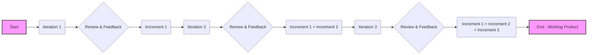
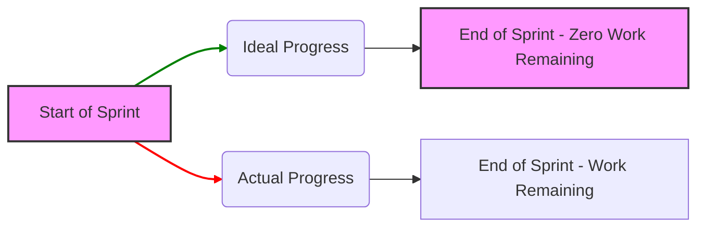
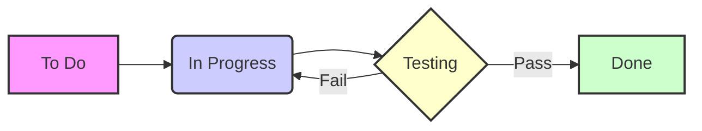
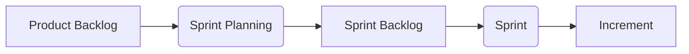
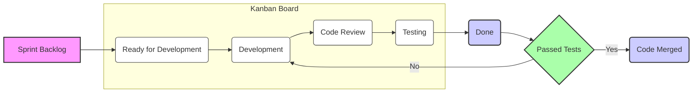
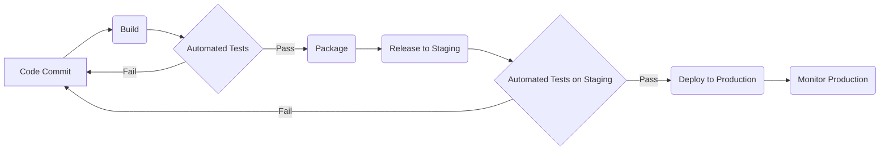

# The Ultimate Guide for the Impatient: Agile IT Projects - From Novice to Practitioner in Record Time!

Tired of IT projects that feel like navigating a bureaucratic swamp? Ever wondered why so many software implementations end up as expensive, frustrating failures? You're not alone. This guide is your express lane to mastering Agile methodologies and transforming your IT project outcomes. Forget months of theory; we're diving into practical application in under 24 hours.

## Introduction: Why Agile?

Imagine this: You're tasked with building a complex e-commerce platform using the traditional Waterfall method. Months are spent meticulously documenting requirements, designing the architecture, and coding away in isolation. Then, just before launch, the marketing team drops a bombshell: the target demographic has shifted, and key features are obsolete. Panic ensues. Reworking the entire system leads to missed deadlines, budget overruns, and ultimately, a subpar product that fails to resonate with the intended audience. This is the brutal reality many face with rigid, Waterfall-based approaches. The Standish Group's Chaos Report consistently highlights the alarmingly high failure rates of traditional IT projects, often attributing these failures to poor adaptation to change and late discovery of critical errors.

### The Problem with Traditional Methods: Waterfall Limitations

*   **Rigidity:** Waterfall's sequential phases make it difficult to adapt to evolving requirements.
*   **Late Discovery of Errors:** Issues are often identified late in the development cycle, leading to costly rework.
*   **Poor Adaptation to Change:** Responding to changing market conditions or customer feedback becomes a logistical nightmare.

### The Agile Promise: Embrace the Wave of Change

Agile offers a refreshing alternative. It's an **iterative**, **incremental**, **collaborative**, and **customer-focused** approach to project management and software development. Instead of attempting to define every detail upfront, Agile embraces change, delivering value in short cycles called sprints.

At its core, Agile is guided by the **Agile Manifesto**, which prioritizes:

*   **Individuals and interactions** over processes and tools
*   **Working software** over comprehensive documentation
*   **Customer collaboration** over contract negotiation
*   **Responding to change** over following a plan

This translates into tangible benefits:

*   **Increased Flexibility:** Adapt to changing requirements with ease.
*   **Faster Time-to-Market:** Deliver working software in shorter iterations.
*   **Higher Quality:** Continuous testing and feedback loops ensure a robust product.
*   **Improved Customer Satisfaction:** Deliver value that aligns with customer needs.

### Is Agile Right for You? A Quick Self-Assessment

While Agile offers significant advantages, it's not a one-size-fits-all solution. Consider these factors when assessing project suitability:

*   **Complexity:** Is the project highly complex with many unknowns?
*   **Uncertainty:** Are the requirements likely to change during development?
*   **Customer Involvement:** Is active customer feedback crucial for success?

**Agile vs. Waterfall: A Comparative Analysis**

| Feature            | Agile                                    | Waterfall                               |
| ------------------ | ---------------------------------------- | --------------------------------------- |
| Approach           | Iterative, Incremental                    | Sequential, Linear                      |
| Change Management  | Embraces Change                           | Resists Change                          |
| Customer Involvement | High                                       | Low                                      |
| Risk Management    | Continuous                                 | Primarily at the beginning              |
| Best For           | Complex, uncertain projects              | Well-defined, stable requirements       |

**Quiz: Is Agile a Good Fit for Your Project?**

1.  Are your project requirements likely to change? (Yes/No)
2.  Is continuous customer feedback important? (Yes/No)
3.  Is your project highly complex with many unknowns? (Yes/No)

If you answered "Yes" to two or more of these questions, Agile is likely a good fit!

### Key Agile Methodologies Overview: Choose Your Weapon

Agile isn't a single methodology but a collection of frameworks and practices. Here's a brief overview of some popular options:

*   **Scrum:** A structured framework with defined roles, events, and artifacts. Emphasizes short sprints and daily stand-up meetings.
    *   **Strengths:** Highly structured, good for managing complex projects.
    *   **Weaknesses:** Can be overly prescriptive for some teams.
*   **Kanban:** A visual system for managing workflow. Focuses on limiting work in progress (WIP) and continuous improvement.
    *   **Strengths:** Flexible, easy to implement, good for optimizing workflow.
    *   **Weaknesses:** Less structured than Scrum, requires discipline.
*   **Extreme Programming (XP):** A set of practices for developing high-quality software. Emphasizes pair programming, test-driven development, and continuous integration.
    *   **Strengths:** Excellent for technical teams, produces high-quality code.
    *   **Weaknesses:** Requires a high level of technical expertise.
*   **Lean:** Focuses on eliminating waste and maximizing value delivery.
    *   **Strengths:** Improves efficiency, reduces costs, focuses on customer value.
    *   **Weaknesses:** Requires a deep understanding of the value stream.

This tutorial will primarily focus on **Scrum and Kanban**, providing you with the foundational knowledge to apply these powerful methodologies.

### Setting the Stage: A Simple Project Scenario

To illustrate the concepts, let's introduce a fictional IT project: **developing a simple task management application called "TaskMaster."** Our initial requirements are:

*   Users should be able to create tasks with descriptions and due dates.
*   Users should be able to assign tasks to team members.
*   Users should be able to mark tasks as complete.

We'll use this scenario as a running example throughout the tutorial, demonstrating how Agile methodologies can be applied to bring TaskMaster to life.

### Getting Started: Mindset Shift

The most crucial step in adopting Agile isn't learning the methodologies but embracing the underlying mindset. This involves:

*   **Embracing Change:** Adaptability is paramount. Be prepared to adjust your plans based on feedback and evolving requirements. Don't be afraid to pivot!
*   **Collaboration is Key:** Foster open communication and teamwork. Break down silos and encourage cross-functional collaboration.
*   **Customer-Centricity:** Focus on delivering value to the customer. Continuously seek feedback and prioritize features that address their needs.
*   **Continuous Improvement: The Kaizen Philosophy:** Embrace the Japanese philosophy of Kaizen – continuous improvement. Regularly reflect on your processes and identify areas for optimization. This could be as simple as a weekly retrospective with your team.

Remember, Agile is a journey, not a destination. It's about continuous learning, adaptation, and improvement. Are you ready to embark on this exciting adventure?

**Your 24-Hour Task:**

Before diving into the specifics of Scrum and Kanban, spend some time reflecting on your current project management approach. Identify one area where you believe Agile principles could significantly improve your workflow. Write down three concrete steps you can take within the next 24 hours to begin implementing this change. Let's start building that Agile mindset!
# The Ultimate Guide for the Impatient: From Novice to Practitioner in Record Time

## Chapter 1: Understanding Agile Principles

Welcome, future Agile champion! Ever felt bogged down by rigid project plans that crumble at the first sign of change? You're not alone. This chapter cracks the code of Agile, a flexible approach that's revolutionizing how IT projects are delivered. Prepare to ditch the waterfall and dive into a world of iterative development, empowered teams, and rapid value delivery. Let's get started!

### The Agile Manifesto Deep Dive: Values and Principles

Imagine building a skyscraper without blueprints. Chaos, right? Traditional project management often feels the same – rigid plans leading to disastrous results. The Agile Manifesto, born from the frustration of software developers, offers a better way. It's not a rigid methodology, but a set of values and principles that guide a more adaptive and collaborative approach.

The Agile Manifesto is based on four values:

*   **Individuals and interactions** over processes and tools
*   **Working software** over comprehensive documentation
*   **Customer collaboration** over contract negotiation
*   **Responding to change** over following a plan

Let's break these down with real-world examples:

*   **Individuals and interactions:** Instead of relying solely on project management software, Agile teams prioritize direct communication. Imagine a designer struggling with a complex UI element. Instead of sending endless emails, they grab a whiteboard and collaborate with a developer in real-time. *That's* Agile in action.

*   **Working software:** Forget endless documentation. The focus is on delivering functional software frequently. Think of a mobile app. Instead of releasing a fully featured app after a year, an Agile team releases a basic version with core features in a month, gathering user feedback and iterating.

*   **Customer collaboration:** Agile teams don't hide in their ivory towers. They actively involve the customer throughout the development process. Picture a product owner demoing a new feature to stakeholders every two weeks, incorporating their feedback directly into the next iteration.

*   **Responding to change:** Plans change! Instead of clinging to outdated requirements, Agile teams embrace change. A competitor launches a groundbreaking feature? An Agile team can quickly adapt and incorporate it into their roadmap.

**The 12 Agile Principles:**

These values are underpinned by 12 principles that provide more granular guidance. Here are a few key ones:

4.  **Our highest priority is to satisfy the customer through early and continuous delivery of valuable software.**
    *   *Example:* Regularly releasing working software, even if it's just a small piece, to get feedback and ensure you're on the right track.
5.  **Welcome changing requirements, even late in development. Agile processes harness change for the customer's competitive advantage.**
    *   *Example:* Acknowledging that market conditions shift and being willing to adjust the project scope based on new information.
6.  **Deliver working software frequently, from a couple of weeks to a couple of months, with a preference to the shorter timescale.**
    *   *Example:* Sprint cycles lasting 2 weeks, delivering a working increment at the end of each sprint.
7.  **Business people and developers must work together daily throughout the project.**
    *   *Example:* Daily stand-up meetings where developers and business stakeholders discuss progress and challenges.
8.  **Build projects around motivated individuals. Give them the environment and support they need, and trust them to get the job done.**
    *   *Example:* Empowering developers to make technical decisions and providing them with the tools and training they need to succeed.

**Myth Buster:** Agile doesn't mean "no planning". It means *adaptive* planning. You still need a roadmap, but it's flexible and evolves based on feedback and changing circumstances. Another common misconception: Agile is only for software development. While it originated there, its principles can be applied to various project types, from marketing campaigns to product design.

### Key Concepts: Iteration, Increment, Value

Agile projects are built on three core concepts: iteration, increment, and value. Understanding these is crucial for Agile success.

*   **Iteration (Sprint):** Think of an iteration as a mini-project within the larger project. It's a short, fixed period (typically 1-4 weeks) where the team focuses on completing a specific set of tasks. In Scrum, iterations are called *Sprints*.

*   **Increment (Working Software):** The increment is the sum of all the work completed during the iteration, plus all previous iterations. It's a working, tested piece of software (or product) that adds value to the overall project.

*   **Value:** The ultimate goal of Agile is to deliver value to the customer. This means prioritizing features that provide the most benefit and releasing them as quickly as possible.

These concepts work together in a continuous cycle. Each iteration delivers a valuable increment, contributing to the overall project goals.

Here's a visual representation of the iterative and incremental development process:



### User Stories: The Language of Requirements

Forget lengthy requirements documents that gather dust on a shelf. In Agile, we use user stories to capture requirements in a clear and concise way.

A user story follows this simple format:

**As a [user type], I want [goal], so that [benefit].**

*   **Example:** As a *customer*, I want to *be able to search for products*, so that *I can quickly find what I'm looking for*.

**Writing Effective User Stories: INVEST Criteria**

To ensure your user stories are clear and actionable, follow the INVEST criteria:

*   **Independent:** The user story should be self-contained and not dependent on other stories.
*   **Negotiable:** The details of the story can be discussed and refined.
*   **Valuable:** The story should deliver value to the user.
*   **Estimable:** The story should be small enough to be estimated.
*   **Small:** The story should be small enough to be completed within an iteration.
*   **Testable:** The story should be clear enough to be tested.

**Examples of good and bad user stories:**

*   **Bad:** "Implement search functionality." (Too vague, not user-centric)
*   **Good:** "As a customer, I want to be able to filter search results by price, so that I can easily find products within my budget." (Clear, specific, and user-focused)

### Estimation Techniques: Story Points, Planning Poker

How do you estimate the effort required to complete a user story? Agile teams use relative estimation techniques, like story points and Planning Poker.

**Story Points:** Story points are a relative unit of measure that represents the effort, complexity, and uncertainty involved in completing a user story. They're not tied to specific time units (like hours or days). A common sequence used for story points is the Fibonacci sequence (1, 2, 3, 5, 8, 13, 20...).

**Planning Poker:** Planning Poker is a collaborative estimation technique where team members use cards with story point values to estimate user stories.

9.  The Product Owner presents a user story.
10.  Each team member privately selects a card representing their estimate.
11.  Everyone reveals their cards simultaneously.
12.  If there are significant differences, the team discusses the story and re-estimates.
13.  This process repeats until a consensus is reached.

**Benefits of Relative Estimation:** Relative estimation is faster and more accurate than absolute estimation (estimating in hours or days). It focuses on the relative size and complexity of tasks, rather than trying to predict the future.

**Practical Exercise:** Let's say you're building an e-commerce website. Estimate the following user stories using story points (1, 2, 3, 5, 8):

*   "As a customer, I want to be able to add items to my shopping cart."
*   "As a customer, I want to be able to create an account."
*   "As a customer, I want to be able to checkout securely with my credit card."

(Think about the relative complexity of each story compared to the others.)

### Agile Metrics: Velocity, Burn-down Charts

Agile metrics help teams track progress and identify areas for improvement. Two key metrics are velocity and burn-down charts.

**Velocity:** Velocity measures the amount of work a team completes in a sprint (measured in story points). It provides a baseline for predicting how much work the team can accomplish in future sprints.

**Burn-down Charts:** Burn-down charts visually represent the amount of work remaining in a sprint. The chart shows the ideal progress line versus the actual progress.

Here's a visual example of a burn-down chart:



(A burn-down chart shows time on the x-axis and remaining work on the y-axis. The ideal progress line slopes downwards to zero. The actual progress line shows the team's progress over time.)

**Interpreting Metrics:** If the actual progress line consistently falls below the ideal progress line, it indicates that the team is falling behind and needs to address potential roadblocks.

### Agile Roles: Who Does What?

Agile teams are typically composed of three key roles:

*   **Product Owner:** The Product Owner is responsible for defining the product vision, prioritizing the backlog (a list of user stories), and ensuring the team delivers value to the customer. They are the voice of the customer.

*   **Scrum Master:** The Scrum Master is a facilitator who helps the team follow Agile principles and practices. They remove impediments, coach the team, and ensure the Scrum process is followed correctly.

*   **Development Team:** The Development Team is responsible for building the product. They are a self-organizing group of individuals with the skills necessary to design, develop, test, and deliver working software.

**Self-Organizing Teams:** Agile emphasizes the importance of self-organizing teams. This means that the team members have the autonomy to decide how to best accomplish their work, without being micromanaged.

**Your 24-Hour Task:**

Now that you've grasped the fundamentals of Agile, your mission, should you choose to accept it, is to write three user stories for a project you're passionate about. Remember the "As a...I want...so that..." format and the INVEST criteria. Share them with a friend or colleague and get their feedback.

Congratulations! You've taken your first step towards becoming an Agile practitioner. In the next chapter, we'll dive deeper into specific Agile frameworks like Scrum and Kanban. Get ready to level up your Agile skills!
# Chapter 2: Kanban: Visualizing Workflow for Continuous Delivery

Ready to ditch the chaos and embrace smooth, continuous delivery? Kanban is your secret weapon! Think of it as a visual control panel for your IT project, helping you see what's happening, where things are getting stuck, and how to optimize your workflow. Let's dive in and transform you from a Kanban novice to a practitioner in record time!

## What is Kanban?

Kanban, pronounced "Kahn-bahn," isn't just a fancy word; it's a powerful approach to project management. Its roots lie in **Lean manufacturing**, pioneered by Toyota in the 1940s. Facing production bottlenecks, Toyota implemented a visual system using cards to signal the need for more materials at each stage of the assembly line. This "pull" system, driven by actual demand, revolutionized their efficiency.

Fast forward to today, and Kanban principles have been adapted for software development and IT projects. The core idea remains the same: **visualize your work, limit the amount of work in progress, and continuously improve your process.**

Here are the six core principles that underpin Kanban:

*   **Visualize Workflow:** Make the process visible to everyone.
*   **Limit Work in Progress (WIP):** Reduce multitasking and improve focus.
*   **Manage Flow:** Optimize the movement of work through the system.
*   **Make Policies Explicit:** Clearly define rules and processes.
*   **Implement Feedback Loops:** Regularly review and adjust the process.
*   **Improve Collaboratively:** Foster a culture of continuous improvement and teamwork.

Why is this important? Imagine a crowded highway where everyone is speeding and constantly changing lanes. That's what an IT project without Kanban can feel like – chaotic and inefficient. Kanban, on the other hand, is like a well-organized highway with clearly marked lanes and controlled traffic flow, leading to a smoother and faster journey.

## Visualizing the Workflow: Kanban Boards

The heart of Kanban is the **Kanban board**, a visual representation of your workflow. It's where you map out the different stages a task goes through from start to finish.

**Creating a Kanban Board:**

Typically, a Kanban board consists of columns representing these workflow stages:

*   **To Do:** A backlog of tasks waiting to be started.
*   **In Progress:** Tasks currently being worked on.
*   **Testing:** Tasks undergoing quality assurance.
*   **Done:** Completed tasks.

You can customize these columns to fit your specific project needs. For example, you might add columns like "Code Review" or "Deployment."

Each task is represented by a **card** on the board. The card typically includes:

*   A brief description of the task.
*   The person responsible for the task.
*   Any relevant deadlines or priorities.

**Physical vs. Digital Kanban Boards:**

You can use either a physical or digital Kanban board.

*   **Physical Kanban Boards:** Use a whiteboard or corkboard with sticky notes. Great for collocated teams, fostering face-to-face communication.
*   **Digital Kanban Boards:** Tools like Trello, Jira, and Asana offer digital Kanban boards. Ideal for remote teams, providing real-time visibility and collaboration features.

For our sample project (let's imagine it's building a simple e-commerce website), a basic Kanban board could look like this:



**Interactive Spark:** Right now, grab a piece of paper and sketch out a Kanban board for a small task you need to complete. Think about the different stages involved. This simple exercise will solidify your understanding.

## Limiting Work in Progress (WIP)

This is where Kanban really shines! **Work in Progress (WIP)** refers to the number of tasks actively being worked on at any given time. Limiting WIP is the practice of setting a maximum number of tasks allowed in each stage of the workflow.

**Benefits of Limiting WIP:**

*   **Reduced Multitasking:** Focus on completing tasks rather than juggling multiple ones.
*   **Faster Cycle Times:** Tasks move through the workflow more quickly.
*   **Improved Focus:** Team members can concentrate on delivering high-quality work.

**Techniques for Setting WIP Limits:**

*   **Start Small:** Begin with conservative WIP limits and gradually adjust them.
*   **Consider Team Capacity:** Base limits on the team's ability to handle work.
*   **Focus on Bottlenecks:** Prioritize WIP limits in areas where work tends to get stuck.

**Monitoring and Adjusting WIP Limits:**

Regularly monitor the flow of work and adjust WIP limits as needed. If a column is consistently full, consider increasing the limit or addressing the underlying bottleneck.

**Insider Secret:** When setting WIP limits, think about the "cost of delay." What's the impact of a task taking longer than expected? Use this to prioritize and allocate resources effectively.

## Managing Flow: Identifying and Removing Bottlenecks

Even with a well-visualized workflow and WIP limits, bottlenecks can still emerge. A **bottleneck** is a stage in the workflow where tasks accumulate, slowing down the overall process.

**Identifying Bottlenecks:**

*   **Observe the Kanban Board:** Look for columns with a large number of cards.
*   **Talk to the Team:** Gather feedback on where they are experiencing delays.
*   **Analyze Metrics:** Track cycle time and lead time to identify problem areas.

**Techniques for Removing Bottlenecks:**

*   **Adding Resources:** Allocate more people or tools to the bottleneck stage.
*   **Improving Processes:** Streamline the workflow to eliminate unnecessary steps.
*   **Reducing Dependencies:** Minimize the reliance on other teams or systems.

**Continuous Flow vs. Batch Processing:**

Kanban emphasizes **continuous flow** – moving tasks through the workflow as quickly as possible. This contrasts with **batch processing**, where tasks are grouped together and processed in large chunks. Continuous flow reduces waste and improves responsiveness.

**Myth Debunked:** Kanban is *not* about maximizing output at all costs. It's about optimizing the *flow* of value to the customer. Sometimes, slowing down and focusing on quality can lead to faster overall delivery.

## Kanban Metrics: Lead Time, Cycle Time

To truly master Kanban, you need to track and analyze key metrics. Two of the most important are **lead time** and **cycle time.**

*   **Lead Time:** The total time it takes for a task to move from the moment it's requested to the moment it's delivered. (Think of it as "idea to delivery")
*   **Cycle Time:** The time it takes for a task to move through the *active* workflow stages (typically from "In Progress" to "Done"). (Think of it as "work started to delivery")

**Using these metrics to measure and improve flow:**

*   **Track Trends:** Monitor lead time and cycle time over time to identify areas for improvement.
*   **Identify Bottlenecks:** A sudden increase in cycle time in a particular stage can indicate a bottleneck.
*   **Measure the Impact of Changes:** Use these metrics to assess the effectiveness of process improvements.

**Visualizing lead time and cycle time **

Tools like Jira and Trello provide built-in reporting features for visualizing these metrics. You can also use spreadsheets or data visualization tools to create custom charts and graphs.

**Call to Action:**

Your 24-hour challenge: Choose a small, personal project or task. Create a simple Kanban board (physical or digital) and start tracking its progress. Pay attention to where you encounter bottlenecks and experiment with limiting your work in progress. By tomorrow, you'll have experienced the power of Kanban firsthand and be well on your way to becoming a Kanban practitioner! Good luck!
# Chapter 3: Scrum: A Framework for Iterative Development

Ready to dive into a framework that's revolutionized how teams build amazing products? Say hello to Scrum! It’s not a rigid methodology, but a lightweight framework – a set of principles and guidelines that lets you adapt to change and deliver value incrementally. Think of it as a recipe for success, but you get to adjust the spices to your own taste!

### What is Scrum?

Imagine a rugby scrum. Everyone's working together, pushing towards a common goal. That’s the spirit of Scrum!

Scrum is a framework for managing complex projects, primarily used in software development. It's built upon iterative development, which means breaking down the project into smaller, manageable chunks called **Sprints**. These Sprints typically last between one to four weeks. Each Sprint focuses on delivering a working piece of the product.

Scrum revolves around three key elements:

*   **Roles:** Specific responsibilities are assigned to team members.
*   **Events:** Regularly scheduled meetings to facilitate progress and adaptation.
*   **Artifacts:** Documents and information that provide transparency and focus.

**Scrum vs. Kanban: Key Differences and Similarities**

You might be wondering, "How does Scrum stack up against Kanban?" Both are Agile frameworks, but they have distinct approaches.

| Feature         | Scrum                                        | Kanban                                      |
|-----------------|----------------------------------------------|---------------------------------------------|
| **Iteration**   | Uses Sprints (time-boxed iterations)       | Continuous flow, no fixed iterations        |
| **Roles**       | Defined roles (Product Owner, Scrum Master) | Roles are optional, can be more fluid       |
| **Change**      | Change is managed at Sprint boundaries      | Change can be implemented at any time       |
| **Metrics**     | Velocity, burndown charts                    | Cycle time, throughput                     |

**Similarities:** Both focus on iterative development, continuous improvement, and team collaboration. They both aim to deliver value quickly and adapt to changing requirements.

**Example:** Think of Scrum as planning a weekly menu with specific dishes (features) to cook (develop). Kanban, on the other hand, is like a restaurant kitchen where dishes are prepared continuously based on incoming orders.

### Scrum Roles

Scrum thrives on collaboration and clear responsibilities. Let's meet the key players:

*   **Product Owner:** The voice of the customer! They are responsible for maximizing the value of the product. They manage the **Product Backlog**, which is a prioritized list of features, bug fixes, and other items. They decide *what* gets built.
    *   **Accountabilities:** Managing the product backlog, defining the product vision, prioritizing features, and ensuring the Development Team understands the requirements.
*   **Scrum Master:** The facilitator and coach! They ensure the Scrum process is followed and remove any impediments that might be blocking the Development Team. They are a servant-leader, helping the team to self-organize and improve.
    *   **Accountabilities:** Facilitating Scrum events, coaching the team on Scrum principles, removing impediments, and protecting the team from distractions.
*   **Development Team:** The builders! This is a self-organizing, cross-functional group of individuals who are responsible for delivering the working product increment at the end of each Sprint. They decide *how* to build it.
    *   **Accountabilities:** Developing the product increment, collaborating with the Product Owner and Scrum Master, estimating effort, and ensuring quality.

**The Importance of Collaboration and Communication**

These roles aren't isolated islands. Effective Scrum relies on constant communication and collaboration between them.

**Example Scenario:**

Imagine a team developing an e-commerce website.

*   The **Product Owner** defines a user story: "As a customer, I want to be able to filter products by price so that I can find products within my budget."
*   The **Development Team** discusses the technical implementation and estimates the effort required.
*   The **Scrum Master** facilitates the discussion and ensures everyone understands the requirements.

**Interactive Spark:** Think of a project you've worked on. How would the Scrum roles have improved the process?

### Scrum Events

Scrum events are time-boxed meetings that provide structure and rhythm to the development process.

*   **Sprint Planning:** This event kicks off each Sprint. The Product Owner presents the prioritized Product Backlog, and the Development Team selects items to work on during the Sprint, creating the **Sprint Backlog**. Together they define the Sprint Goal.
    *   **Purpose:** Plan the work to be performed in the Sprint.
    *   **Duration:** Typically up to 8 hours for a one-month Sprint (shorter for shorter Sprints).
    *   **Participants:** Product Owner, Scrum Master, and Development Team.
*   **Daily Scrum (Daily Stand-up):** A short, 15-minute meeting held every day where the Development Team synchronizes their work and identifies any impediments. Each team member answers three questions:
    *   What did I do yesterday that helped the Development Team meet the Sprint Goal?
    *   What will I do today to help the Development Team meet the Sprint Goal?
    *   Do I see any impediment that prevents me or the Development Team from meeting the Sprint Goal?
    *   **Purpose:** Inspect progress toward the Sprint Goal and adapt the Sprint Backlog as necessary.
    *   **Duration:** 15 minutes.
    *   **Participants:** Development Team (Scrum Master optional).
*   **Sprint Review:** This event is held at the end of each Sprint to demonstrate the completed work to stakeholders and gather feedback. The Product Owner reviews the Increment and accepts or rejects it.
    *   **Purpose:** Inspect the Increment and adapt the Product Backlog if needed.
    *   **Duration:** Typically up to 4 hours for a one-month Sprint (shorter for shorter Sprints).
    *   **Participants:** Product Owner, Scrum Master, Development Team, and stakeholders.
*   **Sprint Retrospective:** This event is held after the Sprint Review and is an opportunity for the Development Team to reflect on the Sprint and identify areas for improvement.
    *   **Purpose:** Inspect how the last Sprint went with regards to people, relationships, process, and tools; identify and order the major items that went well and potential improvements; and create a plan for implementing improvements to the way the Scrum Team does its work.
    *   **Duration:** Typically up to 3 hours for a one-month Sprint (shorter for shorter Sprints).
    *   **Participants:** Scrum Master and Development Team.

**Timeboxing and its Importance:** All Scrum events are time-boxed, meaning they have a fixed maximum duration. This helps to keep the meetings focused and productive. Timeboxing prevents discussions from dragging on unnecessarily and ensures that the team stays on track.

**Best Practices for Running Effective Scrum Events:**

*   **Start and end on time:** Respect everyone's time.
*   **Stay focused:** Stick to the agenda.
*   **Encourage participation:** Make sure everyone has a chance to contribute.
*   **Document decisions:** Keep a record of important decisions and action items.

### Scrum Artifacts

Scrum artifacts represent work or value to provide transparency and opportunities for inspection and adaptation.

*   **Product Backlog:** A prioritized list of all features, bug fixes, and other work items that need to be done on the product. The Product Owner is responsible for maintaining and refining the Product Backlog.
    *   **Content:** User stories, features, bug fixes, technical debt.
    *   **Purpose:** Represents the single source of truth for what needs to be built.
*   **Sprint Backlog:** A subset of the Product Backlog that the Development Team commits to completing during a specific Sprint. The Sprint Backlog is created during Sprint Planning.
    *   **Content:** Tasks required to complete the selected user stories.
    *   **Purpose:** A plan for how the Development Team will deliver the Increment during the Sprint.
*   **Increment:** The sum of all the Product Backlog items completed during a Sprint, plus the value of all previous Sprints. The Increment should be a potentially releasable version of the product.
    *   **Content:** Working software, documentation, and other deliverables.
    *   **Purpose:** A tangible result of the Sprint that provides value to stakeholders.

**The Relationship Between the Artifacts**

The artifacts are interconnected. The Product Backlog drives the Sprint Backlog, which in turn leads to the Increment.



**Maintaining and Refining the Artifacts:**

*   The Product Backlog is constantly evolving as new information becomes available. The Product Owner regularly refines the backlog by adding, removing, and re-prioritizing items.
*   The Sprint Backlog is also dynamic and can be adjusted during the Sprint as needed, in collaboration with the Product Owner.
*   The Increment is continuously improved with each Sprint.

### Sprint Planning: Selecting and Committing to Work

Sprint Planning is where the magic happens! It's where the team decides what they can realistically achieve during the Sprint.

**How to plan a sprint:**

14.  **Setting Sprint Goals:** The Product Owner proposes a Sprint Goal, a short description of what the Sprint should achieve.
15.  **Selecting User Stories:** The Development Team works with the Product Owner to select user stories from the Product Backlog that align with the Sprint Goal.
16.  **Creating the Sprint Backlog:** The Development Team breaks down the selected user stories into smaller tasks and estimates the effort required for each task.

**Capacity planning and team velocity:** The team considers its capacity (the amount of work it can realistically handle) and its velocity (the average amount of work completed in previous Sprints) to ensure it commits to a realistic amount of work.

**Committing to deliver a working increment:** At the end of Sprint Planning, the Development Team commits to delivering a working increment that meets the agreed-upon definition of done.

**Interactive Spark:** Imagine you are planning a 2-week sprint. What would be your first step?

**Your 24-Hour Challenge:** Review a real-world project (or even a personal task) and identify how you could apply the Scrum roles, events, and artifacts. Write down three specific ways Scrum could improve the project's outcome.

You've just taken the first step towards mastering Scrum! Keep practicing and experimenting, and you'll be amazed at how quickly you can transform your projects.
# Chapter 4: Test-Driven Development (TDD): Building Quality from the Start

Alright, future Agile champions! Let's dive into Test-Driven Development (TDD), a technique that might sound backwards at first, but trust me, it's pure gold. Think of it as building your house with the quality inspector *always* looking over your shoulder – only in this case, you *are* the inspector!

## What is TDD?

Imagine you're baking a cake. Normally, you'd throw everything together, bake it, and *then* see if it tastes good. TDD is like writing down *exactly* how the cake should taste *before* you even mix the batter. If it doesn't meet those expectations, back to the drawing board!

**Definition of TDD:** TDD is a software development process where you write tests *before* you write any actual code. You start by defining what the code *should* do, and then you write the code to make it do that.

The core of TDD is the **Red-Green-Refactor** cycle. We'll get into the details of that in a bit.

**Benefits of TDD:**

*   **Improved Code Quality:** By thinking about the desired behavior first, you're forced to design cleaner, more focused code.
*   **Reduced Bugs:** Catch errors early, before they snowball into bigger problems. It's much easier to fix a small problem than to debug a complex system.
*   **Better Design:** TDD encourages modular design, making your code easier to understand, maintain, and extend. It forces you to think about the API of your code, making it more usable.

Think of TDD as the seatbelt for your code. It might feel a bit restrictive at first, but it'll save you from a crash later on.

## The Red-Green-Refactor Cycle

This is the heart and soul of TDD. It's a simple, iterative process that drives the development of your code.

*   **Red:** Write a failing test. This test defines a specific piece of functionality that your code *should* implement. The test will initially fail because the code doesn't exist yet, or doesn't do what the test expects.
*   **Green:** Write the *minimum* amount of code necessary to pass the test. Focus on getting the test to pass, not on making the code perfect. Don't over-engineer!
*   **Refactor:** Now that you have working code, take a step back and improve its structure, readability, and maintainability. Remove duplication, simplify complex logic, and make the code more elegant. This is where you make the code beautiful.

Let's illustrate this with a simple example. Suppose we want to write a function that adds two numbers.

**Red:**

First, we write a test (using a hypothetical testing framework):

```python
# Assume we have a framework like unittest in Python
def test_add_numbers():
  assert add_numbers(2, 3) == 5
  assert add_numbers(-1, 1) == 0
  assert add_numbers(0, 0) == 0
```

This test will fail because the `add_numbers` function doesn't exist yet.

**Green:**

Now, we write the minimum code to make the test pass:

```python
def add_numbers(x, y):
  return x + y
```

Run the test again. It should now pass.

**Refactor:**

In this simple example, there's not much to refactor. However, if the `add_numbers` function was more complex, or if it was part of a larger system, we might refactor it to improve its performance or readability.  Maybe we add some comments, or error handling, if appropriate in a real-world scenario.

**Important Note:** The key is to keep the cycle short and focused. Write a small test, write the code to pass that test, refactor, and repeat. Don't try to write all the tests at once.

## Unit Testing Frameworks: JUnit, NUnit, etc.

Unit testing frameworks provide the tools and infrastructure you need to write and run your tests. They offer features like:

*   **Test Runners:** Execute your tests and report the results.
*   **Assertions:** Methods for verifying that the code behaves as expected (e.g., `assertEquals`, `assertTrue`, `assertFalse`).
*   **Test Suites:** Group related tests together.
*   **Reporting:** Generate reports that summarize the test results.

Some popular unit testing frameworks include:

*   **JUnit (Java):** One of the most widely used testing frameworks for Java.
*   **NUnit (.NET):** A port of JUnit to the .NET platform.
*   **pytest (Python):** A powerful and flexible testing framework for Python.
*   **Jest (JavaScript):** A popular testing framework for React and other JavaScript frameworks.

Let's look at an example using JUnit in Java:

```java
import org.junit.jupiter.api.Test;
import static org.junit.jupiter.api.Assertions.assertEquals;

public class CalculatorTest {

    @Test
    public void testAdd() {
        Calculator calculator = new Calculator();
        assertEquals(5, calculator.add(2, 3));
        assertEquals(0, calculator.add(-1, 1));
        assertEquals(0, calculator.add(0, 0));
    }
}

class Calculator {
    public int add(int a, int b) {
        return a + b;
    }
}
```

**Setting up a unit testing environment:**

This usually involves adding the testing framework as a dependency to your project. For example, with Maven (a Java build tool), you would add the following to your `pom.xml` file:

```xml
<dependency>
    <groupId>org.junit.jupiter</groupId>
    <artifactId>junit-jupiter-api</artifactId>
    <version>5.8.1</version>
    <scope>test</scope>
</dependency>
```

Then, you can run the tests using your IDE or the command line.

## Mocking and Test Doubles

Sometimes, the code you're testing depends on other components or services that are difficult or impossible to test directly (e.g., a database, a network connection, or a complex external API). This is where mocking comes in.

**Mocking:** Replacing a real dependency with a controlled substitute (a "mock object") that you can use to simulate different scenarios and verify that your code interacts with the dependency correctly.

**Test Doubles:**  A general term for any kind of stand-in object used in testing. Mocks, stubs, and spies are all types of test doubles.

Why do we need mocking?

*   **Isolation:** Allows you to test your code in isolation, without relying on external dependencies.
*   **Control:** Gives you complete control over the behavior of the dependency.
*   **Speed:** Makes your tests faster, as you don't have to wait for slow external services.
*   **Predictability:** Ensures that your tests are repeatable and consistent.

Here's an example of using Mockito (a popular Java mocking framework):

```java
import org.junit.jupiter.api.Test;
import static org.mockito.Mockito.*;
import static org.junit.jupiter.api.Assertions.assertEquals;

public class OrderServiceTest {

    @Test
    public void testPlaceOrder() {
        // Create a mock object for the PaymentService
        PaymentService paymentService = mock(PaymentService.class);

        // Define the behavior of the mock object
        when(paymentService.processPayment(100)).thenReturn(true);

        // Create an instance of the OrderService, passing in the mock PaymentService
        OrderService orderService = new OrderService(paymentService);

        // Call the method under test
        boolean orderPlaced = orderService.placeOrder(100);

        // Verify that the PaymentService was called with the correct arguments
        verify(paymentService).processPayment(100);

        // Assert that the order was placed successfully
        assertEquals(true, orderPlaced);
    }
}

class OrderService {
    private PaymentService paymentService;

    public OrderService(PaymentService paymentService) {
        this.paymentService = paymentService;
    }

    public boolean placeOrder(int amount) {
        if (paymentService.processPayment(amount)) {
            // ... logic to create the order ...
            return true;
        } else {
            return false;
        }
    }
}

interface PaymentService {
    boolean processPayment(int amount);
}
```

In this example, we're mocking the `PaymentService` to simulate a successful payment.  We then verify that the `OrderService` calls the `PaymentService` correctly.

## TDD and Agile: A Perfect Match

TDD and Agile are like peanut butter and jelly – they go great together!

**How TDD supports Agile principles:**

*   **Iterative Development:** TDD encourages small, incremental changes, which aligns perfectly with Agile's iterative approach.
*   **Continuous Feedback:** TDD provides immediate feedback on the quality of your code.
*   **Working Software:** TDD ensures that you always have working software at the end of each iteration.
*   **Responding to Change:** TDD makes it easier to refactor your code in response to changing requirements.

**Integrating TDD into the Scrum workflow:**

In a Scrum team, TDD can be used to drive the development of each user story.  Before writing any code for a story, the team writes the tests that define the story's acceptance criteria.

**Continuous Integration and Continuous Delivery (CI/CD):**

TDD is a key enabler of CI/CD.  When every code change is accompanied by tests, you can automatically build, test, and deploy your software with confidence.

**That's it!** You've now got a solid grasp of Test-Driven Development.

**Your 24-Hour Challenge:**

17.  Choose a simple function you want to write (e.g., a function that calculates the area of a circle).
18.  Set up a unit testing environment using a framework like JUnit, NUnit, or pytest.
19.  Write a failing test for the function.
20.  Write the minimum code to make the test pass.
21.  Refactor the code to improve its structure and readability.

Good luck, and happy testing!
# Chapter 5: Putting it All Together: Agile in Action

Alright, future Agile masters! You've learned the individual pieces – Scrum, Kanban, and Test-Driven Development (TDD). Now, let's see how these powerful methodologies can work together to conquer your IT projects. Consider this chapter your "Agile Avengers" training montage!

## Combining Scrum, Kanban, and TDD: Hybrid Agile Approaches

Remember when you first learned to ride a bike? You probably started with training wheels (Scrum's structured framework), then gradually found your balance and freedom (Kanban's flow), and finally, learned to anticipate and correct your course (TDD's proactive testing). Hybrid Agile approaches are similar - they leverage the best of different methodologies.

One common hybrid approach is using Kanban *within* a Scrum Sprint. Think of your Sprint Backlog (the list of tasks for the current sprint) as a Kanban board. Instead of just "To Do," "In Progress," and "Done," you can add more specific columns like "Ready for Development," "Development," "Code Review," and "Testing." This gives you a clearer visualization of workflow bottlenecks within the sprint.

Integrating TDD into the sprint is straightforward. Before writing any code for a Story, the team writes the automated tests that the code *must* pass. This ensures that the code is always working correctly, and that any bugs are caught early.

Here's a Mermaid diagram visualizing this combined approach:



This diagram shows how the Sprint Backlog feeds into the Kanban board, and how TDD's testing feedback loop integrates back into the development process.

**Pause for Thought:** How could you adapt this hybrid approach to your specific project? What other Kanban columns might be useful?

## Scaling Agile: Large Projects and Multiple Teams

So, you've mastered Agile with a small team. But what happens when your project explodes in size, involving multiple teams? That's where scaling frameworks come in.

Popular frameworks like SAFe (Scaled Agile Framework) and LeSS (Large-Scale Scrum) provide structures for coordinating multiple Agile teams. These frameworks introduce concepts like "Agile Release Trains" (ARTs) in SAFe, which are essentially teams of Agile teams working towards a common goal.

The biggest challenge in scaling Agile is maintaining communication and coordination. Imagine trying to conduct an orchestra where each section plays its own tune! To avoid this, you need:

*   **Clear communication channels:** Daily stand-ups across teams, shared documentation, and regular cross-team meetings.
*   **Defined roles and responsibilities:** Who is responsible for coordinating dependencies between teams? Who is the "chief architect" ensuring architectural consistency?
*   **Shared understanding of goals:** Everyone needs to be aligned on the overall project vision.

**Insider Secret:** Invest in tooling! A good project management tool is *essential* for tracking progress and dependencies across multiple teams.

## Agile Tools: Jira, Trello, Azure DevOps

Speaking of tooling, let's dive into some popular Agile project management tools. These tools are your digital command centers for managing Sprints, tracking progress, and fostering collaboration.

*   **Jira:** A powerful, highly customizable tool favored by larger organizations. It offers robust features for issue tracking, sprint planning, and reporting.
*   **Trello:** A simpler, more visually oriented tool that uses Kanban boards for task management. It's great for smaller teams or projects with less complex requirements.
*   **Azure DevOps:** A comprehensive platform that integrates project management, version control, and continuous integration/continuous deployment (CI/CD) pipelines.

Let's say our sample project is developing a simple e-commerce website. In Jira, we could create a project, define user stories (e.g., "As a customer, I want to be able to browse products"), and break them down into tasks. We could then assign these tasks to team members and track their progress through the Sprint.

**Interactive Task:** Pick one of these tools (Jira offers free trials) and create a project based on a simple task, like planning a weekend trip. Experiment with creating tasks, assigning them to yourself, and moving them through a workflow.

## Agile Culture: Collaboration, Communication, and Continuous Improvement

Agile isn't just about processes and tools; it's about culture. A successful Agile team thrives on collaboration, open communication, and a relentless pursuit of continuous improvement.

*   **Collaboration:** Break down silos! Encourage team members to work together, share knowledge, and help each other overcome obstacles.
*   **Communication:** Be transparent! Keep everyone informed about progress, challenges, and decisions. Use daily stand-ups, sprint reviews, and retrospectives to foster open communication.
*   **Continuous Improvement:** Never stop learning! Regularly reflect on what's working and what's not, and make adjustments to your processes accordingly.

**Story Time:** I once worked on a team where communication was terrible. Developers were working in isolation, and nobody knew what anyone else was doing. The result? Constant integration conflicts and missed deadlines. Once we started holding daily stand-ups and sharing code more frequently, our productivity skyrocketed.

## Common Agile Pitfalls and How to Avoid Them

Even with the best intentions, Agile teams can fall into common pitfalls:

*   **Lack of commitment:** Team members not fully embracing the Agile principles. **Solution:** Provide training and mentorship to help everyone understand the benefits of Agile.
*   **Scope creep:** Constantly adding new features during the sprint. **Solution:** Stick to the sprint backlog. Defer new feature requests to future sprints.
*   **Ignoring technical debt:** Sacrificing code quality for speed. **Solution:** Allocate time in each sprint to address technical debt.

**Myth Buster:** Agile is *not* a free pass to skip planning. In fact, planning is even more important in Agile, as you need to constantly adapt to changing requirements.

**Learning from failures is key.** Don't be afraid to experiment and make mistakes. The important thing is to learn from those mistakes and adapt your approach accordingly.

**Your 24-Hour Challenge:** Identify one area where your team (or a team you know) could improve its Agile practices. Implement a small change in the next 24 hours and observe the results. For example, start having a 5-minute daily stand-up to improve communication. Share your experience!

Congratulations! You've reached the end of this Agile journey. You're now equipped with the knowledge and tools to start applying Agile principles to your own IT projects. Remember, Agile is a journey, not a destination. Keep learning, keep experimenting, and keep improving! Now go forth and build awesome things!
# Chapter 6: Advanced Agile Techniques and Best Practices: Level Up Your Game

So, you've mastered the basics of Agile, Scrum, and Kanban? Awesome! Now, let's dive into some advanced techniques and best practices that will truly set you apart and accelerate your project success. Think of this chapter as your power-up pack, equipping you with the skills to tackle more complex challenges and deliver even greater value.

## Continuous Integration and Continuous Delivery (CI/CD): Setting the Stage for Speed

**Why?** Imagine building a car, but only testing if all the parts fit together *after* it's completely assembled. Disaster, right? CI/CD prevents this by constantly integrating and testing code changes.

**What?** CI/CD is a set of practices that automate the software release process, from code integration to deployment.

**How?** It's all about the pipeline! Here's a simplified visual representation using Mermaid:



22.  **Code Commit:** Developers commit code changes to a shared repository.
23.  **Build:** The system automatically builds the application.
24.  **Automated Tests:** A suite of tests (unit, integration, etc.) runs to verify the code.
25.  **Package:** If the tests pass, the application is packaged for release.
26.  **Release to Staging:** The package is deployed to a staging environment (a replica of production).
27.  **Automated Tests on Staging:** More tests are run in the staging environment.
28.  **Deploy to Production:** If all tests pass, the application is deployed to the live production environment.
29.  **Monitor Production:** Continuous monitoring to ensure the application is running smoothly.

**Actionable Strategies:**

*   **Start Small:** Don't try to automate everything at once. Begin with automating the build and basic unit tests.
*   **Invest in Testing:** Automated testing is the backbone of CI/CD.
*   **Use Version Control:** A robust version control system (like Git) is essential.
*   **Choose the Right Tools:** Tools like Jenkins, GitLab CI, CircleCI, and Azure DevOps can help you build and manage your CI/CD pipeline.

**When?** Implement CI/CD from the very beginning of your project, even for small prototypes.

**Benefits of CI/CD:**

*   **Faster Feedback:** Catch bugs earlier in the development cycle.
*   **Reduced Risk:** Smaller, more frequent releases reduce the impact of potential issues.
*   **Improved Quality:** Continuous testing leads to higher quality software.
*   **Faster Time to Market:** Get your product to users faster.

**Insider Secret:** Use infrastructure as code (IaC) to automate the provisioning and management of your infrastructure. This integrates seamlessly with your CI/CD pipeline.

## DevOps: Bridging the Gap Between Development and Operations

**Why?** Traditionally, development and operations teams were often siloed, leading to friction and delays. DevOps breaks down these barriers.

**What?** DevOps is a cultural philosophy and set of practices that emphasizes collaboration and communication between development and operations teams. It's about *owning* the entire software lifecycle, from development to deployment and maintenance.

**How?** DevOps promotes a shared responsibility model.

*   **Collaboration:** Developers and operations engineers work together from the start, sharing knowledge and responsibilities.
*   **Automation:** Automate as much as possible, including infrastructure management, deployment, and monitoring.
*   **Continuous Feedback:** Continuously monitor the system and gather feedback to improve performance and reliability.
*   **Culture of Learning:** Embrace a culture of experimentation and learning from failures.

**Actionable Strategies:**

*   **Cross-Functional Teams:** Create teams that include developers, operations engineers, and security experts.
*   **Shared Metrics:** Define shared metrics that everyone is accountable for.
*   **Automate Infrastructure:** Use tools like Terraform or Ansible to automate infrastructure provisioning and management.
*   **Implement Monitoring:** Use monitoring tools to track the health and performance of your system.

**When?** DevOps principles should be applied throughout the entire software lifecycle.

**Myth Buster:** DevOps is *not* a tool or a job title. It's a philosophy and a set of practices.

## Measuring Agile Success: Beyond Velocity

**Why?** Velocity (a measure of how much work a team completes in a sprint) is useful, but it doesn't tell the whole story. We need to understand if we're *actually* delivering value.

**What?** Measuring Agile success involves tracking key performance indicators (KPIs) that reflect business value, customer satisfaction, and team health.

**How?**

*   **Define KPIs:** Identify the metrics that are most important to your stakeholders. Examples include:
    *   **Customer Satisfaction:** Measured through surveys, feedback forms, and net promoter score (NPS).
    *   **Business Value Delivered:** Track the revenue generated or cost savings achieved by each feature.
    *   **Time to Market:** Measure the time it takes to release new features.
    *   **Defect Rate:** Track the number of defects found in production.
    *   **Team Morale:** Gauge team satisfaction through surveys and feedback sessions.

*   **Track KPIs:** Use dashboards and reports to track your KPIs over time.
*   **Analyze Data:** Analyze the data to identify areas for improvement.
*   **Use Data to Drive Continuous Improvement:** Use the insights gained from data to make informed decisions about your process.

**When?** Track KPIs throughout the project lifecycle and use them to inform your sprint planning and retrospectives.

## Advanced Estimation Techniques: Monte Carlo Simulation

**Why?** Traditional estimation techniques can be inaccurate, especially for complex projects. Monte Carlo simulation provides a more realistic view of potential outcomes.

**What?** Monte Carlo simulation is a statistical technique that uses random sampling to simulate possible outcomes.

**How?**

30.  **Identify Uncertainties:** Identify the factors that could impact your project completion date or cost (e.g., task complexity, resource availability).
31.  **Assign Probability Distributions:** Assign probability distributions to these uncertainties (e.g., a task might take between 2 and 5 days, with a most likely estimate of 3 days).
32.  **Run Simulations:** Run thousands of simulations, each time randomly sampling values from the probability distributions.
33.  **Analyze Results:** Analyze the results to determine the probability of completing the project by a certain date or within a certain budget.

**Example:** Let's say you have a task that you estimate will take 3 days, but it could take as little as 2 or as many as 5. You can use Monte Carlo simulation to estimate the probability of completing the task in less than 4 days.

**When?** Use Monte Carlo simulation for projects with a high degree of uncertainty.

## Agile Leadership: Servant Leadership and Empowerment

**Why?** Agile teams thrive when leaders empower them to take ownership and make decisions.

**What?** Agile leadership is about servant leadership – serving the needs of the team and empowering them to succeed.

**How?**

*   **Servant Leadership:** Focus on supporting the team, removing obstacles, and fostering a collaborative environment.
*   **Empowerment:** Give the team autonomy to make decisions about how they do their work.
*   **Trust:** Trust the team to do their best work.
*   **Feedback:** Provide regular feedback and coaching.

**Actionable Strategies:**

*   **Delegate Decision-Making:** Empower the team to make decisions about technical design, task assignments, and process improvements.
*   **Provide Support:** Remove obstacles and provide the team with the resources they need to succeed.
*   **Foster Collaboration:** Encourage open communication and collaboration within the team.
*   **Lead by Example:** Model the behaviors you want to see in your team.

**When?** Agile leadership principles should be applied throughout the entire project lifecycle.

## The Future of Agile: Trends and Innovations

**Why?** Agile is constantly evolving to meet the changing needs of the software industry.

**What?** Emerging trends in Agile include:

*   **AI and Machine Learning:** Using AI to automate tasks, improve decision-making, and personalize user experiences.
*   **Blockchain:** Using blockchain technology to improve security and transparency.
*   **Agile at Scale:** Scaling Agile to large, complex organizations.

**Actionable Strategies:**

*   **Stay Informed:** Keep up-to-date on the latest trends in Agile.
*   **Experiment:** Experiment with new tools and techniques.
*   **Adapt:** Adapt your Agile practices to meet the changing needs of your organization.

**When?** Start exploring these trends now to prepare for the future of Agile.

## Your 24-Hour Challenge:

Choose **one** of the advanced techniques discussed in this chapter (CI/CD, DevOps, Measuring Agile Success, Monte Carlo Simulation, or Agile Leadership) and research it further. Find a real-world example of how it's being used and write a short (100-200 word) summary explaining the example and the benefits it provides. Share your summary with a colleague or on a relevant online forum. This exercise will solidify your understanding and prepare you to apply these techniques in your own projects. Go forth and conquer!
## Conclusion: Your Agile Journey Starts Now!

### Recap of Key Concepts: Embrace the Flow!

Congratulations! You've just taken your first leap into the dynamic world of Agile methodologies. Let's quickly recap what we've covered. We journeyed from understanding *why* Agile is crucial for modern IT projects, emphasizing its flexibility, responsiveness to change, and collaborative spirit. We explored the core principles that underpin the Agile philosophy: iterative development, customer collaboration, and embracing change.

Then, we delved into *what* Agile looks like in practice, focusing on three popular frameworks: Scrum, with its Sprints, Daily Scrums, and roles like Scrum Master and Product Owner; Kanban, with its visual workflow and continuous flow of tasks; and Test-Driven Development (TDD), where tests are written *before* code. We learned *how* these methodologies empower teams to deliver value faster and more efficiently, adapting to evolving requirements along the way. Remember, the *when* is *now*! Agile is applicable to a wide range of projects, from software development to marketing campaigns – wherever flexibility and collaboration are key. The benefits are clear: increased customer satisfaction, reduced risk, improved team morale, and faster time to market. Don't let the perfect be the enemy of the good; even small steps toward Agile adoption can yield significant results.

### Call to Action: Implement Agile in 24 Hours!

Now, it's time to put theory into practice. Don't let this knowledge gather dust! Your mission, should you choose to accept it (and we hope you do!), is to implement *one* Agile principle into a current project or task within the next 24 hours.

Here are a few ideas:

*   **Daily Stand-Up:** Even if you're working solo, take 5 minutes each morning to plan your day and identify any roadblocks. Ask yourself: What did I accomplish yesterday? What will I accomplish today? What obstacles are in my way?
*   **Kanban Board:** Visualize your workflow! Use a whiteboard, sticky notes, or a digital tool like Trello or Asana to track tasks through different stages (To Do, In Progress, Done).
*   **Prioritize Backlog Items:** If you have a list of tasks, ruthlessly prioritize them based on value and effort. Focus on delivering the most impactful results first. Ask yourself: What will bring the highest value for the least effort?
*   **Timebox a Task:** Set a specific time limit (e.g., 2 hours) to work on a task without distractions. This can help you improve focus and productivity.
*   **Solicit Feedback:** Ask a colleague or friend for feedback on a piece of work. Be open to constructive criticism and use it to improve your output.

Don't be afraid to experiment and iterate! The goal is not to implement everything perfectly, but to get a taste of the Agile mindset and experience its benefits firsthand. Keep a log of what you did and what you learned. What worked well? What could you improve next time? Share your experience with others! Learning is a collaborative process.

### Further Learning Resources: Deepen Your Knowledge!

This tutorial is just the beginning of your Agile journey. To continue your exploration, here are some resources to help you deepen your knowledge:

*   **Books:**
    *   "Agile Project Management with Scrum" by Ken Schwaber
    *   "Kanban: Successful Evolutionary Change for Your Technology Business" by David J. Anderson
    *   "Test-Driven Development: By Example" by Kent Beck

*   **Articles:**
    *   "Manifesto for Agile Software Development": [http://agilemanifesto.org/](http://agilemanifesto.org/)
    *   "The Scrum Guide": [https://www.scrumguides.org/](https://www.scrumguides.org/)

*   **Websites:**
    *   [Agile Alliance](https://www.agilealliance.org/)
    *   [Scrum.org](https://www.scrum.org/)

*   **Online Courses:**
    *   Coursera: Agile Development Specialization
    *   Udemy: Agile Project Management Courses

Remember, learning is a continuous process. Stay curious, keep experimenting, and never stop seeking new knowledge.

### Final Thoughts: Embrace the Agile Mindset!

More than just a set of methodologies, Agile is a mindset. It's about embracing change, fostering collaboration, and continuously striving for improvement. It's about empowering teams to take ownership and deliver value to customers.

Embrace the Agile mindset by:

*   **Being Open to Change:** Don't be afraid to adapt your plans and processes as needed.
*   **Collaborating Effectively:** Work closely with your team and stakeholders to achieve shared goals.
*   **Continuously Improving:** Seek feedback and identify opportunities to improve your work.
*   **Focusing on Value:** Prioritize delivering the most valuable results first.
*   **Being Empathetic:** Understand the needs and perspectives of your customers and colleagues.

Become an Agile champion in your organization! Share your knowledge and experiences with others. Encourage them to embrace the Agile mindset and to experiment with Agile methodologies. By working together, we can create a more flexible, responsive, and collaborative world. The Agile transformation starts with you. Now go forth and make it happen!
