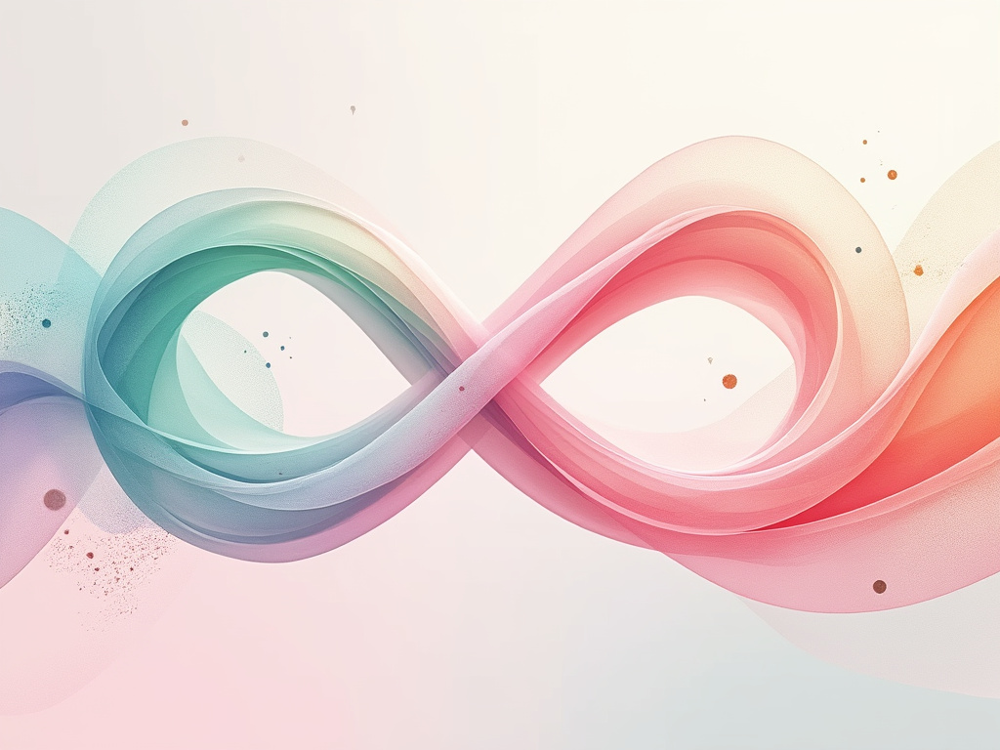
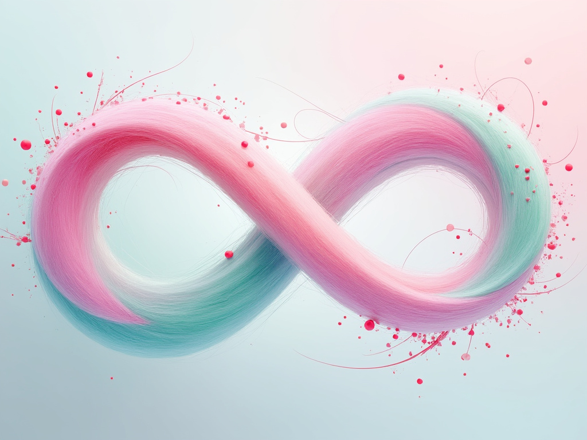

The final illustration is a captivating blend of soft pastel hues dominated by shades of pink, mint green, and pale blue. The composition is alive with swirling shapes that move across the canvas, suggesting the fluidity of ideas in the marketing sphere. At the center is the prominent coral infinity loop, intricately textured, drawing the viewer’s focus amidst subtly flowing lines that represent communication channels. Dots of various sizes scatter throughout, symbolizing consumer interaction, while the layering of shapes reflects the complexity and partnership inherent in modern marketing. The background remains light, accentuating the vibrant focal point and flowing organic shapes, creating an inviting and thought-provoking visual experience. Overall, the illustration presents an abstract representation of marketing’s dynamic nature, balancing emotional warmth with intellectual engagement.

