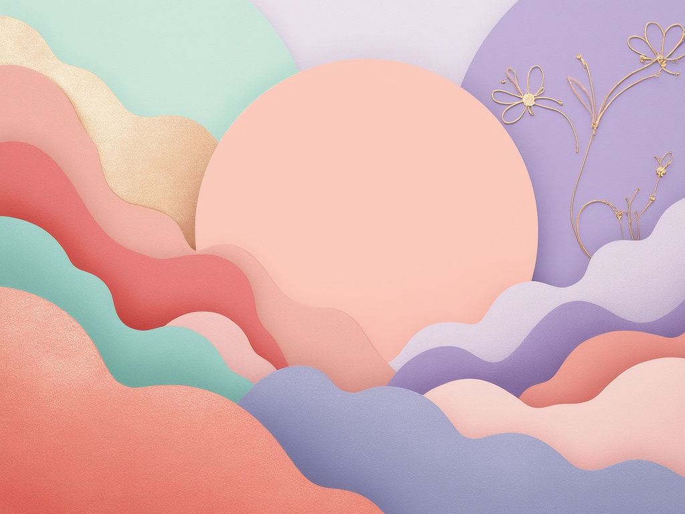

The final illustration showcases an enchanting blend of pastel colors, primarily soft peach and mint green, interwoven with delicate lavender undertones. The composition is dominated by a large swirling circular shape at the center, rendered in a deeper coral that pulls the viewer’s focus, its silky texture suggesting a luxurious feel. Surrounding this focal point, organic and geometric forms intermingle, creating a harmonious dance that mirrors the fluidity of marketing strategies. The background spreads waves of lavender softly, while dotted accents in mint engage the eye, reminiscent of digital touchpoints. Elegant floral outlines in shimmering gold frame the composition, further enhancing the luxurious theme. Overall, the illustration emanates a sense of refined beauty and invites engagement, successfully embodying the essence of marketing as both an art and science

