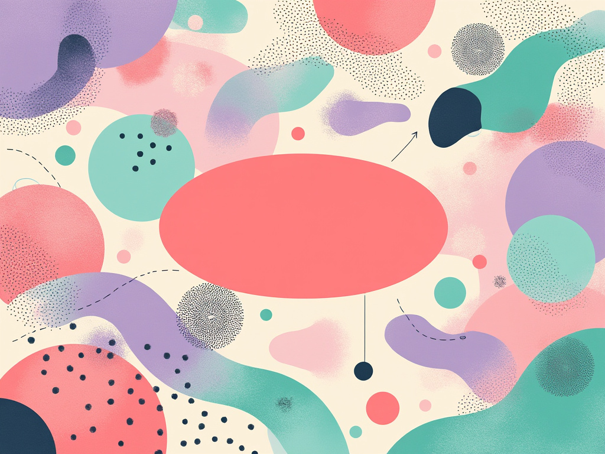
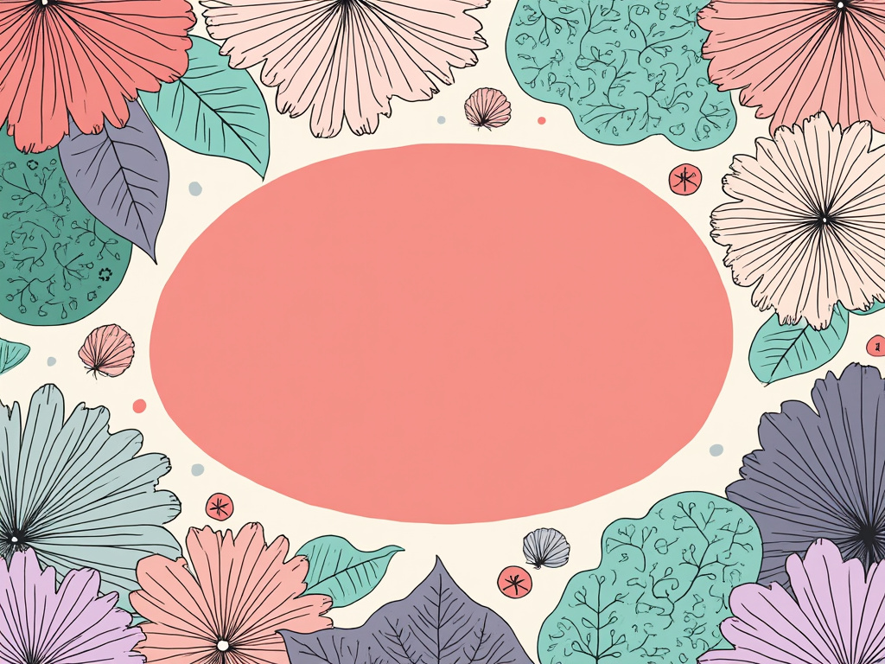
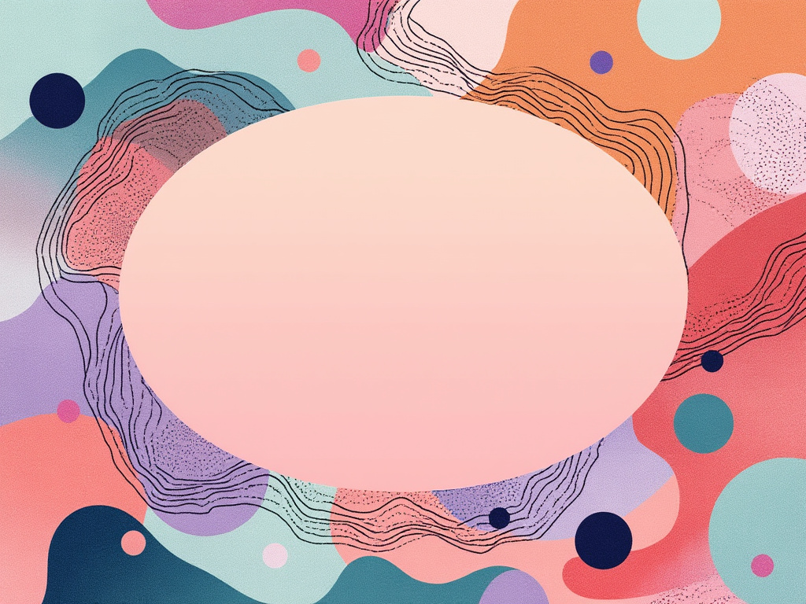

  
The final illustration presents an intricate, pastel-hued pattern that embodies the essence of Marketing through a dynamic interplay of shapes and colors. At the center resides a warm coral oval that draws the eye, radiating outward in soft gradients into soothing pinks, lavenders, and mint greens. Surrounding this focal point are smaller circular elements, interspersed and varying in size, simulating the diverse audience segments targeted by marketing strategies. Flowing, organic lines weave through the composition, representing communication channels while dotted textures add a palpable energy to the overall design. The interplay between structured and organic components creates a visual rhythm that captures the fluidity of marketing concepts—all encapsulated within a modern artistic lens. The final result is a thought-provoking tapestry that invites the viewer to explore the nature of connection, engagement, and strategy in the vibrant landscape of Marketing.

.jpeg)

