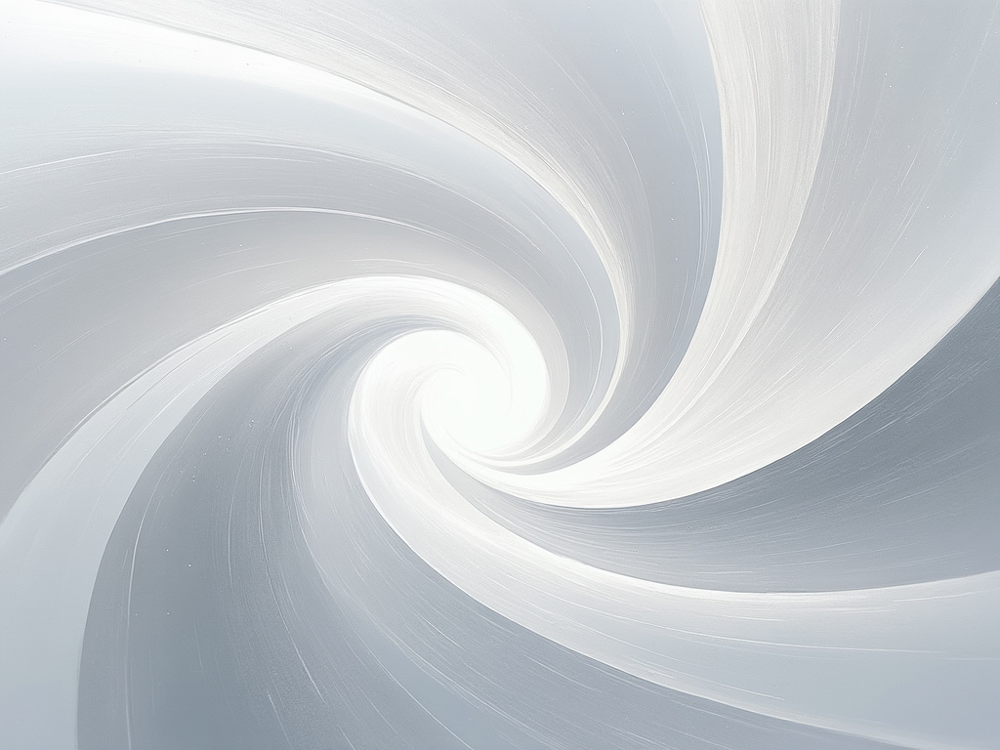

The final illustration is a captivating composition defined by a seamless blend of very light grays and white, evoking a celestial atmosphere. The central spiral, rendered in gradients from soft silver to near-white, draws the viewer's eye and suggests motion and continuity. Surrounding this focal point, delicate swirling lines create a sense of connectivity, while scattered dots shine faintly, reminiscent of particles in a vast quantum field. Underpinning the piece, abstract wave patterns in pale gray undulate gently, reinforcing the concept of fluidity and the ever-changing nature of energy. The overall effect is both ethereal and profound, inviting exploration of its nuances while making a striking visual statement. The interplay of textures adds a tactile quality, enhancing the illusion of depth and dynamic movement, ultimately encapsulating the essence of the Quantum Field in a visually compelling manner

.jpeg)