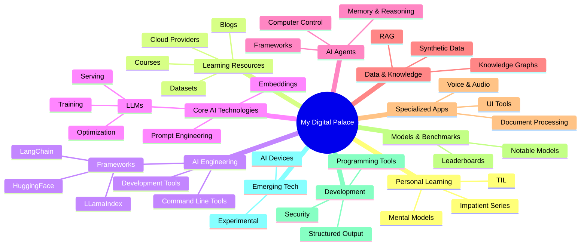

# My Digital Palace - A Personal AI Knowledge Repository

> Your comprehensive guide to mastering AI development - from beginner to expert

## 🎯 Quick Start Guide

**New to AI?** → [Getting Started Guide](./guides/getting-started.md)  
**Want to build chatbots?** → [Conversational AI Guide](./guides/conversational-ai.md)  
**Need tools recommendations?** → [AI Tools Master Directory](./tools/ai-tools-master-directory.md)  
**Looking to learn?** → [Learning Resources Hub](./learning/learning-resources-hub.md)

---

## 🧭 Navigation by Goal

### 🌱 **"I'm new to AI development"**
- 📚 **Start**: [Complete Beginner Path](./learning/learning-resources-hub.md#complete-beginner-path)
- 🛠️ **Tools**: [Beginner-Friendly Tools](./tools/ai-tools-master-directory.md#beginner-friendly-tools)
- 🚀 **First Project**: [Getting Started Guide](./guides/getting-started.md)

### 💼 **"I need to build AI for business"**
- 💬 **Chatbots**: [Conversational AI Systems](./guides/conversational-ai.md)
- 🔍 **Document AI**: [RAG & Knowledge Systems](./guides/rag-systems.md)
- 📊 **Analytics**: [AI Application Monitoring](./guides/monitoring.md)

### 🔬 **"I want to do AI research"**
- 📖 **Learning**: [Advanced Practitioner Path](./learning/learning-resources-hub.md#advanced-practitioner-path)
- 🔧 **Tools**: [Research & Production Tools](./tools/ai-tools-master-directory.md#production--research-tools)
- 🧠 **Papers**: [Research Paper Collection](./reference/research-papers.md)

### 🚀 **"I need to deploy AI in production"**
- ⚡ **Serving**: [Model Serving & Inference](./tools/ai-tools-master-directory.md#model-serving--inference)
- 📈 **Scaling**: [Production Deployment Guide](./guides/deployment.md)
- 🔍 **Monitoring**: [AI System Monitoring](./guides/monitoring.md)

---

## 📚 Core Knowledge Areas

### Essential Guides
| Guide | Purpose | Time | Difficulty |
|-------|---------|------|------------|
| [Getting Started](./guides/getting-started.md) | Your first AI application | 2-4 hours | 🟢 Beginner |
| [Conversational AI](./guides/conversational-ai.md) | Build chatbots & assistants | 4-8 hours | 🟡 Intermediate |
| [RAG Systems](./guides/rag-systems.md) | AI with your data | 6-12 hours | 🟡 Intermediate |
| [AI Agents](./guides/ai-agents.md) | Autonomous AI systems | 8-16 hours | 🔴 Advanced |
| [Production Deployment](./guides/deployment.md) | Scale to real users | 12+ hours | 🔴 Advanced |

### Tool Categories
| Category | Focus | Best For |
|----------|-------|----------|
| [Development Frameworks](./tools/ai-tools-master-directory.md#development-frameworks) | Building applications | All developers |
| [Model Serving](./tools/ai-tools-master-directory.md#model-serving--inference) | Running models efficiently | Production teams |
| [AI Agents](./tools/ai-tools-master-directory.md#ai-agent-frameworks) | Autonomous systems | Advanced developers |
| [Data & RAG](./tools/ai-tools-master-directory.md#data--rag-tools) | Knowledge integration | Data-focused projects |

### Learning Paths
| Path | Target Audience | Duration | 
|------|-----------------|----------|
| [Complete Beginner](./learning/learning-resources-hub.md#complete-beginner-path) | No AI experience | 2-3 months |
| [Developer](./learning/learning-resources-hub.md#developer-path) | Can code, new to AI | 1-2 months |
| [Advanced Practitioner](./learning/learning-resources-hub.md#advanced-practitioner-path) | AI professionals | Ongoing |

---

## 🗂️ Repository Organization

### 📁 Main Directories

#### `/guides/` - **How-To Guides**
Practical, step-by-step instructions for building AI applications
- `getting-started.md` - Your first AI project
- `conversational-ai.md` - Chatbots and assistants  
- `rag-systems.md` - AI with your own data
- `ai-agents.md` - Autonomous AI systems
- `deployment.md` - Production scaling

#### `/tools/` - **Tool Directories** 
Curated collections of AI tools and frameworks
- `ai-tools-master-directory.md` - Comprehensive tool catalog
- `frameworks-comparison.md` - Framework selection guide
- `model-serving-options.md` - Deployment solutions

#### `/learning/` - **Educational Resources**
Structured learning materials and paths
- `learning-resources-hub.md` - Complete learning guide
- `courses.md` - Course recommendations
- `books.md` - Essential reading
- `papers.md` - Important research

#### `/reference/` - **Quick References**
Fast-lookup information and cheat sheets
- `model-comparison.md` - Model capabilities
- `prompt-templates.md` - Reusable prompts
- `api-references.md` - Common API patterns

#### `/projects/` - **Example Projects**
Complete project templates and examples
- `chatbot-starter/` - Basic chatbot template
- `rag-example/` - Document Q&A system
- `agent-demo/` - AI agent template

---

## 🎭 Personal Learning Philosophy

### Today I Learned (TIL)
Document daily discoveries and insights to build knowledge systematically.

**Why TIL Works:**
- Creates learning habit
- Builds searchable knowledge base  
- Tracks progress over time
- Shares insights with community

👉 **[My TIL Collection](./personal/til/README.md)**

### Mental Models for AI
Frameworks for understanding complex AI systems and making better decisions.

**Key Mental Models:**
- **Emergence**: Simple rules → complex behaviors
- **Abstraction Layers**: Hide complexity, expose interfaces
- **Feedback Loops**: Output influences future input
- **Trade-offs**: Speed vs accuracy, cost vs quality

👉 **[Mental Models Guide](./personal/mental-models/README.md)**

### "For the Impatient" Series
Fast-track tutorials for experienced developers who want results quickly.

**Philosophy**: Start building immediately, understand deeply later.

👉 **[Impatient Series](./personal/impatient-series/README.md)**

---

## 🌟 What Makes This Different

### ✅ **Goal-Oriented Organization**
- Organized by what you want to achieve, not just technology categories
- Clear success criteria for each guide
- Multiple paths based on your background

### ✅ **Curated Quality**
- Every tool and resource is personally tested
- Regular updates based on community feedback
- No affiliate links - purely value-driven

### ✅ **Production-Ready Focus**
- Emphasis on building real applications
- Deployment and scaling considerations
- Monitoring and maintenance guidance

### ✅ **Community-Driven**
- Open source and collaborative
- Regular updates from practitioners
- Real-world experience shared

---

## 🚀 Getting Started

### For Complete Beginners
1. **Start here**: [Getting Started Guide](./guides/getting-started.md)
2. **Learn basics**: [Beginner Learning Path](./learning/learning-resources-hub.md#complete-beginner-path)
3. **Pick tools**: [Beginner-Friendly Tools](./tools/ai-tools-master-directory.md#beginner-friendly-tools)
4. **Build first project**: Follow the 30-minute quickstart

### For Developers
1. **Choose your focus**: [Developer Path](./learning/learning-resources-hub.md#developer-path)
2. **Pick frameworks**: [Development Frameworks](./tools/ai-tools-master-directory.md#development-frameworks)
3. **Build applications**: [Conversational AI](./guides/conversational-ai.md) or [RAG Systems](./guides/rag-systems.md)
4. **Scale to production**: [Deployment Guide](./guides/deployment.md)

### For AI Professionals
1. **Stay current**: [Advanced Resources](./learning/learning-resources-hub.md#advanced-practitioner-path)
2. **Explore tools**: [Production Tools](./tools/ai-tools-master-directory.md#production--research-tools)
3. **Advanced patterns**: [AI Agents](./guides/ai-agents.md)
4. **Contribute back**: Share your learnings

---

## 🤝 Contributing

This is a living document that improves with community input.

### How to Contribute
- **🐛 Found an error?** Open an issue
- **💡 Have a suggestion?** Submit a pull request  
- **📚 Want to add content?** Follow the contribution guidelines
- **⭐ Found it helpful?** Star the repository

### Contribution Guidelines
- Focus on practical, tested information
- Include clear examples and code snippets
- Maintain the goal-oriented organization
- Update related cross-references

---

## 📧 Connect & Support

**Creator**: [Raphaël MANSUY](https://www.linkedin.com/in/raphaelmansuy/)

**Community**: 
- 💬 [Discussions](https://github.com/raphaelmansuy/digital-palace/discussions)
- � [Issues](https://github.com/raphaelmansuy/digital-palace/issues)
- 🔔 [Follow for Updates](https://github.com/raphaelmansuy/digital-palace/stargazers)

---

## 📊 Repository Stats

- **📂 Guides**: 5+ comprehensive tutorials
- **🛠️ Tools**: 50+ curated AI tools
- **📚 Resources**: 100+ learning materials  
- **⏰ Last Updated**: {{ date }}
- **👥 Contributors**: Growing community
- **⭐ GitHub Stars**: [Current count]

---

*"The best way to predict the future is to build it."*

**Start your AI journey today** → [Getting Started Guide](./guides/getting-started.md)

### 📚 Learning & Development

- [Personal Learning & Reflection](#-personal-learning--reflection)
- [Learning Resources](#-learning-resources)
- [Mental Models](#mental-models)

### 🤖 AI Technologies & Tools

- [AI Engineering & Development](#-ai-engineering--development)
- [Core AI Technologies](#-core-ai-technologies)
- [AI Agents](#agents)
- [RAG & Knowledge Systems](#rag)

### 🔧 Technical Implementation

- [Model Serving](#serving-llms)
- [Fine-tuning](#fine-tuning)
- [Prompt Engineering](#prompt-engineering)
- [Development Tools](#development)

### 📊 Resources & References

- [Models & Benchmarks](#models)
- [Articles & Research](#articles)
- [Computing Resources](#computing)

---

## 🎯 How To Guides - From Goal to Implementation

> Navigate by what you want to achieve rather than technology categories

### 🚀 Getting Started

#### How to: Start Your AI Development Journey

**What I want to achieve**: Begin building AI applications with no prior experience

**Prerequisites**: Basic programming knowledge (Python recommended)

**Essential Tools**:

- [Ollama](https://ollama.com/) - Run models locally without complexity
- [LangChain](https://www.langchain.com/) - Framework for LLM applications
- [Jupyter Notebooks](https://jupyter.org/) - Interactive development environment

**Learning Path**:

1. Start with → [AI Courses](07-courses/ai_courses.md)
2. Practice with → [Today I Learned](02-til/README.md)
3. Build first app → [LangChain documentation](https://python.langchain.com/docs/get_started/introduction)

**Success Criteria**: Successfully run a local LLM and build a simple Q&A application

---

### 💬 Building Conversational AI

#### How to: Create a Custom Chatbot

**What I want to achieve**: Build an intelligent conversational interface for my domain

**Essential Tools**:

- [LangChain](https://www.langchain.com/) - Conversation management
- [instructor](https://jxnl.github.io/instructor/) - Structured responses
- [Ollama](https://ollama.com/) - Local model serving
- [Vercel AI SDK](https://vercel.com/blog/ai-sdk-3-generative-ui) - UI components

**Key Concepts**: [Prompt Engineering Patterns](./01-articles/prompt_engineering_patterns/README.md)

**Success Criteria**: Chatbot that maintains context and provides relevant responses

#### How to: Add Memory to AI Conversations

**What I want to achieve**: Create AI that remembers past conversations and learns from interactions

**Essential Tools**:

- [MemGPT](https://memgpt.ai/) - Long-term memory management
- [Cognee](https://github.com/topoteretes/cognee) - Memory for AI applications
- [Zep](https://github.com/getzep/zep) - Long-term memory for assistants

**Success Criteria**: AI assistant that references previous conversations naturally

---

### 🔍 Knowledge & Data Integration

#### How to: Build a RAG (Retrieval-Augmented Generation) System

**What I want to achieve**: Make AI answer questions using my own documents and data

**Essential Tools**:

- [LlamaIndex](https://www.llamaindex.ai/) - Data framework for LLM applications
- [RagFlow](https://github.com/infiniflow/ragflow) - RAG engine with deep document understanding
- [pgvectorscale](https://github.com/timescale/pgvectorscale/) - Vector database
- [FireCrawl](https://github.com/mendableai/firecrawl) - Website to LLM-ready markdown

**Key Concepts**: [Embeddings Guide](./01-articles/embeddings/README.md)

**Success Criteria**: AI that accurately answers questions using your documents

#### How to: Create a Knowledge Graph for AI

**What I want to achieve**: Build interconnected knowledge that AI can navigate and reason about

**Essential Tools**:

- [LightRAG](https://github.com/HKUDS/LightRAG) - Knowledge graph RAG
- [MindGraph](https://github.com/yoheinakajima/MindGraph) - AI-powered knowledge graphs

**Success Criteria**: AI that understands relationships between concepts in your domain

---

### 🤖 AI Agents & Automation

#### How to: Build AI Agents That Take Actions

**What I want to achieve**: Create AI that can perform tasks autonomously in digital environments

**Essential Tools**:

- [Quantalogic](https://github.com/quantalogic/quantalogic) - Powerful agentic framework
- [CrewAI](https://github.com/joaomdmoura/crewAI) - Multi-agent collaboration
- [AutoGen](https://microsoft.github.io/autogen/) - Multi-agent conversation framework
- [Pydantic Agents](https://ai.pydantic.dev/agents/) - Production-grade agent framework

**Key Concepts**: [Agent Architecture Patterns](https://techcommunity.microsoft.com/blog/machinelearningblog/baseline-agentic-ai-systems-architecture/4207137)

**Success Criteria**: Agent that completes multi-step tasks with minimal supervision

#### How to: Create AI That Controls Computers

**What I want to achieve**: Build AI that can interact with software interfaces like a human

**Essential Tools**:

- [Screen Agents](https://github.com/niuzaisheng/ScreenAgent) - Visual computer control
- [SWE Agents](https://github.com/princeton-nlp/SWE-agent) - Software engineering agents
- [Open Interpreter](https://github.com/KillianLucas/open-interpreter/) - Natural language computer interface

**Success Criteria**: AI that can navigate and operate computer applications

---

### 🔧 Model Customization

#### How to: Fine-tune Models for Your Domain

**What I want to achieve**: Adapt pre-trained models to perform better on my specific tasks

**Essential Tools**:

- [unsloth](https://github.com/unslothai/unsloth) - 5X faster, 60% less memory fine-tuning
- [LLama-Factory](https://github.com/hiyouga/LLaMA-Factory) - Unified fine-tuning for 100+ LLMs
- [peft](https://github.com/huggingface/peft) - Parameter-efficient fine-tuning

**Key Concepts**: [Training LLMs Guide](01-articles/2024-03-12_training_an_llm.md)

**Success Criteria**: Model that significantly outperforms base model on your domain

#### How to: Generate Synthetic Training Data

**What I want to achieve**: Create high-quality training data when real data is scarce

**Essential Tools**:

- [Bonito](https://github.com/BatsResearch/bonito) - Synthetic instruction tuning datasets
- [instructor](https://jxnl.github.io/instructor/) - Structured data generation

**Success Criteria**: Generated dataset that improves model performance

---

### 🚀 Production Deployment

#### How to: Serve Models at Scale

**What I want to achieve**: Deploy AI models that can handle production traffic efficiently

**Essential Tools**:

- [vLLM](https://github.com/vllm-project/vllm) - High-throughput LLM serving
- [Ollama](https://ollama.com/) - Simple local deployment
- [SkyPilot](https://skypilot.readthedocs.io/en/latest/) - Multi-cloud deployment
- [LoraX](https://github.com/predibase/lorax) - Multi-LoRA inference server

**Success Criteria**: Model serving with sub-second response times and high availability

#### How to: Optimize Models for Performance

**What I want to achieve**: Make models faster and use less memory while maintaining quality

**Essential Tools**:

- [hqq](https://github.com/mobiusml/hqq) - Half-quadratic quantization
- [Candle](https://github.com/huggingface/candle) - Rust-based inference
- [AICI](https://github.com/microsoft/AICI) - Controlled generation

**Success Criteria**: 2-4x speedup with minimal quality loss

---

### 🎨 Specialized Applications

#### How to: Build AI-Powered User Interfaces

**What I want to achieve**: Create applications with AI-generated or AI-enhanced UIs

**Essential Tools**:

- [OpenUI](https://github.com/wandb/openui) - Describe UI with natural language
- [Screenshot to Code](https://github.com/abi/screenshot-to-code) - Convert designs to code
- [Vercel AI SDK](https://vercel.com/blog/ai-sdk-3-generative-ui) - Stream React components

**Success Criteria**: Working application with AI-generated interface components

#### How to: Add Voice Capabilities

**What I want to achieve**: Create AI that can understand speech and respond with natural voice

**Essential Tools**:

- [whisper](https://github.com/openai/whisper) - Speech recognition
- [MeloTTS](https://github.com/myshell-ai/MeloTTS) - High-quality text-to-speech
- [VoiceCraft](https://github.com/jasonppy/VoiceCraft) - Zero-shot speech editing

**Success Criteria**: Natural voice conversation with AI

#### How to: Process Documents with AI

**What I want to achieve**: Extract structured information from PDFs, images, and documents

**Essential Tools**:

- [zerox](https://github.com/getomni-ai/zerox) - OCR & document extraction using vision models
- [lumentis](https://github.com/hrishioa/lumentis) - Generate docs from transcripts

**Success Criteria**: Accurate data extraction from various document formats

---

### 📊 Monitoring & Evaluation

#### How to: Ensure AI Output Quality

**What I want to achieve**: Implement checks and balances to maintain AI system reliability

**Essential Tools**:

- [instructor](https://jxnl.github.io/instructor/) - Structured output validation
- [BAML](https://github.com/BoundaryML/baml) - Reliable structured data from LLMs
- [Guidance](https://github.com/guidance-ai/guidance) - Controlled generation

**Success Criteria**: AI system with consistent, validated outputs

---

## 🧭 Quick Navigation Guide

> Choose your path based on your experience level and goals

### 🌱 **New to AI Development?**

Start here → [How to: Start Your AI Development Journey](#how-to-start-your-ai-development-journey)

### 💼 **Building Business Applications?**

- [How to: Create a Custom Chatbot](#how-to-create-a-custom-chatbot)
- [How to: Build a RAG System](#how-to-build-a-rag-retrieval-augmented-generation-system)
- [How to: Ensure AI Output Quality](#how-to-ensure-ai-output-quality)

### 🔬 **Research & Experimentation?**

- [How to: Fine-tune Models](#how-to-fine-tune-models-for-your-domain)
- [How to: Generate Synthetic Data](#how-to-generate-synthetic-training-data)
- [Core AI Technologies](#-core-ai-technologies)

### 🏭 **Production Deployment?**

- [How to: Serve Models at Scale](#how-to-serve-models-at-scale)
- [How to: Optimize Model Performance](#how-to-optimize-models-for-performance)
- [Model Serving Tools](#serving-llms)

### 🤖 **Advanced AI Agents?**

- [How to: Build AI Agents](#how-to-build-ai-agents-that-take-actions)
- [How to: AI Computer Control](#how-to-create-ai-that-controls-computers)
- [Agent Frameworks](#agents)

## � Legacy Content

The complete content from the original README has been preserved and reorganized into focused guides. Here are the key redirects:

### 📚 Personal Learning & Reflection
- **Today I Learned (TIL)** → [Personal TIL Collection](./personal/til/README.md)
- **Mental Models** → [Mental Models Guide](./personal/mental-models/README.md)  
- **"For the Impatient" Series** → [Impatient Series](./personal/impatient-series/README.md)

### 🎓 Complete Learning Resources
- **Comprehensive Learning Hub** → [Learning Resources Hub](./learning/learning-resources-hub.md)
- **Course Collections** → [AI Courses](./reference/courses.md)
- **Books & Reading** → [Essential Books](./reference/books.md)

### 🛠️ Technical References
- **All AI Tools** → [AI Tools Master Directory](./tools/ai-tools-master-directory.md)
- **Framework Comparisons** → [Framework Selection Guide](./tools/framework-comparison.md)
- **Model Information** → [Model Comparison](./reference/models.md)

### 📄 Article Collections
- **All Articles** → [Article Index](./reference/articles.md)
- **Research Papers** → [Paper Collection](./reference/research-papers.md)
- **Blog Posts** → [Quality Blogs](./reference/blogs.md)

---

## 🤖 AI Engineering & Development

### Core Concepts & Frameworks

- [Generative AI Business Use Cases](01-articles/2024-03-12_genai_business_use_cases.md)
- [Comprehensive Guide to Large Language Model Engineering](11-genai/README.md.md)
- [Design and Architecture Patterns for LLM Applications](./01-articles/dessign_patterns_for_llm_applications/README.md)
- [Frameworks for Building LLM Applications](./01-articles/framework_for_llm_applications/README.md)
- [Demystifying Classifiers and Embeddings](./01-articles/embeddings/README.md)
- [Bridging the Gap Between Thinking and Doing: FaR an Effective Prompting Framework inspired from Theory of Mind](./01-articles/far/README.md)
- [Beyond Prompt Engineering: Modular and Optimized LM Programs with DSPy](./01-articles/dspy/README.md)
- [Mastering the Art of Training Large Language Models from Scratch](01-articles/2024-03-12_training_an_llm.md)

### AI Application Development

#### Core Frameworks & Libraries

- [LangChain](https://www.langchain.com/) - Framework to construct LLMs application [documentation](https://python.langchain.com/docs/get_started/introduction) 🦜
- [LLamaIndex](https://www.llamaindex.ai/) - Turn your enterprise data into production-ready LLM applications 🦙
- [HuggingFace](https://huggingface.co/) - Model, Datasets, Inference Space, the GitHub of AI models 🤗
  - [Hub](https://huggingface.co/docs/hub/index) - Your starting point to HuggingFace
  - [CLI](https://huggingface.co/docs/huggingface_hub/en/guides/cli) - Command Line Interface (CLI)
- [Quantalogic](https://github.com/quantalogic/quantalogic) - A powerful Agentic Framework
- [QLLM](https://github.com/quantalogic/qllm) - QLLM: A powerful CLI for seamless interaction with multiple Large Language Models. Simplify AI workflows, streamline development, and unlock the potential of cutting-edge language models. by [Quantalogic](https://www.quantalogi.app)

#### Specialized Tools

- [instructor](https://jxnl.github.io/instructor/) - Instructor makes it easy to reliably get structured data like JSON from Large Language Models (LLMs) like GPT-3.5, GPT-4, GPT-4-Vision, including open source models like Mistral/Mixtral from [Together](https://jxnl.github.io/instructor/hub/together/), [Anyscale](https://jxnl.github.io/instructor/hub/anyscale/), [Ollama](https://jxnl.github.io/instructor/hub/ollama/), and [llama-cpp-python](https://jxnl.github.io/instructor/hub/llama-cpp-python/).
- [instructor_ex](https://github.com/thmsmlr/instructor_ex) - (Elixir version of Instructor)
- [BAML](https://github.com/BoundaryML/baml) - BAML is a language that helps you get structured data from LLMs, with the best DX possible. Works with all languages. Check out the promptfiddle.com playground
- [ell](https://docs.ell.so/index.html#) - A language model programming framework
- [marvin](https://www.askmarvin.ai/welcome/what_is_marvin/) - Marvin is a lightweight AI toolkit for building natural language interfaces that are reliable, scalable, and easy to trust
- [PhiData](https://docs.phidata.com/introduction) - Phidata is a toolkit for building AI Assistants using function calling

#### Utility & Enhancement Tools

- [Vercel AI SDK](https://vercel.com/blog/ai-sdk-3-generative-ui) - Stream React Components from LLMs to deliver richer user experiences
- [easyllm](https://philschmid.github.io/easyllm/) - EasyLLM is an open source project that provides helpful tools and methods for working with large language models (LLMs), both open source and closed source
- [Flowneum](https://github.com/floneum/floneum) - A toolkit for controllable, private AI on consumer hardware in rust
- [Kalosm](https://floneum.com/kalosm/) - Kalosm is an open source framework for private language, audio, and image models in Rust
- [Microsoft AutoDev](https://github.com/unit-mesh/auto-dev) - 🧙‍AutoDev: The AI-powered coding wizard with multilingual support
- [Cognee](https://github.com/topoteretes/cognee?tab=readme-ov-file) - Memory management for the AI Applications and AI Agents
- [MemGPT](https://memgpt.ai/) - Enable Next-Gen Large Language Model Applications
- [lumentis](https://github.com/hrishioa/lumentis) - Generate beautiful docs from your transcripts and unstructured information with a single command
- [OpenUI](https://github.com/wandb/openui) - OpenUI let's you describe UI using your imagination, then see it rendered live
- [FireCrawl](https://github.com/mendableai/firecrawl) - Turn entire websites into LLM-ready markdown
- [Sammo](https://github.com/microsoft/sammo) - A library for prompt engineering and optimization (SAMMO = Structure-aware Multi-Objective Metaprompt Optimization)
- [Awesome Python](https://github.com/vinta/awesome-python)
- [Oumi](https://github.com/oumi-ai/oumi) - Everything you need to build state-of-the-art foundation models, end-to-end

### AI-Assisted Development

- [Plandex](https://github.com/plandex-ai/plandex) - An AI coding engine for complex tasks
- [Aider](https://github.com/paul-gauthier/aider) - aider is AI pair programming in your terminal

### Command-Line AI Tools

- [llms](https://llm.datasette.io/en/stable/) - A CLI utility and Python library for interacting with Large Language Models, both via remote APIs and models that can be installed and run on your own machine. By [Simon Willison](https://simonwillison.net/)
- [Open Interpreter](https://github.com/KillianLucas/open-interpreter/) - A natural language interface for computers
- [Documentation Open Interpreter](https://docs.openinterpreter.com/getting-started/introduction) - A new way to use computers
- [whisper](https://github.com/openai/whisper) - Whisper is a general-purpose speech recognition model. It is trained on a large dataset of diverse audio and is also a multitasking model that can perform multilingual speech recognition, speech translation, and language identification
- [plock](https://github.com/jasonjmcghee/plock) - From anywhere you can type, query and stream the output of an LLM or any other script
- [Screen shot to code](https://github.com/abi/screenshot-to-code) - Drop in a screenshot and convert it to clean code (HTML/Tailwind/React/Vue)
- [Code2prompt](https://github.com/raphaelmansuy/code2prompt) - Convert a codebase to an AI prompt
- [Claude Engineer](https://github.com/Doriandarko/claude-engineer) - Claude Engineer is an interactive command-line interface (CLI) that leverages the power of Anthropic's Claude-3.5-Sonnet model to assist with software development tasks. This tool combines the capabilities of a large language model with practical file system operations and web search functionality

---

## 🧠 Core AI Technologies

### Large Language Models (LLMs)

#### LLMs Implementation

- [LLMs from scratch](https://github.com/rasbt/LLMs-from-scratch) - Implementing a ChatGPT-like LLM from scratch, step by step by from [Sebastian Raschka](https://github.com/rasbt)

#### Model Serving & Inference

**High-Performance Servers:**
- [vLLM](https://github.com/vllm-project/vllm) - Easy, fast, and cheap LLM serving for everyone, [documentation](https://docs.vllm.ai/en/latest/)
- [llamaC++](https://github.com/ggerganov/llama.cpp) - LLM inference in C/C++
- [Ollama](https://github.com/ollama/ollama) - Go program that encapsulate [llamac++](https://github.com/ggerganov/llama.cpp). [documentation](https://ollama.com/)
- [nm-vllm](https://github.com/neuralmagic/nm-vllm) - A high-throughput and memory-efficient inference and serving engine for LLMs (sparse compressing)

**Specialized Solutions:**
- [Candle](https://github.com/huggingface/candle?tab=readme-ov-file) - Minimalist ML framework for Rust. Run and Serve Models in Rust
- [ZML](https://github.com/zml/zml) - High performance AI inference stack. Built for production. [@ziglang](https://github.com/ziglang) / [@openxla](https://github.com/openxla) / MLIR / [@bazelbuild](https://github.com/bazelbuild)
- [LLamafile](https://github.com/Mozilla-Ocho/llamafile) - Turning a LLM model into a Multiplatform executable
- [Jan](https://github.com/janhq/jan) - Jan is an open source alternative to ChatGPT that runs 100% offline on your computer
- [MLX Omni Server](https://github.com/madroidmaq/mlx-omni-server) - MLX Omni Server is a local inference server powered by Apple's MLX framework, specifically designed for Apple Silicon (M-series) chips. It implements OpenAI-compatible API endpoints, enabling seamless integration with existing OpenAI SDK clients while leveraging the power of local ML inference
- [Mlx Server](https://www.mlxserver.com/) - This Python library is the easist way to begin building on top of Apple's machine learning library MLX
- [fastassert](https://github.com/phospho-app/fastassert) - Dockerized LLM inference server with constrained output (JSON mode), built on top of vLLM and outlines
- [luminal](https://github.com/jafioti/luminal) - Deep learning at the speed of light coded in Rust. The aim for 0.3 is to achieve SOTA performance on an M1 pro (50 tok/s), and near SOTA on single nvidia gpus (>100 tok/s)

**Cloud & Distributed:**
- [SkyPilot](https://docs.vllm.ai/en/latest/) - Run LLMs and AI on Any Cloud [documentation](https://skypilot.readthedocs.io/en/latest/)
- [LoraX](https://github.com/predibase/lorax) - Multi-LoRA inference server that scales to 1000s of fine-tuned LLMs ([Documentation](https://loraexchange.ai/))
- [LLama Cpp Python Binding](https://llama-cpp-python.readthedocs.io/en/latest/) - OpenAI compatible web server

**Resources:**
- [List of tools that serves AI locally](https://github.com/janhq/awesome-local-ai) - An awesome repository of local AI tools

#### Model Training & Fine-Tuning

**Fine-Tuning Frameworks:**
- [unsloth](https://github.com/unslothai/unsloth/tree/main#-documentation) - 5X faster 60% less memory QLoRA finetuning
- [LLama-Factory](https://github.com/hiyouga/LLaMA-Factory) - Unify Efficient Fine-tuning of 100+ LLMs
- [peft](https://github.com/huggingface/peft) - 🤗 PEFT: State-of-the-art Parameter-Efficient Fine-Tuning
- [Torchtune](https://github.com/pytorch/torchtune) - A Native-PyTorch Library for LLM Fine-tuning
- [LLMTuner](https://github.com/promptslab/LLMTuner) - Tune LLM in few lines of code
- [LMFlow](https://github.com/OptimalScale/LMFlow) - An Extensible Toolkit for Finetuning and Inference of Large Foundation Models. Large Models for All. (Include Lisa Finetuning)

**Training Infrastructure:**
- [OLMo](https://github.com/allenai/OLMo) - Modeling, training, eval, and inference code for [OLMo](https://allenai.org/olmo)
- [Lightning Thunder](https://github.com/Lightning-AI/lightning-thunder) - Source to source compiler for PyTorch. It makes PyTorch programs faster on single accelerators and distributed

**Resources:**
- [Documentation from Premai about Finetuning](https://book.premai.io/state-of-open-source-ai/fine-tuning/)
- [Efficient finetuning of Llama 3 with FSDP QDoRA](https://www.answer.ai/posts/2024-04-26-fsdp-qdora-llama3.html) - A blog article that explains how to use the stat of the art QDoRA fine tuning method on LLAMA3

#### Model Optimization

**Quantization:**
- [Aimet](https://github.com/quic/aimet) - AIMET is a library that provides advanced quantization and compression techniques for trained neural network models from Qualcomm Innovation Center
- [hqq](https://github.com/mobiusml/hqq) - Official implementation of Half-Quadratic Quantization (HQQ). **HQQ** is a fast and accurate model quantizer that skips the need for calibration data. It's super simple to implement (just a few lines of code for the optimizer). It can crunch through quantizing the Llama2-70B model in only 4 minutes! 🚀

**Inference Control:**
- [Guidance](https://github.com/guidance-ai/guidance) - A guidance language for controlling large language models
- [AICI](https://github.com/microsoft/AICI) - AICI: Prompts as (Wasm) Programs. Controlling inference using Wasm programs
- [Transformer Head](https://github.com/center-for-humans-and-machines/transformer-heads) - Toolkit for attaching, training, saving and loading of new heads for transformer models
- [Representation Engineering](https://vgel.me/posts/representation-engineering/) - Representation Engineering Mistral-7B an Acid Trip 💊

### Embeddings & Vector Operations

**Core Concepts:**
- [What are embeddings and how do they work? A book from Vicki Boykis](https://vickiboykis.com/what_are_embeddings/)
  - [Github](https://github.com/veekaybee/what_are_embeddings)
  - [PDF](https://raw.githubusercontent.com/veekaybee/what_are_embeddings/main/embeddings.pdf)
- [Fine-tuning language models improves performance by enhancing existing mechanisms rather than creating new ones, as evidenced by consistent circuit functionality in entity tracking tasks](https://finetuning.baulab.info/)
- [Introduction to Matryoshka Embedding Models](https://huggingface.co/blog/matryoshka)
- [Binary Embeddings Cohere](https://txt.cohere.com/int8-binary-embeddings/)

**Vector Databases:**
- [pgvectorscale](https://github.com/timescale/pgvectorscale/) - A complement to pgvector for high performance, cost efficient vector search on large workloads

### Prompt Engineering

**Techniques & Patterns:**
- [Summoning the Magic of Prompts: A Deep Dive into Prompt Engineering Patterns](./01-articles/prompt_engineering_patterns/README.md)
- [A list of prompt engineering techniques](https://aman.ai/primers/ai/prompt-engineering/)
- [Mastering the art of prompt engineering](01-articles/2024-05-29_mastering-prompt-engineering_us.md)
- [Mastering the art of prompt engineering in French](01-articles/2024-05-29_mastering_prompt_engineering_fr.md)

**Advanced Frameworks:**
- [Claude Anthropic Prompts Library](https://docs.anthropic.com/claude/page/prompts) - Explore optimized prompts for a breadth of business and personal tasks
- [Navigating the Prompt Engineering Landscape: A Comprehensive Survey for NLP Practitioners](https://arxiv.org/pdf/2407.12994)

---

## LLM Applications

[What are the common use cases of LLM Applications ?](./01-articles/llm_applications_use_cases/README.md)

- [ottogrid](https://ottogrid.ai/) 

### Front End

[Bionic GPT]([https://github.com/bionic-gpt/bionic-gpt/blob/main/README.md) **BionicGPT is an on-premise replacement for ChatGPT, offering the advantages of Generative AI while maintaining strict data confidentiality** BionicGPT can run on your laptop or scale into the data center.
[Lobe Chat](https://github.com/lobehub/lobe-chat) 🤯 Lobe Chat - an open-source, modern-design AI chat framework. Supports Multi AI Providers( OpenAI / Claude 3 / Gemini / Ollama / Azure / DeepSeek), Knowledge Base (file upload / knowledge management / RAG ), Multi-Modals (Vision/TTS) and plugin system. One-click FREE deployment of your private ChatGPT/ Claude application.

### Toolbox

- [Quantalogic](https://github.com/quantalogic/quantalogic) A powerful Agentic Framework
- [QLLM](https://github.com/quantalogic/qllm)  QLLM: A powerful CLI for seamless interaction with multiple Large Language Models. Simplify AI workflows, streamline development, and unlock the potential of cutting-edge language models. by [Quantalogic](https://www.quantalogi.app)
- [BAML](https://github.com/BoundaryML/baml) BAML is a language that helps you get structured data from LLMs, with the best DX possible. Works with all languages. Check out the promptfiddle.com playground
- [ell](https://docs.ell.so/index.html#) A language model programming framework.
- [LangChain](https://www.langchain.com/) Framework to construct LLMs application [documentation](https://python.langchain.com/docs/get_started/introduction) 🦜
- [LLamaIndex](https://www.llamaindex.ai/)Turn your enterprise data into production-ready LLM applications 🦙
- [HuggingFace](https://huggingface.co/) Model, Datasets, Inference Space, the GitHub of AI models. 🤗
	- [Hub](https://huggingface.co/docs/hub/index) Your starting point to HuggingFace
	- [cli](https://huggingface.co/docs/huggingface_hub/en/guides/cli) Command Line Interface (CLI)
- [instructor](https://jxnl.github.io/instructor/) Instructor makes it easy to reliably get structured data like JSON from Large Language Models (LLMs) like GPT-3.5, GPT-4, GPT-4-Vision, including open source models like Mistral/Mixtral from [Together](https://jxnl.github.io/instructor/hub/together/), [Anyscale](https://jxnl.github.io/instructor/hub/anyscale/), [Ollama](https://jxnl.github.io/instructor/hub/ollama/), and [llama-cpp-python](https://jxnl.github.io/instructor/hub/llama-cpp-python/).
- [instructor_ex](https://github.com/thmsmlr/instructor_ex) (Elixir version of Instructor)
- [marvin](https://www.askmarvin.ai/welcome/what_is_marvin/) Marvin is a lightweight AI toolkit for building natural language interfaces that are reliable, scalable, and easy to trust. 
- [Vercel AI SDK](https://vercel.com/blog/ai-sdk-3-generative-ui) (Stream React Components from LLMs to deliver richer user experiences)
- [easyllm](https://philschmid.github.io/easyllm/) EasyLLM is an open source project that provides helpful tools and methods for working with large language models (LLMs), both open source and closed source.

- [Flowneum](https://github.com/floneum/floneum) A toolkit for controllable, private AI on consumer hardware in rust
- [Kalosm](https://floneum.com/kalosm/) Kalosm is an open source framework for private language, audio, and image models in Rust
- [PhiData](https://docs.phidata.com/introduction) Phidata is a toolkit for building AI Assistants using function calling.
- [Microsoft AutoDev](https://github.com/unit-mesh/auto-dev) 🧙‍AutoDev: The AI-powered coding wizard with multilingual support
- [Cognee](https://github.com/topoteretes/cognee?tab=readme-ov-file) Memory management for the AI Applications and AI Agents
- [MelloTTS](https://github.com/myshell-ai/MeloTTS) High-quality multi-lingual text-to-speech library by MyShell.ai. Support English, Spanish, French, Chinese, Japanese and Korean.
- [MemGPT](https://memgpt.ai/) Enable Next-Gen Large Language Model Applications
- [lumentis](https://github.com/hrishioa/lumentis) Generate beautiful docs from your transcripts and unstructured information with a single command.
- [Wantdb/OpenUI](https://github.com/wandb/openui) OpenUI let's you describe UI using your imagination, then see it rendered live.
- [FireCrawl](https://github.com/mendableai/firecrawl) Turn entire websites into LLM-ready markdown
- [Sammo](https://github.com/microsoft/sammo) A library for prompt engineering and optimization (SAMMO = Structure-aware Multi-Objective Metaprompt Optimization)
- [Awesome Python](https://github.com/vinta/awesome-python) 
- [Oumi](https://github.com/oumi-ai/oumi) Everything you need to build state-of-the-art foundation models, end-to-end.

## AI Assisted coding

- [Plandex](https://github.com/plandex-ai/plandex) An AI coding engine for complex tasks
- [Aider][https://github.com/paul-gauthier/aider] aider is AI pair programming in your terminal

## AI Haking

[How to Hack AI Apps](https://josephthacker.com/hacking/2025/02/25/how-to-hack-ai-apps.html)  How to Hack AI Agents and Applications

## RAG

- [RagFlow](https://github.com/infiniflow/ragflow?tab=readme-ov-file) RAGFlow is an open-source RAG (Retrieval-Augmented Generation) engine based on deep document understanding.
- [RAG Techniques](https://github.com/NirDiamant/RAG_Techniques) This repository showcases various advanced techniques for Retrieval-Augmented Generation (RAG) systems. RAG systems combine information retrieval with generative models to provide accurate and contextually rich responses. 
- [byaldi](https://github.com/AnswerDotAI/byaldi) Use late-interaction multi-modal models such as ColPali in just a few lines of code.

## Knowledge Graph

- [MindGraph](https://github.com/yoheinakajima/MindGraph) proof of concept prototype for generating and querying against an ever-expanding knowledge graph with ai
- [LighRAG](https://github.com/HKUDS/LightRAG) LightRAG: Simple and Fast Retrieval-Augmented Generation". https://arxiv.org/abs/2410.05779

## Model Context Protocol

- [MCP Tools](https://github.com/f/mcptools) **Swiss Army Knife for MCP Servers.** A comprehensive CLI for interacting with Model Context Protocol servers that provides discovery & management, development features, output options, security & control, and transport support. It's like having a universal remote for AI integrations.

## Controlling Inference

- [Transformer Head](https://github.com/center-for-humans-and-machines/transformer-heads) Toolkit for attaching, training, saving and loading of new heads for transformer models
- [AICI](https://github.com/microsoft/AICI) AICI: Prompts as (Wasm) Programs. Controlling inference using Wasm programs.

## Quantization

- [Aimet](https://github.com/quic/aimet) AIMET is a library that provides advanced quantization and compression techniques for trained neural network models from Qualcomm Innovation Center.
- [hqq](https://github.com/mobiusml/hqq) Official implementation of Half-Quadratic Quantization (HQQ). **HQQ** is a fast and accurate model quantizer that skips the need for calibration data. It's super simple to implement (just a few lines of code for the optimizer). It can crunch through quantizing the Llama2-70B model in only 4 minutes! 🚀

## Training Models

- [OLMo](https://github.com/allenai/OLMo) Modeling, training, eval, and inference code for [OLMo](https://allenai.org/olmo)

## AI Command tools

- [llms](https://llm.datasette.io/en/stable/) A CLI utility and Python library for interacting with Large Language Models, both via remote APIs and models that can be installed and run on your own machine. By [Simon Willison](https://simonwillison.net/)
- [Open Interpreter](https://github.com/KillianLucas/open-interpreter/) A natural language interface for computers
- [Documentation Open Interpreter](https://docs.openinterpreter.com/getting-started/introduction) A new way to use computers
- [whisper](https://github.com/openai/whisper) Whisper is a general-purpose speech recognition model. It is trained on a large dataset of diverse audio and is also a multitasking model that can perform multilingual speech recognition, speech translation, and language identification.
- [plock](https://github.com/jasonjmcghee/plock) From anywhere you can type, query and stream the output of an LLM or any other script
- [Screen shot to code](https://github.com/abi/screenshot-to-code) Drop in a screenshot and convert it to clean code (HTML/Tailwind/React/Vue)
- [Code2prompt](https://github.com/raphaelmansuy/code2prompt) Convert a codebase to an AI prompt 
- [Claude Engineer](https://github.com/Doriandarko/claude-engineer) Claude Engineer is an interactive command-line interface (CLI) that leverages the power of Anthropic's Claude-3.5-Sonnet model to assist with software development tasks. This tool combines the capabilities of a large language model with practical file system operations and web search functionality.

## Controlling the generation of LLMs during decoding

- [Guidance](https://github.com/guidance-ai/guidance) A guidance language for controlling large language models.
- [AICI](https://github.com/microsoft/AICI) AICI: Prompts as (Wasm) Programs
- [Representation Ingeneering](https://vgel.me/posts/representation-engineering/) Representation Engineering Mistral-7B an Acid Trip 💊

## Voice

- [VoiceCraft](https://github.com/jasonppy/VoiceCraft)  Zero-Shot Speech Editing and Text-to-Speech in the Wild
- [Kokoro-82M](https://huggingface.co/hexgrad/Kokoro-82M) **Kokoro** is a frontier TTS model for its size of **82 million parameters** (text in/audio out).
- [Kokoro Github](https://github.com/hexgrad/kokoro?tab=readme-ov-file) Kokoro JS

## Mac App

- [Enchanted](https://github.com/AugustDev/enchanted) Enchanted is iOS and macOS app for chatting with private self hosted language models such as Llama2, Mistral or Vicuna using Ollama.
- [BoltAI](https://boltai.com/docs) BoltAI is a beautiful and powerful AI chat app for Mac. It integrates ChatGPT and other large language models (LLMs) deeply into your workflows so you don’t have to go back and forth with the ChatGPT web UI.

## Serving LLMS

### Tools

- [llamaC++](https://github.com/ggerganov/llama.cpp) LLM inference in C/C++
- [vLLM](https://github.com/vllm-project/vllm) Easy, fast, and cheap LLM serving for everyone, [documentation](https://docs.vllm.ai/en/latest/)
- [nm-vllm](https://github.com/neuralmagic/nm-vllm) A high-throughput and memory-efficient inference and serving engine for LLMs (sparse compressing)
- [LLama Cpp Python Binding](https://llama-cpp-python.readthedocs.io/en/latest/) OpenAI compatible web server
- [SkyPilot](https://docs.vllm.ai/en/latest/) Run LLMs and AI on Any Cloud [documentation](https://skypilot.readthedocs.io/en/latest/)
- [Ollama](https://github.com/ollama/ollama) Go program that encapsulate [llamac++](https://github.com/ggerganov/llama.cpp). [documentation](https://ollama.com/)
- [fastassert](https://github.com/phospho-app/fastassert) Dockerized LLM inference server with constrained output (JSON mode), built on top of vLLM and outlines.
- [luminal](https://github.com/jafioti/luminal) Deep learning at the speed of light coded in Rust. The aim for 0.3 is to achieve SOTA performance on an M1 pro (50 tok/s), and near SOTA on single nvidia gpus (>100 tok/s)
- [LLamafile](https://github.com/Mozilla-Ocho/llamafile) Turning a LLM model into a Multiplatform executable
- [candle](https://github.com/huggingface/candle?tab=readme-ov-file) Minimalist ML framework for Rust. Run and Serve Models in Rust.
- [Mlx Server](https://www.mlxserver.com/) This Python library is the easist way to begin building on top of Apple's machine learning library MLX
- [AICI](https://github.com/microsoft/AICI) AICI: Prompts as (Wasm) Programs
- [List of tools that serves AI locally](https://github.com/janhq/awesome-local-ai) An awesome repository of local AI tools
- [Skypilot](https://skypilot.readthedocs.io/en/latest/#)SkyPilot is a framework for running LLMs, AI, and batch jobs on any cloud, offering maximum cost savings, highest GPU availability, and managed execution.
- [Jan](https://github.com/janhq/jan) Jan is an open source alternative to ChatGPT that runs 100% offline on your computer
- [LoraX](https://github.com/predibase/lorax) Multi-LoRA inference server that scales to 1000s of fine-tuned LLMs ([Documentation](https://loraexchange.ai/))
- [Candle](https://github.com/huggingface/candle) Minimalist ML framework for Rust from HuggingFace to run models in production.
- [ZML](https://github.com/zml/zml) High performance AI inference stack. Built for production. [@ziglang](https://github.com/ziglang) / [@openxla](https://github.com/openxla) / MLIR / [@bazelbuild](https://github.com/bazelbuild)
- [MLX Omni Server](https://github.com/madroidmaq/mlx-omni-server) MLX Omni Server is a local inference server powered by Apple's MLX framework, specifically designed for Apple Silicon (M-series) chips. It implements OpenAI-compatible API endpoints, enabling seamless integration with existing OpenAI SDK clients while leveraging the power of local ML inference.

## Agents

- [Quantalogic](https://github.com/quantalogic/quantalogic) A powerful Agentic framework that can code.
- [PocketFlow](https://the-pocket.github.io/PocketFlow/multi_agent.html) 
- [Agent Computer User Awesome List](https://github.com/francedot/acu) A curated list of resources about AI agents for Computer Use, including research papers, projects, frameworks, and tools.

- [Eliza](https://github.com/elizaOS/eliza) Autonomous agents for everyone.
- [Phidata](https://github.com/agno-agi/phidata) PhiData
- [Pydantic Agents](https://ai.pydantic.dev/agents/) PydanticAI is a Python agent framework designed to make it less painful to build production grade applications with Generative AI.
- [Smoll Agents](https://github.com/huggingface/smolagents) 🤗 smolagents: a barebones library for agents. Agents write python code to call tools and orchestrate other agents from Hugging Face.
- [Potpie](https://github.com/potpie-ai/potpie) Prompt-To-Agent : Create custom engineering agents for your codebase
- [MegaGPT](https://github.com/geekan/MetaGPT/tree/main)The Multi-Agent Framework: Given one line Requirement, return PRD, Design, Tasks, Repo
- [CrewAI](https://github.com/joaomdmoura/crewAI) Framework for orchestrating role-playing, autonomous AI agents. By fostering collaborative intelligence, CrewAI empowers agents to work together seamlessly, tackling complex tasks.
-  [Devika](https://github.com/stitionai/devika) Devika is an Agentic AI Software Engineer that can understand high-level human instructions, break them down into steps, research relevant information, and write code to achieve the given objective. Devika aims to be a competitive open-source alternative to Devin by Cognition AI.
-  [AgentStudio](https://skyworkai.github.io/agent-studio/) AgentStudio is an open toolkit covering the entire lifespan of building virtual agents that can interact with everything on digital worlds
- [AIOS](https://github.com/agiresearch/AIOS/tree/main) AIOS: LLM Agent Operating System
- [AutoGen](https://microsoft.github.io/autogen/) Enable Next-Gen Large Language Model Applications
- [Screen Agents](https://github.com/niuzaisheng/ScreenAgent) ScreenAgent: A Computer Control Agent Driven by Visual Language Large Model
- [Synapse](https://ltzheng.github.io/Synapse/) Synapse: Trajectory-as-Exemplar Prompting  with Memory for Computer Control
- [Cradles](https://baai-agents.github.io/Cradle/) Towards General Computer Control:  A Multimodal Agent for  Red Dead Redemption II as a Case Study
- [kwaiagents](https://github.com/kwaikeg/kwaiagents) A generalized information-seeking agent system with Large Language Models (LLMs).
- [LLocalSearch](https://github.com/nilsherzig/LLocalSearch) LLocalSearch is a completely locally running search aggregator using LLM Agents. The user can ask a question and the system will use a chain of LLMs to find the answer. The user can see the progress of the agents and the final answer. No OpenAI or Google API keys are needed.
- [SWE Agents](https://github.com/princeton-nlp/SWE-agent) SWE-agent: Agent Computer Interfaces Enable Software Engineering Language Models
- [Presentation of Agentic Models from Angrew NG](00-assets/ng_agentic_reasoning.pdf)
- [Zep Long term memory for Agent](https://github.com/getzep/zep) Zep: Long-Term Memory for ‍AI Assistants.
- [OpenSSA](https://github.com/aitomatic/openssa) OpenSSA: Small Specialist Agents—Enabling Efficient, Domain-Specific Planning + Reasoning for AI
- [Cognitive Architectures for Language Agents](https://arxiv.org/pdf/2309.02427)
- [🔮 Awesome AI Agents](https://github.com/e2b-dev/awesome-ai-agents)
- [Wikipedia Cognitive Architecture](https://en.wikipedia.org/wiki/Cognitive_architecture)
- [Baseline AI Agentic Architecture](https://techcommunity.microsoft.com/blog/machinelearningblog/baseline-agentic-ai-systems-architecture/4207137)
- [Agentic Mesh Towards Entreprise Grade Agents](https://medium.com/towards-data-science/agentic-mesh-towards-enterprise-grade-agents-18e8de184af1) Agentic Mesh Agents 
- [Advanced Large Language Model Agents](https://llmagents-learning.org/sp25) Course Berkeley

## Reasoning

[llm-reasoners](https://github.com/maitrix-org/llm-reasoners) A library for advanced large language model reasoning

## Prompt Engineering

- [Summoning the Magic of Prompts: A Deep Dive into Prompt Engineering Patterns](./01-articles/prompt_engineering_patterns/README.md)
- [Claude Anthropic prompts Library](https://docs.anthropic.com/claude/page/prompts) Explore optimized prompts for a breadth of business and personal tasks
- [Navigating the Prompt Engineering Landscape: A Comprehensive Survey for NLP Practitioners](https://arxiv.org/pdf/2407.12994)

## Vibe Programming

- [ Awesome cursor rules](https://github.com/PatrickJS/awesome-cursorrules)  Awesome CursorRules is a curated list of .cursorrules files for the Cursor AI code editor. These .cursorrules files allow developers to customize the behavior of the AI-powered code generation, ensuring it aligns with their project's specific needs and coding standards.
- [Cursor directory](https://cursor.directory/)  Discover Cursor Rules & MCP Servers

## Interesting projects

- [MLX Swift Examples](https://github.com/ml-explore/mlx-swift-examples/tree/main) Examples using MLX Swift

## Models

- [Gorilla OpenFunction](https://gorilla.cs.berkeley.edu/blogs/7_open_functions_v2.html)  🦍 Gorilla: Large Language Model Connected with Massive APIs
- [Models list](https://book.premai.io/state-of-open-source-ai/models/) Open Sources model list
- [NousResearch/Nous-Hermes-llama-2-7b](https://huggingface.co/NousResearch/Nous-Hermes-llama-2-7b/tree/main)
- [Ollama version of Nous-Hermes2Pro][https://ollama.com/adrienbrault/nous-hermes2pro]
- [LLavaNext](https://huggingface.co/spaces/merve/llava-next) LLaVA-NeXT is recently merged to transformers and it outperforms many of the proprietary models like Gemini on various benchmarks!  
- [Startling LM 7B Beta](https://huggingface.co/Nexusflow/Starling-LM-7B-beta) The best 7B Models - **Finetuned from model:** [Openchat-3.5-0106](https://huggingface.co/openchat/openchat-3.5-0106) (based on [Mistral-7B-v0.1](https://huggingface.co/mistralai/Mistral-7B-v0.1)) - From Berkeley https://starling.cs.berkeley.edu/ 

## Vector Database

- [pgvectorscale](https://github.com/timescale/pgvectorscale/) A complement to pgvector for high performance, cost efficient vector search on large workloads.

## LLM Leaderboard

- [Berkeley Function-Calling Leaderboard](https://gorilla.cs.berkeley.edu/leaderboard.html) LeaderBoard for function calling
- [OpenLLMs Leaderboard](https://huggingface.co/spaces/HuggingFaceH4/open_llm_leaderboard) 📐 The 🤗 Open LLM Leaderboard aims to track, rank and evaluate open LLMs and chatbots.
- [HumanEval Leaderboard](https://evalplus.github.io/leaderboard.html) # 🏆 EvalPlus Leaderboard 🏆 EvalPlus evaluates AI Coders with rigorous tests

## RAG

- [Nano Graph Rag](https://github.com/gusye1234/nano-graphrag)A simple, easy-to-hack GraphRAG implementation

## Control generation

- [instructor](https://github.com/jxnl/instructor) structured outputs for llms
- [fructose](https://github.com/bananaml/fructose) LLM calls as strongly-typed functions

## Synthetic data generation

### Tools

- [Bonito](https://github.com/BatsResearch/bonito) A lightweight library for generating synthetic instruction tuning datasets for your data without GPT.

## Fine tuning

### Tools

- [unsloth](https://github.com/unslothai/unsloth/tree/main#-documentation) 5X faster 60% less memory QLoRA finetuning
- [Documentation from Premai about Finetuning ](https://book.premai.io/state-of-open-source-ai/fine-tuning/)
- [LLama-Factory](https://github.com/hiyouga/LLaMA-Factory) Unify Efficient Fine-tuning of 100+ LLMs
- [peft](https://github.com/huggingface/peft) 🤗 PEFT: State-of-the-art Parameter-Efficient Fine-Tuning.
- [Tochtune](https://github.com/pytorch/torchtune) A Native-PyTorch Library for LLM Fine-tuning
- [LLMTuner](https://github.com/promptslab/LLMTuner) Tune LLM in few lines of code
- [LMFlow](https://github.com/OptimalScale/LMFlow) An Extensible Toolkit for Finetuning and Inference of Large Foundation Models. Large Models for All. (Include Lisa Finetuning)
- [# Efficient finetuning of Llama 3 with FSDP QDoRA](https://www.answer.ai/posts/2024-04-26-fsdp-qdora-llama3.html) A blog article that explains how to use the stat of the art QDoRA fine tuning method on LLAMA3
- [https://github.com/getomni-ai/zerox](https://github.com/getomni-ai/zerox) OCR & Document Extraction using vision models

## Computing

[Lighting thunder](https://github.com/Lightning-AI/lightning-thunder) Source to source compiler for PyTorch. It makes PyTorch programs faster on single accelerators and distributed.

## AI and Ethics

[How to document an AI/Machine Learning Model: Improving Transparency in AI through Model Cards](https://github.com/raphaelmansuy/model_card_template/blob/main/README.md)

## AI Devices

- [Friend](https://github.com/BasedHardware/friend) AI wearable with 24h+ battery
- [Whomane](https://github.com/BasedHardware/Whomane) An open source wearable with camera

## Development

### VSCode

- [Useful VSCode extensions](10-resources/01%20_vscode_extensions.md) 
- [Open source alternatives to popular products](https://openalternative.co/) Discover **Open Source Alternatives** to Popular Software
### UX Libraries

- [React Aria](https://react-spectrum.adobe.com/react-aria/index.html)
- [TaillwindCSS](https://tailwindcss.com/)
- [shadcn](https://ui.shadcn.com/)

## Data Engineering

- [Fluvio](https://github.com/infinyon/fluvio) Lean and mean distributed stream processing system written in rust and web assembly. Alternative to Kafka + Flink in one.
- [Unstract](https://github.com/Zipstack/unstract) No-code LLM Platform to launch APIs and ETL Pipelines to structure unstructured documents
## Useful tools

- [Shot Scraper](https://shot-scraper.datasette.io/en/stable/) A command-line utility for taking automated screenshots of websites from Simon Willison
- [ttok](https://github.com/simonw/ttok) Count and truncate text based on tokens from Simon  Willison
- [github2files](https://github.com/cognitivecomputations/github2file) Create a big files from a GitHub files
- [terminalizer](https://github.com/faressoft/terminalizer/) Create an animated gif from recorded terminal session.
- [Kamal](https://kamal-deploy.org/) # Deploy web apps anywher - From bare metal to cloud VMs.
- [Bruno](https://www.usebruno.com/) Bruno is a Git-integrated, fully offline, and open-source API client

## Starter ki

- [AI Video Starter Kit](ub.com/fal-ai-community/video-starter-kit)

## Articles

[Arrticles list](01-articles/README.md)

## LinkedIn Posts

[LinkedIn Posts](06-linkedin-posts/linkedin_posts.md)
## Medium publications

[Forget the Cloud ☁️ — A MacBook Pro with M1/M2 is the Only AI Brain You Need … 🧠](https://medium.com/p/168ac77d78ab)

---

**All links and resources have been preserved and reorganized for better navigation and discoverability. No content was lost in this reorganization.**
