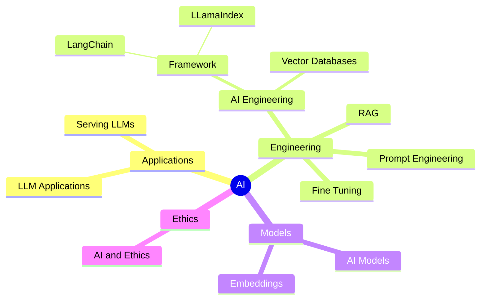

# My Digital Palace - A Personal Journal for Reflection

## Introduction

I created my Digital Palace as a public platform for self-expression, reflection, and sharing my memories. It is where I openly document my thoughts, experiences, milestones, creative works - my personal journey.

My Digital Palace allows me to write journal entries, upload multimedia, record audio, and categorize content by date and themes. The tools help me capture toughts to share publicly.

With my palace being public, anyone can read my entries, view my content, and leave comments to connect with me and others in my community. I enjoy fostering this open dialogue and discussion around my shared stories.

In summary, my Digital Palace provides an engaging platform for public self-expression, reflection, and sharing memories.

[Raphaël MANSUY](https://www.linkedin.com/in/raphaelmansuy/)
## Today I Learned (TIL)

The goal of a "Today I Learned" (TIL) journal is to document and reflect upon something new or interesting that you have learned on a given day.

It serves as a personal knowledge base where I can record and reflect on my daily learning experiences.

TIL journals are often used by programmers, developers, and other professionals to share tips, tricks, and lessons learned in their respective fields.

They can also be a valuable resource for others who are looking to learn and expand their knowledge in a specific domain.

👉 [Todays I Learned](/02-til/README.md)

##  Courses and lectures

- [AI Courses](07-courses/ai_courses.md)
- [Prompt engineering](07-courses/prompt_engineering.md)
- [System, Database, Operating System](07-courses/system_courses.md)

## Blog

👉  [Top Quality Blogs](08-blogs/blogs.md)

## Cloud Providers

👉 [Top Quality Cloud Providers](09-cloud-providers/cloud-providers.md)

## High Quality Datasets for Fine-Tuning

👉 [Top Quality Datasets](05-top-quality-dataset/top-quality-dataset.md)

## AI Engineering

### Articles

- [Demystifying Classifiers and Embeddings](./01-articles/embeddings/README.md)

- [Design and Architecture Patterns for LLM application](./01-articles/dessign_patterns_for_llm_applications/README.md)

- [Frameworks for building LLM applications](./01-articles/framework_for_llm_applications/README.md)

- [Bridging the Gap Between Thinking and Doing: FaR an Effective Prompting Framework inspired from Theory of Mind](./01-articles/far/README.md)
- [Beyond Prompt Engineering: Modular and Optimized LM Programs with DSPy](./01-articles/dspy/README.md)

## LLMs implementation

- [LLMs from scratch](https://github.com/rasbt/LLMs-from-scratch) Implementing a ChatGPT-like LLM from scratch, step by step by from [Sebastian Raschka](https://github.com/rasbt) 

## Embeddings

### Articles

- [What are embeddings and how do they work? A book from Vicki Boykis](https://vickiboykis.com/what_are_embeddings/)

  - [Github](https://github.com/veekaybee/what_are_embeddings)
  - [PDF](https://raw.githubusercontent.com/veekaybee/what_are_embeddings/main/embeddings.pdf)

- [Fine-tuning language models improves performance by enhancing existing mechanisms rather than creating new ones, as evidenced by consistent circuit functionality in entity tracking tasks](https://finetuning.baulab.info/)

- [Introduction to Matryoshka Embedding Models](https://huggingface.co/blog/matryoshka)

## LLM Applications

[What are the common use cases of LLM Applications ?](./01-articles/llm_applications_use_cases/README.md)

### Front End

[Bionic GPT]([https://github.com/bionic-gpt/bionic-gpt/blob/main/README.md) **BionicGPT is an on-premise replacement for ChatGPT, offering the advantages of Generative AI while maintaining strict data confidentiality** BionicGPT can run on your laptop or scale into the data center.

### Toolbox

- [LangChain](https://www.langchain.com/) Framework to construct LLMs application [documentation](https://python.langchain.com/docs/get_started/introduction) 🦜
- [LLamaIndex](https://www.llamaindex.ai/)Turn your enterprise data into production-ready LLM applications 🦙
- [HuggingFace](https://huggingface.co/) Model, Datasets, Inference Space, the GitHub of AI models. 🤗
	- [Hub](https://huggingface.co/docs/hub/index) Your starting point to HuggingFace
	- [cli](https://huggingface.co/docs/huggingface_hub/en/guides/cli) Command Line Interface (CLI)
- [instructor](https://jxnl.github.io/instructor/) Instructor makes it easy to reliably get structured data like JSON from Large Language Models (LLMs) like GPT-3.5, GPT-4, GPT-4-Vision, including open source models like Mistral/Mixtral from [Together](https://jxnl.github.io/instructor/hub/together/), [Anyscale](https://jxnl.github.io/instructor/hub/anyscale/), [Ollama](https://jxnl.github.io/instructor/hub/ollama/), and [llama-cpp-python](https://jxnl.github.io/instructor/hub/llama-cpp-python/).
- [instructor_ex](https://github.com/thmsmlr/instructor_ex) (Elixir version of Instructor)
- [marvin](https://www.askmarvin.ai/welcome/what_is_marvin/) Marvin is a lightweight AI toolkit for building natural language interfaces that are reliable, scalable, and easy to trust. 
- [Vercel AI SDK](https://vercel.com/blog/ai-sdk-3-generative-ui) (Stream React Components from LLMs to deliver richer user experiences)
- [AICI](https://github.com/microsoft/AICI) AICI: Prompts as (Wasm) Programs
- [Flowneum](https://github.com/floneum/floneum) A toolkit for controllable, private AI on consumer hardware in rust

## AI Command tools

- [llms](https://llm.datasette.io/en/stable/) A CLI utility and Python library for interacting with Large Language Models, both via remote APIs and models that can be installed and run on your own machine. By [Simon Willison](https://simonwillison.net/)
- [Open Interpreter](https://github.com/KillianLucas/open-interpreter/) A natural language interface for computers
- [whisper](https://github.com/openai/whisper) Whisper is a general-purpose speech recognition model. It is trained on a large dataset of diverse audio and is also a multitasking model that can perform multilingual speech recognition, speech translation, and language identification.
- [plock](https://github.com/jasonjmcghee/plock) From anywhere you can type, query and stream the output of an LLM or any other script
- [Screen shot to code](https://github.com/abi/screenshot-to-code) Drop in a screenshot and convert it to clean code (HTML/Tailwind/React/Vue)
- [Open Interpreter](https://github.com/KillianLucas/open-interpreter) A natural language interface for computers

## Mac App

- [Enchanted](https://github.com/AugustDev/enchanted) Enchanted is iOS and macOS app for chatting with private self hosted language models such as Llama2, Mistral or Vicuna using Ollama.

## Serving LLMS

### Tools

- [llamaC++](https://github.com/ggerganov/llama.cpp) LLM inference in C/C++
- [vLLM](https://github.com/vllm-project/vllm) Easy, fast, and cheap LLM serving for everyone, [documentation](https://docs.vllm.ai/en/latest/)
- [LLama Cpp Python Binding](https://llama-cpp-python.readthedocs.io/en/latest/) OpenAI compatible web server
- [SkyPilot](https://docs.vllm.ai/en/latest/) Run LLMs and AI on Any Cloud [documentation](https://skypilot.readthedocs.io/en/latest/)
- [Ollama](https://github.com/ollama/ollama) Go program that encapsulate [llamac++](https://github.com/ggerganov/llama.cpp). [documentation](https://ollama.com/)
- [fastassert](https://github.com/phospho-app/fastassert) Dockerized LLM inference server with constrained output (JSON mode), built on top of vLLM and outlines.
- [luminal](https://github.com/jafioti/luminal) Deep learning at the speed of light coded in Rust. The aim for 0.3 is to achieve SOTA performance on an M1 pro (50 tok/s), and near SOTA on single nvidia gpus (>100 tok/s)
- [LLamafile](https://github.com/Mozilla-Ocho/llamafile) Turning a LLM model into a Multiplatform executable
- [candle](https://github.com/huggingface/candle?tab=readme-ov-file) Minimalist ML framework for Rust. Run and Serve Models in Rust.
- [Mlx Server](https://www.mlxserver.com/) This Python library is the easist way to begin building on top of Apple's machine learning library MLX
- [AICI](https://github.com/microsoft/AICI) AICI: Prompts as (Wasm) Programs
- [List of tools that serves AI locally](https://github.com/janhq/awesome-local-ai) An awesome repository of local AI tools
- [Skypilot](https://skypilot.readthedocs.io/en/latest/#)SkyPilot is a framework for running LLMs, AI, and batch jobs on any cloud, offering maximum cost savings, highest GPU availability, and managed execution.

## Agents

- [MegaGPT](https://github.com/geekan/MetaGPT/tree/main)The Multi-Agent Framework: Given one line Requirement, return PRD, Design, Tasks, Repo
- [CrewAI](https://github.com/joaomdmoura/crewAI) Framework for orchestrating role-playing, autonomous AI agents. By fostering collaborative intelligence, CrewAI empowers agents to work together seamlessly, tackling complex tasks.

## Prompt Engineering

- [Summoning the Magic of Prompts: A Deep Dive into Prompt Engineering Patterns](./01-articles/prompt_engineering_patterns/README.md)
- [Claude Anthropic prompts Library](https://docs.anthropic.com/claude/page/prompts) Explore optimized prompts for a breadth of business and personal tasks

## Interesting projects

- [MLX Swift Examples](https://github.com/ml-explore/mlx-swift-examples/tree/main) Examples using MLX Swift

## Models

- [Gorilla OpenFunction](https://gorilla.cs.berkeley.edu/blogs/7_open_functions_v2.html)  🦍 Gorilla: Large Language Model Connected with Massive APIs
- [Models list](https://book.premai.io/state-of-open-source-ai/models/) Open Sources model list
- [NousResearch/Nous-Hermes-llama-2-7b](https://huggingface.co/NousResearch/Nous-Hermes-llama-2-7b/tree/main)

## LLM Leaderboard

- [Berkeley Function-Calling Leaderboard](https://gorilla.cs.berkeley.edu/leaderboard.html) LeaderBoard for function calling
- [OpenLLMs Leaderboard](https://huggingface.co/spaces/HuggingFaceH4/open_llm_leaderboard) 📐 The 🤗 Open LLM Leaderboard aims to track, rank and evaluate open LLMs and chatbots.
- [HumanEval Leaderboard](https://evalplus.github.io/leaderboard.html) # 🏆 EvalPlus Leaderboard 🏆 EvalPlus evaluates AI Coders with rigorous tests
-

## Synthetic data generation

### Tools

- [Bonito](https://github.com/BatsResearch/bonito) A lightweight library for generating synthetic instruction tuning datasets for your data without GPT.

## Fine tuning

### Tools

- [unsloth](https://github.com/unslothai/unsloth/tree/main#-documentation) 5X faster 60% less memory QLoRA finetuning
- [Documentation from Premai about Finetuning ](https://book.premai.io/state-of-open-source-ai/fine-tuning/)

## AI and Ethics

[How to document an AI/Machine Learning Model: Improving Transparency in AI through Model Cards](https://github.com/raphaelmansuy/model_card_template/blob/main/README.md)

## Development

### VSCode

- [Useful VSCode extensions](10-resources/vscode_extensions.md) 
- [Open source alternatives to popular products](https://openalternative.co/) Discover **Open Source Alternatives** to Popular Software
### UX Libraries

- [React Aria](https://react-spectrum.adobe.com/react-aria/index.html)
- [TaillwindCSS](https://tailwindcss.com/)
- [shadcn](https://ui.shadcn.com/)

## Useful tools

- [Shot Scraper](https://shot-scraper.datasette.io/en/stable/) A command-line utility for taking automated screenshots of websites from Simon Willison
- [ttok](https://github.com/simonw/ttok) Count and truncate text based on tokens from Simon  Willison
- [github2files](https://github.com/cognitivecomputations/github2file) Create a big files from a GitHub files

## Articles

[Arrticles list](01-articles/articles.md)

## LinkedIn Posts

[LinkedIn Posts](06-linkedin-posts/linkedin_posts.md)
## Medium publications

[Forget the Cloud ☁️ — A MacBook Pro with M1/M2 is the Only AI Brain You Need … 🧠](https://medium.com/p/168ac77d78ab)

---

