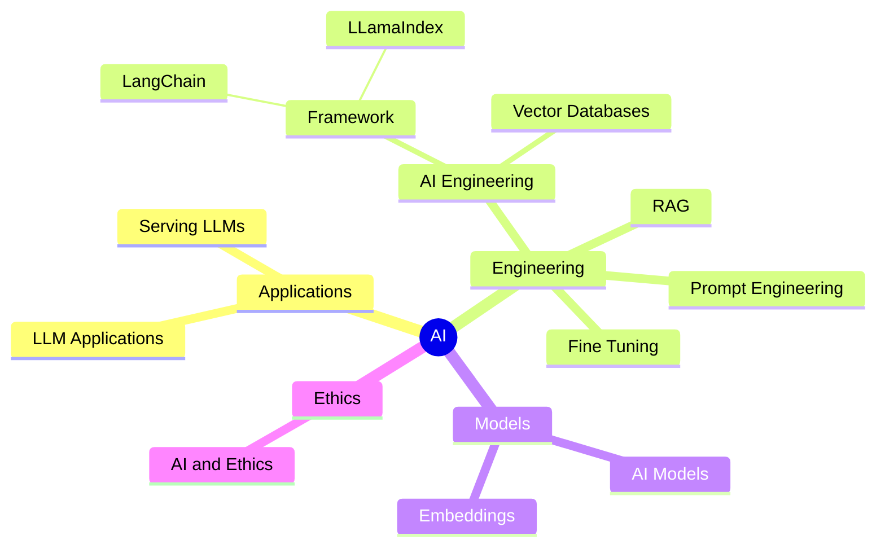

# My Digital Palace - A Personal Journal for Reflection

## Introduction

I created my Digital Palace as a public platform for self-expression, reflection, and sharing my memories. It is where I openly document my thoughts, experiences, milestones, creative works - my personal journey.

My Digital Palace allows me to write journal entries, upload multimedia, record audio, and categorize content by date and themes. The tools help me capture toughts to share publicly.

With my palace being public, anyone can read my entries, view my content, and leave comments to connect with me and others in my community. I enjoy fostering this open dialogue and discussion around my shared stories.

In summary, my Digital Palace provides an engaging platform for public self-expression, reflection, and sharing memories.

[Raphaël MANSUY](https://www.linkedin.com/in/raphaelmansuy/)

## Today I Learned (TIL)

The goal of a "Today I Learned" (TIL) journal is to document and reflect upon something new or interesting that you have learned on a given day.

It serves as a personal knowledge base where I can record and reflect on my daily learning experiences.

TIL journals are often used by programmers, developers, and other professionals to share tips, tricks, and lessons learned in their respective fields.

They can also be a valuable resource for others who are looking to learn and expand their knowledge in a specific domain.

👉 [Todays I Learned](/02-til/README.md)

## Tutorial Series: "For the Impatient"

The "For the Impatient" tutorial series is designed to provide a fast-paced and efficient way for learners to master programming languages and other technical subjects. The core idea behind this series is to cater to the needs of individuals who are eager to gain proficiency quickly, without getting bogged down in lengthy, comprehensive tutorials.

The typical learner in the "Impatient" target audience might be someone who:

- Has a strong motivation to learn a new skill quickly, perhaps for a time-sensitive project or job requirement
- Prefers a more streamlined, concise learning approach that focuses on the most essential concepts and practical applications
- Wants to get up and running with a new language or technology as rapidly as possible, without spending too much time on theoretical background or peripheral topics

👉 [The impatient series](40-the-impatients_serie/README.md)

# Mental models

 A mental model is a compression of how something works

[Mental models](60-mental-models/README.md)
## Generative AI

- [Generative AI Business Use Cases](01-articles/2024-03-12_genai_business_use_cases.md)
- [Comprehensive Guide to Large Language Model Engineering](11-genai/README.md.md)
  
##  Courses and lectures

- [AI Courses](07-courses/ai_courses.md)
- [Prompt engineering](07-courses/prompt_engineering.md)
- [System, Database, Operating System](07-courses/system_courses.md)
- [🤗 GenAI Cookbook](https://huggingface.co/learn/cookbook/index.md)
- [Generative AI for Beginners Microsoft](https://microsoft.github.io/generative-ai-for-beginners/#/)

## Blog

👉  [Top Quality Blogs](08-blogs/blogs.md)

## Cloud Providers

👉 [Top Quality Cloud Providers](09-cloud-providers/cloud-providers.md)

## High Quality Datasets for Fine-Tuning

👉 [Top Quality Datasets](05-top-quality-dataset/top-quality-dataset.md)

## AI Engineering

### Articles

- [Demystifying Classifiers and Embeddings](./01-articles/embeddings/README.md)

- [Design and Architecture Patterns for LLM application](./01-articles/dessign_patterns_for_llm_applications/README.md)

- [Frameworks for building LLM applications](./01-articles/framework_for_llm_applications/README.md)

- [Bridging the Gap Between Thinking and Doing: FaR an Effective Prompting Framework inspired from Theory of Mind](./01-articles/far/README.md)
- [Beyond Prompt Engineering: Modular and Optimized LM Programs with DSPy](./01-articles/dspy/README.md)
- [Mastering the Art of Training Large Language Models from Scratch](01-articles/2024-03-12_training_an_llm.md)

## LLMs implementation

- [LLMs from scratch](https://github.com/rasbt/LLMs-from-scratch) Implementing a ChatGPT-like LLM from scratch, step by step by from [Sebastian Raschka](https://github.com/rasbt) 

## Prompt Engineering

- [A list of prompt engineering techniques](https://aman.ai/primers/ai/prompt-engineering/) 
- [Mastering the art of prompt engineering in French](01-articles/2024-05-29_mastering_prompt_engineering_fr.md)
- [Mastering the art of prompt engineering](01-articles/2024-05-29_mastering-prompt-engineering_us.md)

## Embeddings

### Articles

- [What are embeddings and how do they work? A book from Vicki Boykis](https://vickiboykis.com/what_are_embeddings/)

  - [Github](https://github.com/veekaybee/what_are_embeddings)
  - [PDF](https://raw.githubusercontent.com/veekaybee/what_are_embeddings/main/embeddings.pdf)

- [Fine-tuning language models improves performance by enhancing existing mechanisms rather than creating new ones, as evidenced by consistent circuit functionality in entity tracking tasks](https://finetuning.baulab.info/)

- [Introduction to Matryoshka Embedding Models](https://huggingface.co/blog/matryoshka)
- [Binary Embeddings Cohere](https://txt.cohere.com/int8-binary-embeddings/)

## LLM Applications

[What are the common use cases of LLM Applications ?](./01-articles/llm_applications_use_cases/README.md)

- [ottogrid](https://ottogrid.ai/) 

### Front End

[Bionic GPT]([https://github.com/bionic-gpt/bionic-gpt/blob/main/README.md) **BionicGPT is an on-premise replacement for ChatGPT, offering the advantages of Generative AI while maintaining strict data confidentiality** BionicGPT can run on your laptop or scale into the data center.
[Lobe Chat](https://github.com/lobehub/lobe-chat) 🤯 Lobe Chat - an open-source, modern-design AI chat framework. Supports Multi AI Providers( OpenAI / Claude 3 / Gemini / Ollama / Azure / DeepSeek), Knowledge Base (file upload / knowledge management / RAG ), Multi-Modals (Vision/TTS) and plugin system. One-click FREE deployment of your private ChatGPT/ Claude application.

### Toolbox

- [Quantalogic](https://github.com/quantalogic/quantalogic) A powerful Agentic Framework
- [QLLM](https://github.com/quantalogic/qllm)  QLLM: A powerful CLI for seamless interaction with multiple Large Language Models. Simplify AI workflows, streamline development, and unlock the potential of cutting-edge language models. by [Quantalogic](https://www.quantalogi.app)
- [ell](https://docs.ell.so/index.html#) A language model programming framework.
- [LangChain](https://www.langchain.com/) Framework to construct LLMs application [documentation](https://python.langchain.com/docs/get_started/introduction) 🦜
- [LLamaIndex](https://www.llamaindex.ai/)Turn your enterprise data into production-ready LLM applications 🦙
- [HuggingFace](https://huggingface.co/) Model, Datasets, Inference Space, the GitHub of AI models. 🤗
	- [Hub](https://huggingface.co/docs/hub/index) Your starting point to HuggingFace
	- [cli](https://huggingface.co/docs/huggingface_hub/en/guides/cli) Command Line Interface (CLI)
- [instructor](https://jxnl.github.io/instructor/) Instructor makes it easy to reliably get structured data like JSON from Large Language Models (LLMs) like GPT-3.5, GPT-4, GPT-4-Vision, including open source models like Mistral/Mixtral from [Together](https://jxnl.github.io/instructor/hub/together/), [Anyscale](https://jxnl.github.io/instructor/hub/anyscale/), [Ollama](https://jxnl.github.io/instructor/hub/ollama/), and [llama-cpp-python](https://jxnl.github.io/instructor/hub/llama-cpp-python/).
- [instructor_ex](https://github.com/thmsmlr/instructor_ex) (Elixir version of Instructor)
- [marvin](https://www.askmarvin.ai/welcome/what_is_marvin/) Marvin is a lightweight AI toolkit for building natural language interfaces that are reliable, scalable, and easy to trust. 
- [Vercel AI SDK](https://vercel.com/blog/ai-sdk-3-generative-ui) (Stream React Components from LLMs to deliver richer user experiences)
- [easyllm](https://philschmid.github.io/easyllm/) EasyLLM is an open source project that provides helpful tools and methods for working with large language models (LLMs), both open source and closed source.

- [Flowneum](https://github.com/floneum/floneum) A toolkit for controllable, private AI on consumer hardware in rust
- [Kalosm](https://floneum.com/kalosm/) Kalosm is an open source framework for private language, audio, and image models in Rust
- [PhiData](https://docs.phidata.com/introduction) Phidata is a toolkit for building AI Assistants using function calling.
- [Microsoft AutoDev](https://github.com/unit-mesh/auto-dev) 🧙‍AutoDev: The AI-powered coding wizard with multilingual support
- [Cognee](https://github.com/topoteretes/cognee?tab=readme-ov-file) Memory management for the AI Applications and AI Agents
- [MelloTTS](https://github.com/myshell-ai/MeloTTS) High-quality multi-lingual text-to-speech library by MyShell.ai. Support English, Spanish, French, Chinese, Japanese and Korean.
- [MemGPT](https://memgpt.ai/) Enable Next-Gen Large Language Model Applications
- [lumentis](https://github.com/hrishioa/lumentis) Generate beautiful docs from your transcripts and unstructured information with a single command.
- [Wantdb/OpenUI](https://github.com/wandb/openui) OpenUI let's you describe UI using your imagination, then see it rendered live.
- [FireCrawl](https://github.com/mendableai/firecrawl) Turn entire websites into LLM-ready markdown
- [Sammo](https://github.com/microsoft/sammo) A library for prompt engineering and optimization (SAMMO = Structure-aware Multi-Objective Metaprompt Optimization)

## AI Assisted coding

- [Plandex](https://github.com/plandex-ai/plandex) An AI coding engine for complex tasks
- [Aider][https://github.com/paul-gauthier/aider] aider is AI pair programming in your terminal
- [Quantalogic](http)

## RAG

- [RagFlow](https://github.com/infiniflow/ragflow?tab=readme-ov-file) RAGFlow is an open-source RAG (Retrieval-Augmented Generation) engine based on deep document understanding.
- [RAG Techniques](https://github.com/NirDiamant/RAG_Techniques) This repository showcases various advanced techniques for Retrieval-Augmented Generation (RAG) systems. RAG systems combine information retrieval with generative models to provide accurate and contextually rich responses. 
- [byaldi](https://github.com/AnswerDotAI/byaldi) Use late-interaction multi-modal models such as ColPali in just a few lines of code.

## Knowledge Graph

-[MindGraph](https://github.com/yoheinakajima/MindGraph) proof of concept prototype for generating and querying against an ever-expanding knowledge graph with ai

## Controlling Inference

- [Transformer Head](https://github.com/center-for-humans-and-machines/transformer-heads) Toolkit for attaching, training, saving and loading of new heads for transformer models
- [AICI](https://github.com/microsoft/AICI) AICI: Prompts as (Wasm) Programs. Controlling inference using Wasm programs.

## Quantization

- [Aimet](https://github.com/quic/aimet) AIMET is a library that provides advanced quantization and compression techniques for trained neural network models from Qualcomm Innovation Center.
- [hqq](https://github.com/mobiusml/hqq) Official implementation of Half-Quadratic Quantization (HQQ). **HQQ** is a fast and accurate model quantizer that skips the need for calibration data. It's super simple to implement (just a few lines of code for the optimizer). It can crunch through quantizing the Llama2-70B model in only 4 minutes! 🚀

## Training Models

- [OLMo](https://github.com/allenai/OLMo) Modeling, training, eval, and inference code for [OLMo](https://allenai.org/olmo)

## AI Command tools

- [llms](https://llm.datasette.io/en/stable/) A CLI utility and Python library for interacting with Large Language Models, both via remote APIs and models that can be installed and run on your own machine. By [Simon Willison](https://simonwillison.net/)
- [Open Interpreter](https://github.com/KillianLucas/open-interpreter/) A natural language interface for computers
- [Documentation Open Interpreter](https://docs.openinterpreter.com/getting-started/introduction) A new way to use computers
- [whisper](https://github.com/openai/whisper) Whisper is a general-purpose speech recognition model. It is trained on a large dataset of diverse audio and is also a multitasking model that can perform multilingual speech recognition, speech translation, and language identification.
- [plock](https://github.com/jasonjmcghee/plock) From anywhere you can type, query and stream the output of an LLM or any other script
- [Screen shot to code](https://github.com/abi/screenshot-to-code) Drop in a screenshot and convert it to clean code (HTML/Tailwind/React/Vue)
- [Code2prompt](https://github.com/raphaelmansuy/code2prompt) Convert a codebase to an AI prompt 
- [Claude Engineer](https://github.com/Doriandarko/claude-engineer) Claude Engineer is an interactive command-line interface (CLI) that leverages the power of Anthropic's Claude-3.5-Sonnet model to assist with software development tasks. This tool combines the capabilities of a large language model with practical file system operations and web search functionality.
- [Quantalogic]()

## Controlling the generation of LLMs during decoding

- [Guidance](https://github.com/guidance-ai/guidance) A guidance language for controlling large language models.
- [AICI](https://github.com/microsoft/AICI) AICI: Prompts as (Wasm) Programs
- [Representation Ingeneering](https://vgel.me/posts/representation-engineering/) Representation Engineering Mistral-7B an Acid Trip 💊

## Voice

- [VoiceCraft](https://github.com/jasonppy/VoiceCraft)  Zero-Shot Speech Editing and Text-to-Speech in the Wild
- [Kokoro-82M](https://huggingface.co/hexgrad/Kokoro-82M) **Kokoro** is a frontier TTS model for its size of **82 million parameters** (text in/audio out).

## Mac App

- [Enchanted](https://github.com/AugustDev/enchanted) Enchanted is iOS and macOS app for chatting with private self hosted language models such as Llama2, Mistral or Vicuna using Ollama.
- [BoltAI](https://boltai.com/docs) BoltAI is a beautiful and powerful AI chat app for Mac. It integrates ChatGPT and other large language models (LLMs) deeply into your workflows so you don’t have to go back and forth with the ChatGPT web UI.

## Serving LLMS

### Tools

- [llamaC++](https://github.com/ggerganov/llama.cpp) LLM inference in C/C++
- [vLLM](https://github.com/vllm-project/vllm) Easy, fast, and cheap LLM serving for everyone, [documentation](https://docs.vllm.ai/en/latest/)
- [nm-vllm](https://github.com/neuralmagic/nm-vllm) A high-throughput and memory-efficient inference and serving engine for LLMs (sparse compressing)
- [LLama Cpp Python Binding](https://llama-cpp-python.readthedocs.io/en/latest/) OpenAI compatible web server
- [SkyPilot](https://docs.vllm.ai/en/latest/) Run LLMs and AI on Any Cloud [documentation](https://skypilot.readthedocs.io/en/latest/)
- [Ollama](https://github.com/ollama/ollama) Go program that encapsulate [llamac++](https://github.com/ggerganov/llama.cpp). [documentation](https://ollama.com/)
- [fastassert](https://github.com/phospho-app/fastassert) Dockerized LLM inference server with constrained output (JSON mode), built on top of vLLM and outlines.
- [luminal](https://github.com/jafioti/luminal) Deep learning at the speed of light coded in Rust. The aim for 0.3 is to achieve SOTA performance on an M1 pro (50 tok/s), and near SOTA on single nvidia gpus (>100 tok/s)
- [LLamafile](https://github.com/Mozilla-Ocho/llamafile) Turning a LLM model into a Multiplatform executable
- [candle](https://github.com/huggingface/candle?tab=readme-ov-file) Minimalist ML framework for Rust. Run and Serve Models in Rust.
- [Mlx Server](https://www.mlxserver.com/) This Python library is the easist way to begin building on top of Apple's machine learning library MLX
- [AICI](https://github.com/microsoft/AICI) AICI: Prompts as (Wasm) Programs
- [List of tools that serves AI locally](https://github.com/janhq/awesome-local-ai) An awesome repository of local AI tools
- [Skypilot](https://skypilot.readthedocs.io/en/latest/#)SkyPilot is a framework for running LLMs, AI, and batch jobs on any cloud, offering maximum cost savings, highest GPU availability, and managed execution.
- [Jan](https://github.com/janhq/jan) Jan is an open source alternative to ChatGPT that runs 100% offline on your computer
- [LoraX](https://github.com/predibase/lorax) Multi-LoRA inference server that scales to 1000s of fine-tuned LLMs ([Documentation](https://loraexchange.ai/))
- [Candle](https://github.com/huggingface/candle) Minimalist ML framework for Rust from HuggingFace to run models in production.
- [ZML](https://github.com/zml/zml) High performance AI inference stack. Built for production. [@ziglang](https://github.com/ziglang) / [@openxla](https://github.com/openxla) / MLIR / [@bazelbuild](https://github.com/bazelbuild)
- [MLX Omni Server](https://github.com/madroidmaq/mlx-omni-server) MLX Omni Server is a local inference server powered by Apple's MLX framework, specifically designed for Apple Silicon (M-series) chips. It implements OpenAI-compatible API endpoints, enabling seamless integration with existing OpenAI SDK clients while leveraging the power of local ML inference.

## Agents

- [Quantalogic](https://github.com/quantalogic/quantalogic) A powerful Agentic framework that can code.
- [Eliza](https://github.com/elizaOS/eliza) Autonomous agents for everyone.
- [Pydantic Agents](https://ai.pydantic.dev/agents/) PydanticAI is a Python agent framework designed to make it less painful to build production grade applications with Generative AI.
- [Smoll Agents](https://github.com/huggingface/smolagents) 🤗 smolagents: a barebones library for agents. Agents write python code to call tools and orchestrate other agents from Hugging Face.
- [MegaGPT](https://github.com/geekan/MetaGPT/tree/main)The Multi-Agent Framework: Given one line Requirement, return PRD, Design, Tasks, Repo
- [CrewAI](https://github.com/joaomdmoura/crewAI) Framework for orchestrating role-playing, autonomous AI agents. By fostering collaborative intelligence, CrewAI empowers agents to work together seamlessly, tackling complex tasks.
-  [Devika](https://github.com/stitionai/devika) Devika is an Agentic AI Software Engineer that can understand high-level human instructions, break them down into steps, research relevant information, and write code to achieve the given objective. Devika aims to be a competitive open-source alternative to Devin by Cognition AI.
-  [AgentStudio](https://skyworkai.github.io/agent-studio/) AgentStudio is an open toolkit covering the entire lifespan of building virtual agents that can interact with everything on digital worlds
- [AIOS](https://github.com/agiresearch/AIOS/tree/main) AIOS: LLM Agent Operating System
- [AutoGen](https://microsoft.github.io/autogen/) Enable Next-Gen Large Language Model Applications
- [Screen Agents](https://github.com/niuzaisheng/ScreenAgent) ScreenAgent: A Computer Control Agent Driven by Visual Language Large Model
- [Synapse](https://ltzheng.github.io/Synapse/) Synapse: Trajectory-as-Exemplar Prompting  with Memory for Computer Control
- [Cradles](https://baai-agents.github.io/Cradle/) Towards General Computer Control:  A Multimodal Agent for  Red Dead Redemption II as a Case Study
- [kwaiagents](https://github.com/kwaikeg/kwaiagents) A generalized information-seeking agent system with Large Language Models (LLMs).
- [LLocalSearch](https://github.com/nilsherzig/LLocalSearch) LLocalSearch is a completely locally running search aggregator using LLM Agents. The user can ask a question and the system will use a chain of LLMs to find the answer. The user can see the progress of the agents and the final answer. No OpenAI or Google API keys are needed.
- [SWE Agents](https://github.com/princeton-nlp/SWE-agent) SWE-agent: Agent Computer Interfaces Enable Software Engineering Language Models
- [Presentation of Agentic Models from Angrew NG](00-assets/ng_agentic_reasoning.pdf)
- [Zep Long term memory for Agent](https://github.com/getzep/zep) Zep: Long-Term Memory for ‍AI Assistants.
- [OpenSSA](https://github.com/aitomatic/openssa) OpenSSA: Small Specialist Agents—Enabling Efficient, Domain-Specific Planning + Reasoning for AI
- [Cognitive Architectures for Language Agents](https://arxiv.org/pdf/2309.02427)
- [🔮 Awesome AI Agents](https://github.com/e2b-dev/awesome-ai-agents)
- [Wikipedia Cognitive Architecture](https://en.wikipedia.org/wiki/Cognitive_architecture)
- [Baseline AI Agentic Architecture](https://techcommunity.microsoft.com/blog/machinelearningblog/baseline-agentic-ai-systems-architecture/4207137)
- [Agentic Mesh Towards Entreprise Grade Agents](https://medium.com/towards-data-science/agentic-mesh-towards-enterprise-grade-agents-18e8de184af1) Agentic Mesh Agents 
- [Advanced Large Language Model Agents](https://llmagents-learning.org/sp25) Course Berkeley
	

## Prompt Engineering

- [Summoning the Magic of Prompts: A Deep Dive into Prompt Engineering Patterns](./01-articles/prompt_engineering_patterns/README.md)
- [Claude Anthropic prompts Library](https://docs.anthropic.com/claude/page/prompts) Explore optimized prompts for a breadth of business and personal tasks
- [Navigating the Prompt Engineering Landscape: A Comprehensive Survey for NLP Practitioners](https://arxiv.org/pdf/2407.12994)

## Interesting projects

- [MLX Swift Examples](https://github.com/ml-explore/mlx-swift-examples/tree/main) Examples using MLX Swift

## Models

- [Gorilla OpenFunction](https://gorilla.cs.berkeley.edu/blogs/7_open_functions_v2.html)  🦍 Gorilla: Large Language Model Connected with Massive APIs
- [Models list](https://book.premai.io/state-of-open-source-ai/models/) Open Sources model list
- [NousResearch/Nous-Hermes-llama-2-7b](https://huggingface.co/NousResearch/Nous-Hermes-llama-2-7b/tree/main)
- [Ollama version of Nous-Hermes2Pro][https://ollama.com/adrienbrault/nous-hermes2pro]
- [LLavaNext](https://huggingface.co/spaces/merve/llava-next) LLaVA-NeXT is recently merged to transformers and it outperforms many of the proprietary models like Gemini on various benchmarks!  
- [Startling LM 7B Beta](https://huggingface.co/Nexusflow/Starling-LM-7B-beta) The best 7B Models - **Finetuned from model:** [Openchat-3.5-0106](https://huggingface.co/openchat/openchat-3.5-0106) (based on [Mistral-7B-v0.1](https://huggingface.co/mistralai/Mistral-7B-v0.1)) - From Berkeley https://starling.cs.berkeley.edu/ 

## Vector Database

- [pgvectorscale](https://github.com/timescale/pgvectorscale/) A complement to pgvector for high performance, cost efficient vector search on large workloads.

## LLM Leaderboard

- [Berkeley Function-Calling Leaderboard](https://gorilla.cs.berkeley.edu/leaderboard.html) LeaderBoard for function calling
- [OpenLLMs Leaderboard](https://huggingface.co/spaces/HuggingFaceH4/open_llm_leaderboard) 📐 The 🤗 Open LLM Leaderboard aims to track, rank and evaluate open LLMs and chatbots.
- [HumanEval Leaderboard](https://evalplus.github.io/leaderboard.html) # 🏆 EvalPlus Leaderboard 🏆 EvalPlus evaluates AI Coders with rigorous tests

## Control generation

- [instructor](https://github.com/jxnl/instructor) structured outputs for llms
- [fructose](https://github.com/bananaml/fructose) LLM calls as strongly-typed functions

## Synthetic data generation

### Tools

- [Bonito](https://github.com/BatsResearch/bonito) A lightweight library for generating synthetic instruction tuning datasets for your data without GPT.

## Fine tuning

### Tools

- [unsloth](https://github.com/unslothai/unsloth/tree/main#-documentation) 5X faster 60% less memory QLoRA finetuning
- [Documentation from Premai about Finetuning ](https://book.premai.io/state-of-open-source-ai/fine-tuning/)
- [LLama-Factory](https://github.com/hiyouga/LLaMA-Factory) Unify Efficient Fine-tuning of 100+ LLMs
- [peft](https://github.com/huggingface/peft) 🤗 PEFT: State-of-the-art Parameter-Efficient Fine-Tuning.
- [Tochtune](https://github.com/pytorch/torchtune) A Native-PyTorch Library for LLM Fine-tuning
- [LLMTuner](https://github.com/promptslab/LLMTuner) Tune LLM in few lines of code
- [LMFlow](https://github.com/OptimalScale/LMFlow) An Extensible Toolkit for Finetuning and Inference of Large Foundation Models. Large Models for All. (Include Lisa Finetuning)
- [# Efficient finetuning of Llama 3 with FSDP QDoRA](https://www.answer.ai/posts/2024-04-26-fsdp-qdora-llama3.html) A blog article that explains how to use the stat of the art QDoRA fine tuning method on LLAMA3

## Computing

[Lighting thunder](https://github.com/Lightning-AI/lightning-thunder) Source to source compiler for PyTorch. It makes PyTorch programs faster on single accelerators and distributed.

## AI and Ethics

[How to document an AI/Machine Learning Model: Improving Transparency in AI through Model Cards](https://github.com/raphaelmansuy/model_card_template/blob/main/README.md)

## AI Devices

- [Friend](https://github.com/BasedHardware/friend) AI wearable with 24h+ battery
- [Whomane](https://github.com/BasedHardware/Whomane) An open source wearable with camera

## Development

### VSCode

- [Useful VSCode extensions](10-resources/01%20_vscode_extensions.md) 
- [Open source alternatives to popular products](https://openalternative.co/) Discover **Open Source Alternatives** to Popular Software
### UX Libraries

- [React Aria](https://react-spectrum.adobe.com/react-aria/index.html)
- [TaillwindCSS](https://tailwindcss.com/)
- [shadcn](https://ui.shadcn.com/)

## Data Engineering

- [Fluvio](https://github.com/infinyon/fluvio) Lean and mean distributed stream processing system written in rust and web assembly. Alternative to Kafka + Flink in one.
- [Unstract](https://github.com/Zipstack/unstract) No-code LLM Platform to launch APIs and ETL Pipelines to structure unstructured documents
## Useful tools

- [Shot Scraper](https://shot-scraper.datasette.io/en/stable/) A command-line utility for taking automated screenshots of websites from Simon Willison
- [ttok](https://github.com/simonw/ttok) Count and truncate text based on tokens from Simon  Willison
- [github2files](https://github.com/cognitivecomputations/github2file) Create a big files from a GitHub files
- [terminalizer](https://github.com/faressoft/terminalizer/) Create an animated gif from recorded terminal session.
- [Kamal](https://kamal-deploy.org/) # Deploy web apps anywher - From bare metal to cloud VMs.
- [Bruno](https://www.usebruno.com/) Bruno is a Git-integrated, fully offline, and open-source API client

## Starter ki

- [AI Video Starter Kit](ub.com/fal-ai-community/video-starter-kit)

## Articles

[Arrticles list](01-articles/README.md)

## LinkedIn Posts

[LinkedIn Posts](06-linkedin-posts/linkedin_posts.md)
## Medium publications

[Forget the Cloud ☁️ — A MacBook Pro with M1/M2 is the Only AI Brain You Need … 🧠](https://medium.com/p/168ac77d78ab)

---

