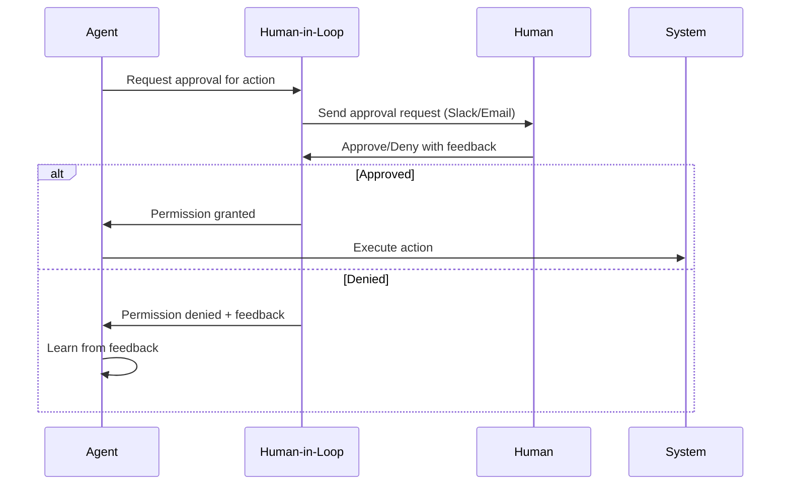

# 🤝 Human-in-the-Loop AI

**Human-in-the-Loop (HITL) AI** systems combine artificial intelligence automation with strategic human oversight, enabling AI agents to perform high-stakes tasks while maintaining human control over critical decisions.

## 🎯 Core Principles

### **Strategic Human Involvement**

- **Approval Workflows**: Human authorization for high-risk operations
- **Escalation Patterns**: Automatic handoff to humans for complex scenarios  
- **Feedback Integration**: Human corrections improve AI performance over time
- **Override Capabilities**: Humans can intervene at any point in the process

### **Trust Through Transparency**

- **Decision Rationale**: AI explains its reasoning before acting
- **Confidence Levels**: Systems indicate certainty about proposed actions
- **Audit Trails**: Complete logging of AI decisions and human interventions
- **Learning Feedback**: Transparent adaptation based on human guidance

## 🛠️ Implementation Patterns

### **Approval-First Workflows**

```python
from humanlayer import HumanLayer

hl = HumanLayer(api_key="your-key")

@hl.require_approval()
def deploy_to_production(environment, version):
    """Deploy requires human approval for safety"""
    return deploy_service(environment, version)

@hl.require_approval(approvers=["devops-team"])  
def scale_infrastructure(instances, cost_estimate):
    """Scale operations with team approval"""
    return provision_resources(instances)
```

### **Confidence-Based Escalation**

```python
def process_customer_query(query, context):
    response = ai_agent.generate_response(query, context)
    
    if response.confidence < 0.7:
        # Low confidence → human review
        return hl.human_as_tool(
            query=f"Customer query: {query}",
            context=context,
            suggested_response=response.content
        )
    
    # High confidence → automatic response
    return response.content
```

### **Human-AI Collaboration**

```python
def collaborative_document_review(document):
    # AI performs initial analysis
    ai_feedback = ai_analyzer.review(document)
    
    # Human reviews AI suggestions
    human_decisions = hl.human_as_tool(
        task="Review AI suggestions for document",
        ai_analysis=ai_feedback,
        instructions="Accept, modify, or reject each suggestion"
    )
    
    # Apply approved changes
    return apply_approved_changes(document, human_decisions)
```

## 🏭 Production Use Cases

### **DevOps & Infrastructure**

- **Deployment Approvals**: Human authorization for production releases
- **Resource Scaling**: Human oversight for cost-impacting infrastructure changes
- **Security Responses**: Human validation of automated security actions
- **Database Operations**: Human approval for schema changes and data migrations

### **Customer Service**

- **Escalation Management**: AI handles routine queries, humans take complex issues
- **Response Validation**: Human review of AI responses before sending
- **Policy Decisions**: Human oversight for edge cases requiring judgment
- **Sensitive Communications**: Human approval for communications about billing, refunds

### **Content & Marketing**

- **Brand Voice Compliance**: Human approval ensures content matches brand guidelines
- **Legal Review**: Human validation of claims and compliance statements
- **Sensitive Topics**: Human oversight for potentially controversial content
- **Customer Communications**: Human approval for important announcements

### **Financial Operations**

- **Transaction Approvals**: Human authorization for large financial transactions
- **Risk Assessment**: Human validation of AI risk calculations
- **Compliance Decisions**: Human oversight for regulatory compliance actions
- **Audit Responses**: Human review of automated compliance reports

## 🏗️ Architecture Patterns

### **Asynchronous Approval Workflows**



### **Multi-Channel Human Interface**

- **Slack Integration**: Approval requests in team channels
- **Email Notifications**: Detailed approval context via email
- **Web Dashboard**: Centralized approval management interface
- **Mobile Apps**: Quick approvals for time-sensitive decisions
- **SMS/Discord**: Additional notification channels

### **Approval Orchestration**

```python
# Multiple approval requirements
@hl.require_approval(
    approvers=["security-team", "devops-lead"],
    escalation_timeout="30m",
    majority_required=True
)
def emergency_security_response(threat_data):
    """Critical security actions need multiple approvals"""
    return implement_security_measures(threat_data)

# Conditional approval based on context
@hl.require_approval_if(
    condition=lambda amount: amount > 10000,
    approvers=["finance-manager"]
)
def process_payment(amount, recipient):
    """Large payments require finance approval"""
    return execute_payment(amount, recipient)
```

## 🎯 Best Practices

### **Design Principles**

- **Minimize Friction**: Make approval processes as smooth as possible
- **Context-Rich**: Provide humans with all necessary decision context
- **Time-Sensitive**: Set appropriate timeouts for different approval types
- **Learning-Enabled**: Use human feedback to improve AI decision-making
- **Transparent**: Clear audit trails for all human-AI interactions

### **Approval Granularity**

- **Function-Level**: Approval required for specific AI actions
- **Risk-Based**: Approval thresholds based on potential impact
- **Time-Based**: Different approval requirements for different times
- **Context-Aware**: Approval rules that adapt to situational factors

### **Human Experience Optimization**

- **Rich Context**: Provide all information needed for quick decisions
- **Smart Defaults**: Pre-filled responses based on historical patterns
- **Batch Processing**: Group related approvals for efficiency
- **Mobile-First**: Optimize for mobile approval workflows

## 🔧 Tools & Platforms

### **HITL Platforms**

- **[HumanLayer](https://humanlayer.dev/)** - Production-ready human-in-the-loop API and SDK
- **[Label Studio](https://labelstud.io/)** - Data labeling and annotation platform
- **[Scale AI](https://scale.com/)** - Human-in-the-loop for ML training and evaluation
- **[Weights & Biases](https://wandb.ai/)** - ML experiment tracking with human feedback

### **Framework Integration**

- **LangChain**: Human-in-the-loop callbacks and approval nodes
- **CrewAI**: Human oversight for multi-agent workflows  
- **AutoGen**: Human proxy agents for collaborative AI systems
- **Custom APIs**: Direct integration with approval workflow services
- **Eigent**: Multi-agent workforce platform with built-in human-in-the-loop support, MCP integration, and enterprise features. [Learn more](./eigent.md)

### **Communication Channels**

- **Slack Apps**: Native bot integrations for team channels
- **Microsoft Teams**: Workflow automation with approval cards
- **Discord Bots**: Community-focused approval workflows
- **Email Systems**: Enterprise email integration for approvals
- **Mobile SDKs**: Native mobile app approval interfaces

## 📊 Success Metrics

### **Operational Metrics**

- **Approval Response Time**: Speed of human decision-making
- **Approval Rate**: Percentage of AI requests approved
- **False Positive Rate**: AI requests that shouldn't need approval
- **False Negative Rate**: Risky actions that should have required approval

### **Quality Metrics**

- **Decision Accuracy**: Quality of human approval decisions
- **Learning Efficiency**: How quickly AI improves from human feedback
- **Context Completeness**: Adequacy of information provided to humans
- **User Satisfaction**: Human approver experience and satisfaction

### **Business Impact**

- **Risk Reduction**: Prevented incidents through human oversight
- **Efficiency Gains**: Automation benefits while maintaining safety
- **Cost Optimization**: Balance between automation and human intervention
- **Compliance Achievement**: Meeting regulatory requirements through human oversight

## 🚨 Common Pitfalls

### **Over-Engineering Approval Flows**

- **Problem**: Too many approval steps slow down operations
- **Solution**: Start with minimal viable approval processes, iterate based on real usage

### **Context Poverty**

- **Problem**: Humans lack sufficient information to make good decisions
- **Solution**: Provide rich context, relevant history, and clear action descriptions

### **Approval Fatigue**

- **Problem**: Too many low-stakes approval requests burn out human reviewers
- **Solution**: Tune approval thresholds, batch similar requests, use confidence-based escalation

### **Feedback Loop Neglect**

- **Problem**: Human decisions don't improve AI performance over time
- **Solution**: Systematically collect and integrate human feedback into AI training

## 🔗 Related Concepts

- **[AI Agents](./ai-agents.md)** - Autonomous systems that benefit from human oversight
- **[12-Factor Agents](../guides/agent-development/12-factor-agents.md)** - Production patterns including human-in-the-loop
- **[Agent Protocols](./agent-protocols.md)** - Communication standards for human-AI interaction
- **[AI Safety & Ethics](./ai-safety-ethics.md)** - Responsible AI deployment practices
- **[Workflow Automation](./workflow-automation.md)** - Business process automation with human checkpoints
- **[Observability](./observability.md)** - Monitoring human-AI collaborative systems

## 📚 Learning Path

1. **Foundations**: Understand AI safety and risk management principles
2. **Patterns**: Study approval workflow patterns and escalation strategies  
3. **Implementation**: Practice with HumanLayer or similar platforms
4. **Integration**: Connect HITL systems with existing AI agents and workflows
5. **Optimization**: Tune approval thresholds and feedback collection
6. **Advanced**: Design multi-stakeholder approval orchestration

[Back to Concepts Hub](./README.md)
