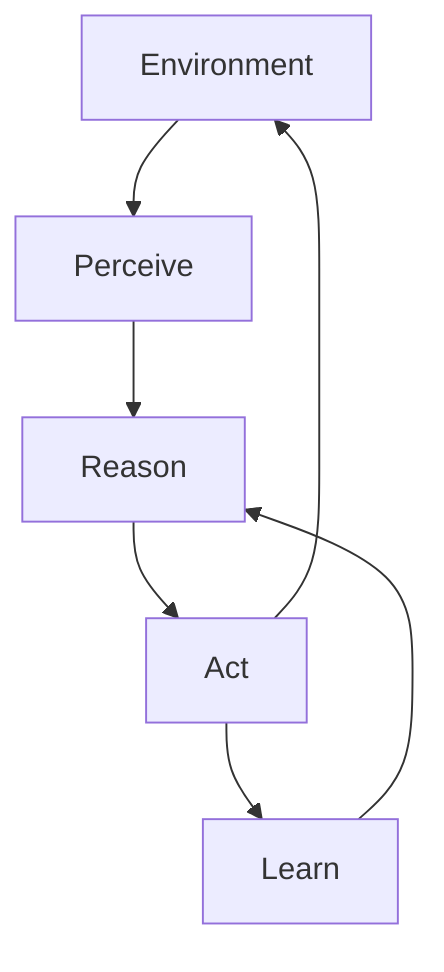

# AI Agents Guide - Autonomous AI Systems

> Build AI agents that can perform complex tasks autonomously with minimal human supervision

## 🎯 What You'll Achieve

By the end of this guide, you'll have:
- Built your first autonomous AI agent
- Understanding of agent architecture patterns
- Knowledge of multi-agent collaboration
- Production-ready agent deployment skills

**Difficulty**: 🔴 Advanced | **Time**: 8-16 hours | **Prerequisites**: Experience with LLMs and Python

---

## 🧠 Understanding AI Agents

### What are AI Agents?

AI agents are autonomous systems that can:
- **Perceive** their environment through sensors/APIs
- **Reason** about situations and make decisions
- **Act** to achieve goals through tools/functions
- **Learn** from experience to improve performance

### Key Characteristics



**Autonomy**: Operates independently without constant human input
**Reactivity**: Responds to environmental changes
**Proactivity**: Takes initiative to achieve goals
**Social Ability**: Interacts with other agents and humans

---

## 🏗️ Agent Architecture Patterns

### 1. ReAct Pattern (Reasoning + Acting)

**When to use**: General-purpose agents that need to think through problems

```python
# Example: ReAct Agent with LangChain
from langchain.agents import create_react_agent
from langchain.tools import Tool

def create_research_agent():
    tools = [
        Tool(
            name="search",
            func=search_web,
            description="Search for information online"
        ),
        Tool(
            name="calculator",
            func=calculate,
            description="Perform mathematical calculations"
        )
    ]
    
    agent = create_react_agent(
        llm=your_llm,
        tools=tools,
        prompt=react_prompt_template
    )
    return agent
```

### 2. Planning-Based Agents

**When to use**: Complex, multi-step tasks requiring strategic thinking

```python
# Example with Quantalogic
from quantalogic import Agent, PlanningStrategy

agent = Agent(
    name="project_manager",
    strategy=PlanningStrategy(),
    tools=["file_manager", "code_executor", "web_search"],
    max_iterations=10
)

result = agent.execute("Create a web scraper for news articles")
```

### 3. Memory-Enhanced Agents

**When to use**: Long-running agents that need to remember past interactions

```python
# Example with MemGPT
from memgpt import Agent, MemoryManager

agent = Agent(
    llm="gpt-4",
    memory=MemoryManager(
        core_memory_size=1000,
        archival_memory_enabled=True
    )
)

# Agent remembers across sessions
response = agent.step("What did we discuss yesterday about the project?")
```

---

## 🛠️ Essential Tools & Frameworks

### Production-Ready Frameworks

| Framework | Best For | Difficulty | Features |
|-----------|----------|------------|-----------|
| [Quantalogic](https://github.com/quantalogic/quantalogic) | Complex multi-step tasks | 🔴 Advanced | Planning, coding, web search |
| [CrewAI](https://github.com/joaomdmoura/crewAI) | Multi-agent collaboration | 🟡 Intermediate | Role-based agents, workflows |
| [Pydantic AI](https://ai.pydantic.dev/agents/) | Type-safe agents | 🟡 Intermediate | Validation, structured output |
| [AutoGen](https://microsoft.github.io/autogen/) | Conversational agents | 🟡 Intermediate | Multi-agent conversations |

### Specialized Tools

**Memory & Context:**
- [MemGPT](https://memgpt.ai/) - Long-term memory management
- [Zep](https://github.com/getzep/zep) - Memory for assistants
- [Cognee](https://github.com/topoteretes/cognee) - AI application memory

**Computer Control:**
- [Screen Agents](https://github.com/niuzaisheng/ScreenAgent) - Visual computer control
- [SWE Agent](https://github.com/princeton-nlp/SWE-agent) - Software engineering agent
- [Open Interpreter](https://github.com/KillianLucas/open-interpreter/) - Natural language computer interface

---

## 🚀 Building Your First Agent

### Step 1: Simple Function-Calling Agent

Start with a basic agent that can use tools:

```python
import openai
from typing import List, Dict, Any

class SimpleAgent:
    def __init__(self, llm_client, tools: List[Dict]):
        self.client = llm_client
        self.tools = {tool['name']: tool['function'] for tool in tools}
        self.conversation_history = []
    
    def execute(self, task: str) -> str:
        """Execute a task using available tools"""
        
        # Add task to conversation
        self.conversation_history.append({
            "role": "user", 
            "content": task
        })
        
        while True:
            # Get LLM response with function calling
            response = self.client.chat.completions.create(
                model="gpt-4",
                messages=self.conversation_history,
                tools=[self._format_tool(name, func) for name, func in self.tools.items()],
                tool_choice="auto"
            )
            
            message = response.choices[0].message
            self.conversation_history.append(message)
            
            # Check if LLM wants to call a function
            if message.tool_calls:
                for tool_call in message.tool_calls:
                    result = self._execute_tool(tool_call)
                    self.conversation_history.append({
                        "role": "tool",
                        "content": str(result),
                        "tool_call_id": tool_call.id
                    })
            else:
                # Task complete
                return message.content
    
    def _execute_tool(self, tool_call) -> Any:
        """Execute a tool function"""
        function_name = tool_call.function.name
        function_args = json.loads(tool_call.function.arguments)
        
        if function_name in self.tools:
            return self.tools[function_name](**function_args)
        else:
            return f"Error: Tool {function_name} not found"
```

### Step 2: Add Memory

Enhance your agent with persistent memory:

```python
import sqlite3
import json
from datetime import datetime

class MemoryAgent(SimpleAgent):
    def __init__(self, llm_client, tools: List[Dict], memory_db: str = "agent_memory.db"):
        super().__init__(llm_client, tools)
        self.memory_db = memory_db
        self._init_memory()
    
    def _init_memory(self):
        """Initialize memory database"""
        conn = sqlite3.connect(self.memory_db)
        conn.execute("""
            CREATE TABLE IF NOT EXISTS memories (
                id INTEGER PRIMARY KEY,
                timestamp TEXT,
                context TEXT,
                content TEXT,
                importance INTEGER DEFAULT 1
            )
        """)
        conn.commit()
        conn.close()
    
    def remember(self, context: str, content: str, importance: int = 1):
        """Store important information"""
        conn = sqlite3.connect(self.memory_db)
        conn.execute(
            "INSERT INTO memories (timestamp, context, content, importance) VALUES (?, ?, ?, ?)",
            (datetime.now().isoformat(), context, content, importance)
        )
        conn.commit()
        conn.close()
    
    def recall(self, context: str, limit: int = 5) -> List[str]:
        """Retrieve relevant memories"""
        conn = sqlite3.connect(self.memory_db)
        cursor = conn.execute(
            """SELECT content FROM memories 
               WHERE context LIKE ? 
               ORDER BY importance DESC, timestamp DESC 
               LIMIT ?""",
            (f"%{context}%", limit)
        )
        memories = [row[0] for row in cursor.fetchall()]
        conn.close()
        return memories
```

### Step 3: Multi-Agent System

Create agents that work together:

```python
from crewai import Agent, Task, Crew

# Define specialized agents
researcher = Agent(
    role='Research Analyst',
    goal='Gather comprehensive information on given topics',
    backstory='Expert at finding and analyzing information from multiple sources',
    tools=['web_search', 'document_reader']
)

writer = Agent(
    role='Content Writer',
    goal='Create engaging, well-structured content',
    backstory='Skilled writer who can adapt tone and style for different audiences',
    tools=['grammar_checker', 'style_analyzer']
)

# Define tasks
research_task = Task(
    description='Research the latest trends in AI agents',
    agent=researcher,
    expected_output='Comprehensive research report with key findings'
)

writing_task = Task(
    description='Write a blog post based on the research findings',
    agent=writer,
    expected_output='Well-structured blog post ready for publication'
)

# Create and run crew
crew = Crew(
    agents=[researcher, writer],
    tasks=[research_task, writing_task],
    verbose=True
)

result = crew.kickoff()
```

---

## 🎯 Advanced Patterns

### Agent Orchestration

**Sequential Processing:**
```python
# Agents work in sequence
result = agent1.process(input)
result = agent2.process(result)
result = agent3.process(result)
```

**Parallel Processing:**
```python
# Agents work simultaneously
results = await asyncio.gather(
    agent1.process(input),
    agent2.process(input),
    agent3.process(input)
)
final_result = combine_results(results)
```

**Hierarchical Control:**
```python
# Manager agent coordinates sub-agents
class ManagerAgent:
    def __init__(self, sub_agents):
        self.sub_agents = sub_agents
    
    def delegate_task(self, task):
        # Analyze task and choose appropriate agent
        chosen_agent = self.select_agent(task)
        return chosen_agent.execute(task)
```

### Error Handling & Recovery

```python
class RobustAgent(Agent):
    def execute_with_retry(self, task, max_retries=3):
        for attempt in range(max_retries):
            try:
                return self.execute(task)
            except Exception as e:
                if attempt == max_retries - 1:
                    raise e
                self.log_error(e, attempt)
                self.adjust_strategy(e)
```

---

## 📊 Monitoring & Evaluation

### Key Metrics

**Performance Metrics:**
- Task completion rate
- Average response time
- Tool usage efficiency
- Error rates

**Quality Metrics:**
- Output accuracy
- User satisfaction scores
- Goal achievement rate
- Conversation coherence

### Monitoring Tools

```python
import wandb
from datetime import datetime

class AgentMonitor:
    def __init__(self, agent_name):
        wandb.init(project="ai-agents", name=agent_name)
    
    def log_execution(self, task, result, duration, success):
        wandb.log({
            "task_type": task.type,
            "execution_time": duration,
            "success": success,
            "tokens_used": result.token_count,
            "timestamp": datetime.now()
        })
```

---

## 🚀 Production Deployment

### Deployment Options

**Docker Container:**
```dockerfile
FROM python:3.11-slim

WORKDIR /app
COPY requirements.txt .
RUN pip install -r requirements.txt

COPY . .
CMD ["python", "agent_server.py"]
```

**API Server:**
```python
from fastapi import FastAPI, BackgroundTasks
from pydantic import BaseModel

app = FastAPI()
agent = YourAgent()

class TaskRequest(BaseModel):
    task: str
    priority: int = 1

@app.post("/execute")
async def execute_task(request: TaskRequest, background_tasks: BackgroundTasks):
    task_id = generate_task_id()
    background_tasks.add_task(agent.execute_async, request.task, task_id)
    return {"task_id": task_id, "status": "queued"}
```

### Scaling Considerations

**Horizontal Scaling:**
- Use message queues (Redis, RabbitMQ)
- Implement agent pools
- Load balance across instances

**State Management:**
- External memory stores (Redis, PostgreSQL)
- Session persistence
- Checkpoint/recovery mechanisms

---

## 📚 Advanced Topics

### Learning & Adaptation

**Reinforcement Learning:**
```python
# Agent learns from feedback
class LearningAgent(Agent):
    def update_from_feedback(self, action, reward):
        # Update agent's policy based on reward
        self.policy.update(action, reward)
```

**Few-Shot Learning:**
```python
# Agent adapts to new tasks with minimal examples
agent.learn_task(
    examples=[
        {"input": "...", "output": "..."},
        {"input": "...", "output": "..."}
    ]
)
```

### Multi-Modal Agents

```python
# Agent that can process text, images, and audio
class MultiModalAgent:
    def __init__(self):
        self.vision_model = load_vision_model()
        self.audio_model = load_audio_model()
        self.language_model = load_language_model()
    
    def process_multimodal_input(self, text, image, audio):
        # Process each modality
        vision_features = self.vision_model(image)
        audio_features = self.audio_model(audio)
        
        # Combine with text for reasoning
        combined_input = combine_modalities(text, vision_features, audio_features)
        return self.language_model(combined_input)
```

---

## 🔄 Next Steps

### Immediate Actions
1. **Build Simple Agent**: Start with function-calling example
2. **Add Memory**: Implement basic memory system
3. **Create Multi-Agent**: Build a two-agent system
4. **Deploy & Monitor**: Set up basic monitoring

### Advanced Exploration
- Study cognitive architectures
- Implement custom planning algorithms
- Explore agent-environment interfaces
- Research emerging agent patterns

### Learning Resources
- [Berkeley Course on LLM Agents](https://llmagents-learning.org/sp25)
- [Cognitive Architecture Wikipedia](https://en.wikipedia.org/wiki/Cognitive_architecture)
- [Microsoft Agentic Architecture](https://techcommunity.microsoft.com/blog/machinelearningblog/baseline-agentic-ai-systems-architecture/4207137)
- [Awesome AI Agents](https://github.com/e2b-dev/awesome-ai-agents)

---

## 🎯 Success Checklist

- [ ] Built and tested a simple function-calling agent
- [ ] Implemented memory/context management
- [ ] Created a multi-agent collaboration system
- [ ] Set up monitoring and logging
- [ ] Deployed agent with API interface
- [ ] Tested error handling and recovery
- [ ] Documented agent behavior and limitations
- [ ] Planned scaling and production deployment

**Ready for the next challenge?** → [Production Deployment Guide](./deployment.md)

---

*Building autonomous AI agents is both an art and a science. Start simple, iterate quickly, and always prioritize safety and reliability.*
